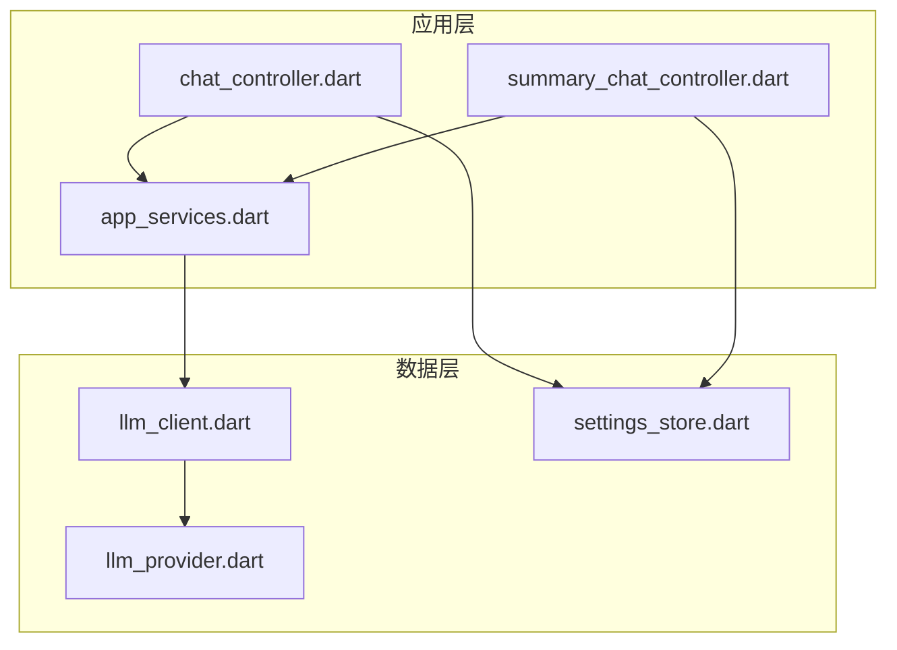
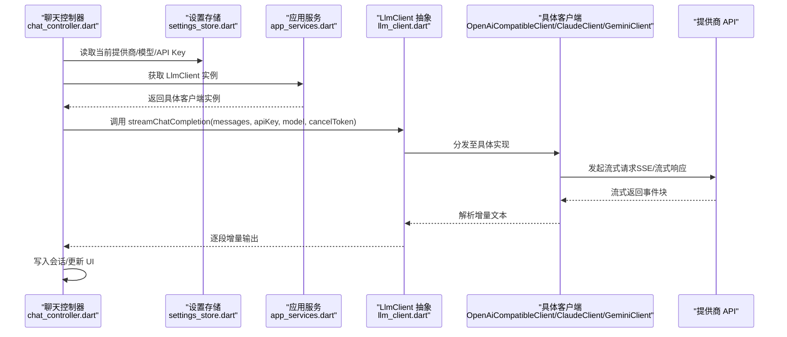
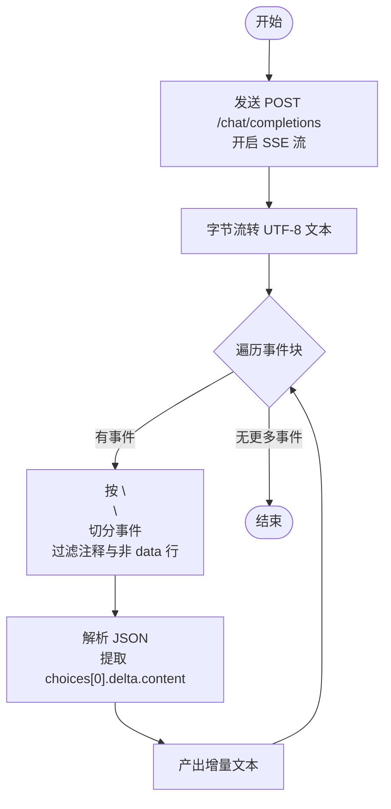
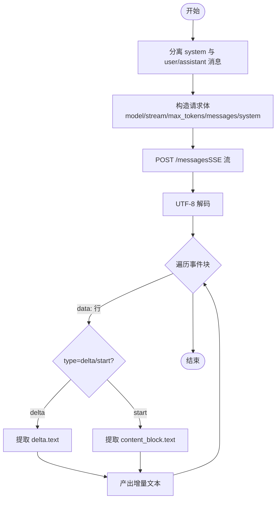
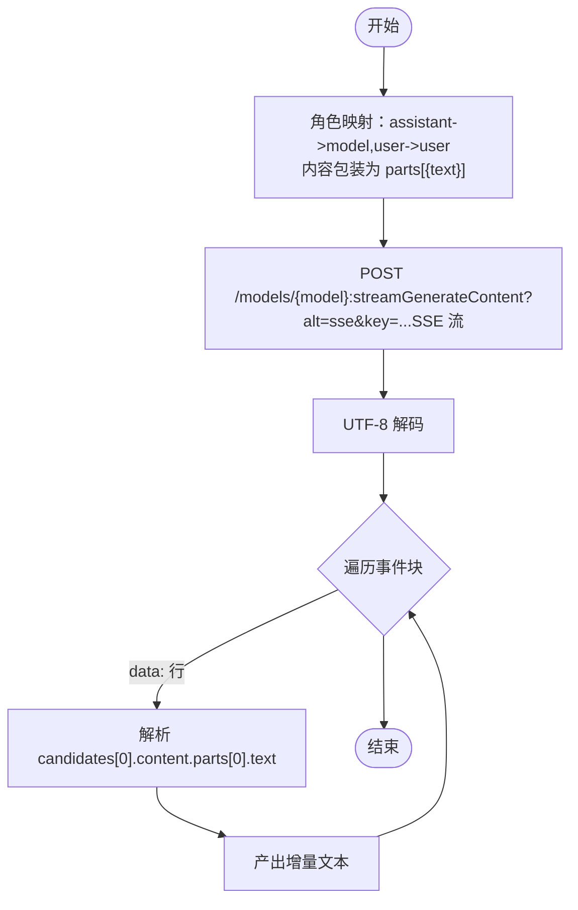
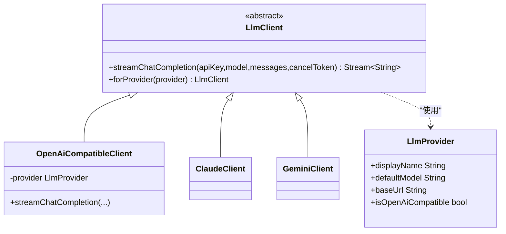
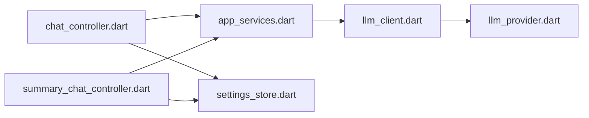

# LLM 客户端

<cite>
**本文引用的文件**
- [lib/data/services/llm_client.dart](file://lib/data/services/llm_client.dart)
- [lib/data/services/llm_provider.dart](file://lib/data/services/llm_provider.dart)
- [lib/ui/core/app_services.dart](file://lib/ui/core/app_services.dart)
- [lib/ui/features/chat/chat_controller.dart](file://lib/ui/features/chat/chat_controller.dart)
- [lib/ui/features/summary/summary_chat_controller.dart](file://lib/ui/features/summary/summary_chat_controller.dart)
- [lib/data/services/settings_store.dart](file://lib/data/services/settings_store.dart)
</cite>

## 目录
1. [简介](#简介)
2. [项目结构](#项目结构)
3. [核心组件](#核心组件)
4. [架构总览](#架构总览)
5. [详细组件分析](#详细组件分析)
6. [依赖关系分析](#依赖关系分析)
7. [性能考虑](#性能考虑)
8. [故障排查指南](#故障排查指南)
9. [结论](#结论)
10. [附录](#附录)

## 简介
本文件面向 ThkTree 项目中的 LLM 客户端实现，系统性阐述 LlmClient 抽象类的设计理念与接口定义，详解 OpenAiCompatibleClient、ClaudeClient、GeminiClient 三类具体实现的差异与适配点；深入解析流式响应处理机制（SSE 解析、事件流缓冲、增量内容提取）；说明不同 LLM 提供商的 API 差异处理（消息格式转换、请求头设置、终止信号处理等）；并给出客户端工厂模式的实现原理与提供商选择逻辑，最后提供流式处理的性能优化与内存管理建议。

## 项目结构
围绕 LLM 客户端的关键文件组织如下：
- 数据层服务：llm_client.dart（抽象与三种实现）、llm_provider.dart（提供商枚举与默认配置）
- 应用层服务：app_services.dart（Riverpod 提供者，负责注入 LlmClient 实例）
- 控制器层：chat_controller.dart、summary_chat_controller.dart（调用 LlmClient 进行流式生成）
- 设置层：settings_store.dart（保存/加载 API Key、模型名、提供商）

图表来源
- [lib/ui/features/chat/chat_controller.dart:147-215](file://lib/ui/features/chat/chat_controller.dart#L147-L215)
- [lib/ui/features/summary/summary_chat_controller.dart:218-249](file://lib/ui/features/summary/summary_chat_controller.dart#L218-L249)
- [lib/ui/core/app_services.dart:67-70](file://lib/ui/core/app_services.dart#L67-L70)
- [lib/data/services/llm_client.dart:8-31](file://lib/data/services/llm_client.dart#L8-L31)
- [lib/data/services/llm_provider.dart:1-95](file://lib/data/services/llm_provider.dart#L1-L95)
- [lib/data/services/settings_store.dart:117-156](file://lib/data/services/settings_store.dart#L117-L156)

章节来源
- [lib/data/services/llm_client.dart:1-318](file://lib/data/services/llm_client.dart#L1-L318)
- [lib/data/services/llm_provider.dart:1-110](file://lib/data/services/llm_provider.dart#L1-L110)
- [lib/ui/core/app_services.dart:67-70](file://lib/ui/core/app_services.dart#L67-L70)
- [lib/ui/features/chat/chat_controller.dart:147-215](file://lib/ui/features/chat/chat_controller.dart#L147-L215)
- [lib/ui/features/summary/summary_chat_controller.dart:218-249](file://lib/ui/features/summary/summary_chat_controller.dart#L218-L249)
- [lib/data/services/settings_store.dart:117-156](file://lib/data/services/settings_store.dart#L117-L156)

## 核心组件
- LlmClient 抽象类：定义统一的流式对话接口，屏蔽不同提供商的差异。
- OpenAiCompatibleClient：封装 OpenAI 兼容风格的流式接口（含 DeepSeek、Minimax、Kimi 等）。
- ClaudeClient：封装 Anthropic Claude 的消息接口与系统提示处理。
- GeminiClient：封装 Google Gemini 的内容结构与 SSE 参数。
- LlmProvider 枚举：集中管理提供商的基础信息（显示名、默认模型、基础地址、是否兼容 OpenAI、上下文窗口等）。
- 工厂方法 LlmClient.forProvider：根据设置选择具体实现。
- 使用方：聊天控制器通过 Riverpod 获取 LlmClient 实例，并将消息历史转换为各提供商可接受的格式后发起请求。

章节来源
- [lib/data/services/llm_client.dart:8-31](file://lib/data/services/llm_client.dart#L8-L31)
- [lib/data/services/llm_provider.dart:1-95](file://lib/data/services/llm_provider.dart#L1-L95)
- [lib/ui/core/app_services.dart:67-70](file://lib/ui/core/app_services.dart#L67-L70)

## 架构总览
下图展示从控制器到客户端再到各提供商的调用链路与关键数据转换：

图表来源
- [lib/ui/features/chat/chat_controller.dart:147-215](file://lib/ui/features/chat/chat_controller.dart#L147-L215)
- [lib/ui/core/app_services.dart:67-70](file://lib/ui/core/app_services.dart#L67-L70)
- [lib/data/services/llm_client.dart:11-31](file://lib/data/services/llm_client.dart#L11-L31)
- [lib/data/services/settings_store.dart:117-156](file://lib/data/services/settings_store.dart#L117-L156)

## 详细组件分析

### LlmClient 抽象类与工厂
- 接口定义：统一的 streamChatCompletion 方法，接收 apiKey、model、messages、cancelToken 四个参数，返回 Stream<String> 增量文本流。
- 工厂方法：根据 LlmProvider 枚举选择具体实现：
  - OpenAI 兼容族（DeepSeek/OpenAI/Minimax/Kimi）：返回 OpenAiCompatibleClient。
  - Claude：返回 ClaudeClient。
  - Gemini：返回 GeminiClient。

章节来源
- [lib/data/services/llm_client.dart:8-31](file://lib/data/services/llm_client.dart#L8-L31)
- [lib/data/services/llm_provider.dart:60-71](file://lib/data/services/llm_provider.dart#L60-L71)

### OpenAiCompatibleClient（通用 OpenAI 兼容接口）
- 请求路径与参数：POST /chat/completions，启用流式（stream=true），携带 Authorization、Accept 等头部。
- 消息格式：直接透传 messages（role/content）。
- 流式解析：
  - 将响应体字节流解码为 UTF-8 文本。
  - 使用缓冲区按双换行符分隔事件块。
  - 忽略注释行与非 data 行，解析 data JSON，提取 choices[0].delta.content。
  - 遇到 [DONE] 终止。
- 错误处理：空响应体抛出状态异常；上层监听 onError 并记录日志。

图表来源
- [lib/data/services/llm_client.dart:38-100](file://lib/data/services/llm_client.dart#L38-L100)

章节来源
- [lib/data/services/llm_client.dart:38-100](file://lib/data/services/llm_client.dart#L38-L100)

### ClaudeClient（Anthropic Claude API 集成）
- 请求路径与参数：POST /messages，启用流式（stream=true），使用 x-api-key 与 anthropic-version 头部。
- 消息格式转换：
  - 将 messages 中 role='system' 的消息单独提取为 system 字段。
  - 其余 user/assistant 消息作为 messages 数组提交。
- 流式解析：
  - 事件块中仅处理以 data: 开头的行。
  - 支持 content_block_delta 与 content_block_start 两种类型，提取其中 text 字段。
- 终止条件：流结束即完成。

图表来源
- [lib/data/services/llm_client.dart:103-182](file://lib/data/services/llm_client.dart#L103-L182)

章节来源
- [lib/data/services/llm_client.dart:103-182](file://lib/data/services/llm_client.dart#L103-L182)

### GeminiClient（Google Gemini API 集成）
- 请求路径与参数：POST /models/{model}:streamGenerateContent，查询参数 alt=sse&key={apiKey}，使用 Content-Type。
- 消息格式转换：
  - 将 role='assistant' 映射为 model，其余为 user。
  - 将 content 包装为 parts[{text}] 结构。
- 流式解析：
  - 事件块中仅处理以 data: 开头的行。
  - 解析 candidates[0].content.parts[0].text。
- 终止条件：流结束即完成。

图表来源
- [lib/data/services/llm_client.dart:185-252](file://lib/data/services/llm_client.dart#L185-L252)

章节来源
- [lib/data/services/llm_client.dart:185-252](file://lib/data/services/llm_client.dart#L185-L252)

### 流式响应处理机制（SSE/事件流/增量提取）
- 协议解析：统一采用 SSE（text/event-stream）协议，按双换行符分割事件块。
- 事件流缓冲：使用 StringBuffer 缓冲流片段，避免跨包边界丢失。
- 增量内容提取：
  - OpenAI 兼容：choices[0].delta.content
  - Claude：content_block_delta/delta 或 content_block_start 的 text
  - Gemini：candidates[0].content.parts[0].text
- 终止信号：OpenAI 兼容实现检测 [DONE] 后返回；Claude/Gemini 以流结束为完成信号。

章节来源
- [lib/data/services/llm_client.dart:69-100](file://lib/data/services/llm_client.dart#L69-L100)
- [lib/data/services/llm_client.dart:157-182](file://lib/data/services/llm_client.dart#L157-L182)
- [lib/data/services/llm_client.dart:227-252](file://lib/data/services/llm_client.dart#L227-L252)
- [lib/data/services/llm_client.dart:255-317](file://lib/data/services/llm_client.dart#L255-L317)

### 不同提供商的 API 差异处理
- 消息格式：
  - OpenAI 兼容：messages 数组，role/content。
  - Claude：messages 数组 + 可选 system 字符串。
  - Gemini：contents 数组，每个元素含 role 与 parts[{text}]。
- 头部参数：
  - OpenAI 兼容：Authorization: Bearer apiKey，Accept: text/event-stream。
  - Claude：x-api-key，anthropic-version。
  - Gemini：Content-Type。
- 终止与错误：
  - OpenAI 兼容：检测 [DONE]；空响应体抛错。
  - Claude/Gemini：流结束即完成；上层捕获网络异常并标记失败。

章节来源
- [lib/data/services/llm_client.dart:44-62](file://lib/data/services/llm_client.dart#L44-L62)
- [lib/data/services/llm_client.dart:138-150](file://lib/data/services/llm_client.dart#L138-L150)
- [lib/data/services/llm_client.dart:210-220](file://lib/data/services/llm_client.dart#L210-L220)
- [lib/data/services/llm_client.dart:64-67](file://lib/data/services/llm_client.dart#L64-L67)
- [lib/ui/features/chat/chat_controller.dart:186-200](file://lib/ui/features/chat/chat_controller.dart#L186-L200)

### 客户端工厂模式与提供商选择逻辑
- 工厂方法：LlmClient.forProvider 根据 LlmProvider.isOpenAiCompatible 判断是否走 OpenAiCompatibleClient。
- 设置来源：AppSettings 从安全存储中读取当前提供商与模型，Riverpod 提供者 llmClientProvider 注入具体客户端实例。
- 使用流程：控制器在发起流式生成前，先读取设置，再获取 LlmClient 实例，随后构建消息并调用接口。

图表来源
- [lib/data/services/llm_client.dart:8-31](file://lib/data/services/llm_client.dart#L8-L31)
- [lib/data/services/llm_provider.dart:1-95](file://lib/data/services/llm_provider.dart#L1-L95)

章节来源
- [lib/data/services/llm_client.dart:18-30](file://lib/data/services/llm_client.dart#L18-L30)
- [lib/ui/core/app_services.dart:67-70](file://lib/ui/core/app_services.dart#L67-L70)
- [lib/data/services/settings_store.dart:117-156](file://lib/data/services/settings_store.dart#L117-L156)

## 依赖关系分析
- 控制器依赖设置存储与 Riverpod 提供者，间接依赖 LlmProvider 与 LlmClient。
- LlmClient 依赖 LlmProvider 的基础信息（URL、默认模型、兼容性标识）。
- 三个具体客户端均基于 Dio 的流式响应能力，统一进行 SSE 解析与增量提取。

图表来源
- [lib/ui/features/chat/chat_controller.dart:147-215](file://lib/ui/features/chat/chat_controller.dart#L147-L215)
- [lib/ui/features/summary/summary_chat_controller.dart:218-249](file://lib/ui/features/summary/summary_chat_controller.dart#L218-L249)
- [lib/ui/core/app_services.dart:67-70](file://lib/ui/core/app_services.dart#L67-L70)
- [lib/data/services/llm_client.dart:8-31](file://lib/data/services/llm_client.dart#L8-L31)
- [lib/data/services/llm_provider.dart:1-95](file://lib/data/services/llm_provider.dart#L1-L95)
- [lib/data/services/settings_store.dart:117-156](file://lib/data/services/settings_store.dart#L117-L156)

章节来源
- [lib/ui/features/chat/chat_controller.dart:147-215](file://lib/ui/features/chat/chat_controller.dart#L147-L215)
- [lib/ui/features/summary/summary_chat_controller.dart:218-249](file://lib/ui/features/summary/summary_chat_controller.dart#L218-L249)
- [lib/ui/core/app_services.dart:67-70](file://lib/ui/core/app_services.dart#L67-L70)
- [lib/data/services/llm_client.dart:8-31](file://lib/data/services/llm_client.dart#L8-L31)
- [lib/data/services/llm_provider.dart:1-95](file://lib/data/services/llm_provider.dart#L1-L95)
- [lib/data/services/settings_store.dart:117-156](file://lib/data/services/settings_store.dart#L117-L156)

## 性能考虑
- 流式传输与背压：使用 Dart Stream 逐段产出增量文本，避免一次性累积大量中间结果。
- 缓冲区管理：事件块按双换行符切分，避免跨包边界导致的解析失败；保持最小缓冲长度，及时清空已消费部分。
- JSON 解析健壮性：对每种提供商的 JSON 结构进行严格判型与异常捕获，防止解析失败中断流。
- 取消与并发：使用 CancelToken 支持取消；同一节点同时仅保留一个流生成任务，旧任务被取消后立即释放资源。
- 头部与连接：OpenAI 兼容场景设置 Accept: text/event-stream，减少不必要的 MIME 类型协商开销。
- 上下文窗口与估算：LlmProvider 提供 contextWindowTokens 与 estimateTokens 辅助控制输入长度，避免超限。

章节来源
- [lib/data/services/llm_client.dart:69-100](file://lib/data/services/llm_client.dart#L69-L100)
- [lib/data/services/llm_client.dart:157-182](file://lib/data/services/llm_client.dart#L157-L182)
- [lib/data/services/llm_client.dart:227-252](file://lib/data/services/llm_client.dart#L227-L252)
- [lib/data/services/llm_provider.dart:73-94](file://lib/data/services/llm_provider.dart#L73-L94)
- [lib/ui/features/chat/chat_controller.dart:154-156](file://lib/ui/features/chat/chat_controller.dart#L154-L156)
- [lib/ui/features/chat/chat_controller.dart:170-214](file://lib/ui/features/chat/chat_controller.dart#L170-L214)

## 故障排查指南
- 空响应体：当响应体为空时抛出状态异常，需检查网络连通性与 API Key 是否正确。
- 网络取消：Dio 取消异常需忽略并正常结束；确保取消令牌在新请求开始前正确传递。
- SSE 解析失败：若某行不是 data: 开头或 JSON 解析失败，应跳过该行并继续解析后续事件。
- 终止信号：OpenAI 兼容场景需等待 [DONE]；Claude/Gemini 以流结束为完成信号。
- 错误上报：控制器在 onError 中记录日志并标记会话失败，便于定位问题。

章节来源
- [lib/data/services/llm_client.dart:64-67](file://lib/data/services/llm_client.dart#L64-L67)
- [lib/ui/features/chat/chat_controller.dart:186-200](file://lib/ui/features/chat/chat_controller.dart#L186-L200)

## 结论
ThkTree 的 LLM 客户端通过统一抽象与工厂模式，将多家提供商的差异封装在具体实现中，使上层控制器无需关心底层细节。OpenAI 兼容、Claude、Gemini 三大实现分别针对其消息格式、头部参数与 SSE 解析特性进行了适配，配合流式增量输出与取消机制，实现了稳定高效的对话体验。结合设置存储与 Riverpod 注入，系统具备良好的扩展性与可维护性。

## 附录
- 关键实现位置参考：
  - 抽象接口与工厂：[lib/data/services/llm_client.dart:8-31](file://lib/data/services/llm_client.dart#L8-L31)
  - OpenAI 兼容实现：[lib/data/services/llm_client.dart:38-100](file://lib/data/services/llm_client.dart#L38-L100)
  - Claude 实现：[lib/data/services/llm_client.dart:103-182](file://lib/data/services/llm_client.dart#L103-L182)
  - Gemini 实现：[lib/data/services/llm_client.dart:185-252](file://lib/data/services/llm_client.dart#L185-L252)
  - 提供商枚举与默认配置：[lib/data/services/llm_provider.dart:1-95](file://lib/data/services/llm_provider.dart#L1-L95)
  - 客户端注入与使用：[lib/ui/core/app_services.dart:67-70](file://lib/ui/core/app_services.dart#L67-L70)，[lib/ui/features/chat/chat_controller.dart:147-215](file://lib/ui/features/chat/chat_controller.dart#L147-L215)，[lib/ui/features/summary/summary_chat_controller.dart:218-249](file://lib/ui/features/summary/summary_chat_controller.dart#L218-L249)
  - 设置存储与模型选择：[lib/data/services/settings_store.dart:117-156](file://lib/data/services/settings_store.dart#L117-L156)