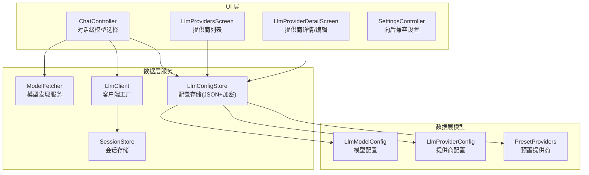
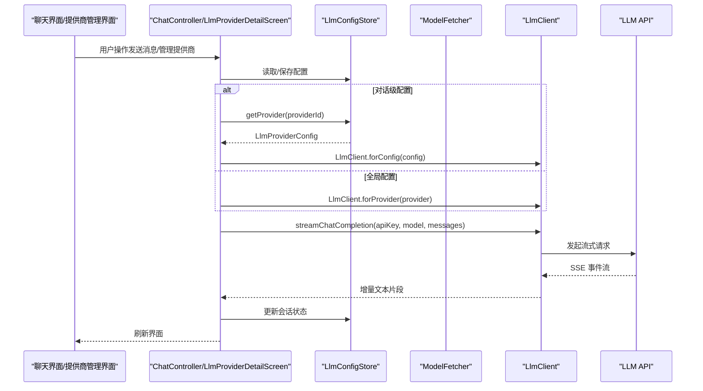
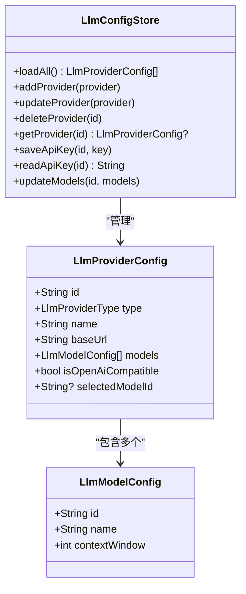
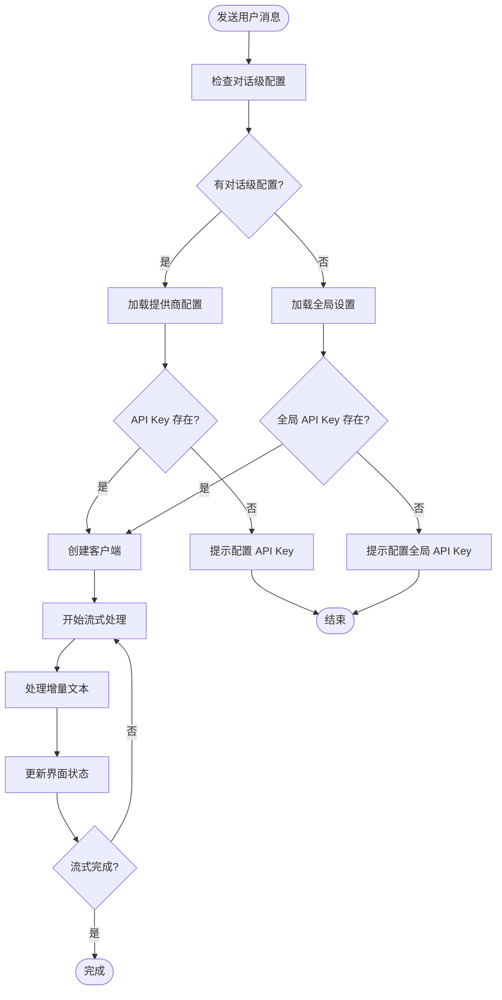
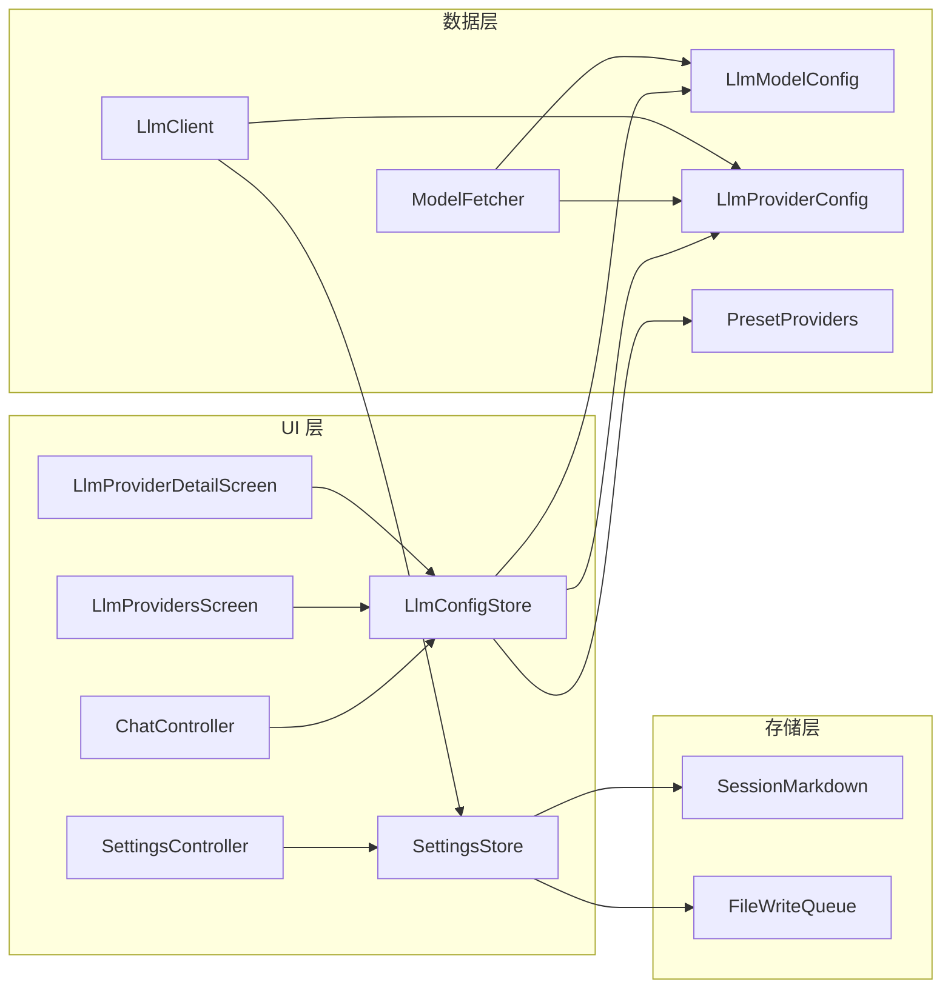

# LLM 集成

<cite>
**本文引用的文件**
- [lib/data/models/llm_model_config.dart](file://lib/data/models/llm_model_config.dart)
- [lib/data/models/llm_provider_config.dart](file://lib/data/models/llm_provider_config.dart)
- [lib/data/models/preset_providers.dart](file://lib/data/models/preset_providers.dart)
- [lib/data/services/model_fetcher.dart](file://lib/data/services/model_fetcher.dart)
- [lib/data/stores/llm_config_store.dart](file://lib/data/stores/llm_config_store.dart)
- [lib/data/services/llm_client.dart](file://lib/data/services/llm_client.dart)
- [lib/data/services/llm_provider.dart](file://lib/data/services/llm_provider.dart)
- [lib/data/services/settings_store.dart](file://lib/data/services/settings_store.dart)
- [lib/data/services/session_markdown.dart](file://lib/data/services/session_markdown.dart)
- [lib/data/stores/session_store.dart](file://lib/data/stores/session_store.dart)
- [lib/data/services/file_write_queue.dart](file://lib/data/services/file_write_queue.dart)
- [lib/ui/features/chat/chat_controller.dart](file://lib/ui/features/chat/chat_controller.dart)
- [lib/ui/features/chat/chat_screen.dart](file://lib/ui/features/chat/chat_screen.dart)
- [lib/ui/features/summary/summary_chat_controller.dart](file://lib/ui/features/summary/summary_chat_controller.dart)
- [lib/ui/features/summary/summary_chat_screen.dart](file://lib/ui/features/summary/summary_chat_screen.dart)
- [lib/ui/features/settings/settings_screen.dart](file://lib/ui/features/settings/settings_screen.dart)
- [lib/ui/features/settings/settings_controller.dart](file://lib/ui/features/settings/settings_controller.dart)
- [lib/ui/features/llm/llm_providers_screen.dart](file://lib/ui/features/llm/llm_providers_screen.dart)
- [lib/ui/features/llm/llm_provider_detail_screen.dart](file://lib/ui/features/llm/llm_provider_detail_screen.dart)
</cite>

## 更新摘要
**所做更改**
- 完全重构 LLM 集成架构，引入新的多提供商支持系统
- 新增基于配置的提供商管理，支持预置和自定义提供商
- 实现模型发现服务和动态模型列表获取功能
- 更新配置存储系统，支持加密存储和迁移机制
- 重新设计客户端工厂，支持基于配置的客户端创建
- 扩展 UI 层以支持新的提供商管理和模型选择功能

## 目录
1. [简介](#简介)
2. [项目结构](#项目结构)
3. [核心组件](#核心组件)
4. [架构总览](#架构总览)
5. [组件详解](#组件详解)
6. [依赖关系分析](#依赖关系分析)
7. [性能与优化](#性能与优化)
8. [故障排除指南](#故障排除指南)
9. [结论](#结论)
10. [附录：扩展新提供商指南](#附录扩展新提供商指南)

## 简介
本文档系统性阐述 ThkTree 中重构后的 LLM 集成设计与实现，覆盖以下主题：
- 完整的多提供商支持架构，包括预置提供商和自定义提供商
- 基于配置的模型发现服务和动态模型列表获取
- 新的配置存储系统，支持加密存储和迁移机制
- 增强的客户端工厂，支持基于配置的客户端创建
- 对话处理流程改进，包括对话级模型选择和上下文管理
- 配置管理与 API 密钥安全存储
- 错误处理、网络异常与取消控制
- 性能优化与最佳实践
- 扩展支持新 LLM 提供商的方法

## 项目结构
围绕重构后的 LLM 集成，关键目录与文件如下：

**数据层模型**
- LLM 模型配置：LlmModelConfig
- LLM 提供商配置：LlmProviderConfig 及其类型枚举
- 预置提供商：createPresetProviders()

**数据层服务**
- 模型发现服务：ModelFetcher（支持 OpenAI 兼容、Anthropic、Gemini）
- 配置存储：LlmConfigStore（JSON 文件 + 加密存储）
- LLM 客户端：LlmClient 及其配置驱动版本
- 设置存储：SettingsStore（向后兼容）

**域与存储**
- 会话存储：SessionStore（负责消息持久化与流式标记）
- 会话 Markdown：SessionMarkdown（消息解析）
- 文件写入队列：FileWriteQueue（串行写入）

**UI 层**
- 聊天控制器：ChatController（支持对话级模型选择）
- 提供商管理：LlmProvidersScreen、LlmProviderDetailScreen
- 设置控制器：SettingsController（向后兼容）

**图表来源**
- [lib/ui/features/chat/chat_controller.dart:19-102](file://lib/ui/features/chat/chat_controller.dart#L19-L102)
- [lib/ui/features/llm/llm_providers_screen.dart:10-48](file://lib/ui/features/llm/llm_providers_screen.dart#L10-L48)
- [lib/ui/features/llm/llm_provider_detail_screen.dart:13-24](file://lib/ui/features/llm/llm_provider_detail_screen.dart#L13-L24)
- [lib/data/models/llm_model_config.dart:1-39](file://lib/data/models/llm_model_config.dart#L1-L39)
- [lib/data/models/llm_provider_config.dart:36-107](file://lib/data/models/llm_provider_config.dart#L36-L107)
- [lib/data/models/preset_providers.dart:8-67](file://lib/data/models/preset_providers.dart#L8-L67)
- [lib/data/services/model_fetcher.dart:17-53](file://lib/data/services/model_fetcher.dart#L17-L53)
- [lib/data/stores/llm_config_store.dart:12-48](file://lib/data/stores/llm_config_store.dart#L12-L48)
- [lib/data/services/llm_client.dart:9-58](file://lib/data/services/llm_client.dart#L9-L58)

**章节来源**
- [lib/data/models/llm_model_config.dart:1-39](file://lib/data/models/llm_model_config.dart#L1-L39)
- [lib/data/models/llm_provider_config.dart:1-108](file://lib/data/models/llm_provider_config.dart#L1-L108)
- [lib/data/models/preset_providers.dart:1-67](file://lib/data/models/preset_providers.dart#L1-L67)
- [lib/data/services/model_fetcher.dart:1-240](file://lib/data/services/model_fetcher.dart#L1-L240)
- [lib/data/stores/llm_config_store.dart:1-234](file://lib/data/stores/llm_config_store.dart#L1-L234)
- [lib/data/services/llm_client.dart:1-433](file://lib/data/services/llm_client.dart#L1-L433)
- [lib/ui/features/chat/chat_controller.dart:1-352](file://lib/ui/features/chat/chat_controller.dart#L1-L352)
- [lib/ui/features/llm/llm_providers_screen.dart:1-123](file://lib/ui/features/llm/llm_providers_screen.dart#L1-L123)
- [lib/ui/features/llm/llm_provider_detail_screen.dart:1-399](file://lib/ui/features/llm/llm_provider_detail_screen.dart#L1-L399)

## 核心组件
- **LlmProviderConfig 与 LlmModelConfig**
  - LlmProviderConfig：包含提供商类型、名称、基础 URL、模型列表、兼容性标志等
  - LlmModelConfig：包含模型标识、显示名称、上下文窗口大小
  - 支持预置提供商和自定义提供商的统一配置模型

- **LlmConfigStore**
  - JSON 文件存储提供商配置（应用文档目录）
  - FlutterSecureStorage 加密存储 API Key（键名：llm_key_{providerId}）
  - 支持初始化、迁移、缓存管理
  - 提供提供商 CRUD 操作和模型列表更新

- **ModelFetcher**
  - 统一的模型发现服务，支持多种提供商类型
  - OpenAI 兼容接口：GET /models
  - Anthropic 接口：GET /models + x-api-key 头
  - Gemini 接口：GET /models?key= + generateContent 支持检查
  - 智能过滤非聊天模型（embedding、whisper、tts、dall-e）

- **增强的 LlmClient 工厂**
  - 传统工厂：LlmClient.forProvider（基于 LlmProvider 枚举）
  - 配置工厂：LlmClient.forConfig（基于 LlmProviderConfig）
  - 支持 OpenAI 兼容、Anthropic、Gemini 三种客户端类型
  - ConfigBasedOpenAiCompatibleClient 支持任意 baseUrl

- **ChatController 改进**
  - 支持对话级模型选择（providerId + modelId）
  - 优先使用对话级配置，回退到全局设置
  - 动态加载会话级模型信息
  - 增强的错误处理和状态管理

**章节来源**
- [lib/data/models/llm_provider_config.dart:36-107](file://lib/data/models/llm_provider_config.dart#L36-L107)
- [lib/data/models/llm_model_config.dart:1-39](file://lib/data/models/llm_model_config.dart#L1-L39)
- [lib/data/stores/llm_config_store.dart:12-149](file://lib/data/stores/llm_config_store.dart#L12-L149)
- [lib/data/services/model_fetcher.dart:17-240](file://lib/data/services/model_fetcher.dart#L17-L240)
- [lib/data/services/llm_client.dart:9-58](file://lib/data/services/llm_client.dart#L9-L58)
- [lib/ui/features/chat/chat_controller.dart:19-102](file://lib/ui/features/chat/chat_controller.dart#L19-L102)

## 架构总览
重构后的 LLM 集成采用分层架构，支持多提供商和动态配置管理。

**图表来源**
- [lib/ui/features/chat/chat_controller.dart:178-240](file://lib/ui/features/chat/chat_controller.dart#L178-L240)
- [lib/ui/features/llm/llm_provider_detail_screen.dart:228-272](file://lib/ui/features/llm/llm_provider_detail_screen.dart#L228-L272)
- [lib/data/stores/llm_config_store.dart:76-84](file://lib/data/stores/llm_config_store.dart#L76-L84)
- [lib/data/services/llm_client.dart:33-57](file://lib/data/services/llm_client.dart#L33-L57)

## 组件详解

### 配置管理系统
**LlmProviderConfig 与 LlmModelConfig**
- LlmProviderConfig：统一的提供商配置模型，支持预置和自定义提供商
- LlmModelConfig：标准化的模型配置，包含上下文窗口信息
- 支持 JSON 序列化/反序列化，便于持久化存储

**LlmConfigStore**
- JSON 文件存储：`llm_providers.json`（应用文档目录）
- 加密存储：API Key 通过 FlutterSecureStorage 单独加密存储
- 初始化机制：createPresetProviders() 创建预置提供商
- 迁移机制：支持从旧配置格式迁移（llm_config_migrated 标记）

**图表来源**
- [lib/data/models/llm_provider_config.dart:36-107](file://lib/data/models/llm_provider_config.dart#L36-L107)
- [lib/data/models/llm_model_config.dart:1-39](file://lib/data/models/llm_model_config.dart#L1-L39)
- [lib/data/stores/llm_config_store.dart:17-149](file://lib/data/stores/llm_config_store.dart#L17-L149)

**章节来源**
- [lib/data/models/llm_provider_config.dart:36-107](file://lib/data/models/llm_provider_config.dart#L36-L107)
- [lib/data/models/llm_model_config.dart:1-39](file://lib/data/models/llm_model_config.dart#L1-L39)
- [lib/data/stores/llm_config_store.dart:17-234](file://lib/data/stores/llm_config_store.dart#L17-L234)

### 模型发现服务
**ModelFetcher 功能特性**
- 统一的模型发现接口，支持多种提供商类型
- 智能上下文窗口解析：context_window、context_length、max_tokens
- 非聊天模型过滤：embedding、whisper、tts、dall-e
- 错误处理：HTTP 401/403 特殊处理，网络异常统一捕获

**API 支持矩阵**
- OpenAI 兼容：GET {baseUrl}/models（Authorization: Bearer）
- Anthropic：GET {baseUrl}/models（x-api-key + anthropic-version）
- Gemini：GET {baseUrl}/models?key={apiKey}（generateContent 支持检查）

**章节来源**
- [lib/data/services/model_fetcher.dart:17-240](file://lib/data/services/model_fetcher.dart#L17-L240)

### 客户端工厂重构
**LlmClient 工厂模式**
- 传统工厂：LlmClient.forProvider（基于 LlmProvider 枚举）
- 配置工厂：LlmClient.forConfig（基于 LlmProviderConfig）
- ConfigBasedOpenAiCompatibleClient：支持任意 baseUrl 的 OpenAI 兼容客户端

**客户端类型**
- OpenAiCompatibleClient：标准 OpenAI 兼容接口
- ConfigBasedOpenAiCompatibleClient：配置驱动的 OpenAI 兼容客户端
- ClaudeClient：Anthropic Claude 接口
- GeminiClient：Google Gemini 接口

**章节来源**
- [lib/data/services/llm_client.dart:9-58](file://lib/data/services/llm_client.dart#L9-L58)
- [lib/data/services/llm_client.dart:130-204](file://lib/data/services/llm_client.dart#L130-L204)
- [lib/data/services/llm_client.dart:206-368](file://lib/data/services/llm_client.dart#L206-L368)

### 对话处理流程改进
**对话级模型选择**
- ChatController 支持对话级 providerId + modelId
- 从 session.md frontmatter 加载对话级配置
- 优先使用对话级配置，不存在时回退到全局设置
- 动态切换模型：switchModel(providerId, modelId)

**增强的错误处理**
- 对话级提供商不存在：提示用户切换模型
- API Key 未配置：提示用户配置提供商 API Key
- 增强的流式处理：乐观更新、取消令牌管理、状态同步

**图表来源**
- [lib/ui/features/chat/chat_controller.dart:178-240](file://lib/ui/features/chat/chat_controller.dart#L178-L240)
- [lib/ui/features/chat/chat_controller.dart:256-327](file://lib/ui/features/chat/chat_controller.dart#L256-L327)

**章节来源**
- [lib/ui/features/chat/chat_controller.dart:19-102](file://lib/ui/features/chat/chat_controller.dart#L19-L102)
- [lib/ui/features/chat/chat_controller.dart:178-240](file://lib/ui/features/chat/chat_controller.dart#L178-L240)
- [lib/ui/features/chat/chat_controller.dart:256-327](file://lib/ui/features/chat/chat_controller.dart#L256-L327)

### UI 层扩展
**提供商管理界面**
- LlmProvidersScreen：提供商列表展示，支持添加新提供商
- LlmProviderDetailScreen：提供商详情/编辑，支持模型选择和 API Key 管理
- 支持预置提供商和自定义提供商的统一界面

**对话级模型选择**
- ChatController 支持在聊天界面切换对话使用的模型
- 通过 session.md frontmatter 持久化对话级配置
- UI 层显示当前对话使用的提供商和模型

**章节来源**
- [lib/ui/features/llm/llm_providers_screen.dart:1-123](file://lib/ui/features/llm/llm_providers_screen.dart#L1-L123)
- [lib/ui/features/llm/llm_provider_detail_screen.dart:1-399](file://lib/ui/features/llm/llm_provider_detail_screen.dart#L1-L399)
- [lib/ui/features/chat/chat_controller.dart:89-102](file://lib/ui/features/chat/chat_controller.dart#L89-L102)

## 依赖关系分析
重构后的 LLM 集成采用清晰的分层架构，各组件职责明确：

**图表来源**
- [lib/ui/features/chat/chat_controller.dart:19-102](file://lib/ui/features/chat/chat_controller.dart#L19-L102)
- [lib/ui/features/llm/llm_providers_screen.dart:17-48](file://lib/ui/features/llm/llm_providers_screen.dart#L17-L48)
- [lib/ui/features/llm/llm_provider_detail_screen.dart:71-80](file://lib/ui/features/llm/llm_provider_detail_screen.dart#L71-L80)
- [lib/data/stores/llm_config_store.dart:17-48](file://lib/data/stores/llm_config_store.dart#L17-L48)
- [lib/data/services/llm_client.dart:33-57](file://lib/data/services/llm_client.dart#L33-L57)

**章节来源**
- [lib/ui/features/chat/chat_controller.dart:19-102](file://lib/ui/features/chat/chat_controller.dart#L19-L102)
- [lib/ui/features/llm/llm_providers_screen.dart:17-48](file://lib/ui/features/llm/llm_providers_screen.dart#L17-L48)
- [lib/ui/features/llm/llm_provider_detail_screen.dart:71-80](file://lib/ui/features/llm/llm_provider_detail_screen.dart#L71-L80)
- [lib/data/stores/llm_config_store.dart:17-48](file://lib/data/stores/llm_config_store.dart#L17-L48)
- [lib/data/services/llm_client.dart:33-57](file://lib/data/services/llm_client.dart#L33-L57)

## 性能与优化
**存储优化**
- LlmConfigStore 缓存机制：避免重复读取 JSON 文件
- 增量更新：updateModels() 支持部分更新，减少磁盘 I/O
- 加密存储：API Key 单独加密存储，提高安全性

**网络优化**
- ModelFetcher 超时控制：30 秒连接和接收超时
- 智能错误处理：HTTP 401/403 特殊处理，网络异常统一捕获
- 流式处理优化：UTF-8 解码、缓冲区拼接、事件块处理

**内存优化**
- 增量写入：配合 FileWriteQueue，避免大文件一次性加载
- 取消令牌：每个流式请求独立 CancelToken，及时释放资源
- 对话级配置缓存：ChatController 缓存当前对话的 providerId/modelId

**章节来源**
- [lib/data/stores/llm_config_store.dart:22-48](file://lib/data/stores/llm_config_store.dart#L22-L48)
- [lib/data/services/model_fetcher.dart:19-25](file://lib/data/services/model_fetcher.dart#L19-L25)
- [lib/ui/features/chat/chat_controller.dart:26-30](file://lib/ui/features/chat/chat_controller.dart#L26-L30)

## 故障排除指南
**配置相关问题**
- 预置提供商未初始化：调用 initializeIfNeeded() 自动创建
- 配置迁移失败：检查 llm_config_migrated 标记，重新迁移
- API Key 读取失败：检查 FlutterSecureStorage 访问权限

**模型发现失败**
- HTTP 401/403：检查 API Key 有效性
- 网络超时：检查网络连接和防火墙设置
- 模型过滤：确认模型名称不包含非聊天关键词

**流式处理问题**
- 取消操作：stopStreaming() 正确处理取消令牌
- 错误恢复：onError 中区分取消与网络错误
- 状态同步：乐观更新确保 UI 状态一致性

**章节来源**
- [lib/data/stores/llm_config_store.dart:141-149](file://lib/data/stores/llm_config_store.dart#L141-L149)
- [lib/data/services/model_fetcher.dart:209-230](file://lib/data/services/model_fetcher.dart#L209-L230)
- [lib/ui/features/chat/chat_controller.dart:104-157](file://lib/ui/features/chat/chat_controller.dart#L104-L157)

## 结论
ThkTree 的 LLM 集成经过完全重构，实现了更加灵活和强大的多提供商支持系统。新的架构通过配置驱动的方式，支持预置和自定义提供商，提供了完整的模型发现和管理能力。增强的配置存储系统确保了安全性，而改进的客户端工厂和对话处理流程提升了用户体验。建议在生产环境中进一步完善错误监控、性能指标收集和用户体验优化。

## 附录：扩展新提供商指南
**新增提供商步骤**
1. **更新 LlmProviderType**
   - 在 LlmProviderType 中添加新的提供商类型
   - 实现 displayName 映射

2. **更新预置提供商**
   - 在 createPresetProviders() 中添加新的预置配置
   - 设置唯一的固定 ID（preset_ 前缀 + 类型名）

3. **更新 ModelFetcher**
   - 在 fetchModels() 中添加新的提供商类型分支
   - 实现相应的 API 请求和响应解析逻辑

4. **更新 LlmClient 工厂**
   - 在 LlmClient.forConfig() 中添加新的提供商类型处理
   - 如需特殊处理，创建专用客户端类

5. **更新 UI 层**
   - 在 LlmProvidersScreen 中添加新提供商的显示
   - 在 LlmProviderDetailScreen 中添加新提供商的支持

**注意事项**
- 遵循现有模型发现服务的错误处理模式
- 确保 API Key 的安全存储和传输
- 实现适当的上下文窗口估算和提示
- 测试流式处理的完整生命周期

**章节来源**
- [lib/data/models/llm_provider_config.dart:4-34](file://lib/data/models/llm_provider_config.dart#L4-L34)
- [lib/data/models/preset_providers.dart:8-67](file://lib/data/models/preset_providers.dart#L8-L67)
- [lib/data/services/model_fetcher.dart:44-52](file://lib/data/services/model_fetcher.dart#L44-L52)
- [lib/data/services/llm_client.dart:45-56](file://lib/data/services/llm_client.dart#L45-L56)
- [lib/ui/features/llm/llm_providers_screen.dart:69-70](file://lib/ui/features/llm/llm_providers_screen.dart#L69-L70)