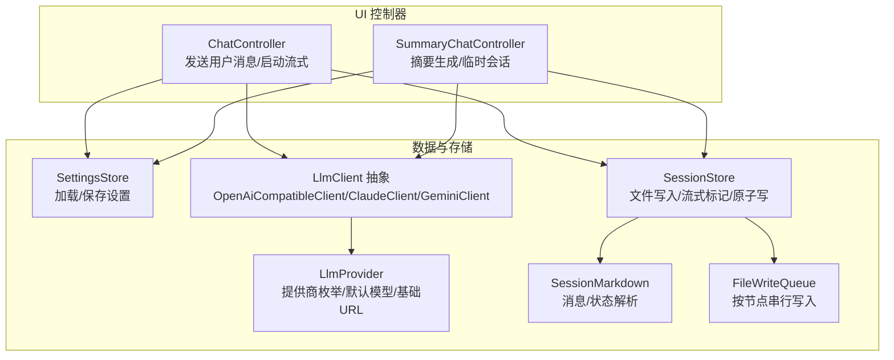
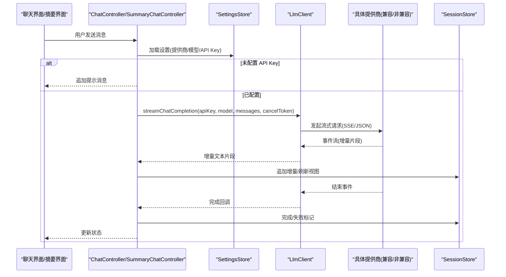
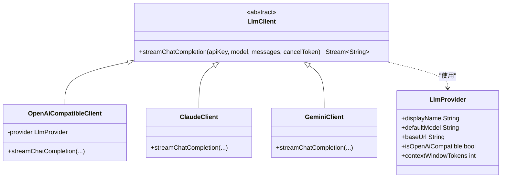
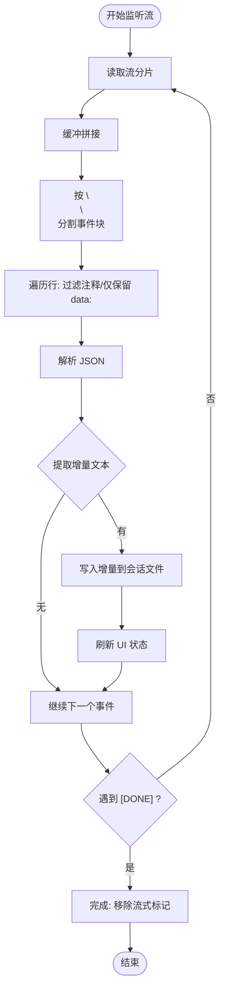
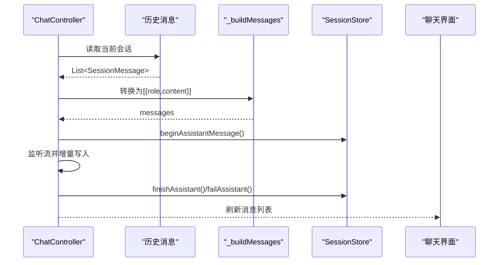
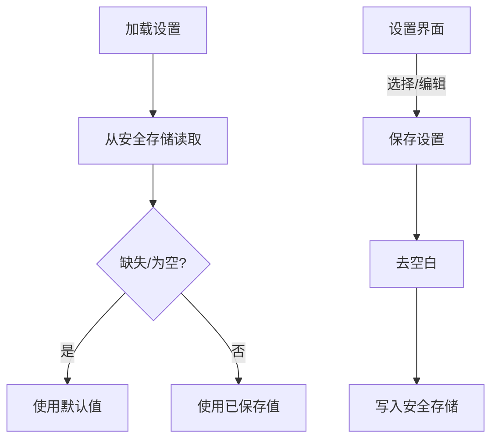
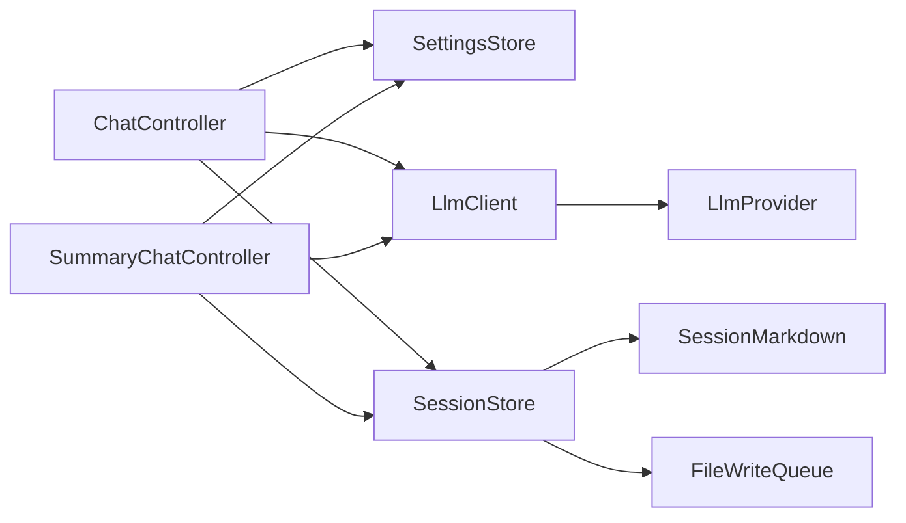

# LLM 集成

<cite>
**本文引用的文件**
- [lib/data/services/llm_client.dart](file://lib/data/services/llm_client.dart)
- [lib/data/services/llm_provider.dart](file://lib/data/services/llm_provider.dart)
- [lib/data/services/settings_store.dart](file://lib/data/services/settings_store.dart)
- [lib/data/services/session_markdown.dart](file://lib/data/services/session_markdown.dart)
- [lib/data/stores/session_store.dart](file://lib/data/stores/session_store.dart)
- [lib/data/services/file_write_queue.dart](file://lib/data/services/file_write_queue.dart)
- [lib/ui/features/chat/chat_controller.dart](file://lib/ui/features/chat/chat_controller.dart)
- [lib/ui/features/chat/chat_screen.dart](file://lib/ui/features/chat/chat_screen.dart)
- [lib/ui/features/summary/summary_chat_controller.dart](file://lib/ui/features/summary/summary_chat_controller.dart)
- [lib/ui/features/summary/summary_chat_screen.dart](file://lib/ui/features/summary/summary_chat_screen.dart)
- [lib/ui/features/settings/settings_screen.dart](file://lib/ui/features/settings/settings_screen.dart)
- [lib/ui/features/settings/settings_controller.dart](file://lib/ui/features/settings/settings_controller.dart)
</cite>

## 目录
1. [简介](#简介)
2. [项目结构](#项目结构)
3. [核心组件](#核心组件)
4. [架构总览](#架构总览)
5. [组件详解](#组件详解)
6. [依赖关系分析](#依赖关系分析)
7. [性能与优化](#性能与优化)
8. [故障排除指南](#故障排除指南)
9. [结论](#结论)
10. [附录：扩展新提供商指南](#附录扩展新提供商指南)

## 简介
本文件系统性阐述 ThkTree 中 LLM 集成的设计与实现，覆盖以下主题：
- LLM 客户端抽象与多提供商适配（DeepSeek、OpenAI、Claude、Gemini、MiniMax、Kimi）
- 流式响应解析与增量渲染机制
- 对话处理流程（消息构建、上下文管理、总结生成）
- 配置管理与 API 密钥安全存储
- 错误处理、网络异常与取消控制
- 性能优化与最佳实践
- 扩展支持新 LLM 提供商的方法

## 项目结构
围绕 LLM 集成的关键目录与文件如下：
- 数据层服务：LLM 客户端、提供商枚举、设置存储、会话 Markdown 解析、文件写入队列
- 域与存储：会话存储（负责消息持久化与流式标记）
- UI 层控制器：聊天控制器与摘要控制器（统一处理流式接收、错误与完成）
- 设置界面：提供选择提供商、输入 API Key、模型名等入口

**图表来源**
- [lib/ui/features/chat/chat_controller.dart:147-215](file://lib/ui/features/chat/chat_controller.dart#L147-L215)
- [lib/ui/features/summary/summary_chat_controller.dart:218-296](file://lib/ui/features/summary/summary_chat_controller.dart#L218-L296)
- [lib/data/services/llm_client.dart:8-31](file://lib/data/services/llm_client.dart#L8-L31)
- [lib/data/services/llm_provider.dart:1-111](file://lib/data/services/llm_provider.dart#L1-L111)
- [lib/data/services/settings_store.dart:106-184](file://lib/data/services/settings_store.dart#L106-L184)
- [lib/data/stores/session_store.dart:1-205](file://lib/data/stores/session_store.dart#L1-L205)
- [lib/data/services/session_markdown.dart:1-223](file://lib/data/services/session_markdown.dart#L1-L223)
- [lib/data/services/file_write_queue.dart:1-12](file://lib/data/services/file_write_queue.dart#L1-L12)

**章节来源**
- [lib/data/services/llm_client.dart:8-31](file://lib/data/services/llm_client.dart#L8-L31)
- [lib/data/services/llm_provider.dart:1-111](file://lib/data/services/llm_provider.dart#L1-L111)
- [lib/data/services/settings_store.dart:106-184](file://lib/data/services/settings_store.dart#L106-L184)
- [lib/data/stores/session_store.dart:1-205](file://lib/data/stores/session_store.dart#L1-L205)
- [lib/data/services/session_markdown.dart:1-223](file://lib/data/services/session_markdown.dart#L1-L223)
- [lib/data/services/file_write_queue.dart:1-12](file://lib/data/services/file_write_queue.dart#L1-L12)
- [lib/ui/features/chat/chat_controller.dart:147-215](file://lib/ui/features/chat/chat_controller.dart#L147-L215)
- [lib/ui/features/summary/summary_chat_controller.dart:218-296](file://lib/ui/features/summary/summary_chat_controller.dart#L218-L296)

## 核心组件
- LlmClient 抽象与工厂
  - 统一接口：streamChatCompletion(apiKey, model, messages, cancelToken)
  - 工厂方法：根据 LlmProvider 返回具体客户端（OpenAI 兼容、Claude、Gemini）
- LlmProvider 枚举
  - 提供显示名、默认模型、基础 URL、是否 OpenAI 兼容、上下文窗口大小等
- SettingsStore
  - 负责从安全存储读取/写入提供商、API Key、模型名、语言
- SessionStore
  - 负责会话文件的读取、追加、流式标记、失败标记、原子写入
- SessionMarkdown
  - 将 Markdown 会话解析为消息对象，识别 streaming/error 状态
- FileWriteQueue
  - 按节点键串行化文件写入，避免并发写冲突
- ChatController / SummaryChatController
  - 发送用户消息、构建历史消息列表、启动流式请求、监听增量、错误处理、完成收尾

**章节来源**
- [lib/data/services/llm_client.dart:8-31](file://lib/data/services/llm_client.dart#L8-L31)
- [lib/data/services/llm_provider.dart:1-111](file://lib/data/services/llm_provider.dart#L1-L111)
- [lib/data/services/settings_store.dart:106-184](file://lib/data/services/settings_store.dart#L106-L184)
- [lib/data/stores/session_store.dart:1-205](file://lib/data/stores/session_store.dart#L1-L205)
- [lib/data/services/session_markdown.dart:1-223](file://lib/data/services/session_markdown.dart#L1-L223)
- [lib/data/services/file_write_queue.dart:1-12](file://lib/data/services/file_write_queue.dart#L1-L12)
- [lib/ui/features/chat/chat_controller.dart:147-215](file://lib/ui/features/chat/chat_controller.dart#L147-L215)
- [lib/ui/features/summary/summary_chat_controller.dart:218-296](file://lib/ui/features/summary/summary_chat_controller.dart#L218-L296)

## 架构总览
下图展示从 UI 到 LLM 的端到端调用链路，以及会话存储与流式增量更新的交互。

**图表来源**
- [lib/ui/features/chat/chat_controller.dart:147-215](file://lib/ui/features/chat/chat_controller.dart#L147-L215)
- [lib/ui/features/summary/summary_chat_controller.dart:218-296](file://lib/ui/features/summary/summary_chat_controller.dart#L218-L296)
- [lib/data/services/llm_client.dart:38-100](file://lib/data/services/llm_client.dart#L38-L100)
- [lib/data/stores/session_store.dart:100-148](file://lib/data/stores/session_store.dart#L100-L148)
- [lib/data/services/settings_store.dart:117-156](file://lib/data/services/settings_store.dart#L117-L156)

## 组件详解

### LLM 客户端与提供商适配
- OpenAI 兼容客户端（DeepSeek/OpenAI/MiniMax/Kimi）
  - 使用 SSE 文本事件流，逐条解析 data 行，提取 choices[0].delta.content
  - 支持取消令牌，空响应体时抛出状态错误
- Claude 客户端
  - 系统消息与用户/助手消息分离；使用 anthropic-version 头
  - 解析 data: content_block_delta 或 content_block_start 的 text 字段
- Gemini 客户端
  - 使用 Google Generative Language API 的 SSE 接口
  - 解析 candidates[0].content.parts[0].text
- 提供商枚举
  - 提供 displayName/defaultModel/baseUrl/isOpenAiCompatible/contextWindowTokens
  - 用于 UI 显示与上下文估算

**图表来源**
- [lib/data/services/llm_client.dart:8-31](file://lib/data/services/llm_client.dart#L8-L31)
- [lib/data/services/llm_client.dart:33-101](file://lib/data/services/llm_client.dart#L33-L101)
- [lib/data/services/llm_client.dart:103-183](file://lib/data/services/llm_client.dart#L103-L183)
- [lib/data/services/llm_client.dart:185-253](file://lib/data/services/llm_client.dart#L185-L253)
- [lib/data/services/llm_provider.dart:1-111](file://lib/data/services/llm_provider.dart#L1-L111)

**章节来源**
- [lib/data/services/llm_client.dart:33-101](file://lib/data/services/llm_client.dart#L33-L101)
- [lib/data/services/llm_client.dart:103-183](file://lib/data/services/llm_client.dart#L103-L183)
- [lib/data/services/llm_client.dart:185-253](file://lib/data/services/llm_client.dart#L185-L253)
- [lib/data/services/llm_client.dart:255-318](file://lib/data/services/llm_client.dart#L255-L318)
- [lib/data/services/llm_provider.dart:1-111](file://lib/data/services/llm_provider.dart#L1-L111)

### 流式响应解析与增量渲染
- OpenAI 兼容流式解析
  - 以 \n\n 分割事件块，过滤注释行，提取 data: 行，解析 JSON，取 choices[0].delta.content
- Claude 流式解析
  - 支持 content_block_delta 与 content_block_start 两种事件类型
- Gemini 流式解析
  - 解析 candidates[0].content.parts[0].text
- 增量写入与 UI 刷新
  - 控制器在 onListen 中逐个增量写入 SessionStore，并更新状态
  - onDone 清理句柄与取消令牌；onError 记录错误并标记失败

**图表来源**
- [lib/data/services/llm_client.dart:44-100](file://lib/data/services/llm_client.dart#L44-L100)
- [lib/data/services/llm_client.dart:138-182](file://lib/data/services/llm_client.dart#L138-L182)
- [lib/data/services/llm_client.dart:210-252](file://lib/data/services/llm_client.dart#L210-L252)
- [lib/ui/features/chat/chat_controller.dart:171-214](file://lib/ui/features/chat/chat_controller.dart#L171-L214)
- [lib/ui/features/summary/summary_chat_controller.dart:252-295](file://lib/ui/features/summary/summary_chat_controller.dart#L252-L295)

**章节来源**
- [lib/data/services/llm_client.dart:44-100](file://lib/data/services/llm_client.dart#L44-L100)
- [lib/data/services/llm_client.dart:138-182](file://lib/data/services/llm_client.dart#L138-L182)
- [lib/data/services/llm_client.dart:210-252](file://lib/data/services/llm_client.dart#L210-L252)
- [lib/ui/features/chat/chat_controller.dart:171-214](file://lib/ui/features/chat/chat_controller.dart#L171-L214)
- [lib/ui/features/summary/summary_chat_controller.dart:252-295](file://lib/ui/features/summary/summary_chat_controller.dart#L252-L295)

### 对话处理流程与上下文管理
- 消息构建
  - 控制器将历史消息转换为 [{role, content}] 数组，附加 system 角色
- 上下文窗口估算
  - 使用 estimateTokens 估算总 token，结合 LlmProvider.contextWindowTokens 在 UI 中可视化
- 会话存储与流式标记
  - 开始流式时写入“正在流式”标记；成功完成移除标记；失败写入错误标记
  - 使用 FileWriteQueue 保证同一节点写入串行化

**图表来源**
- [lib/ui/features/chat/chat_controller.dart:223-242](file://lib/ui/features/chat/chat_controller.dart#L223-L242)
- [lib/data/stores/session_store.dart:84-148](file://lib/data/stores/session_store.dart#L84-L148)
- [lib/ui/features/chat/chat_screen.dart:177-219](file://lib/ui/features/chat/chat_screen.dart#L177-L219)

**章节来源**
- [lib/ui/features/chat/chat_controller.dart:223-242](file://lib/ui/features/chat/chat_controller.dart#L223-L242)
- [lib/data/stores/session_store.dart:84-148](file://lib/data/stores/session_store.dart#L84-L148)
- [lib/ui/features/chat/chat_screen.dart:177-219](file://lib/ui/features/chat/chat_screen.dart#L177-L219)
- [lib/data/services/llm_provider.dart:73-94](file://lib/data/services/llm_provider.dart#L73-L94)

### 配置管理与 API 密钥安全存储
- SettingsStore
  - 通过 FlutterSecureStorage 存储提供商、API Key、模型名、语言
  - 读取时自动回退默认值；保存时去除空白字符
- 设置界面
  - 提供切换提供商、编辑 API Key、编辑模型名的入口
  - 保存后通过 SettingsController 刷新状态

**图表来源**
- [lib/data/services/settings_store.dart:117-156](file://lib/data/services/settings_store.dart#L117-L156)
- [lib/data/services/settings_store.dart:162-175](file://lib/data/services/settings_store.dart#L162-L175)
- [lib/ui/features/settings/settings_screen.dart:167-203](file://lib/ui/features/settings/settings_screen.dart#L167-L203)
- [lib/ui/features/settings/settings_controller.dart:14-30](file://lib/ui/features/settings/settings_controller.dart#L14-L30)

**章节来源**
- [lib/data/services/settings_store.dart:106-184](file://lib/data/services/settings_store.dart#L106-L184)
- [lib/ui/features/settings/settings_screen.dart:167-203](file://lib/ui/features/settings/settings_screen.dart#L167-L203)
- [lib/ui/features/settings/settings_controller.dart:1-39](file://lib/ui/features/settings/settings_controller.dart#L1-L39)

### 错误处理与取消控制
- 取消令牌
  - 控制器在每次新的流式请求前创建新 CancelToken，并在停止或 dispose 时取消
- 错误处理
  - onListen 中捕获异常并记录日志
  - onError 区分取消与网络错误，标记失败并清理资源
  - onDone 清理句柄与取消令牌，确保 UI 状态一致
- 会话失败标记
  - SessionStore.failAssistant 写入错误标记，便于后续诊断

**章节来源**
- [lib/ui/features/chat/chat_controller.dart:55-90](file://lib/ui/features/chat/chat_controller.dart#L55-L90)
- [lib/ui/features/chat/chat_controller.dart:186-214](file://lib/ui/features/chat/chat_controller.dart#L186-L214)
- [lib/ui/features/summary/summary_chat_controller.dart:122-153](file://lib/ui/features/summary/summary_chat_controller.dart#L122-L153)
- [lib/ui/features/summary/summary_chat_controller.dart:267-295](file://lib/ui/features/summary/summary_chat_controller.dart#L267-L295)
- [lib/data/stores/session_store.dart:133-148](file://lib/data/stores/session_store.dart#L133-L148)

## 依赖关系分析
- 控制器依赖 SettingsStore 获取 API Key 与模型
- 控制器通过 LlmClient 发起请求，LlmClient 依赖 LlmProvider 的基础 URL 与兼容性判断
- SessionStore 依赖 SessionMarkdown 解析/序列化消息，依赖 FileWriteQueue 保证写入顺序
- UI 层通过 Riverpod 提供者注入依赖，实现解耦

**图表来源**
- [lib/ui/features/chat/chat_controller.dart:147-215](file://lib/ui/features/chat/chat_controller.dart#L147-L215)
- [lib/ui/features/summary/summary_chat_controller.dart:218-296](file://lib/ui/features/summary/summary_chat_controller.dart#L218-L296)
- [lib/data/services/llm_client.dart:8-31](file://lib/data/services/llm_client.dart#L8-L31)
- [lib/data/services/llm_provider.dart:1-111](file://lib/data/services/llm_provider.dart#L1-L111)
- [lib/data/stores/session_store.dart:1-205](file://lib/data/stores/session_store.dart#L1-L205)
- [lib/data/services/session_markdown.dart:1-223](file://lib/data/services/session_markdown.dart#L1-L223)
- [lib/data/services/file_write_queue.dart:1-12](file://lib/data/services/file_write_queue.dart#L1-L12)

**章节来源**
- [lib/ui/features/chat/chat_controller.dart:147-215](file://lib/ui/features/chat/chat_controller.dart#L147-L215)
- [lib/ui/features/summary/summary_chat_controller.dart:218-296](file://lib/ui/features/summary/summary_chat_controller.dart#L218-L296)
- [lib/data/services/llm_client.dart:8-31](file://lib/data/services/llm_client.dart#L8-L31)
- [lib/data/stores/session_store.dart:1-205](file://lib/data/stores/session_store.dart#L1-L205)

## 性能与优化
- 流式解析与增量写入
  - 使用 UTF-8 解码与缓冲区拼接，按事件块处理，减少内存峰值
  - 增量写入配合 FileWriteQueue，避免并发写导致的数据损坏
- 取消与资源回收
  - 每次新的流式请求创建独立 CancelToken，及时取消旧订阅，释放内存
- 上下文窗口监控
  - UI 中以进度条形式展示已用 token 占比，帮助用户控制输入长度
- 建议优化点
  - 对于长上下文，可考虑裁剪历史消息或采用分段摘要
  - 在 UI 层对高频刷新进行节流，降低重建频率
  - 对于 Gemini/Claude，可评估批量事件合并后再写入

**章节来源**
- [lib/data/services/llm_client.dart:44-100](file://lib/data/services/llm_client.dart#L44-L100)
- [lib/data/stores/session_store.dart:1-205](file://lib/data/stores/session_store.dart#L1-L205)
- [lib/ui/features/chat/chat_screen.dart:177-219](file://lib/ui/features/chat/chat_screen.dart#L177-L219)
- [lib/data/services/llm_provider.dart:73-94](file://lib/data/services/llm_provider.dart#L73-L94)

## 故障排除指南
- 常见问题与定位
  - 未配置 API Key：控制器检测到空密钥时直接追加提示消息
  - 网络异常：onError 捕获 DioException，区分取消与网络错误，记录日志并标记失败
  - 取消操作：stopStreaming 主动取消流，清理句柄与订阅
  - 文件写入冲突：使用 FileWriteQueue 保证同一节点串行写入
- 日志与诊断
  - 控制器内部使用 _trace 记录关键步骤，同时写入应用日志提供器
  - 失败消息中包含错误标记，便于后续排查
- 建议排查步骤
  - 确认提供商与模型是否匹配
  - 检查 API Key 是否过期或权限不足
  - 查看 UI 上下文占比是否接近上限
  - 关注日志中的错误堆栈与提示字段

**章节来源**
- [lib/ui/features/chat/chat_controller.dart:123-140](file://lib/ui/features/chat/chat_controller.dart#L123-L140)
- [lib/ui/features/chat/chat_controller.dart:186-214](file://lib/ui/features/chat/chat_controller.dart#L186-L214)
- [lib/ui/features/summary/summary_chat_controller.dart:190-211](file://lib/ui/features/summary/summary_chat_controller.dart#L190-L211)
- [lib/data/stores/session_store.dart:133-148](file://lib/data/stores/session_store.dart#L133-L148)

## 结论
ThkTree 的 LLM 集成以清晰的抽象与模块化设计实现了多提供商适配、稳定的流式解析与可靠的会话持久化。通过安全存储、上下文监控与完善的错误处理，系统在易用性与健壮性之间取得良好平衡。建议在生产环境中进一步引入重试策略、超时控制与缓存机制，以提升稳定性与用户体验。

## 附录：扩展新提供商指南
- 新增提供商步骤
  - 在 LlmProvider 中添加枚举项，定义 displayName、defaultModel、baseUrl、isOpenAiCompatible、contextWindowTokens
  - 若为 OpenAI 兼容：复用 OpenAiCompatibleClient，无需新增类
  - 若为非兼容：新增具体客户端类，实现 streamChatCompletion 并在 LlmClient.factory 中注册
  - 在 SettingsStore 中增加对应 API Key 与 Model 的读写键
  - 在设置界面中添加提供商选择与密钥输入项
- 注意事项
  - 流式解析需遵循现有 _extractDelta/_extractClaudeDelta/_extractGeminiDelta 的模式
  - 保持 CancelToken 的正确传递与取消
  - 使用 SessionStore 的流式标记与失败标记，确保 UI 一致性
  - 在 UI 中提供上下文使用率提示，帮助用户合理控制输入长度

**章节来源**
- [lib/data/services/llm_provider.dart:1-111](file://lib/data/services/llm_provider.dart#L1-L111)
- [lib/data/services/llm_client.dart:18-31](file://lib/data/services/llm_client.dart#L18-L31)
- [lib/data/services/settings_store.dart:114-115](file://lib/data/services/settings_store.dart#L114-L115)
- [lib/ui/features/settings/settings_screen.dart:167-203](file://lib/ui/features/settings/settings_screen.dart#L167-L203)