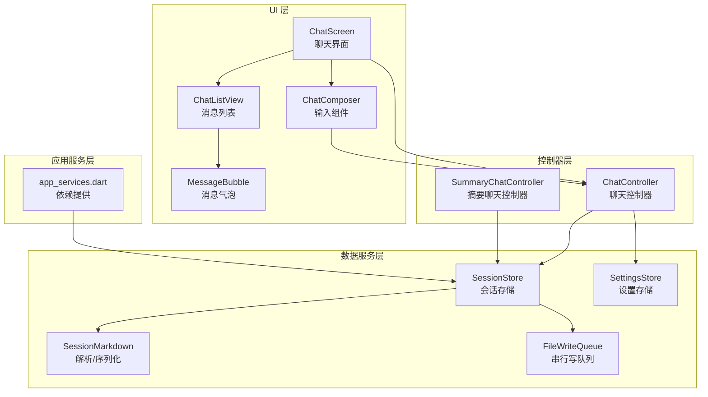
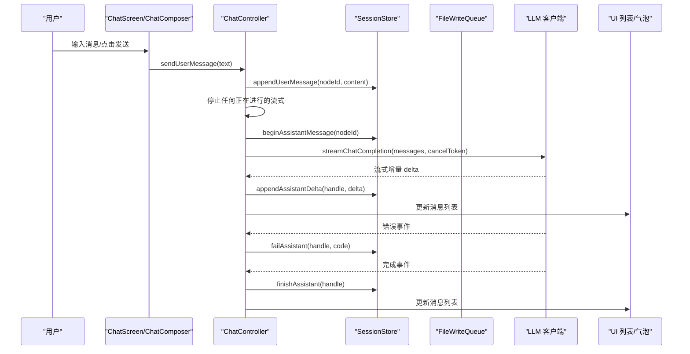
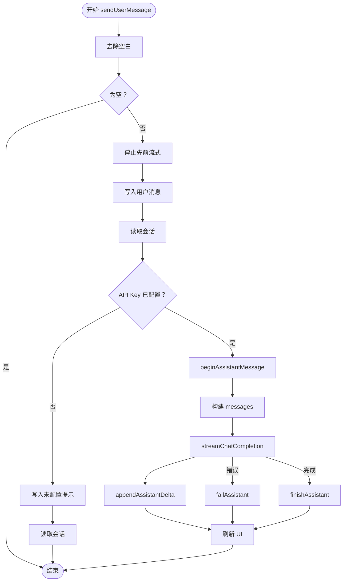
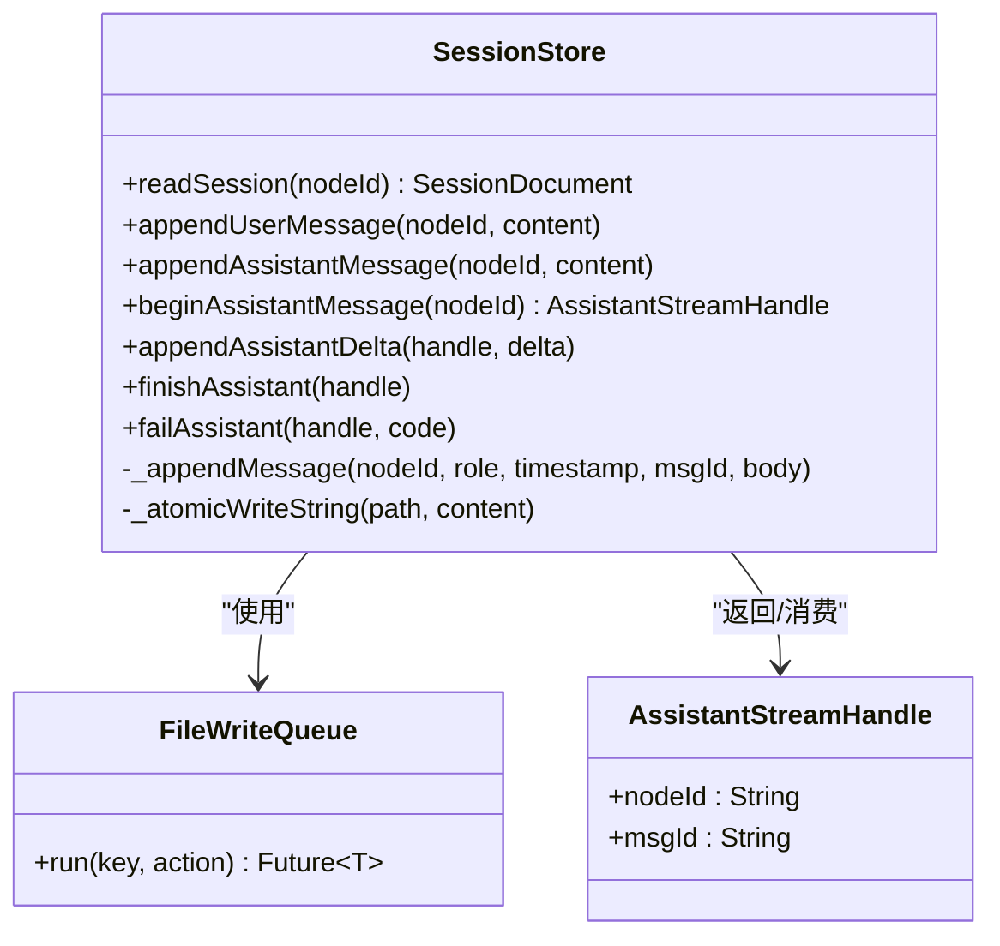
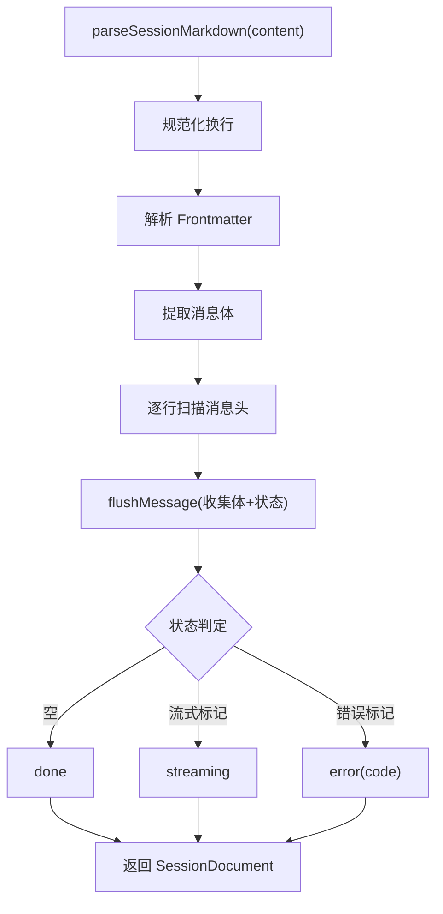
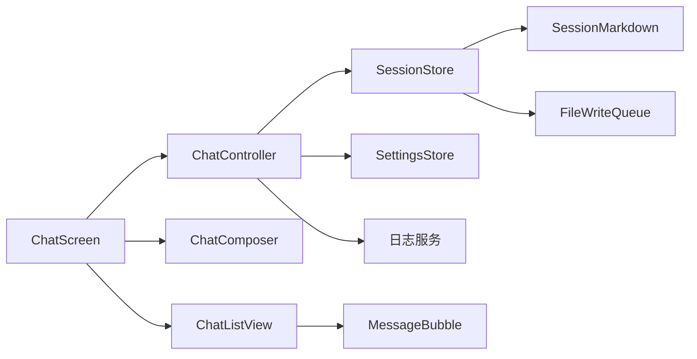

# 对话处理

<cite>
**本文引用的文件**
- [lib/ui/features/chat/chat_controller.dart](file://lib/ui/features/chat/chat_controller.dart)
- [lib/data/stores/session_store.dart](file://lib/data/stores/session_store.dart)
- [lib/data/services/session_markdown.dart](file://lib/data/services/session_markdown.dart)
- [lib/data/services/file_write_queue.dart](file://lib/data/services/file_write_queue.dart)
- [lib/ui/core/shared/chat_composer.dart](file://lib/ui/core/shared/chat_composer.dart)
- [lib/ui/core/shared/chat_list_view.dart](file://lib/ui/core/shared/chat_list_view.dart)
- [lib/ui/core/shared/message_bubble.dart](file://lib/ui/core/shared/message_bubble.dart)
- [lib/ui/features/chat/chat_screen.dart](file://lib/ui/features/chat/chat_screen.dart)
- [lib/data/services/settings_store.dart](file://lib/data/services/settings_store.dart)
- [lib/ui/features/summary/summary_chat_controller.dart](file://lib/ui/features/summary/summary_chat_controller.dart)
- [lib/ui/core/app_services.dart](file://lib/ui/core/app_services.dart)
- [test/ui/core/shared/chat_composer_test.dart](file://test/ui/core/shared/chat_composer_test.dart)
- [REQUIREMENTS.md](file://REQUIREMENTS.md)
</cite>

## 目录
1. [简介](#简介)
2. [项目结构](#项目结构)
3. [核心组件](#核心组件)
4. [架构总览](#架构总览)
5. [详细组件分析](#详细组件分析)
6. [依赖关系分析](#依赖关系分析)
7. [性能与内存优化](#性能与内存优化)
8. [故障排查指南](#故障排查指南)
9. [结论](#结论)
10. [附录](#附录)

## 简介
本文件面向 ThkTree 的对话处理系统，围绕“对话控制器”工作流展开，覆盖用户输入处理、消息队列管理、流式响应处理、状态更新、上下文管理、会话存储、状态机转换、实时性保障、性能优化与内存管理、以及常见问题诊断与解决。文档以代码为依据，辅以图示帮助不同技术背景的读者理解。

## 项目结构
对话处理相关代码主要分布在以下层次：
- UI 层：聊天界面、输入组件、消息渲染组件
- 控制器层：聊天控制器、摘要聊天控制器
- 数据服务层：会话解析、设置存储、文件写入队列
- 存储层：会话文件读写与原子落盘

**图表来源**
- [lib/ui/features/chat/chat_screen.dart:19-175](file://lib/ui/features/chat/chat_screen.dart#L19-L175)
- [lib/ui/core/shared/chat_composer.dart:1-160](file://lib/ui/core/shared/chat_composer.dart#L1-L160)
- [lib/ui/core/shared/chat_list_view.dart:1-99](file://lib/ui/core/shared/chat_list_view.dart#L1-L99)
- [lib/ui/core/shared/message_bubble.dart:1-265](file://lib/ui/core/shared/message_bubble.dart#L1-L265)
- [lib/ui/features/chat/chat_controller.dart:1-243](file://lib/ui/features/chat/chat_controller.dart#L1-L243)
- [lib/ui/features/summary/summary_chat_controller.dart:218-427](file://lib/ui/features/summary/summary_chat_controller.dart#L218-L427)
- [lib/data/stores/session_store.dart:1-205](file://lib/data/stores/session_store.dart#L1-L205)
- [lib/data/services/session_markdown.dart:1-223](file://lib/data/services/session_markdown.dart#L1-L223)
- [lib/data/services/file_write_queue.dart:1-12](file://lib/data/services/file_write_queue.dart#L1-L12)
- [lib/ui/core/app_services.dart:77-99](file://lib/ui/core/app_services.dart#L77-L99)

**章节来源**
- [lib/ui/features/chat/chat_screen.dart:19-175](file://lib/ui/features/chat/chat_screen.dart#L19-L175)
- [lib/ui/core/shared/chat_composer.dart:1-160](file://lib/ui/core/shared/chat_composer.dart#L1-L160)
- [lib/ui/core/shared/chat_list_view.dart:1-99](file://lib/ui/core/shared/chat_list_view.dart#L1-L99)
- [lib/ui/core/shared/message_bubble.dart:1-265](file://lib/ui/core/shared/message_bubble.dart#L1-L265)
- [lib/ui/features/chat/chat_controller.dart:1-243](file://lib/ui/features/chat/chat_controller.dart#L1-L243)
- [lib/ui/features/summary/summary_chat_controller.dart:218-427](file://lib/ui/features/summary/summary_chat_controller.dart#L218-L427)
- [lib/data/stores/session_store.dart:1-205](file://lib/data/stores/session_store.dart#L1-L205)
- [lib/data/services/session_markdown.dart:1-223](file://lib/data/services/session_markdown.dart#L1-L223)
- [lib/data/services/file_write_queue.dart:1-12](file://lib/data/services/file_write_queue.dart#L1-L12)
- [lib/ui/core/app_services.dart:77-99](file://lib/ui/core/app_services.dart#L77-L99)

## 核心组件
- 聊天控制器：负责构建初始消息列表、发送用户消息、启动/停止流式生成、监听流式增量、失败与完成状态处理。
- 会话存储：负责会话文件的读取、用户/助手消息追加、流式标记维护、结束与失败标记写入、原子落盘。
- 会话解析：负责将 Markdown 格式的会话文件解析为消息对象，识别状态（完成/流式/错误），并支持构建对话转录文本。
- 文件写入队列：按节点 ID 串行化文件写操作，避免并发写导致的数据竞争。
- 输入组件：处理回车发送、组合键换行、禁用态、按钮切换（发送/停止）。
- 列表与消息渲染：自动滚动至底部、根据状态显示“流式中/错误”提示、Markdown 渲染与表格扩展。
- 设置存储：提供 LLM Provider、模型与 API Key 等配置，用于流式请求参数。
- 摘要聊天控制器：用于“祖先总结”流程中的临时会话，支持临时文件写入、流式增量、结束与失败标记。

**章节来源**
- [lib/ui/features/chat/chat_controller.dart:18-243](file://lib/ui/features/chat/chat_controller.dart#L18-L243)
- [lib/data/stores/session_store.dart:8-205](file://lib/data/stores/session_store.dart#L8-L205)
- [lib/data/services/session_markdown.dart:16-223](file://lib/data/services/session_markdown.dart#L16-L223)
- [lib/data/services/file_write_queue.dart:1-12](file://lib/data/services/file_write_queue.dart#L1-L12)
- [lib/ui/core/shared/chat_composer.dart:1-160](file://lib/ui/core/shared/chat_composer.dart#L1-L160)
- [lib/ui/core/shared/chat_list_view.dart:22-99](file://lib/ui/core/shared/chat_list_view.dart#L22-L99)
- [lib/ui/core/shared/message_bubble.dart:41-141](file://lib/ui/core/shared/message_bubble.dart#L41-L141)
- [lib/data/services/settings_store.dart:4-185](file://lib/data/services/settings_store.dart#L4-L185)
- [lib/ui/features/summary/summary_chat_controller.dart:218-427](file://lib/ui/features/summary/summary_chat_controller.dart#L218-L427)

## 架构总览
对话处理遵循“UI 层 -> 控制器层 -> 数据服务层 -> 存储层”的分层设计。控制器通过 Riverpod 提供的状态管理驱动 UI 更新；会话存储通过文件写入队列确保同一节点的消息写入顺序；解析模块负责将文件内容映射为消息对象并识别状态。

**图表来源**
- [lib/ui/features/chat/chat_controller.dart:111-215](file://lib/ui/features/chat/chat_controller.dart#L111-L215)
- [lib/data/stores/session_store.dart:84-148](file://lib/data/stores/session_store.dart#L84-L148)
- [lib/data/services/file_write_queue.dart:4-9](file://lib/data/services/file_write_queue.dart#L4-L9)

**章节来源**
- [lib/ui/features/chat/chat_controller.dart:111-215](file://lib/ui/features/chat/chat_controller.dart#L111-L215)
- [lib/data/stores/session_store.dart:84-148](file://lib/data/stores/session_store.dart#L84-L148)
- [lib/data/services/file_write_queue.dart:4-9](file://lib/data/services/file_write_queue.dart#L4-L9)

## 详细组件分析

### 聊天控制器（ChatController）
职责与流程要点：
- 初始化与生命周期：在构建时读取会话，注册销毁回调取消订阅与取消令牌。
- 发送用户消息：停止任何正在进行的流式；写入用户消息；读取最新消息列表；若未配置 API Key，则写入提示消息。
- 启动流式：准备系统提示与历史消息，调用 LLM 客户端发起流式请求；使用生成号与取消令牌管理并发与中断。
- 流式增量：收到增量后写入助手消息的流式标记内；更新 UI；错误时写入错误标记并清理句柄；完成时移除流式标记。
- 停止流式：清理订阅与令牌，调用存储层结束流式或完成消息，刷新状态。

**图表来源**
- [lib/ui/features/chat/chat_controller.dart:111-215](file://lib/ui/features/chat/chat_controller.dart#L111-L215)
- [lib/data/stores/session_store.dart:84-148](file://lib/data/stores/session_store.dart#L84-L148)

**章节来源**
- [lib/ui/features/chat/chat_controller.dart:42-215](file://lib/ui/features/chat/chat_controller.dart#L42-L215)

### 会话存储（SessionStore）
职责与要点：
- 读取会话：定位节点对应会话文件路径，不存在则返回空文档；存在则解析为消息列表。
- 追加消息：用户/助手消息均以统一格式追加，确保文件末尾换行。
- 流式标记：通过“流式标记”标识当前助手消息处于流式阶段；结束或失败时移除/追加错误标记。
- 原子写入：临时文件写入后重命名，保证写入过程不可被读取到中间态。
- 串行化：同一节点的写入通过队列串行执行，避免并发冲突。

**图表来源**
- [lib/data/stores/session_store.dart:8-205](file://lib/data/stores/session_store.dart#L8-L205)
- [lib/data/services/file_write_queue.dart:1-12](file://lib/data/services/file_write_queue.dart#L1-L12)

**章节来源**
- [lib/data/stores/session_store.dart:17-168](file://lib/data/stores/session_store.dart#L17-L168)
- [lib/data/services/file_write_queue.dart:1-12](file://lib/data/services/file_write_queue.dart#L1-L12)

### 会话解析（SessionMarkdown）
职责与要点：
- 解析 Frontmatter 与消息体，按行扫描消息头，提取角色、时间戳、消息 ID。
- 识别消息状态：空体为完成；以“流式标记”结尾为流式；以“错误标记”结尾为错误并提取错误码。
- 序列化：支持将消息列表转为纯文本对话转录，便于摘要或分支场景使用。

**图表来源**
- [lib/data/services/session_markdown.dart:49-184](file://lib/data/services/session_markdown.dart#L49-L184)

**章节来源**
- [lib/data/services/session_markdown.dart:49-184](file://lib/data/services/session_markdown.dart#L49-L184)

### 输入组件（ChatComposer）
职责与要点：
- 多行文本输入，支持 Shift/Ctrl+回车换行，普通回车发送。
- 根据是否流式动态切换按钮为“发送/停止”，并调用相应回调。
- 成功发送后清空输入框并重新聚焦；异常时回填文本并提示。

**章节来源**
- [lib/ui/core/shared/chat_composer.dart:1-160](file://lib/ui/core/shared/chat_composer.dart#L1-L160)
- [test/ui/core/shared/chat_composer_test.dart:1-136](file://test/ui/core/shared/chat_composer_test.dart#L1-L136)

### 列表与消息渲染（ChatListView/MessageBubble）
职责与要点：
- ChatListView：自动滚动至底部；根据滚动位置决定是否“贴底”；空消息时显示提示。
- MessageBubble：根据消息角色与状态显示标题与状态文案；Markdown 渲染；表格可展开查看；支持右键菜单“添加到笔记”。

**章节来源**
- [lib/ui/core/shared/chat_list_view.dart:22-99](file://lib/ui/core/shared/chat_list_view.dart#L22-L99)
- [lib/ui/core/shared/message_bubble.dart:41-141](file://lib/ui/core/shared/message_bubble.dart#L41-L141)

### 设置存储（SettingsStore）
职责与要点：
- 统一管理 LLM Provider、模型与 API Key；根据 Provider 动态选择 API Key 与模型。
- 使用安全存储保存敏感信息。

**章节来源**
- [lib/data/services/settings_store.dart:4-185](file://lib/data/services/settings_store.dart#L4-L185)

### 摘要聊天控制器（SummaryChatController）
职责与要点：
- 用于“祖先总结”流程的临时会话；在临时文件中追加/更新助手消息，支持流式增量、结束与失败标记。
- 与正式会话存储共享相同的流式标记与原子写入策略。

**章节来源**
- [lib/ui/features/summary/summary_chat_controller.dart:218-427](file://lib/ui/features/summary/summary_chat_controller.dart#L218-L427)

## 依赖关系分析
- 控制器依赖：ChatController 依赖 SessionStore、SettingsStore、LLM 客户端与日志服务；UI 通过 Riverpod 订阅控制器状态。
- 存储依赖：SessionStore 依赖 SessionMarkdown 解析与 FileWriteQueue 队列；依赖路径提供器获取节点会话文件路径。
- UI 依赖：ChatScreen 依赖 ChatComposer、ChatListView、MessageBubble；MessageBubble 依赖本地化资源。

**图表来源**
- [lib/ui/features/chat/chat_controller.dart:1-243](file://lib/ui/features/chat/chat_controller.dart#L1-L243)
- [lib/data/stores/session_store.dart:1-205](file://lib/data/stores/session_store.dart#L1-L205)
- [lib/data/services/session_markdown.dart:1-223](file://lib/data/services/session_markdown.dart#L1-L223)
- [lib/data/services/file_write_queue.dart:1-12](file://lib/data/services/file_write_queue.dart#L1-L12)
- [lib/ui/features/chat/chat_screen.dart:1-256](file://lib/ui/features/chat/chat_screen.dart#L1-L256)

**章节来源**
- [lib/ui/features/chat/chat_controller.dart:1-243](file://lib/ui/features/chat/chat_controller.dart#L1-L243)
- [lib/data/stores/session_store.dart:1-205](file://lib/data/stores/session_store.dart#L1-L205)
- [lib/ui/features/chat/chat_screen.dart:1-256](file://lib/ui/features/chat/chat_screen.dart#L1-L256)

## 性能与内存优化
- 写入串行化：通过 FileWriteQueue 按节点串行化写入，避免频繁 IO 抢占与竞态，降低磁盘压力。
- 原子写入：临时文件写入后重命名，避免部分写入导致的解析失败与重复读取开销。
- UI 渲染优化：ChatListView 自动贴底滚动，减少不必要的重建；MessageBubble 按需渲染 Markdown 与表格扩展视图。
- 上下文估算：聊天屏幕顶部显示上下文占用比例，帮助用户感知 Token 使用情况，避免超出模型上下文窗口。
- 流式增量：仅在收到增量时刷新 UI，避免一次性大块写入造成卡顿。
- 日志与追踪：控制器内置轻量级日志追踪，便于定位性能瓶颈与异常点。

[本节为通用性能建议，无需特定文件引用]

## 故障排查指南
- 发送无响应
  - 检查是否正在流式中，尝试点击“停止”释放句柄与取消令牌。
  - 确认 API Key 是否配置，未配置时会写入提示消息而非发起流式请求。
  - 查看日志追踪输出，定位 read/write/parse 步骤的异常。
- 流式中断或卡住
  - 观察 UI 是否仍显示“流式中”；若长时间无增量，检查网络与 LLM 服务可用性。
  - 错误时会写入错误标记，UI 将显示错误状态；可重试或停止后重新发起。
- 消息错乱或重复
  - 确保同一节点的写入通过队列串行化；避免外部并发写入。
  - 若出现旧标记残留，检查是否正确调用结束/失败标记清理。
- 滚动位置异常
  - ChatListView 会在贴底时自动滚动到底部；若手动拉拽到历史，会保持“跟随底部”的行为，避免意外跳动。
- 单元测试参考
  - 输入组件测试覆盖了发送/停止按钮、禁用态、空文本与仅空白文本等边界条件，可作为行为回归的参考。

**章节来源**
- [lib/ui/features/chat/chat_controller.dart:55-90](file://lib/ui/features/chat/chat_controller.dart#L55-L90)
- [lib/data/stores/session_store.dart:66-82](file://lib/data/stores/session_store.dart#L66-L82)
- [lib/ui/core/shared/chat_list_view.dart:46-99](file://lib/ui/core/shared/chat_list_view.dart#L46-L99)
- [test/ui/core/shared/chat_composer_test.dart:65-107](file://test/ui/core/shared/chat_composer_test.dart#L65-L107)

## 结论
ThkTree 的对话处理系统以清晰的分层与严格的串行化写入为核心，结合流式标记与原子落盘，实现了可靠的实时对话体验。通过状态机化的消息解析与 UI 响应，系统在易用性与稳定性之间取得平衡。未来可在上下文长度控制、历史消息截断策略、以及“祖先总结”的过期检测与自动刷新方面进一步增强。

[本节为总结性内容，无需特定文件引用]

## 附录

### 上下文管理与“祖先总结”
- 祖先总结流程：系统读取祖先链上各节点的会话，生成初稿总结；用户在摘要节点中多轮对话打磨；确认后写入子节点的上下文总结文件。
- 过期标记：祖先链任一节点新增消息后，相关总结标记为过期；UI 提示用户是否重新总结。
- 兜底策略：用户可从笔记插入补充内容，或从历史消息中复制选段。

**章节来源**
- [REQUIREMENTS.md:158-181](file://REQUIREMENTS.md#L158-L181)