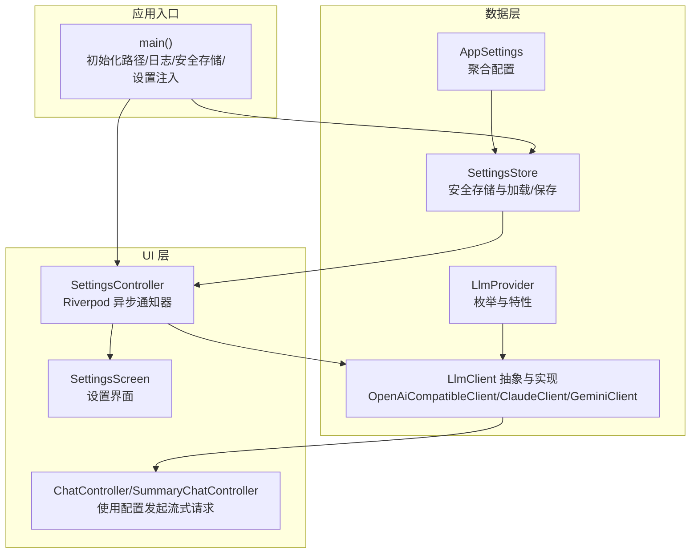
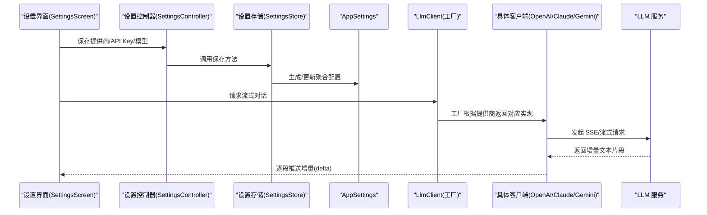
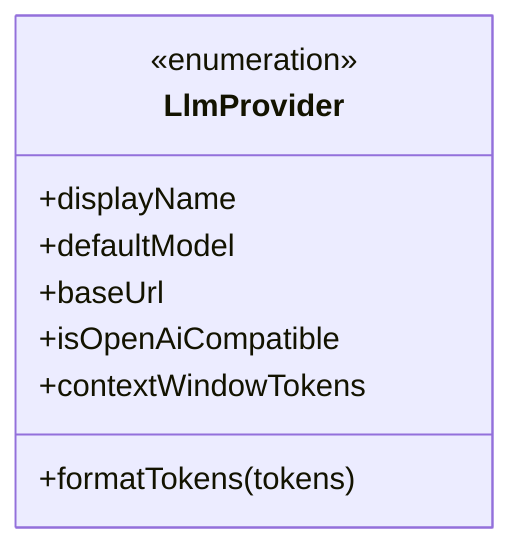
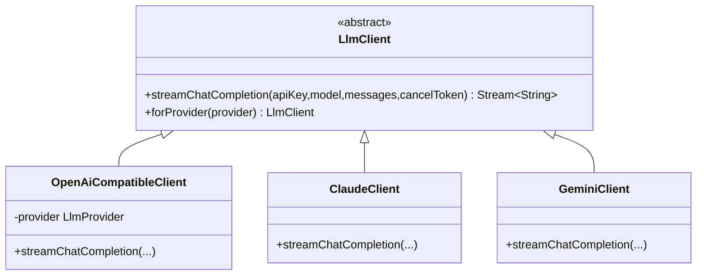
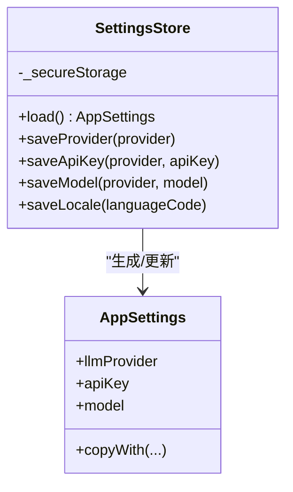
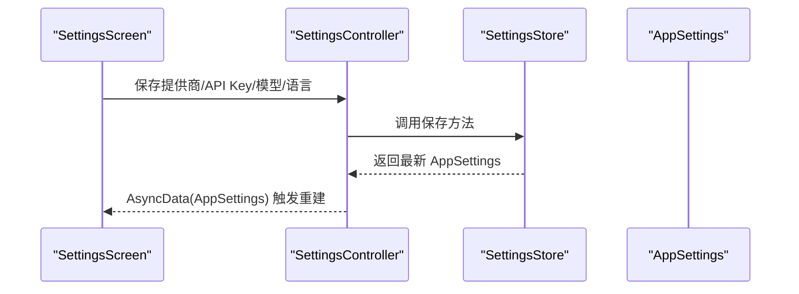
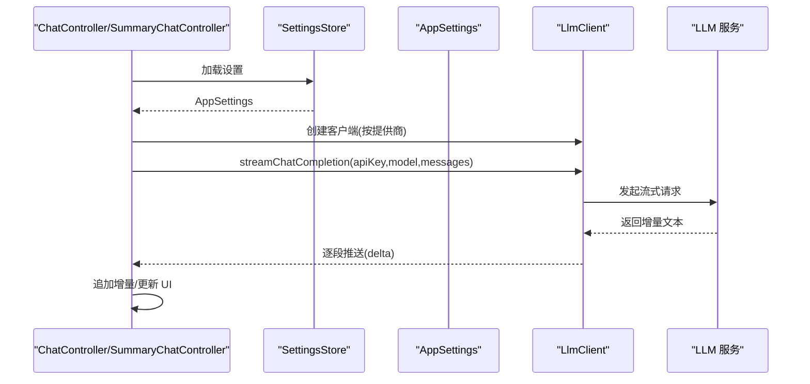
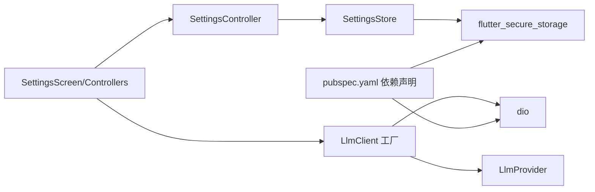

# 提供商配置

<cite>
**本文引用的文件**
- [lib/data/services/llm_provider.dart](file://lib/data/services/llm_provider.dart)
- [lib/data/services/llm_client.dart](file://lib/data/services/llm_client.dart)
- [lib/data/services/settings_store.dart](file://lib/data/services/settings_store.dart)
- [lib/ui/features/settings/settings_controller.dart](file://lib/ui/features/settings/settings_controller.dart)
- [lib/ui/features/settings/settings_screen.dart](file://lib/ui/features/settings/settings_screen.dart)
- [lib/ui/features/chat/chat_controller.dart](file://lib/ui/features/chat/chat_controller.dart)
- [lib/ui/features/summary/summary_chat_controller.dart](file://lib/ui/features/summary/summary_chat_controller.dart)
- [lib/main.dart](file://lib/main.dart)
- [pubspec.yaml](file://pubspec.yaml)
</cite>

## 目录
1. [简介](#简介)
2. [项目结构](#项目结构)
3. [核心组件](#核心组件)
4. [架构总览](#架构总览)
5. [详细组件分析](#详细组件分析)
6. [依赖关系分析](#依赖关系分析)
7. [性能考量](#性能考量)
8. [故障排除指南](#故障排除指南)
9. [结论](#结论)
10. [附录：扩展新提供商步骤](#附录扩展新提供商步骤)

## 简介
本文件面向 ThkTree 的 LLM 提供商配置系统，系统性阐述以下内容：
- LlmProvider 枚举设计：支持的提供商列表、显示名、默认模型、基础 URL、兼容特性标识、上下文窗口等
- 配置管理：API 密钥存储、模型参数设置、请求头配置、超时参数等
- 设置存储实现：安全存储机制、配置持久化、默认值处理、配置验证
- 提供商切换逻辑：配置迁移、缓存清理、连接重置
- 安全性考虑：密钥加密、传输安全、访问控制
- 最佳实践与故障排除
- 扩展新提供商的步骤与注意事项

## 项目结构
围绕“提供商配置”的关键文件组织如下：
- 数据层
  - 提供商定义与客户端抽象：[lib/data/services/llm_provider.dart](file://lib/data/services/llm_provider.dart)，[lib/data/services/llm_client.dart](file://lib/data/services/llm_client.dart)
  - 设置存储与模型：[lib/data/services/settings_store.dart](file://lib/data/services/settings_store.dart)
- UI 层
  - 设置界面与控制器：[lib/ui/features/settings/settings_screen.dart](file://lib/ui/features/settings/settings_screen.dart)，[lib/ui/features/settings/settings_controller.dart](file://lib/ui/features/settings/settings_controller.dart)
- 应用入口与依赖注入
  - 应用启动与全局设置注入：[lib/main.dart](file://lib/main.dart)
- 依赖声明
  - 第三方库（含安全存储）：[pubspec.yaml](file://pubspec.yaml)

图表来源
- [lib/data/services/llm_provider.dart:1-111](file://lib/data/services/llm_provider.dart#L1-L111)
- [lib/data/services/llm_client.dart:8-318](file://lib/data/services/llm_client.dart#L8-L318)
- [lib/data/services/settings_store.dart:4-185](file://lib/data/services/settings_store.dart#L4-L185)
- [lib/ui/features/settings/settings_controller.dart:7-58](file://lib/ui/features/settings/settings_controller.dart#L7-L58)
- [lib/ui/features/settings/settings_screen.dart:14-395](file://lib/ui/features/settings/settings_screen.dart#L14-L395)
- [lib/ui/features/chat/chat_controller.dart:121-203](file://lib/ui/features/chat/chat_controller.dart#L121-L203)
- [lib/ui/features/summary/summary_chat_controller.dart:218-287](file://lib/ui/features/summary/summary_chat_controller.dart#L218-L287)
- [lib/main.dart:15-59](file://lib/main.dart#L15-L59)

章节来源
- [lib/data/services/llm_provider.dart:1-111](file://lib/data/services/llm_provider.dart#L1-L111)
- [lib/data/services/llm_client.dart:8-318](file://lib/data/services/llm_client.dart#L8-L318)
- [lib/data/services/settings_store.dart:4-185](file://lib/data/services/settings_store.dart#L4-L185)
- [lib/ui/features/settings/settings_controller.dart:7-58](file://lib/ui/features/settings/settings_controller.dart#L7-L58)
- [lib/ui/features/settings/settings_screen.dart:14-395](file://lib/ui/features/settings/settings_screen.dart#L14-L395)
- [lib/ui/features/chat/chat_controller.dart:121-203](file://lib/ui/features/chat/chat_controller.dart#L121-L203)
- [lib/ui/features/summary/summary_chat_controller.dart:218-287](file://lib/ui/features/summary/summary_chat_controller.dart#L218-L287)
- [lib/main.dart:15-59](file://lib/main.dart#L15-L59)
- [pubspec.yaml:30-50](file://pubspec.yaml#L30-L50)

## 核心组件
- LlmProvider：定义支持的提供商、显示名、默认模型、基础 URL、是否 OpenAI 兼容、上下文窗口等；并提供令牌估算工具
- LlmClient 抽象与实现：统一流式对话接口；按提供商分发到 OpenAI 兼容、Claude、Gemini 三类客户端
- SettingsStore 与 AppSettings：封装所有 LLM 相关配置项，提供安全存储、加载/保存、默认值回退、按当前提供商选择当前密钥/模型
- SettingsController 与 SettingsScreen：UI 控制器与设置界面，支持切换提供商、编辑 API Key、编辑模型、语言设置
- 应用入口 main：初始化安全存储、加载设置、注入全局状态

章节来源
- [lib/data/services/llm_provider.dart:1-111](file://lib/data/services/llm_provider.dart#L1-L111)
- [lib/data/services/llm_client.dart:8-318](file://lib/data/services/llm_client.dart#L8-L318)
- [lib/data/services/settings_store.dart:4-185](file://lib/data/services/settings_store.dart#L4-L185)
- [lib/ui/features/settings/settings_controller.dart:7-58](file://lib/ui/features/settings/settings_controller.dart#L7-L58)
- [lib/ui/features/settings/settings_screen.dart:14-395](file://lib/ui/features/settings/settings_screen.dart#L14-L395)
- [lib/main.dart:15-59](file://lib/main.dart#L15-L59)

## 架构总览
下图展示从 UI 到数据层再到网络请求的整体调用链路。

图表来源
- [lib/ui/features/settings/settings_screen.dart:162-247](file://lib/ui/features/settings/settings_screen.dart#L162-L247)
- [lib/ui/features/settings/settings_controller.dart:14-38](file://lib/ui/features/settings/settings_controller.dart#L14-L38)
- [lib/data/services/settings_store.dart:117-156](file://lib/data/services/settings_store.dart#L117-L156)
- [lib/data/services/llm_client.dart:18-30](file://lib/data/services/llm_client.dart#L18-L30)
- [lib/data/services/llm_client.dart:33-101](file://lib/data/services/llm_client.dart#L33-L101)
- [lib/data/services/llm_client.dart:103-183](file://lib/data/services/llm_client.dart#L103-L183)
- [lib/data/services/llm_client.dart:185-253](file://lib/data/services/llm_client.dart#L185-L253)

## 详细组件分析

### LlmProvider 设计与特性
- 支持的提供商：DeepSeek、OpenAI、Claude、Gemini、MiniMax、Kimi
- 显示名：每个提供商有对应的本地化显示名称
- 默认模型：每个提供商有默认模型字符串，用于首次使用或空模型时回退
- 基础 URL：每个提供商的基础 API 地址，客户端据此构造完整请求
- OpenAI 兼容标识：标记哪些提供商遵循 OpenAI 兼容协议，便于统一处理
- 上下文窗口：以令牌为单位的最大上下文长度，部分提供商会格式化显示
- 令牌估算：提供通用的文本令牌估算函数，便于成本/长度预估

图表来源
- [lib/data/services/llm_provider.dart:1-111](file://lib/data/services/llm_provider.dart#L1-L111)

章节来源
- [lib/data/services/llm_provider.dart:1-111](file://lib/data/services/llm_provider.dart#L1-L111)

### LlmClient 抽象与实现
- 抽象接口：统一 streamChatCompletion 方法，接收 API Key、模型、消息列表、取消令牌
- 工厂方法：根据 LlmProvider 返回不同实现
  - OpenAI 兼容：DeepSeek、OpenAI、MiniMax、Kimi 使用同一实现
  - Claude：专用实现，处理 system 消息与特定头部
  - Gemini：专用实现，消息体结构与 URL 查询参数不同
- 流式解析：三类实现均将服务端事件流解析为增量文本片段并逐段产出

图表来源
- [lib/data/services/llm_client.dart:8-318](file://lib/data/services/llm_client.dart#L8-L318)

章节来源
- [lib/data/services/llm_client.dart:8-318](file://lib/data/services/llm_client.dart#L8-L318)

### SettingsStore 与 AppSettings
- AppSettings：聚合当前所选提供商及各提供商的 API Key、模型、语言等；提供 apiKey/model 访问器，按当前提供商返回当前值
- SettingsStore：
  - 键命名规范：提供者键、API Key 键、模型键、语言键
  - 加载策略：若某提供商的 API Key 或模型为空，分别回退到空串或对应提供商默认模型
  - 保存策略：API Key 写入前去空白；空串删除该键；模型为空则不写入
  - 语言设置：空值删除键，否则写入

图表来源
- [lib/data/services/settings_store.dart:4-185](file://lib/data/services/settings_store.dart#L4-L185)

章节来源
- [lib/data/services/settings_store.dart:4-185](file://lib/data/services/settings_store.dart#L4-L185)

### 设置界面与控制器
- SettingsController：基于 Riverpod AsyncNotifier，负责加载/保存配置，并在保存后刷新状态
- SettingsScreen：
  - 提供商选择：弹窗列出所有提供商，点击即保存并刷新
  - API Key 编辑：弹出输入框，隐藏输入，保存后刷新
  - 模型编辑：弹出输入框，提示默认模型，保存后刷新
  - 语言设置：支持系统默认、英文、中文，保存后同步更新语言状态

图表来源
- [lib/ui/features/settings/settings_screen.dart:162-247](file://lib/ui/features/settings/settings_screen.dart#L162-L247)
- [lib/ui/features/settings/settings_controller.dart:14-38](file://lib/ui/features/settings/settings_controller.dart#L14-L38)
- [lib/data/services/settings_store.dart:117-183](file://lib/data/services/settings_store.dart#L117-L183)

章节来源
- [lib/ui/features/settings/settings_controller.dart:7-58](file://lib/ui/features/settings/settings_controller.dart#L7-L58)
- [lib/ui/features/settings/settings_screen.dart:14-395](file://lib/ui/features/settings/settings_screen.dart#L14-L395)
- [lib/data/services/settings_store.dart:117-183](file://lib/data/services/settings_store.dart#L117-L183)

### 使用配置发起流式请求
- ChatController/SummaryChatController 在发送消息前会读取当前设置，若 API Key 为空则提示用户前往设置配置
- 通过 LlmClient 工厂获取对应客户端，传入当前 API Key、模型与历史消息，开始监听增量文本并更新会话

图表来源
- [lib/ui/features/chat/chat_controller.dart:142-203](file://lib/ui/features/chat/chat_controller.dart#L142-L203)
- [lib/ui/features/summary/summary_chat_controller.dart:218-287](file://lib/ui/features/summary/summary_chat_controller.dart#L218-L287)
- [lib/data/services/llm_client.dart:18-30](file://lib/data/services/llm_client.dart#L18-L30)

章节来源
- [lib/ui/features/chat/chat_controller.dart:121-203](file://lib/ui/features/chat/chat_controller.dart#L121-L203)
- [lib/ui/features/summary/summary_chat_controller.dart:218-287](file://lib/ui/features/summary/summary_chat_controller.dart#L218-L287)
- [lib/data/services/llm_client.dart:18-30](file://lib/data/services/llm_client.dart#L18-L30)

## 依赖关系分析
- 外部依赖
  - flutter_secure_storage：提供跨平台安全存储能力，用于保存 API Key 等敏感信息
  - dio：HTTP 客户端，用于发起流式请求
- 组件耦合
  - SettingsStore 依赖 FlutterSecureStorage，负责敏感数据持久化
  - SettingsController 依赖 SettingsStore，负责 UI 与存储之间的协调
  - LlmClient 工厂依赖 LlmProvider，决定网络层实现
  - UI 层通过 Riverpod 注入全局状态，避免直接依赖底层实现

图表来源
- [pubspec.yaml:30-50](file://pubspec.yaml#L30-L50)
- [lib/data/services/settings_store.dart:106-109](file://lib/data/services/settings_store.dart#L106-L109)
- [lib/data/services/llm_client.dart:18-30](file://lib/data/services/llm_client.dart#L18-L30)

章节来源
- [pubspec.yaml:30-50](file://pubspec.yaml#L30-L50)
- [lib/data/services/settings_store.dart:106-109](file://lib/data/services/settings_store.dart#L106-L109)
- [lib/data/services/llm_client.dart:18-30](file://lib/data/services/llm_client.dart#L18-L30)

## 性能考量
- 流式响应：客户端统一采用服务端事件流（SSE），按增量推送，降低首包延迟，提升交互体验
- 解析效率：对事件流进行缓冲与行级解析，避免频繁 JSON 解码开销
- 取消与重入：在新请求发起时取消旧的流订阅，防止并发冲突与资源浪费
- 上下文窗口：通过 LlmProvider.contextWindowTokens 获取上限，有助于在 UI 中进行长度提示与成本估算

章节来源
- [lib/data/services/llm_client.dart:33-101](file://lib/data/services/llm_client.dart#L33-L101)
- [lib/data/services/llm_client.dart:103-183](file://lib/data/services/llm_client.dart#L103-L183)
- [lib/data/services/llm_client.dart:185-253](file://lib/data/services/llm_client.dart#L185-L253)
- [lib/data/services/llm_provider.dart:73-88](file://lib/data/services/llm_provider.dart#L73-L88)

## 故障排除指南
- API Key 未配置
  - 现象：发起消息时报错或提示未配置
  - 排查：检查设置界面中当前提供商的 API Key 是否已填写
  - 处理：在设置界面中编辑 API Key 并保存
- 网络错误/取消
  - 现象：流式过程中出现网络异常或被取消
  - 排查：查看日志记录，确认是否为取消或网络中断
  - 处理：重新发起请求；如频繁取消，检查 UI 是否重复触发
- 模型不可用
  - 现象：提示模型无效或 404
  - 排查：确认模型字符串与提供商匹配；必要时回到默认模型
  - 处理：在设置界面修改模型为提供商默认值或有效模型
- 语言设置不生效
  - 现象：切换语言后未立即生效
  - 排查：确认已保存语言设置并重启应用或刷新界面
  - 处理：再次进入设置保存语言，确保键值非空

章节来源
- [lib/ui/features/chat/chat_controller.dart:123-131](file://lib/ui/features/chat/chat_controller.dart#L123-L131)
- [lib/ui/features/summary/summary_chat_controller.dart:267-280](file://lib/ui/features/summary/summary_chat_controller.dart#L267-L280)
- [lib/ui/features/settings/settings_screen.dart:184-211](file://lib/ui/features/settings/settings_screen.dart#L184-L211)

## 结论
ThkTree 的 LLM 提供商配置系统以 LlmProvider 为核心抽象，结合 SettingsStore 的安全存储与 SettingsController 的 UI 协调，实现了多提供商、多模型、多语言的灵活配置。通过 LlmClient 工厂与三类专用实现，系统在保持一致接口的同时适配不同提供商的差异。整体设计具备良好的可扩展性与安全性，适合后续继续扩展更多提供商。

## 附录：扩展新提供商步骤
- 步骤一：在 LlmProvider 中新增枚举值，并补充以下字段
  - 显示名：displayName
  - 默认模型：defaultModel
  - 基础 URL：baseUrl
  - OpenAI 兼容标识：isOpenAiCompatible
  - 上下文窗口：contextWindowTokens
- 步骤二：在 LlmClient 工厂方法中添加新提供商分支，返回对应的客户端实现
  - 若遵循 OpenAI 兼容协议，复用 OpenAiCompatibleClient
  - 否则新增专用客户端类（参考 ClaudeClient/GeminiClient）
- 步骤三：在 SettingsStore 中为新提供商添加 API Key 与模型的读写键
  - 键命名建议：llm_api_key_{name}、llm_model_{name}
  - 加载时提供默认值回退
- 步骤四：在 SettingsScreen 中完善 UI
  - 在提供商选择列表中显示新提供商
  - 在 API Key/模型编辑时，提示默认值
- 步骤五：在 AppSettings 中补充新提供商的访问器（如需）
- 步骤六：测试
  - 验证设置保存/加载
  - 验证流式请求成功
  - 验证错误处理与日志记录

注意事项
- 安全性：始终通过 SettingsStore 写入 API Key，避免明文硬编码
- 兼容性：尽量遵循 OpenAI 兼容协议，减少定制化差异
- 用户体验：提供默认模型与上下文窗口提示，帮助用户合理配置

章节来源
- [lib/data/services/llm_provider.dart:1-111](file://lib/data/services/llm_provider.dart#L1-L111)
- [lib/data/services/llm_client.dart:18-30](file://lib/data/services/llm_client.dart#L18-L30)
- [lib/data/services/settings_store.dart:117-156](file://lib/data/services/settings_store.dart#L117-L156)
- [lib/ui/features/settings/settings_screen.dart:217-246](file://lib/ui/features/settings/settings_screen.dart#L217-L246)