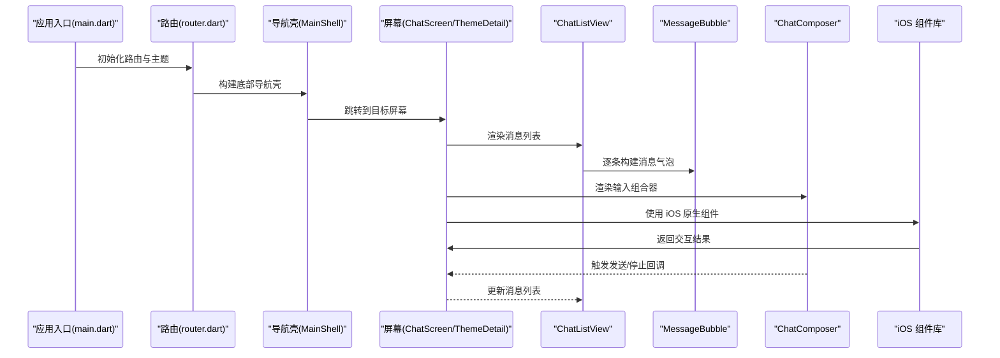
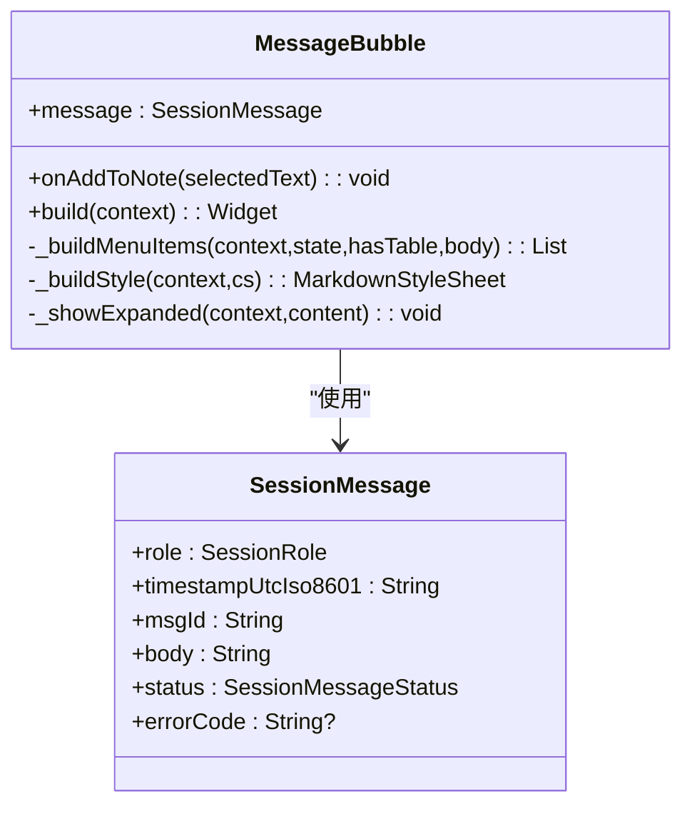
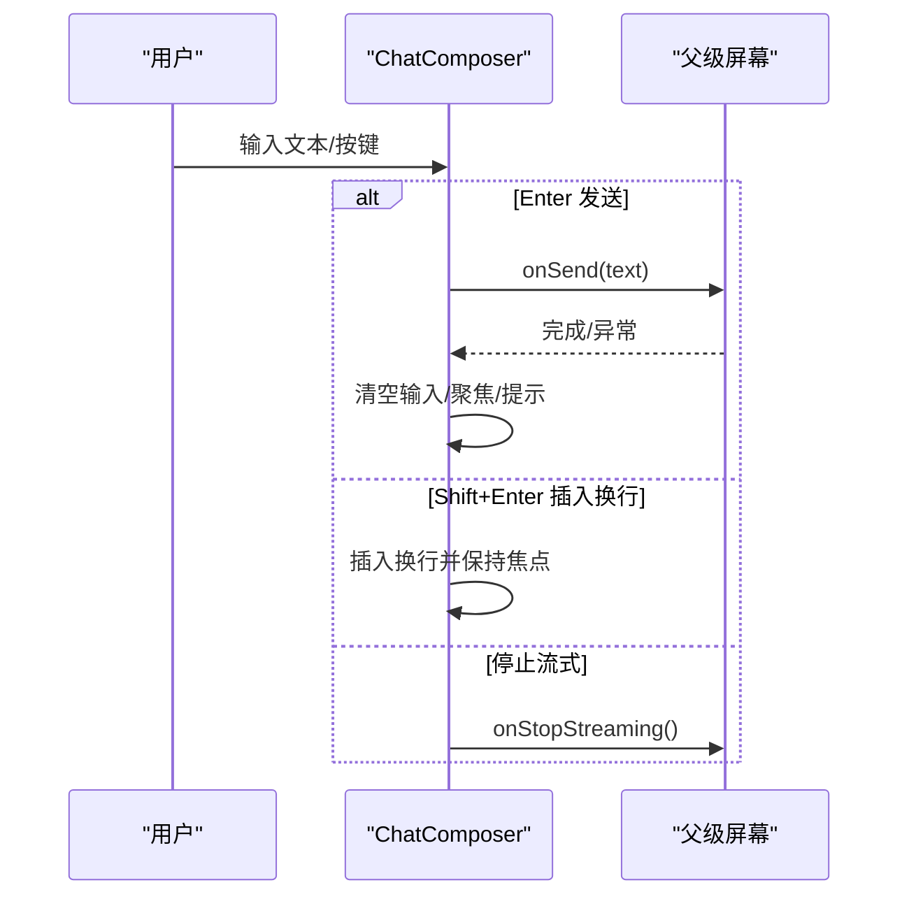
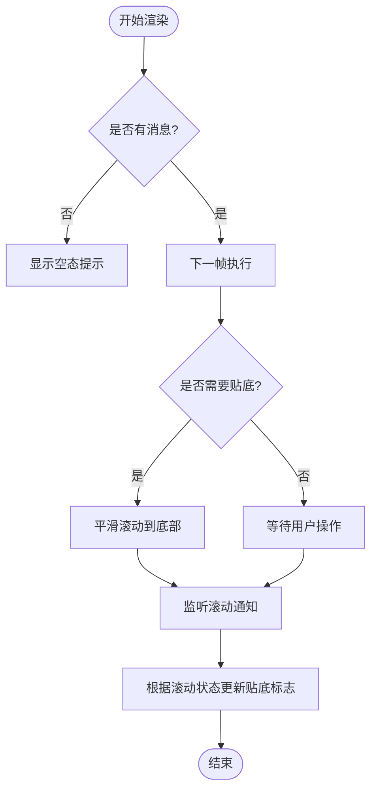
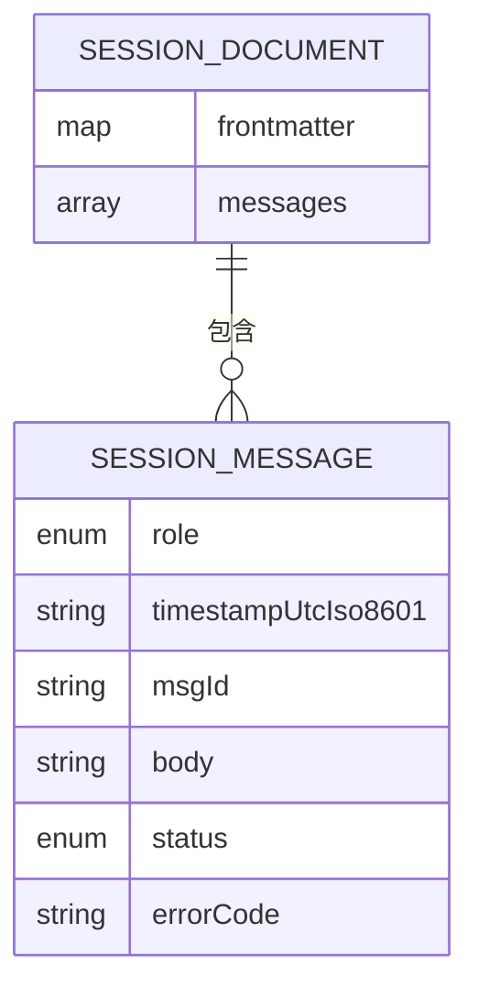
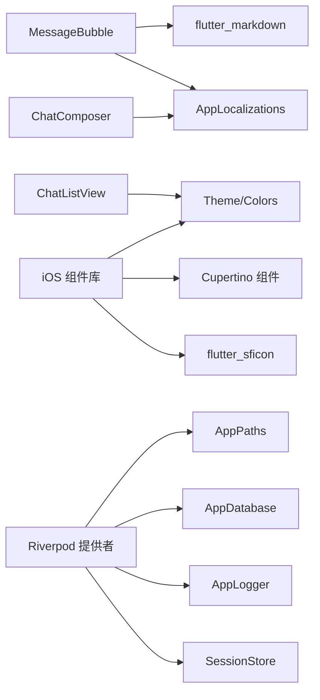

# UI 组件库

<cite>
**本文引用的文件**
- [lib/main.dart](file://lib/main.dart)
- [lib/ui/core/shared/message_bubble.dart](file://lib/ui/core/shared/message_bubble.dart)
- [lib/ui/core/shared/chat_composer.dart](file://lib/ui/core/shared/chat_composer.dart)
- [lib/ui/core/shared/chat_list_view.dart](file://lib/ui/core/shared/chat_list_view.dart)
- [lib/data/services/session_markdown.dart](file://lib/data/services/session_markdown.dart)
- [lib/ui/core/router.dart](file://lib/ui/core/router.dart)
- [lib/ui/core/app_services.dart](file://lib/ui/core/app_services.dart)
- [lib/ui/core/widgets/thk_button.dart](file://lib/ui/core/widgets/thk_button.dart)
- [lib/ui/core/widgets/thk_text_field.dart](file://lib/ui/core/widgets/thk_text_field.dart)
- [lib/ui/core/widgets/thk_nav_bar.dart](file://lib/ui/core/widgets/thk_nav_bar.dart)
- [lib/ui/core/widgets/thk_list_tile.dart](file://lib/ui/core/widgets/thk_list_tile.dart)
- [lib/ui/core/widgets/thk_list_section.dart](file://lib/ui/core/widgets/thk_list_section.dart)
- [lib/ui/core/widgets/thk_alert.dart](file://lib/ui/core/widgets/thk_alert.dart)
- [lib/ui/core/widgets/thk_action_sheet.dart](file://lib/ui/core/widgets/thk_action_sheet.dart)
- [lib/ui/core/widgets/widgets.dart](file://lib/ui/core/widgets/widgets.dart)
- [lib/ui/core/theme/app_theme.dart](file://lib/ui/core/theme/app_theme.dart)
- [lib/ui/core/theme/app_icons.dart](file://lib/ui/core/theme/app_icons.dart)
- [test/ui/core/shared/message_bubble_test.dart](file://test/ui/core/shared/message_bubble_test.dart)
- [test/ui/core/shared/chat_composer_test.dart](file://test/ui/core/shared/chat_composer_test.dart)
- [test/ui/core/shared/chat_list_view_test.dart](file://test/ui/core/shared/chat_list_view_test.dart)
- [pubspec.yaml](file://pubspec.yaml)
- [README.md](file://README.md)
</cite>

## 更新摘要
**所做更改**
- 新增完整的 iOS 原生 UI 组件库章节，包含 7 个核心组件
- 添加 iOS 设计系统和图标映射章节
- 更新架构图以反映新的 iOS 组件集成
- 新增 iOS 组件的详细使用说明和最佳实践
- 扩展响应式设计指南以包含 iOS 适配

## 目录
1. [简介](#简介)
2. [项目结构](#项目结构)
3. [核心组件](#核心组件)
4. [iOS 原生 UI 组件库](#ios-原生-ui-组件库)
5. [iOS 设计系统与图标映射](#ios-设计系统与图标映射)
6. [架构总览](#架构总览)
7. [组件详细分析](#组件详细分析)
8. [依赖关系分析](#依赖关系分析)
9. [性能考虑](#性能考虑)
10. [故障排查指南](#故障排查指南)
11. [结论](#结论)
12. [附录](#附录)

## 简介
本文件为 ThkTree UI 组件库的系统化技术文档，聚焦于核心 UI 组件：消息气泡（MessageBubble）、聊天组合器（ChatComposer）与聊天列表视图（ChatListView），以及全新的 iOS 原生 UI 组件库。文档从架构、数据模型、交互行为、可访问性与响应式设计、状态管理与动画、到测试与集成实践进行深入说明，并提供可视化图示帮助理解。

## 项目结构
ThkTree 采用 Flutter 应用结构，UI 组件位于 lib/ui/core/shared 下，iOS 原生组件位于 lib/ui/core/widgets，数据模型与解析逻辑位于 lib/data/services，应用入口与路由在 lib/main.dart 与 lib/ui/core/router.dart 中定义；状态管理通过 Riverpod 提供者体系注入。

```mermaid
graph TB
subgraph "应用入口"
MAIN["lib/main.dart<br/>应用启动与主题/本地化"]
ROUTER["lib/ui/core/router.dart<br/>路由与导航壳"]
end
subgraph "UI 核心"
MSG["lib/ui/core/shared/message_bubble.dart<br/>消息气泡"]
COMPOSER["lib/ui/core/shared/chat_composer.dart<br/>聊天输入组合器"]
LISTVIEW["lib/ui/core/shared/chat_list_view.dart<br/>聊天列表视图"]
end
subgraph "iOS 原生组件库"
BUTTON["lib/ui/core/widgets/thk_button.dart<br/>iOS 风格按钮"]
TEXTFIELD["lib/ui/core/widgets/thk_text_field.dart<br/>iOS 风格文本框"]
NAVBAR["lib/ui/core/widgets/thk_nav_bar.dart<br/>iOS 导航栏"]
LISTTILE["lib/ui/core/widgets/thk_list_tile.dart<br/>iOS 列表项"]
LISTSECTION["lib/ui/core/widgets/thk_list_section.dart<br/>iOS 列表分组"]
ALERT["lib/ui/core/widgets/thk_alert.dart<br/>iOS 警告对话框"]
ACTIONSHEET["lib/ui/core/widgets/thk_action_sheet.dart<br/>iOS 操作表"]
END
subgraph "数据与状态"
MODEL["lib/data/services/session_markdown.dart<br/>会话消息模型/解析"]
SERVICES["lib/ui/core/app_services.dart<br/>Riverpod 提供者"]
THEME["lib/ui/core/theme/app_theme.dart<br/>iOS 主题配置"]
ICONS["lib/ui/core/theme/app_icons.dart<br/>图标映射"]
END
TESTS["测试用例<br/>test/ui/core/shared/*"]
MAIN --> ROUTER
ROUTER --> LISTVIEW
LISTVIEW --> MSG
LISTVIEW --> COMPOSER
MSG --> MODEL
COMPOSER --> MODEL
SERVICES --> MODEL
BUTTON --> THEME
TEXTFIELD --> THEME
NAVBAR --> THEME
ALERT --> THEME
ACTIONSHEET --> THEME
BUTTON --> ICONS
TEXTFIELD --> ICONS
LISTTILE --> ICONS
LISTSECTION --> ICONS
TESTS --> MSG
TESTS --> COMPOSER
TESTS --> LISTVIEW
```

**图表来源**
- [lib/main.dart:15-93](file://lib/main.dart#L15-L93)
- [lib/ui/core/router.dart:18-126](file://lib/ui/core/router.dart#L18-L126)
- [lib/ui/core/shared/message_bubble.dart:41-215](file://lib/ui/core/shared/message_bubble.dart#L41-L215)
- [lib/ui/core/shared/chat_composer.dart:5-160](file://lib/ui/core/shared/chat_composer.dart#L5-L160)
- [lib/ui/core/shared/chat_list_view.dart:8-99](file://lib/ui/core/shared/chat_list_view.dart#L8-L99)
- [lib/ui/core/widgets/thk_button.dart:1-156](file://lib/ui/core/widgets/thk_button.dart#L1-L156)
- [lib/ui/core/widgets/thk_text_field.dart:1-152](file://lib/ui/core/widgets/thk_text_field.dart#L1-L152)
- [lib/ui/core/widgets/thk_nav_bar.dart:1-121](file://lib/ui/core/widgets/thk_nav_bar.dart#L1-L121)
- [lib/ui/core/widgets/thk_list_tile.dart:1-88](file://lib/ui/core/widgets/thk_list_tile.dart#L1-L88)
- [lib/ui/core/widgets/thk_list_section.dart:1-82](file://lib/ui/core/widgets/thk_list_section.dart#L1-L82)
- [lib/ui/core/widgets/thk_alert.dart:1-132](file://lib/ui/core/widgets/thk_alert.dart#L1-L132)
- [lib/ui/core/widgets/thk_action_sheet.dart:1-96](file://lib/ui/core/widgets/thk_action_sheet.dart#L1-L96)
- [lib/ui/core/theme/app_theme.dart:1-86](file://lib/ui/core/theme/app_theme.dart#L1-L86)
- [lib/ui/core/theme/app_icons.dart:1-105](file://lib/ui/core/theme/app_icons.dart#L1-L105)

**章节来源**
- [lib/main.dart:15-93](file://lib/main.dart#L15-L93)
- [lib/ui/core/router.dart:18-126](file://lib/ui/core/router.dart#L18-L126)
- [pubspec.yaml:30-49](file://pubspec.yaml#L30-L49)

## 核心组件
本节概述三大核心组件的功能定位、职责边界与协作关系：
- 消息气泡（MessageBubble）：渲染单条会话消息，支持 Markdown 渲染、表格检测与展开、上下文菜单（复制、添加到笔记、展开表格）。
- 聊天组合器（ChatComposer）：提供多行文本输入、快捷键处理（Enter/Shift+Enter 插入换行）、发送/停止流式输出按钮、错误回滚提示。
- 聊天列表视图（ChatListView）：基于 ListView.builder 的滚动容器，自动贴底、智能暂停/恢复滚动、空态提示。

**章节来源**
- [lib/ui/core/shared/message_bubble.dart:41-215](file://lib/ui/core/shared/message_bubble.dart#L41-L215)
- [lib/ui/core/shared/chat_composer.dart:5-160](file://lib/ui/core/shared/chat_composer.dart#L5-L160)
- [lib/ui/core/shared/chat_list_view.dart:8-99](file://lib/ui/core/shared/chat_list_view.dart#L8-L99)
- [lib/data/services/session_markdown.dart:16-32](file://lib/data/services/session_markdown.dart#L16-L32)

## iOS 原生 UI 组件库

### 组件概览
ThkTree 提供了完整的 iOS 原生 UI 组件库，包含以下 7 个核心组件：
- **ThkButton**：iOS 风格按钮，支持填充、浅色、纯文字三种样式
- **ThkTextField**：iOS 风格文本输入框，支持多种输入模式和样式定制
- **ThkNavBar**：iOS 风格导航栏，支持 Large Title 和 Inline Title 双模式
- **ThkListTile**：iOS 原生风格列表项，替代 Material 的 ListTile
- **ThkListSection**：iOS Settings 风格的分组列表容器
- **ThkAlert**：iOS 风格警告对话框封装
- **ThkActionSheet**：iOS 风格操作表封装

### ThkButton - iOS 风格按钮
**功能特性**
- 支持三种样式：filled（填充）、tinted（浅色）、plain（纯文字）
- 基于 CupertinoButton 实现，完全遵循 iOS 设计规范
- 支持图标、禁用状态、自定义内边距和圆角半径
- 自动处理 iOS 颜色系统和交互反馈

**关键属性**
- label: 按钮文本（必填）
- onPressed: 点击回调（可选）
- icon: 左侧图标（可选）
- disabled: 是否禁用（默认 false）
- padding: 内边距（可选）
- borderRadius: 圆角半径（可选）

**使用示例**
```dart
// 填充样式按钮
ThkButton.filled(label: '保存', onPressed: save)

// 浅色样式按钮
ThkButton.tinted(label: '编辑', onPressed: edit, icon: CupertinoIcons.edit)

// 纯文字样式按钮
ThkButton.plain(label: '取消', onPressed: cancel, disabled: true)
```

**章节来源**
- [lib/ui/core/widgets/thk_button.dart:1-156](file://lib/ui/core/widgets/thk_button.dart#L1-L156)

### ThkTextField - iOS 风格文本框
**功能特性**
- 基于 CupertinoTextField 实现，完全兼容 iOS 输入体验
- 支持前缀/后缀图标、清除按钮、密码模式
- 自动点击外部隐藏键盘功能
- 支持多行文本、最大字符数限制、自动聚焦

**关键属性**
- placeholder: 占位符文本
- controller: 文本控制器
- onSubmitted: 提交回调
- prefix/suffix: 前缀/后缀 Widget
- clearButtonMode: 清除按钮显示模式
- obscureText: 密码模式
- maxLines/minLines: 行数限制
- maxLength: 字符数限制
- backgroundColor: 背景色

**使用示例**
```dart
ThkTextField(
  placeholder: '输入标题',
  controller: _controller,
  onSubmitted: (val) => save(val),
  prefix: Icon(CupertinoIcons.search),
  suffix: IconButton(
    icon: Icon(CupertinoIcons.clear),
    onPressed: () => controller.clear(),
  ),
  maxLength: 100,
)
```

**章节来源**
- [lib/ui/core/widgets/thk_text_field.dart:1-152](file://lib/ui/core/widgets/thk_text_field.dart#L1-L152)

### ThkNavBar - iOS 导航栏
**功能特性**
- 支持 Large Title 和 Inline Title 两种模式
- Large Title 模式自动在滚动时从大标题收缩为小标题
- 基于 CupertinoSliverNavigationBar 和 CupertinoNavigationBar
- 提供便捷的 ThkLargeTitlePage 页面封装

**ThkNavBar 类方法**
- large(): Large Title 模式导航栏
- inline(): Inline Title 模式导航栏

**ThkLargeTitlePage 特性**
- 自动封装 CupertinoPageScaffold + CustomScrollView
- 集成 Large Title 导航栏和内容列表
- 支持自定义背景色和底部插入

**使用示例**
```dart
// Large Title 模式（列表页）
ThkNavBar.large(title: '设置', trailing: addButton)

// Inline Title 模式（详情页）
ThkNavBar.inline(title: '详情', leading: backButton)

// 大标题页面封装
ThkLargeTitlePage(
  title: '设置',
  children: [
    ThkListSection(
      header: '通用设置',
      children: [
        ThkListTile(title: '语言', trailing: Text('中文')),
        ThkListTile(title: '主题', trailing: Text('默认')),
      ],
    ),
  ],
)
```

**章节来源**
- [lib/ui/core/widgets/thk_nav_bar.dart:1-121](file://lib/ui/core/widgets/thk_nav_bar.dart#L1-L121)

### ThkListTile - iOS 列表项
**功能特性**
- 基于 CupertinoListTile 实现，完全符合 iOS 设计规范
- 默认显示右箭头，支持自定义尾部 Widget
- leading 图标自动添加蓝色背景和圆角
- 支持主标题、副标题、附加信息

**关键属性**
- title: 主标题文本（必填）
- subtitle: 副标题文本
- additionalInfo: 附加信息
- leading: 左侧图标或 Widget
- trailing: 右侧尾部 Widget（默认右箭头）
- onTap: 点击回调

**使用示例**
```dart
ThkListTile(
  title: '账户',
  subtitle: 'user@email.com',
  leading: Icon(CupertinoIcons.person),
  trailing: ThkListTile.chevron,
  onTap: () => navigateToAccount(),
)
```

**章节来源**
- [lib/ui/core/widgets/thk_list_tile.dart:1-88](file://lib/ui/core/widgets/thk_list_tile.dart#L1-L88)

### ThkListSection - iOS 列表分组
**功能特性**
- iOS Settings 风格的 inset grouped 列表分组
- 自动处理圆角、背景和分隔线
- 支持头部和尾部文本
- 自动对齐分隔线到标题文本左侧

**关键属性**
- header: 分组头部文本
- footer: 分组尾部文本
- children: 子组件列表
- margin: 分组外边距（默认 20pt）
- additionalDividerMargin: 分隔线左侧缩进（默认 56pt）
- backgroundColor: 背景色

**使用示例**
```dart
ThkListSection(
  header: '通用',
  children: [
    ThkListTile(title: '语言', trailing: Text('中文')),
    ThkListTile(title: '主题', trailing: Text('默认')),
  ],
)
```

**章节来源**
- [lib/ui/core/widgets/thk_list_section.dart:1-82](file://lib/ui/core/widgets/thk_list_section.dart#L1-L82)

### ThkAlert - iOS 警告对话框
**功能特性**
- iOS 风格警告对话框封装
- 提供 show 和 confirm 两种快捷方式
- 支持破坏性操作（红色按钮）、默认操作（蓝色按钮）、取消按钮
- 自动处理对话框生命周期和回调

**ThkAlert.show 方法**
- destructiveAction: 破坏性操作按钮文本
- defaultAction: 默认操作按钮文本
- cancelAction: 取消按钮文本（默认'取消'）

**ThkAlert.confirm 方法**
- confirmAction: 确认按钮文本（默认'确认'）
- cancelAction: 取消按钮文本（默认'取消'）

**使用示例**
```dart
// 自定义警告对话框
ThkAlert.show(
  context: context,
  title: '删除确认',
  message: '确定要删除这个对话吗？',
  destructiveAction: '删除',
  onDestructive: () => delete(),
);

// 确认/取消对话框
ThkAlert.confirm(
  context: context,
  title: '保存更改？',
  onConfirm: () => save(),
);
```

**章节来源**
- [lib/ui/core/widgets/thk_alert.dart:1-132](file://lib/ui/core/widgets/thk_alert.dart#L1-L132)

### ThkActionSheet - iOS 操作表
**功能特性**
- iOS 风格操作表封装
- 自动添加"取消"按钮
- 支持破坏性操作和默认操作样式
- 支持图标和自定义标签

**ThkSheetAction 类**
- label: 操作按钮文本（必填）
- icon: 操作按钮图标
- isDestructive: 是否为破坏性操作
- isDefault: 是否为默认操作
- onPressed: 点击回调

**ThkActionSheet.show 方法**
- title: 标题文本
- message: 说明文本
- actions: 操作列表
- cancelLabel: 取消按钮标签

**使用示例**
```dart
ThkActionSheet.show(
  context: context,
  title: '选择操作',
  actions: [
    ThkSheetAction(label: '复制', icon: CupertinoIcons.doc_on_doc, onPressed: copy),
    ThkSheetAction(label: '删除', icon: CupertinoIcons.delete, isDestructive: true, onPressed: del),
  ],
);
```

**章节来源**
- [lib/ui/core/widgets/thk_action_sheet.dart:1-96](file://lib/ui/core/widgets/thk_action_sheet.dart#L1-L96)

## iOS 设计系统与图标映射

### iOS 主题配置
ThkTree 实现了完整的 iOS 原生主题系统，包含以下特性：

**亮度配置**
- light: iOS Light 主题配置
- brightness: Brightness.light
- primaryColor: CupertinoColors.systemBlue
- scaffoldBackgroundColor: CupertinoColors.systemGroupedBackground
- barBackgroundColor: CupertinoColors.systemBackground

**文本样式 Token（iOS HIG 标准）**
- largeTitle: 34px, w700, 字母间距 0.37
- title1: 28px, w700, 字母间距 0.36
- headline: 17px, w600, 字母间距 -0.41
- body: 17px, w400, 字母间距 -0.41
- callout: 16px, w400, 字母间距 -0.32
- subhead: 15px, w400, 字母间距 -0.24
- footnote: 13px, w400, 字母间距 -0.08
- caption1: 12px, w400, 无字母间距

**章节来源**
- [lib/ui/core/theme/app_theme.dart:1-86](file://lib/ui/core/theme/app_theme.dart#L1-L86)

### 图标映射系统
ThkTree 提供了 Material Icons 到 SF Symbols 的完整映射，使用 flutter_sficon 包实现：

**映射原则**
- 使用 SFIcons 提供的 SF Symbols 替代 Material Icons
- 通过 AppIcons 类统一管理图标映射
- 支持所有常用操作、导航、通信、内容、设置等类别的图标

**主要类别映射**
- 通用操作：add→sf_plus, close→sf_xmark, check→sf_checkmark
- 导航：back→sf_chevron_left, chevronRight→sf_chevron_right
- 通信/聊天：send→sf_arrow_up_circle_fill, chat→sf_bubble_left
- 内容/文件：note→sf_list_clipboard, folder→sf_folder
- 设置/提供商：settings→sf_gearshape, cloud→sf_cloud
- 树/分支：accountTree→sf_circle_hexagonpath

**使用示例**
```dart
// 替换传统 Material Icons
Icon(Icons.add) // 原始代码
AppIcons.add // 新代码

// 在组件中使用
IconButton(
  icon: Icon(AppIcons.delete),
  onPressed: onDelete,
)
```

**章节来源**
- [lib/ui/core/theme/app_icons.dart:1-105](file://lib/ui/core/theme/app_icons.dart#L1-L105)

## 架构总览
下图展示应用启动、路由分发、组件装配与数据流的整体关系，包括新增的 iOS 组件集成：



**图表来源**
- [lib/main.dart:61-93](file://lib/main.dart#L61-L93)
- [lib/ui/core/router.dart:89-125](file://lib/ui/core/router.dart#L89-L125)
- [lib/ui/core/shared/chat_list_view.dart:34-84](file://lib/ui/core/shared/chat_list_view.dart#L34-L84)
- [lib/ui/core/shared/message_bubble.dart:41-141](file://lib/ui/core/shared/message_bubble.dart#L41-L141)
- [lib/ui/core/shared/chat_composer.dart:46-117](file://lib/ui/core/shared/chat_composer.dart#L46-L117)
- [lib/ui/core/widgets/thk_button.dart:120-151](file://lib/ui/core/widgets/thk_button.dart#L120-L151)
- [lib/ui/core/widgets/thk_text_field.dart:114-149](file://lib/ui/core/widgets/thk_text_field.dart#L114-L149)

## 组件详细分析

### 消息气泡（MessageBubble）
- 功能特性
  - 基于角色（用户/助手/系统）设置对齐方向与背景色。
  - 渲染 Markdown 内容，支持内联代码、代码块、表格样式。
  - 表格检测与"展开"能力：当消息包含表格时显示"展开"按钮，进入全屏可缩放表格视图。
  - 上下文菜单：复制选中文本、将选中内容添加到笔记（需传入回调）、展开表格。
  - 状态文本：根据消息状态（完成/流式/错误）显示对应文案或错误码。
- 关键属性
  - message: SessionMessage（必填）
  - onAddToNote: 回调函数（可选），用于"添加到笔记"功能
- 交互与行为
  - 选中文本后弹出自适应工具栏，包含默认复制项与扩展项。
  - 流式消息显示"正在生成"状态；错误消息显示错误码或"未知错误"。
  - 表格宽度超过限制时自动约束最大宽度，并在有表格时启用横向滚动。
- 可访问性与响应式
  - 使用 Material 风格的主题与颜色方案，确保对比度与可读性。
  - 在小屏设备上自动调整最大宽度，避免溢出。
- 复杂度与性能
  - 表格识别为 O(n) 行扫描，渲染 Markdown 为 UI 层开销；建议在长文本场景控制消息长度与刷新频率。



**图表来源**
- [lib/ui/core/shared/message_bubble.dart:41-215](file://lib/ui/core/shared/message_bubble.dart#L41-L215)
- [lib/data/services/session_markdown.dart:16-32](file://lib/data/services/session_markdown.dart#L16-L32)

**章节来源**
- [lib/ui/core/shared/message_bubble.dart:41-215](file://lib/ui/core/shared/message_bubble.dart#L41-L215)
- [lib/data/services/session_markdown.dart:4-32](file://lib/data/services/session_markdown.dart#L4-L32)
- [test/ui/core/shared/message_bubble_test.dart:42-144](file://test/ui/core/shared/message_bubble_test.dart#L42-L144)

### 聊天组合器（ChatComposer）
- 功能特性
  - 多行文本输入框，支持最多 6 行，禁用自动纠错与建议。
  - Enter 发送、Shift+Enter 插入换行；IME 输入中组合状态忽略发送。
  - 根据 isStreaming 切换"发送/停止"按钮；enabled 控制整体可用性。
  - 成功发送后清空输入并重新聚焦；异常时回滚文本并提示 SnackBar。
- 关键属性
  - hintText: 提示文本（必填）
  - isStreaming: 是否处于流式输出（必填）
  - enabled: 是否启用（可选，默认 true）
  - onSend(text): 发送回调（必填）
  - onStopStreaming(): 停止流式输出回调（必填）
- 交互与行为
  - 自动聚焦输入框；支持键盘事件与提交事件两种触发路径。
  - 发送前校验非空；流式状态下点击按钮触发停止回调。
- 可访问性与响应式
  - 使用安全区域与合适的内边距，适配刘海屏与底部安全区。
  - 按钮文本随本地化资源动态更新。



**图表来源**
- [lib/ui/core/shared/chat_composer.dart:46-117](file://lib/ui/core/shared/chat_composer.dart#L46-L117)
- [lib/ui/core/shared/chat_composer.dart:119-135](file://lib/ui/core/shared/chat_composer.dart#L119-L135)
- [lib/ui/core/shared/chat_composer.dart:137-144](file://lib/ui/core/shared/chat_composer.dart#L137-L144)

**章节来源**
- [lib/ui/core/shared/chat_composer.dart:5-160](file://lib/ui/core/shared/chat_composer.dart#L5-L160)
- [test/ui/core/shared/chat_composer_test.dart:36-134](file://test/ui/core/shared/chat_composer_test.dart#L36-L134)

### 聊天列表视图（ChatListView）
- 功能特性
  - 空态提示：无消息时居中显示"暂无消息"。
  - 智能滚动：首次渲染自动贴底；用户手动滚动到历史则暂停贴底，回到底部时恢复。
  - 可插拔消息渲染：通过 messageBuilder 接受任意消息渲染逻辑。
- 关键属性
  - messages: List<SessionMessage>（必填）
  - messageBuilder: 渲染函数（必填）
- 交互与行为
  - 使用 ScrollController 与 NotificationListener 监听滚动事件，计算是否接近底部并决定是否贴底。
  - 动画滚动至底部时使用缓动曲线，保证顺滑体验。
- 性能与复杂度
  - 使用 ListView.builder，按需渲染可见项；滚动监听为轻量通知处理。



**图表来源**
- [lib/ui/core/shared/chat_list_view.dart:34-84](file://lib/ui/core/shared/chat_list_view.dart#L34-L84)
- [lib/ui/core/shared/chat_list_view.dart:86-97](file://lib/ui/core/shared/chat_list_view.dart#L86-L97)

**章节来源**
- [lib/ui/core/shared/chat_list_view.dart:8-99](file://lib/ui/core/shared/chat_list_view.dart#L8-L99)
- [test/ui/core/shared/chat_list_view_test.dart:38-67](file://test/ui/core/shared/chat_list_view_test.dart#L38-L67)

### 数据模型与解析（SessionMessage/SessionDocument）
- SessionRole：user、assistant、system
- SessionMessageStatus：done、streaming、error
- SessionMessage：包含角色、时间戳、消息 ID、正文、状态与错误码
- SessionDocument：包含前端元信息与消息列表
- 解析流程：解析前端元信息（YAML）与消息体，提取每条消息的标题行（角色/时间戳/ID）、状态标记（流式/错误）与正文



**图表来源**
- [lib/data/services/session_markdown.dart:16-42](file://lib/data/services/session_markdown.dart#L16-L42)

**章节来源**
- [lib/data/services/session_markdown.dart:4-32](file://lib/data/services/session_markdown.dart#L4-L32)
- [lib/data/services/session_markdown.dart:49-184](file://lib/data/services/session_markdown.dart#L49-L184)

## 依赖关系分析
- 组件依赖
  - MessageBubble 依赖 Markdown 渲染与本地化资源，内部包含表格展开视图。
  - ChatComposer 依赖本地化资源与键盘事件处理。
  - ChatListView 依赖滚动控制器与通知监听。
  - iOS 组件依赖 Cupertino 组件库和 flutter_sficon 图标包。
- 状态与服务
  - Riverpod 提供应用路径、数据库、日志、LLM 客户端、会话存储等服务，贯穿屏幕与组件。
- 外部依赖
  - Flutter、Material3、flutter_markdown、go_router、flutter_riverpod、flutter_sficon 等。



**图表来源**
- [lib/ui/core/shared/message_bubble.dart:1-6](file://lib/ui/core/shared/message_bubble.dart#L1-L6)
- [lib/ui/core/shared/chat_composer.dart:1-4](file://lib/ui/core/shared/chat_composer.dart#L1-L4)
- [lib/ui/core/widgets/thk_button.dart:1](file://lib/ui/core/widgets/thk_button.dart#L1)
- [lib/ui/core/theme/app_icons.dart:2](file://lib/ui/core/theme/app_icons.dart#L2)
- [lib/ui/core/app_services.dart:27-169](file://lib/ui/core/app_services.dart#L27-L169)
- [pubspec.yaml:30-49](file://pubspec.yaml#L30-L49)

**章节来源**
- [pubspec.yaml:30-49](file://pubspec.yaml#L30-L49)
- [lib/ui/core/app_services.dart:27-169](file://lib/ui/core/app_services.dart#L27-L169)

## 性能考虑
- 列表渲染
  - ChatListView 使用 ListView.builder，仅渲染可见项；建议在消息数量较大时避免一次性加载全部消息。
- 滚动优化
  - 通过 NotificationListener 的轻量监听与贴底策略，减少不必要的重绘；滚动动画时长与曲线已设定，避免卡顿。
- Markdown 渲染
  - MessageBubble 对表格进行横向滚动与最大宽度约束，避免布局抖动；表格展开视图采用 InteractiveViewer 与垂直滚动，提升可读性。
- 键盘与输入
  - ChatComposer 在发送前进行空值校验，避免无效请求；异常时回滚文本并提示，降低重复输入成本。
- 状态管理
  - Riverpod 提供者按需初始化与懒加载，避免启动时的阻塞。
- iOS 组件性能
  - iOS 组件基于原生 Cupertino 组件，具有优秀的性能表现。
  - 图标映射使用 flutter_sficon，编译时优化，运行时开销极小。
  - 组件间通信通过回调和状态管理，避免不必要的重建。

## 故障排查指南
- 发送按钮不可用
  - 检查 enabled 参数是否为 true；确认 isStreaming 状态是否正确传递。
- 发送失败未回滚
  - 确认 onSend 抛出异常时是否被 try/catch 包裹；检查 SnackBar 显示逻辑。
- 表格无法展开
  - 确认消息正文包含符合表格格式的行与分隔行；检查上下文菜单中"展开表格"按钮是否出现。
- 滚动不贴底
  - 检查是否手动滚动到历史；确认贴底阈值与滚动通知逻辑；确保消息列表在首帧后执行贴底。
- 本地化文本缺失
  - 确认 AppLocalizations 已正确注册与支持相应语言；检查 supportedLocales 与 localeResolutionCallback。
- iOS 组件显示异常
  - 检查 Cupertino 主题是否正确配置；确认字体文件是否正确加载。
  - 验证图标映射是否正确，确保 flutter_sficon 已正确安装和导入。
- 导航栏样式问题
  - 确认 Large Title 模式是否在 CustomScrollView 中使用；检查滚动监听是否正常工作。

**章节来源**
- [lib/ui/core/shared/chat_composer.dart:119-135](file://lib/ui/core/shared/chat_composer.dart#L119-L135)
- [lib/ui/core/shared/message_bubble.dart:143-185](file://lib/ui/core/shared/message_bubble.dart#L143-L185)
- [lib/ui/core/shared/chat_list_view.dart:46-73](file://lib/ui/core/shared/chat_list_view.dart#L46-L73)
- [lib/main.dart:67-91](file://lib/main.dart#L67-L91)
- [lib/ui/core/widgets/thk_nav_bar.dart:20-41](file://lib/ui/core/widgets/thk_nav_bar.dart#L20-L41)

## 结论
ThkTree UI 组件库围绕消息渲染、输入与列表展示形成清晰的职责划分：MessageBubble 负责富文本与上下文交互，ChatComposer 提供便捷的输入与快捷键处理，ChatListView 实现智能滚动与可插拔渲染。配合 Riverpod 提供的基础设施与本地化支持，组件具备良好的可扩展性与可维护性。

**新增的 iOS 原生组件库进一步增强了应用的原生体验**：
- 完整的 iOS 设计系统实现，包括主题配置和文本样式 Token
- 全面的图标映射系统，从 Material Icons 平滑迁移到 SF Symbols
- 7 个核心 iOS 组件，涵盖按钮、输入框、导航、列表、对话框等常用 UI 元素
- 原生性能优化，基于 Cupertino 组件实现

建议在实际业务中结合测试用例完善边界场景覆盖，并持续关注 Markdown 渲染与长列表性能优化，同时充分利用 iOS 组件库提升用户体验。

## 附录
- 使用示例与最佳实践
  - 在屏幕中组合 ChatListView 与 ChatComposer，通过 messageBuilder 将 SessionMessage 渲染为 MessageBubble。
  - 通过 Riverpod 提供的会话存储加载消息列表，实时更新 ChatListView。
  - 在 MessageBubble 上挂载 onAddToNote 回调，实现"添加到笔记"的上下文菜单功能。
  - **iOS 组件使用最佳实践**：
    - 在设置页面使用 ThkLargeTitlePage 获取大标题效果
    - 使用 ThkListSection 和 ThkListTile 构建 iOS 风格的设置界面
    - 通过 AppTheme 访问 iOS 文本样式 Token
    - 使用 AppIcons 替换所有 Material Icons
- 响应式设计指南
  - 使用 ConstrainedBox 与最大宽度约束，避免在小屏设备上溢出。
  - 表格场景使用横向滚动与 InteractiveViewer，确保可读性与可触达性。
  - **iOS 原生响应式设计**：
    - 利用 SafeArea 和系统安全区域适配刘海屏和底部安全区
    - 使用 Cupertino 组件的内置响应式特性
    - 遵循 iOS Human Interface Guidelines 的设计规范
- 无障碍访问合规性
  - 使用 Material 主题与颜色方案，确保对比度与可读性。
  - 文本输入禁用自动纠错与建议，提升输入稳定性。
  - 通过本地化资源统一文案，支持多语言环境。
  - **iOS 无障碍支持**：
    - iOS 组件天然支持 VoiceOver 和其他辅助功能
    - 使用系统颜色和字体确保良好的可访问性
    - 遵循 iOS 无障碍设计标准