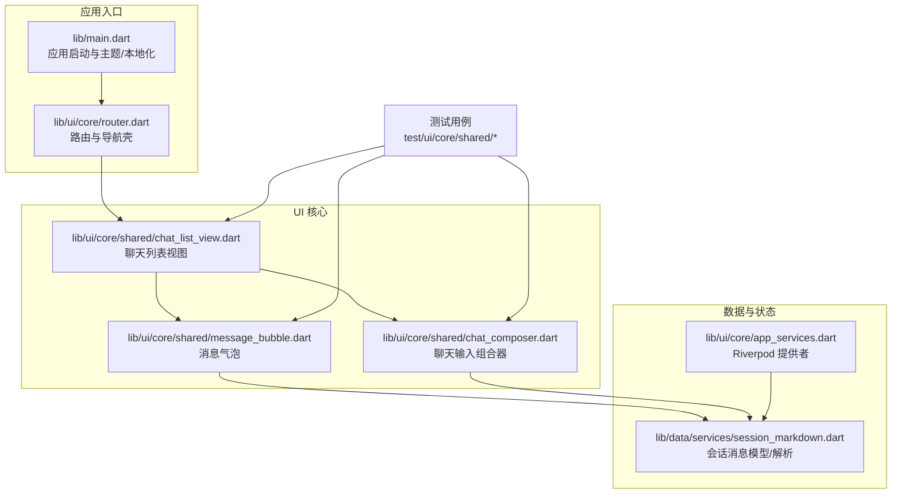
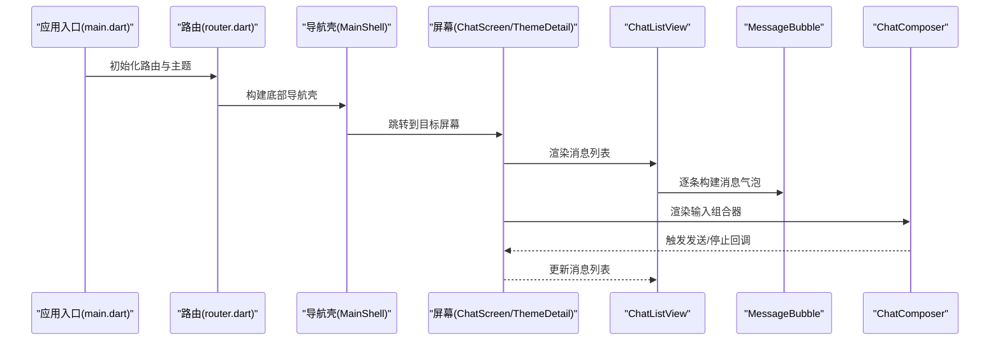
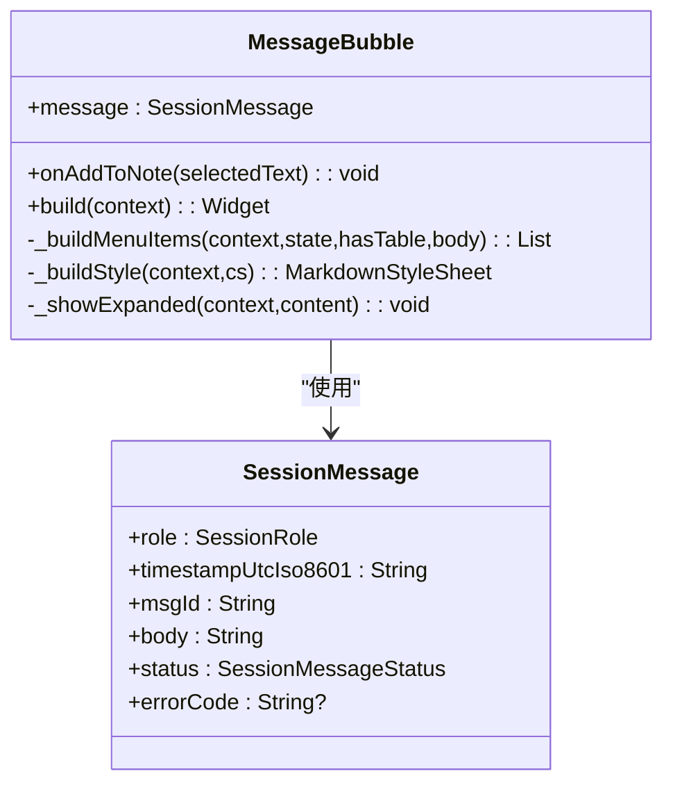
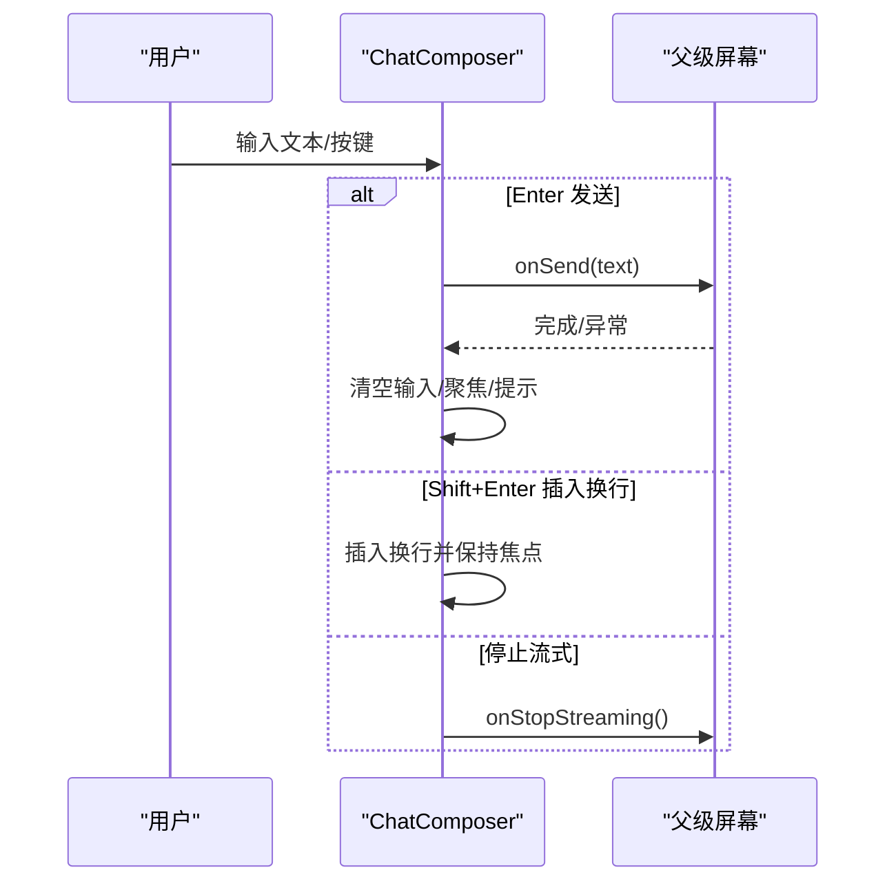
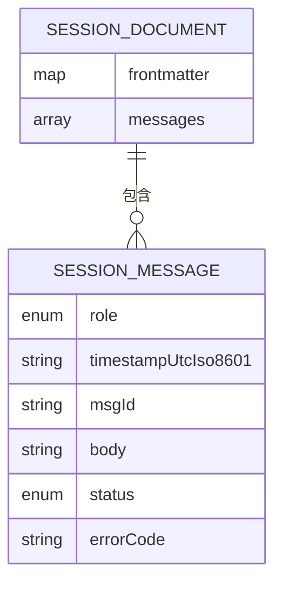
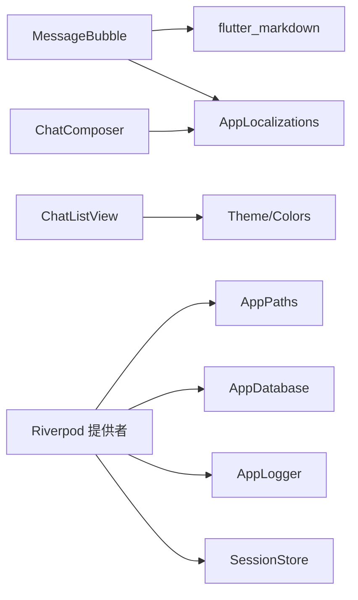

# UI 组件库

<cite>
**本文引用的文件**
- [lib/main.dart](file://lib/main.dart)
- [lib/ui/core/shared/message_bubble.dart](file://lib/ui/core/shared/message_bubble.dart)
- [lib/ui/core/shared/chat_composer.dart](file://lib/ui/core/shared/chat_composer.dart)
- [lib/ui/core/shared/chat_list_view.dart](file://lib/ui/core/shared/chat_list_view.dart)
- [lib/data/services/session_markdown.dart](file://lib/data/services/session_markdown.dart)
- [lib/ui/core/router.dart](file://lib/ui/core/router.dart)
- [lib/ui/core/app_services.dart](file://lib/ui/core/app_services.dart)
- [test/ui/core/shared/message_bubble_test.dart](file://test/ui/core/shared/message_bubble_test.dart)
- [test/ui/core/shared/chat_composer_test.dart](file://test/ui/core/shared/chat_composer_test.dart)
- [test/ui/core/shared/chat_list_view_test.dart](file://test/ui/core/shared/chat_list_view_test.dart)
- [pubspec.yaml](file://pubspec.yaml)
- [README.md](file://README.md)
</cite>

## 目录
1. [简介](#简介)
2. [项目结构](#项目结构)
3. [核心组件](#核心组件)
4. [架构总览](#架构总览)
5. [组件详细分析](#组件详细分析)
6. [依赖关系分析](#依赖关系分析)
7. [性能考虑](#性能考虑)
8. [故障排查指南](#故障排查指南)
9. [结论](#结论)
10. [附录](#附录)

## 简介
本文件为 ThkTree UI 组件库的系统化技术文档，聚焦于核心 UI 组件：消息气泡（MessageBubble）、聊天组合器（ChatComposer）与聊天列表视图（ChatListView）。文档从架构、数据模型、交互行为、可访问性与响应式设计、状态管理与动画、到测试与集成实践进行深入说明，并提供可视化图示帮助理解。

## 项目结构
ThkTree 采用 Flutter 应用结构，UI 组件位于 lib/ui/core/shared 下，数据模型与解析逻辑位于 lib/data/services，应用入口与路由在 lib/main.dart 与 lib/ui/core/router.dart 中定义；状态管理通过 Riverpod 提供者体系注入。

图表来源
- [lib/main.dart:15-93](file://lib/main.dart#L15-L93)
- [lib/ui/core/router.dart:18-126](file://lib/ui/core/router.dart#L18-L126)
- [lib/ui/core/shared/message_bubble.dart:41-215](file://lib/ui/core/shared/message_bubble.dart#L41-L215)
- [lib/ui/core/shared/chat_composer.dart:5-160](file://lib/ui/core/shared/chat_composer.dart#L5-L160)
- [lib/ui/core/shared/chat_list_view.dart:8-99](file://lib/ui/core/shared/chat_list_view.dart#L8-L99)
- [lib/data/services/session_markdown.dart:4-32](file://lib/data/services/session_markdown.dart#L4-L32)
- [lib/ui/core/app_services.dart:27-169](file://lib/ui/core/app_services.dart#L27-L169)

章节来源
- [lib/main.dart:15-93](file://lib/main.dart#L15-L93)
- [lib/ui/core/router.dart:18-126](file://lib/ui/core/router.dart#L18-L126)
- [pubspec.yaml:30-49](file://pubspec.yaml#L30-L49)

## 核心组件
本节概述三大核心组件的功能定位、职责边界与协作关系：
- 消息气泡（MessageBubble）：渲染单条会话消息，支持 Markdown 渲染、表格检测与展开、上下文菜单（复制、添加到笔记、展开表格）。
- 聊天组合器（ChatComposer）：提供多行文本输入、快捷键处理（Enter/Shift+Enter 插入换行）、发送/停止流式输出按钮、错误回滚提示。
- 聊天列表视图（ChatListView）：基于 ListView.builder 的滚动容器，自动贴底、智能暂停/恢复滚动、空态提示。

章节来源
- [lib/ui/core/shared/message_bubble.dart:41-215](file://lib/ui/core/shared/message_bubble.dart#L41-L215)
- [lib/ui/core/shared/chat_composer.dart:5-160](file://lib/ui/core/shared/chat_composer.dart#L5-L160)
- [lib/ui/core/shared/chat_list_view.dart:8-99](file://lib/ui/core/shared/chat_list_view.dart#L8-L99)
- [lib/data/services/session_markdown.dart:16-32](file://lib/data/services/session_markdown.dart#L16-L32)

## 架构总览
下图展示应用启动、路由分发、组件装配与数据流的整体关系：

图表来源
- [lib/main.dart:61-93](file://lib/main.dart#L61-L93)
- [lib/ui/core/router.dart:89-125](file://lib/ui/core/router.dart#L89-L125)
- [lib/ui/core/shared/chat_list_view.dart:34-84](file://lib/ui/core/shared/chat_list_view.dart#L34-L84)
- [lib/ui/core/shared/message_bubble.dart:41-141](file://lib/ui/core/shared/message_bubble.dart#L41-L141)
- [lib/ui/core/shared/chat_composer.dart:46-117](file://lib/ui/core/shared/chat_composer.dart#L46-L117)

## 组件详细分析

### 消息气泡（MessageBubble）
- 功能特性
  - 基于角色（用户/助手/系统）设置对齐方向与背景色。
  - 渲染 Markdown 内容，支持内联代码、代码块、表格样式。
  - 表格检测与“展开”能力：当消息包含表格时显示“展开”按钮，进入全屏可缩放表格视图。
  - 上下文菜单：复制选中文本、将选中内容添加到笔记（需传入回调）、展开表格。
  - 状态文本：根据消息状态（完成/流式/错误）显示对应文案或错误码。
- 关键属性
  - message: SessionMessage（必填）
  - onAddToNote: 回调函数（可选），用于“添加到笔记”功能
- 交互与行为
  - 选中文本后弹出自适应工具栏，包含默认复制项与扩展项。
  - 流式消息显示“正在生成”状态；错误消息显示错误码或“未知错误”。
  - 表格宽度超过限制时自动约束最大宽度，并在有表格时启用横向滚动。
- 可访问性与响应式
  - 使用 Material 风格的主题与颜色方案，确保对比度与可读性。
  - 在小屏设备上自动调整最大宽度，避免溢出。
- 复杂度与性能
  - 表格识别为 O(n) 行扫描，渲染 Markdown 为 UI 层开销；建议在长文本场景控制消息长度与刷新频率。

图表来源
- [lib/ui/core/shared/message_bubble.dart:41-215](file://lib/ui/core/shared/message_bubble.dart#L41-L215)
- [lib/data/services/session_markdown.dart:16-32](file://lib/data/services/session_markdown.dart#L16-L32)

章节来源
- [lib/ui/core/shared/message_bubble.dart:41-215](file://lib/ui/core/shared/message_bubble.dart#L41-L215)
- [lib/data/services/session_markdown.dart:4-32](file://lib/data/services/session_markdown.dart#L4-L32)
- [test/ui/core/shared/message_bubble_test.dart:42-144](file://test/ui/core/shared/message_bubble_test.dart#L42-L144)

### 聊天组合器（ChatComposer）
- 功能特性
  - 多行文本输入框，支持最多 6 行，禁用自动纠错与建议。
  - Enter 发送、Shift+Enter 插入换行；IME 输入中组合状态忽略发送。
  - 根据 isStreaming 切换“发送/停止”按钮；enabled 控制整体可用性。
  - 成功发送后清空输入并重新聚焦；异常时回滚文本并提示 SnackBar。
- 关键属性
  - hintText: 提示文本（必填）
  - isStreaming: 是否处于流式输出（必填）
  - enabled: 是否启用（可选，默认 true）
  - onSend(text): 发送回调（必填）
  - onStopStreaming(): 停止流式输出回调（必填）
- 交互与行为
  - 自动聚焦输入框；支持键盘事件与提交事件两种触发路径。
  - 发送前校验非空；流式状态下点击按钮触发停止回调。
- 可访问性与响应式
  - 使用安全区域与合适的内边距，适配刘海屏与底部安全区。
  - 按钮文本随本地化资源动态更新。

图表来源
- [lib/ui/core/shared/chat_composer.dart:46-117](file://lib/ui/core/shared/chat_composer.dart#L46-L117)
- [lib/ui/core/shared/chat_composer.dart:119-135](file://lib/ui/core/shared/chat_composer.dart#L119-L135)
- [lib/ui/core/shared/chat_composer.dart:137-144](file://lib/ui/core/shared/chat_composer.dart#L137-L144)

章节来源
- [lib/ui/core/shared/chat_composer.dart:5-160](file://lib/ui/core/shared/chat_composer.dart#L5-L160)
- [test/ui/core/shared/chat_composer_test.dart:36-134](file://test/ui/core/shared/chat_composer_test.dart#L36-L134)

### 聊天列表视图（ChatListView）
- 功能特性
  - 空态提示：无消息时居中显示“暂无消息”。
  - 智能滚动：首次渲染自动贴底；用户手动滚动到历史则暂停贴底，回到底部时恢复。
  - 可插拔消息渲染：通过 messageBuilder 接受任意消息渲染逻辑。
- 关键属性
  - messages: List<SessionMessage>（必填）
  - messageBuilder: 渲染函数（必填）
- 交互与行为
  - 使用 ScrollController 与 NotificationListener 监听滚动事件，计算是否接近底部并决定是否贴底。
  - 动画滚动至底部时使用缓动曲线，保证顺滑体验。
- 性能与复杂度
  - 使用 ListView.builder，按需渲染可见项；滚动监听为轻量通知处理。

图表来源
- [lib/ui/core/shared/chat_list_view.dart:34-84](file://lib/ui/core/shared/chat_list_view.dart#L34-L84)
- [lib/ui/core/shared/chat_list_view.dart:86-97](file://lib/ui/core/shared/chat_list_view.dart#L86-L97)

章节来源
- [lib/ui/core/shared/chat_list_view.dart:8-99](file://lib/ui/core/shared/chat_list_view.dart#L8-L99)
- [test/ui/core/shared/chat_list_view_test.dart:38-67](file://test/ui/core/shared/chat_list_view_test.dart#L38-L67)

### 数据模型与解析（SessionMessage/SessionDocument）
- SessionRole：user、assistant、system
- SessionMessageStatus：done、streaming、error
- SessionMessage：包含角色、时间戳、消息 ID、正文、状态与错误码
- SessionDocument：包含前端元信息与消息列表
- 解析流程：解析前端元信息（YAML）与消息体，提取每条消息的标题行（角色/时间戳/ID）、状态标记（流式/错误）与正文

图表来源
- [lib/data/services/session_markdown.dart:16-42](file://lib/data/services/session_markdown.dart#L16-L42)

章节来源
- [lib/data/services/session_markdown.dart:4-32](file://lib/data/services/session_markdown.dart#L4-L32)
- [lib/data/services/session_markdown.dart:49-184](file://lib/data/services/session_markdown.dart#L49-L184)

## 依赖关系分析
- 组件依赖
  - MessageBubble 依赖 Markdown 渲染与本地化资源，内部包含表格展开视图。
  - ChatComposer 依赖本地化资源与键盘事件处理。
  - ChatListView 依赖滚动控制器与通知监听。
- 状态与服务
  - Riverpod 提供应用路径、数据库、日志、LLM 客户端、会话存储等服务，贯穿屏幕与组件。
- 外部依赖
  - Flutter、Material3、flutter_markdown、go_router、flutter_riverpod 等。

图表来源
- [lib/ui/core/shared/message_bubble.dart:1-6](file://lib/ui/core/shared/message_bubble.dart#L1-L6)
- [lib/ui/core/shared/chat_composer.dart:1-4](file://lib/ui/core/shared/chat_composer.dart#L1-L4)
- [lib/ui/core/app_services.dart:27-169](file://lib/ui/core/app_services.dart#L27-L169)
- [pubspec.yaml:30-49](file://pubspec.yaml#L30-L49)

章节来源
- [pubspec.yaml:30-49](file://pubspec.yaml#L30-L49)
- [lib/ui/core/app_services.dart:27-169](file://lib/ui/core/app_services.dart#L27-L169)

## 性能考虑
- 列表渲染
  - ChatListView 使用 ListView.builder，仅渲染可见项；建议在消息数量较大时避免一次性加载全部消息。
- 滚动优化
  - 通过 NotificationListener 的轻量监听与贴底策略，减少不必要的重绘；滚动动画时长与曲线已设定，避免卡顿。
- Markdown 渲染
  - MessageBubble 对表格进行横向滚动与最大宽度约束，避免布局抖动；表格展开视图采用 InteractiveViewer 与垂直滚动，提升可读性。
- 键盘与输入
  - ChatComposer 在发送前进行空值校验，避免无效请求；异常时回滚文本并提示，降低重复输入成本。
- 状态管理
  - Riverpod 提供者按需初始化与懒加载，避免启动时的阻塞。

## 故障排查指南
- 发送按钮不可用
  - 检查 enabled 参数是否为 true；确认 isStreaming 状态是否正确传递。
- 发送失败未回滚
  - 确认 onSend 抛出异常时是否被 try/catch 包裹；检查 SnackBar 显示逻辑。
- 表格无法展开
  - 确认消息正文包含符合表格格式的行与分隔行；检查上下文菜单中“展开表格”按钮是否出现。
- 滚动不贴底
  - 检查是否手动滚动到历史；确认贴底阈值与滚动通知逻辑；确保消息列表在首帧后执行贴底。
- 本地化文本缺失
  - 确认 AppLocalizations 已正确注册与支持相应语言；检查 supportedLocales 与 localeResolutionCallback。

章节来源
- [lib/ui/core/shared/chat_composer.dart:119-135](file://lib/ui/core/shared/chat_composer.dart#L119-L135)
- [lib/ui/core/shared/message_bubble.dart:143-185](file://lib/ui/core/shared/message_bubble.dart#L143-L185)
- [lib/ui/core/shared/chat_list_view.dart:46-73](file://lib/ui/core/shared/chat_list_view.dart#L46-L73)
- [lib/main.dart:67-91](file://lib/main.dart#L67-L91)

## 结论
ThkTree UI 组件库围绕消息渲染、输入与列表展示形成清晰的职责划分：MessageBubble 负责富文本与上下文交互，ChatComposer 提供便捷的输入与快捷键处理，ChatListView 实现智能滚动与可插拔渲染。配合 Riverpod 提供的基础设施与本地化支持，组件具备良好的可扩展性与可维护性。建议在实际业务中结合测试用例完善边界场景覆盖，并持续关注 Markdown 渲染与长列表性能优化。

## 附录
- 使用示例与最佳实践
  - 在屏幕中组合 ChatListView 与 ChatComposer，通过 messageBuilder 将 SessionMessage 渲染为 MessageBubble。
  - 通过 Riverpod 提供的会话存储加载消息列表，实时更新 ChatListView。
  - 在 MessageBubble 上挂载 onAddToNote 回调，实现“添加到笔记”的上下文菜单功能。
- 响应式设计指南
  - 使用 ConstrainedBox 与最大宽度约束，避免在小屏设备上溢出。
  - 表格场景使用横向滚动与 InteractiveViewer，确保可读性与可触达性。
- 无障碍访问合规性
  - 使用 Material 主题与颜色方案，确保对比度与可读性。
  - 文本输入禁用自动纠错与建议，提升输入稳定性。
  - 通过本地化资源统一文案，支持多语言环境。