# 核心 UI 组件

<cite>
**本文引用的文件**
- [message_bubble.dart](file://lib/ui/core/shared/message_bubble.dart)
- [chat_composer.dart](file://lib/ui/core/shared/chat_composer.dart)
- [chat_list_view.dart](file://lib/ui/core/shared/chat_list_view.dart)
- [thk_button.dart](file://lib/ui/core/widgets/thk_button.dart)
- [thk_text_field.dart](file://lib/ui/core/widgets/thk_text_field.dart)
- [thk_nav_bar.dart](file://lib/ui/core/widgets/thk_nav_bar.dart)
- [thk_list_tile.dart](file://lib/ui/core/widgets/thk_list_tile.dart)
- [thk_list_section.dart](file://lib/ui/core/widgets/thk_list_section.dart)
- [thk_alert.dart](file://lib/ui/core/widgets/thk_alert.dart)
- [thk_action_sheet.dart](file://lib/ui/core/widgets/thk_action_sheet.dart)
- [widgets.dart](file://lib/ui/core/widgets/widgets.dart)
- [session_markdown.dart](file://lib/data/services/session_markdown.dart)
- [message_bubble_test.dart](file://test/ui/core/shared/message_bubble_test.dart)
- [chat_composer_test.dart](file://test/ui/core/shared/chat_composer_test.dart)
- [chat_list_view_test.dart](file://test/ui/core/shared/chat_list_view_test.dart)
- [node_meta.dart](file://lib/data/models/node_meta.dart)
- [theme_meta.dart](file://lib/data/models/theme_meta.dart)
- [node.dart](file://lib/domain/node.dart)
- [theme.dart](file://lib/domain/theme.dart)
- [ids.dart](file://lib/domain/ids.dart)
- [ios-migration-plan.md](file://docs/ios-migration-plan.md)
</cite>

## 更新摘要
**变更内容**
- 新增 iOS 原生组件库文档，包含 ThkButton、ThkTextField、ThkNavBar、ThkListTile、ThkListSection、ThkAlert、ThkActionSheet 七个核心组件
- 添加 iOS 迁移计划与 Material 组件对比指南
- 更新组件架构图以反映新的 iOS 原生组件体系
- 新增 iOS 设计基线与视觉规范说明

## 目录
1. [简介](#简介)
2. [项目结构](#项目结构)
3. [核心组件](#核心组件)
4. [架构总览](#架构总览)
5. [组件详解](#组件详解)
6. [iOS 原生组件库](#ios-原生组件库)
7. [Material 组件对比与迁移指南](#material-组件对比与迁移指南)
8. [依赖关系分析](#依赖关系分析)
9. [性能考量](#性能考量)
10. [故障排查指南](#故障排查指南)
11. [结论](#结论)
12. [附录](#附录)

## 简介
本文件聚焦 ThkTree 的核心 UI 组件：消息气泡、聊天组合器、列表视图以及新增的 iOS 原生组件库。文档从设计与实现两方面阐述各组件的视觉外观、行为特征、交互模式、属性配置、事件处理、状态管理与自定义选项；并结合测试用例说明典型使用场景与验证点。同时覆盖响应式布局、动画与过渡效果、状态管理机制、数据绑定方式以及性能优化策略，并解释组件间通信与组合使用方式。

**更新** 新增 iOS 原生组件库，包括导航栏、按钮、文本输入框、列表组件、弹窗组件等，实现从 Material Design 到 iOS Cupertino Design 的完整迁移。

## 项目结构
核心 UI 组件分为两层：传统共享组件（lib/ui/core/shared）和 iOS 原生组件库（lib/ui/core/widgets）。共享组件继续围绕会话消息进行渲染与交互，iOS 原生组件库提供完整的 iOS 设计语言实现。

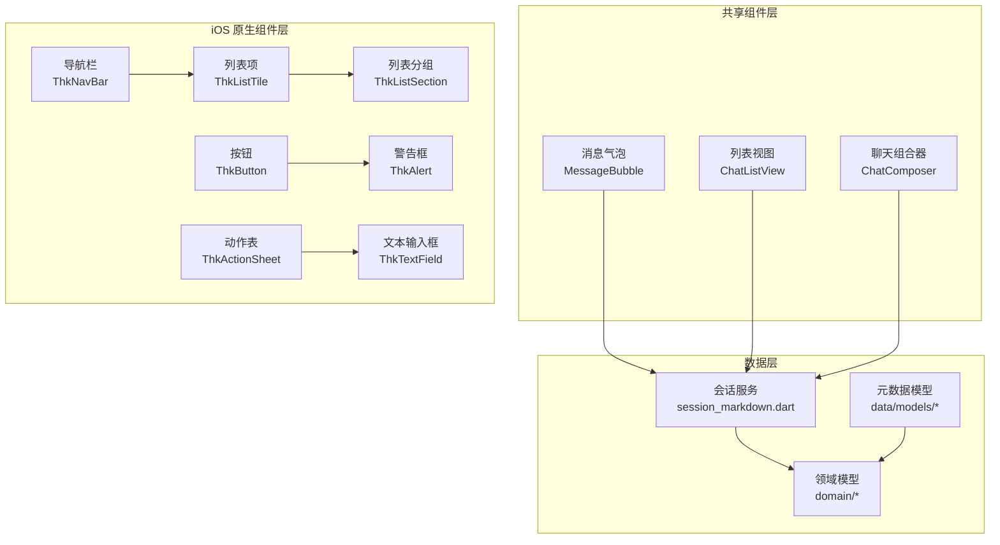

**图表来源**
- [message_bubble.dart:1-265](file://lib/ui/core/shared/message_bubble.dart#L1-L265)
- [chat_composer.dart:1-160](file://lib/ui/core/shared/chat_composer.dart#L1-L160)
- [chat_list_view.dart:1-99](file://lib/ui/core/shared/chat_list_view.dart#L1-L99)
- [thk_nav_bar.dart:1-121](file://lib/ui/core/widgets/thk_nav_bar.dart#L1-L121)
- [thk_list_tile.dart:1-88](file://lib/ui/core/widgets/thk_list_tile.dart#L1-L88)
- [thk_list_section.dart:1-82](file://lib/ui/core/widgets/thk_list_section.dart#L1-L82)
- [thk_button.dart:1-156](file://lib/ui/core/widgets/thk_button.dart#L1-L156)
- [thk_text_field.dart:1-152](file://lib/ui/core/widgets/thk_text_field.dart#L1-L152)
- [thk_alert.dart:1-132](file://lib/ui/core/widgets/thk_alert.dart#L1-L132)
- [thk_action_sheet.dart:1-96](file://lib/ui/core/widgets/thk_action_sheet.dart#L1-L96)

**章节来源**
- [message_bubble.dart:1-265](file://lib/ui/core/shared/message_bubble.dart#L1-L265)
- [chat_composer.dart:1-160](file://lib/ui/core/shared/chat_composer.dart#L1-L160)
- [chat_list_view.dart:1-99](file://lib/ui/core/shared/chat_list_view.dart#L1-L99)
- [thk_nav_bar.dart:1-121](file://lib/ui/core/widgets/thk_nav_bar.dart#L1-L121)
- [thk_list_tile.dart:1-88](file://lib/ui/core/widgets/thk_list_tile.dart#L1-L88)
- [thk_list_section.dart:1-82](file://lib/ui/core/widgets/thk_list_section.dart#L1-L82)
- [thk_button.dart:1-156](file://lib/ui/core/widgets/thk_button.dart#L1-L156)
- [thk_text_field.dart:1-152](file://lib/ui/core/widgets/thk_text_field.dart#L1-L152)
- [thk_alert.dart:1-132](file://lib/ui/core/widgets/thk_alert.dart#L1-L132)
- [thk_action_sheet.dart:1-96](file://lib/ui/core/widgets/thk_action_sheet.dart#L1-L96)

## 核心组件
- **消息气泡（MessageBubble）**
  - 职责：根据消息角色与状态渲染 Markdown 内容，支持复制选中文本、添加到笔记、表格展开查看等交互。
  - 关键特性：按角色设置对齐与配色；自动识别 Markdown 表格并提供"展开"入口；上下文菜单集成"添加到笔记"。
- **聊天组合器（ChatComposer）**
  - 职责：输入框与发送/停止按钮，支持多行输入、快捷键（回车发送、Shift/Ctrl+回车换行）、流式状态切换。
  - 关键特性：输入焦点管理、错误提示、禁用态控制。
- **列表视图（ChatListView）**
  - 职责：滚动列表容器，智能吸附底部、用户滚动行为感知、消息构建器回调。
  - 关键特性：滚动通知监听、吸附/松开逻辑、平滑滚动至底部。
- **iOS 原生组件库**
  - **ThkNavBar**：支持 Large Title 和 Inline Title 双模式的导航栏组件
  - **ThkListSection**：iOS Settings 风格的分组列表容器
  - **ThkListTile**：替代 Material ListTile 的 iOS 原生列表项
  - **ThkButton**：三种样式的 iOS 风格按钮（filled、tinted、plain）
  - **ThkTextField**：基于 CupertinoTextField 的 iOS 风格文本输入框
  - **ThkAlert**：iOS 风格警告对话框封装
  - **ThkActionSheet**：iOS 风格动作表封装

**章节来源**
- [message_bubble.dart:41-215](file://lib/ui/core/shared/message_bubble.dart#L41-L215)
- [chat_composer.dart:5-159](file://lib/ui/core/shared/chat_composer.dart#L5-L159)
- [chat_list_view.dart:8-98](file://lib/ui/core/shared/chat_list_view.dart#L8-L98)
- [thk_nav_bar.dart:13-71](file://lib/ui/core/widgets/thk_nav_bar.dart#L13-L71)
- [thk_list_section.dart:17-82](file://lib/ui/core/widgets/thk_list_section.dart#L17-L82)
- [thk_list_tile.dart:17-88](file://lib/ui/core/widgets/thk_list_tile.dart#L17-L88)
- [thk_button.dart:11-156](file://lib/ui/core/widgets/thk_button.dart#L11-L156)
- [thk_text_field.dart:15-152](file://lib/ui/core/widgets/thk_text_field.dart#L15-L152)
- [thk_alert.dart:23-132](file://lib/ui/core/widgets/thk_alert.dart#L23-L132)
- [thk_action_sheet.dart:47-96](file://lib/ui/core/widgets/thk_action_sheet.dart#L47-L96)

## 架构总览
消息从数据层生成，经由 ChatListView 渲染为若干 MessageBubble；用户通过 ChatComposer 输入并触发发送或停止流式输出。iOS 原生组件库提供完整的界面基础，包括导航栏、列表、按钮、弹窗等组件。上下文菜单与路由用于扩展功能（如表格展开）。

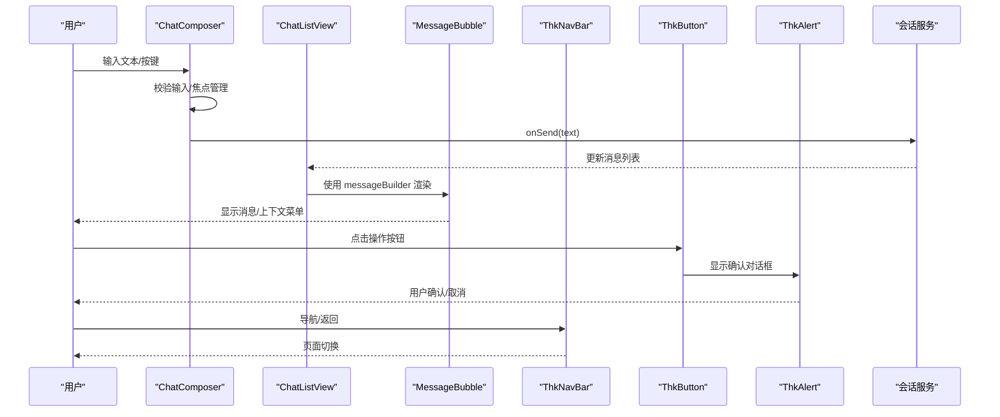

**图表来源**
- [chat_composer.dart:119-135](file://lib/ui/core/shared/chat_composer.dart#L119-L135)
- [chat_list_view.dart:74-83](file://lib/ui/core/shared/chat_list_view.dart#L74-L83)
- [message_bubble.dart:208-214](file://lib/ui/core/shared/message_bubble.dart#L208-L214)
- [thk_button.dart:114-152](file://lib/ui/core/widgets/thk_button.dart#L114-L152)
- [thk_alert.dart:31-90](file://lib/ui/core/widgets/thk_alert.dart#L31-L90)

## 组件详解

### 消息气泡（MessageBubble）
- **视觉外观**
  - 用户消息右对齐，助手/系统消息左对齐；卡片背景随角色变化；状态文本显示"流式中/错误/无"。
  - Markdown 样式基于主题样式表，代码块与表格具备特定配色与边框。
- **行为特征**
  - 自动检测 Markdown 表格，若存在则提供"展开"按钮；点击后进入可缩放/滚动的全屏视图。
  - 支持选择性复制，上下文菜单动态注入"添加到笔记"项（当有选中文本且提供回调时）。
- **用户交互**
  - 长按触发选择区域上下文菜单；支持复制、粘贴、全选等系统默认项；可选"添加到笔记"。
  - 表格存在时显示"展开"按钮，点击后进入新页面查看完整表格。
- **属性配置**
  - 必填：message（会话消息对象）
  - 可选：onAddToNote（选中文本回调，用于"添加到笔记"）
- **事件处理**
  - 上下文菜单项点击后隐藏工具栏并调用回调；导航到表格展开页。
- **状态管理**
  - 作为无状态组件，依赖外部传入的 SessionMessage 与回调；内部不维护消息状态。
- **自定义选项**
  - 通过自定义 messageBuilder 将消息映射为任意 Widget；Markdown 样式可由主题驱动。
- **响应式设计**
  - 当存在表格时，最大宽度适配屏幕宽度；表格内容横向可滚动；展开页纵向可滚动并支持缩放。
- **动画与过渡**
  - 列表滚动至底部时使用平滑动画；表格展开页采用交互式缩放与滚动。
- **性能优化**
  - 仅在存在表格时启用横向滚动容器；Markdown 渲染按需进行；避免不必要的重建。
- **代码片段路径**
  - [消息气泡主实现:41-215](file://lib/ui/core/shared/message_bubble.dart#L41-L215)
  - [表格展开视图:217-264](file://lib/ui/core/shared/message_bubble.dart#L217-L264)

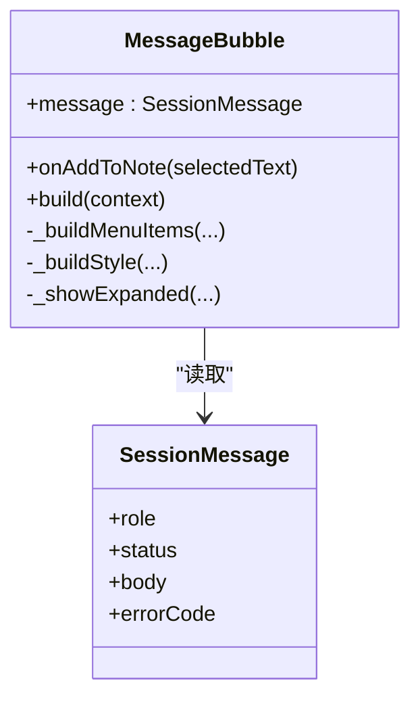

**图表来源**
- [message_bubble.dart:41-215](file://lib/ui/core/shared/message_bubble.dart#L41-L215)
- [session_markdown.dart:16-32](file://lib/data/services/session_markdown.dart#L16-L32)

**章节来源**
- [message_bubble.dart:41-215](file://lib/ui/core/shared/message_bubble.dart#L41-L215)
- [session_markdown.dart:4-32](file://lib/data/services/session_markdown.dart#L4-L32)
- [message_bubble_test.dart:10-144](file://test/ui/core/shared/message_bubble_test.dart#L10-L144)

### 聊天组合器（ChatComposer）
- **视觉外观**
  - 左侧多行文本输入框，右侧发送/停止按钮；禁用态按钮不可点击。
- **行为特征**
  - 回车发送：普通回车发送，Shift/Ctrl+回车插入换行；输入处于 IME 编码状态时不发送。
  - 流式状态：根据 isStreaming 切换按钮文字与行为；点击停止流式输出。
  - 错误处理：发送失败时恢复输入并弹出 SnackBar 提示。
- **用户交互**
  - 键盘事件与提交事件统一处理；自动聚焦输入框；清空输入后重新获取焦点。
- **属性配置**
  - 必填：hintText、isStreaming、onSend、onStopStreaming
  - 可选：enabled（整体禁用）
- **事件处理**
  - 发送成功后请求焦点；异常时回滚文本并提示。
  - 停止流式输出调用 onStopStreaming。
- **状态管理**
  - 内部维护 TextEditingController 与 FocusNode；生命周期内正确释放资源。
- **自定义选项**
  - 通过 onSend/onStopStreaming 注入业务逻辑；hintText 支持本地化。
- **响应式设计**
  - 文本域多行显示，最大高度限制；按钮尺寸自适应。
- **动画与过渡**
  - 无专用动画，但发送后焦点管理提升交互流畅度。
- **性能优化**
  - 过滤无效输入（空白/仅空白）；避免重复发送；合理释放控制器与焦点节点。
- **代码片段路径**
  - [组合器主实现:5-159](file://lib/ui/core/shared/chat_composer.dart#L5-159)

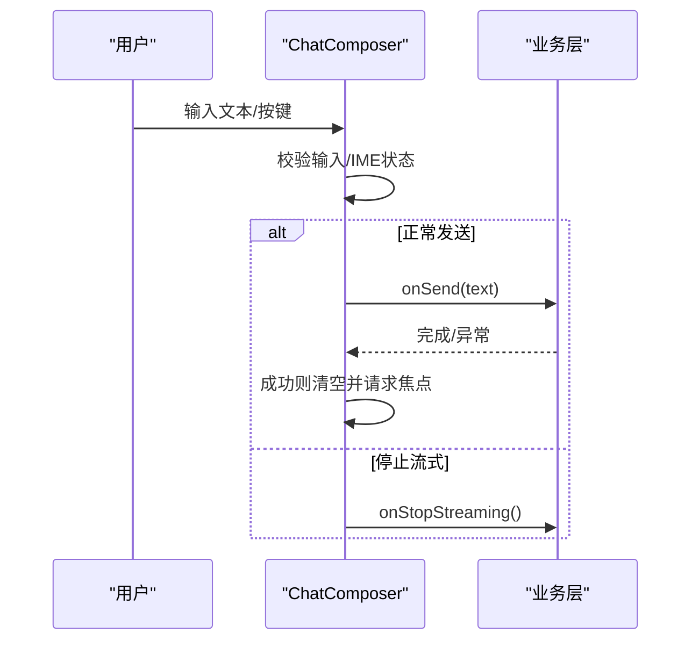

**图表来源**
- [chat_composer.dart:119-144](file://lib/ui/core/shared/chat_composer.dart#L119-L144)

**章节来源**
- [chat_composer.dart:5-159](file://lib/ui/core/shared/chat_composer.dart#L5-L159)
- [chat_composer_test.dart:7-135](file://test/ui/core/shared/chat_composer_test.dart#L7-L135)

### 列表视图（ChatListView）
- **视觉外观**
  - 默认居中显示"暂无消息"占位；消息列表使用卡片式布局，左右对齐随角色变化。
- **行为特征**
  - 空列表显示占位文本；首次绘制后自动滚动至底部；用户滚动时智能判断是否继续吸附。
  - 监听滚动通知：用户滚动、更新、结束等阶段分别处理吸附状态。
- **用户交互**
  - 通过 messageBuilder 将 SessionMessage 渲染为任意 Widget；支持自定义消息体。
- **属性配置**
  - 必填：messages（SessionMessage 列表）、messageBuilder（消息渲染函数）
- **事件处理**
  - 无显式回调；通过外部刷新 messages 触发重建。
- **状态管理**
  - 内部维护滚动控制器与吸附标记；根据滚动方向与位置动态更新吸附状态。
- **自定义选项**
  - 通过 messageBuilder 实现差异化渲染（如富文本、图片、视频等）。
- **响应式设计**
  - 列表内边距统一；消息宽度在表格场景下自适应屏幕宽度。
- **动画与过渡**
  - 新消息到达时平滑滚动至底部，曲线为 easeOut，时长较短以保证即时反馈。
- **性能优化**
  - 使用 ListView.builder；仅在需要时滚动至底部；避免频繁 setState。
- **代码片段路径**
  - [列表视图主实现:8-98](file://lib/ui/core/shared/chat_list_view.dart#L8-98)

**图表来源**
- [chat_list_view.dart:41-97](file://lib/ui/core/shared/chat_list_view.dart#L41-L97)

**章节来源**
- [chat_list_view.dart:8-98](file://lib/ui/core/shared/chat_list_view.dart#L8-L98)
- [chat_list_view_test.dart:8-69](file://test/ui/core/shared/chat_list_view_test.dart#L8-L69)

## iOS 原生组件库

### 导航栏组件（ThkNavBar）
- **视觉外观**
  - 支持 Large Title 和 Inline Title 两种模式；Large Title 模式基于 CupertinoSliverNavigationBar，滚动时自动从 large 收缩为 inline。
  - 默认背景为 systemBackground，滚动时自动显示 hairline 分隔线。
- **行为特征**
  - large 模式：需要在 CustomScrollView 中使用，支持 previousPageTitle 参数。
  - inline 模式：基于 CupertinoNavigationBar，标题固定显示在导航栏中央。
  - 提供 ThkLargeTitlePage 便捷 Scaffold，自动处理 sliver 结构。
- **用户交互**
  - 支持 leading、trailing、middle、previousPageTitle 参数；自动处理页面返回逻辑。
- **属性配置**
  - large 模式：title、leading、trailing、middle、previousPageTitle、alwaysShowMiddle、padding、border、backgroundColor
  - inline 模式：title、leading、trailing、middle、previousPageTitle、automaticallyImplyLeading、automaticallyImplyMiddle、padding、border、backgroundColor
- **事件处理**
  - 通过参数回调处理导航事件；支持自定义中间部件。
- **自定义选项**
  - 支持自定义背景色、边框、内边距；可配置是否始终显示中间部件。
- **响应式设计**
  - Large Title 模式支持滚动收缩；inline 模式固定高度。
- **动画与过渡**
  - Large Title 滚动时的收缩动画；页面切换使用 CupertinoPageRoute。
- **性能优化**
  - 使用 Cupertino 原生组件，性能优化良好；避免不必要的重建。
- **代码片段路径**
  - [导航栏主实现:13-71](file://lib/ui/core/widgets/thk_nav_bar.dart#L13-L71)
  - [大标题页面:76-121](file://lib/ui/core/widgets/thk_nav_bar.dart#L76-L121)

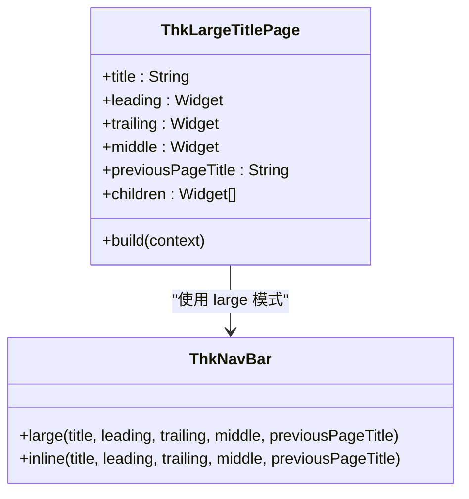

**图表来源**
- [thk_nav_bar.dart:13-71](file://lib/ui/core/widgets/thk_nav_bar.dart#L13-L71)
- [thk_nav_bar.dart:76-121](file://lib/ui/core/widgets/thk_nav_bar.dart#L76-L121)

**章节来源**
- [thk_nav_bar.dart:13-121](file://lib/ui/core/widgets/thk_nav_bar.dart#L13-L121)

### 列表组件（ThkListSection & ThkListTile）

#### 列表分组（ThkListSection）
- **视觉外观**
  - iOS Settings 风格的 inset grouped 列表分组容器；圆角 10，外边距 horizontal 16 vertical 8。
  - 背景使用 secondarySystemGroupedBackground；支持 header/footer 文本。
- **行为特征**
  - 自动处理圆角、背景和分隔线；子项之间自动加 hairline divider（indent: 16），最后一项不加。
  - 分隔线左侧缩进 56pt，对齐标题文本左侧。
- **用户交互**
  - 作为容器组件，内部子组件可自行处理点击事件。
- **属性配置**
  - header：分组头部文本，通常为大写灰色小字
  - footer：分组尾部文本
  - children：列表项子组件列表
  - margin：分组外边距，默认 EdgeInsetsDirectional.fromSTEB(20, 0, 20, 20)
  - additionalDividerMargin：分隔线左侧缩进，默认 56
  - backgroundColor：背景色，默认使用系统 grouped 背景
- **事件处理**
  - 无直接事件处理；通过 children 中的组件处理交互。
- **自定义选项**
  - 支持自定义背景色、外边距、分隔线缩进。
- **响应式设计**
  - 使用 inset grouped 样式，适配 iOS 列表设计规范。
- **动画与过渡**
  - 无专用动画效果。
- **性能优化**
  - 使用 CupertinoListSection.insetGrouped，性能优化良好。
- **代码片段路径**
  - [列表分组主实现:17-82](file://lib/ui/core/widgets/thk_list_section.dart#L17-L82)

#### 列表项（ThkListTile）
- **视觉外观**
  - 替代 Material 的 ListTile，提供默认的右箭头、leading icon 背景等 iOS 风格效果。
  - 高度 44 标准 / 52 双行；整体可点击，按下时背景 systemFill 闪一下。
- **行为特征**
  - 标题、副标题、leading icon、trailing（默认 chevron.right）。
  - 支持 onTap 回调；leading icon 自动添加蓝色背景和圆角。
- **用户交互**
  - 点击整个列表项触发 onTap；支持自定义 trailing 部件。
- **属性配置**
  - title：主标题文本（必填）
  - subtitle：副标题文本
  - additionalInfo：附加信息，显示在标题右侧、trailing 左侧
  - leading：左侧图标或 Widget
  - trailing：右侧尾部 Widget，默认为右箭头 chevron
  - onTap：点击回调
  - backgroundColor：背景色
  - padding：内边距
- **事件处理**
  - 通过 onTap 处理点击事件；支持返回值。
- **自定义选项**
  - 支持自定义背景色、内边距；可使用 chevron 常量。
- **响应式设计**
  - 遵循 iOS 列表设计规范，高度和间距标准化。
- **动画与过渡**
  - 按下时的背景闪烁效果，符合 iOS 交互反馈。
- **性能优化**
  - 使用 CupertinoListTile，性能优化良好。
- **代码片段路径**
  - [列表项主实现:17-88](file://lib/ui/core/widgets/thk_list_tile.dart#L17-L88)

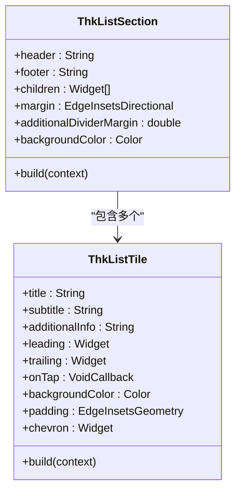

**图表来源**
- [thk_list_section.dart:17-82](file://lib/ui/core/widgets/thk_list_section.dart#L17-L82)
- [thk_list_tile.dart:17-88](file://lib/ui/core/widgets/thk_list_tile.dart#L17-L88)

**章节来源**
- [thk_list_section.dart:17-82](file://lib/ui/core/widgets/thk_list_section.dart#L17-L82)
- [thk_list_tile.dart:17-88](file://lib/ui/core/widgets/thk_list_tile.dart#L17-L88)

### 按钮组件（ThkButton）
- **视觉外观**
  - 三种样式：filled（蓝底白字）、tinted（浅蓝底蓝字）、plain（纯蓝字）。
  - 标准高度 50 / 紧凑 36；支持 disabled 状态。
- **行为特征**
  - filled 样式对应 CupertinoButton.filled；tinted/plain 样式包装 CupertinoButton。
  - 支持 icon 图标；disabled 时自动禁用点击。
- **用户交互**
  - 点击触发 onPressed 回调；disabled 时无响应。
- **属性配置**
  - label：按钮文本（必填）
  - onPressed：点击回调
  - icon：左侧图标
  - disabled：禁用状态
  - padding：内边距
  - borderRadius：圆角半径
- **事件处理**
  - 通过 onPressed 处理点击事件；disabled 时回调为 null。
- **自定义选项**
  - 支持自定义内边距和圆角；可添加左侧图标。
- **响应式设计**
  - 遵循 iOS 按钮设计规范，高度和间距标准化。
- **动画与过渡**
  - 使用 Cupertino 原生按钮的点击反馈效果。
- **性能优化**
  - 无状态组件，性能优化良好。
- **代码片段路径**
  - [按钮主实现:11-156](file://lib/ui/core/widgets/thk_button.dart#L11-L156)

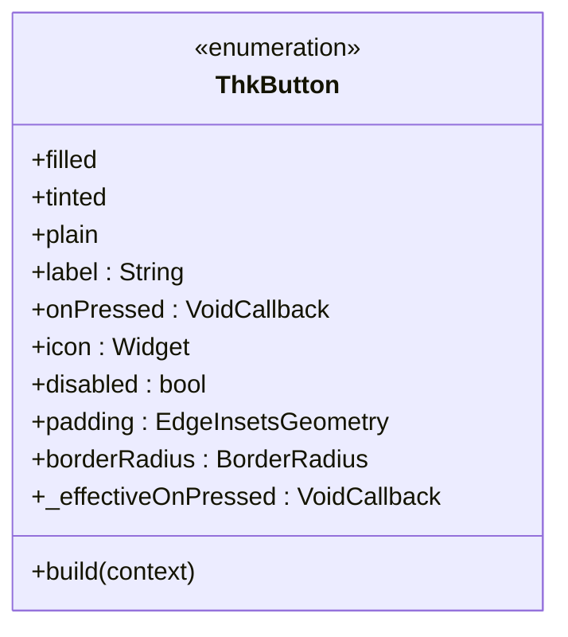

**图表来源**
- [thk_button.dart:11-156](file://lib/ui/core/widgets/thk_button.dart#L11-L156)

**章节来源**
- [thk_button.dart:11-156](file://lib/ui/core/widgets/thk_button.dart#L11-L156)

### 文本输入组件（ThkTextField）
- **视觉外观**
  - 基于 CupertinoTextField，提供 iOS 风格的圆角边框、占位符样式。
  - 默认带 decoration: BoxDecoration(...) 圆角 10、systemFill 背景。
- **行为特征**
  - 支持点击外部自动隐藏键盘；支持 prefix/suffix 前缀/后缀部件。
  - 支持 clearButtonMode、obscureText、keyboardType 等参数。
- **用户交互**
  - 支持 onSubmitted（点击键盘完成/回车）回调；自动聚焦。
- **属性配置**
  - placeholder：占位提示文本
  - controller：文本控制器
  - onChanged：文本变化回调
  - onSubmitted：提交回调
  - prefix/suffix：前后缀部件
  - clearButtonMode：清除按钮显示模式
  - obscureText：隐藏输入（密码模式）
  - keyboardType：键盘类型
  - textInputAction：键盘操作按钮类型
  - maxLines/minLines：最大/最小行数
  - maxLength：最大字符数
  - enabled：可用状态
  - autofocus：自动聚焦
  - focusNode：焦点节点
  - textAlign/style/placeholderStyle：文本样式
  - padding：内边距
  - borderRadius：边框圆角
  - backgroundColor：背景色
- **事件处理**
  - 通过各种回调处理输入事件；支持键盘完成键。
- **自定义选项**
  - 支持自定义样式、内边距、圆角；可添加前后缀部件。
- **响应式设计**
  - 遵循 iOS 文本输入设计规范，圆角和间距标准化。
- **动画与过渡**
  - 无专用动画效果。
- **性能优化**
  - 使用 CupertinoTextField，性能优化良好。
- **代码片段路径**
  - [文本输入框主实现:15-152](file://lib/ui/core/widgets/thk_text_field.dart#L15-L152)

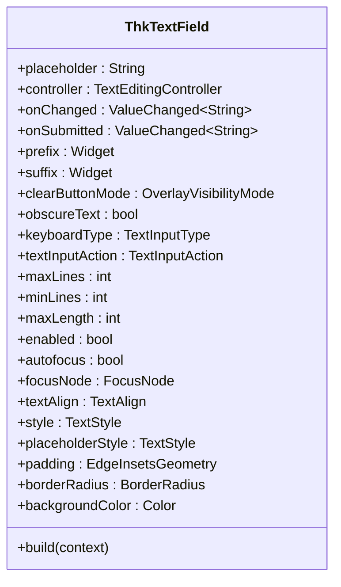

**图表来源**
- [thk_text_field.dart:15-152](file://lib/ui/core/widgets/thk_text_field.dart#L15-L152)

**章节来源**
- [thk_text_field.dart:15-152](file://lib/ui/core/widgets/thk_text_field.dart#L15-L152)

### 弹窗组件（ThkAlert & ThkActionSheet）

#### 警告框（ThkAlert）
- **视觉外观**
  - iOS 风格警告对话框封装，基于 showCupertinoDialog。
  - 支持 destructive（红色破坏性操作）、default（蓝色默认操作）、cancel（取消）三种 action。
- **行为特征**
  - 提供 show 和 confirm 两种快捷方式。
  - 自动处理按钮顺序和样式；支持 barrierDismissible。
- **用户交互**
  - 点击按钮触发相应回调；支持取消操作。
- **属性配置**
  - show 方法：title、message、destructiveAction、onDestructive、defaultAction、onDefault、cancelAction、onCancel、barrierDismissible
  - confirm 方法：title、message、confirmAction、cancelAction、onConfirm、onCancel、barrierDismissible
- **事件处理**
  - 通过回调处理用户选择；自动关闭对话框。
- **自定义选项**
  - 支持自定义按钮文本和样式；可配置是否可点击外部关闭。
- **响应式设计**
  - 遵循 iOS 对话框设计规范。
- **动画与过渡**
  - 使用 Cupertino 对话框的弹出/关闭动画。
- **性能优化**
  - 无状态组件，性能优化良好。
- **代码片段路径**
  - [警告框主实现:23-132](file://lib/ui/core/widgets/thk_alert.dart#L23-L132)

#### 动作表（ThkActionSheet）
- **视觉外观**
  - iOS 风格动作表封装，基于 showCupertinoModalPopup + CupertinoActionSheet。
  - 自动添加"取消"按钮，支持图标和破坏性样式。
- **行为特征**
  - 支持 title/message 标题和说明文本。
  - 自动在底部添加"取消"按钮，使用 showCupertinoModalPopup 弹出。
- **用户交互**
  - 点击操作项触发 onPressed 回调；自动关闭动作表。
- **属性配置**
  - ThkSheetAction：label（操作文本）、icon（图标）、isDestructive（破坏性）、isDefault（默认样式）、onPressed（回调）
  - show 方法：context、title、message、actions（ThkSheetAction 列表）、cancelLabel
- **事件处理**
  - 通过 ThkSheetAction.onPressed 处理操作；自动关闭动作表。
- **自定义选项**
  - 支持自定义图标、样式和按钮文本；可配置取消按钮文本。
- **响应式设计**
  - 遵循 iOS 动作表设计规范。
- **动画与过渡**
  - 使用 Cupertino 动作表的弹出/关闭动画。
- **性能优化**
  - 无状态组件，性能优化良好。
- **代码片段路径**
  - [动作表示例:47-96](file://lib/ui/core/widgets/thk_action_sheet.dart#L47-L96)

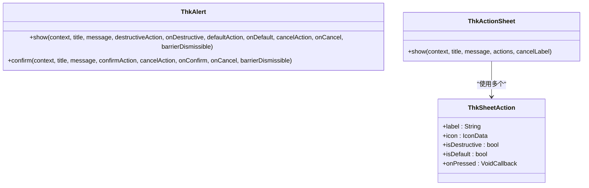

**图表来源**
- [thk_alert.dart:23-132](file://lib/ui/core/widgets/thk_alert.dart#L23-L132)
- [thk_action_sheet.dart:47-96](file://lib/ui/core/widgets/thk_action_sheet.dart#L47-L96)
- [thk_action_sheet.dart:6-30](file://lib/ui/core/widgets/thk_action_sheet.dart#L6-L30)

**章节来源**
- [thk_alert.dart:23-132](file://lib/ui/core/widgets/thk_alert.dart#L23-L132)
- [thk_action_sheet.dart:47-96](file://lib/ui/core/widgets/thk_action_sheet.dart#L47-L96)

## Material 组件对比与迁移指南

### iOS 迁移计划概述
ThkTree 当前是 Flutter Material 3 实现，但产品定位是 iOS-only（iPhone + iPadOS），需要彻底迁到 Cupertino。目标是以最小代价让所有屏幕看起来"原生 iOS"，保持业务逻辑零改动。

### 设计基线（已锁定）
- **顶层 App**：`CupertinoApp.router` 替换 `MaterialApp.router`，保留 go_router
- **主题**：`CupertinoThemeData`，`brightness: light` 单一亮色
- **主色**：`CupertinoColors.systemBlue` (#007AFF) iOS 默认蓝
- **字体**：`.SF Pro Text` / `.SF Pro Display` + `PingFang SC` iOS 系统自带
- **图标**：SF Symbols（`flutter_sficon`）默认 Outline，选中态 Filled
- **导航栏**：列表层 Large Title，详情层 Inline Title 滚动时自动收起
- **列表**：inset grouped（圆角分组），分隔线 indent 56 替代 ListView+ListTile 直筒列表
- **弹层**：`CupertinoAlertDialog`（确认）+ `CupertinoActionSheet`（多选）不再用 Material AlertDialog
- **开关**：`CupertinoSwitch` 不要 `Switch.adaptive` 折中
- **触觉**：`HapticFeedback.selectionClick / lightImpact` 选中、确认、删除时触发
- **页面切换**：`CupertinoPageRoute`（自带右滑返回）go_router 改 page builder
- **取消 FAB**：全部移到导航栏右上 `+` iOS HIG 不存在 FAB

### 组件对比矩阵

| 组件类型 | Material 组件 | iOS 原生组件 | 迁移策略 |
|---------|---------------|-------------|----------|
| 导航栏 | AppBar | ThkNavBar | Large/Inline 双模，自动滚动收缩 |
| 列表 | ListTile | ThkListTile | 替代，支持 chevron 右箭头 |
| 列表分组 | Card/List | ThkListSection | iOS inset grouped 样式 |
| 按钮 | ElevatedButton/FilledButton | ThkButton | 三种样式：filled/tinted/plain |
| 文本输入 | TextField | ThkTextField | 基于 CupertinoTextField |
| 对话框 | AlertDialog | ThkAlert | 封装 CupertinoAlertDialog |
| 动作表 | BottomSheet | ThkActionSheet | 封装 CupertinoActionSheet |
| FAB | FloatingActionButton | 导航栏 + 按钮 | iOS HIG 不使用 FAB |

### 迁移步骤与验收标准

#### PR 2 · 共享 widget 7 件套（视觉级冲击）
**任务清单**：
- [ ] 2.1 `ThkNavBar`：Large/Inline 双模导航栏，滚动时自动收起
- [ ] 2.2 `ThkListSection`：iOS inset grouped 分组容器，圆角 10
- [ ] 2.3 `ThkListTile`：替代 ListTile，trailing chevron.right
- [ ] 2.4 `ThkButton`：filled/tinted/plain 三态，destructive 变体
- [ ] 2.5 `ThkAlert`：包装 showCupertinoDialog，支持三种 action
- [ ] 2.6 `ThkActionSheet`：包装 showCupertinoModalPopup + CupertinoActionSheet
- [ ] 2.7 `ThkTextField`：包装 CupertinoTextField，内置 done 键盘 toolbar

**验收标准**：
- 每个 widget 配独立 widget preview
- 视觉对照 iOS Settings/Notes/Reminders 系统 app 的同类件，肉眼无明显差异

### 组件组合使用建议

#### iOS 页面布局模式
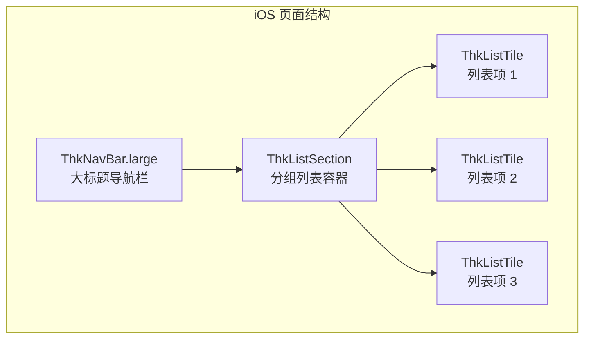

#### 交互流程
1. **列表页**：使用 ThkNavBar.large + ThkListSection + ThkListTile
2. **详情页**：使用 ThkNavBar.inline + 内容区域
3. **表单页**：使用 ThkTextField + ThkButton
4. **确认操作**：使用 ThkAlert 或 ThkActionSheet

**章节来源**
- [ios-migration-plan.md:1-266](file://docs/ios-migration-plan.md#L1-L266)

## 依赖关系分析
- **数据模型与服务**
  - SessionMessage、SessionRole、SessionMessageStatus 定义于会话服务模块，被消息气泡与列表视图直接消费。
  - NodeMetaV1、ThemeMetaV1 与 NodeEntity、ThemeEntity 提供节点与主题元信息，服务于更高层的树形结构与主题管理。
- **组件耦合**
  - MessageBubble 与 ChatListView 通过 SessionMessage 解耦；ChatComposer 通过回调与业务层解耦。
  - iOS 原生组件库内部相互协作：ThkNavBar 与 ThkListSection/ThkListTile 配合使用。
  - 无循环依赖，职责清晰：UI 组件只负责渲染与交互，数据与状态由上层管理。
- **外部依赖**
  - Flutter 生态：Material、Cupertino、Markdown 渲染、本地化、剪贴板、路由等。
  - 第三方库：flutter_markdown、yaml、ulid、flutter_sficon 等。

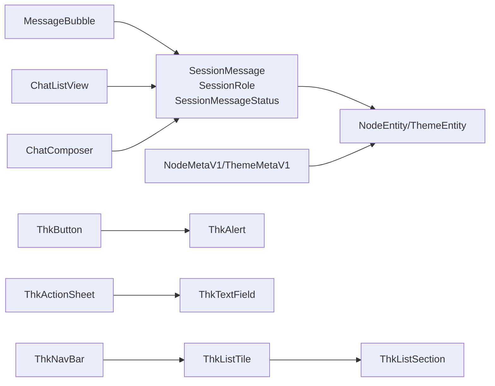

**图表来源**
- [session_markdown.dart:4-32](file://lib/data/services/session_markdown.dart#L4-L32)
- [node.dart:10-28](file://lib/domain/node.dart#L10-L28)
- [theme.dart:1-15](file://lib/domain/theme.dart#L1-15)
- [node_meta.dart:39-80](file://lib/data/models/node_meta.dart#L39-L80)
- [theme_meta.dart:30-59](file://lib/data/models/theme_meta.dart#L30-L59)
- [thk_nav_bar.dart:13-71](file://lib/ui/core/widgets/thk_nav_bar.dart#L13-L71)
- [thk_list_tile.dart:17-88](file://lib/ui/core/widgets/thk_list_tile.dart#L17-L88)
- [thk_list_section.dart:17-82](file://lib/ui/core/widgets/thk_list_section.dart#L17-L82)
- [thk_button.dart:11-156](file://lib/ui/core/widgets/thk_button.dart#L11-L156)
- [thk_alert.dart:23-132](file://lib/ui/core/widgets/thk_alert.dart#L23-L132)
- [thk_action_sheet.dart:47-96](file://lib/ui/core/widgets/thk_action_sheet.dart#L47-L96)
- [thk_text_field.dart:15-152](file://lib/ui/core/widgets/thk_text_field.dart#L15-L152)

**章节来源**
- [session_markdown.dart:1-223](file://lib/data/services/session_markdown.dart#L1-L223)
- [node.dart:1-30](file://lib/domain/node.dart#L1-L30)
- [theme.dart:1-15](file://lib/domain/theme.dart#L1-L15)
- [node_meta.dart:1-83](file://lib/data/models/node_meta.dart#L1-L83)
- [theme_meta.dart:1-61](file://lib/data/models/theme_meta.dart#L1-L61)

## 性能考量
- **列表渲染**
  - 使用 ListView.builder，避免一次性构建大量子项；仅在新增消息时触发局部更新。
  - iOS 原生组件使用 Cupertino 原生组件，性能优化良好。
- **滚动行为**
  - 仅在距离底部较大时执行滚动动画，减少不必要的重绘；吸附/松开逻辑避免频繁 setState。
- **Markdown 渲染**
  - 仅在表格场景启用横向滚动容器；样式复用主题样式表，降低样式计算成本。
- **输入与交互**
  - 输入过滤与焦点管理减少无效操作；错误回滚与提示避免界面卡顿。
  - ThkTextField 自动隐藏键盘，提升用户体验。
- **资源释放**
  - 控制器与焦点节点在 dispose 中释放，防止内存泄漏。
- **iOS 组件优化**
  - 使用 Cupertino 原生组件，系统级性能优化；避免自定义绘制。
  - ThkListSection 使用 inset grouped 样式，系统级渲染优化。

## 故障排查指南
- **消息气泡**
  - 表格未展开：确认消息正文包含符合规则的表格与分隔行；检查"展开"按钮是否显示。
  - 上下文菜单缺少"添加到笔记"：确认已传入 onAddToNote 且存在选中文本。
  - Markdown 样式异常：检查主题样式表与 MarkdownStyleSheet 配置。
- **聊天组合器**
  - 发送无效：检查输入是否为空或仅空白字符；确认 enabled 状态。
  - 回车无反应：确认未处于 IME 编码状态；检查 Shift/Ctrl 是否被按下。
  - 停止流式无效：确认 onStopStreaming 回调正确传递。
- **列表视图**
  - 占位文本一直显示：确认 messages 非空；检查 messageBuilder 是否返回有效 Widget。
  - 无法吸附底部：检查滚动方向与 extentAfter 判断逻辑；确保滚动控制器已挂载。
- **iOS 原生组件**
  - 导航栏显示异常：确认在正确的容器中使用（ThkLargeTitlePage 或 CustomScrollView）。
  - 列表分组样式不对：检查 inset grouped 样式是否正确应用。
  - 按钮点击无响应：确认 disabled 状态和 onPressed 回调设置。
  - 文本输入框无法隐藏键盘：确认点击外部区域的处理逻辑。
  - 对话框显示问题：检查 showCupertinoDialog 的调用参数和回调。

**章节来源**
- [message_bubble_test.dart:10-144](file://test/ui/core/shared/message_bubble_test.dart#L10-L144)
- [chat_composer_test.dart:7-135](file://test/ui/core/shared/chat_composer_test.dart#L7-L135)
- [chat_list_view_test.dart:8-69](file://test/ui/core/shared/chat_list_view_test.dart#L8-L69)

## 结论
ThkTree 的核心 UI 组件库现已扩展为完整的 iOS 原生组件体系。传统共享组件围绕会话消息构建，具备清晰的职责划分与良好的可扩展性；新增的 iOS 原生组件库提供完整的界面基础，包括导航栏、列表、按钮、弹窗等，实现从 Material Design 到 iOS Cupertino Design 的完整迁移。消息气泡提供丰富的 Markdown 渲染与交互能力；聊天组合器兼顾输入体验与流式控制；列表视图通过智能吸附与滚动通知实现顺滑的聊天体验；iOS 原生组件遵循系统设计规范，提供原生的用户体验。配合完善的测试用例与数据模型，组件可在不同场景下稳定运行并易于定制。

## 附录
- **使用场景示例**
  - 在聊天界面中，ChatListView 作为容器承载多条 MessageBubble；用户通过 ChatComposer 输入并发送消息；当消息包含表格时，用户可通过"展开"按钮查看完整内容。
  - 在设置界面中，使用 ThkNavBar.large + ThkListSection + ThkListTile 构建 iOS 风格的设置页面。
  - 在表单界面中，使用 ThkTextField + ThkButton 实现 iOS 风格的输入和操作界面。
- **组件组合建议**
  - 将 ChatComposer 放置于页面底部，ChatListView 占据剩余空间；通过 messageBuilder 将 SessionMessage 映射为不同类型的子组件（文本、图片、代码块等）。
  - iOS 页面布局：ThkNavBar.large + ThkListSection + ThkListTile 组合实现列表页；ThkNavBar.inline + 内容区域实现详情页。
  - 操作确认：使用 ThkAlert.show 或 ThkActionSheet.show 处理删除确认、语言选择等操作。
- **最佳实践**
  - 保持 SessionMessage 结构稳定；通过回调注入业务逻辑；在渲染层尽量减少复杂计算；利用主题系统统一风格。
  - iOS 组件使用：遵循系统设计规范，避免自定义过度；合理使用 Cupertino 原生组件的优势。
  - 迁移策略：按 PR 3 的顺序逐步迁移，确保视觉一致性；使用 widget preview 验证组件效果。