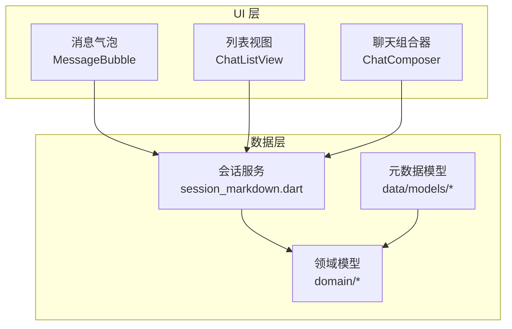
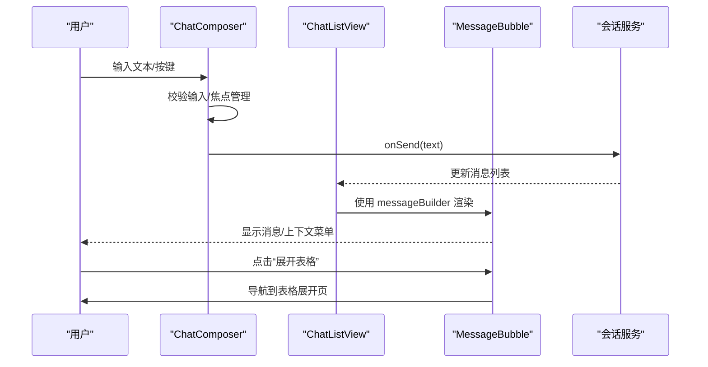
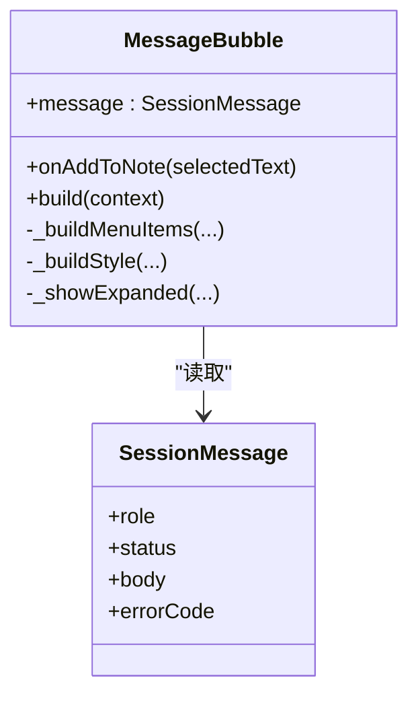
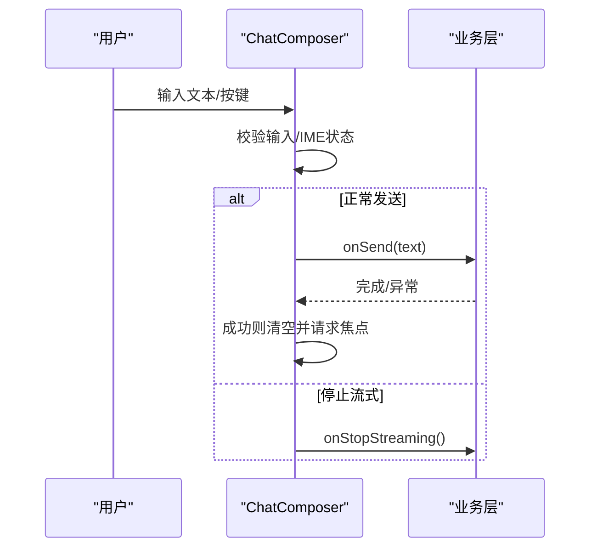
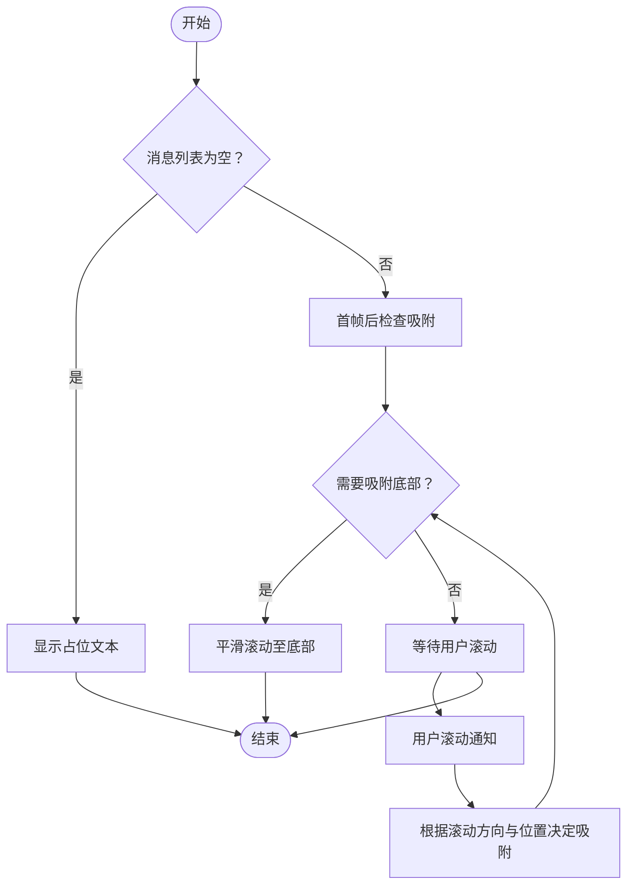
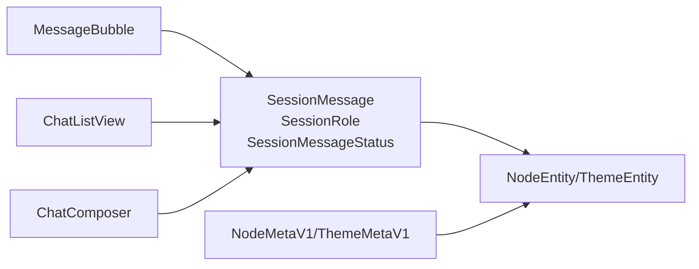

# 核心 UI 组件

<cite>
**本文引用的文件**
- [message_bubble.dart](file://lib/ui/core/shared/message_bubble.dart)
- [chat_composer.dart](file://lib/ui/core/shared/chat_composer.dart)
- [chat_list_view.dart](file://lib/ui/core/shared/chat_list_view.dart)
- [session_markdown.dart](file://lib/data/services/session_markdown.dart)
- [message_bubble_test.dart](file://test/ui/core/shared/message_bubble_test.dart)
- [chat_composer_test.dart](file://test/ui/core/shared/chat_composer_test.dart)
- [chat_list_view_test.dart](file://test/ui/core/shared/chat_list_view_test.dart)
- [node_meta.dart](file://lib/data/models/node_meta.dart)
- [theme_meta.dart](file://lib/data/models/theme_meta.dart)
- [node.dart](file://lib/domain/node.dart)
- [theme.dart](file://lib/domain/theme.dart)
- [ids.dart](file://lib/domain/ids.dart)
</cite>

## 目录
1. [简介](#简介)
2. [项目结构](#项目结构)
3. [核心组件](#核心组件)
4. [架构总览](#架构总览)
5. [组件详解](#组件详解)
6. [依赖关系分析](#依赖关系分析)
7. [性能考量](#性能考量)
8. [故障排查指南](#故障排查指南)
9. [结论](#结论)
10. [附录](#附录)

## 简介
本文件聚焦 ThkTree 的核心 UI 组件：消息气泡、聊天组合器与列表视图。文档从设计与实现两方面阐述各组件的视觉外观、行为特征、交互模式、属性配置、事件处理、状态管理与自定义选项；并结合测试用例说明典型使用场景与验证点。同时覆盖响应式布局、动画与过渡效果、状态管理机制、数据绑定方式以及性能优化策略，并解释组件间通信与组合使用方式。

## 项目结构
核心 UI 组件位于 lib/ui/core/shared 目录，围绕会话消息（SessionMessage）进行渲染与交互。数据模型与服务位于 lib/data 与 lib/domain，负责消息角色、状态、解析与格式化等。

图表来源
- [message_bubble.dart:1-265](file://lib/ui/core/shared/message_bubble.dart#L1-L265)
- [chat_composer.dart:1-160](file://lib/ui/core/shared/chat_composer.dart#L1-L160)
- [chat_list_view.dart:1-99](file://lib/ui/core/shared/chat_list_view.dart#L1-L99)
- [session_markdown.dart:1-223](file://lib/data/services/session_markdown.dart#L1-L223)
- [node.dart:1-30](file://lib/domain/node.dart#L1-L30)
- [theme.dart:1-15](file://lib/domain/theme.dart#L1-L15)
- [node_meta.dart:1-83](file://lib/data/models/node_meta.dart#L1-L83)
- [theme_meta.dart:1-61](file://lib/data/models/theme_meta.dart#L1-L61)

章节来源
- [message_bubble.dart:1-265](file://lib/ui/core/shared/message_bubble.dart#L1-L265)
- [chat_composer.dart:1-160](file://lib/ui/core/shared/chat_composer.dart#L1-L160)
- [chat_list_view.dart:1-99](file://lib/ui/core/shared/chat_list_view.dart#L1-L99)
- [session_markdown.dart:1-223](file://lib/data/services/session_markdown.dart#L1-L223)

## 核心组件
- 消息气泡（MessageBubble）
  - 职责：根据消息角色与状态渲染 Markdown 内容，支持复制选中文本、添加到笔记、表格展开查看等交互。
  - 关键特性：按角色设置对齐与配色；自动识别 Markdown 表格并提供“展开”入口；上下文菜单集成“添加到笔记”。
- 聊天组合器（ChatComposer）
  - 职责：输入框与发送/停止按钮，支持多行输入、快捷键（回车发送、Shift/Ctrl+回车换行）、流式状态切换。
  - 关键特性：输入焦点管理、错误提示、禁用态控制。
- 列表视图（ChatListView）
  - 职责：滚动列表容器，智能吸附底部、用户滚动行为感知、消息构建器回调。
  - 关键特性：滚动通知监听、吸附/松开逻辑、平滑滚动至底部。

章节来源
- [message_bubble.dart:41-215](file://lib/ui/core/shared/message_bubble.dart#L41-L215)
- [chat_composer.dart:5-159](file://lib/ui/core/shared/chat_composer.dart#L5-L159)
- [chat_list_view.dart:8-98](file://lib/ui/core/shared/chat_list_view.dart#L8-L98)

## 架构总览
消息从数据层生成，经由 ChatListView 渲染为若干 MessageBubble；用户通过 ChatComposer 输入并触发发送或停止流式输出。上下文菜单与路由用于扩展功能（如表格展开）。

图表来源
- [chat_composer.dart:119-135](file://lib/ui/core/shared/chat_composer.dart#L119-L135)
- [chat_list_view.dart:74-83](file://lib/ui/core/shared/chat_list_view.dart#L74-L83)
- [message_bubble.dart:208-214](file://lib/ui/core/shared/message_bubble.dart#L208-L214)

## 组件详解

### 消息气泡（MessageBubble）
- 视觉外观
  - 用户消息右对齐，助手/系统消息左对齐；卡片背景随角色变化；状态文本显示“流式中/错误/无”。
  - Markdown 样式基于主题样式表，代码块与表格具备特定配色与边框。
- 行为特征
  - 自动检测 Markdown 表格，若存在则提供“展开”按钮；点击后进入可缩放/滚动的全屏视图。
  - 支持选择性复制，上下文菜单动态注入“添加到笔记”项（当有选中文本且提供回调时）。
- 用户交互
  - 长按触发选择区域上下文菜单；支持复制、粘贴、全选等系统默认项；可选“添加到笔记”。
  - 表格存在时显示“展开”按钮，点击后进入新页面查看完整表格。
- 属性配置
  - 必填：message（会话消息对象）
  - 可选：onAddToNote（选中文本回调，用于“添加到笔记”）
- 事件处理
  - 上下文菜单项点击后隐藏工具栏并调用回调；导航到表格展开页。
- 状态管理
  - 作为无状态组件，依赖外部传入的 SessionMessage 与回调；内部不维护消息状态。
- 自定义选项
  - 通过自定义 messageBuilder 将消息映射为任意 Widget；Markdown 样式可由主题驱动。
- 响应式设计
  - 当存在表格时，最大宽度适配屏幕宽度；表格内容横向可滚动；展开页纵向可滚动并支持缩放。
- 动画与过渡
  - 列表滚动至底部时使用平滑动画；表格展开页采用交互式缩放与滚动。
- 性能优化
  - 仅在存在表格时启用横向滚动容器；Markdown 渲染按需进行；避免不必要的重建。
- 代码片段路径
  - [消息气泡主实现:41-215](file://lib/ui/core/shared/message_bubble.dart#L41-L215)
  - [表格展开视图:217-264](file://lib/ui/core/shared/message_bubble.dart#L217-L264)

图表来源
- [message_bubble.dart:41-215](file://lib/ui/core/shared/message_bubble.dart#L41-L215)
- [session_markdown.dart:16-32](file://lib/data/services/session_markdown.dart#L16-L32)

章节来源
- [message_bubble.dart:41-215](file://lib/ui/core/shared/message_bubble.dart#L41-L215)
- [session_markdown.dart:4-32](file://lib/data/services/session_markdown.dart#L4-L32)
- [message_bubble_test.dart:10-144](file://test/ui/core/shared/message_bubble_test.dart#L10-L144)

### 聊天组合器（ChatComposer）
- 视觉外观
  - 左侧多行文本输入框，右侧发送/停止按钮；禁用态按钮不可点击。
- 行为特征
  - 回车发送：普通回车发送，Shift/Ctrl+回车插入换行；输入处于 IME 编码状态时不发送。
  - 流式状态：根据 isStreaming 切换按钮文字与行为；点击停止流式输出。
  - 错误处理：发送失败时恢复输入并弹出 SnackBar 提示。
- 用户交互
  - 键盘事件与提交事件统一处理；自动聚焦输入框；清空输入后重新获取焦点。
- 属性配置
  - 必填：hintText、isStreaming、onSend、onStopStreaming
  - 可选：enabled（整体禁用）
- 事件处理
  - 发送成功后请求焦点；异常时回滚文本并提示。
  - 停止流式输出调用 onStopStreaming。
- 状态管理
  - 内部维护 TextEditingController 与 FocusNode；生命周期内正确释放资源。
- 自定义选项
  - 通过 onSend/onStopStreaming 注入业务逻辑；hintText 支持本地化。
- 响应式设计
  - 文本域多行显示，最大高度限制；按钮尺寸自适应。
- 动画与过渡
  - 无专用动画，但发送后焦点管理提升交互流畅度。
- 性能优化
  - 过滤无效输入（空白/仅空白）；避免重复发送；合理释放控制器与焦点节点。
- 代码片段路径
  - [组合器主实现:5-159](file://lib/ui/core/shared/chat_composer.dart#L5-159)

图表来源
- [chat_composer.dart:119-144](file://lib/ui/core/shared/chat_composer.dart#L119-L144)

章节来源
- [chat_composer.dart:5-159](file://lib/ui/core/shared/chat_composer.dart#L5-L159)
- [chat_composer_test.dart:7-135](file://test/ui/core/shared/chat_composer_test.dart#L7-L135)

### 列表视图（ChatListView）
- 视觉外观
  - 默认居中显示“暂无消息”占位；消息列表使用卡片式布局，左右对齐随角色变化。
- 行为特征
  - 空列表显示占位文本；首次绘制后自动滚动至底部；用户滚动时智能判断是否继续吸附。
  - 监听滚动通知：用户滚动、更新、结束等阶段分别处理吸附状态。
- 用户交互
  - 通过 messageBuilder 将 SessionMessage 渲染为任意 Widget；支持自定义消息体。
- 属性配置
  - 必填：messages（SessionMessage 列表）、messageBuilder（消息渲染函数）
- 事件处理
  - 无显式回调；通过外部刷新 messages 触发重建。
- 状态管理
  - 内部维护滚动控制器与吸附标记；根据滚动方向与位置动态更新吸附状态。
- 自定义选项
  - 通过 messageBuilder 实现差异化渲染（如富文本、图片、视频等）。
- 响应式设计
  - 列表内边距统一；消息宽度在表格场景下自适应屏幕宽度。
- 动画与过渡
  - 新消息到达时平滑滚动至底部，曲线为 easeOut，时长较短以保证即时反馈。
- 性能优化
  - 使用 ListView.builder；仅在需要时滚动至底部；避免频繁 setState。
- 代码片段路径
  - [列表视图主实现:8-98](file://lib/ui/core/shared/chat_list_view.dart#L8-98)

图表来源
- [chat_list_view.dart:41-97](file://lib/ui/core/shared/chat_list_view.dart#L41-L97)

章节来源
- [chat_list_view.dart:8-98](file://lib/ui/core/shared/chat_list_view.dart#L8-L98)
- [chat_list_view_test.dart:8-69](file://test/ui/core/shared/chat_list_view_test.dart#L8-L69)

## 依赖关系分析
- 数据模型与服务
  - SessionMessage、SessionRole、SessionMessageStatus 定义于会话服务模块，被消息气泡与列表视图直接消费。
  - NodeMetaV1、ThemeMetaV1 与 NodeEntity、ThemeEntity 提供节点与主题元信息，服务于更高层的树形结构与主题管理。
- 组件耦合
  - MessageBubble 与 ChatListView 通过 SessionMessage 解耦；ChatComposer 通过回调与业务层解耦。
  - 无循环依赖，职责清晰：UI 组件只负责渲染与交互，数据与状态由上层管理。
- 外部依赖
  - Flutter 生态：Material、Markdown 渲染、本地化、剪贴板、路由等。
  - 第三方库：flutter_markdown、yaml、ulid 等。

图表来源
- [session_markdown.dart:4-32](file://lib/data/services/session_markdown.dart#L4-L32)
- [node.dart:10-28](file://lib/domain/node.dart#L10-L28)
- [theme.dart:1-15](file://lib/domain/theme.dart#L1-15)
- [node_meta.dart:39-80](file://lib/data/models/node_meta.dart#L39-L80)
- [theme_meta.dart:30-59](file://lib/data/models/theme_meta.dart#L30-L59)

章节来源
- [session_markdown.dart:1-223](file://lib/data/services/session_markdown.dart#L1-L223)
- [node.dart:1-30](file://lib/domain/node.dart#L1-L30)
- [theme.dart:1-15](file://lib/domain/theme.dart#L1-L15)
- [node_meta.dart:1-83](file://lib/data/models/node_meta.dart#L1-L83)
- [theme_meta.dart:1-61](file://lib/data/models/theme_meta.dart#L1-L61)

## 性能考量
- 列表渲染
  - 使用 ListView.builder，避免一次性构建大量子项；仅在新增消息时触发局部更新。
- 滚动行为
  - 仅在距离底部较大时执行滚动动画，减少不必要的重绘；吸附/松开逻辑避免频繁 setState。
- Markdown 渲染
  - 仅在表格场景启用横向滚动容器；样式复用主题样式表，降低样式计算成本。
- 输入与交互
  - 输入过滤与焦点管理减少无效操作；错误回滚与提示避免界面卡顿。
- 资源释放
  - 控制器与焦点节点在 dispose 中释放，防止内存泄漏。

## 故障排查指南
- 消息气泡
  - 表格未展开：确认消息正文包含符合规则的表格与分隔行；检查“展开”按钮是否显示。
  - 上下文菜单缺少“添加到笔记”：确认已传入 onAddToNote 且存在选中文本。
  - Markdown 样式异常：检查主题样式表与 MarkdownStyleSheet 配置。
- 聊天组合器
  - 发送无效：检查输入是否为空或仅空白字符；确认 enabled 状态。
  - 回车无反应：确认未处于 IME 编码状态；检查 Shift/Ctrl 是否被按下。
  - 停止流式无效：确认 onStopStreaming 回调正确传递。
- 列表视图
  - 占位文本一直显示：确认 messages 非空；检查 messageBuilder 是否返回有效 Widget。
  - 无法吸附底部：检查滚动方向与 extentAfter 判断逻辑；确保滚动控制器已挂载。

章节来源
- [message_bubble_test.dart:10-144](file://test/ui/core/shared/message_bubble_test.dart#L10-L144)
- [chat_composer_test.dart:7-135](file://test/ui/core/shared/chat_composer_test.dart#L7-L135)
- [chat_list_view_test.dart:8-69](file://test/ui/core/shared/chat_list_view_test.dart#L8-L69)

## 结论
ThkTree 的核心 UI 组件围绕会话消息构建，具备清晰的职责划分与良好的可扩展性。消息气泡提供丰富的 Markdown 渲染与交互能力；聊天组合器兼顾输入体验与流式控制；列表视图通过智能吸附与滚动通知实现顺滑的聊天体验。配合完善的测试用例与数据模型，组件可在不同场景下稳定运行并易于定制。

## 附录
- 使用场景示例
  - 在聊天界面中，ChatListView 作为容器承载多条 MessageBubble；用户通过 ChatComposer 输入并发送消息；当消息包含表格时，用户可通过“展开”按钮查看完整内容。
- 组件组合建议
  - 将 ChatComposer 放置于页面底部，ChatListView 占据剩余空间；通过 messageBuilder 将 SessionMessage 映射为不同类型的子组件（文本、图片、代码块等）。
- 最佳实践
  - 保持 SessionMessage 结构稳定；通过回调注入业务逻辑；在渲染层尽量减少复杂计算；利用主题系统统一风格。