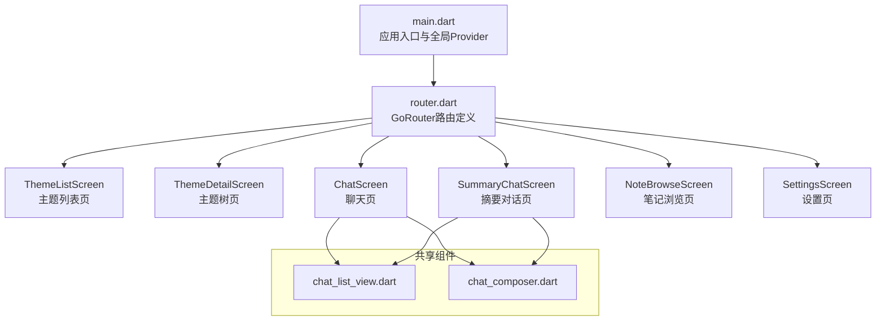
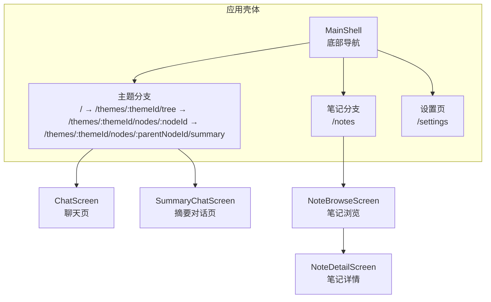
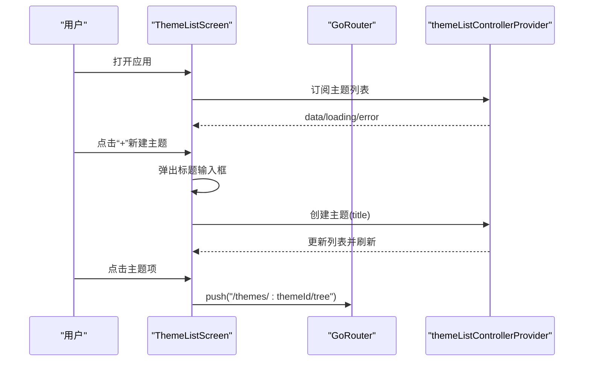
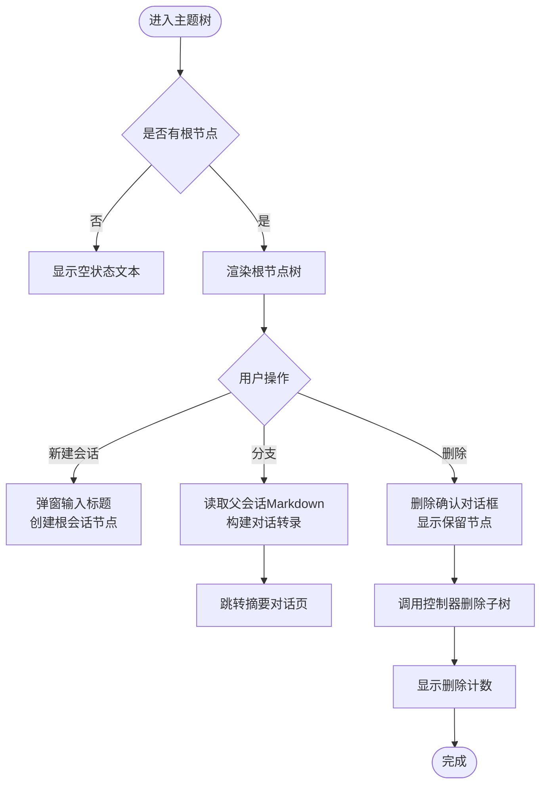
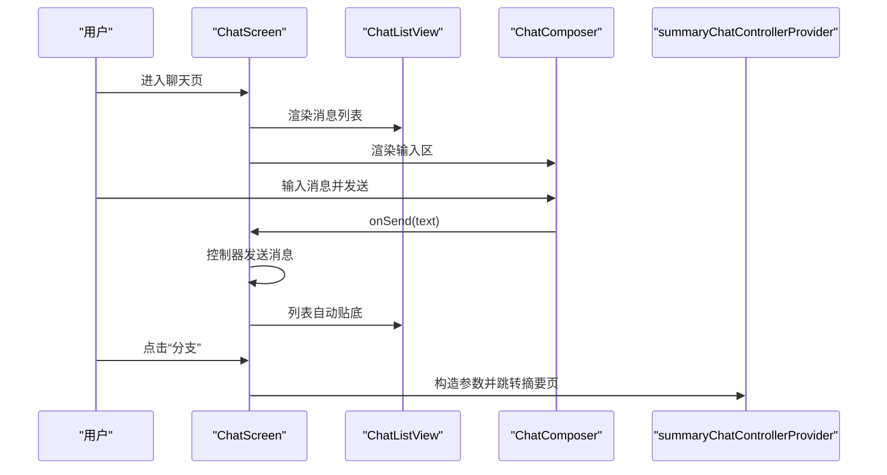
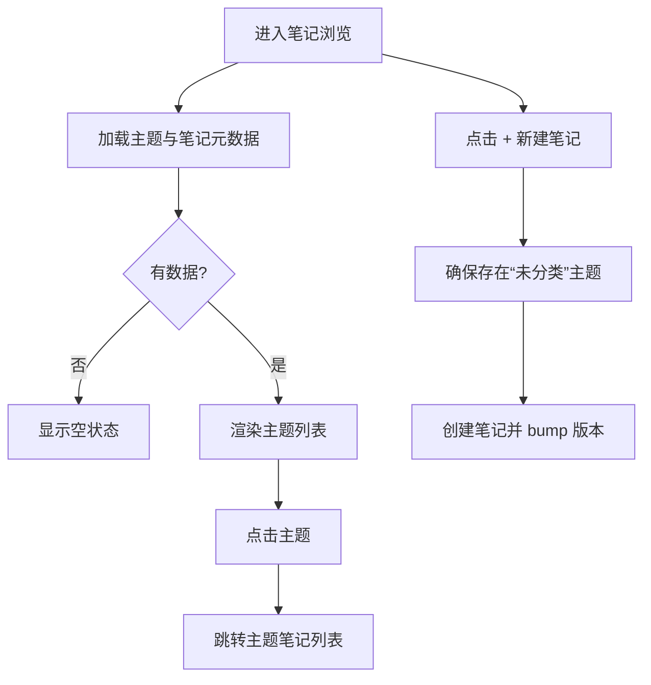
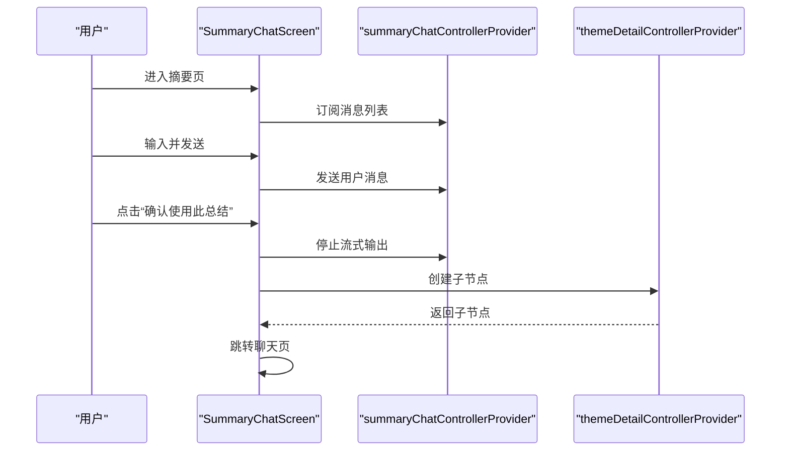
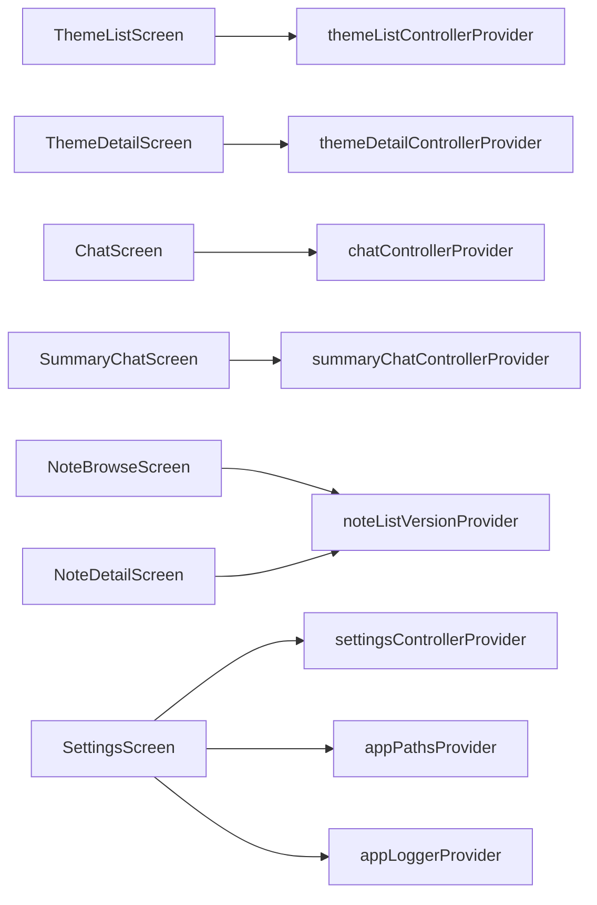

# 页面和屏幕

<cite>
**本文引用的文件**
- [lib/main.dart](file://lib/main.dart)
- [lib/ui/core/router.dart](file://lib/ui/core/router.dart)
- [lib/ui/features/themes/theme_list_screen.dart](file://lib/ui/features/themes/theme_list_screen.dart)
- [lib/ui/features/themes/theme_detail_screen.dart](file://lib/ui/features/themes/theme_detail_screen.dart)
- [lib/ui/features/chat/chat_screen.dart](file://lib/ui/features/chat/chat_screen.dart)
- [lib/ui/features/notes/note_browse_screen.dart](file://lib/ui/features/notes/note_browse_screen.dart)
- [lib/ui/features/notes/note_detail_screen.dart](file://lib/ui/features/notes/note_detail_screen.dart)
- [lib/ui/features/settings/settings_screen.dart](file://lib/ui/features/settings/settings_screen.dart)
- [lib/ui/features/summary/summary_chat_screen.dart](file://lib/ui/features/summary/summary_chat_screen.dart)
- [lib/ui/core/shared/chat_composer.dart](file://lib/ui/core/shared/chat_composer.dart)
- [lib/ui/core/shared/chat_list_view.dart](file://lib/ui/core/shared/chat_list_view.dart)
- [lib/l10n/app_en.arb](file://lib/l10n/app_en.arb)
- [lib/l10n/app_zh.arb](file://lib/l10n/app_zh.arb)
</cite>

## 目录
1. [简介](#简介)
2. [项目结构](#项目结构)
3. [核心组件](#核心组件)
4. [架构总览](#架构总览)
5. [详细组件分析](#详细组件分析)
6. [依赖分析](#依赖分析)
7. [性能考虑](#性能考虑)
8. [故障排查指南](#故障排查指南)
9. [结论](#结论)
10. [附录](#附录)

## 简介
本文件系统化梳理 ThkTree 应用的页面与屏幕，覆盖主题列表、主题详情、聊天、笔记浏览与详情、设置、摘要对话等页面。文档从布局结构、导航模式、用户交互、状态管理、数据加载与渲染、路由配置、响应式设计、动画与过渡、控制器职责、状态同步、错误处理、可访问性与国际化等方面进行深入说明，并提供可视化图表帮助理解。

## 项目结构
应用采用基于 Riverpod 的声明式路由与状态管理，页面按功能域分层组织在 ui/features 下，共享组件位于 ui/core/shared。国际化资源通过 ARB 文件维护，主入口负责初始化环境、日志与本地化配置。

**图表来源**
- [lib/main.dart:61-93](file://lib/main.dart#L61-L93)
- [lib/ui/core/router.dart:18-87](file://lib/ui/core/router.dart#L18-L87)
- [lib/ui/features/themes/theme_list_screen.dart:8-88](file://lib/ui/features/themes/theme_list_screen.dart#L8-L88)
- [lib/ui/features/themes/theme_detail_screen.dart:14-90](file://lib/ui/features/themes/theme_detail_screen.dart#L14-L90)
- [lib/ui/features/chat/chat_screen.dart:19-150](file://lib/ui/features/chat/chat_screen.dart#L19-L150)
- [lib/ui/features/notes/note_browse_screen.dart:11-76](file://lib/ui/features/notes/note_browse_screen.dart#L11-L76)
- [lib/ui/features/settings/settings_screen.dart:14-52](file://lib/ui/features/settings/settings_screen.dart#L14-L52)
- [lib/ui/features/summary/summary_chat_screen.dart:15-61](file://lib/ui/features/summary/summary_chat_screen.dart#L15-L61)
- [lib/ui/core/shared/chat_list_view.dart:8-32](file://lib/ui/core/shared/chat_list_view.dart#L8-L32)
- [lib/ui/core/shared/chat_composer.dart:5-23](file://lib/ui/core/shared/chat_composer.dart#L5-L23)

**章节来源**
- [lib/main.dart:15-93](file://lib/main.dart#L15-L93)
- [lib/ui/core/router.dart:18-126](file://lib/ui/core/router.dart#L18-L126)

## 核心组件
- 路由与导航
  - 使用 go_router 的 StatefulShellRoute 实现底部导航双分支（主题树/笔记），支持分支内嵌套路由与参数传递。
  - 主壳体包含底部导航栏，切换分支时触发版本号 bump 以刷新笔记列表。
- 状态管理
  - 基于 Riverpod 的 Provider/AsyncNotifier 模式，页面通过 ref.watch 订阅异步数据流，控制器负责副作用与状态变更。
- 共享组件
  - ChatListView：智能滚动、自动贴底、历史滚动行为感知。
  - ChatComposer：多行输入、组合字符处理、Enter 键行为、发送/停止流控制。
- 国际化与本地化
  - 支持英文与中文，通过 AppLocalizations 动态加载与回退，Material/Widgets/Cupertino 本地化委托齐全。
- 日志与错误处理
  - 全局 FlutterError.onError 与 PlatformDispatcher.onError 统一记录；页面内使用 SnackBar 展示错误信息。

**章节来源**
- [lib/ui/core/router.dart:18-126](file://lib/ui/core/router.dart#L18-L126)
- [lib/ui/core/shared/chat_list_view.dart:22-98](file://lib/ui/core/shared/chat_list_view.dart#L22-L98)
- [lib/ui/core/shared/chat_composer.dart:25-160](file://lib/ui/core/shared/chat_composer.dart#L25-L160)
- [lib/main.dart:32-40](file://lib/main.dart#L32-L40)

## 架构总览
下图展示页面间导航关系与路由层级，突出主题树分支与笔记分支的 Shell 结构，以及从主题树到聊天、摘要对话的链路。

**图表来源**
- [lib/ui/core/router.dart:22-87](file://lib/ui/core/router.dart#L22-L87)

**章节来源**
- [lib/ui/core/router.dart:89-126](file://lib/ui/core/router.dart#L89-L126)

## 详细组件分析

### 主题列表页面（ThemeListScreen）
- 布局与交互
  - 顶部 AppBar 包含“刷新”“设置”操作；主体为异步数据流 when 分支：loading/error/data。
  - 在宽屏条件下使用最大宽度约束与居中容器，窄屏则直接纵向列表。
  - 列表项点击进入主题树详情页。
- 数据加载与渲染
  - 通过 themeListControllerProvider 提供的主题列表数据源，支持重新索引与创建主题。
- 响应式设计
  - LayoutBuilder 根据 maxWidth 切换布局容器与间距。
- 用户体验
  - 新建主题弹窗输入标题，提交前校验组合状态避免中途提交。

**图表来源**
- [lib/ui/features/themes/theme_list_screen.dart:12-88](file://lib/ui/features/themes/theme_list_screen.dart#L12-L88)
- [lib/ui/core/router.dart:28-37](file://lib/ui/core/router.dart#L28-L37)

**章节来源**
- [lib/ui/features/themes/theme_list_screen.dart:8-125](file://lib/ui/features/themes/theme_list_screen.dart#L8-L125)

### 主题详情页面（ThemeDetailScreen）
- 布局与交互
  - 顶部 AppBar 支持返回与刷新；主体为根节点树形视图，支持“新建会话”“分支”“删除”等操作。
  - 自绘连接线与缩进，递归渲染子节点，支持删除前的二次确认与保留同名节点提示。
- 数据加载与渲染
  - 通过 themeDetailControllerProvider 加载节点集合，按创建时间排序根节点。
- 用户交互流程
  - 分支：读取父会话 Markdown 文本，构建对话转录，跳转摘要对话页。
  - 删除：收集子树节点，计算同名节点保留集，确认后调用控制器删除并反馈计数。

**图表来源**
- [lib/ui/features/themes/theme_detail_screen.dart:23-90](file://lib/ui/features/themes/theme_detail_screen.dart#L23-L90)
- [lib/ui/features/themes/theme_detail_screen.dart:165-202](file://lib/ui/features/themes/theme_detail_screen.dart#L165-L202)
- [lib/ui/features/themes/theme_detail_screen.dart:207-234](file://lib/ui/features/themes/theme_detail_screen.dart#L207-L234)

**章节来源**
- [lib/ui/features/themes/theme_detail_screen.dart:14-428](file://lib/ui/features/themes/theme_detail_screen.dart#L14-L428)

### 聊天页面（ChatScreen）
- 布局与交互
  - 顶部包含返回、树跳转、分支按钮；主体为消息列表与输入区，底部附带上下文用量条。
  - 支持“添加到笔记”：打开笔记选择器并回调提示。
- 数据加载与渲染
  - 通过 chatControllerProvider 获取消息列表，根据是否处于流式状态切换发送/停止按钮。
- 用户交互流程
  - 分支：与主题树页一致，读取父会话文本，跳转摘要对话页。
  - 添加到笔记：选择目标笔记后写入并提示。

**图表来源**
- [lib/ui/features/chat/chat_screen.dart:30-150](file://lib/ui/features/chat/chat_screen.dart#L30-L150)
- [lib/ui/core/shared/chat_list_view.dart:34-98](file://lib/ui/core/shared/chat_list_view.dart#L34-L98)
- [lib/ui/core/shared/chat_composer.dart:46-160](file://lib/ui/core/shared/chat_composer.dart#L46-L160)

**章节来源**
- [lib/ui/features/chat/chat_screen.dart:19-256](file://lib/ui/features/chat/chat_screen.dart#L19-L256)

### 笔记浏览页面（NoteBrowseScreen）
- 布局与交互
  - 顶部 AppBar；支持下拉刷新；列表按主题分组，点击进入该主题笔记列表。
  - “+”浮动按钮用于在“未分类”主题下新建笔记。
- 数据加载与渲染
  - 通过 appPathsProvider 获取主题根目录，扫描各主题的 notes 子目录，统计笔记数量。
  - 使用 noteListVersionProvider 观察版本号变化，触发刷新。
- 用户体验
  - 空状态友好提示；错误时高亮错误色；支持刷新指示器。

**图表来源**
- [lib/ui/features/notes/note_browse_screen.dart:18-76](file://lib/ui/features/notes/note_browse_screen.dart#L18-L76)
- [lib/ui/features/notes/note_browse_screen.dart:154-186](file://lib/ui/features/notes/note_browse_screen.dart#L154-L186)
- [lib/ui/features/notes/note_browse_screen.dart:213-226](file://lib/ui/features/notes/note_browse_screen.dart#L213-L226)

**章节来源**
- [lib/ui/features/notes/note_browse_screen.dart:11-270](file://lib/ui/features/notes/note_browse_screen.dart#L11-L270)

### 笔记详情页面（NoteDetailScreen）
- 布局与交互
  - 编辑/查看模式切换；编辑时保存后 bump 版本号以触发其他页面刷新。
  - 支持下拉刷新与加载/错误状态占位。
- 数据加载与渲染
  - 通过 NoteStore 读取/写入笔记正文；主题内笔记列表由 ThemeNoteListScreen 提供。
- 用户体验
  - 大文本编辑区支持多行展开；空内容提示。

**章节来源**
- [lib/ui/features/notes/note_detail_screen.dart:9-305](file://lib/ui/features/notes/note_detail_screen.dart#L9-L305)

### 设置页面（SettingsScreen）
- 布局与交互
  - 列表分段：语言、LLM 设置、日志、路径。
  - 语言选择支持系统默认/英文/中文；LLM 提供商/模型/密钥可编辑；日志支持复制路径、查看尾部、远程日志开关。
- 数据加载与渲染
  - 通过 settingsControllerProvider 与 appPathsProvider/appLoggerProvider 提供的数据源。
- 用户体验
  - 加载态统一文案；错误时显示字符串；复制成功提示。

**章节来源**
- [lib/ui/features/settings/settings_screen.dart:14-395](file://lib/ui/features/settings/settings_screen.dart#L14-L395)

### 摘要对话页面（SummaryChatScreen）
- 布局与交互
  - 顶部横幅提示分支标题；中部消息列表；底部输入区与操作按钮（取消、全新开始、携带原始上下文、确认）。
  - 上下文用量条显示 token 占比。
- 数据加载与渲染
  - 通过 summaryChatControllerProvider 获取消息；根据是否在流式状态与是否正在创建分支禁用输入。
- 用户交互流程
  - 确认：若无摘要内容则提示先生成；否则创建子节点并跳转聊天页。
  - 取消/空白/携带上下文：分别走不同初始内容路径。

**图表来源**
- [lib/ui/features/summary/summary_chat_screen.dart:33-61](file://lib/ui/features/summary/summary_chat_screen.dart#L33-L61)
- [lib/ui/features/summary/summary_chat_screen.dart:187-232](file://lib/ui/features/summary/summary_chat_screen.dart#L187-L232)

**章节来源**
- [lib/ui/features/summary/summary_chat_screen.dart:15-277](file://lib/ui/features/summary/summary_chat_screen.dart#L15-L277)

## 依赖分析
- 页面与控制器
  - ThemeListScreen → themeListControllerProvider
  - ThemeDetailScreen → themeDetailControllerProvider
  - ChatScreen → chatControllerProvider
  - SummaryChatScreen → summaryChatControllerProvider
  - NoteBrowseScreen/NoteDetailScreen → noteListVersionProvider、NoteStore
  - SettingsScreen → settingsControllerProvider、appPathsProvider、appLoggerProvider
- 路由依赖
  - GoRouter 定义了 Shell 分支与嵌套路由，参数解析与页面构造清晰分离。
- 共享组件依赖
  - ChatListView/ChatComposer 作为聊天相关页面的通用 UI 组件复用。

**图表来源**
- [lib/ui/features/themes/theme_list_screen.dart:14](file://lib/ui/features/themes/theme_list_screen.dart#L14)
- [lib/ui/features/themes/theme_detail_screen.dart:27](file://lib/ui/features/themes/theme_detail_screen.dart#L27)
- [lib/ui/features/chat/chat_screen.dart:42](file://lib/ui/features/chat/chat_screen.dart#L42)
- [lib/ui/features/summary/summary_chat_screen.dart:52](file://lib/ui/features/summary/summary_chat_screen.dart#L52)
- [lib/ui/features/notes/note_browse_screen.dart:54](file://lib/ui/features/notes/note_browse_screen.dart#L54)
- [lib/ui/features/notes/note_detail_screen.dart:83](file://lib/ui/features/notes/note_detail_screen.dart#L83)
- [lib/ui/features/settings/settings_screen.dart:20](file://lib/ui/features/settings/settings_screen.dart#L20)

**章节来源**
- [lib/ui/core/router.dart:18-87](file://lib/ui/core/router.dart#L18-L87)

## 性能考虑
- 滚动优化
  - ChatListView 使用 ScrollController 与通知监听，仅在贴底时动画滚动至底部，减少不必要重绘。
- 状态刷新
  - 通过 bump 版本号驱动笔记列表刷新，避免全量重建；主题树页在分支切换时主动刷新。
- 资源加载
  - 路由与页面均采用异步数据流渲染，避免阻塞主线程；设置页对加载/错误状态做了明确占位。
- 响应式布局
  - 使用 LayoutBuilder 与最大宽度约束，在桌面端提供更佳的阅读体验。

**章节来源**
- [lib/ui/core/shared/chat_list_view.dart:22-98](file://lib/ui/core/shared/chat_list_view.dart#L22-L98)
- [lib/ui/core/router.dart:103-104](file://lib/ui/core/router.dart#L103-L104)
- [lib/ui/features/themes/theme_list_screen.dart:34-72](file://lib/ui/features/themes/theme_list_screen.dart#L34-L72)

## 故障排查指南
- 全局错误捕获
  - FlutterError.onError 与 PlatformDispatcher.onError 将异常记录到日志并呈现。
- 页面级错误展示
  - 各页面在 error 分支使用居中文本显示错误信息；聊天/摘要页在输入失败时回滚文本并提示。
- 日志查看
  - 设置页提供“查看日志”功能，支持复制日志路径、查看尾部并格式化输出。
- 常见问题定位
  - 若笔记列表不更新：检查 noteListVersionProvider 是否被 bump；确认页面是否在 mounted 状态下更新 UI。
  - 若分支/删除失败：查看 SnackBar 中的错误文案，结合日志定位具体异常。

**章节来源**
- [lib/main.dart:32-40](file://lib/main.dart#L32-L40)
- [lib/ui/features/chat/chat_screen.dart:101-105](file://lib/ui/features/chat/chat_screen.dart#L101-L105)
- [lib/ui/features/themes/theme_detail_screen.dart:196-201](file://lib/ui/features/themes/theme_detail_screen.dart#L196-L201)
- [lib/ui/features/settings/settings_screen.dart:88-117](file://lib/ui/features/settings/settings_screen.dart#L88-L117)

## 结论
ThkTree 的页面与屏幕以清晰的路由分层与共享组件为基础，配合 Riverpod 的异步状态管理，实现了主题树、聊天、笔记、设置与摘要对话等核心功能。页面具备良好的响应式设计、智能滚动与上下文用量提示，同时通过全局错误处理与本地化支持提升了稳定性与可用性。后续可在动画过渡、无障碍细节与国际化文案完善方面持续优化。

## 附录

### 路由配置说明
- 根路径 /
  - 进入主题分支的默认页（主题列表）
- 主题分支
  - /themes/:themeId/tree → 主题详情（根节点树）
  - /themes/:themeId/nodes/:nodeId → 聊天页（当前节点）
  - /themes/:themeId/nodes/:parentNodeId/summary → 摘要对话页（携带父会话上下文）
- 笔记分支
  - /notes → 笔记浏览页
- 设置页
  - /settings → 设置页

**章节来源**
- [lib/ui/core/router.dart:22-87](file://lib/ui/core/router.dart#L22-L87)

### 国际化与本地化
- 支持语言：英文（en）、中文（zh）
- 本地化委托：AppLocalizations、GlobalMaterialLocalizations、GlobalWidgetsLocalizations、GlobalCupertinoLocalizations
- 应用启动时根据设置加载语言，未设置时回退 en

**章节来源**
- [lib/main.dart:45-47](file://lib/main.dart#L45-L47)
- [lib/main.dart:83-89](file://lib/main.dart#L83-L89)
- [lib/l10n/app_en.arb:1-299](file://lib/l10n/app_en.arb#L1-L299)
- [lib/l10n/app_zh.arb:1-182](file://lib/l10n/app_zh.arb#L1-L182)