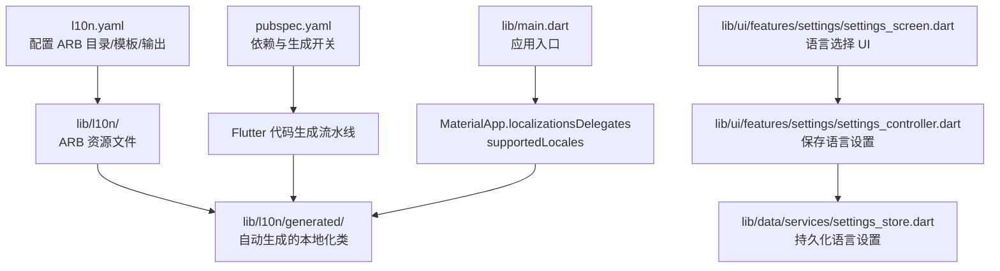
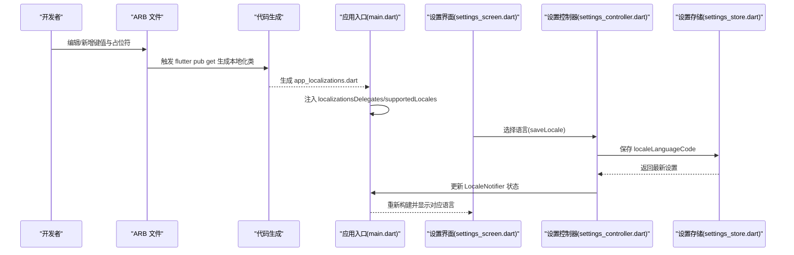
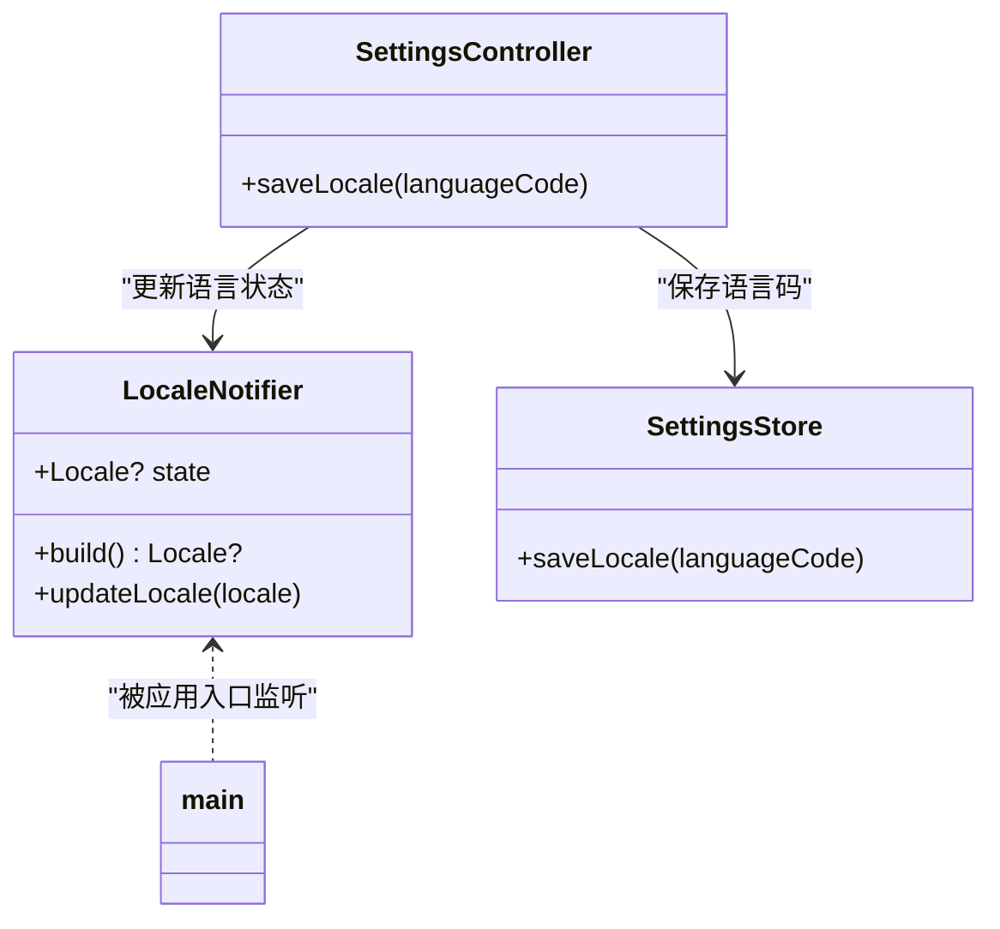
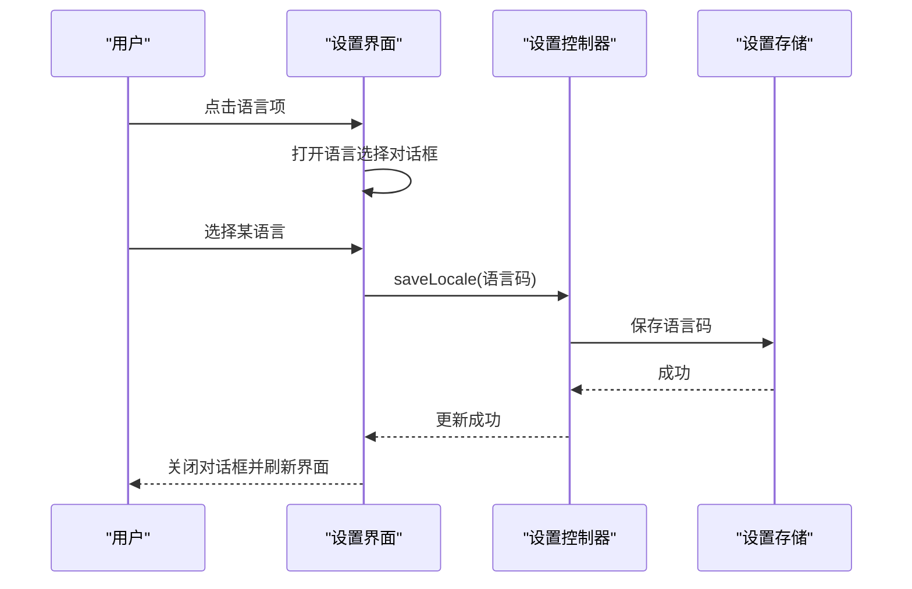
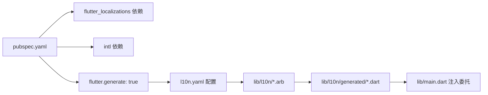

# 国际化和本地化

<cite>
**本文引用的文件**
- [l10n.yaml](file://l10n.yaml)
- [pubspec.yaml](file://pubspec.yaml)
- [main.dart](file://lib/main.dart)
- [app_en.arb](file://lib/l10n/app_en.arb)
- [app_zh.arb](file://lib/l10n/app_zh.arb)
- [settings_controller.dart](file://lib/ui/features/settings/settings_controller.dart)
- [settings_store.dart](file://lib/data/services/settings_store.dart)
- [settings_screen.dart](file://lib/ui/features/settings/settings_screen.dart)
- [chat_list_view_test.dart](file://test/ui/core/shared/chat_list_view_test.dart)
- [SKILL.md](file://.agents/skills/flutter-setup-localization/SKILL.md)
</cite>

## 目录
1. [简介](#简介)
2. [项目结构](#项目结构)
3. [核心组件](#核心组件)
4. [架构总览](#架构总览)
5. [详细组件分析](#详细组件分析)
6. [依赖关系分析](#依赖关系分析)
7. [性能考量](#性能考量)
8. [故障排查指南](#故障排查指南)
9. [结论](#结论)
10. [附录](#附录)

## 简介
本文件系统性阐述 ThkTree 的国际化与本地化（i18n/l10n）实现，覆盖以下要点：
- 多语言支持机制与 ARB 资源文件格式
- 文本资源管理与代码生成流程
- 动态语言切换与状态管理
- 本地化配置文件结构与使用方法
- 添加新语言支持的步骤与最佳实践
- 文本翻译管理、格式化字符串处理、日期时间本地化
- RTL 语言支持与特殊字符处理
- 本地化测试方法与工具
- 不同地区文化差异与用户习惯的处理建议

## 项目结构
ThkTree 的本地化采用 Flutter 官方标准方案：通过 ARB（App Resource Bundle）文件定义多语言文本，借助 l10n.yaml 配置生成 Dart 本地化类，再在应用入口注入本地化委托与受支持语言列表。

图表来源
- [l10n.yaml:1-4](file://l10n.yaml#L1-L4)
- [pubspec.yaml:46-48](file://pubspec.yaml#L46-L48)
- [main.dart:67-91](file://lib/main.dart#L67-L91)
- [settings_screen.dart:304-373](file://lib/ui/features/settings/settings_screen.dart#L304-L373)
- [settings_controller.dart:32-39](file://lib/ui/features/settings/settings_controller.dart#L32-L39)
- [settings_store.dart:177-183](file://lib/data/services/settings_store.dart#L177-L183)

章节来源
- [l10n.yaml:1-4](file://l10n.yaml#L1-L4)
- [pubspec.yaml:46-48](file://pubspec.yaml#L46-L48)
- [main.dart:67-91](file://lib/main.dart#L67-L91)
- [settings_screen.dart:304-373](file://lib/ui/features/settings/settings_screen.dart#L304-L373)
- [settings_controller.dart:32-39](file://lib/ui/features/settings/settings_controller.dart#L32-L39)
- [settings_store.dart:177-183](file://lib/data/services/settings_store.dart#L177-L183)

## 核心组件
- l10n.yaml：定义 ARB 输入目录、模板文件、输出本地化文件与生成目录。
- ARB 文件：app_en.arb（英文模板）、app_zh.arb（中文翻译），键值对与占位符元数据。
- 生成的本地化类：lib/l10n/generated/app_localizations.dart，提供类型安全的本地化访问。
- 应用入口：main.dart 注入本地化委托与受支持语言列表，并通过 localeResolutionCallback 实现语言解析。
- 语言状态与存储：settings_controller.dart 中的 LocaleNotifier；settings_store.dart 持久化 localeLanguageCode。
- 语言选择界面：settings_screen.dart 提供语言选择对话框与保存逻辑。

章节来源
- [l10n.yaml:1-4](file://l10n.yaml#L1-L4)
- [app_en.arb:1-299](file://lib/l10n/app_en.arb#L1-L299)
- [app_zh.arb:1-182](file://lib/l10n/app_zh.arb#L1-L182)
- [main.dart:67-91](file://lib/main.dart#L67-L91)
- [settings_controller.dart:44-57](file://lib/ui/features/settings/settings_controller.dart#L44-L57)
- [settings_store.dart:106-184](file://lib/data/services/settings_store.dart#L106-L184)
- [settings_screen.dart:304-373](file://lib/ui/features/settings/settings_screen.dart#L304-L373)

## 架构总览
下图展示从 ARB 到运行时使用的完整链路：开发者维护 ARB → Flutter 生成本地化类 → 应用入口注入 → UI 组件消费 → 用户设置持久化与动态切换。

图表来源
- [l10n.yaml:1-4](file://l10n.yaml#L1-L4)
- [main.dart:67-91](file://lib/main.dart#L67-L91)
- [settings_screen.dart:304-373](file://lib/ui/features/settings/settings_screen.dart#L304-L373)
- [settings_controller.dart:32-39](file://lib/ui/features/settings/settings_controller.dart#L32-L39)
- [settings_store.dart:177-183](file://lib/data/services/settings_store.dart#L177-L183)

## 详细组件分析

### ARB 文件与文本资源管理
- 结构与描述：每个 ARB 键可带“@键”描述块，用于提供上下文与占位符类型信息，便于翻译人员理解与校验。
- 占位符与格式化：支持字符串占位符、复数（plural）、选择（select）等 ICU 风格格式，确保数量、性别等语义正确。
- 示例要点：
  - 字符串占位符：如“languageSubtitle”、“llmApiKeyTitle”等，使用占位符并在元数据中声明类型与示例。
  - 复数：如“noteCount”，使用复数规则处理单复数形式。
  - 描述：如“description”帮助翻译者理解上下文。

章节来源
- [app_en.arb:11-17](file://lib/l10n/app_en.arb#L11-L17)
- [app_en.arb:100-106](file://lib/l10n/app_en.arb#L100-L106)
- [app_en.arb:117-123](file://lib/l10n/app_en.arb#L117-L123)
- [app_en.arb:177-183](file://lib/l10n/app_en.arb#L177-L183)
- [app_en.arb:291-297](file://lib/l10n/app_en.arb#L291-L297)

### 本地化配置文件（l10n.yaml）
- arb-dir：ARB 文件所在目录
- template-arb-file：模板 ARB 文件名（通常为默认语言）
- output-localization-file：生成的本地化类文件名
- output-dir：生成目录（用于存放生成的本地化类）

章节来源
- [l10n.yaml:1-4](file://l10n.yaml#L1-L4)

### 应用入口与本地化注入（main.dart）
- 注入本地化委托：AppLocalizations.delegate、GlobalMaterialLocalizations.delegate、GlobalWidgetsLocalizations.delegate、GlobalCupertinoLocalizations.delegate
- 受支持语言：由 AppLocalizations.supportedLocales 提供
- 语言解析回调：localeResolutionCallback 基于语言码匹配，兜底为英文
- 标题生成：onGenerateTitle 使用 AppLocalizations 获取应用名称

章节来源
- [main.dart:67-91](file://lib/main.dart#L67-L91)

### 动态语言切换与状态管理
- LocaleNotifier：Riverpod Notifier，持有当前 Locale 并暴露 updateLocale 方法
- SettingsController.saveLocale：保存语言码到设置存储，并更新 LocaleNotifier
- SettingsStore.saveLocale：将语言码写入安全存储（空值表示跟随系统）
- 设置界面：settings_screen.dart 提供语言选择对话框，调用设置控制器保存并触发 UI 更新

图表来源
- [settings_controller.dart:44-57](file://lib/ui/features/settings/settings_controller.dart#L44-L57)
- [settings_controller.dart:32-39](file://lib/ui/features/settings/settings_controller.dart#L32-L39)
- [settings_store.dart:177-183](file://lib/data/services/settings_store.dart#L177-L183)
- [main.dart:66-77](file://lib/main.dart#L66-L77)

章节来源
- [settings_controller.dart:44-57](file://lib/ui/features/settings/settings_controller.dart#L44-L57)
- [settings_controller.dart:32-39](file://lib/ui/features/settings/settings_controller.dart#L32-L39)
- [settings_store.dart:177-183](file://lib/data/services/settings_store.dart#L177-L183)
- [settings_screen.dart:304-373](file://lib/ui/features/settings/settings_screen.dart#L304-L373)
- [main.dart:66-77](file://lib/main.dart#L66-L77)

### 语言选择界面与交互流程
- 语言项：显示当前语言名称与“跟随系统”提示
- 对话框：提供“跟随系统”“英语”“中文”选项
- 保存逻辑：调用设置控制器保存语言码，随后关闭对话框
- 语言名称映射：根据 Locale.languageCode 显示对应语言名

图表来源
- [settings_screen.dart:304-373](file://lib/ui/features/settings/settings_screen.dart#L304-L373)
- [settings_controller.dart:32-39](file://lib/ui/features/settings/settings_controller.dart#L32-L39)
- [settings_store.dart:177-183](file://lib/data/services/settings_store.dart#L177-L183)

章节来源
- [settings_screen.dart:304-373](file://lib/ui/features/settings/settings_screen.dart#L304-L373)

### 文本翻译管理与格式化字符串
- 占位符：在 ARB 中定义占位符并在元数据中声明类型与示例，确保生成的本地化类具备类型安全的参数签名。
- 复数与选择：使用 ICU 复数/选择语法，满足不同语言的变体规则。
- 元数据描述：通过“@键”提供上下文，提升翻译质量与一致性。

章节来源
- [app_en.arb:11-17](file://lib/l10n/app_en.arb#L11-L17)
- [app_en.arb:100-106](file://lib/l10n/app_en.arb#L100-L106)
- [app_en.arb:117-123](file://lib/l10n/app_en.arb#L117-L123)
- [app_en.arb:177-183](file://lib/l10n/app_en.arb#L177-L183)
- [app_en.arb:291-297](file://lib/l10n/app_en.arb#L291-L297)

### 日期时间本地化
- 项目当前未直接使用 intl 包进行日期时间格式化。若需扩展，可在现有 ARB 体系基础上引入 intl 的 DateTime/Number 格式化能力，并在 UI 中按需调用。
- 建议：为日期时间相关键提供占位符与示例，避免硬编码格式；在需要时通过 intl 的 DateFormat 进行本地化渲染。

（本节为通用指导，不直接分析具体文件）

### RTL 语言支持与特殊字符处理
- 当前 ARB 未包含 RTL 语言（如阿拉伯语、希伯来语）。若需支持，应：
  - 在 l10n.yaml 中增加模板与输出配置
  - 新增相应 ARB 文件（如 app_ar.arb）
  - 在 main.dart 的 supportedLocales 中加入对应 Locale
  - 在 UI 中检查布局方向与文本对齐，必要时使用 Directionality 或平台特定样式
- 特殊字符：确保 ARB 文件以 UTF-8 编码保存，避免转义与字符集问题。

（本节为通用指导，不直接分析具体文件）

### 本地化测试方法与工具
- 单元测试：在测试中通过 MaterialApp 注入本地化委托与 supportedLocales，验证 UI 文案是否正确显示。
- 示例：测试文件中通过 MaterialApp 包裹 ChatListView，并断言文案存在。

章节来源
- [chat_list_view_test.dart:11-26](file://test/ui/core/shared/chat_list_view_test.dart#L11-L26)

## 依赖关系分析
- 依赖声明：pubspec.yaml 中包含 flutter_localizations 与 intl 依赖，且开启 flutter.generate。
- 生成流程：l10n.yaml 指定 ARB 目录与模板，flutter pub get 后生成本地化类。
- 应用集成：main.dart 注入本地化委托与受支持语言，AppLocalizations 支持的语言来自生成类。

图表来源
- [pubspec.yaml:46-48](file://pubspec.yaml#L46-L48)
- [l10n.yaml:1-4](file://l10n.yaml#L1-L4)
- [main.dart:83-89](file://lib/main.dart#L83-L89)

章节来源
- [pubspec.yaml:46-48](file://pubspec.yaml#L46-L48)
- [l10n.yaml:1-4](file://l10n.yaml#L1-L4)
- [main.dart:83-89](file://lib/main.dart#L83-L89)

## 性能考量
- 代码生成：ARF 文件变更后通过 flutter pub get 生成本地化类，建议在 CI 中执行以保证一致性。
- 运行时开销：本地化类为静态常量访问，性能开销极低；避免在热路径中重复查询 AppLocalizations。
- 语言切换：切换语言会触发重建，建议在设置界面完成保存后再进行导航跳转，减少不必要的重绘。

（本节为通用指导，不直接分析具体文件）

## 故障排查指南
- ARB 语法错误：生成失败时检查 JSON 语法与占位符匹配，参考 SKILL.md 的反馈循环建议。
- 语言未生效：确认 main.dart 的 supportedLocales 与 AppLocalizations.supportedLocales 是否包含目标语言；检查 localeResolutionCallback 是否正确匹配语言码。
- 语言保存无效：检查设置控制器与存储层的 saveLocale 流程，确保 LocaleNotifier 已更新并触发重建。
- 测试中找不到文案：确保测试用例中注入了 AppLocalizations.delegate 与 supportedLocales。

章节来源
- [SKILL.md:110-117](file://.agents/skills/flutter-setup-localization/SKILL.md#L110-L117)
- [main.dart:67-91](file://lib/main.dart#L67-L91)
- [settings_controller.dart:32-39](file://lib/ui/features/settings/settings_controller.dart#L32-L39)
- [settings_store.dart:177-183](file://lib/data/services/settings_store.dart#L177-L183)
- [chat_list_view_test.dart:11-26](file://test/ui/core/shared/chat_list_view_test.dart#L11-L26)

## 结论
ThkTree 已采用 Flutter 官方标准实现国际化与本地化：以 ARB 为单一事实源，通过 l10n.yaml 与 pubspec.yaml 配置生成本地化类，并在应用入口注入委托与受支持语言。语言切换通过 Riverpod 管理状态并与安全存储结合，形成完整的本地化闭环。未来扩展可按需引入日期时间格式化、RTL 语言支持与更丰富的测试覆盖。

## 附录

### 添加新语言支持的步骤与最佳实践
- 在 l10n.yaml 中确认 arb-dir 与 template-arb-file
- 在 lib/l10n 下新增对应语言的 ARB 文件（如 app_es.arb），保持键集合与占位符一致
- 在 main.dart 的 supportedLocales 中加入新语言 Locale
- 在设置界面的选项中新增该语言的显示名称与选择逻辑
- 通过 flutter pub get 生成本地化类并运行测试验证
- 最佳实践：
  - 保持 ARB 键集合一致，避免遗漏
  - 在元数据中提供清晰的 description 与占位符类型
  - 优先使用 ICU 复数/选择语法，确保多语言正确性
  - 在测试中注入本地化委托与 supportedLocales，验证 UI 文案

章节来源
- [l10n.yaml:1-4](file://l10n.yaml#L1-L4)
- [app_en.arb:1-299](file://lib/l10n/app_en.arb#L1-L299)
- [main.dart:89](file://lib/main.dart#L89)
- [settings_screen.dart:304-373](file://lib/ui/features/settings/settings_screen.dart#L304-L373)
- [SKILL.md:110-117](file://.agents/skills/flutter-setup-localization/SKILL.md#L110-L117)