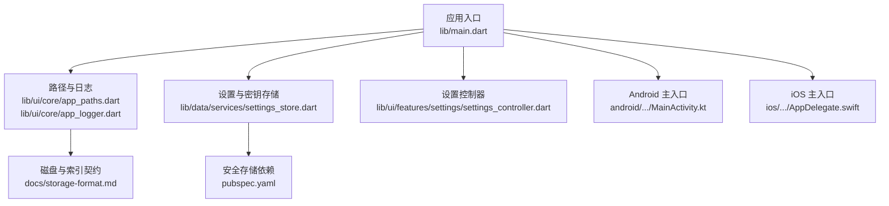
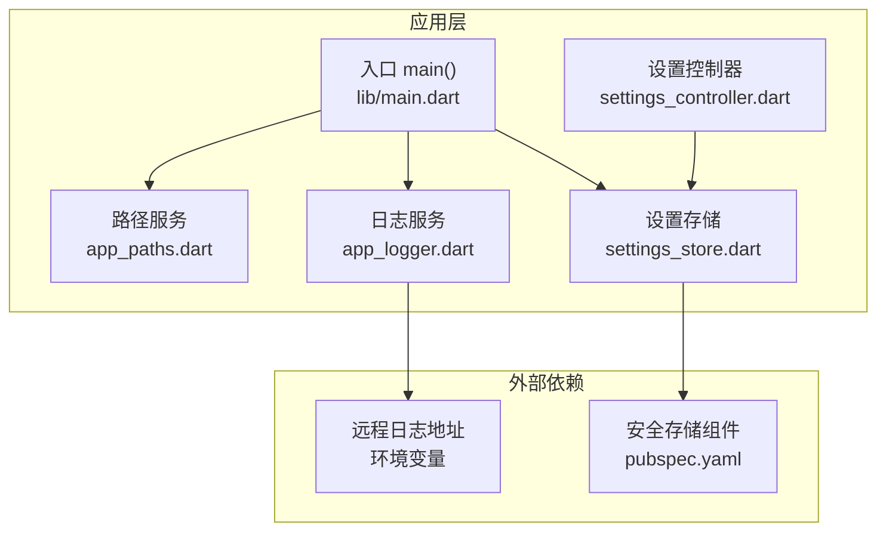
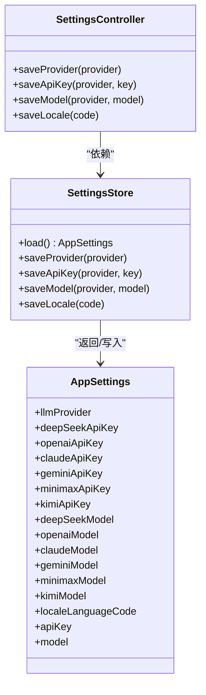
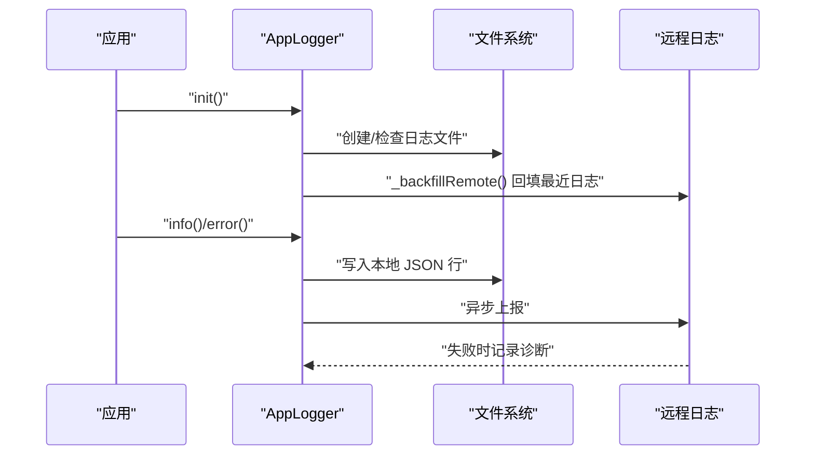
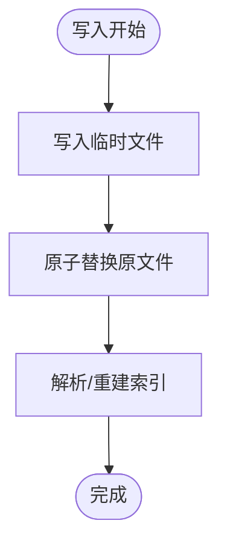
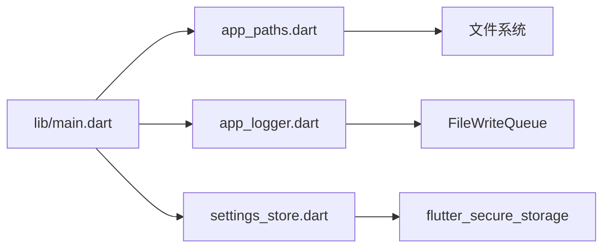

# 安全和隐私

<cite>
**本文引用的文件**
- [lib/main.dart](file://lib/main.dart)
- [pubspec.yaml](file://pubspec.yaml)
- [lib/ui/core/app_logger.dart](file://lib/ui/core/app_logger.dart)
- [lib/ui/core/app_paths.dart](file://lib/ui/core/app_paths.dart)
- [lib/data/services/settings_store.dart](file://lib/data/services/settings_store.dart)
- [lib/ui/features/settings/settings_controller.dart](file://lib/ui/features/settings/settings_controller.dart)
- [docs/storage-format.md](file://docs/storage-format.md)
- [android/app/src/main/kotlin/com/thktree/thk_tree/MainActivity.kt](file://android/app/src/main/kotlin/com/thktree/thk_tree/MainActivity.kt)
- [ios/Runner/AppDelegate.swift](file://ios/Runner/AppDelegate.swift)
</cite>

## 目录
1. [简介](#简介)
2. [项目结构](#项目结构)
3. [核心组件](#核心组件)
4. [架构总览](#架构总览)
5. [详细组件分析](#详细组件分析)
6. [依赖关系分析](#依赖关系分析)
7. [性能考虑](#性能考虑)
8. [故障排查指南](#故障排查指南)
9. [结论](#结论)
10. [附录](#附录)

## 简介
本文件面向 ThkTree 的安全与隐私保护，系统梳理应用在敏感数据加密、API 密钥安全存储、日志与配置信息保护、网络传输与权限管理等方面的设计与实现现状，并给出最佳实践、风险评估方法、保障措施与合规建议。由于当前仓库中未发现显式的隐私政策、用户同意机制、数据最小化策略等文档化条款，本文亦提供概念性指导以帮助完善。

## 项目结构
ThkTree 采用 Flutter 应用结构，核心安全相关逻辑集中在以下模块：
- 应用入口与初始化：负责加载路径、设置远程日志、初始化安全存储与设置加载。
- 日志与审计：本地日志文件与可选远程回填/上报，具备基础敏感信息脱敏。
- 设置与密钥存储：通过安全存储组件持久化 API 密钥与模型配置。
- 存储契约：磁盘文件与 SQLite 索引的权威性与可重建性，确保数据完整性与最小化持久化。

图表来源
- [lib/main.dart:15-59](file://lib/main.dart#L15-L59)
- [lib/ui/core/app_paths.dart:29-45](file://lib/ui/core/app_paths.dart#L29-L45)
- [lib/ui/core/app_logger.dart:74-83](file://lib/ui/core/app_logger.dart#L74-L83)
- [lib/data/services/settings_store.dart:106-156](file://lib/data/services/settings_store.dart#L106-L156)
- [lib/ui/features/settings/settings_controller.dart:7-39](file://lib/ui/features/settings/settings_controller.dart#L7-L39)
- [docs/storage-format.md:14-31](file://docs/storage-format.md#L14-L31)
- [pubspec.yaml:36](file://pubspec.yaml#L36)
- [android/app/src/main/kotlin/com/thktree/thk_tree/MainActivity.kt:1-6](file://android/app/src/main/kotlin/com/thktree/thk_tree/MainActivity.kt#L1-L6)
- [ios/Runner/AppDelegate.swift:1-17](file://ios/Runner/AppDelegate.swift#L1-L17)

章节来源
- [lib/main.dart:15-59](file://lib/main.dart#L15-L59)
- [pubspec.yaml:36](file://pubspec.yaml#L36)

## 核心组件
- 安全存储与密钥管理
  - 使用安全存储组件持久化 LLM API 密钥与模型配置，避免明文落盘。
  - 支持按提供商标识区分密钥键名，便于切换与清理。
- 日志与审计
  - 本地 JSON 行日志文件，按日期轮转；支持可选远程回填与上报。
  - 对日志中的 Bearer Token 进行基础脱敏，降低泄露风险。
- 存储契约与数据最小化
  - Markdown 文件为真相源，SQLite 仅作索引与检索加速，可随时重建。
  - 强制原子写与中间态标记，提升崩溃/断电后的可解析性。
- 路径与隔离
  - 应用文档目录下创建独立根目录，主题、日志、临时文件分离，降低交叉影响。

章节来源
- [lib/data/services/settings_store.dart:106-184](file://lib/data/services/settings_store.dart#L106-L184)
- [lib/ui/core/app_logger.dart:63-196](file://lib/ui/core/app_logger.dart#L63-L196)
- [lib/ui/core/app_paths.dart:7-75](file://lib/ui/core/app_paths.dart#L7-L75)
- [docs/storage-format.md:5-11](file://docs/storage-format.md#L5-L11)

## 架构总览
下图展示了 ThkTree 的安全相关架构：入口初始化加载路径与日志，随后通过安全存储读取设置，日志模块负责本地与远程记录，并对敏感信息进行脱敏。

图表来源
- [lib/main.dart:15-59](file://lib/main.dart#L15-L59)
- [lib/data/services/settings_store.dart:106-156](file://lib/data/services/settings_store.dart#L106-L156)
- [lib/ui/features/settings/settings_controller.dart:7-39](file://lib/ui/features/settings/settings_controller.dart#L7-L39)
- [lib/ui/core/app_paths.dart:29-45](file://lib/ui/core/app_paths.dart#L29-L45)
- [lib/ui/core/app_logger.dart:63-83](file://lib/ui/core/app_logger.dart#L63-L83)
- [pubspec.yaml:36](file://pubspec.yaml#L36)

## 详细组件分析

### 安全存储与 API 密钥管理
- 设计要点
  - 将 LLM 提供商、API 密钥、模型名称等配置封装为强类型对象，集中管理。
  - 通过安全存储组件进行读写，键名按提供商命名，便于清理与切换。
  - 加载时默认提供商标识与模型，缺失时使用默认值，保证健壮性。
- 数据流
  - 应用启动时读取安全存储，构建设置对象；设置变更通过控制器调用存储写入。
- 复杂度与性能
  - 单次读写为 O(1)，整体开销极低；键数量有限，不存在热点问题。
- 风险与改进建议
  - 当前未见密钥轮换、多租户隔离、访问审计等机制；建议引入密钥轮换策略与最小权限访问控制。
  - 建议在安全存储层增加访问计数与最近使用时间，便于异常检测。

图表来源
- [lib/data/services/settings_store.dart:4-104](file://lib/data/services/settings_store.dart#L4-L104)
- [lib/data/services/settings_store.dart:106-184](file://lib/data/services/settings_store.dart#L106-L184)
- [lib/ui/features/settings/settings_controller.dart:7-39](file://lib/ui/features/settings/settings_controller.dart#L7-L39)

章节来源
- [lib/data/services/settings_store.dart:106-184](file://lib/data/services/settings_store.dart#L106-L184)
- [lib/ui/features/settings/settings_controller.dart:7-39](file://lib/ui/features/settings/settings_controller.dart#L7-L39)

### 日志与审计（本地与远程）
- 设计要点
  - 每日轮转日志文件，采用 JSON 行格式，便于解析与远程回填。
  - 初始化阶段可选择性地回填最近若干行至远程地址，失败会记录诊断日志。
  - 对日志中的 Bearer Token 进行基础脱敏，避免凭据泄露。
- 数据流
  - 记录生成 → 写入本地文件 → 可选远程上报 → 失败记录诊断。
- 复杂度与性能
  - 写入为顺序追加，I/O 开销小；远程上报带宽受限，建议限流与退避。
- 风险与改进建议
  - 远程上报缺少认证与加密，建议引入 TLS 与可选签名；限制上报频率与大小。
  - 建议增加日志保留策略与压缩归档，避免无限增长。

图表来源
- [lib/ui/core/app_logger.dart:74-100](file://lib/ui/core/app_logger.dart#L74-L100)
- [lib/ui/core/app_logger.dart:155-196](file://lib/ui/core/app_logger.dart#L155-L196)

章节来源
- [lib/ui/core/app_logger.dart:63-196](file://lib/ui/core/app_logger.dart#L63-L196)

### 存储契约与数据最小化
- 设计要点
  - Markdown 文件为真相源，SQLite 仅作索引与检索加速，可随时重建。
  - 强制原子写与中间态标记，保证崩溃/断电后仍可解析。
  - ID 采用 ULID，全局唯一且可离线生成，便于审计与追踪。
- 数据流
  - 写入 → 临时文件 → 原子替换；解析 → 从磁盘重建索引。
- 复杂度与性能
  - 索引重建为 O(N) 扫描，建议增量重建与缓存热点。
- 风险与改进建议
  - 建议对敏感内容进行最小化存储与定期清理；对日志与临时文件设置生命周期。

图表来源
- [docs/storage-format.md:66-70](file://docs/storage-format.md#L66-L70)
- [docs/storage-format.md:324-340](file://docs/storage-format.md#L324-L340)

章节来源
- [docs/storage-format.md:5-11](file://docs/storage-format.md#L5-L11)
- [docs/storage-format.md:66-70](file://docs/storage-format.md#L66-L70)
- [docs/storage-format.md:324-340](file://docs/storage-format.md#L324-L340)

### 路径与隔离
- 设计要点
  - 应用文档目录下创建独立根目录，主题、日志、临时文件分离。
  - 提供绝对/相对路径转换工具，减少路径拼接错误。
- 风险与改进建议
  - 建议对日志与临时目录设置更严格的文件权限（仅应用进程可读写）。

章节来源
- [lib/ui/core/app_paths.dart:7-75](file://lib/ui/core/app_paths.dart#L7-L75)

### 权限与平台集成
- Android/iOS 主入口均为轻量桥接，未见显式权限声明或网络证书配置。
- 建议
  - 在 AndroidManifest 与 Info.plist 中明确所需权限（如网络、存储）。
  - 对远程日志与 LLM 接口启用 TLS 严格模式与证书固定（Pin）以抵御中间人攻击。

章节来源
- [android/app/src/main/kotlin/com/thktree/thk_tree/MainActivity.kt:1-6](file://android/app/src/main/kotlin/com/thktree/thk_tree/MainActivity.kt#L1-L6)
- [ios/Runner/AppDelegate.swift:1-17](file://ios/Runner/AppDelegate.swift#L1-L17)

## 依赖关系分析
- 关键依赖
  - 安全存储：用于 API 密钥与模型配置的机密数据持久化。
  - 日志队列：用于异步写入与远程上报。
  - 路径提供：用于跨平台应用目录定位。
- 耦合与风险
  - 设置存储与日志模块均依赖应用路径；路径服务错误会影响两者。
  - 远程日志依赖环境变量；未配置时应静默降级。

图表来源
- [lib/main.dart:15-59](file://lib/main.dart#L15-L59)
- [lib/ui/core/app_paths.dart:29-45](file://lib/ui/core/app_paths.dart#L29-L45)
- [lib/ui/core/app_logger.dart:63-83](file://lib/ui/core/app_logger.dart#L63-L83)
- [lib/data/services/settings_store.dart:106-156](file://lib/data/services/settings_store.dart#L106-L156)
- [pubspec.yaml:36](file://pubspec.yaml#L36)

章节来源
- [pubspec.yaml:36](file://pubspec.yaml#L36)

## 性能考虑
- I/O 优化
  - 本地日志采用顺序追加与队列异步写入，避免主线程阻塞。
  - 远程上报限制频率与大小，防止网络拥塞。
- 存储效率
  - SQLite 仅作索引，磁盘文件为真相源，重建成本可控。
  - 原子写与中间态标记减少碎片与解析失败。
- 建议
  - 对高频写入场景引入批量提交与背压策略。
  - 对日志与索引文件启用压缩与分片，降低磁盘占用。

## 故障排查指南
- 日志无法写入
  - 检查应用文档目录是否可写；确认路径服务初始化成功。
- 远程日志失败
  - 检查远程地址与网络连通性；查看诊断日志记录。
- API 密钥读取为空
  - 检查安全存储键名与提供商标识；确认保存流程是否成功。
- 存储损坏或不可解析
  - 使用重建索引功能；检查中间态标记与原子写是否被破坏。

章节来源
- [lib/ui/core/app_paths.dart:47-60](file://lib/ui/core/app_paths.dart#L47-L60)
- [lib/ui/core/app_logger.dart:166-196](file://lib/ui/core/app_logger.dart#L166-L196)
- [lib/data/services/settings_store.dart:117-156](file://lib/data/services/settings_store.dart#L117-L156)
- [docs/storage-format.md:324-340](file://docs/storage-format.md#L324-L340)

## 结论
ThkTree 在安全与隐私方面已具备良好基础：敏感数据通过安全存储组件持久化、日志具备基础脱敏与远程回填、存储契约强调真相源与可重建性。为进一步提升安全性，建议补充密钥轮换、访问审计、TLS 严格模式、证书固定、最小权限与数据生命周期管理等措施，并在后续版本中完善隐私政策与用户同意机制。

## 附录

### 安全配置最佳实践清单
- 密钥管理
  - 使用安全存储组件；定期轮换；最小权限访问；记录访问日志。
- 网络安全
  - 强制 TLS；证书固定；限制上报频率与大小；超时与重试退避。
- 存储与日志
  - 仅持久化必要数据；定期清理；压缩归档；限制保留期。
- 平台集成
  - 明确权限声明；启用严格 SSL；避免明文凭据。

### 风险评估方法
- 威胁建模：识别敏感数据（API 密钥、会话内容）、关键接口（远程日志、LLM 调用）。
- 影响面：评估泄露、篡改、拒绝服务对用户与系统的影响。
- 控制有效性：验证现有措施（安全存储、脱敏、重建能力）是否满足预期。

### 安全保障措施建议
- 审计与监控
  - 记录关键操作（密钥变更、远程上报、重建索引）；设置告警阈值。
- 漏洞扫描与渗透测试
  - 定期扫描依赖与网络接口；模拟中间人攻击与凭据泄露场景。
- 合规性与隐私
  - 明确隐私政策、数据最小化、用户同意机制；提供数据导出/删除能力。