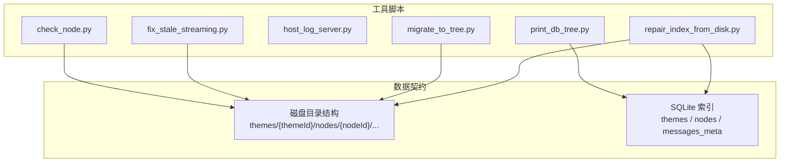
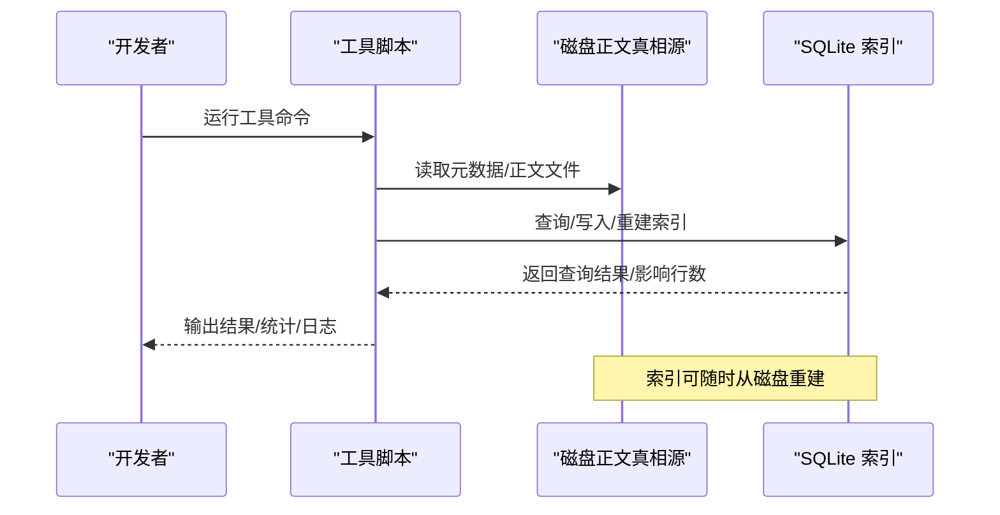
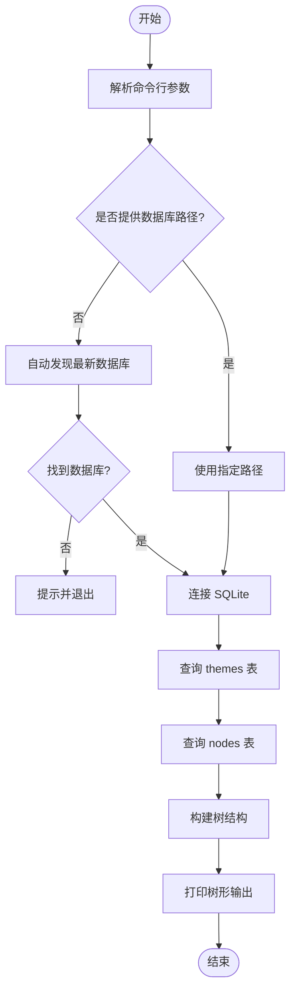
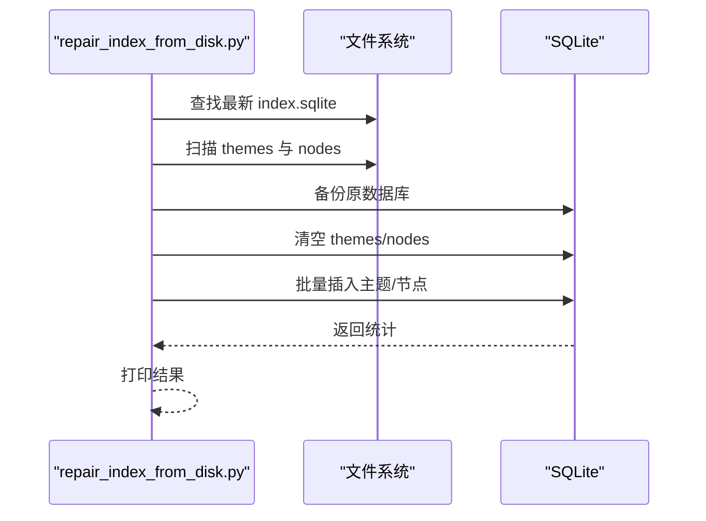
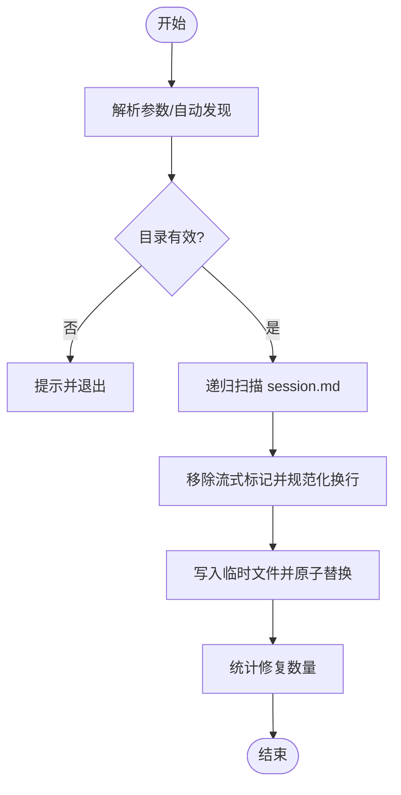
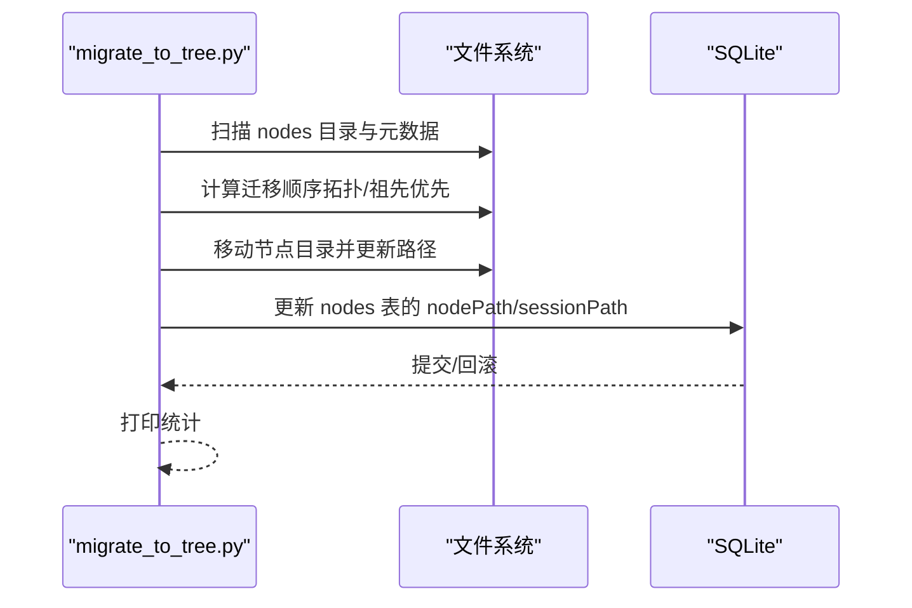
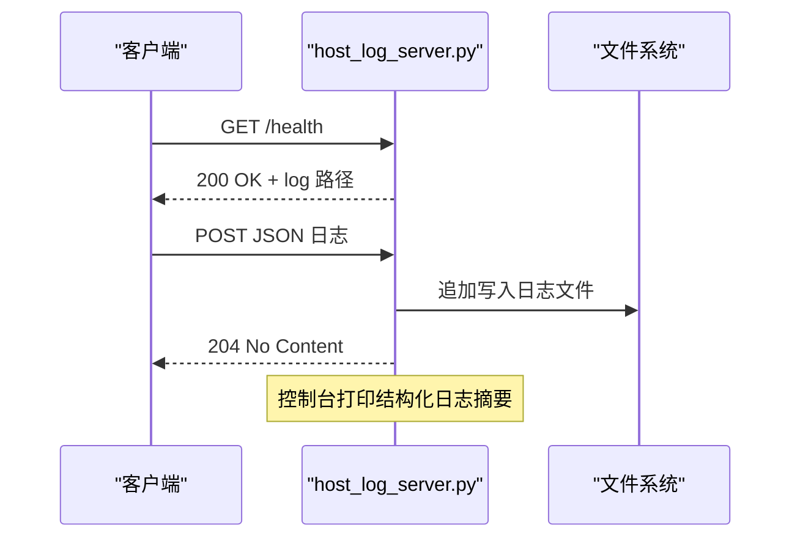
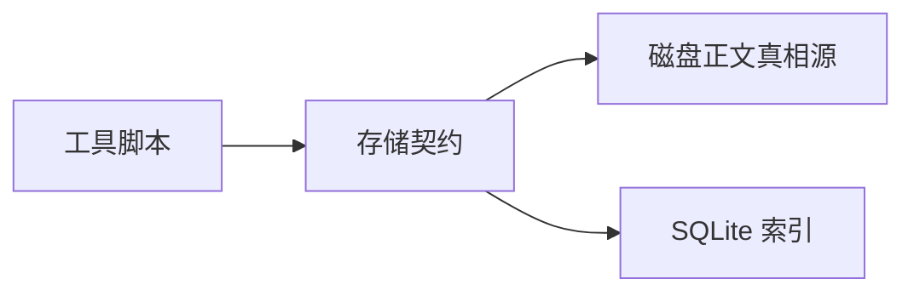

# 开发工具和脚本

<cite>
**本文引用的文件**
- [check_node.py](file://tools/check_node.py)
- [fix_stale_streaming.py](file://tools/fix_stale_streaming.py)
- [host_log_server.py](file://tools/host_log_server.py)
- [migrate_to_tree.py](file://tools/migrate_to_tree.py)
- [print_db_tree.py](file://tools/print_db_tree.py)
- [repair_index_from_disk.py](file://tools/repair_index_from_disk.py)
- [README.md](file://README.md)
- [REQUIREMENTS.md](file://REQUIREMENTS.md)
- [storage-format.md](file://docs/storage-format.md)
</cite>

## 目录
1. [简介](#简介)
2. [项目结构](#项目结构)
3. [核心组件](#核心组件)
4. [架构概览](#架构概览)
5. [详细组件分析](#详细组件分析)
6. [依赖分析](#依赖分析)
7. [性能考量](#性能考量)
8. [故障排查指南](#故障排查指南)
9. [结论](#结论)
10. [附录](#附录)

## 简介
本文件面向 ThkTree 项目的开发者，系统性梳理并说明开发工具与脚本的职责、输入输出、执行流程、参数配置与错误处理机制，并提供使用示例、最佳实践与扩展建议。这些工具主要服务于以下目标：
- 数据库检查与可视化：打印 SQLite 索引树、校验主题与节点一致性
- 索引修复与重建：从磁盘扫描重建 SQLite 索引，确保索引与正文一致
- 数据修复：修复流式写入过程中的残留标记，恢复可解析状态
- 数据迁移：将旧版目录结构迁移到新版树形结构，同时更新 SQLite 索引
- 日志采集：在本地模拟器环境中接收并落盘日志，便于调试

## 项目结构
工具集中位于 tools 目录，每个脚本独立运行，遵循“磁盘正文真相源 + SQLite 索引”的契约，可随时从磁盘重建索引。

图表来源
- [check_node.py:1-46](file://tools/check_node.py#L1-L46)
- [fix_stale_streaming.py:1-101](file://tools/fix_stale_streaming.py#L1-L101)
- [host_log_server.py:1-89](file://tools/host_log_server.py#L1-L89)
- [migrate_to_tree.py:1-165](file://tools/migrate_to_tree.py#L1-L165)
- [print_db_tree.py:1-150](file://tools/print_db_tree.py#L1-L150)
- [repair_index_from_disk.py:1-183](file://tools/repair_index_from_disk.py#L1-L183)
- [storage-format.md:14-350](file://docs/storage-format.md#L14-L350)

章节来源
- [README.md:1-18](file://README.md#L1-L18)
- [REQUIREMENTS.md:1-299](file://REQUIREMENTS.md#L1-L299)
- [storage-format.md:14-350](file://docs/storage-format.md#L14-L350)

## 核心组件
- 数据库检查工具：打印 SQLite 中的主题与节点树，辅助核对索引与磁盘一致性
- 索引重建工具：从磁盘扫描主题与节点元数据，重建 SQLite 索引，支持备份与回滚
- 数据修复工具：修复流式写入残留标记，确保 session.md 可解析
- 流式处理修复工具：批量修复 iOS 模拟器中 session.md 的流式标记
- 数据迁移工具：将旧版 nodes 目录结构迁移到新版树形结构，并更新 SQLite
- 日志采集服务：在本地接收日志并落盘，支持健康检查接口

章节来源
- [print_db_tree.py:1-150](file://tools/print_db_tree.py#L1-L150)
- [repair_index_from_disk.py:1-183](file://tools/repair_index_from_disk.py#L1-L183)
- [fix_stale_streaming.py:1-101](file://tools/fix_stale_streaming.py#L1-L101)
- [migrate_to_tree.py:1-165](file://tools/migrate_to_tree.py#L1-L165)
- [host_log_server.py:1-89](file://tools/host_log_server.py#L1-L89)

## 架构概览
工具与数据契约之间的交互关系如下：

图表来源
- [storage-format.md:292-350](file://docs/storage-format.md#L292-L350)
- [print_db_tree.py:39-76](file://tools/print_db_tree.py#L39-L76)
- [repair_index_from_disk.py:119-162](file://tools/repair_index_from_disk.py#L119-L162)
- [migrate_to_tree.py:109-131](file://tools/migrate_to_tree.py#L109-L131)

## 详细组件分析

### 数据库检查工具：print_db_tree.py
- 功能概述
  - 自动发现 iOS 模拟器中的最新 index.sqlite
  - 查询 themes 与 nodes 表，打印主题与节点树，解析相对路径为绝对路径
  - 支持手动传入数据库路径
- 输入输出
  - 输入：可选数据库路径参数；若省略则自动发现
  - 输出：主题列表、节点树形结构、节点路径解析结果
- 参数与环境变量
  - 命令行参数：数据库路径（可选）
  - 自动发现：遍历 ~/Library/Developer/CoreSimulator/Devices 下的 Documents/thktree/index.sqlite
- 错误处理
  - 未找到数据库时提示并退出
  - 路径不存在时提示并退出
- 使用示例
  - 自动发现并打印：python3 tools/print_db_tree.py
  - 指定数据库路径：python3 tools/print_db_tree.py ~/Documents/index.sqlite

图表来源
- [print_db_tree.py:39-150](file://tools/print_db_tree.py#L39-L150)

章节来源
- [print_db_tree.py:1-150](file://tools/print_db_tree.py#L1-L150)

### 索引重建工具：repair_index_from_disk.py
- 功能概述
  - 自动发现最新 index.sqlite
  - 扫描磁盘 themes 与 nodes，重建 themes 与 nodes 表
  - 写入前自动备份数据库（带 UTC 时间戳）
- 输入输出
  - 输入：无命令行参数，自动发现数据库
  - 输出：备份文件路径、重建统计、示例路径
- 参数与环境变量
  - 无命令行参数
- 错误处理
  - 未找到数据库时抛出异常并退出
  - 扫描元数据异常时跳过并继续
- 使用示例
  - python3 tools/repair_index_from_disk.py

图表来源
- [repair_index_from_disk.py:9-183](file://tools/repair_index_from_disk.py#L9-L183)

章节来源
- [repair_index_from_disk.py:1-183](file://tools/repair_index_from_disk.py#L1-L183)

### 数据修复工具：fix_stale_streaming.py
- 功能概述
  - 修复流式写入残留的标记，确保 session.md 可解析
  - 支持自动发现 iOS 模拟器中的 themes 目录
- 输入输出
  - 输入：themes 目录路径（可选，自动发现）
  - 输出：修复计数、失败文件列表
- 参数与环境变量
  - 命令行参数：themes 目录路径
- 错误处理
  - 读取失败跳过
  - 写入失败回滚临时文件
- 使用示例
  - 自动发现：python3 tools/fix_stale_streaming.py
  - 指定目录：python3 tools/fix_stale_streaming.py ~/Documents/thktree/themes

图表来源
- [fix_stale_streaming.py:30-96](file://tools/fix_stale_streaming.py#L30-L96)

章节来源
- [fix_stale_streaming.py:1-101](file://tools/fix_stale_streaming.py#L1-L101)

### 数据迁移工具：migrate_to_tree.py
- 功能概述
  - 将旧版 nodes 目录结构迁移到新版树形结构
  - 更新 SQLite 索引中的 nodePath 与 sessionPath
- 输入输出
  - 输入：themes 目录路径（可选，自动发现）
  - 输出：迁移统计、SQLite 更新结果
- 参数与环境变量
  - 命令行参数：themes 目录路径
- 错误处理
  - 未找到 nodes 目录时跳过
  - SQLite 更新异常时回滚并提示
- 使用示例
  - 自动发现：python3 tools/migrate_to_tree.py
  - 指定目录：python3 tools/migrate_to_tree.py ~/Documents/thktree/themes

图表来源
- [migrate_to_tree.py:7-165](file://tools/migrate_to_tree.py#L7-L165)

章节来源
- [migrate_to_tree.py:1-165](file://tools/migrate_to_tree.py#L1-L165)

### 日志采集服务：host_log_server.py
- 功能概述
  - 提供 HTTP 服务接收日志并落盘
  - 支持 /health 健康检查
  - 解析 JSON 日志并打印结构化信息
- 输入输出
  - 输入：HTTP POST（JSON）
  - 输出：204 No Content；控制台打印日志摘要
- 参数与环境变量
  - THKTREE_HOST：监听地址（默认 127.0.0.1）
  - THKTREE_PORT：监听端口（默认 8787）
  - THKTREE_HOST_LOG：日志文件路径（默认 tools/thktree-host.log）
- 错误处理
  - 解析失败打印原始内容
  - 写入失败返回 204（不影响客户端）
- 使用示例
  - 启动服务：python3 tools/host_log_server.py
  - 健康检查：curl http://127.0.0.1:8787/health

图表来源
- [host_log_server.py:15-89](file://tools/host_log_server.py#L15-L89)

章节来源
- [host_log_server.py:1-89](file://tools/host_log_server.py#L1-L89)

### 辅助工具：check_node.py
- 功能概述
  - 在 iOS 模拟器中查找特定节点 ID 对应的 session.md 并打印内容
- 输入输出
  - 输入：硬编码的目标节点 ID
  - 输出：匹配路径与文件内容
- 参数与环境变量
  - 无命令行参数
- 错误处理
  - 未找到时提示“not found”
- 使用示例
  - 直接运行：python3 tools/check_node.py

章节来源
- [check_node.py:1-46](file://tools/check_node.py#L1-L46)

## 依赖分析
- 工具间耦合度低，均基于磁盘契约与 SQLite 约定工作
- 共同依赖
  - Python 标准库：os、sys、glob、sqlite3、json、http.server
  - 存储契约：REQUIREMENTS.md 与 storage-format.md
- 外部依赖
  - iOS 模拟器设备目录结构（~/Library/Developer/CoreSimulator/Devices）

图表来源
- [REQUIREMENTS.md:77-83](file://REQUIREMENTS.md#L77-L83)
- [storage-format.md:14-350](file://docs/storage-format.md#L14-L350)

章节来源
- [REQUIREMENTS.md:77-83](file://REQUIREMENTS.md#L77-L83)
- [storage-format.md:14-350](file://docs/storage-format.md#L14-L350)

## 性能考量
- 扫描与重建
  - repair_index_from_disk.py 与 migrate_to_tree.py 对磁盘进行递归扫描，建议在空闲时段运行
  - 批量插入使用 executemany，减少往返开销
- I/O 与原子写
  - fix_stale_streaming.py 使用临时文件 + 原子替换，避免部分写入导致文件损坏
- 索引重建成本
  - SQLite 重建可随时进行，但涉及大量文件读取与写入，建议在开发机上运行并关闭不必要的后台任务

## 故障排查指南
- 数据库未找到
  - print_db_tree.py 与 repair_index_from_disk.py 会在未找到数据库时提示并退出
  - 检查 iOS 模拟器是否安装应用、Documents/thktree/index.sqlite 是否存在
- 目录无效
  - fix_stale_streaming.py 与 migrate_to_tree.py 会检查目录有效性并提示
- 写入失败
  - fix_stale_streaming.py 在写入失败时会清理临时文件并跳过该文件
  - repair_index_from_disk.py 与 migrate_to_tree.py 在 SQLite 更新失败时会回滚
- 日志服务问题
  - host_log_server.py 会在解析失败时打印原始内容，检查 JSON 格式
  - 确认 THKTREE_HOST/THKTREE_PORT/THKTREE_HOST_LOG 环境变量

章节来源
- [print_db_tree.py:47-54](file://tools/print_db_tree.py#L47-L54)
- [repair_index_from_disk.py:24](file://tools/repair_index_from_disk.py#L24)
- [fix_stale_streaming.py:45-47](file://tools/fix_stale_streaming.py#L45-L47)
- [migrate_to_tree.py:152-154](file://tools/migrate_to_tree.py#L152-L154)
- [host_log_server.py:75-84](file://tools/host_log_server.py#L75-L84)

## 结论
上述工具围绕“磁盘正文真相源 + SQLite 索引”的契约，提供了从检查、修复、重建到迁移与日志采集的完整开发辅助能力。它们具备良好的可移植性与可扩展性，适合在开发流程中按需使用，确保数据一致性与可维护性。

## 附录

### 使用时机与最佳实践
- 开发初期
  - 使用 print_db_tree.py 核对索引与磁盘一致性
  - 使用 repair_index_from_disk.py 在索引损坏时快速重建
- 流式写入调试
  - 使用 fix_stale_streaming.py 修复残留标记
  - 使用 host_log_server.py 接收并查看结构化日志
- 迁移与重构
  - 使用 migrate_to_tree.py 将旧结构迁移到新结构
  - 迁移前备份数据库，迁移后核对 print_db_tree.py 输出

### 参数与环境变量一览
- print_db_tree.py
  - 命令行参数：数据库路径（可选）
- repair_index_from_disk.py
  - 无命令行参数
- fix_stale_streaming.py
  - 命令行参数：themes 目录路径（可选）
- migrate_to_tree.py
  - 命令行参数：themes 目录路径（可选）
- host_log_server.py
  - THKTREE_HOST：监听地址（默认 127.0.0.1）
  - THKTREE_PORT：监听端口（默认 8787）
  - THKTREE_HOST_LOG：日志文件路径（默认 tools/thktree-host.log）

### 输入输出格式与数据契约
- 存储契约要点
  - 磁盘：themes/{themeId}/nodes/{nodeId}/node.meta.json、session.md、context-summary.md、notes/{noteId}.md
  - SQLite：themes、nodes、messages_meta 等表
  - 索引可随时从磁盘重建
- 流式中间态与错误态
  - session.md 支持流式标记与错误标记，崩溃后仍可解析

章节来源
- [storage-format.md:14-350](file://docs/storage-format.md#L14-L350)
- [REQUIREMENTS.md:77-83](file://REQUIREMENTS.md#L77-L83)