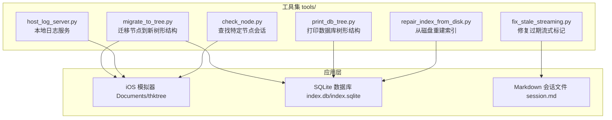
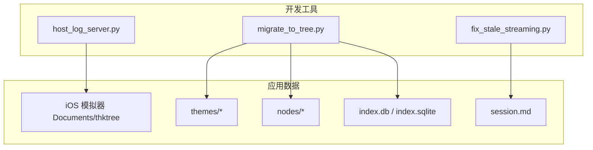
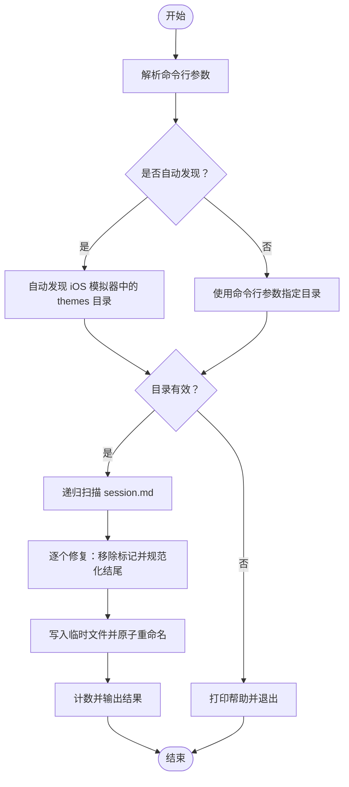
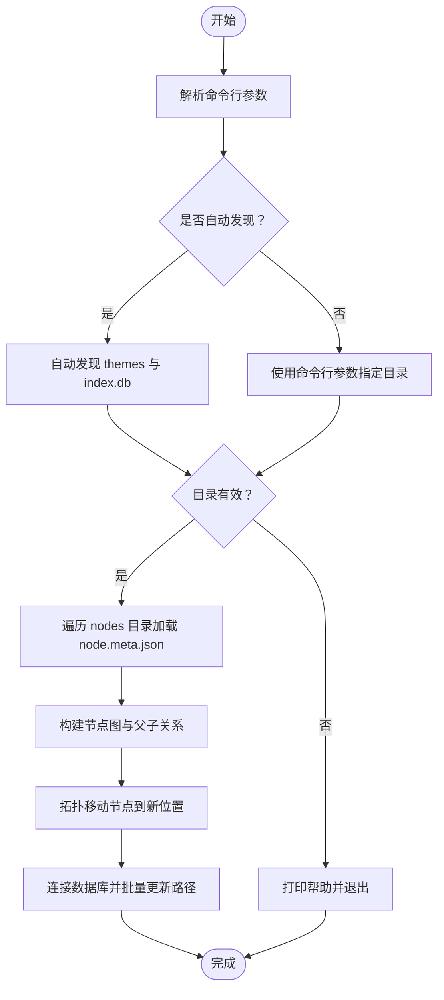
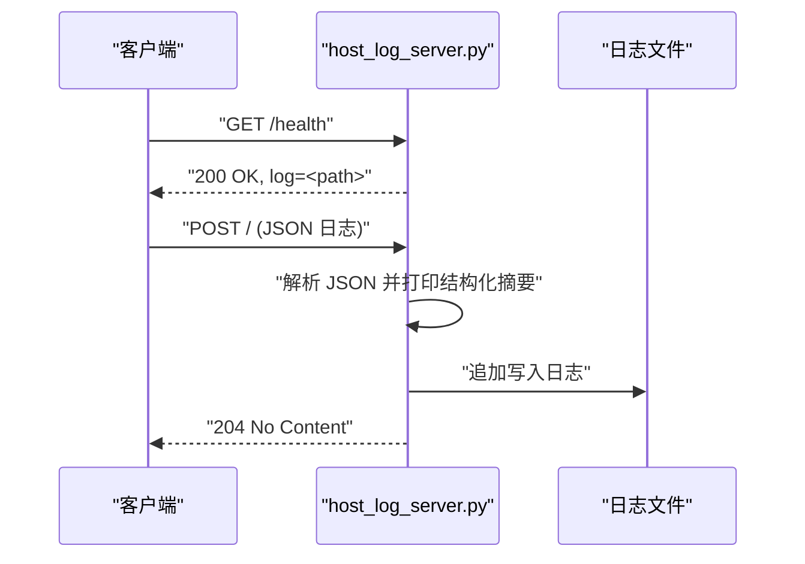
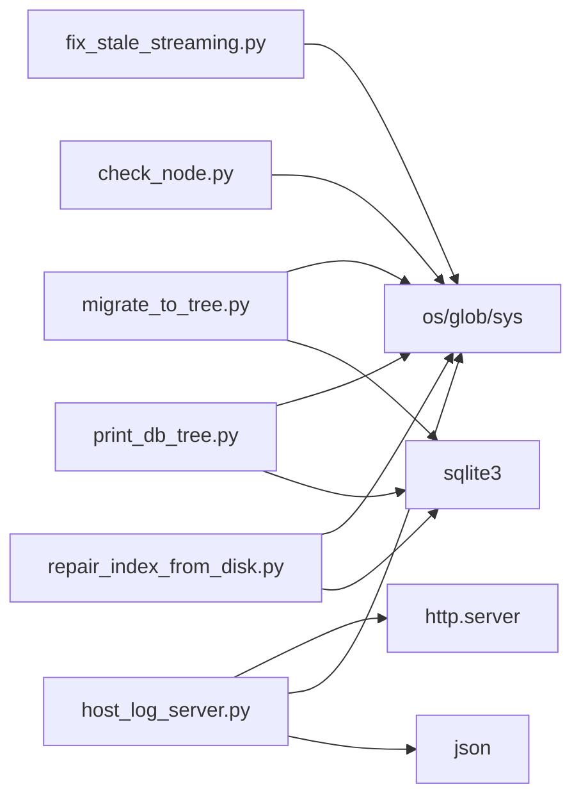

# 开发辅助工具

<cite>
**本文引用的文件**
- [fix_stale_streaming.py](file://tools/fix_stale_streaming.py)
- [migrate_to_tree.py](file://tools/migrate_to_tree.py)
- [host_log_server.py](file://tools/host_log_server.py)
- [check_node.py](file://tools/check_node.py)
- [print_db_tree.py](file://tools/print_db_tree.py)
- [repair_index_from_disk.py](file://tools/repair_index_from_disk.py)
- [README.md](file://README.md)
- [pubspec.yaml](file://pubspec.yaml)
</cite>

## 目录
1. [简介](#简介)
2. [项目结构](#项目结构)
3. [核心组件](#核心组件)
4. [架构总览](#架构总览)
5. [详细组件分析](#详细组件分析)
6. [依赖分析](#依赖分析)
7. [性能考虑](#性能考虑)
8. [故障排除指南](#故障排除指南)
9. [结论](#结论)
10. [附录](#附录)

## 简介
本文件为 ThkTree 的开发辅助工具综合文档，重点覆盖以下三个工具：
- 流式处理修复工具：用于检测并修复过期的流式会话标记，确保会话文件内容格式正确。
- 数据迁移工具：将旧版节点目录结构迁移到新的树形架构，并更新数据库索引路径。
- 日志服务器：启动本地 HTTP 日志服务，接收并记录来自客户端的日志消息，便于调试与问题定位。

此外，文档还包含各工具的使用场景、执行步骤、配置选项、错误处理机制、日志记录与故障排除指南，并给出在开发流程中的集成方式与自动化部署策略，以及定制与扩展建议。

## 项目结构
ThkTree 的工具集中位于 tools 目录，包含多个独立脚本，分别服务于不同开发阶段的任务：
- 流式修复：fix_stale_streaming.py
- 数据迁移：migrate_to_tree.py
- 日志服务：host_log_server.py
- 调试辅助：check_node.py、print_db_tree.py、repair_index_from_disk.py

图表来源
- [fix_stale_streaming.py:1-101](file://tools/fix_stale_streaming.py#L1-L101)
- [migrate_to_tree.py:1-165](file://tools/migrate_to_tree.py#L1-L165)
- [host_log_server.py:1-89](file://tools/host_log_server.py#L1-L89)
- [check_node.py:1-46](file://tools/check_node.py#L1-L46)
- [print_db_tree.py:1-150](file://tools/print_db_tree.py#L1-L150)
- [repair_index_from_disk.py:1-183](file://tools/repair_index_from_disk.py#L1-L183)

章节来源
- [README.md:1-18](file://README.md#L1-L18)
- [pubspec.yaml:1-102](file://pubspec.yaml#L1-L102)

## 核心组件
本节对三个核心工具进行深入分析，涵盖功能、数据流、处理逻辑、错误处理与性能特征。

- 流式处理修复工具（fix_stale_streaming.py）
  - 功能概述：扫描主题目录下的会话文件，移除过期的流式标记，修正文件结尾换行，保证会话内容格式一致。
  - 关键点：自动发现 iOS 模拟器中的 thktree/themes 目录；递归遍历 session.md 文件；安全写入临时文件后原子重命名；统计修复数量。
  - 错误处理：读取失败跳过；写入失败回滚临时文件；未找到目录时提示手动指定路径。

- 数据迁移工具（migrate_to_tree.py）
  - 功能概述：将旧版 nodes 目录按父子关系重新组织到新的树形结构中，并更新 SQLite 数据库中的路径字段。
  - 关键点：自动发现最新模拟器中的 themes 与 index.db；解析 node.meta.json 构建节点图；拓扑排序移动节点；批量更新数据库。
  - 错误处理：节点元数据缺失或损坏时跳过；数据库事务失败回滚；异常不影响整体迁移流程。

- 日志服务器（host_log_server.py）
  - 功能概述：提供 HTTP 接口接收客户端日志，写入二进制日志文件并打印结构化日志摘要；支持健康检查端点。
  - 关键点：环境变量控制主机、端口与日志文件路径；POST 接收 JSON 日志；解析并打印关键字段；GET /health 返回服务状态。
  - 错误处理：解析失败降级为原始字节输出；忽略 HTTP 访问日志噪声。

章节来源
- [fix_stale_streaming.py:1-101](file://tools/fix_stale_streaming.py#L1-L101)
- [migrate_to_tree.py:1-165](file://tools/migrate_to_tree.py#L1-L165)
- [host_log_server.py:1-89](file://tools/host_log_server.py#L1-L89)

## 架构总览
下图展示三个核心工具与应用数据存储之间的交互关系，以及日志服务在整个开发调试链路中的位置。

图表来源
- [fix_stale_streaming.py:49-96](file://tools/fix_stale_streaming.py#L49-L96)
- [migrate_to_tree.py:34-131](file://tools/migrate_to_tree.py#L34-L131)
- [host_log_server.py:75-84](file://tools/host_log_server.py#L75-L84)

## 详细组件分析

### 流式处理修复工具（fix_stale_streaming.py）

- 功能与用途
  - 自动发现 iOS 模拟器中的 thktree/themes 目录，或通过命令行参数显式指定。
  - 扫描所有 session.md 文件，移除过期的流式标记，确保文件以单个换行结尾，避免多空行导致渲染问题。
  - 安全地写入临时文件并原子重命名，防止部分写入导致的数据损坏。

- 处理流程
  - 命令行参数解析：若未提供路径则尝试自动发现。
  - 递归搜索 session.md 文件列表。
  - 对每个文件执行标记移除与结尾规范化。
  - 使用临时文件写入并重命名，成功后计数加一。
  - 输出修复总数。

- 错误处理与健壮性
  - 读取失败：跳过该文件并继续处理下一个。
  - 写入失败：删除临时文件并继续处理。
  - 目录不存在：提示用户手动指定路径。

- 性能特征
  - 时间复杂度：O(N) 遍历所有 session.md 文件，每次文件读写为 O(M)，M 为文件大小。
  - 空间复杂度：O(M) 一次性读取文件内容。
  - I/O 行为：顺序读取与写入，使用临时文件减少锁竞争。

- 使用场景与执行步骤
  - 场景：iOS 模拟器中存在过期流式标记导致会话显示异常。
  - 步骤：
    1) 在终端进入项目根目录。
    2) 运行脚本，自动发现或显式传入 themes 目录路径。
    3) 查看输出统计修复数量。
  - 示例命令：
    - 自动发现：python tools/fix_stale_streaming.py
    - 显式路径：python tools/fix_stale_streaming.py /path/to/themes

- 配置选项
  - 无命令行参数：自动发现 iOS 模拟器中的 thktree/themes。
  - 有参数：直接使用提供的 themes 目录路径。

- 故障排除
  - 无法自动发现：确认 iOS 模拟器已安装应用且包含 thktree/themes。
  - 权限不足：检查目标目录读写权限。
  - 文件损坏：读取失败会跳过，可单独检查对应 session.md。

图表来源
- [fix_stale_streaming.py:30-96](file://tools/fix_stale_streaming.py#L30-L96)

章节来源
- [fix_stale_streaming.py:1-101](file://tools/fix_stale_streaming.py#L1-L101)

### 数据迁移工具（migrate_to_tree.py）

- 功能与用途
  - 将旧版 nodes 目录按父子关系重新组织到新的树形结构中。
  - 更新 SQLite 数据库中的 nodePath 与 sessionPath 字段，保持路径一致性。

- 处理流程
  - 自动发现：遍历 iOS 模拟器 Documents/thktree，定位最新的 themes 与 index.db。
  - 解析：读取每个节点的 node.meta.json，构建节点信息字典与访问标记。
  - 拓扑移动：使用栈式 DFS，先访问父节点再处理当前节点，确保父节点先被移动到正确位置。
  - 更新数据库：批量更新 nodes 表的 nodePath 与 sessionPath 字段。

- 错误处理与健壮性
  - 节点元数据缺失或损坏：跳过该节点并记录提示。
  - 数据库操作失败：捕获异常并回滚事务，避免半更新状态。
  - 目录不存在：提示用户手动指定路径。

- 性能特征
  - 时间复杂度：O(V+E) 构建节点图与拓扑移动，V 为节点数，E 为父子边数；数据库更新为 O(V)。
  - 空间复杂度：O(V) 存储节点信息与访问标记。
  - I/O 行为：磁盘移动与数据库写入，使用批量插入提升效率。

- 使用场景与执行步骤
  - 场景：从旧版节点目录结构迁移到新版树形结构，确保路径与数据库一致。
  - 步骤：
    1) 在终端进入项目根目录。
    2) 运行脚本，自动发现或显式传入 themes 目录路径。
    3) 观察输出的迁移节点数量与数据库更新状态。
  - 示例命令：
    - 自动发现：python tools/migrate_to_tree.py
    - 显式路径：python tools/migrate_to_tree.py /path/to/themes

- 配置选项
  - 无命令行参数：自动发现 iOS 模拟器中的 thktree/themes 与 index.db。
  - 有参数：直接使用提供的 themes 目录路径，同时尝试定位同级 index.db。

- 迁移验证流程
  - 使用 print_db_tree.py 或 repair_index_from_disk.py 验证数据库一致性。
  - 检查节点移动后的 session.md 是否存在且路径正确。

图表来源
- [migrate_to_tree.py:132-161](file://tools/migrate_to_tree.py#L132-L161)

章节来源
- [migrate_to_tree.py:1-165](file://tools/migrate_to_tree.py#L1-L165)

### 日志服务器（host_log_server.py）

- 功能与用途
  - 启动本地 HTTP 服务，接收客户端发送的日志消息，写入二进制日志文件并打印结构化摘要。
  - 提供 /health 健康检查端点，返回服务状态与日志文件路径。

- 处理流程
  - 初始化：从环境变量读取主机、端口与日志文件路径。
  - GET /health：返回 OK 与日志路径。
  - POST：读取请求体，写入日志文件；尝试解析 JSON 并打印关键字段；否则打印原始字节。
  - 日志输出：结构化打印时间戳、级别、消息、属性与错误堆栈等。

- 错误处理与健壮性
  - JSON 解析失败：降级为原始字节输出，避免中断服务。
  - HTTP 访问日志：禁用默认日志输出，避免干扰结构化日志。
  - 文件写入：追加写入，确保不丢失历史日志。

- 性能特征
  - 单线程 HTTP 服务器，适合本地调试场景。
  - I/O 行为：顺序写入，无额外缓存层。
  - 资源占用：低开销，适合持续运行。

- 使用场景与执行步骤
  - 场景：本地调试时收集客户端日志，快速定位问题。
  - 步骤：
    1) 设置环境变量（可选）：THKTREE_HOST、THKTREE_PORT、THKTREE_HOST_LOG。
    2) 运行脚本，监听 http://host:port/health。
    3) 客户端向 POST / 发送 JSON 日志，服务端打印并写入日志文件。
  - 示例命令：
    - 默认：python tools/host_log_server.py
    - 自定义：THKTREE_HOST=127.0.0.1 THKTREE_PORT=8787 THKTREE_HOST_LOG=/tmp/thktree-host.log python tools/host_log_server.py

- 配置选项
  - THKTREE_HOST：监听主机，默认 127.0.0.1。
  - THKTREE_PORT：监听端口，默认 8787。
  - THKTREE_HOST_LOG：日志文件路径，默认 tools/thktree-host.log。

- 调试支持
  - 结构化日志：打印 id、ts、level、msg、attrs、err 等字段。
  - 原始日志：解析失败时打印原始字节，便于排查格式问题。

图表来源
- [host_log_server.py:15-67](file://tools/host_log_server.py#L15-L67)

章节来源
- [host_log_server.py:1-89](file://tools/host_log_server.py#L1-L89)

### 其他辅助工具概览

- 节点查找工具（check_node.py）
  - 功能：在 iOS 模拟器中按节点 ID 查找对应的 session.md 并打印内容。
  - 使用：修改目标节点 ID 后运行脚本，快速定位问题节点。
  - 章节来源
    - [check_node.py:1-46](file://tools/check_node.py#L1-L46)

- 数据库树形打印（print_db_tree.py）
  - 功能：自动发现 index.sqlite，打印主题与节点树形结构，验证迁移结果。
  - 使用：直接运行或传入数据库路径，查看节点父子关系与路径解析。
  - 章节来源
    - [print_db_tree.py:1-150](file://tools/print_db_tree.py#L1-L150)

- 索引从磁盘修复（repair_index_from_disk.py）
  - 功能：扫描磁盘上的主题与节点，重建 SQLite 数据库，生成备份。
  - 使用：运行后自动备份原数据库，重建 themes 与 nodes 表。
  - 章节来源
    - [repair_index_from_disk.py:1-183](file://tools/repair_index_from_disk.py#L1-L183)

## 依赖分析
- 工具间耦合
  - fix_stale_streaming.py 仅依赖标准库，与应用数据交互为文件系统层面。
  - migrate_to_tree.py 依赖标准库与 SQLite，与数据库交互为 SQL 更新。
  - host_log_server.py 依赖标准库 HTTP 服务器模块，与应用交互为网络请求。
  - 其他工具（check_node.py、print_db_tree.py、repair_index_from_disk.py）与上述工具无直接依赖，但共享相同的 iOS 模拟器数据发现模式。

- 外部依赖
  - Python 标准库：os、glob、sys、sqlite3、http.server、json、shutil、datetime 等。
  - 无第三方包依赖，便于跨平台运行。

- 潜在循环依赖
  - 无循环依赖，工具职责清晰分离。

图表来源
- [fix_stale_streaming.py:1-101](file://tools/fix_stale_streaming.py#L1-L101)
- [migrate_to_tree.py:1-165](file://tools/migrate_to_tree.py#L1-L165)
- [host_log_server.py:1-89](file://tools/host_log_server.py#L1-L89)
- [check_node.py:1-46](file://tools/check_node.py#L1-L46)
- [print_db_tree.py:1-150](file://tools/print_db_tree.py#L1-L150)
- [repair_index_from_disk.py:1-183](file://tools/repair_index_from_disk.py#L1-L183)

## 性能考虑
- I/O 模式
  - 顺序读写为主，使用临时文件与原子重命名降低并发风险。
  - SQLite 批量插入与事务提交提升迁移效率。
- 内存占用
  - 迁移工具在内存中维护节点映射表，节点数量较多时需关注内存峰值。
- 并发与稳定性
  - 日志服务器为单线程，适合本地调试；生产环境建议使用更健壮的日志收集方案。
- 可扩展性
  - 工具均基于标准库实现，易于移植到不同平台或容器环境。

## 故障排除指南
- 流式修复工具
  - 症状：无法自动发现目录。
    - 处理：确认 iOS 模拟器已安装应用且包含 thktree/themes。
  - 症状：修复后仍显示异常。
    - 处理：检查 session.md 是否存在多余换行，必要时手动清理。
- 数据迁移工具
  - 症状：节点移动失败或路径不正确。
    - 处理：检查 node.meta.json 的 parentId 与 nodeId 是否匹配；使用 print_db_tree.py 验证。
  - 症状：数据库更新失败。
    - 处理：查看异常信息并回滚；必要时使用 repair_index_from_disk.py 从磁盘重建。
- 日志服务器
  - 症状：POST 请求无响应。
    - 处理：检查端口占用与防火墙设置；确认客户端发送的是 UTF-8 JSON。
  - 症状：日志文件未生成。
    - 处理：检查 THKTREE_HOST_LOG 路径权限与磁盘空间。

章节来源
- [fix_stale_streaming.py:40-47](file://tools/fix_stale_streaming.py#L40-L47)
- [migrate_to_tree.py:126-130](file://tools/migrate_to_tree.py#L126-L130)
- [host_log_server.py:75-84](file://tools/host_log_server.py#L75-L84)

## 结论
ThkTree 的开发辅助工具围绕“修复过期流式标记”、“迁移节点到新树形结构”和“本地日志服务”三大核心能力展开，配合其他调试工具形成完整的开发与排障闭环。这些工具以最小依赖、高可移植性的方式服务于 iOS 模拟器环境下的数据一致性与调试需求。建议在 CI/CD 中集成这些工具，以自动化保障数据结构与日志质量。

## 附录

### 开发流程集成与自动化部署策略
- 集成建议
  - 在本地开发流水线中加入数据迁移与修复步骤，确保每次切换分支后数据结构一致。
  - 在测试前运行日志服务器，收集客户端日志，便于快速定位问题。
- 自动化策略
  - 使用 shell 脚本封装工具调用，结合环境变量实现不同环境的配置切换。
  - 在 CI 中定期运行 print_db_tree.py 与 repair_index_from_disk.py，作为健康检查的一部分。

### 工具定制与扩展指导
- 流式修复工具
  - 支持更多标记类型：扩展标记列表与替换规则。
  - 增加 dry-run 模式：预览将要修改的文件而不实际写入。
- 数据迁移工具
  - 支持增量迁移：仅处理新增或变更的节点。
  - 扩展数据库字段：根据业务需要增加更多路径或元数据字段。
- 日志服务器
  - 增加日志轮转：按大小或时间轮转日志文件。
  - 支持多协议：除 HTTP 外，增加 UDP/TCP 等协议以适配不同客户端。
  - 增强过滤：按级别、关键字或来源过滤日志。