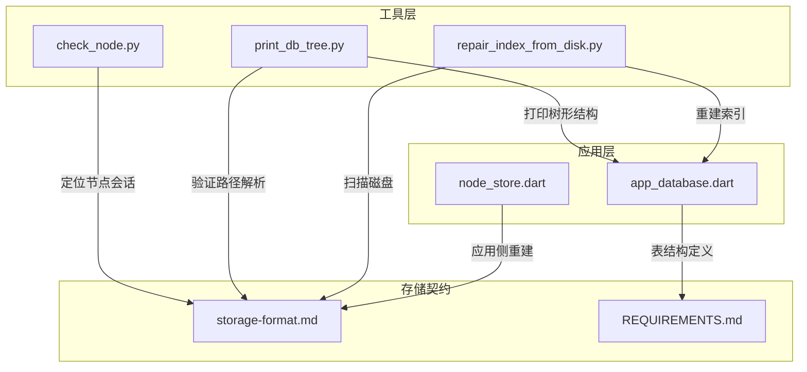
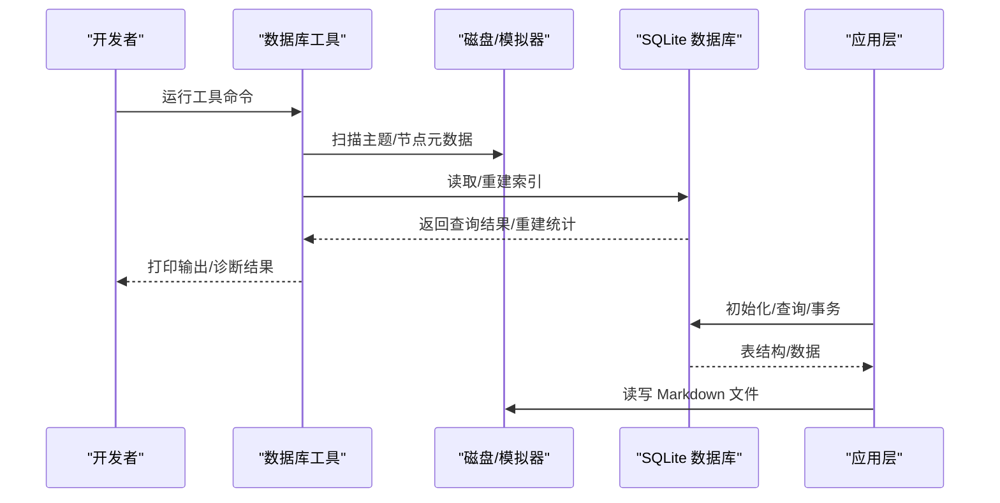
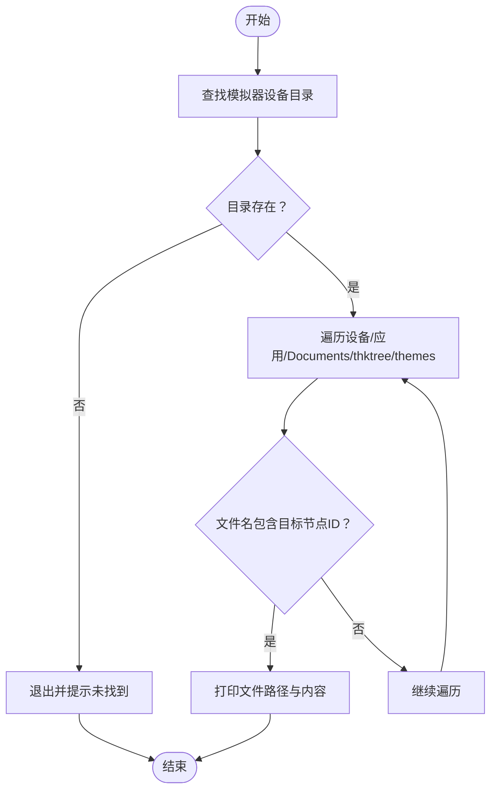
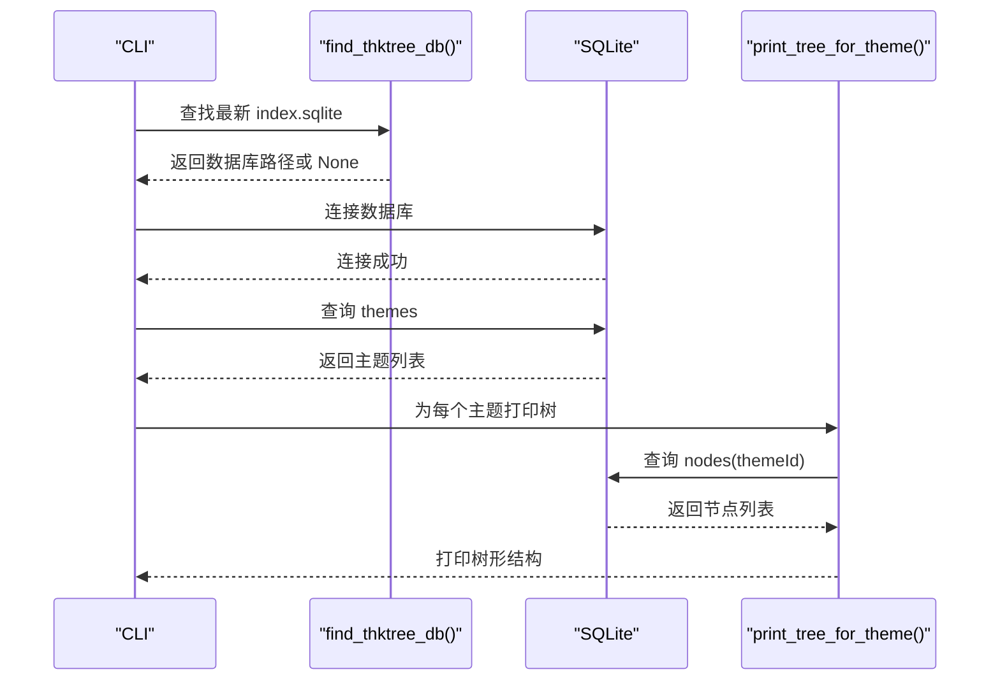
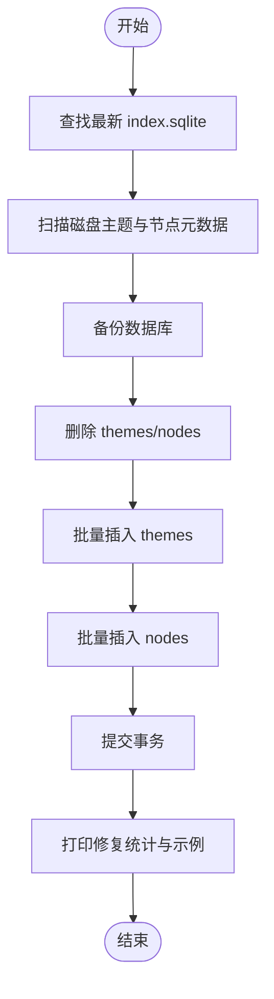
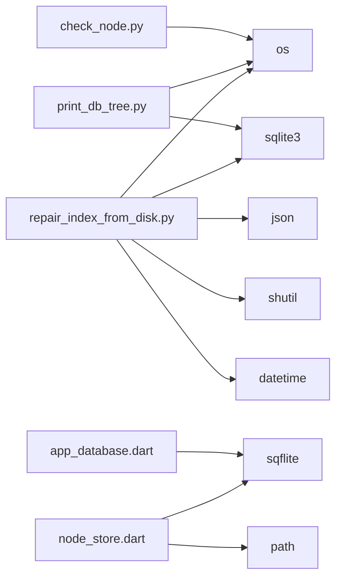

# 数据库工具

<cite>
**本文引用的文件**
- [check_node.py](file://tools/check_node.py)
- [print_db_tree.py](file://tools/print_db_tree.py)
- [repair_index_from_disk.py](file://tools/repair_index_from_disk.py)
- [app_database.dart](file://lib/data/services/app_database.dart)
- [node_store.dart](file://lib/data/stores/node_store.dart)
- [storage-format.md](file://docs/storage-format.md)
- [REQUIREMENTS.md](file://REQUIREMENTS.md)
</cite>

## 目录
1. [简介](#简介)
2. [项目结构](#项目结构)
3. [核心组件](#核心组件)
4. [架构概览](#架构概览)
5. [详细组件分析](#详细组件分析)
6. [依赖分析](#依赖分析)
7. [性能考量](#性能考量)
8. [故障排查指南](#故障排查指南)
9. [结论](#结论)
10. [附录](#附录)

## 简介
本文件面向 ThkTree 的数据库工具，系统性梳理以下三类工具：
- 数据库检查工具：用于定位并核验特定节点的完整性与一致性
- 数据库树形结构打印工具：用于可视化数据库结构、节点关系与数据完整性
- 数据库索引修复工具：用于从磁盘重建 SQLite 索引，确保索引与实际数据一致

文档将从架构、数据流、处理逻辑、集成点、错误处理与性能优化等方面进行深入分析，并提供使用示例、命令行参数说明、输出格式解读、常见问题诊断与解决方案，以及在开发与维护流程中的最佳实践。

## 项目结构
ThkTree 的数据库工具位于 tools 目录，配合 Flutter 应用侧的数据库服务与存储契约文档共同构成完整的数据层。关键文件与职责如下：
- tools/check_node.py：在 iOS 模拟器沙盒中查找并打印指定节点的会话文件内容，辅助快速定位问题
- tools/print_db_tree.py：扫描 iOS 模拟器中的 SQLite 数据库，打印主题与节点树形结构，验证路径解析与关系一致性
- tools/repair_index_from_disk.py：从磁盘扫描主题与节点元数据，重建 SQLite 索引，提供备份与统计输出
- lib/data/services/app_database.dart：应用侧 SQLite 初始化与表结构定义（themes、nodes）
- lib/data/stores/node_store.dart：应用侧节点索引重建逻辑（基于磁盘扫描）
- docs/storage-format.md：磁盘与 SQLite 存储契约（权威），定义了目录结构、元数据文件、会话文件、索引重建流程与一致性要求
- REQUIREMENTS.md：产品需求与范围，强调 SQLite 为可重建索引，正文真相源为 Markdown 文件

图表来源
- [check_node.py:1-46](file://tools/check_node.py#L1-L46)
- [print_db_tree.py:1-150](file://tools/print_db_tree.py#L1-L150)
- [repair_index_from_disk.py:1-183](file://tools/repair_index_from_disk.py#L1-L183)
- [app_database.dart:1-46](file://lib/data/services/app_database.dart#L1-L46)
- [node_store.dart:1-273](file://lib/data/stores/node_store.dart#L1-L273)
- [storage-format.md:1-350](file://docs/storage-format.md#L1-L350)
- [REQUIREMENTS.md:1-299](file://REQUIREMENTS.md#L1-L299)

章节来源
- [REQUIREMENTS.md:1-299](file://REQUIREMENTS.md#L1-L299)
- [storage-format.md:1-350](file://docs/storage-format.md#L1-L350)

## 核心组件
本节对三个数据库工具进行功能与实现要点的深入分析，涵盖控制流、数据结构、错误处理与性能特征。

- 数据库检查工具（check_node.py）
  - 功能：在 iOS 模拟器沙盒中递归搜索主题目录，定位包含目标节点 ID 的会话文件（session.md），并打印文件内容
  - 关键流程：遍历模拟器设备目录 → 查找应用 Documents/thktree/themes → 递归搜索包含目标节点 ID 的 session.md → 打印文件内容
  - 适用场景：快速定位节点文件是否存在、内容是否正确、路径是否包含目标节点 ID
  - 注意事项：依赖目标节点 ID 与文件路径匹配，适合小范围定位

- 数据库树形结构打印工具（print_db_tree.py）
  - 功能：自动发现最新 SQLite 数据库，查询 themes 与 nodes 表，构建父子关系映射，打印树形结构；同时验证路径解析与会话文件存在性
  - 关键流程：查找 index.sqlite → 连接数据库 → 查询 themes → 为每个主题查询 nodes → 构建 id-to-node 与 parent-to-children 映射 → 递归打印树
  - 输出：主题列表、主题路径解析结果、每个主题下的节点树（包含父节点、类型、路径、会话文件存在性等）
  - 适用场景：整体验证数据库结构与路径一致性、排查缺失会话文件、核对父子关系

- 数据库索引修复工具（repair_index_from_disk.py）
  - 功能：扫描磁盘主题与节点元数据，重建 SQLite themes 与 nodes 表，提供备份与统计输出
  - 关键流程：查找最新 index.sqlite → 扫描 themes/*/theme.meta.json → 扫描 nodes/*/node.meta.json → 删除并重建 themes/nodes → 批量插入 → 提交事务
  - 输出：备份路径、重建的主题数与节点数、示例主题路径与节点路径
  - 适用场景：索引损坏、数据不一致、需要从磁盘完全重建索引

章节来源
- [check_node.py:1-46](file://tools/check_node.py#L1-L46)
- [print_db_tree.py:1-150](file://tools/print_db_tree.py#L1-L150)
- [repair_index_from_disk.py:1-183](file://tools/repair_index_from_disk.py#L1-L183)

## 架构概览
数据库工具与应用层的关系如下：
- 工具层负责从磁盘与模拟器环境采集数据，执行检查与重建
- 应用层负责 SQLite 初始化与表结构定义，提供应用侧的索引重建逻辑
- 存储契约文档定义了磁盘与 SQLite 的权威规范，确保工具与应用的一致性

图表来源
- [repair_index_from_disk.py:119-162](file://tools/repair_index_from_disk.py#L119-L162)
- [print_db_tree.py:39-75](file://tools/print_db_tree.py#L39-L75)
- [app_database.dart:20-46](file://lib/data/services/app_database.dart#L20-L46)

## 详细组件分析

### 数据库检查工具（check_node.py）
- 目标：快速定位并核验指定节点的会话文件
- 使用方式
  - 直接运行：脚本会自动在模拟器沙盒中搜索目标节点 ID 的会话文件并打印内容
  - 参数：无命令行参数，目标节点 ID 在脚本内部硬编码
- 输出解读
  - 找到文件：打印文件路径与内容边界标记，便于核对内容
  - 未找到：提示未找到
- 适用场景
  - 节点内容异常、路径不一致、会话文件缺失或被意外修改
- 注意事项
  - 目标节点 ID 需与磁盘路径中的节点 ID 匹配
  - 仅适用于模拟器沙盒环境

图表来源
- [check_node.py:6-45](file://tools/check_node.py#L6-L45)

章节来源
- [check_node.py:1-46](file://tools/check_node.py#L1-L46)

### 数据库树形结构打印工具（print_db_tree.py）
- 目标：可视化数据库结构，验证路径解析与会话文件存在性
- 使用方式
  - 自动模式：无需参数，自动在模拟器中查找最新 index.sqlite 并打印
  - 手动模式：传入数据库路径，直接连接并打印
- 命令行参数
  - 可选：数据库路径（绝对或相对路径，支持 ~ 展开）
- 输出格式
  - 主题列表与路径解析
  - 每个主题下的节点树：标题、父节点、类型、原始路径、解析后路径、会话文件存在性
- 适用场景
  - 整体核对数据库结构、路径解析是否正确、会话文件是否存在
- 错误处理
  - 未找到数据库：提示自动查找失败并指导手动传参
  - 路径解析：支持绝对/相对路径，自动规范化

图表来源
- [print_db_tree.py:7-36](file://tools/print_db_tree.py#L7-L36)
- [print_db_tree.py:39-75](file://tools/print_db_tree.py#L39-L75)
- [print_db_tree.py:86-141](file://tools/print_db_tree.py#L86-L141)

章节来源
- [print_db_tree.py:1-150](file://tools/print_db_tree.py#L1-L150)

### 数据库索引修复工具（repair_index_from_disk.py）
- 目标：从磁盘扫描主题与节点元数据，重建 SQLite 索引，确保索引与实际数据一致
- 使用方式
  - 自动模式：自动在模拟器中查找最新 index.sqlite 并修复
  - 手动模式：通过备份与统计输出确认修复结果
- 命令行参数：无
- 输出解读
  - 修复完成、数据库路径、备份路径、重建的主题数与节点数
  - 示例主题路径与节点路径（前五条）
- 工作原理
  - 查找最新数据库 → 扫描磁盘主题与节点元数据 → 删除并重建 themes/nodes 表 → 批量插入 → 提交事务
  - 扫描顺序：按创建时间排序，优先使用最新数据库
- 适用场景
  - 索引损坏、数据不一致、需要从磁盘完全重建索引
- 错误处理
  - 未找到数据库：抛出系统退出
  - 元数据解析异常：跳过并打印跳过原因
  - 事务：使用 BEGIN IMMEDIATE，确保原子性

图表来源
- [repair_index_from_disk.py:9-26](file://tools/repair_index_from_disk.py#L9-L26)
- [repair_index_from_disk.py:119-162](file://tools/repair_index_from_disk.py#L119-L162)

章节来源
- [repair_index_from_disk.py:1-183](file://tools/repair_index_from_disk.py#L1-L183)

### 应用层索引重建逻辑（对比参考）
- 应用层通过 NodeStore 提供按主题重建节点索引的能力，与工具层的全量重建形成互补
- 关键点
  - 事务：使用数据库事务保证一致性
  - 清理策略：删除主题下不在磁盘中的节点，保留磁盘中存在但索引缺失的节点
  - 依赖存储契约：严格遵循磁盘与 SQLite 的权威规范

章节来源
- [node_store.dart:18-38](file://lib/data/stores/node_store.dart#L18-L38)
- [storage-format.md:324-341](file://docs/storage-format.md#L324-L341)

## 依赖分析
- 工具层依赖
  - Python 标准库：os、sqlite3、json、shutil、datetime
  - iOS 模拟器沙盒路径约定：~/Library/Developer/CoreSimulator/Devices
- 应用层依赖
  - sqflite：SQLite 数据库操作
  - path_provider：路径管理
- 存储契约
  - SQLite 表结构：themes、nodes
  - 磁盘目录结构：themes/{themeId}/、nodes/{nodeId}/、index.sqlite
  - 元数据文件：theme.meta.json、node.meta.json
  - 会话文件：session.md、context-summary.md

图表来源
- [check_node.py:1-10](file://tools/check_node.py#L1-L10)
- [print_db_tree.py:1-5](file://tools/print_db_tree.py#L1-L5)
- [repair_index_from_disk.py:1-7](file://tools/repair_index_from_disk.py#L1-L7)
- [app_database.dart:1-10](file://lib/data/services/app_database.dart#L1-L10)
- [node_store.dart:1-10](file://lib/data/stores/node_store.dart#L1-L10)

章节来源
- [app_database.dart:1-46](file://lib/data/services/app_database.dart#L1-L46)
- [node_store.dart:1-273](file://lib/data/stores/node_store.dart#L1-L273)
- [storage-format.md:1-350](file://docs/storage-format.md#L1-L350)

## 性能考量
- 工具层
  - 遍历模拟器设备与应用目录：I/O 密集，建议在本地开发机上运行
  - print_db_tree：一次性查询所有节点并构建父子映射，内存占用与节点数量近似线性
  - repair_index_from_disk：批量插入，使用事务减少提交次数，提升性能
- 应用层
  - NodeStore 的重建逻辑在事务中执行，避免频繁提交
  - 通过清理不在磁盘中的节点，减少无效索引占用空间

章节来源
- [print_db_tree.py:86-141](file://tools/print_db_tree.py#L86-L141)
- [repair_index_from_disk.py:119-162](file://tools/repair_index_from_disk.py#L119-L162)
- [node_store.dart:18-38](file://lib/data/stores/node_store.dart#L18-L38)

## 故障排查指南
- 常见问题与诊断
  - 未找到 index.sqlite：检查模拟器设备目录是否存在，确认应用 Documents/thktree/index.sqlite 路径
  - 路径解析失败：确认 themePath/nodePath 是否为相对路径，resolve_path 会将其规范化为绝对路径
  - 会话文件不存在：打印树形结构时会显示 sessionExists 标志，定位缺失文件
  - 元数据解析异常：repair_index_from_disk 会跳过异常的 node.meta.json 或 theme.meta.json，并打印跳过原因
  - 索引不一致：使用 repair_index_from_disk 从磁盘重建索引，并检查备份文件
- 解决方案
  - 使用 print_db_tree 核对主题与节点树，定位缺失或异常节点
  - 使用 repair_index_from_disk 完全重建索引，确保 SQLite 与磁盘一致
  - 使用 check_node.py 快速定位特定节点的会话文件内容

章节来源
- [print_db_tree.py:78-141](file://tools/print_db_tree.py#L78-L141)
- [repair_index_from_disk.py:49-57](file://tools/repair_index_from_disk.py#L49-L57)
- [check_node.py:33-38](file://tools/check_node.py#L33-L38)

## 结论
ThkTree 的数据库工具提供了从磁盘到 SQLite 的完整检查与修复能力：
- check_node.py：快速定位节点会话文件，辅助内容核验
- print_db_tree.py：可视化数据库结构，验证路径解析与会话文件存在性
- repair_index_from_disk.py：从磁盘重建索引，确保 SQLite 与真相源一致

结合应用层的索引重建逻辑与存储契约文档，这些工具在开发与维护流程中能够有效保障数据一致性与可维护性。

## 附录

### 使用示例与命令行参数
- check_node.py
  - 用法：直接运行脚本，目标节点 ID 在脚本内部定义
  - 输出：找到文件时打印路径与内容边界，未找到时提示未找到
- print_db_tree.py
  - 用法：python3 tools/print_db_tree.py 或 python3 tools/print_db_tree.py <db_path>
  - 输出：主题列表、路径解析、树形结构（含父节点、类型、路径、会话文件存在性）
- repair_index_from_disk.py
  - 用法：python3 tools/repair_index_from_disk.py
  - 输出：修复完成、数据库路径、备份路径、重建的主题数与节点数、示例路径

章节来源
- [check_node.py:1-46](file://tools/check_node.py#L1-L46)
- [print_db_tree.py:143-150](file://tools/print_db_tree.py#L143-L150)
- [repair_index_from_disk.py:165-182](file://tools/repair_index_from_disk.py#L165-L182)

### 数据模型与表结构
- themes 表
  - 字段：themeId（主键）、title、createdAt、updatedAt、themePath
- nodes 表
  - 字段：nodeId（主键）、themeId、parentId、kind、title、createdAt、updatedAt、nodePath、sessionPath、contextSummaryPath
- 索引
  - idx_nodes_theme_parent(themeId, parentId)

章节来源
- [app_database.dart:20-46](file://lib/data/services/app_database.dart#L20-L46)

### 存储契约与一致性要求
- 磁盘为真相源：Markdown 文件为正文真相源，SQLite 仅做索引与检索
- 一致性要求：同一流水线消息 ID 不允许出现在不同节点/主题；流式与错误态块也必须可解析
- 索引重建：必须支持全量重建，扫描主题与节点元数据，解析会话与笔记，写入索引

章节来源
- [storage-format.md:292-341](file://docs/storage-format.md#L292-L341)