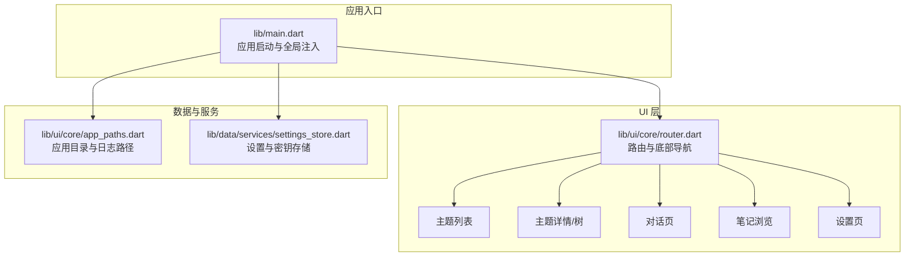
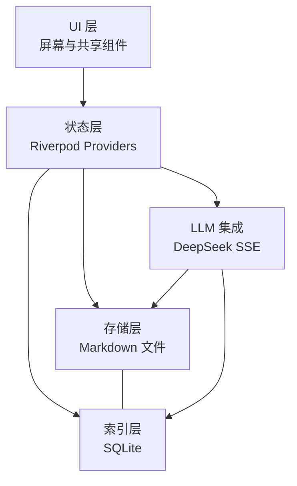
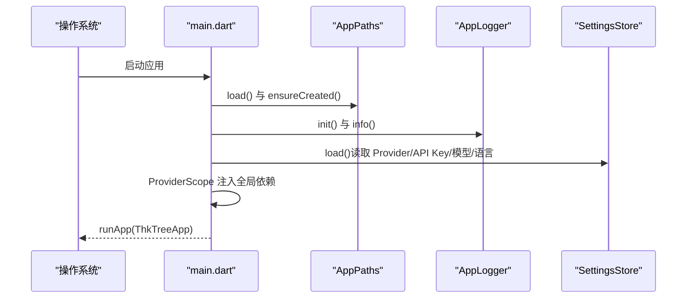
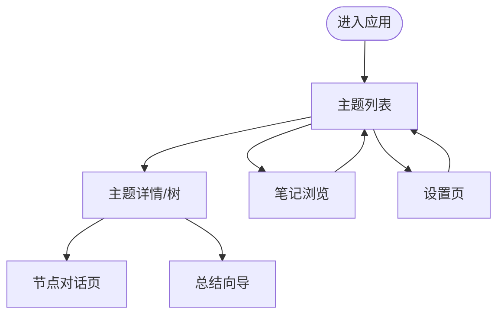
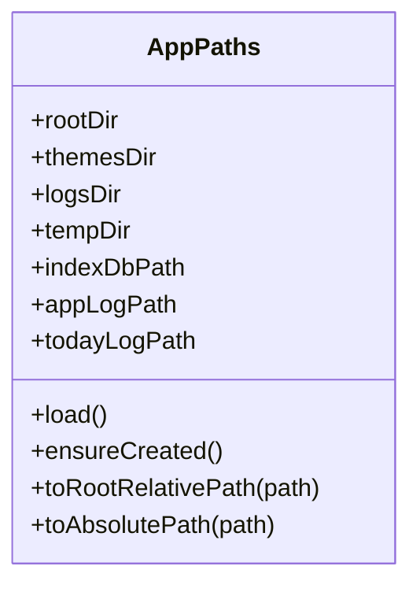
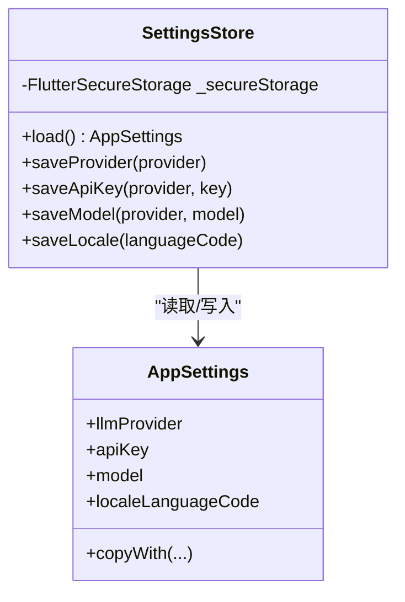
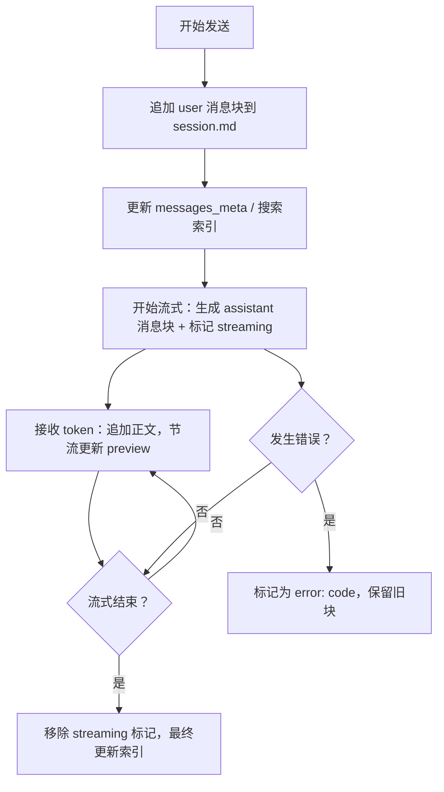

# 快速开始

<cite>
**本文引用的文件**
- [README.md](file://README.md)
- [REQUIREMENTS.md](file://REQUIREMENTS.md)
- [pubspec.yaml](file://pubspec.yaml)
- [analysis_options.yaml](file://analysis_options.yaml)
- [l10n.yaml](file://l10n.yaml)
- [lib/main.dart](file://lib/main.dart)
- [lib/ui/core/router.dart](file://lib/ui/core/router.dart)
- [lib/ui/core/app_paths.dart](file://lib/ui/core/app_paths.dart)
- [lib/data/services/settings_store.dart](file://lib/data/services/settings_store.dart)
- [docs/design.md](file://docs/design.md)
- [docs/storage-format.md](file://docs/storage-format.md)
- [android/app/src/main/kotlin/com/thktree/thk_tree/MainActivity.kt](file://android/app/src/main/kotlin/com/thktree/thk_tree/MainActivity.kt)
- [ios/Runner/AppDelegate.swift](file://ios/Runner/AppDelegate.swift)
</cite>

## 目录
1. [简介](#简介)
2. [项目结构](#项目结构)
3. [核心组件](#核心组件)
4. [架构总览](#架构总览)
5. [详细组件分析](#详细组件分析)
6. [依赖分析](#依赖分析)
7. [性能注意事项](#性能注意事项)
8. [故障排除指南](#故障排除指南)
9. [结论](#结论)
10. [附录](#附录)

## 简介
ThkTree 是一款基于 Flutter 的本地优先树形 LLM 对话应用，围绕“主题（Theme）—会话树（Session Tree）—节点（Node）—对话（Chat）”组织知识，支持：
- 多主题与树形会话节点
- 流式对话与本地 Markdown 存储
- 笔记（Note）与对话联动
- 祖先上下文总结（Context Summary）控制上下文长度
- 本地 SQLite 索引与可重建机制

本快速开始将带你完成环境准备、项目克隆、依赖安装、构建与运行，并提供创建第一个主题、开始对话、管理笔记等基础操作指引。

## 项目结构
ThkTree 采用 Flutter 工程标准目录，结合领域驱动的模块化组织：
- lib/domain：领域模型与 ID/错误定义（按设计文档建议划分）
- lib/data：数据服务与设置存储（安全存储、LLM Provider）
- lib/ui：界面与路由（屏幕、共享组件、路由）
- android/ 与 ios/：原生集成与构建配置
- docs/：设计与存储契约文档
- test/：单元与 UI 测试
- tools/：辅助脚本（数据库修复、索引修复等）

图表来源
- [lib/main.dart:15-59](file://lib/main.dart#L15-L59)
- [lib/ui/core/router.dart:18-87](file://lib/ui/core/router.dart#L18-L87)
- [lib/ui/core/app_paths.dart:29-45](file://lib/ui/core/app_paths.dart#L29-L45)
- [lib/data/services/settings_store.dart:106-184](file://lib/data/services/settings_store.dart#L106-L184)

章节来源
- [README.md:1-18](file://README.md#L1-L18)
- [REQUIREMENTS.md:12-30](file://REQUIREMENTS.md#L12-L30)
- [docs/design.md:20-46](file://docs/design.md#L20-L46)

## 核心组件
- 应用入口与全局注入：初始化路径、日志、错误处理、安全存储与设置加载，并注入全局 Provider。
- 路由与导航：使用 go_router 实现主壳与分支导航，底部导航切换主题与笔记。
- 路径与日志：统一管理应用数据根目录、主题目录、日志目录与临时目录。
- 设置与密钥：集中管理 LLM Provider、API Key、模型名与语言偏好，使用安全存储。

章节来源
- [lib/main.dart:15-59](file://lib/main.dart#L15-L59)
- [lib/ui/core/router.dart:18-87](file://lib/ui/core/router.dart#L18-L87)
- [lib/ui/core/app_paths.dart:29-60](file://lib/ui/core/app_paths.dart#L29-L60)
- [lib/data/services/settings_store.dart:106-184](file://lib/data/services/settings_store.dart#L106-L184)

## 架构总览
ThkTree 采用“本地优先 + 流式写入 + 可重建索引”的架构：
- 数据真相源为 Markdown 文件（主题、节点、笔记、上下文总结）
- SQLite 仅作索引与检索加速，可随时重建
- 写入遵循单写者契约，流式中间态与错误态具备可恢复性
- UI 使用 Riverpod 管理状态，go_router 负责导航

图表来源
- [docs/design.md:41-45](file://docs/design.md#L41-L45)
- [docs/design.md:93-108](file://docs/design.md#L93-L108)
- [docs/design.md:141-153](file://docs/design.md#L141-L153)

## 详细组件分析

### 组件 A：应用启动与全局配置
- 初始化 WidgetsFlutterBinding
- 加载应用路径并确保目录存在
- 初始化远程日志（可选），注册 FlutterError 与 PlatformDispatcher 错误回调
- 加载安全存储中的设置（Provider、API Key、模型、语言）
- 注入全局 Provider（路径、日志、语言）

图表来源
- [lib/main.dart:15-59](file://lib/main.dart#L15-L59)
- [lib/ui/core/app_paths.dart:29-60](file://lib/ui/core/app_paths.dart#L29-L60)
- [lib/data/services/settings_store.dart:117-156](file://lib/data/services/settings_store.dart#L117-L156)

章节来源
- [lib/main.dart:15-59](file://lib/main.dart#L15-L59)

### 组件 B：路由与页面导航
- 使用 go_router 的 StatefulShellRoute 实现主壳与分支
- 主分支：主题列表、主题详情（树）、节点对话、总结向导
- 分支：笔记浏览
- 设置页为根导航
- 底部导航切换主题与笔记分支，并在切换时触笔记列表刷新

图表来源
- [lib/ui/core/router.dart:18-87](file://lib/ui/core/router.dart#L18-L87)

章节来源
- [lib/ui/core/router.dart:18-126](file://lib/ui/core/router.dart#L18-L126)

### 组件 C：路径与日志管理
- 统一应用数据根目录（Documents/thktree）
- 主题目录、日志目录、临时目录与 SQLite 索引路径
- 支持绝对/相对路径转换
- 日志文件按日期命名

图表来源
- [lib/ui/core/app_paths.dart:7-76](file://lib/ui/core/app_paths.dart#L7-L76)

章节来源
- [lib/ui/core/app_paths.dart:29-60](file://lib/ui/core/app_paths.dart#L29-L60)

### 组件 D：设置与密钥存储
- 支持多种 LLM Provider（DeepSeek、OpenAI、Claude、Gemini、Minimax、Kimi）
- API Key 与模型名分别存储，按 Provider 区分
- 语言偏好存储于安全存储
- 提供加载、保存 Provider、API Key、模型与语言的方法

图表来源
- [lib/data/services/settings_store.dart:106-184](file://lib/data/services/settings_store.dart#L106-L184)

章节来源
- [lib/data/services/settings_store.dart:106-184](file://lib/data/services/settings_store.dart#L106-L184)

### 组件 E：存储契约与流式写入
- 存储真相源：Markdown 文件（主题、节点、笔记、上下文总结）
- SQLite 仅作索引，可随时重建
- 单写者契约：同一节点同时仅一个写入流程
- 流式中间态与错误态具备可恢复性
- 消息块标题行包含角色、时间戳与消息 ID

图表来源
- [docs/design.md:61-90](file://docs/design.md#L61-L90)
- [docs/storage-format.md:122-221](file://docs/storage-format.md#L122-L221)

章节来源
- [docs/design.md:49-90](file://docs/design.md#L49-L90)
- [docs/storage-format.md:122-221](file://docs/storage-format.md#L122-L221)

## 依赖分析
- Flutter SDK：3.12.0
- 状态管理：flutter_riverpod
- 路由：go_router
- HTTP：dio
- 安全存储：flutter_secure_storage
- 文件系统：path、path_provider
- 数据库：sqflite
- ID：ulid
- 国际化：flutter_localizations、intl
- Markdown：flutter_markdown
- 代码规范：flutter_lints

章节来源
- [pubspec.yaml:21-49](file://pubspec.yaml#L21-L49)

## 性能注意事项
- 列表预览：使用 SQLite messages_meta 避免全文解析
- 流式写入：节流更新 preview，减少频繁索引写入
- 单写者：避免并发写入导致的文件损坏与索引不一致
- 重建索引：提供磁盘扫描重建能力，保证索引与磁盘一致

章节来源
- [docs/design.md:93-108](file://docs/design.md#L93-L108)
- [docs/design.md:111-123](file://docs/design.md#L111-L123)

## 故障排除指南
- 无法找到 Flutter SDK 或版本不匹配
  - 确认已安装 Flutter SDK 3.12.0
  - 使用 flutter doctor 检查环境
- 依赖安装失败
  - 清理缓存并重装依赖：flutter pub cache repair
  - 确保 pubspec.yaml 中依赖版本与环境匹配
- iOS 构建失败
  - 确认 Xcode 已安装并可运行
  - 执行 pod install（在 ios/Runner 目录）
  - 检查 Bundle Identifier 与签名配置
- Android 构建失败
  - 确认 Android Studio 与 Gradle 配置
  - 检查 local.properties 中 SDK 路径
- 运行时报错：找不到 index.sqlite 或索引异常
  - 在设置页触发“重建索引”或通过工具脚本修复
- 流式对话中断或消息块处于 streaming 状态
  - 重启应用或进入节点后选择“重试/继续生成”
- API Key 无效或网络错误
  - 在设置页检查 API Key 与模型名
  - 确认网络连通与代理设置

章节来源
- [REQUIREMENTS.md:199-208](file://REQUIREMENTS.md#L199-L208)
- [docs/design.md:111-123](file://docs/design.md#L111-L123)
- [tools/migrate_to_tree.py](file://tools/migrate_to_tree.py)
- [tools/repair_index_from_disk.py](file://tools/repair_index_from_disk.py)

## 结论
通过本快速开始，你已完成 ThkTree 的环境准备、项目构建与运行，并掌握了创建主题、开始对话、管理笔记与设置密钥的基础操作。建议进一步阅读设计文档与存储契约，理解单写者、流式中间态与可重建索引等关键机制，以便在后续开发中高效迭代。

## 附录

### A. 环境配置步骤
- 安装 Flutter SDK（版本 3.12.0）
- 安装 Android Studio 与 Xcode（iOS 开发）
- 配置 Android SDK 与 iOS 模拟器/真机
- 安装依赖：flutter pub get
- iOS：cd ios && pod install
- 运行：flutter run

章节来源
- [pubspec.yaml:21-23](file://pubspec.yaml#L21-L23)
- [REQUIREMENTS.md:7-8](file://REQUIREMENTS.md#L7-L8)

### B. 项目克隆与初始化
- 克隆仓库后，执行依赖安装与 iOS pods 安装
- 首次运行会初始化应用目录（Documents/thktree）与日志目录

章节来源
- [lib/ui/core/app_paths.dart:29-45](file://lib/ui/core/app_paths.dart#L29-L45)
- [lib/main.dart:18-19](file://lib/main.dart#L18-L19)

### C. 基本使用教程
- 创建第一个主题
  - 打开主题列表，新建主题
  - 进入主题后查看树形结构
- 开始对话
  - 在主题详情中选择或新建节点
  - 在对话页输入消息，点击发送
  - 查看流式回复与消息块状态
- 管理笔记
  - 在对话中选择文本创建笔记
  - 在笔记列表查看与编辑
  - 从笔记发起新对话或插入当前对话

章节来源
- [REQUIREMENTS.md:182-196](file://REQUIREMENTS.md#L182-L196)
- [REQUIREMENTS.md:100-150](file://REQUIREMENTS.md#L100-L150)

### D. 原生集成要点
- Android：MainActivity 继承 FlutterActivity
- iOS：AppDelegate 实现 FlutterImplicitEngineDelegate 并注册插件

章节来源
- [android/app/src/main/kotlin/com/thktree/thk_tree/MainActivity.kt:1-6](file://android/app/src/main/kotlin/com/thktree/thk_tree/MainActivity.kt#L1-L6)
- [ios/Runner/AppDelegate.swift:1-17](file://ios/Runner/AppDelegate.swift#L1-L17)