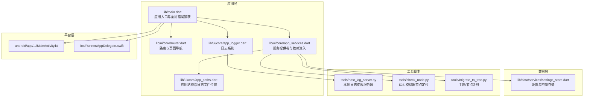
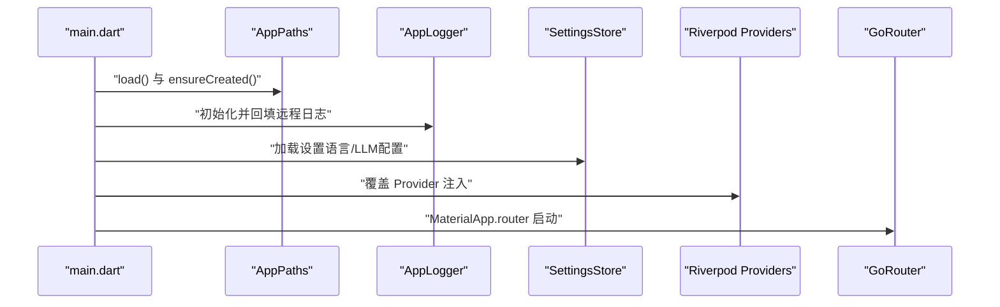
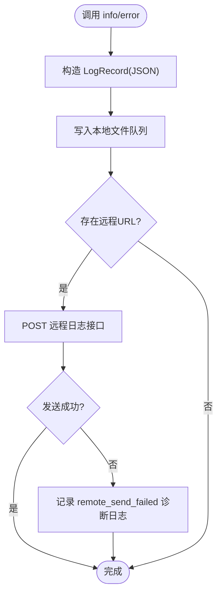
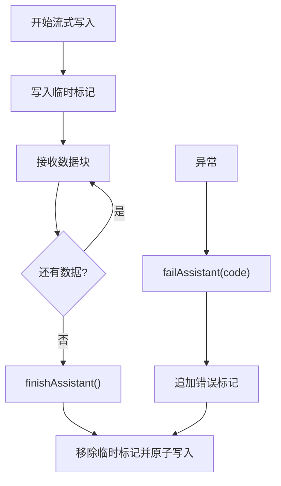
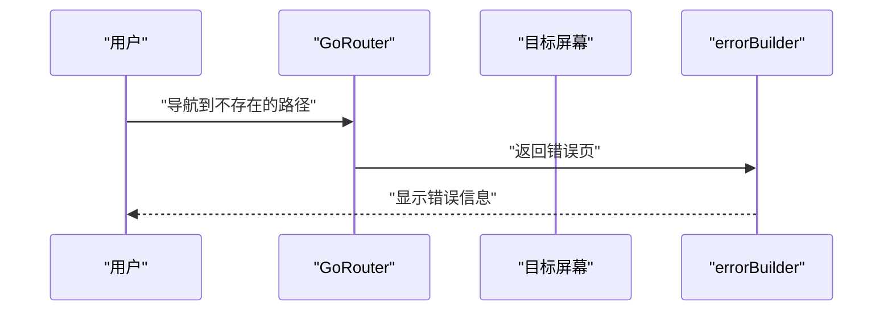
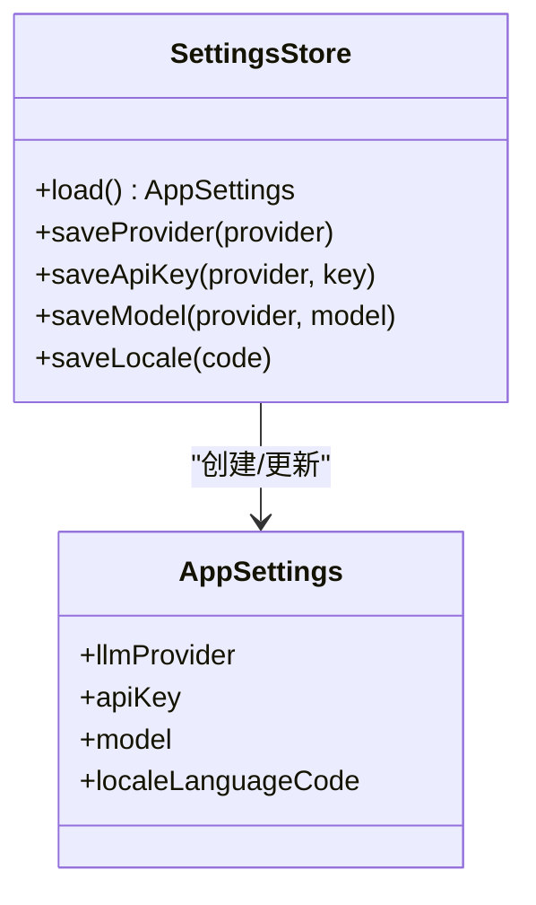
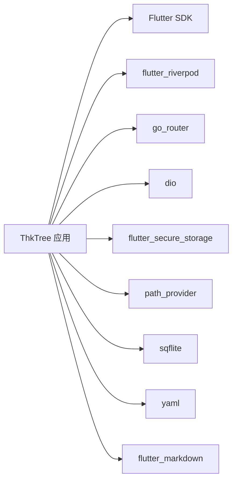

# 故障排除和调试

<cite>
**本文引用的文件**
- [README.md](file://README.md)
- [pubspec.yaml](file://pubspec.yaml)
- [analysis_options.yaml](file://analysis_options.yaml)
- [lib/main.dart](file://lib/main.dart)
- [lib/ui/core/app_logger.dart](file://lib/ui/core/app_logger.dart)
- [lib/ui/core/app_paths.dart](file://lib/ui/core/app_paths.dart)
- [lib/ui/core/app_services.dart](file://lib/ui/core/app_services.dart)
- [lib/ui/core/router.dart](file://lib/ui/core/router.dart)
- [lib/data/services/settings_store.dart](file://lib/data/services/settings_store.dart)
- [android/app/src/main/kotlin/com/thktree/thk_tree/MainActivity.kt](file://android/app/src/main/kotlin/com/thktree/thk_tree/MainActivity.kt)
- [ios/Runner/AppDelegate.swift](file://ios/Runner/AppDelegate.swift)
- [tools/host_log_server.py](file://tools/host_log_server.py)
- [tools/check_node.py](file://tools/check_node.py)
- [tools/migrate_to_tree.py](file://tools/migrate_to_tree.py)
- [test/widget_test.dart](file://test/widget_test.dart)
- [REQUIREMENTS.md](file://REQUIREMENTS.md)
</cite>

## 目录
1. [简介](#简介)
2. [项目结构](#项目结构)
3. [核心组件](#核心组件)
4. [架构总览](#架构总览)
5. [详细组件分析](#详细组件分析)
6. [依赖分析](#依赖分析)
7. [性能考量](#性能考量)
8. [故障排除指南](#故障排除指南)
9. [结论](#结论)
10. [附录](#附录)

## 简介
本指南面向 ThkTree 的开发者与运维人员，提供从开发到生产的全链路故障排除与调试方法。内容覆盖构建失败、运行时错误、性能问题、日志与远程日志回填、内存泄漏检测、错误处理与异常恢复、依赖与配置问题排查、生产监控与诊断、用户反馈收集、紧急问题响应流程以及预防性维护与健康检查最佳实践。

## 项目结构
ThkTree 是一个基于 Flutter 的应用，采用 Riverpod 管理状态、go_router 路由、sqflite 数据库、flutter_secure_storage 安全存储、dio 进行 HTTP 访问，并通过自研日志系统记录运行信息。工具脚本用于本地日志接收、节点定位与迁移。

**图表来源**
- [lib/main.dart:15-59](file://lib/main.dart#L15-L59)
- [lib/ui/core/router.dart:18-87](file://lib/ui/core/router.dart#L18-L87)
- [lib/ui/core/app_services.dart:27-169](file://lib/ui/core/app_services.dart#L27-L169)
- [lib/ui/core/app_logger.dart:63-197](file://lib/ui/core/app_logger.dart#L63-L197)
- [lib/ui/core/app_paths.dart:29-75](file://lib/ui/core/app_paths.dart#L29-L75)
- [lib/data/services/settings_store.dart:106-184](file://lib/data/services/settings_store.dart#L106-L184)
- [android/app/src/main/kotlin/com/thktree/thk_tree/MainActivity.kt:1-6](file://android/app/src/main/kotlin/com/thktree/thk_tree/MainActivity.kt#L1-L6)
- [ios/Runner/AppDelegate.swift:1-17](file://ios/Runner/AppDelegate.swift#L1-L17)
- [tools/host_log_server.py:75-89](file://tools/host_log_server.py#L75-L89)
- [tools/check_node.py:1-46](file://tools/check_node.py#L1-L46)
- [tools/migrate_to_tree.py:132-165](file://tools/migrate_to_tree.py#L132-L165)

**章节来源**
- [lib/main.dart:15-59](file://lib/main.dart#L15-L59)
- [lib/ui/core/router.dart:18-87](file://lib/ui/core/router.dart#L18-L87)
- [lib/ui/core/app_services.dart:27-169](file://lib/ui/core/app_services.dart#L27-L169)
- [lib/ui/core/app_logger.dart:63-197](file://lib/ui/core/app_logger.dart#L63-L197)
- [lib/ui/core/app_paths.dart:29-75](file://lib/ui/core/app_paths.dart#L29-L75)
- [lib/data/services/settings_store.dart:106-184](file://lib/data/services/settings_store.dart#L106-L184)
- [android/app/src/main/kotlin/com/thktree/thk_tree/MainActivity.kt:1-6](file://android/app/src/main/kotlin/com/thktree/thk_tree/MainActivity.kt#L1-L6)
- [ios/Runner/AppDelegate.swift:1-17](file://ios/Runner/AppDelegate.swift#L1-L17)
- [tools/host_log_server.py:75-89](file://tools/host_log_server.py#L75-L89)
- [tools/check_node.py:1-46](file://tools/check_node.py#L1-L46)
- [tools/migrate_to_tree.py:132-165](file://tools/migrate_to_tree.py#L132-L165)

## 核心组件
- 应用入口与全局错误捕获：负责初始化路径、日志、设置加载、国际化与全局错误回调。
- 日志系统：本地 JSON 行式日志，支持远程回填与敏感信息脱敏。
- 路由系统：基于 go_router 的 Shell 分支路由，支持错误页展示。
- 服务提供者：Riverpod 提供数据库、日志、主题/节点/会话存储、LLM 客户端、设置等。
- 设置与密钥：安全存储 API Key 与模型配置，支持语言切换。
- 平台入口：Android MainActivity、iOS AppDelegate。
- 工具脚本：本地日志接收、iOS 节点定位、主题/节点迁移。

**章节来源**
- [lib/main.dart:15-59](file://lib/main.dart#L15-L59)
- [lib/ui/core/app_logger.dart:63-197](file://lib/ui/core/app_logger.dart#L63-L197)
- [lib/ui/core/router.dart:18-87](file://lib/ui/core/router.dart#L18-L87)
- [lib/ui/core/app_services.dart:27-169](file://lib/ui/core/app_services.dart#L27-L169)
- [lib/data/services/settings_store.dart:106-184](file://lib/data/services/settings_store.dart#L106-L184)
- [android/app/src/main/kotlin/com/thktree/thk_tree/MainActivity.kt:1-6](file://android/app/src/main/kotlin/com/thktree/thk_tree/MainActivity.kt#L1-L6)
- [ios/Runner/AppDelegate.swift:1-17](file://ios/Runner/AppDelegate.swift#L1-L17)

## 架构总览
应用启动流程：入口初始化路径与日志，注册全局错误回调，加载设置，注入 Provider，构建路由与界面。

**图表来源**
- [lib/main.dart:15-59](file://lib/main.dart#L15-L59)
- [lib/ui/core/app_paths.dart:29-75](file://lib/ui/core/app_paths.dart#L29-L75)
- [lib/ui/core/app_logger.dart:74-100](file://lib/ui/core/app_logger.dart#L74-L100)
- [lib/data/services/settings_store.dart:117-156](file://lib/data/services/settings_store.dart#L117-L156)
- [lib/ui/core/app_services.dart:27-49](file://lib/ui/core/app_services.dart#L27-L49)
- [lib/ui/core/router.dart:67-91](file://lib/ui/core/router.dart#L67-L91)

## 详细组件分析

### 日志系统与远程回填
- 本地日志：每日日志文件，JSON 行式，包含时间戳、级别、消息、属性与错误堆栈。
- 远程回填：启动时从本地文件读取最近若干行，异步发送至远程地址。
- 错误回退：远程发送失败时记录诊断日志，避免影响主流程。
- 敏感信息脱敏：对 Bearer Token 进行掩码处理。

**图表来源**
- [lib/ui/core/app_logger.dart:102-196](file://lib/ui/core/app_logger.dart#L102-L196)

**章节来源**
- [lib/ui/core/app_logger.dart:63-197](file://lib/ui/core/app_logger.dart#L63-L197)

### 会话存储与流式写入
- 流式助手回复：写入临时标记，完成后清理标记并原子写入。
- 失败兜底：出现错误时追加错误标记，保证文件完整性。
- 写入队列：按节点 ID 串行化写入，避免并发冲突。

**图表来源**
- [lib/data/stores/session_store.dart:117-148](file://lib/data/stores/session_store.dart#L117-L148)

**章节来源**
- [lib/data/stores/session_store.dart:117-148](file://lib/data/stores/session_store.dart#L117-L148)

### 路由与错误页
- 使用 go_router 的 StatefulShellRoute 实现底部导航与分支路由。
- errorBuilder 中统一展示错误信息，便于排错。

**图表来源**
- [lib/ui/core/router.dart:18-87](file://lib/ui/core/router.dart#L18-L87)

**章节来源**
- [lib/ui/core/router.dart:18-87](file://lib/ui/core/router.dart#L18-L87)

### 设置与密钥存储
- 支持多 LLM 提供商与对应 API Key/模型配置。
- 使用 flutter_secure_storage 安全存储，键名区分提供商。

**图表来源**
- [lib/data/services/settings_store.dart:4-104](file://lib/data/services/settings_store.dart#L4-L104)
- [lib/data/services/settings_store.dart:106-184](file://lib/data/services/settings_store.dart#L106-L184)

**章节来源**
- [lib/data/services/settings_store.dart:106-184](file://lib/data/services/settings_store.dart#L106-L184)

### 平台入口
- Android：FlutterActivity 入口。
- iOS：AppDelegate，注册插件，委托引擎初始化。

**章节来源**
- [android/app/src/main/kotlin/com/thktree/thk_tree/MainActivity.kt:1-6](file://android/app/src/main/kotlin/com/thktree/thk_tree/MainActivity.kt#L1-L6)
- [ios/Runner/AppDelegate.swift:1-17](file://ios/Runner/AppDelegate.swift#L1-L17)

### 工具脚本
- 本地日志接收：提供 /health 健康检查与 POST 写入二进制日志，支持解析 JSON 并打印结构化日志。
- iOS 节点定位：遍历模拟器应用 Documents 目录，查找指定节点的 session.md 并打印内容。
- 主题/节点迁移：自动发现 iOS 模拟器中的主题目录与旧 DB，按父子关系移动节点并更新 DB。

**章节来源**
- [tools/host_log_server.py:15-89](file://tools/host_log_server.py#L15-L89)
- [tools/check_node.py:1-46](file://tools/check_node.py#L1-L46)
- [tools/migrate_to_tree.py:132-165](file://tools/migrate_to_tree.py#L132-L165)

## 依赖分析
- Flutter SDK 与核心包：Riverpod、go_router、dio、secure_storage、path_provider、sqflite、yaml、markdown 等。
- 开发依赖：flutter_lints。
- 路由与状态：go_router + Riverpod Provider。
- 数据持久化：sqflite + 本地 Markdown 文件。
- 安全存储：flutter_secure_storage。

**图表来源**
- [pubspec.yaml:30-49](file://pubspec.yaml#L30-L49)
- [pubspec.yaml:51-60](file://pubspec.yaml#L51-L60)

**章节来源**
- [pubspec.yaml:30-49](file://pubspec.yaml#L30-L49)
- [pubspec.yaml:51-60](file://pubspec.yaml#L51-L60)

## 性能考量
- 列表预览：使用 SQLite messages_meta 避免全文解析，降低渲染成本。
- 流式写入：单写者 + 临时标记 + 原子写入，减少锁争用与文件损坏风险。
- 日志异步：写队列与远程发送异步化，避免阻塞主线程。
- 路由与状态：合理拆分 Provider，避免不必要的重建。

**章节来源**
- [REQUIREMENTS.md:256-258](file://REQUIREMENTS.md#L256-L258)
- [lib/ui/core/app_logger.dart:155-164](file://lib/ui/core/app_logger.dart#L155-L164)
- [lib/data/stores/session_store.dart:117-148](file://lib/data/stores/session_store.dart#L117-L148)

## 故障排除指南

### 构建失败
- Flutter SDK 版本不匹配
  - 现象：编译报错或依赖解析失败。
  - 排查：确认 pubspec.yaml 中 SDK 版本与本地环境一致。
  - 参考：[pubspec.yaml:21-23](file://pubspec.yaml#L21-L23)
- 依赖冲突
  - 现象：flutter pub get 失败或版本冲突。
  - 排查：执行 flutter pub upgrade 或锁定版本，检查 dev_dependencies。
  - 参考：[pubspec.yaml:51-60](file://pubspec.yaml#L51-L60)
- Android 构建问题
  - 现象：Gradle 编译失败、签名或 Gradle 版本不兼容。
  - 排查：检查 local.properties、gradle/wrapper、gradle.properties；确保 Android SDK/NDK/Java 版本满足要求。
  - 参考：[android/app/build.gradle.kts](file://android/app/build.gradle.kts)、[android/gradle.properties](file://android/gradle.properties)
- iOS 构建问题
  - 现象：Xcode 构建失败、Pods 未安装或版本不兼容。
  - 排查：执行 pod install，确认 Podfile 与 Podfile.lock；检查 Runner 项目配置。
  - 参考：[ios/Podfile](file://ios/Podfile)、[ios/Podfile.lock](file://ios/Podfile.lock)

**章节来源**
- [pubspec.yaml:21-23](file://pubspec.yaml#L21-L23)
- [pubspec.yaml:51-60](file://pubspec.yaml#L51-L60)

### 运行时错误
- 全局错误捕获
  - 现象：未处理异常导致崩溃。
  - 处理：main.dart 中注册 FlutterError.onError 与 PlatformDispatcher.onError，统一记录日志并呈现错误。
  - 参考：[lib/main.dart:32-40](file://lib/main.dart#L32-L40)
- 路由错误页
  - 现象：访问不存在路径或参数错误。
  - 处理：使用 errorBuilder 统一展示错误信息，便于快速定位。
  - 参考：[lib/ui/core/router.dart:81-86](file://lib/ui/core/router.dart#L81-L86)
- 会话写入异常
  - 现象：流式写入中断或文件损坏。
  - 处理：failAssistant 自动追加错误标记；finishAssistant 清理临时标记并原子写入。
  - 参考：[lib/data/stores/session_store.dart:117-148](file://lib/data/stores/session_store.dart#L117-L148)

**章节来源**
- [lib/main.dart:32-40](file://lib/main.dart#L32-L40)
- [lib/ui/core/router.dart:81-86](file://lib/ui/core/router.dart#L81-L86)
- [lib/data/stores/session_store.dart:117-148](file://lib/data/stores/session_store.dart#L117-L148)

### 性能问题
- 列表卡顿
  - 现象：滚动卡顿或加载慢。
  - 处理：确认使用 SQLite 预览字段；避免在 UI 中进行重计算；必要时分页加载。
  - 参考：[REQUIREMENTS.md:257](file://REQUIREMENTS.md#L257)
- 日志写入阻塞
  - 现象：主线程等待日志落盘。
  - 处理：使用写队列与异步远程发送；控制日志量与级别。
  - 参考：[lib/ui/core/app_logger.dart:155-164](file://lib/ui/core/app_logger.dart#L155-L164)
- 数据库写入竞争
  - 现象：并发写入导致锁争用。
  - 处理：按节点 ID 串行化写入；使用原子写入与临时标记。
  - 参考：[lib/data/stores/session_store.dart:117-148](file://lib/data/stores/session_store.dart#L117-L148)

**章节来源**
- [REQUIREMENTS.md:257](file://REQUIREMENTS.md#L257)
- [lib/ui/core/app_logger.dart:155-164](file://lib/ui/core/app_logger.dart#L155-L164)
- [lib/data/stores/session_store.dart:117-148](file://lib/data/stores/session_store.dart#L117-L148)

### 日志分析与远程回填
- 本地日志
  - 位置：AppPaths 计算的今日日志文件路径。
  - 查看：使用 readTail 获取尾部日志片段，便于快速定位。
  - 参考：[lib/ui/core/app_paths.dart:24-27](file://lib/ui/core/app_paths.dart#L24-L27)、[lib/ui/core/app_logger.dart:134-153](file://lib/ui/core/app_logger.dart#L134-L153)
- 远程回填
  - 启动时自动回填最近若干行；远程发送失败会记录诊断日志。
  - 参考：[lib/ui/core/app_logger.dart:85-100](file://lib/ui/core/app_logger.dart#L85-L100)、[lib/ui/core/app_logger.dart:166-196](file://lib/ui/core/app_logger.dart#L166-L196)
- 本地日志接收服务器
  - 启动：设置 THKTREE_HOST、THKTREE_PORT、THKTREE_HOST_LOG 环境变量。
  - 健康检查：GET /health 返回 OK 与日志路径。
  - POST：接收 JSON 行式日志并打印结构化信息。
  - 参考：[tools/host_log_server.py:75-89](file://tools/host_log_server.py#L75-L89)

**章节来源**
- [lib/ui/core/app_paths.dart:24-27](file://lib/ui/core/app_paths.dart#L24-L27)
- [lib/ui/core/app_logger.dart:85-100](file://lib/ui/core/app_logger.dart#L85-L100)
- [lib/ui/core/app_logger.dart:134-153](file://lib/ui/core/app_logger.dart#L134-L153)
- [lib/ui/core/app_logger.dart:166-196](file://lib/ui/core/app_logger.dart#L166-L196)
- [tools/host_log_server.py:75-89](file://tools/host_log_server.py#L75-L89)

### 内存泄漏检测
- 建议手段
  - 使用 Flutter DevTools Memory 页面观察对象增长趋势。
  - 关注 Provider 作用域生命周期，避免长生命周期持有 UI 状态。
  - 检查 WebView/HTTP 客户端连接是否正确释放。
- 与本项目关联
  - 日志与写队列使用 unawaited 异步任务，注意避免循环依赖导致的资源泄漏。
  - 参考：[lib/ui/core/app_logger.dart:80-82](file://lib/ui/core/app_logger.dart#L80-L82)、[lib/ui/core/app_logger.dart:161-163](file://lib/ui/core/app_logger.dart#L161-L163)

**章节来源**
- [lib/ui/core/app_logger.dart:80-82](file://lib/ui/core/app_logger.dart#L80-L82)
- [lib/ui/core/app_logger.dart:161-163](file://lib/ui/core/app_logger.dart#L161-L163)

### 错误处理机制与异常恢复
- 全局错误捕获：FlutterError.onError 与 PlatformDispatcher.onError 统一记录。
- 会话异常恢复：failAssistant 追加错误标记，后续可人工修复或重试。
- 路由错误页：errorBuilder 提供统一错误展示。
- 参考：
  - [lib/main.dart:32-40](file://lib/main.dart#L32-L40)
  - [lib/ui/core/router.dart:81-86](file://lib/ui/core/router.dart#L81-L86)
  - [lib/data/stores/session_store.dart:133-148](file://lib/data/stores/session_store.dart#L133-L148)

**章节来源**
- [lib/main.dart:32-40](file://lib/main.dart#L32-L40)
- [lib/ui/core/router.dart:81-86](file://lib/ui/core/router.dart#L81-L86)
- [lib/data/stores/session_store.dart:133-148](file://lib/data/stores/session_store.dart#L133-L148)

### 开发环境问题排查
- 依赖冲突
  - 使用 flutter pub deps 查看依赖树；必要时锁定版本。
  - 参考：[pubspec.yaml:51-60](file://pubspec.yaml#L51-L60)
- 配置错误
  - 检查环境变量 THKTREE_LOG_URL 是否正确；确认远程日志地址可达。
  - 参考：[lib/ui/core/app_services.dart:45](file://lib/ui/core/app_services.dart#L45)、[lib/ui/core/app_logger.dart:64](file://lib/ui/core/app_logger.dart#L64)
- 平台特定问题
  - Android：检查 MainActivity 继承与 Gradle 配置。
    - 参考：[android/app/src/main/kotlin/com/thktree/thk_tree/MainActivity.kt:1-6](file://android/app/src/main/kotlin/com/thktree/thk_tree/MainActivity.kt#L1-L6)
  - iOS：检查 AppDelegate 注册与插件桥接。
    - 参考：[ios/Runner/AppDelegate.swift:1-17](file://ios/Runner/AppDelegate.swift#L1-L17)

**章节来源**
- [pubspec.yaml:51-60](file://pubspec.yaml#L51-L60)
- [lib/ui/core/app_services.dart:45](file://lib/ui/core/app_services.dart#L45)
- [lib/ui/core/app_logger.dart:64](file://lib/ui/core/app_logger.dart#L64)
- [android/app/src/main/kotlin/com/thktree/thk_tree/MainActivity.kt:1-6](file://android/app/src/main/kotlin/com/thktree/thk_tree/MainActivity.kt#L1-L6)
- [ios/Runner/AppDelegate.swift:1-17](file://ios/Runner/AppDelegate.swift#L1-L17)

### 生产环境监控与诊断
- 远程日志：通过 THKTREE_LOG_URL 启用远程日志上报，结合本地日志接收服务器进行集中采集。
  - 参考：[lib/ui/core/app_services.dart:45](file://lib/ui/core/app_services.dart#L45)、[tools/host_log_server.py:75-89](file://tools/host_log_server.py#L75-L89)
- 健康检查：本地日志服务器提供 /health 接口，便于自动化探活。
  - 参考：[tools/host_log_server.py:18-31](file://tools/host_log_server.py#L18-L31)
- 会话一致性：定期校验 DB 与文件系统一致性，必要时触发 reindex。
  - 参考：[lib/ui/core/app_services.dart:92-102](file://lib/ui/core/app_services.dart#L92-L102)

**章节来源**
- [lib/ui/core/app_services.dart:45](file://lib/ui/core/app_services.dart#L45)
- [tools/host_log_server.py:18-31](file://tools/host_log_server.py#L18-L31)
- [lib/ui/core/app_services.dart:92-102](file://lib/ui/core/app_services.dart#L92-L102)

### 用户反馈收集与分析
- 远程日志：开启远程日志后，用户设备自动上报日志，便于复现问题。
- 本地日志：通过 tools/host_log_server.py 接收并打印结构化日志，快速定位。
- 参考：
  - [lib/ui/core/app_logger.dart:166-196](file://lib/ui/core/app_logger.dart#L166-L196)
  - [tools/host_log_server.py:32-63](file://tools/host_log_server.py#L32-L63)

**章节来源**
- [lib/ui/core/app_logger.dart:166-196](file://lib/ui/core/app_logger.dart#L166-L196)
- [tools/host_log_server.py:32-63](file://tools/host_log_server.py#L32-L63)

### 紧急问题快速响应与修复流程
- 快速定位
  - 启用远程日志，查看最近日志；必要时使用本地日志服务器。
  - 参考：[lib/ui/core/app_logger.dart:134-153](file://lib/ui/core/app_logger.dart#L134-L153)、[tools/host_log_server.py:75-89](file://tools/host_log_server.py#L75-L89)
- 降级与回滚
  - 临时关闭远程日志或回退到稳定版本；确保本地日志可用。
  - 参考：[lib/ui/core/app_logger.dart:74-83](file://lib/ui/core/app_logger.dart#L74-L83)
- 修复与验证
  - 修复后在测试环境验证；使用工具脚本检查节点一致性。
  - 参考：[tools/check_node.py:1-46](file://tools/check_node.py#L1-L46)

**章节来源**
- [lib/ui/core/app_logger.dart:74-83](file://lib/ui/core/app_logger.dart#L74-L83)
- [lib/ui/core/app_logger.dart:134-153](file://lib/ui/core/app_logger.dart#L134-L153)
- [tools/host_log_server.py:75-89](file://tools/host_log_server.py#L75-L89)
- [tools/check_node.py:1-46](file://tools/check_node.py#L1-L46)

### 预防性维护与健康检查
- 健康检查
  - 使用 /health 接口检查日志服务器状态。
  - 参考：[tools/host_log_server.py:18-31](file://tools/host_log_server.py#L18-L31)
- 数据一致性
  - 定期 reindex 主题与节点，确保 DB 与文件系统一致。
  - 参考：[lib/ui/core/app_services.dart:92-102](file://lib/ui/core/app_services.dart#L92-L102)
- 配置审计
  - 定期检查 LLM API Key 与模型配置，确保未泄露且有效。
  - 参考：[lib/data/services/settings_store.dart:117-156](file://lib/data/services/settings_store.dart#L117-L156)

**章节来源**
- [tools/host_log_server.py:18-31](file://tools/host_log_server.py#L18-L31)
- [lib/ui/core/app_services.dart:92-102](file://lib/ui/core/app_services.dart#L92-L102)
- [lib/data/services/settings_store.dart:117-156](file://lib/data/services/settings_store.dart#L117-L156)

## 结论
本指南提供了从构建、运行、性能到日志、错误处理与生产监控的全链路故障排除方法。建议在日常开发中：
- 始终启用并验证远程日志；
- 使用工具脚本进行本地定位与一致性检查；
- 严格管理 API Key 与模型配置；
- 在发布前进行健康检查与回归测试。

## 附录
- 测试入口：widget_test.dart 展示了如何在测试中覆盖 Provider 并验证 UI。
  - 参考：[test/widget_test.dart:16-32](file://test/widget_test.dart#L16-L32)

**章节来源**
- [test/widget_test.dart:16-32](file://test/widget_test.dart#L16-L32)