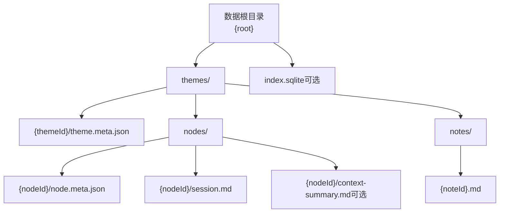
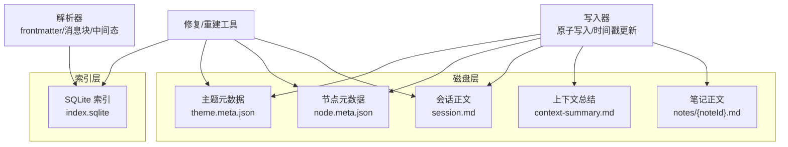
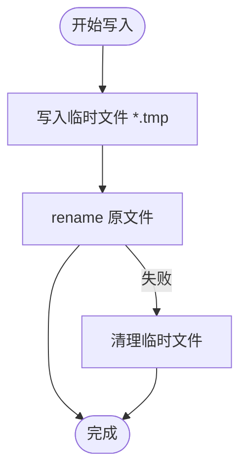
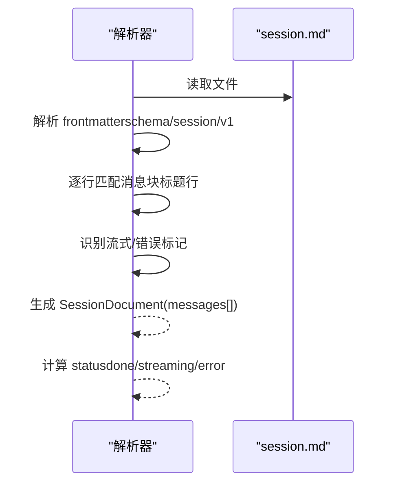
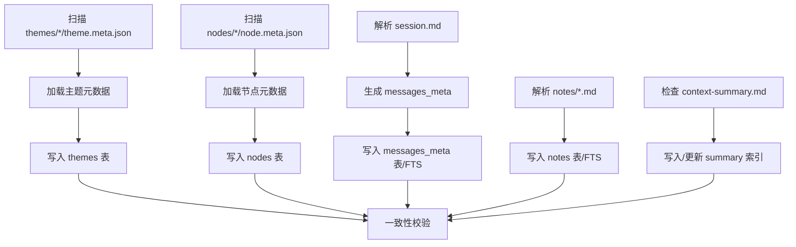
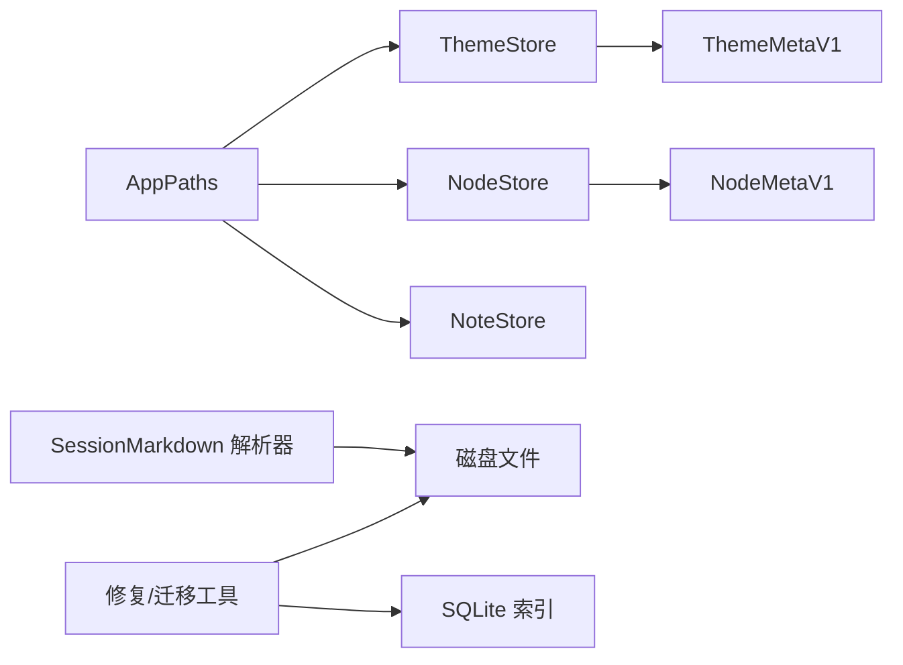

# 存储格式规范

<cite>
**本文引用的文件**
- [storage-format.md](file://docs/storage-format.md)
- [app_paths.dart](file://lib/ui/core/app_paths.dart)
- [ids.dart](file://lib/domain/ids.dart)
- [theme_store.dart](file://lib/data/stores/theme_store.dart)
- [node_store.dart](file://lib/data/stores/node_store.dart)
- [note_store.dart](file://lib/data/stores/note_store.dart)
- [session_markdown.dart](file://lib/data/services/session_markdown.dart)
- [theme_meta.dart](file://lib/data/models/theme_meta.dart)
- [node_meta.dart](file://lib/data/models/node_meta.dart)
- [theme_meta_test.dart](file://test/data/models/theme_meta_test.dart)
- [node_meta_test.dart](file://test/data/models/node_meta_test.dart)
- [migrate_to_tree.py](file://tools/migrate_to_tree.py)
- [repair_index_from_disk.py](file://tools/repair_index_from_disk.py)
</cite>

## 目录
1. [简介](#简介)
2. [项目结构](#项目结构)
3. [核心组件](#核心组件)
4. [架构总览](#架构总览)
5. [详细组件分析](#详细组件分析)
6. [依赖关系分析](#依赖关系分析)
7. [性能考量](#性能考量)
8. [故障排查指南](#故障排查指南)
9. [结论](#结论)
10. [附录](#附录)

## 简介
本文件系统性阐述 ThkTree 的磁盘存储契约与 SQLite 索引格式，确保实现端以“磁盘文件为真相源、SQLite 仅为索引/检索加速”的原则运行，并提供从磁盘重建索引、版本迁移、原子写入与崩溃恢复等关键设计与实践依据。本文档同时给出 Markdown 文件格式规范、JSON 元数据字段定义与约束、以及数据一致性保障策略。

## 项目结构
ThkTree 的数据根目录由应用路径管理模块负责定位，典型结构如下：
- 数据根目录：{root}/
  - themes/{themeId}/
    - theme.meta.json
    - nodes/{nodeId}/
      - node.meta.json
      - session.md
      - context-summary.md（可选）
    - notes/{noteId}.md
  - index.sqlite（可选）

该结构与契约在权威文档中明确定义，实现端仅依赖该目录布局与文件命名规则进行读写与索引重建。

**图表来源**
- [storage-format.md:18-31](file://docs/storage-format.md#L18-L31)
- [app_paths.dart:29-44](file://lib/ui/core/app_paths.dart#L29-L44)

**章节来源**
- [storage-format.md:14-31](file://docs/storage-format.md#L14-L31)
- [app_paths.dart:29-44](file://lib/ui/core/app_paths.dart#L29-L44)

## 核心组件
- 应用路径与根目录：AppPaths 负责定位 {root}、themes、logs、temp 与 index.sqlite 的绝对/相对路径，确保跨平台一致性。
- ID 生成：统一采用 ULID（26 位 Crockford Base32 大写），前缀分别为 thm_、nd_、nt_、msg_、req_，满足全局唯一与可排序。
- 主题与节点元数据：ThemeMetaV1、NodeMetaV1 提供 JSON 元数据的序列化/反序列化与校验。
- 会话 Markdown 解析：SessionDocument/SessionMessage 支持 frontmatter、消息块、流式中间态与错误态解析。
- 笔记存储：NoteStore 提供笔记的创建、读取正文、追加与更新时间戳等操作。
- 原子写入：主题/节点/会话写入均通过“写入 .tmp 后 rename 替换”的方式实现，保证崩溃后仍可解析。

**章节来源**
- [app_paths.dart:7-75](file://lib/ui/core/app_paths.dart#L7-L75)
- [ids.dart:1-10](file://lib/domain/ids.dart#L1-L10)
- [theme_meta.dart:5-60](file://lib/data/models/theme_meta.dart#L5-L60)
- [node_meta.dart:5-81](file://lib/data/models/node_meta.dart#L5-L81)
- [session_markdown.dart:4-42](file://lib/data/services/session_markdown.dart#L4-L42)
- [note_store.dart:53-151](file://lib/data/stores/note_store.dart#L53-L151)
- [theme_store.dart:151-156](file://lib/data/stores/theme_store.dart#L151-L156)
- [node_store.dart:408-413](file://lib/data/stores/node_store.dart#L408-L413)

## 架构总览
ThkTree 的数据层遵循“磁盘为真相源 + SQLite 为索引”的双轨架构。实现端在写入时严格遵守原子写入与中间态标记，确保崩溃后仍可解析；在读取时优先从磁盘解析，必要时回填/重建 SQLite 索引。

**图表来源**
- [storage-format.md:292-340](file://docs/storage-format.md#L292-L340)
- [session_markdown.dart:49-61](file://lib/data/services/session_markdown.dart#L49-L61)
- [repair_index_from_disk.py:119-162](file://tools/repair_index_from_disk.py#L119-L162)

## 详细组件分析

### 目录结构与路径约定
- 数据根目录由 AppPaths.load() 定位至应用文档目录下的 thktree 子目录，确保跨平台一致。
- themes、nodes、notes、logs、temp、index.sqlite 的相对/绝对路径转换由 AppPaths 提供。
- 约束：主题、节点、笔记的路径必须严格遵循 {root}/themes/{themeId}/...、{root}/themes/{themeId}/nodes/{nodeId}/...、{root}/themes/{themeId}/notes/{noteId}.md。

**章节来源**
- [app_paths.dart:29-75](file://lib/ui/core/app_paths.dart#L29-L75)
- [storage-format.md:14-31](file://docs/storage-format.md#L14-L31)

### 编码、换行与时间格式
- 文本文件统一 UTF-8、无 BOM，换行符统一为 \n。
- 时间格式统一为 UTC ISO8601：YYYY-MM-DDTHH:mm:ss.SSSZ。
- ID 采用 ULID（26 位 Crockford Base32 大写），前缀 thm_/nd_/nt_/msg_/req_。

**章节来源**
- [storage-format.md:42-62](file://docs/storage-format.md#L42-L62)

### 原子写入与崩溃恢复
- 覆盖写：先写入同目录 .tmp 文件，再以 rename 原子替换，避免部分写入导致不可解析。
- 追加写（会话流式）：必须保证崩溃后仍可解析，不得出现“写一半 frontmatter/标题行”的状态。
- 实现示例：主题/节点/会话写入均采用 _atomicWriteString(tmp -> rename)。

**图表来源**
- [theme_store.dart:151-156](file://lib/data/stores/theme_store.dart#L151-L156)
- [node_store.dart:408-413](file://lib/data/stores/node_store.dart#L408-L413)

**章节来源**
- [storage-format.md:66-70](file://docs/storage-format.md#L66-L70)
- [theme_store.dart:151-156](file://lib/data/stores/theme_store.dart#L151-L156)
- [node_store.dart:408-413](file://lib/data/stores/node_store.dart#L408-L413)

### JSON 元数据格式规范

#### theme.meta.json（主题元数据）
- 路径：{root}/themes/{themeId}/theme.meta.json
- 字段：
  - schema：固定 theme_meta/v1
  - themeId：必填
  - title：必填，可修改
  - createdAt/updatedAt：必填；任何可见字段变化必须更新 updatedAt
- 解析与实体转换：ThemeMetaV1 提供 fromJson 与 toEntity，测试覆盖了 roundtrip、schema 校验与字段类型校验。

**章节来源**
- [storage-format.md:75-94](file://docs/storage-format.md#L75-L94)
- [theme_meta.dart:18-49](file://lib/data/models/theme_meta.dart#L18-L49)
- [theme_meta_test.dart:8-76](file://test/data/models/theme_meta_test.dart#L8-L76)

#### node.meta.json（节点元数据）
- 路径：{root}/themes/{themeId}/nodes/{nodeId}/node.meta.json
- 字段：
  - schema：固定 node_meta/v1
  - themeId/nodeId：必填
  - parentId：可为 null（根节点）
  - kind：枚举 chat | summary
  - title：必填，可修改
  - createdAt/updatedAt：必填
- 解析与实体转换：NodeMetaV1 提供 fromJson 与 toEntity，测试覆盖 roundtrip、parentId、kind 与字段缺失/类型错误的异常。

**章节来源**
- [storage-format.md:95-119](file://docs/storage-format.md#L95-L119)
- [node_meta.dart:24-68](file://lib/data/models/node_meta.dart#L24-L68)
- [node_meta_test.dart:8-110](file://test/data/models/node_meta_test.dart#L8-L110)

### Markdown 文件格式规范

#### session.md（会话正文真相源）
- 文件结构（必须）：
  - 顶部 YAML frontmatter（必须存在）
  - 之后由 0..N 个“消息块”组成
  - 消息块 = “标题行（单行） + 正文（多行 Markdown）”
- Frontmatter：session/v1（必须）
  - schema：固定 session/v1
  - themeId/nodeId：必填
  - kind：chat | summary（必须与 node.meta.json 一致）
  - parentId：必须与 node.meta.json 一致
  - title：必填，可修改
  - createdAt/updatedAt：必填；追加消息或修改 title 必须更新 updatedAt
- 消息块标题行（必须）：
  - 语法：## <role> · <timestamp> · <msgId>
  - role：枚举 user | assistant | system
  - timestamp：UTC ISO8601
  - msgId：ULID 前缀 msg_
- 流式中间态（必须）：
  - 当 assistant 回复尚未完成时，在该 assistant 消息块正文最后追加独占一行：<!-- streaming -->
  - 规则：该标记必须是块内最后一行；流结束后必须删除；崩溃时解析器视该块 status=streaming
- 错误态（必须）：
  - 当一次请求失败且 assistant 消息无法完成时，将 streaming 标记替换为：<!-- error: <code> -->
  - 建议 code：network | timeout | cancelled | server | parse | unknown
  - 规则：错误态消息块必须保留；后续重试必须生成新的 assistant 消息块（新的 msgId）

**图表来源**
- [session_markdown.dart:49-61](file://lib/data/services/session_markdown.dart#L49-L61)
- [session_markdown.dart:106-157](file://lib/data/services/session_markdown.dart#L106-L157)
- [session_markdown.dart:159-184](file://lib/data/services/session_markdown.dart#L159-L184)

**章节来源**
- [storage-format.md:122-222](file://docs/storage-format.md#L122-L222)
- [session_markdown.dart:4-42](file://lib/data/services/session_markdown.dart#L4-L42)
- [session_markdown.dart:49-61](file://lib/data/services/session_markdown.dart#L49-L61)

#### context-summary.md（已确认总结）
- 路径：{root}/themes/{themeId}/nodes/{nodeId}/context-summary.md
- 语义：文件存在表示该 node 有一份“已确认总结”，正常 chat 发请求时注入其 body。
- 文件结构（必须）：
  - 顶部 YAML frontmatter（必须）
  - body 为已确认总结正文（Markdown）
- 字段：
  - schema：固定 context_summary/v1
  - themeId/nodeId：必填
  - approvedAt：必填（用户确认采用时间）
  - stale：必填，默认 false
  - sourceUpToMsgId：必填；用于“总结覆盖到哪条消息之前/截至哪条消息”，辅助 stale 判定与引用
- stale 最低要求：任一相关上游对话追加新消息后，将 stale 置为 true

**章节来源**
- [storage-format.md:224-259](file://docs/storage-format.md#L224-L259)

#### notes/{noteId}.md（笔记真相源）
- 路径：{root}/themes/{themeId}/notes/{noteId}.md
- 文件结构（必须）：
  - 顶部 YAML frontmatter（必须）
  - body 为笔记正文（Markdown，可累积追加）
- 字段：
  - schema：固定 note/v1
  - themeId/noteId：必填
  - createdAt/updatedAt：必填
  - sourceNodeId：可选
  - spawnedNodeId：可选（场景 A 成功发起对话后写入）
- NoteStore 提供创建、读取正文、追加正文与更新 updatedAt 的能力。

**章节来源**
- [storage-format.md:261-290](file://docs/storage-format.md#L261-L290)
- [note_store.dart:53-151](file://lib/data/stores/note_store.dart#L53-L151)

### SQLite 索引格式与全量重建
- 推荐路径：{root}/index.sqlite
- 约束：SQLite 必须可完全从磁盘重建，不得成为唯一真相源。
- 基础表（建议）：themes / nodes / notes / messages_meta（主键/对齐键不变）
  - 对齐键（必须）：themeId、nodeId、noteId、msgId（并保存 nodeId/themeId）
- 全局搜索（建议）：FTS（若可用）存可搜索文本
  - 实体类型：message | note | summary
  - 实体 ID：msgId | noteId | nodeId
  - 可选 themeId、nodeId
  - 内容：正文纯文本或 Markdown
  - 若 FTS5 不可用可降级为 LIKE
- 全量重建流程（必须支持）：
  1) 扫描 themes/*/theme.meta.json 写入 themes
  2) 扫描 nodes/*/node.meta.json 写入 nodes（含 parentId/kind/title/path）
  3) 解析每个 session.md：验证 schema、逐条解析消息块标题行 + 正文、生成 messages_meta（role、createdAt、preview、charCount 等）、若启用搜索写入 FTS
  4) 解析 notes/*.md：写入 notes；若启用搜索写入 FTS
  5) 若存在 context-summary.md：写入/更新 summary 索引
- 一致性要求：同一 msgId 不允许出现在不同 nodeId/themeId；streaming/error 块也必须可解析并可索引

**图表来源**
- [storage-format.md:292-340](file://docs/storage-format.md#L292-L340)

**章节来源**
- [storage-format.md:292-340](file://docs/storage-format.md#L292-L340)

### 数据迁移策略与版本升级方案
- 每种文件用 schema: name/vN 明确版本
- 新增/变更格式必须：
  1) 在权威文档补全 v(N+1) 定义
  2) 给出 vN -> v(N+1) 迁移算法（磁盘与索引）
  3) 指定迁移触发策略（启动检测/手动触发）
- 工具脚本示例：
  - migrate_to_tree.py：自动发现 iOS 模拟器中的 thktree/themes 与 index.db，迁移节点目录层级并更新 DB 中的 nodePath/sessionPath
  - repair_index_from_disk.py：扫描磁盘重建 themes 与 nodes 表，生成备份后执行全量写入

**章节来源**
- [storage-format.md:343-350](file://docs/storage-format.md#L343-L350)
- [migrate_to_tree.py:132-161](file://tools/migrate_to_tree.py#L132-L161)
- [repair_index_from_disk.py:119-162](file://tools/repair_index_from_disk.py#L119-L162)

## 依赖关系分析
- AppPaths 为各存储层提供统一的根目录与路径转换能力。
- ThemeStore/NodeStore/NoteStore 依赖 AppPaths 获取路径，依赖 ThemeMetaV1/NodeMetaV1 进行元数据读写。
- SessionMarkdown 解析器独立于数据库，直接面向磁盘文件解析。
- 工具脚本 repair_index_from_disk.py 与 migrate_to_tree.py 作为外部运维工具，基于磁盘扫描与 SQLite 更新实现修复与迁移。

**图表来源**
- [app_paths.dart:7-75](file://lib/ui/core/app_paths.dart#L7-L75)
- [theme_store.dart:11-16](file://lib/data/stores/theme_store.dart#L11-L16)
- [node_store.dart:12-17](file://lib/data/stores/node_store.dart#L12-L17)
- [note_store.dart:53-57](file://lib/data/stores/note_store.dart#L53-L57)
- [session_markdown.dart:49-61](file://lib/data/services/session_markdown.dart#L49-L61)
- [repair_index_from_disk.py:119-162](file://tools/repair_index_from_disk.py#L119-L162)
- [migrate_to_tree.py:132-161](file://tools/migrate_to_tree.py#L132-L161)

**章节来源**
- [app_paths.dart:7-75](file://lib/ui/core/app_paths.dart#L7-L75)
- [theme_store.dart:11-16](file://lib/data/stores/theme_store.dart#L11-L16)
- [node_store.dart:12-17](file://lib/data/stores/node_store.dart#L12-L17)
- [note_store.dart:53-57](file://lib/data/stores/note_store.dart#L53-L57)
- [session_markdown.dart:49-61](file://lib/data/services/session_markdown.dart#L49-L61)
- [repair_index_from_disk.py:119-162](file://tools/repair_index_from_disk.py#L119-L162)
- [migrate_to_tree.py:132-161](file://tools/migrate_to_tree.py#L132-L161)

## 性能考量
- SQLite 仅作索引/检索加速，全文检索建议优先使用 FTS5（若可用），否则降级为 LIKE。
- 重建索引流程应尽量批量写入、事务包裹，减少 IO 次数。
- 会话解析按行扫描，正则匹配消息块标题行，注意在大规模会话中控制内存占用与日志开销。
- 原子写入避免频繁 rename，批量写入时合并更新以降低磁盘压力。

[本节为通用指导，无需特定文件引用]

## 故障排查指南
- 崩溃后文件不可解析：
  - 检查是否遵循“写入 .tmp 后 rename”的原子写入流程
  - 确认 session.md 的流式/错误标记位置正确，崩溃时不应破坏正文结构
- SQLite 索引不一致：
  - 使用 repair_index_from_disk.py 扫描磁盘重建 themes 与 nodes 表，并生成备份
- 迁移失败或路径错误：
  - 使用 migrate_to_tree.py 自动发现 iOS 模拟器中的 thktree 目录，或显式传参指定路径
- 元数据解析异常：
  - 检查 theme.meta.json 与 node.meta.json 的 schema、字段类型与必填项
  - 使用单元测试覆盖的 fromJson 异常场景定位问题

**章节来源**
- [repair_index_from_disk.py:119-162](file://tools/repair_index_from_disk.py#L119-L162)
- [migrate_to_tree.py:132-161](file://tools/migrate_to_tree.py#L132-L161)
- [theme_meta_test.dart:35-60](file://test/data/models/theme_meta_test.dart#L35-L60)
- [node_meta_test.dart:62-90](file://test/data/models/node_meta_test.dart#L62-L90)

## 结论
ThkTree 的存储格式以磁盘文件为真相源，SQLite 仅为索引与检索加速，二者通过严格的目录结构、文件命名、原子写入与中间态标记达成高可靠性与可维护性。配合完善的全量重建与迁移工具，可在版本演进与异常恢复中保持数据一致性与业务连续性。

[本节为总结性内容，无需特定文件引用]

## 附录
- ID 生成：ULID（26 位 Crockford Base32 大写），前缀 thm_/nd_/nt_/msg_/req_
- 时间格式：UTC ISO8601（YYYY-MM-DDTHH:mm:ss.SSSZ）
- 原子写入：写入 .tmp 后 rename 替换
- 流式与错误态：会话正文末尾独占行标记，崩溃时可被解析器识别

**章节来源**
- [ids.dart:1-10](file://lib/domain/ids.dart#L1-L10)
- [storage-format.md:47-70](file://docs/storage-format.md#L47-L70)
- [session_markdown.dart:172-184](file://lib/data/services/session_markdown.dart#L172-L184)