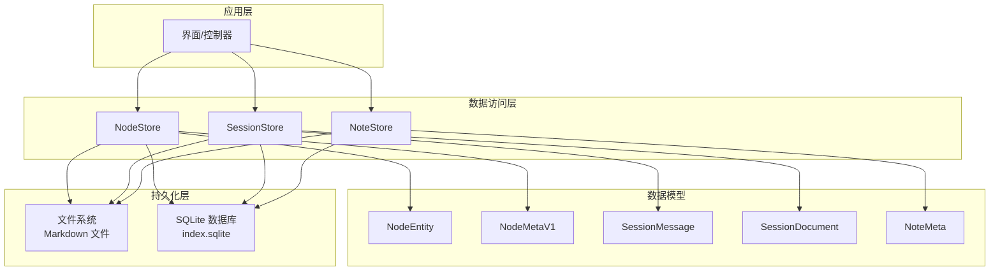
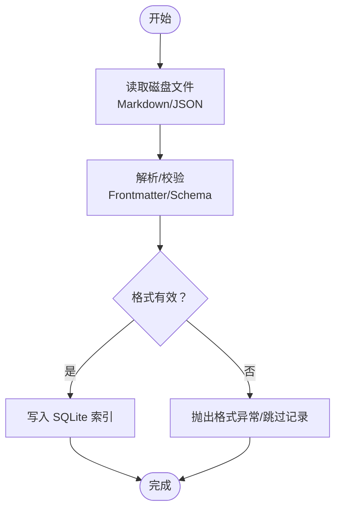
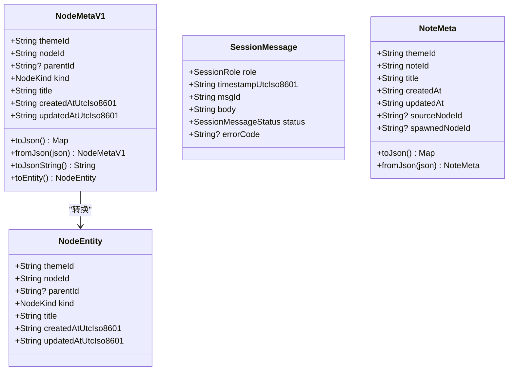
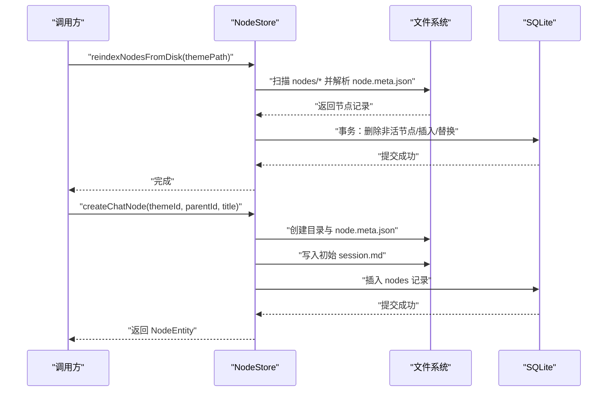
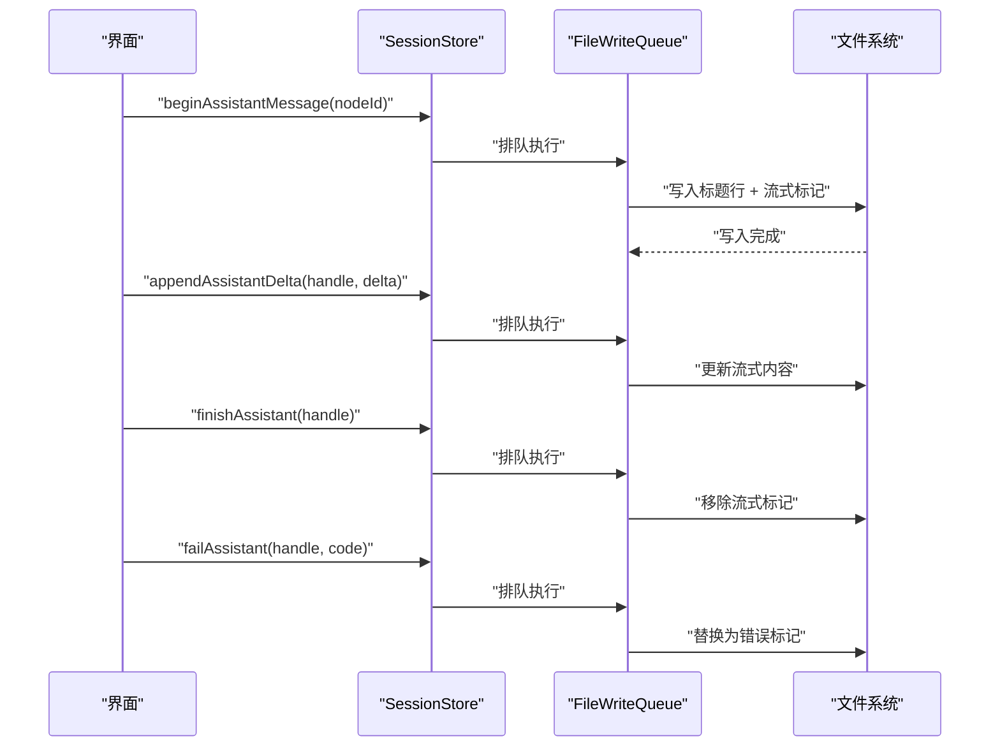
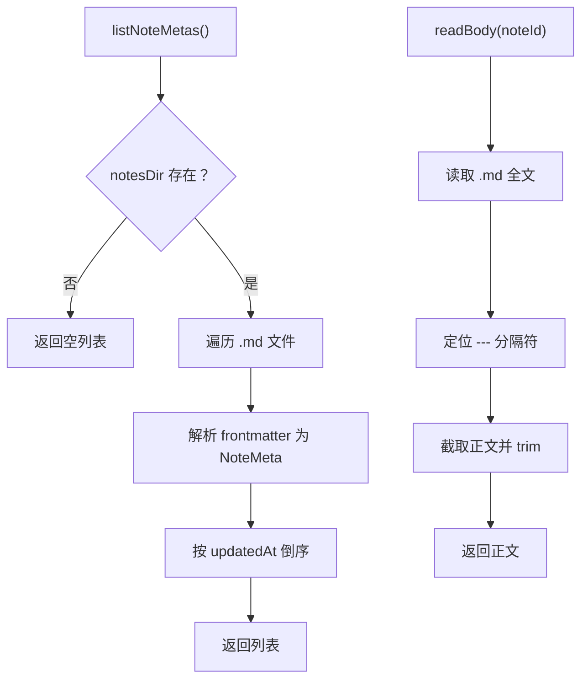
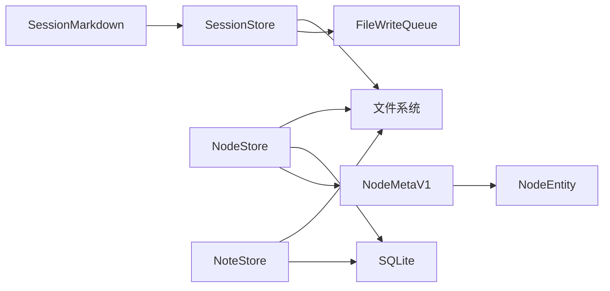

# 数据存储架构

<cite>
**本文引用的文件**
- [storage-format.md](file://docs/storage-format.md)
- [node_store.dart](file://lib/data/stores/node_store.dart)
- [note_store.dart](file://lib/data/stores/note_store.dart)
- [session_store.dart](file://lib/data/stores/session_store.dart)
- [session_markdown.dart](file://lib/data/services/session_markdown.dart)
- [app_database.dart](file://lib/data/services/app_database.dart)
- [node_meta.dart](file://lib/data/models/node_meta.dart)
- [node.dart](file://lib/domain/node.dart)
- [main.dart](file://lib/main.dart)
</cite>

## 目录
1. [简介](#简介)
2. [项目结构](#项目结构)
3. [核心组件](#核心组件)
4. [架构总览](#架构总览)
5. [详细组件分析](#详细组件分析)
6. [依赖关系分析](#依赖关系分析)
7. [性能考量](#性能考量)
8. [故障排查指南](#故障排查指南)
9. [结论](#结论)
10. [附录](#附录)

## 简介
本文件系统化阐述 ThkTree 的数据存储架构，围绕“磁盘真相源 + SQLite 索引”的双轨设计，详细说明：
- 存储格式规范：Markdown 文件格式、SQLite 数据库结构、文件系统布局
- 数据模型设计：NodeEntity、NodeMetaV1、SessionMessage、NoteMeta 等核心实体的关系映射与约束
- 数据访问层实现：存储服务、数据库操作、文件系统交互
- 生命周期管理、缓存策略与性能优化
- 数据迁移方案、备份恢复机制与一致性保障
- 数据验证规则与错误处理策略

## 项目结构
ThkTree 将“磁盘上的 Markdown 文件”作为“真相源”，SQLite 仅承担索引与检索职责，可随时重建。应用通过 Store 层协调磁盘与数据库，确保一致性与高性能。

图表来源
- [node_store.dart:12-375](file://lib/data/stores/node_store.dart#L12-L375)
- [session_store.dart:8-205](file://lib/data/stores/session_store.dart#L8-L205)
- [note_store.dart:53-151](file://lib/data/stores/note_store.dart#L53-L151)
- [session_markdown.dart:44-223](file://lib/data/services/session_markdown.dart#L44-L223)
- [node_meta.dart:5-83](file://lib/data/models/node_meta.dart#L5-L83)
- [node.dart:10-30](file://lib/domain/node.dart#L10-L30)

章节来源
- [storage-format.md:14-350](file://docs/storage-format.md#L14-L350)
- [main.dart:15-95](file://lib/main.dart#L15-L95)

## 核心组件
- NodeStore：负责主题/节点的磁盘扫描、索引重建、原子写入、树形删除与路径解析
- SessionStore：负责会话 Markdown 的读取、追加、流式中间态标记管理与原子写入
- NoteStore：负责笔记元数据与正文的读写、列表与排序
- AppDatabase：负责 SQLite 数据库初始化、建表与索引
- SessionMarkdown：负责会话 Markdown 的解析与序列化
- NodeMetaV1/NodeEntity：节点元数据与领域实体的映射
- NoteMeta：笔记元数据模型

章节来源
- [node_store.dart:12-375](file://lib/data/stores/node_store.dart#L12-L375)
- [session_store.dart:8-205](file://lib/data/stores/session_store.dart#L8-L205)
- [note_store.dart:53-151](file://lib/data/stores/note_store.dart#L53-L151)
- [app_database.dart:3-47](file://lib/data/services/app_database.dart#L3-L47)
- [session_markdown.dart:44-223](file://lib/data/services/session_markdown.dart#L44-L223)
- [node_meta.dart:5-83](file://lib/data/models/node_meta.dart#L5-L83)
- [node.dart:10-30](file://lib/domain/node.dart#L10-L30)

## 架构总览
ThkTree 的存储架构遵循“磁盘真相源 + SQLite 索引”的契约：
- 真相源：Markdown 文件（会话正文、笔记正文、JSON 元数据）
- 索引：SQLite 表（themes、nodes 等），可从磁盘重建
- 原子写：同目录临时文件 + rename，保证崩溃可解析
- 单写者：同一时间仅允许一个写入流程改动同一 .md 文件（含流式）

图表来源
- [storage-format.md:5-11](file://docs/storage-format.md#L5-L11)
- [storage-format.md:324-341](file://docs/storage-format.md#L324-L341)

章节来源
- [storage-format.md:5-11](file://docs/storage-format.md#L5-L11)
- [storage-format.md:324-341](file://docs/storage-format.md#L324-L341)

## 详细组件分析

### 存储格式规范与文件系统布局
- 目录结构契约：themes/{themeId}/、nodes/{nodeId}/、notes/{noteId}.md、index.sqlite
- 编码与换行：UTF-8、统一 \n
- 时间格式：UTC ISO8601（YYYY-MM-DDTHH:mm:ss.SSSZ）
- ID 规则：ULID（26 字符，大写），前缀 thm_/nd_/nt_/msg_/req_
- 原子写：覆盖写使用 *.tmp + rename；追加写需保证崩溃可解析
- 单写者：同一时间仅一个写入流程改动同一 .md 文件（含流式）

章节来源
- [storage-format.md:14-71](file://docs/storage-format.md#L14-L71)
- [storage-format.md:40-71](file://docs/storage-format.md#L40-L71)
- [storage-format.md:292-321](file://docs/storage-format.md#L292-L321)

### 数据模型设计与实体映射
- NodeEntity：领域实体，承载主题/节点的标识、层级、类型与时间戳
- NodeMetaV1：磁盘元数据模型，包含 schema、themeId、nodeId、parentId、kind、title、createdAt、updatedAt，并可转换为 NodeEntity
- SessionMessage：会话消息模型，包含 role、timestamp、msgId、body、status、errorCode
- NoteMeta：笔记元数据模型，包含 themeId、noteId、title、createdAt、updatedAt、sourceNodeId、spawnedNodeId

图表来源
- [node_meta.dart:5-83](file://lib/data/models/node_meta.dart#L5-L83)
- [node.dart:10-30](file://lib/domain/node.dart#L10-L30)
- [session_markdown.dart:16-42](file://lib/data/services/session_markdown.dart#L16-L42)
- [note_store.dart:6-44](file://lib/data/stores/note_store.dart#L6-L44)

章节来源
- [node_meta.dart:5-83](file://lib/data/models/node_meta.dart#L5-L83)
- [node.dart:10-30](file://lib/domain/node.dart#L10-L30)
- [session_markdown.dart:16-42](file://lib/data/services/session_markdown.dart#L16-L42)
- [note_store.dart:6-44](file://lib/data/stores/note_store.dart#L6-L44)

### 数据访问层实现

#### NodeStore（节点与主题）
- 索引重建：扫描 nodes 目录，解析 node.meta.json，批量写入 nodes 表，事务中执行，支持增量与清理
- 创建聊天节点：分配 nodeId，创建目录，写入 node.meta.json 与初始 session.md，原子写入，同时写入数据库
- 删除子树：收集子树节点 ID，删除对应目录，事务删除数据库记录，随后按磁盘重建索引
- 路径解析：优先使用数据库中的相对路径还原绝对路径，否则回退到磁盘递归查找匹配目录

图表来源
- [node_store.dart:18-59](file://lib/data/stores/node_store.dart#L18-L59)
- [node_store.dart:112-204](file://lib/data/stores/node_store.dart#L112-L204)
- [node_store.dart:206-235](file://lib/data/stores/node_store.dart#L206-L235)

章节来源
- [node_store.dart:18-59](file://lib/data/stores/node_store.dart#L18-L59)
- [node_store.dart:112-204](file://lib/data/stores/node_store.dart#L112-L204)
- [node_store.dart:206-235](file://lib/data/stores/node_store.dart#L206-L235)

#### SessionStore（会话）
- 读取：根据 nodeId 获取 session.md 路径，解析为 SessionDocument
- 追加：用户/助手消息以标题行 + 正文形式追加，原子写入
- 流式中间态：助手消息以“<!-- streaming -->”标记结尾，finishStreamingMessage 或 failAssistant 替换为最终态
- 错误态：以“<!-- error: code -->”标记，保留以便重试与溯源

图表来源
- [session_store.dart:84-148](file://lib/data/stores/session_store.dart#L84-L148)
- [session_store.dart:199-205](file://lib/data/stores/session_store.dart#L199-L205)

章节来源
- [session_store.dart:17-40](file://lib/data/stores/session_store.dart#L17-L40)
- [session_store.dart:84-148](file://lib/data/stores/session_store.dart#L84-L148)
- [session_store.dart:199-205](file://lib/data/stores/session_store.dart#L199-L205)

#### NoteStore（笔记）
- 列表：遍历 notes 目录，读取 .md 文件，解析 frontmatter 为 NoteMeta，按 updatedAt 倒序
- 读取正文：定位 frontmatter 结束标记，截取正文部分
- 创建：生成 noteId，构造 frontmatter，写入 .md
- 更新：读取原始内容，更新 updatedAt，写回 frontmatter 与正文

图表来源
- [note_store.dart:58-72](file://lib/data/stores/note_store.dart#L58-L72)
- [note_store.dart:74-79](file://lib/data/stores/note_store.dart#L74-L79)
- [note_store.dart:81-106](file://lib/data/stores/note_store.dart#L81-L106)
- [note_store.dart:108-136](file://lib/data/stores/note_store.dart#L108-L136)

章节来源
- [note_store.dart:58-72](file://lib/data/stores/note_store.dart#L58-L72)
- [note_store.dart:74-79](file://lib/data/stores/note_store.dart#L74-L79)
- [note_store.dart:81-106](file://lib/data/stores/note_store.dart#L81-L106)
- [note_store.dart:108-136](file://lib/data/stores/note_store.dart#L108-L136)

#### SQLite 数据库结构
- themes：themeId 主键，title、createdAt、updatedAt、themePath
- nodes：nodeId 主键，themeId、parentId、kind、title、createdAt、updatedAt、nodePath、sessionPath、contextSummaryPath；对 (themeId, parentId) 建索引
- 约束：SQLite 仅作索引与检索加速，可随时删除并从磁盘重建

章节来源
- [app_database.dart:20-46](file://lib/data/services/app_database.dart#L20-L46)
- [storage-format.md:292-321](file://docs/storage-format.md#L292-L321)

### 数据生命周期管理与一致性
- 创建：NodeStore 在磁盘创建目录与元数据文件，同时写入数据库；SessionStore 写入初始 frontmatter；NoteStore 写入 frontmatter
- 更新：均采用“同目录临时文件 + rename”的原子写法，避免部分写导致不可解析
- 删除：NodeStore 删除目录与数据库记录，并重建索引；NoteStore 删除 .md 文件
- 一致性：SQLite 仅作索引，不作为真相源；Reindex 能力确保索引与磁盘一致

章节来源
- [node_store.dart:112-204](file://lib/data/stores/node_store.dart#L112-L204)
- [session_store.dart:199-205](file://lib/data/stores/session_store.dart#L199-L205)
- [note_store.dart:81-106](file://lib/data/stores/note_store.dart#L81-L106)
- [storage-format.md:5-11](file://docs/storage-format.md#L5-L11)

### 缓存策略与性能优化
- 索引加速：SQLite 对 nodes(themeId, parentId) 建立索引，提升查询与树形遍历效率
- 全量重建：提供 Reindex 能力，扫描磁盘构建索引，支持 FTS（如可用）进行全文检索
- 写入队列：SessionStore 使用 FileWriteQueue 串行化同一 nodeId 的写入，避免并发冲突
- 增量更新：NodeStore 在事务中删除非活节点并插入/替换，减少冗余

章节来源
- [app_database.dart:45](file://lib/data/services/app_database.dart#L45)
- [node_store.dart:26-58](file://lib/data/stores/node_store.dart#L26-L58)
- [session_store.dart:13](file://lib/data/stores/session_store.dart#L13)

### 数据迁移方案与备份恢复
- 迁移契约：每种文件使用 schema: name/vN 明确版本；新增/变更需给出 vN -> v(N+1) 迁移算法与触发策略
- 备份：备份磁盘文件（Markdown/JSON）即可；SQLite 可删除后重建
- 恢复：从备份磁盘文件恢复后，调用 Reindex 重建 SQLite 索引

章节来源
- [storage-format.md:343-350](file://docs/storage-format.md#L343-L350)
- [storage-format.md:324-341](file://docs/storage-format.md#L324-L341)

### 数据验证规则与错误处理
- 格式校验：SessionMarkdown 解析 frontmatter 与消息块，缺失分隔符或非法格式抛出异常
- 元数据校验：NodeMetaV1 校验 schema 与 kind 枚举，未知值抛出异常
- 运行时错误：NodeStore 在父节点目录不存在、ID 冲突、分配失败时抛出异常；SessionStore 在流式标记缺失时返回相应状态
- 崩溃恢复：流式中间态与错误态标记确保崩溃后仍可解析与重试

章节来源
- [session_markdown.dart:63-88](file://lib/data/services/session_markdown.dart#L63-L88)
- [session_markdown.dart:106-184](file://lib/data/services/session_markdown.dart#L106-L184)
- [node_meta.dart:39-68](file://lib/data/models/node_meta.dart#L39-L68)
- [node_store.dart:129-131](file://lib/data/stores/node_store.dart#L129-L131)
- [node_store.dart:161-163](file://lib/data/stores/node_store.dart#L161-L163)

## 依赖关系分析

图表来源
- [session_markdown.dart:49-61](file://lib/data/services/session_markdown.dart#L49-L61)
- [session_store.dart:8-205](file://lib/data/stores/session_store.dart#L8-L205)
- [node_store.dart:12-375](file://lib/data/stores/node_store.dart#L12-L375)
- [note_store.dart:53-151](file://lib/data/stores/note_store.dart#L53-L151)
- [node_meta.dart:70-81](file://lib/data/models/node_meta.dart#L70-L81)

章节来源
- [session_markdown.dart:49-61](file://lib/data/services/session_markdown.dart#L49-L61)
- [session_store.dart:8-205](file://lib/data/stores/session_store.dart#L8-L205)
- [node_store.dart:12-375](file://lib/data/stores/node_store.dart#L12-L375)
- [note_store.dart:53-151](file://lib/data/stores/note_store.dart#L53-L151)
- [node_meta.dart:70-81](file://lib/data/models/node_meta.dart#L70-L81)

## 性能考量
- I/O 原子性：所有覆盖写采用 *.tmp + rename，避免部分写
- 顺序写：SessionStore 使用队列串行化同一节点的写入，降低锁竞争
- 索引优化：nodes 表对 (themeId, parentId) 建索引，支持高效树形查询
- 可选全文检索：建议使用 FTS5（如可用）；不可用时降级为 LIKE，但契约目标不变

章节来源
- [session_store.dart:199-205](file://lib/data/stores/session_store.dart#L199-L205)
- [node_store.dart:45](file://lib/data/stores/node_store.dart#L45)
- [storage-format.md:314-321](file://docs/storage-format.md#L314-L321)

## 故障排查指南
- 会话解析失败：检查 frontmatter 是否完整、消息块标题行格式是否正确、是否存在遗留流式/错误标记
- 节点创建失败：检查父节点目录是否存在、ID 冲突、磁盘空间与权限
- 索引不一致：执行 Reindex，扫描磁盘重建 nodes 表；确认 frontmatter schema 与 kind 一致
- 写入冲突：确认是否为同一节点并发写入；使用内置队列或外部同步机制

章节来源
- [session_markdown.dart:63-88](file://lib/data/services/session_markdown.dart#L63-L88)
- [node_store.dart:129-131](file://lib/data/stores/node_store.dart#L129-L131)
- [storage-format.md:324-341](file://docs/storage-format.md#L324-L341)

## 结论
ThkTree 的存储架构以“磁盘真相源 + SQLite 索引”为核心，通过严格的契约（编码、ID、原子写、单写者）、完善的解析与校验、以及可重建的索引机制，实现了高可靠性与可维护性。数据访问层以 Store 为中心，协调磁盘与数据库，配合队列与事务，保障并发安全与一致性。迁移、备份与恢复策略清晰，便于长期演进与运维。

## 附录
- 关键实现参考路径
  - [NodeStore.reindexNodesFromDisk:18-59](file://lib/data/stores/node_store.dart#L18-L59)
  - [NodeStore.createChatNode:112-204](file://lib/data/stores/node_store.dart#L112-L204)
  - [NodeStore.deleteNodeSubtree:206-235](file://lib/data/stores/node_store.dart#L206-L235)
  - [SessionStore.readSession:17-40](file://lib/data/stores/session_store.dart#L17-L40)
  - [SessionStore.beginAssistantMessage:84-98](file://lib/data/stores/session_store.dart#L84-L98)
  - [SessionStore.appendAssistantDelta:100-115](file://lib/data/stores/session_store.dart#L100-L115)
  - [SessionStore.finishAssistant:117-131](file://lib/data/stores/session_store.dart#L117-L131)
  - [SessionStore.failAssistant:133-148](file://lib/data/stores/session_store.dart#L133-L148)
  - [NoteStore.listNoteMetas:58-72](file://lib/data/stores/note_store.dart#L58-L72)
  - [NoteStore.readBody:74-79](file://lib/data/stores/note_store.dart#L74-L79)
  - [NoteStore.createNote:81-106](file://lib/data/stores/note_store.dart#L81-L106)
  - [NoteStore.writeBody:108-116](file://lib/data/stores/note_store.dart#L108-L116)
  - [NoteStore.appendBody:118-136](file://lib/data/stores/note_store.dart#L118-L136)
  - [AppDatabase.open/_createSchema:8-46](file://lib/data/services/app_database.dart#L8-L46)
  - [SessionMarkdown.parseSessionMarkdown:49-61](file://lib/data/services/session_markdown.dart#L49-L61)
  - [NodeMetaV1.fromJson/toEntity:39-81](file://lib/data/models/node_meta.dart#L39-L81)
  - [storage-format.md（权威契约）:1-350](file://docs/storage-format.md#L1-L350)