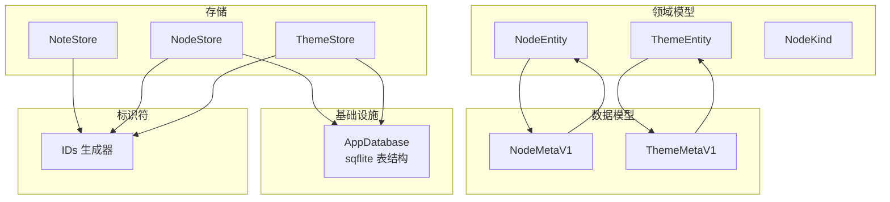
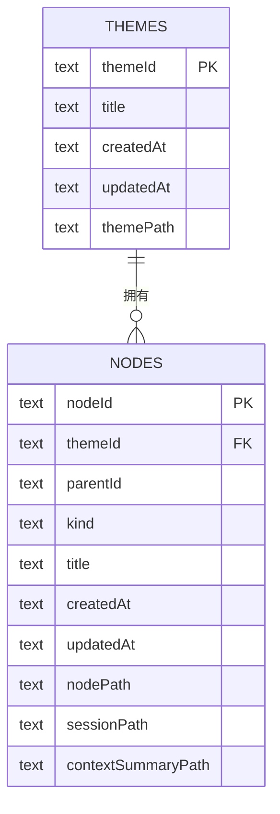
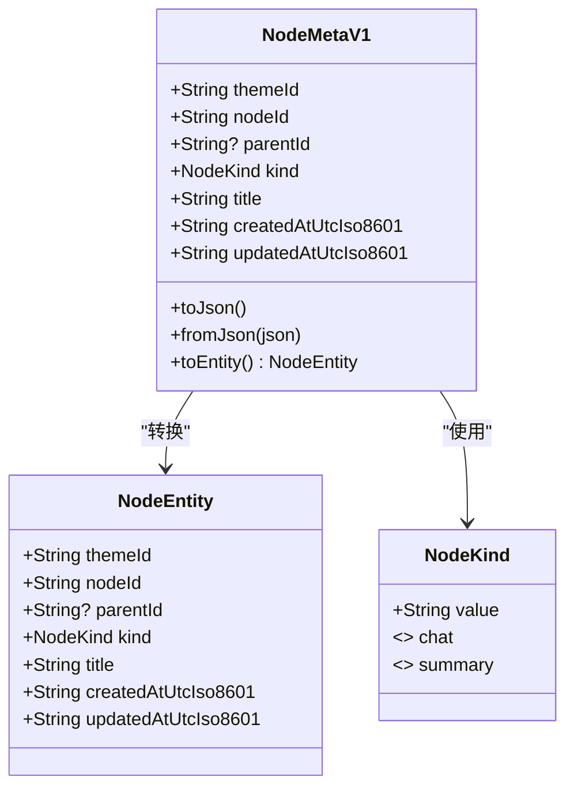
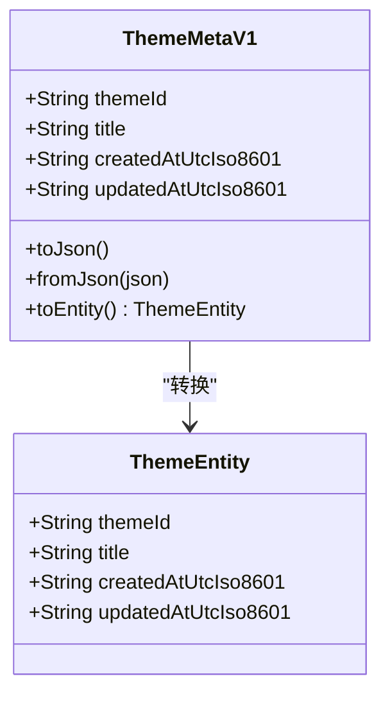
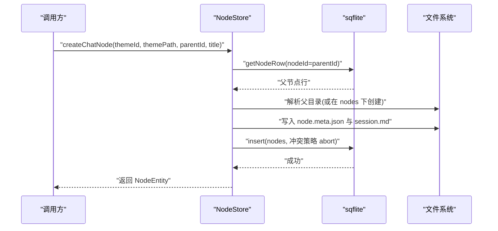
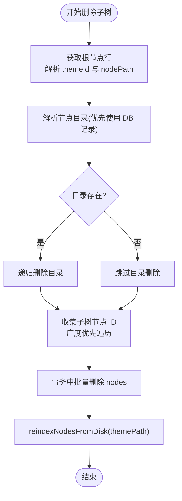
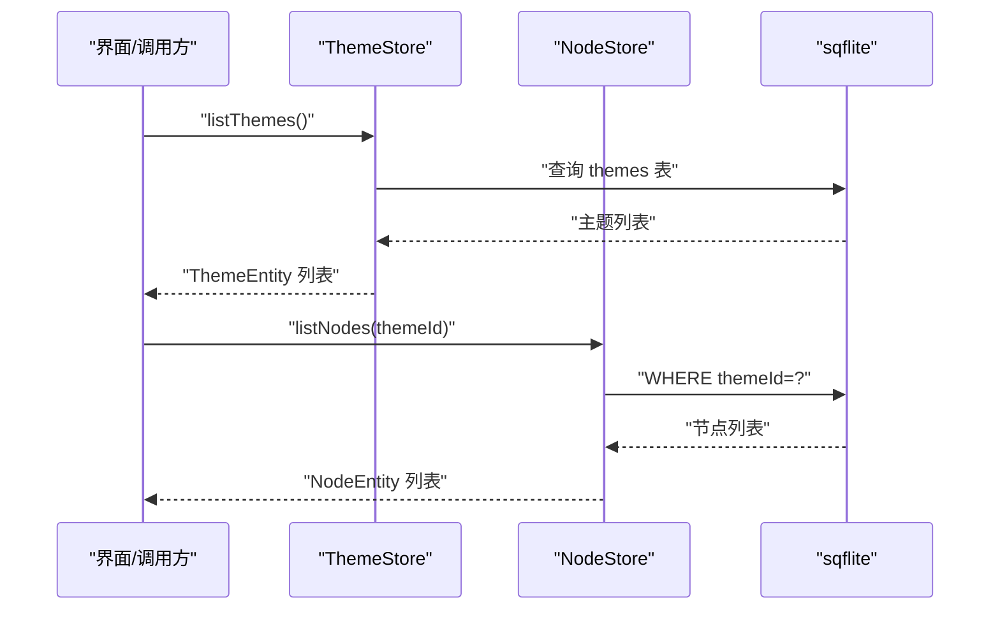
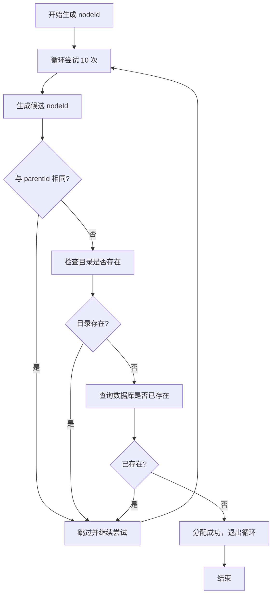
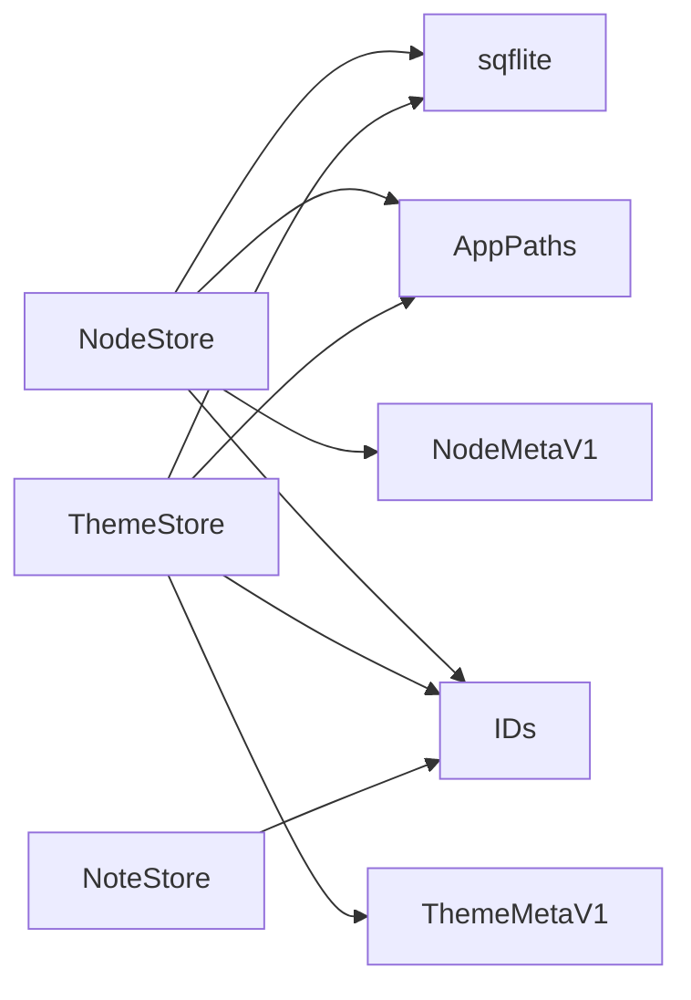

# 实体关系映射

<cite>
**本文档引用的文件**
- [lib/domain/node.dart](file://lib/domain/node.dart)
- [lib/domain/theme.dart](file://lib/domain/theme.dart)
- [lib/data/models/node_meta.dart](file://lib/data/models/node_meta.dart)
- [lib/data/models/theme_meta.dart](file://lib/data/models/theme_meta.dart)
- [lib/data/stores/node_store.dart](file://lib/data/stores/node_store.dart)
- [lib/data/stores/theme_store.dart](file://lib/data/stores/theme_store.dart)
- [lib/data/stores/note_store.dart](file://lib/data/stores/note_store.dart)
- [lib/data/services/app_database.dart](file://lib/data/services/app_database.dart)
- [lib/domain/ids.dart](file://lib/domain/ids.dart)
</cite>

## 目录
1. [简介](#简介)
2. [项目结构](#项目结构)
3. [核心组件](#核心组件)
4. [架构总览](#架构总览)
5. [详细组件分析](#详细组件分析)
6. [依赖分析](#依赖分析)
7. [性能考虑](#性能考虑)
8. [故障排查指南](#故障排查指南)
9. [结论](#结论)
10. [附录](#附录)

## 简介
本文件系统化梳理 ThkTree 的实体关系映射，重点围绕 NodeEntity 与 Theme 的设计、父子节点层级结构的实现原理（含继承与树形维护）、主题与节点的关联关系及基于 themeId 的数据隔离、ID 生成策略与唯一性保障、关系约束与引用完整性规则，并提供关系查询与遍历的实际代码路径示例，辅以关系图与数据流向图示。

## 项目结构
- 领域模型层：定义不可变的实体与值对象，如 NodeEntity、ThemeEntity、NodeKind。
- 数据模型层：负责版本化的元数据序列化/反序列化，如 NodeMetaV1、ThemeMetaV1。
- 存储层：负责数据库与文件系统的读写与一致性维护，如 NodeStore、ThemeStore、NoteStore。
- 基础设施层：数据库初始化与表结构定义，如 AppDatabase。
- 标识符生成：统一的 ULID 前缀策略，确保全局唯一性。

图表来源
- [lib/domain/node.dart:10-28](file://lib/domain/node.dart#L10-L28)
- [lib/domain/theme.dart:1-15](file://lib/domain/theme.dart#L1-L15)
- [lib/data/models/node_meta.dart:5-81](file://lib/data/models/node_meta.dart#L5-L81)
- [lib/data/models/theme_meta.dart:5-59](file://lib/data/models/theme_meta.dart#L5-L59)
- [lib/data/stores/node_store.dart:12-16](file://lib/data/stores/node_store.dart#L12-L16)
- [lib/data/stores/theme_store.dart:11-15](file://lib/data/stores/theme_store.dart#L11-L15)
- [lib/data/services/app_database.dart:20-46](file://lib/data/services/app_database.dart#L20-L46)
- [lib/domain/ids.dart:1-10](file://lib/domain/ids.dart#L1-L10)

章节来源
- [lib/domain/node.dart:10-28](file://lib/domain/node.dart#L10-L28)
- [lib/domain/theme.dart:1-15](file://lib/domain/theme.dart#L1-L15)
- [lib/data/models/node_meta.dart:5-81](file://lib/data/models/node_meta.dart#L5-L81)
- [lib/data/models/theme_meta.dart:5-59](file://lib/data/models/theme_meta.dart#L5-L59)
- [lib/data/stores/node_store.dart:12-16](file://lib/data/stores/node_store.dart#L12-L16)
- [lib/data/stores/theme_store.dart:11-15](file://lib/data/stores/theme_store.dart#L11-L15)
- [lib/data/services/app_database.dart:20-46](file://lib/data/services/app_database.dart#L20-L46)
- [lib/domain/ids.dart:1-10](file://lib/domain/ids.dart#L1-L10)

## 核心组件
- NodeEntity：表示树形节点的核心实体，包含 themeId、nodeId、parentId、kind、title、时间戳等字段。
- ThemeEntity：表示主题实体，包含 themeId、title、时间戳等。
- NodeMetaV1/ThemeMetaV1：版本化元数据模型，负责 JSON 序列化与实体转换。
- NodeStore/ThemeStore：负责节点与主题的持久化、索引重建、父子关系解析与目录定位。
- AppDatabase：定义 sqflite 表结构与索引，提供数据库打开与迁移。
- IDs：提供 ULID 前缀的全局唯一 ID 生成策略。

章节来源
- [lib/domain/node.dart:10-28](file://lib/domain/node.dart#L10-L28)
- [lib/domain/theme.dart:1-15](file://lib/domain/theme.dart#L1-L15)
- [lib/data/models/node_meta.dart:5-81](file://lib/data/models/node_meta.dart#L5-L81)
- [lib/data/models/theme_meta.dart:5-59](file://lib/data/models/theme_meta.dart#L5-L59)
- [lib/data/stores/node_store.dart:12-16](file://lib/data/stores/node_store.dart#L12-L16)
- [lib/data/stores/theme_store.dart:11-15](file://lib/data/stores/theme_store.dart#L11-L15)
- [lib/data/services/app_database.dart:20-46](file://lib/data/services/app_database.dart#L20-L46)
- [lib/domain/ids.dart:1-10](file://lib/domain/ids.dart#L1-L10)

## 架构总览
下图展示主题与节点的实体关系、存储层交互与数据流向。

图表来源
- [lib/data/services/app_database.dart:22-46](file://lib/data/services/app_database.dart#L22-L46)
- [lib/data/stores/node_store.dart:40-58](file://lib/data/stores/node_store.dart#L40-L58)
- [lib/data/stores/theme_store.dart:67-77](file://lib/data/stores/theme_store.dart#L67-L77)

说明
- 主题表与节点表通过 themeId 建立一对多关系。
- 节点表的 parentId 字段用于表达父子层级关系。
- 数据库层提供索引 idx_nodes_theme_parent 以优化按主题与父节点查询。

## 详细组件分析

### NodeEntity 与 NodeMetaV1
- NodeEntity 是不可变的领域实体，承载节点的业务语义与生命周期信息。
- NodeMetaV1 提供 JSON 序列化与版本控制，支持从 JSON 反序列化为 NodeEntity。
- NodeKind 限定节点类型，当前支持 chat 与 summary。

图表来源
- [lib/domain/node.dart:10-28](file://lib/domain/node.dart#L10-L28)
- [lib/data/models/node_meta.dart:5-81](file://lib/data/models/node_meta.dart#L5-L81)

章节来源
- [lib/domain/node.dart:10-28](file://lib/domain/node.dart#L10-L28)
- [lib/data/models/node_meta.dart:5-81](file://lib/data/models/node_meta.dart#L5-L81)

### ThemeEntity 与 ThemeMetaV1
- ThemeEntity 表示主题实体，包含主题标识与时间戳。
- ThemeMetaV1 提供主题元数据的 JSON 序列化与版本控制，支持 toEntity 转换。

图表来源
- [lib/domain/theme.dart:1-15](file://lib/domain/theme.dart#L1-L15)
- [lib/data/models/theme_meta.dart:5-59](file://lib/data/models/theme_meta.dart#L5-L59)

章节来源
- [lib/domain/theme.dart:1-15](file://lib/domain/theme.dart#L1-L15)
- [lib/data/models/theme_meta.dart:5-59](file://lib/data/models/theme_meta.dart#L5-L59)

### 父子节点层级结构与树形维护
- 层级结构由节点表的 parentId 字段表达，根节点 parentId 为空。
- NodeStore 提供以下能力：
  - 创建聊天节点时，根据 parentId 解析父目录，确保新节点在正确的层级位置创建。
  - reindexNodesFromDisk：扫描主题下的 nodes 目录，重建节点索引，删除磁盘不存在但数据库仍存在的记录。
  - deleteNodeSubtree：递归收集子树节点 ID 并批量删除，随后重新索引。
  - listNodes：按主题过滤并按创建时间排序返回节点列表。
  - _collectSubtreeNodeIds：广度优先遍历收集子树节点 ID，支撑删除与索引清理。

图表来源
- [lib/data/stores/node_store.dart:112-204](file://lib/data/stores/node_store.dart#L112-L204)

图表来源
- [lib/data/stores/node_store.dart:206-235](file://lib/data/stores/node_store.dart#L206-L235)
- [lib/data/stores/node_store.dart:237-257](file://lib/data/stores/node_store.dart#L237-L257)

章节来源
- [lib/data/stores/node_store.dart:18-59](file://lib/data/stores/node_store.dart#L18-L59)
- [lib/data/stores/node_store.dart:112-204](file://lib/data/stores/node_store.dart#L112-L204)
- [lib/data/stores/node_store.dart:206-235](file://lib/data/stores/node_store.dart#L206-L235)
- [lib/data/stores/node_store.dart:237-257](file://lib/data/stores/node_store.dart#L237-L257)

### 主题与节点的关联关系与数据隔离
- NodeStore.listNodes 通过 themeId 过滤节点，确保查询结果仅属于指定主题。
- ThemeStore.listThemes 与 ThemeStore.createTheme 使用 themeId 作为主键，配合主题目录与主题元数据文件实现主题级数据隔离。
- AppDatabase 定义了主题表与节点表，其中节点表的 themeId 为非空外键（逻辑约束），结合存储层的过滤与索引，形成强一致的数据隔离。

图表来源
- [lib/data/stores/theme_store.dart:17-29](file://lib/data/stores/theme_store.dart#L17-L29)
- [lib/data/stores/node_store.dart:86-110](file://lib/data/stores/node_store.dart#L86-L110)

章节来源
- [lib/data/stores/theme_store.dart:17-29](file://lib/data/stores/theme_store.dart#L17-L29)
- [lib/data/stores/node_store.dart:86-110](file://lib/data/stores/node_store.dart#L86-L110)

### ID 生成策略与唯一性保证机制
- IDs 使用 ULID 生成器，生成大写十六进制字符串，并以 thm_/nd_/nt_/msg_/req_ 前缀区分不同实体类型。
- NodeStore.createChatNode 在创建节点时：
  - 先尝试生成候选 nodeId，若与 parentId 相同则跳过（避免自引用）。
  - 检查目标目录是否存在，检查数据库中是否已存在该 nodeId，最多重试若干次，确保唯一性。
- ThemeStore.createTheme 同样采用类似策略，确保 themeId 唯一且目录未被占用。

图表来源
- [lib/domain/ids.dart:1-10](file://lib/domain/ids.dart#L1-L10)
- [lib/data/stores/node_store.dart:139-163](file://lib/data/stores/node_store.dart#L139-L163)
- [lib/data/stores/theme_store.dart:33-56](file://lib/data/stores/theme_store.dart#L33-L56)

章节来源
- [lib/domain/ids.dart:1-10](file://lib/domain/ids.dart#L1-L10)
- [lib/data/stores/node_store.dart:139-163](file://lib/data/stores/node_store.dart#L139-L163)
- [lib/data/stores/theme_store.dart:33-56](file://lib/data/stores/theme_store.dart#L33-L56)

### 关系约束与引用完整性规则
- 数据库层面：
  - 主题表：themeId 为主键；themePath 为非空，用于路径映射。
  - 节点表：nodeId 为主键；themeId 为非空，指向主题；parentId 可空；kind 与 title 非空；createdAt/updatedAt 非空。
  - 索引：idx_nodes_theme_parent(themeId, parentId) 优化查询。
- 存储层逻辑：
  - NodeStore.getNodeRow/getThemeRow 在查询不到记录时抛出异常，保证引用存在性。
  - NodeStore.deleteNodeSubtree 删除前先解析目录与收集子树 ID，再批量删除，最后 reindex，维持一致性。
  - ThemeStore.reindexThemesFromDisk 事务内清空并重建主题索引，避免不一致。

章节来源
- [lib/data/services/app_database.dart:22-46](file://lib/data/services/app_database.dart#L22-L46)
- [lib/data/stores/node_store.dart:267-273](file://lib/data/stores/node_store.dart#L267-L273)
- [lib/data/stores/node_store.dart:206-235](file://lib/data/stores/node_store.dart#L206-L235)
- [lib/data/stores/theme_store.dart:110-139](file://lib/data/stores/theme_store.dart#L110-L139)

### 关系查询与遍历的实际代码示例（路径）
- 查询主题列表
  - [lib/data/stores/theme_store.dart:17-29](file://lib/data/stores/theme_store.dart#L17-L29)
- 按主题查询节点列表
  - [lib/data/stores/node_store.dart:86-110](file://lib/data/stores/node_store.dart#L86-L110)
- 创建聊天节点（含父子目录解析）
  - [lib/data/stores/node_store.dart:112-204](file://lib/data/stores/node_store.dart#L112-L204)
- 删除节点子树（含子树遍历与索引重建）
  - [lib/data/stores/node_store.dart:206-235](file://lib/data/stores/node_store.dart#L206-L235)
  - [lib/data/stores/node_store.dart:237-257](file://lib/data/stores/node_store.dart#L237-L257)
- 从磁盘重建节点索引
  - [lib/data/stores/node_store.dart:18-59](file://lib/data/stores/node_store.dart#L18-L59)
- 从磁盘重建主题索引
  - [lib/data/stores/theme_store.dart:110-139](file://lib/data/stores/theme_store.dart#L110-L139)
- 笔记元数据读取与创建
  - [lib/data/stores/note_store.dart:58-106](file://lib/data/stores/note_store.dart#L58-L106)

## 依赖分析
- NodeStore 依赖：
  - sqflite 数据库（查询/插入/删除/事务）
  - AppPaths（相对/绝对路径转换）
  - NodeMetaV1/NodeEntity（元数据与实体转换）
  - IDs（生成 nodeId）
- ThemeStore 依赖：
  - sqflite 数据库（查询/插入/事务）
  - AppPaths（相对/绝对路径转换）
  - ThemeMetaV1/ThemeEntity（元数据与实体转换）
  - IDs（生成 themeId）
- NoteStore 依赖 IDs（生成 noteId），并与笔记文件的 frontmatter 结构交互。

图表来源
- [lib/data/stores/node_store.dart:12-16](file://lib/data/stores/node_store.dart#L12-L16)
- [lib/data/stores/theme_store.dart:11-15](file://lib/data/stores/theme_store.dart#L11-L15)
- [lib/data/stores/note_store.dart:53-57](file://lib/data/stores/note_store.dart#L53-L57)

章节来源
- [lib/data/stores/node_store.dart:12-16](file://lib/data/stores/node_store.dart#L12-L16)
- [lib/data/stores/theme_store.dart:11-15](file://lib/data/stores/theme_store.dart#L11-L15)
- [lib/data/stores/note_store.dart:53-57](file://lib/data/stores/note_store.dart#L53-L57)

## 性能考虑
- 索引优化：节点表的 idx_nodes_theme_parent 可显著提升按主题与父节点的查询性能。
- 批量操作：删除子树时使用占位符批量删除，减少多次往返。
- 事务：索引重建与主题/节点写入均在事务内完成，保证原子性与一致性。
- 文件系统与数据库双写：NodeStore/ThemeStore 在写入文件后同步写入数据库，reindex 时进行一致性校验与清理。

## 故障排查指南
- “主题未找到”或“节点未找到”
  - NodeStore.getNodeRow/ThemeStore.getThemeRow 在找不到记录时抛出异常，需确认传入的 nodeId 或 themeId 是否正确。
  - 参考路径：
    - [lib/data/stores/node_store.dart:267-273](file://lib/data/stores/node_store.dart#L267-L273)
    - [lib/data/stores/theme_store.dart:82-87](file://lib/data/stores/theme_store.dart#L82-L87)
- “父节点目录不存在”
  - NodeStore.createChatNode 在解析父目录失败时抛出异常，需确认父节点是否存在且目录结构完整。
  - 参考路径：
    - [lib/data/stores/node_store.dart:121-134](file://lib/data/stores/node_store.dart#L121-L134)
- “ID 分配失败”
  - NodeStore/ThemeStore 在多次尝试后仍无法分配唯一 ID 会抛出异常，检查数据库与文件系统冲突。
  - 参考路径：
    - [lib/data/stores/node_store.dart:161-163](file://lib/data/stores/node_store.dart#L161-L163)
    - [lib/data/stores/theme_store.dart:53-55](file://lib/data/stores/theme_store.dart#L53-L55)
- “索引不一致”
  - 使用 reindexNodesFromDisk/reindexThemesFromDisk 清理并重建索引，确保数据库与磁盘一致。
  - 参考路径：
    - [lib/data/stores/node_store.dart:18-59](file://lib/data/stores/node_store.dart#L18-L59)
    - [lib/data/stores/theme_store.dart:110-139](file://lib/data/stores/theme_store.dart#L110-L139)

章节来源
- [lib/data/stores/node_store.dart:121-134](file://lib/data/stores/node_store.dart#L121-L134)
- [lib/data/stores/node_store.dart:161-163](file://lib/data/stores/node_store.dart#L161-L163)
- [lib/data/stores/theme_store.dart:53-55](file://lib/data/stores/theme_store.dart#L53-L55)
- [lib/data/stores/node_store.dart:18-59](file://lib/data/stores/node_store.dart#L18-L59)
- [lib/data/stores/theme_store.dart:110-139](file://lib/data/stores/theme_store.dart#L110-L139)

## 结论
ThkTree 通过明确的实体模型、严格的 ID 生成策略与数据库索引，实现了主题与节点之间的清晰关系与高效查询。父子节点层级通过 parentId 维护，NodeStore 提供了完善的索引重建、子树删除与目录解析能力，确保数据一致性与可维护性。主题级数据隔离通过 themeId 与目录结构共同实现，满足多主题场景下的独立管理需求。

## 附录
- 数据库表结构定义
  - [lib/data/services/app_database.dart:22-46](file://lib/data/services/app_database.dart#L22-L46)
- IDs 生成器
  - [lib/domain/ids.dart:1-10](file://lib/domain/ids.dart#L1-L10)
- NodeMetaV1/ThemeMetaV1 版本化元数据
  - [lib/data/models/node_meta.dart:5-81](file://lib/data/models/node_meta.dart#L5-L81)
  - [lib/data/models/theme_meta.dart:5-59](file://lib/data/models/theme_meta.dart#L5-L59)