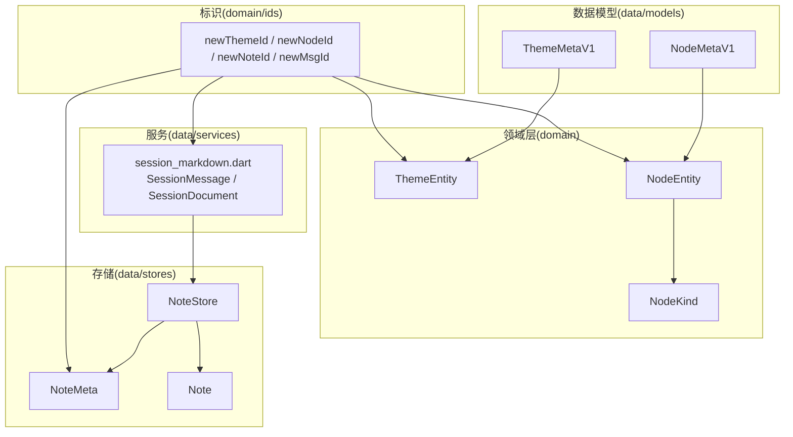
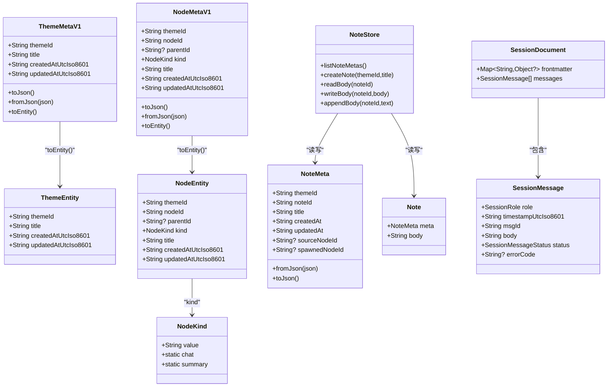
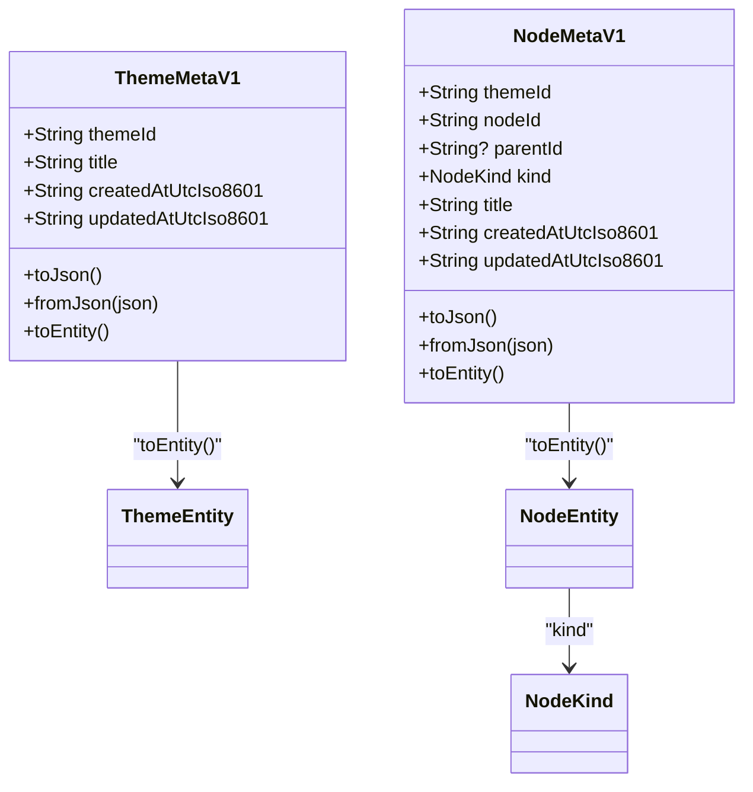
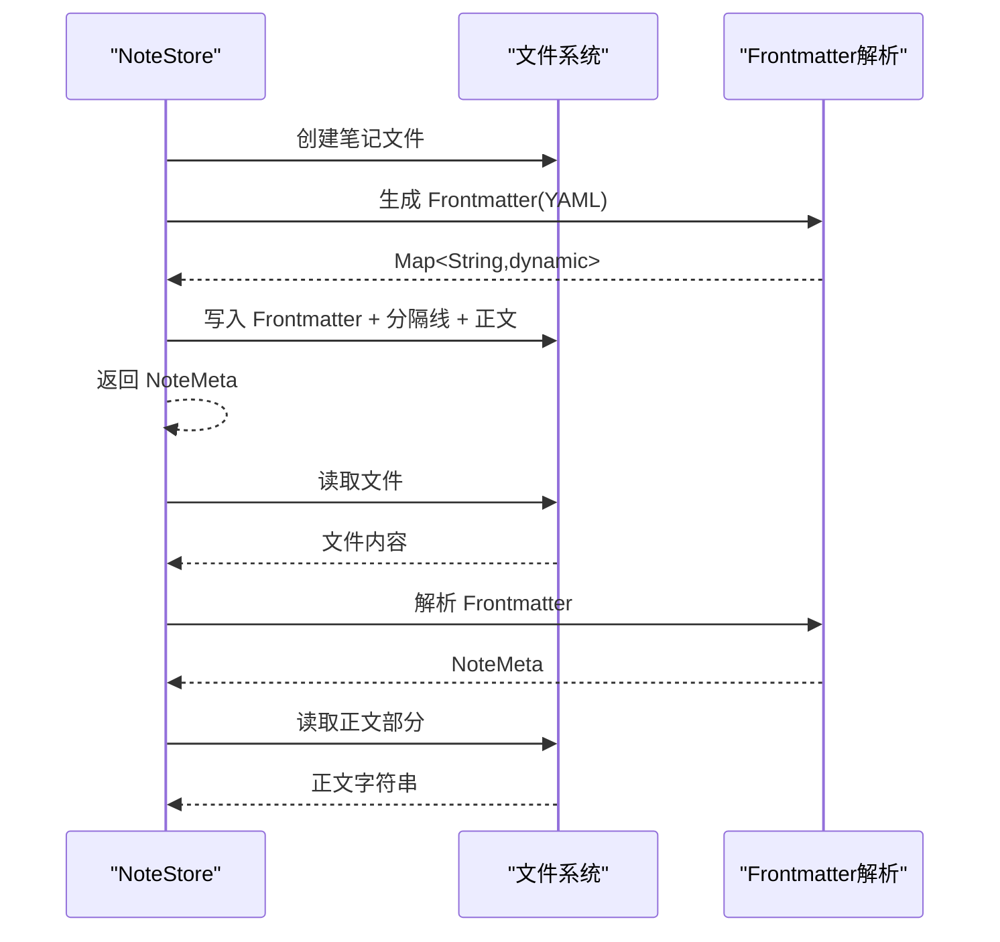
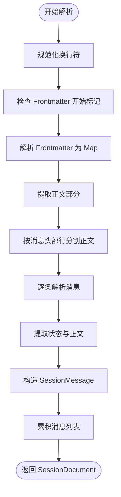
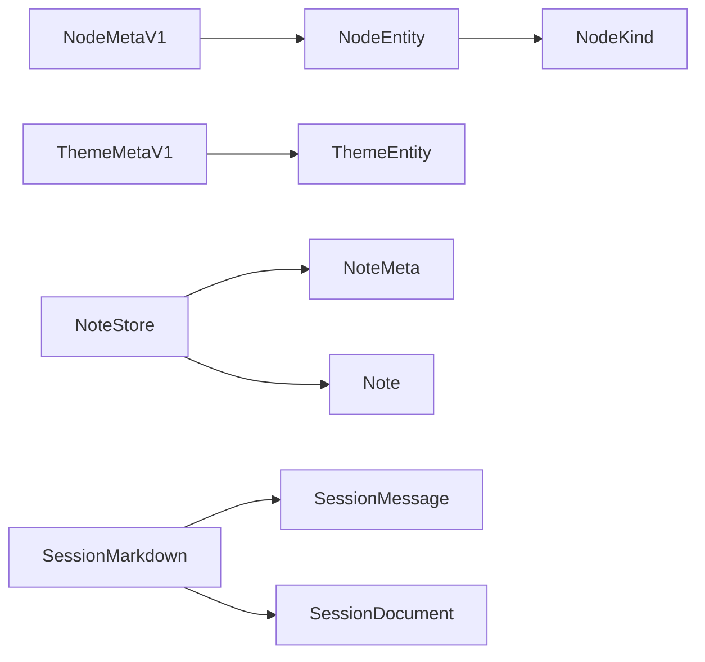

# 数据模型设计

<cite>
**本文引用的文件**
- [lib/data/models/node_meta.dart](file://lib/data/models/node_meta.dart)
- [lib/data/models/theme_meta.dart](file://lib/data/models/theme_meta.dart)
- [lib/domain/node.dart](file://lib/domain/node.dart)
- [lib/domain/theme.dart](file://lib/domain/theme.dart)
- [lib/data/stores/note_store.dart](file://lib/data/stores/note_store.dart)
- [lib/data/services/session_markdown.dart](file://lib/data/services/session_markdown.dart)
- [lib/domain/ids.dart](file://lib/domain/ids.dart)
</cite>

## 目录
1. [简介](#简介)
2. [项目结构](#项目结构)
3. [核心组件](#核心组件)
4. [架构总览](#架构总览)
5. [详细组件分析](#详细组件分析)
6. [依赖分析](#依赖分析)
7. [性能考虑](#性能考虑)
8. [故障排查指南](#故障排查指南)
9. [结论](#结论)
10. [附录](#附录)

## 简介
本文件系统性梳理 ThkTree 的数据模型设计，聚焦以下核心实体与关系：
- 主题与节点元数据：ThemeEntity、NodeEntity 及其对应的 V1 版本序列化模型 ThemeMetaV1、NodeMetaV1
- 笔记模型：NoteMeta、Note 以及笔记存储 NoteStore
- 会话消息模型：SessionMessage、SessionDocument 及其解析与格式化工具
- 标识生成：统一的 ULID 前缀 ID 生成策略
- 关系映射：主题与节点的父子层级、笔记来源与派生关系、会话消息与时间戳/状态的绑定
- 验证与规则：模式(schema)校验、字段存在性与类型检查、错误状态标记
- 序列化与反序列化：JSON/YAML 解析、字符串编码、前端数据块解析
- 演进与兼容：通过 schema 字段区分版本，支持未来迁移
- 使用示例与最佳实践：创建、读取、更新、追加笔记；解析会话 Markdown；构建节点树

## 项目结构
围绕数据模型的关键目录与文件如下：
- domain 层：定义不可变的领域实体（ThemeEntity、NodeEntity、NodeKind）
- data/models 层：提供面向持久化的 V1 元数据模型（ThemeMetaV1、NodeMetaV1），负责 JSON 序列化/反序列化
- data/stores 层：笔记存储 NoteStore，负责 YAML Frontmatter 与正文的读写、排序与更新
- data/services 层：会话 Markdown 解析器，负责将对话内容解析为消息列表与前端数据块
- domain/ids 层：统一的 ULID 前缀 ID 生成策略

图表来源
- [lib/domain/theme.dart:1-15](file://lib/domain/theme.dart#L1-L15)
- [lib/domain/node.dart:1-30](file://lib/domain/node.dart#L1-L30)
- [lib/data/models/theme_meta.dart:1-61](file://lib/data/models/theme_meta.dart#L1-L61)
- [lib/data/models/node_meta.dart:1-83](file://lib/data/models/node_meta.dart#L1-L83)
- [lib/data/stores/note_store.dart:1-203](file://lib/data/stores/note_store.dart#L1-L203)
- [lib/data/services/session_markdown.dart:1-223](file://lib/data/services/session_markdown.dart#L1-L223)
- [lib/domain/ids.dart:1-10](file://lib/domain/ids.dart#L1-L10)

章节来源
- [lib/domain/theme.dart:1-15](file://lib/domain/theme.dart#L1-L15)
- [lib/domain/node.dart:1-30](file://lib/domain/node.dart#L1-L30)
- [lib/data/models/theme_meta.dart:1-61](file://lib/data/models/theme_meta.dart#L1-L61)
- [lib/data/models/node_meta.dart:1-83](file://lib/data/models/node_meta.dart#L1-L83)
- [lib/data/stores/note_store.dart:1-203](file://lib/data/stores/note_store.dart#L1-L203)
- [lib/data/services/session_markdown.dart:1-223](file://lib/data/services/session_markdown.dart#L1-L223)
- [lib/domain/ids.dart:1-10](file://lib/domain/ids.dart#L1-L10)

## 核心组件
本节对关键数据模型进行字段定义、类型与约束说明，并给出关系映射与验证规则。

- ThemeEntity（主题）
  - 字段
    - themeId: 字符串，唯一标识，建议采用 newThemeId 生成
    - title: 字符串，主题标题
    - createdAtUtcIso8601: 字符串，ISO8601 UTC 时间戳
    - updatedAtUtcIso8601: 字符串，ISO8601 UTC 时间戳
  - 约束
    - 所有字符串字段非空
    - 时间戳应为合法 ISO8601 UTC 字符串
  - 关系
    - 与 NodeEntity 通过 themeId 建立一对多关系（一个主题可包含多个节点）

- NodeEntity（节点）
  - 字段
    - themeId: 字符串，所属主题标识
    - nodeId: 字符串，节点唯一标识，建议采用 newNodeId 生成
    - parentId: 字符串或空，父节点标识；根节点可为空
    - kind: 枚举 NodeKind，取值限定为 chat 或 summary
    - title: 字符串，节点标题
    - createdAtUtcIso8601: 字符串，ISO8601 UTC 时间戳
    - updatedAtUtcIso8601: 字符串，ISO8601 UTC 时间戳
  - 约束
    - kind 必须为已知枚举值，否则反序列化失败
    - parentId 可为空（根节点）或指向有效 nodeId
    - 时间戳应为合法 ISO8601 UTC 字符串
  - 关系
    - 通过 parentId 形成树形层级（父子节点）

- ThemeMetaV1（主题元数据 V1）
  - 字段
    - themeId: 字符串
    - title: 字符串
    - createdAtUtcIso8601: 字符串
    - updatedAtUtcIso8601: 字符串
  - 约束
    - schema 固定为 "theme_meta/v1"
    - 反序列化时若 schema 不匹配抛出格式异常
  - 转换
    - toEntity(): 转换为 ThemeEntity

- NodeMetaV1（节点元数据 V1）
  - 字段
    - themeId: 字符串
    - nodeId: 字符串
    - parentId: 字符串或空
    - kind: 字符串，映射到 NodeKind
    - title: 字符串
    - createdAtUtcIso8601: 字符串
    - updatedAtUtcIso8601: 字符串
  - 约束
    - schema 固定为 "node_meta/v1"
    - kind 字符串必须为 "chat" 或 "summary"，否则抛出格式异常
    - 反序列化时若 schema 不匹配抛出格式异常
  - 转换
    - toEntity(): 转换为 NodeEntity

- NoteMeta（笔记元数据）
  - 字段
    - themeId: 字符串
    - noteId: 字符串，笔记唯一标识，建议采用 newNoteId 生成
    - title: 字符串
    - createdAt: 字符串（建议 ISO8601 UTC）
    - updatedAt: 字符串（建议 ISO8601 UTC）
    - sourceNodeId: 字符串或空，来源节点标识
    - spawnedNodeId: 字符串或空，派生节点标识
  - 约束
    - sourceNodeId 与 spawnedNodeId 互不影响，可独立为空
    - 反序列化时从 YAML Frontmatter 中提取字段
  - 转换
    - fromJson(): 从 Map 构造
    - toJson(): 输出 Frontmatter 字段集合

- Note（笔记）
  - 字段
    - meta: NoteMeta
    - body: 字符串，正文内容
  - 约束
    - body 可为空字符串
  - 存储
    - 采用 YAML Frontmatter + 分隔线 + 正文的文件结构

- SessionMessage（会话消息）
  - 字段
    - role: 枚举 SessionRole，取值 user/assistant/system
    - timestampUtcIso8601: 字符串，ISO8601 UTC 时间戳
    - msgId: 字符串，消息唯一标识，建议采用 newMsgId 生成
    - body: 字符串，消息正文
    - status: 枚举 SessionMessageStatus，取值 done/streaming/error
    - errorCode: 字符串或空，错误码
  - 约束
    - status 由正文末尾注释推断：done、<!-- streaming -->、<!-- error: {code} -->
    - msgId 与时间戳需与头部行一致

- SessionDocument（会话文档）
  - 字段
    - frontmatter: Map<String, Object?>
    - messages: List<SessionMessage>
  - 约束
    - frontmatter 以 "---" 包裹的 YAML 块
    - 消息以特定头部行分隔，正文按行解析

章节来源
- [lib/domain/theme.dart:1-15](file://lib/domain/theme.dart#L1-L15)
- [lib/domain/node.dart:1-30](file://lib/domain/node.dart#L1-L30)
- [lib/data/models/theme_meta.dart:1-61](file://lib/data/models/theme_meta.dart#L1-L61)
- [lib/data/models/node_meta.dart:1-83](file://lib/data/models/node_meta.dart#L1-L83)
- [lib/data/stores/note_store.dart:1-203](file://lib/data/stores/note_store.dart#L1-L203)
- [lib/data/services/session_markdown.dart:1-223](file://lib/data/services/session_markdown.dart#L1-L223)
- [lib/domain/ids.dart:1-10](file://lib/domain/ids.dart#L1-L10)

## 架构总览
下图展示数据模型在各层之间的交互与转换关系：

图表来源
- [lib/domain/theme.dart:1-15](file://lib/domain/theme.dart#L1-L15)
- [lib/domain/node.dart:1-30](file://lib/domain/node.dart#L1-L30)
- [lib/data/models/theme_meta.dart:1-61](file://lib/data/models/theme_meta.dart#L1-L61)
- [lib/data/models/node_meta.dart:1-83](file://lib/data/models/node_meta.dart#L1-L83)
- [lib/data/stores/note_store.dart:1-203](file://lib/data/stores/note_store.dart#L1-L203)
- [lib/data/services/session_markdown.dart:1-223](file://lib/data/services/session_markdown.dart#L1-L223)

## 详细组件分析

### 主题与节点模型（ThemeEntity / NodeEntity / ThemeMetaV1 / NodeMetaV1）
- 设计要点
  - 领域实体不可变，仅包含必要字段与只读属性
  - V1 元数据模型提供 JSON 序列化/反序列化能力，包含 schema 版本字段
  - NodeKind 通过常量枚举限制取值，确保一致性
- 关系映射
  - NodeEntity 通过 themeId 关联 ThemeEntity
  - NodeEntity 通过 parentId 建立父子树关系（根节点可无父节点）
- 验证与规则
  - 反序列化时严格校验 schema 与 kind 字段
  - 时间戳采用 ISO8601 UTC 字符串，便于跨时区比较
- 序列化/反序列化
  - V1 模型提供 toJson()/fromJson()，并支持 toEntity() 转换到领域实体

图表来源
- [lib/data/models/theme_meta.dart:1-61](file://lib/data/models/theme_meta.dart#L1-L61)
- [lib/data/models/node_meta.dart:1-83](file://lib/data/models/node_meta.dart#L1-L83)
- [lib/domain/node.dart:1-30](file://lib/domain/node.dart#L1-L30)
- [lib/domain/theme.dart:1-15](file://lib/domain/theme.dart#L1-L15)

章节来源
- [lib/data/models/theme_meta.dart:1-61](file://lib/data/models/theme_meta.dart#L1-L61)
- [lib/data/models/node_meta.dart:1-83](file://lib/data/models/node_meta.dart#L1-L83)
- [lib/domain/node.dart:1-30](file://lib/domain/node.dart#L1-L30)
- [lib/domain/theme.dart:1-15](file://lib/domain/theme.dart#L1-L15)

### 笔记模型（NoteMeta / Note / NoteStore）
- 设计要点
  - NoteMeta 表示笔记的元信息（主题、标题、时间、来源/派生节点）
  - Note 将元信息与正文组合
  - NoteStore 提供文件系统层面的 CRUD：列出、创建、读取正文、写入正文、追加正文
- 关系映射
  - NoteMeta 通过 themeId 关联主题
  - NoteMeta 的 sourceNodeId 与 spawnedNodeId 可分别指向来源节点与派生节点
- 验证与规则
  - Frontmatter 以 "---" 包裹，键值对解析严格
  - 写入/追加时自动更新 updatedAt
- 序列化/反序列化
  - NoteMeta 支持 fromJson()/toJson()
  - NoteStore 内部使用简单 YAML 解析器处理 Frontmatter

图表来源
- [lib/data/stores/note_store.dart:1-203](file://lib/data/stores/note_store.dart#L1-L203)

章节来源
- [lib/data/stores/note_store.dart:1-203](file://lib/data/stores/note_store.dart#L1-L203)

### 会话消息模型（SessionMessage / SessionDocument / 解析流程）
- 设计要点
  - SessionMessage 描述单条消息的角色、时间戳、ID、正文与状态
  - SessionDocument 封装 Frontmatter 与消息列表
  - 解析器支持从 Markdown 文档中提取 Frontmatter 与消息块
- 关系映射
  - SessionDocument 包含多个 SessionMessage
  - 消息头部包含角色、时间戳、消息 ID
  - 正文末尾注释用于标记状态（done/streaming/error）
- 验证与规则
  - Frontmatter 必须以 "---" 包裹且为合法 YAML
  - 消息头部正则匹配失败时抛出格式异常
  - 状态由正文末尾注释推断
- 序列化/反序列化
  - 使用 YAML 解析器加载 Frontmatter
  - 消息头格式化函数用于输出标准头部行

图表来源
- [lib/data/services/session_markdown.dart:1-223](file://lib/data/services/session_markdown.dart#L1-L223)

章节来源
- [lib/data/services/session_markdown.dart:1-223](file://lib/data/services/session_markdown.dart#L1-L223)

### 标识生成（ULID 前缀）
- 设计要点
  - 统一使用 ULID 生成全局唯一 ID，并添加前缀（thm_/nd_/nt_/msg_/req_）
  - 保证主题、节点、笔记、消息、请求 ID 的唯一性与可读性
- 使用建议
  - 在创建实体时调用对应的新 ID 函数
  - 避免手动拼接 ID，确保格式一致性

章节来源
- [lib/domain/ids.dart:1-10](file://lib/domain/ids.dart#L1-L10)

## 依赖分析
- 模型依赖
  - NodeEntity 依赖 NodeKind 枚举
  - V1 元数据模型依赖领域实体进行转换
  - NoteStore 依赖 NoteMeta/Note 进行文件读写
  - 会话解析依赖 YAML 解析器与正则表达式
- 外部依赖
  - YAML 解析：用于 Frontmatter 解析
  - ULID：用于生成全局唯一标识
- 循环依赖
  - 当前模型未发现循环依赖，层次清晰

图表来源
- [lib/data/models/node_meta.dart:1-83](file://lib/data/models/node_meta.dart#L1-L83)
- [lib/data/models/theme_meta.dart:1-61](file://lib/data/models/theme_meta.dart#L1-L61)
- [lib/domain/node.dart:1-30](file://lib/domain/node.dart#L1-L30)
- [lib/data/stores/note_store.dart:1-203](file://lib/data/stores/note_store.dart#L1-L203)
- [lib/data/services/session_markdown.dart:1-223](file://lib/data/services/session_markdown.dart#L1-L223)

章节来源
- [lib/data/models/node_meta.dart:1-83](file://lib/data/models/node_meta.dart#L1-L83)
- [lib/data/models/theme_meta.dart:1-61](file://lib/data/models/theme_meta.dart#L1-L61)
- [lib/domain/node.dart:1-30](file://lib/domain/node.dart#L1-L30)
- [lib/data/stores/note_store.dart:1-203](file://lib/data/stores/note_store.dart#L1-L203)
- [lib/data/services/session_markdown.dart:1-223](file://lib/data/services/session_markdown.dart#L1-L223)

## 性能考虑
- 文件 I/O
  - NoteStore 对每个操作均进行文件读写，建议批量操作或缓存热点数据
  - 列表排序按 updatedAt 降序，注意大数据量时的排序成本
- 解析复杂度
  - 会话解析按行扫描，时间复杂度 O(N)，其中 N 为正文行数
  - YAML Frontmatter 解析为 O(M)，M 为 Frontmatter 键值数量
- 序列化开销
  - JSON/YAML 序列化/反序列化成本较低，适合频繁读写场景
- 并发与锁
  - 文件系统写入需避免并发冲突，建议引入写队列或文件锁

## 故障排查指南
- 反序列化异常
  - NodeMetaV1/ThemeMetaV1：当 schema 不匹配或字段缺失时抛出格式异常
  - 会话解析：Frontmatter 缺失、格式不合法、消息头部不匹配均会抛出格式异常
- 文件读写异常
  - NoteStore：文件不存在、权限不足、磁盘空间不足会导致读写失败
  - 建议捕获异常并记录日志，回退到默认值或提示用户重试
- 状态判断问题
  - 会话消息状态由正文末尾注释推断，若注释格式不正确可能导致状态误判
  - 建议在写入时严格遵循状态注释规范

章节来源
- [lib/data/models/node_meta.dart:1-83](file://lib/data/models/node_meta.dart#L1-L83)
- [lib/data/models/theme_meta.dart:1-61](file://lib/data/models/theme_meta.dart#L1-L61)
- [lib/data/services/session_markdown.dart:1-223](file://lib/data/services/session_markdown.dart#L1-L223)
- [lib/data/stores/note_store.dart:1-203](file://lib/data/stores/note_store.dart#L1-L203)

## 结论
ThkTree 的数据模型以领域实体为核心，结合 V1 元数据模型与文件存储实现，具备良好的扩展性与可维护性。通过 schema 版本控制与严格的字段校验，确保了数据一致性与演进兼容。会话解析与笔记存储提供了完整的输入输出链路。建议在生产环境中进一步完善并发控制、错误恢复与监控告警机制。

## 附录
- 使用示例与最佳实践
  - 创建主题与节点
    - 使用 newThemeId/newNodeId 生成标识
    - 通过 ThemeMetaV1/NodeMetaV1 进行序列化/反序列化
  - 管理笔记
    - 使用 NoteStore.createNote 创建笔记，自动写入 Frontmatter
    - 使用 writeBody/appendBody 更新正文，自动更新 updatedAt
  - 解析会话
    - 使用 parseSessionMarkdown 解析 Markdown 文档
    - 使用 formatMessageHeader 生成标准消息头部
  - 关系建立
    - NodeEntity.parentId 指向父节点 nodeId，形成树形结构
    - NoteMeta.sourceNodeId/spawnedNodeId 建立笔记来源与派生关系