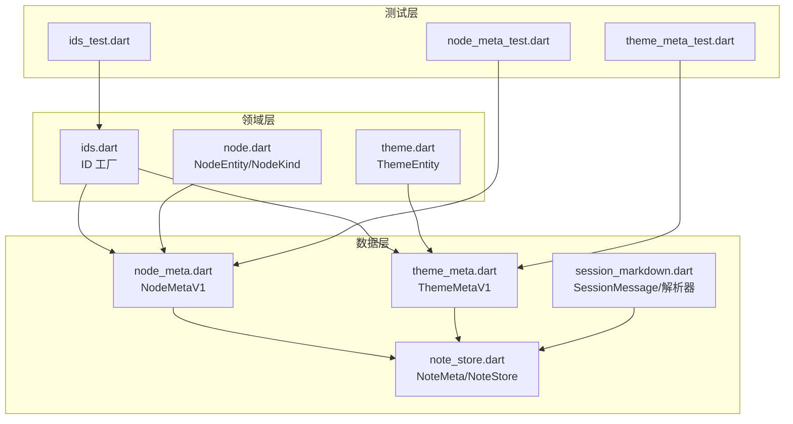
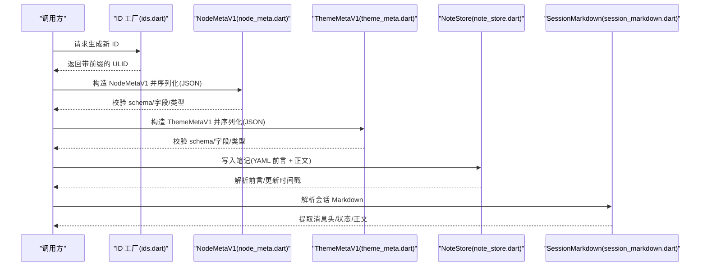
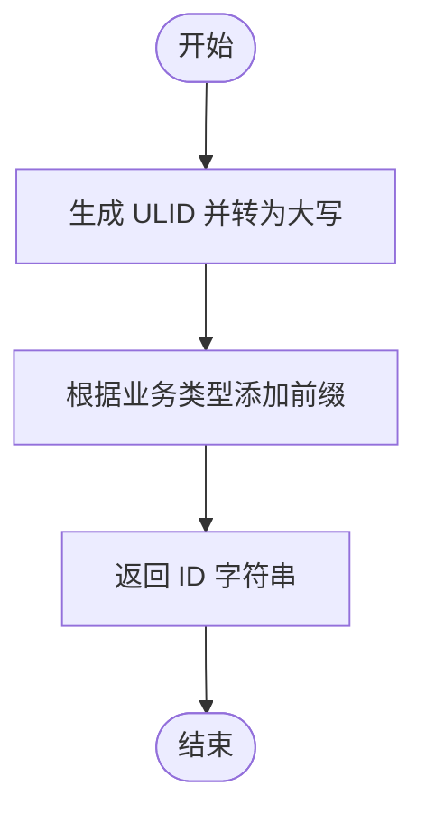
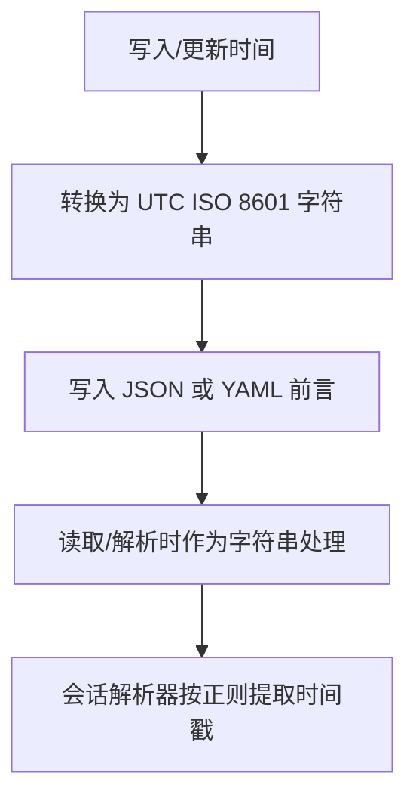
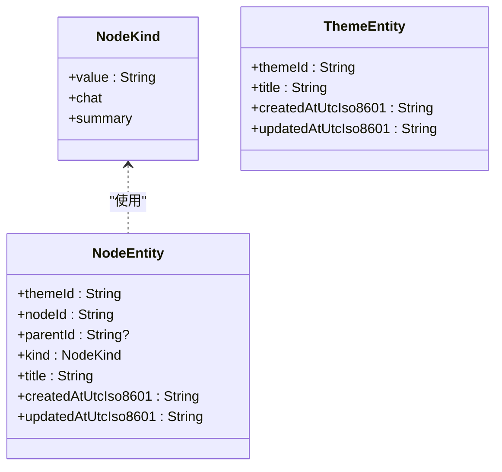
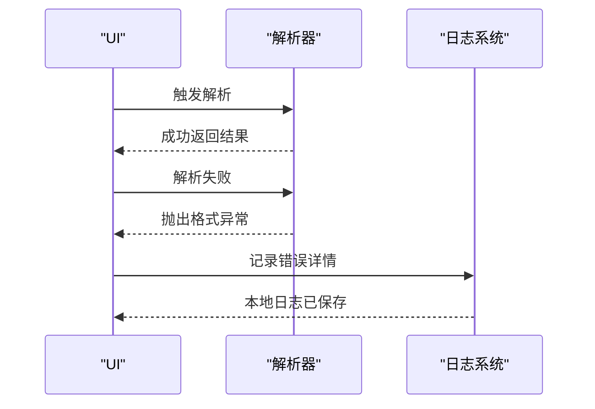
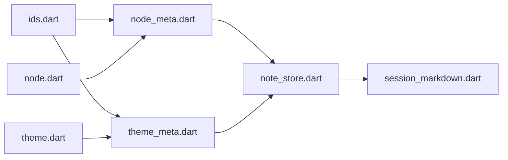

# 数据验证规则

<cite>
**本文引用的文件**
- [lib/domain/ids.dart](file://lib/domain/ids.dart)
- [lib/domain/node.dart](file://lib/domain/node.dart)
- [lib/domain/theme.dart](file://lib/domain/theme.dart)
- [lib/data/models/node_meta.dart](file://lib/data/models/node_meta.dart)
- [lib/data/models/theme_meta.dart](file://lib/data/models/theme_meta.dart)
- [lib/data/stores/note_store.dart](file://lib/data/stores/note_store.dart)
- [lib/data/services/session_markdown.dart](file://lib/data/services/session_markdown.dart)
- [test/domain/ids_test.dart](file://test/domain/ids_test.dart)
- [test/data/models/node_meta_test.dart](file://test/data/models/node_meta_test.dart)
- [test/data/models/theme_meta_test.dart](file://test/data/models/theme_meta_test.dart)
</cite>

## 目录
1. [简介](#简介)
2. [项目结构](#项目结构)
3. [核心组件](#核心组件)
4. [架构总览](#架构总览)
5. [详细组件分析](#详细组件分析)
6. [依赖分析](#依赖分析)
7. [性能考虑](#性能考虑)
8. [故障排查指南](#故障排查指南)
9. [结论](#结论)
10. [附录](#附录)

## 简介
本文件系统性梳理 ThkTree 的数据验证规则与约束，覆盖以下方面：
- 实体 ID 生成与验证：UUID（ULID）生成、前缀约定、冲突检测策略
- 时间戳格式与时区：ISO 8601 字符串、UTC 强制、解析与序列化
- 字符串与内容：长度限制、字符集与特殊字符处理、Markdown/YAML 前言解析
- 业务规则：父子节点关系、主题归属、消息状态与会话结构
- 错误处理与用户反馈：异常类型、日志记录、远程上报降级
- 配置与自定义：模式字段(schema)、枚举值校验、正则表达式

## 项目结构
围绕“领域模型 → 数据模型 → 存储/服务”的分层组织，验证逻辑主要分布在：
- 领域层：ID 工厂、实体定义（节点、主题）
- 数据层：版本化元数据模型（NodeMetaV1、ThemeMetaV1）、笔记存储、会话 Markdown 解析
- 测试层：对 JSON 序列化/反序列化、Schema 校验、ID 前缀等进行断言

图表来源
- [lib/domain/ids.dart:1-10](file://lib/domain/ids.dart#L1-L10)
- [lib/domain/node.dart:1-30](file://lib/domain/node.dart#L1-L30)
- [lib/domain/theme.dart:1-15](file://lib/domain/theme.dart#L1-L15)
- [lib/data/models/node_meta.dart:1-83](file://lib/data/models/node_meta.dart#L1-L83)
- [lib/data/models/theme_meta.dart:1-61](file://lib/data/models/theme_meta.dart#L1-L61)
- [lib/data/stores/note_store.dart:1-203](file://lib/data/stores/note_store.dart#L1-L203)
- [lib/data/services/session_markdown.dart:1-223](file://lib/data/services/session_markdown.dart#L1-L223)
- [test/domain/ids_test.dart:1-14](file://test/domain/ids_test.dart#L1-L14)
- [test/data/models/node_meta_test.dart:1-113](file://test/data/models/node_meta_test.dart#L1-L113)
- [test/data/models/theme_meta_test.dart:1-79](file://test/data/models/theme_meta_test.dart#L1-L79)

章节来源
- [lib/domain/ids.dart:1-10](file://lib/domain/ids.dart#L1-L10)
- [lib/data/models/node_meta.dart:1-83](file://lib/data/models/node_meta.dart#L1-L83)
- [lib/data/models/theme_meta.dart:1-61](file://lib/data/models/theme_meta.dart#L1-L61)
- [lib/data/stores/note_store.dart:1-203](file://lib/data/stores/note_store.dart#L1-L203)
- [lib/data/services/session_markdown.dart:1-223](file://lib/data/services/session_markdown.dart#L1-L223)

## 核心组件
- ID 工厂：统一生成带前缀的 ULID，确保全局唯一性与可读性
- 元数据模型：以 schema 版本标识的 JSON 结构，严格字段与类型校验
- 实体对象：领域层强类型封装，用于业务处理
- 存储与解析：笔记文件的 YAML 前言解析、会话 Markdown 的结构化解析

章节来源
- [lib/domain/ids.dart:1-10](file://lib/domain/ids.dart#L1-L10)
- [lib/data/models/node_meta.dart:1-83](file://lib/data/models/node_meta.dart#L1-L83)
- [lib/data/models/theme_meta.dart:1-61](file://lib/data/models/theme_meta.dart#L1-L61)
- [lib/domain/node.dart:1-30](file://lib/domain/node.dart#L1-L30)
- [lib/domain/theme.dart:1-15](file://lib/domain/theme.dart#L1-L15)
- [lib/data/stores/note_store.dart:1-203](file://lib/data/stores/note_store.dart#L1-L203)
- [lib/data/services/session_markdown.dart:1-223](file://lib/data/services/session_markdown.dart#L1-L223)

## 架构总览
下图展示从输入到输出的关键验证路径：ID 生成、JSON 反序列化校验、实体转换、文件写入与解析。

图表来源
- [lib/domain/ids.dart:1-10](file://lib/domain/ids.dart#L1-L10)
- [lib/data/models/node_meta.dart:39-68](file://lib/data/models/node_meta.dart#L39-L68)
- [lib/data/models/theme_meta.dart:30-49](file://lib/data/models/theme_meta.dart#L30-L49)
- [lib/data/stores/note_store.dart:81-136](file://lib/data/stores/note_store.dart#L81-L136)
- [lib/data/services/session_markdown.dart:49-61](file://lib/data/services/session_markdown.dart#L49-L61)

## 详细组件分析

### ID 生成与验证机制
- 生成策略
  - 使用 ULID 生成器，转为大写字符串，并添加业务前缀（主题、节点、笔记、消息、请求）
  - 前缀与 ULID 组合形成稳定格式，便于识别与检索
- 冲突检测
  - 采用全局唯一标识，冲突概率极低；若需进一步保障，可在上层存储或索引层增加唯一约束与回退重试
- 测试验证
  - 单元测试断言各 ID 生成函数返回值均带有预期前缀

图表来源
- [lib/domain/ids.dart:3-9](file://lib/domain/ids.dart#L3-L9)
- [test/domain/ids_test.dart:5-11](file://test/domain/ids_test.dart#L5-L11)

章节来源
- [lib/domain/ids.dart:1-10](file://lib/domain/ids.dart#L1-L10)
- [test/domain/ids_test.dart:1-14](file://test/domain/ids_test.dart#L1-L14)

### 时间戳格式与时区处理
- 格式规范
  - 统一使用 ISO 8601 字符串表示时间
  - 持续使用 UTC 时区，避免本地化差异导致的数据不一致
- 生成与解析
  - 创建/更新时写入当前 UTC 时间
  - 解析阶段按字符串直接保留，不做时区转换
- 会话 Markdown
  - 消息头包含 UTC 时间戳，解析器通过正则提取并构造消息对象

图表来源
- [lib/data/stores/note_store.dart:86-94](file://lib/data/stores/note_store.dart#L86-L94)
- [lib/data/stores/note_store.dart:110-115](file://lib/data/stores/note_store.dart#L110-L115)
- [lib/data/stores/note_store.dart:170-179](file://lib/data/stores/note_store.dart#L170-L179)
- [lib/data/services/session_markdown.dart:44-47](file://lib/data/services/session_markdown.dart#L44-L47)
- [lib/data/services/session_markdown.dart:145-152](file://lib/data/services/session_markdown.dart#L145-L152)

章节来源
- [lib/data/stores/note_store.dart:81-136](file://lib/data/stores/note_store.dart#L81-L136)
- [lib/data/services/session_markdown.dart:49-61](file://lib/data/services/session_markdown.dart#L49-L61)

### 字符串长度限制、字符集与特殊字符过滤
- JSON/YAML 字段
  - 所有涉及字符串的字段在模型中以字符串类型声明，未见显式的长度上限
- Markdown 前言
  - 使用 YAML 解析器加载前言，字符串值自动解码；对引号内的双引号进行转义处理
- 会话 Markdown
  - 正则匹配消息头，仅做格式校验，不对正文做额外长度限制
- 建议
  - 对标题等关键字段建议在上层增加长度限制与非法字符白名单
  - 对正文内容建议进行安全过滤与长度控制

章节来源
- [lib/data/models/node_meta.dart:24-35](file://lib/data/models/node_meta.dart#L24-L35)
- [lib/data/models/theme_meta.dart:18-26](file://lib/data/models/theme_meta.dart#L18-L26)
- [lib/data/stores/note_store.dart:153-200](file://lib/data/stores/note_store.dart#L153-L200)
- [lib/data/services/session_markdown.dart:44-47](file://lib/data/services/session_markdown.dart#L44-L47)

### 业务规则验证
- 节点类型
  - NodeKind 限定为预定义枚举值，反序列化时对未知值抛出格式异常
- 父子节点关系
  - NodeMetaV1 支持 parentId 为空或指向有效节点 ID；实际树形约束由上层业务逻辑保证
- 主题归属
  - NodeMetaV1/ThemeMetaV1 均要求 themeId 与主题存在对应关系；具体校验在上层存储或服务层执行
- 会话消息状态
  - 支持 done/streaming/error 三种状态，解析器根据尾部注释标记设置状态与错误码

图表来源
- [lib/domain/node.dart:1-30](file://lib/domain/node.dart#L1-L30)
- [lib/domain/theme.dart:1-15](file://lib/domain/theme.dart#L1-L15)

章节来源
- [lib/data/models/node_meta.dart:39-68](file://lib/data/models/node_meta.dart#L39-L68)
- [lib/data/models/theme_meta.dart:30-49](file://lib/data/models/theme_meta.dart#L30-L49)
- [lib/data/services/session_markdown.dart:159-184](file://lib/data/services/session_markdown.dart#L159-L184)

### 验证错误处理与用户反馈
- 异常类型
  - 反序列化失败抛出格式异常；前端可通过捕获异常并提示用户修正输入
- 日志与远程上报
  - 远程发送失败时，记录诊断日志到本地文件，避免丢失错误信息
- 会话状态反馈
  - streaming/error 状态通过尾部注释标记，便于 UI 展示与用户感知

图表来源
- [lib/data/services/session_markdown.dart:63-88](file://lib/data/services/session_markdown.dart#L63-L88)
- [lib/ui/core/app_logger.dart:166-196](file://lib/ui/core/app_logger.dart#L166-L196)

章节来源
- [lib/data/services/session_markdown.dart:63-88](file://lib/data/services/session_markdown.dart#L63-L88)
- [lib/ui/core/app_logger.dart:166-196](file://lib/ui/core/app_logger.dart#L166-L196)

### 验证规则配置与自定义
- 模式字段(schema)
  - NodeMetaV1/ThemeMetaV1 在 JSON 中携带 schema 字段，用于版本识别与兼容性检查
- 枚举与类型
  - NodeKind 与消息状态枚举在解析时进行严格匹配
- 正则表达式
  - 会话消息头使用正则表达式进行格式校验，确保角色、时间戳、消息 ID 的一致性
- 自定义扩展
  - 可通过新增 schema 版本与对应的 fromJson 分支实现向后兼容
  - 可在 NoteStore/SessionMarkdown 中扩展字段与校验逻辑

章节来源
- [lib/data/models/node_meta.dart:24-35](file://lib/data/models/node_meta.dart#L24-L35)
- [lib/data/models/theme_meta.dart:18-26](file://lib/data/models/theme_meta.dart#L18-L26)
- [lib/data/services/session_markdown.dart:44-47](file://lib/data/services/session_markdown.dart#L44-L47)

## 依赖分析
- 组件耦合
  - 元数据模型依赖领域实体；NoteStore/SessionMarkdown 依赖模型与 ID 工厂
- 外部依赖
  - ULID 生成器、YAML 解析库、正则表达式
- 循环依赖
  - 当前结构无循环导入，职责清晰

图表来源
- [lib/domain/ids.dart:1-10](file://lib/domain/ids.dart#L1-L10)
- [lib/domain/node.dart:1-30](file://lib/domain/node.dart#L1-L30)
- [lib/domain/theme.dart:1-15](file://lib/domain/theme.dart#L1-L15)
- [lib/data/models/node_meta.dart:1-83](file://lib/data/models/node_meta.dart#L1-L83)
- [lib/data/models/theme_meta.dart:1-61](file://lib/data/models/theme_meta.dart#L1-L61)
- [lib/data/stores/note_store.dart:1-203](file://lib/data/stores/note_store.dart#L1-L203)
- [lib/data/services/session_markdown.dart:1-223](file://lib/data/services/session_markdown.dart#L1-L223)

章节来源
- [lib/domain/ids.dart:1-10](file://lib/domain/ids.dart#L1-L10)
- [lib/data/models/node_meta.dart:1-83](file://lib/data/models/node_meta.dart#L1-L83)
- [lib/data/models/theme_meta.dart:1-61](file://lib/data/models/theme_meta.dart#L1-L61)
- [lib/data/stores/note_store.dart:1-203](file://lib/data/stores/note_store.dart#L1-L203)
- [lib/data/services/session_markdown.dart:1-223](file://lib/data/services/session_markdown.dart#L1-L223)

## 性能考虑
- 解析复杂度
  - YAML 前言解析与正则匹配均为线性复杂度，适合小到中型文档
- IO 影响
  - 文件读写为瓶颈，建议批量操作与缓存热点文件
- 并发与原子写
  - 会话完成/失败时采用队列顺序化写入，避免并发写冲突

## 故障排查指南
- JSON 反序列化失败
  - 检查 schema 是否正确、字段是否齐全、类型是否匹配
- 会话解析异常
  - 确认消息头格式是否符合正则表达式、时间戳是否为 UTC ISO 8601
- 文件写入问题
  - 确认目录存在且可写，注意换行符与 YAML 缩进
- 远程日志上报失败
  - 查看本地日志文件中的诊断条目，确认网络与权限

章节来源
- [test/data/models/node_meta_test.dart:62-90](file://test/data/models/node_meta_test.dart#L62-L90)
- [test/data/models/theme_meta_test.dart:35-60](file://test/data/models/theme_meta_test.dart#L35-L60)
- [lib/data/services/session_markdown.dart:63-88](file://lib/data/services/session_markdown.dart#L63-L88)
- [lib/ui/core/app_logger.dart:166-196](file://lib/ui/core/app_logger.dart#L166-L196)

## 结论
ThkTree 的数据验证以“强类型 + 明确格式 + 版本化 schema”为核心，结合 ID 前缀与 UTC 时间戳，提供了高可靠的数据交换与持久化能力。建议在上层业务中补充长度与字符集限制，并完善父子关系与主题归属的跨实体校验，以进一步提升系统的健壮性与可用性。

## 附录
- 关键字段与约束清单
  - NodeMetaV1/ThemeMetaV1：schema、themeId、nodeId/主题 title、createdAt/updatedAt（UTC ISO 8601）、NodeKind 枚举
  - NoteMeta：themeId、noteId、title、createdAt/updatedAt（UTC ISO 8601），可选 sourceNodeId/spawnedNodeId
  - SessionMessage：role、timestampUtcIso8601、msgId、body、status、errorCode（可选）