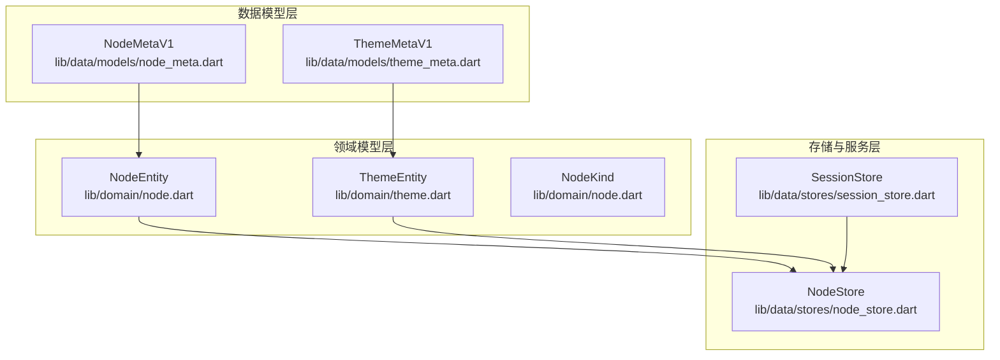
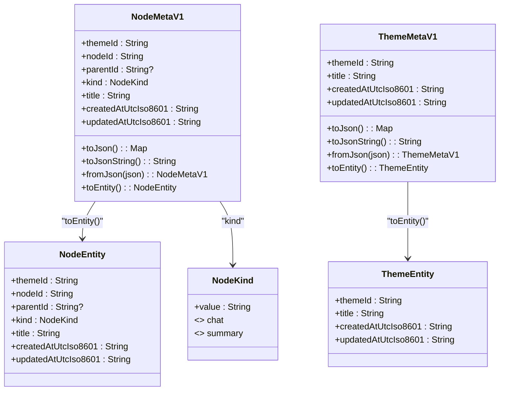
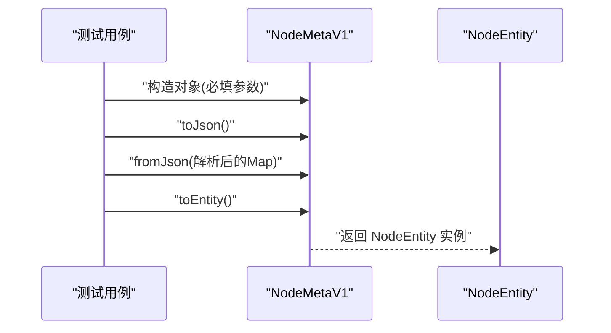
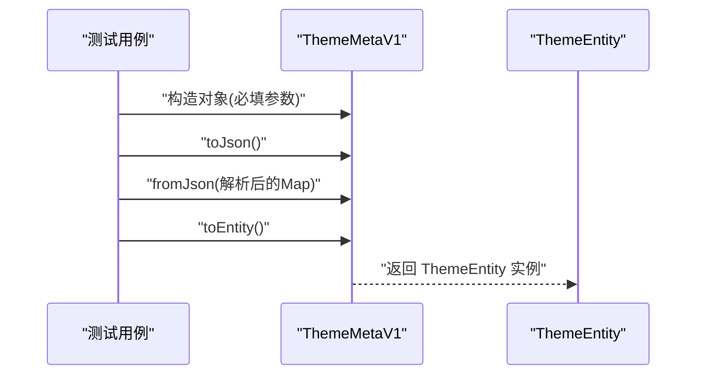
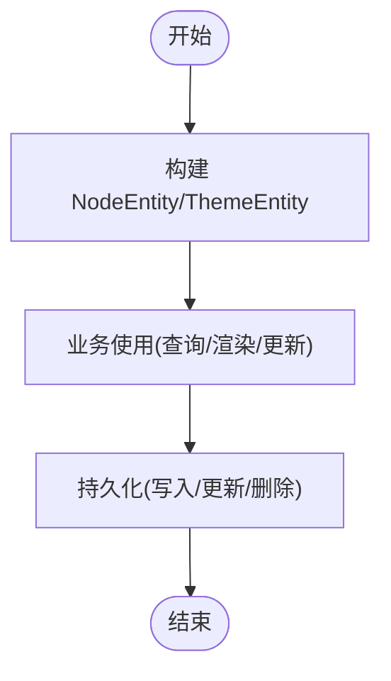
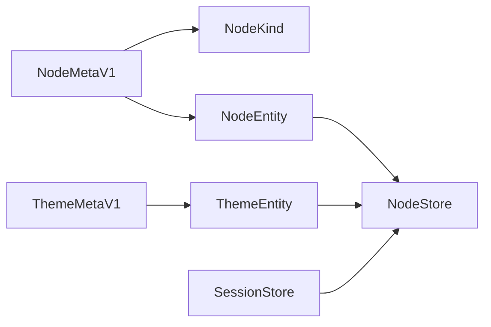

# 核心实体设计

<cite>
**本文引用的文件**
- [lib/data/models/node_meta.dart](file://lib/data/models/node_meta.dart)
- [lib/data/models/theme_meta.dart](file://lib/data/models/theme_meta.dart)
- [lib/domain/node.dart](file://lib/domain/node.dart)
- [lib/domain/theme.dart](file://lib/domain/theme.dart)
- [test/data/models/node_meta_test.dart](file://test/data/models/node_meta_test.dart)
- [test/data/models/theme_meta_test.dart](file://test/data/models/theme_meta_test.dart)
- [.agents/skills/flutter-implement-json-serialization/SKILL.md](file://.agents/skills/flutter-implement-json-serialization/SKILL.md)
- [lib/data/stores/node_store.dart](file://lib/data/stores/node_store.dart)
- [lib/data/stores/session_store.dart](file://lib/data/stores/session_store.dart)
</cite>

## 目录
1. [引言](#引言)
2. [项目结构](#项目结构)
3. [核心组件](#核心组件)
4. [架构总览](#架构总览)
5. [详细组件分析](#详细组件分析)
6. [依赖关系分析](#依赖关系分析)
7. [性能考量](#性能考量)
8. [故障排查指南](#故障排查指南)
9. [结论](#结论)
10. [附录](#附录)

## 引言
本文件聚焦 ThkTree 的核心数据实体与元数据模型，系统性梳理 NodeMetaV1、ThemeMetaV1 以及它们映射到的领域实体 NodeEntity、ThemeEntity 的设计理念、字段定义、序列化/反序列化实现、生命周期（创建/更新/删除）与使用实践。通过测试用例与源码路径，为开发者提供可追溯、可复用的参考。

## 项目结构
围绕“核心实体”的相关目录与文件组织如下：
- 数据模型层：lib/data/models 下的 NodeMetaV1、ThemeMetaV1
- 领域模型层：lib/domain 下的 NodeEntity、ThemeEntity 及 NodeKind 枚举
- 存储与服务层：lib/data/stores 下的 node_store.dart、session_store.dart
- 测试层：test/data/models 下的 node_meta_test.dart、theme_meta_test.dart

图表来源
- [lib/data/models/node_meta.dart:1-83](file://lib/data/models/node_meta.dart#L1-L83)
- [lib/data/models/theme_meta.dart:1-61](file://lib/data/models/theme_meta.dart#L1-L61)
- [lib/domain/node.dart:1-28](file://lib/domain/node.dart#L1-L28)
- [lib/domain/theme.dart:1-13](file://lib/domain/theme.dart#L1-L13)
- [lib/data/stores/node_store.dart:86-110](file://lib/data/stores/node_store.dart#L86-L110)
- [lib/data/stores/session_store.dart:17-49](file://lib/data/stores/session_store.dart#L17-L49)

章节来源
- [lib/data/models/node_meta.dart:1-83](file://lib/data/models/node_meta.dart#L1-L83)
- [lib/data/models/theme_meta.dart:1-61](file://lib/data/models/theme_meta.dart#L1-L61)
- [lib/domain/node.dart:1-28](file://lib/domain/node.dart#L1-L28)
- [lib/domain/theme.dart:1-13](file://lib/domain/theme.dart#L1-L13)
- [lib/data/stores/node_store.dart:86-110](file://lib/data/stores/node_store.dart#L86-L110)
- [lib/data/stores/session_store.dart:17-49](file://lib/data/stores/session_store.dart#L17-L49)

## 核心组件
本节对 NodeMetaV1、ThemeMetaV1、NodeEntity、ThemeEntity 进行字段定义、类型、必填/可选属性、构造函数参数、默认值与初始化流程的说明，并结合测试用例给出使用建议。

- NodeMetaV1
  - 字段与类型
    - themeId: String（必填）
    - nodeId: String（必填）
    - parentId: String?（可选）
    - kind: NodeKind（必填；枚举值来自字符串映射）
    - title: String（必填）
    - createdAtUtcIso8601: String（必填；ISO8601 UTC）
    - updatedAtUtcIso8601: String（必填；ISO8601 UTC）
  - 构造函数参数：全部为必填，采用命名参数形式传入
  - 默认值：无默认值；所有字段均需显式传入
  - 初始化流程：构造函数直接赋值；toJson 包含 schema 版本标识；fromJson 基于模式匹配进行强类型校验与 kind 映射
  - 序列化/反序列化：支持 Map<String, Object?> 与字符串格式；fromJson 对 schema、字段存在性与类型进行严格校验
  - 实体转换：toEntity 返回 NodeEntity，用于持久化或业务处理

- ThemeMetaV1
  - 字段与类型
    - themeId: String（必填）
    - title: String（必填）
    - createdAtUtcIso8601: String（必填；ISO8601 UTC）
    - updatedAtUtcIso8601: String（必填；ISO8601 UTC）
  - 构造函数参数：全部为必填，命名参数
  - 默认值：无默认值
  - 初始化流程：构造函数赋值；toJson 包含 schema；fromJson 进行 schema 与字段校验
  - 序列化/反序列化：Map<String, Object?> 与字符串格式；严格校验缺失字段与类型错误
  - 实体转换：toEntity 返回 ThemeEntity

- NodeEntity（领域实体）
  - 字段与类型
    - themeId: String（必填）
    - nodeId: String（必填）
    - parentId: String?（可选）
    - kind: NodeKind（必填）
    - title: String（必填）
    - createdAtUtcIso8601: String（必填；ISO8601 UTC）
    - updatedAtUtcIso8601: String（必填；ISO8601 UTC）
  - 构造函数参数：全部为必填
  - 默认值：无默认值
  - 初始化流程：构造函数赋值；通常由 NodeMetaV1.toEntity 或数据库查询结果构建

- ThemeEntity（领域实体）
  - 字段与类型
    - themeId: String（必填）
    - title: String（必填）
    - createdAtUtcIso8601: String（必填；ISO8601 UTC）
    - updatedAtUtcIso8601: String（必填；ISO8601 UTC）
  - 构造函数参数：全部为必填
  - 默认值：无默认值
  - 初始化流程：构造函数赋值；通常由 ThemeMetaV1.toEntity 或数据库查询结果构建

- NodeKind（领域枚举）
  - 值集合：chat、summary（内部以字符串值承载）
  - 用途：在 NodeMetaV1.fromJson 中从 JSON 字符串映射到 NodeKind

章节来源
- [lib/data/models/node_meta.dart:5-81](file://lib/data/models/node_meta.dart#L5-L81)
- [lib/data/models/theme_meta.dart:5-59](file://lib/data/models/theme_meta.dart#L5-L59)
- [lib/domain/node.dart:1-28](file://lib/domain/node.dart#L1-L28)
- [lib/domain/theme.dart:1-13](file://lib/domain/theme.dart#L1-L13)
- [test/data/models/node_meta_test.dart:1-111](file://test/data/models/node_meta_test.dart#L1-L111)
- [test/data/models/theme_meta_test.dart:1-77](file://test/data/models/theme_meta_test.dart#L1-L77)

## 架构总览
下图展示“元数据模型”到“领域实体”的映射关系，以及与存储层的交互：

图表来源
- [lib/data/models/node_meta.dart:5-81](file://lib/data/models/node_meta.dart#L5-L81)
- [lib/data/models/theme_meta.dart:5-59](file://lib/data/models/theme_meta.dart#L5-L59)
- [lib/domain/node.dart:1-28](file://lib/domain/node.dart#L1-L28)
- [lib/domain/theme.dart:1-13](file://lib/domain/theme.dart#L1-L13)

## 详细组件分析

### NodeMetaV1 组件分析
- 设计理念
  - 元数据版本控制：通过 schema 字段标识版本，便于未来演进与兼容
  - 强类型反序列化：使用模式匹配确保字段存在性、类型正确性与枚举映射
  - 轻量序列化：提供 Map 与字符串两种输出形式，便于存储与传输
- 字段与约束
  - 必填字段：themeId、nodeId、kind、title、createdAtUtcIso8601、updatedAtUtcIso8601
  - 可选字段：parentId（树形结构的父节点标识）
  - 枚举映射：kind 从 JSON 字符串映射到 NodeKind
- 生命周期
  - 创建：通过构造函数传入必填参数
  - 更新：更新时间字段应随业务更新而刷新；序列化时写入 updatedAt
  - 删除：作为元数据模型，删除通常通过上层业务逻辑触发（如主题或节点删除），不直接暴露删除方法
- 使用示例与最佳实践
  - JSON 往返：使用 toJson()/fromJson() 保证字段完整性与类型一致性
  - 枚举安全：未知 kind 将抛出异常，避免脏数据进入系统
  - 转换到实体：toEntity() 用于后续持久化或业务处理
- 错误处理
  - schema 不匹配、字段缺失、类型不符、未知 kind 均会抛出异常

图表来源
- [lib/data/models/node_meta.dart:39-81](file://lib/data/models/node_meta.dart#L39-L81)
- [test/data/models/node_meta_test.dart:9-111](file://test/data/models/node_meta_test.dart#L9-L111)

章节来源
- [lib/data/models/node_meta.dart:5-81](file://lib/data/models/node_meta.dart#L5-L81)
- [test/data/models/node_meta_test.dart:1-111](file://test/data/models/node_meta_test.dart#L1-L111)

### ThemeMetaV1 组件分析
- 设计理念
  - 主题级元数据：记录主题标识、标题与时间戳
  - 版本化 schema：统一的版本标识便于迁移与兼容
  - 安全反序列化：严格校验 schema 与字段类型
- 字段与约束
  - 必填字段：themeId、title、createdAtUtcIso8601、updatedAtUtcIso8601
- 生命周期
  - 创建：构造函数传入必填参数
  - 更新：更新时间字段随业务刷新
  - 删除：通过上层主题管理逻辑执行
- 使用示例与最佳实践
  - JSON 往返：确保 roundtrip 后字段一致
  - 类型校验：缺失字段或类型错误将抛出异常
  - 转换到实体：toEntity() 用于后续主题管理

图表来源
- [lib/data/models/theme_meta.dart:30-59](file://lib/data/models/theme_meta.dart#L30-L59)
- [test/data/models/theme_meta_test.dart:8-77](file://test/data/models/theme_meta_test.dart#L8-L77)

章节来源
- [lib/data/models/theme_meta.dart:5-59](file://lib/data/models/theme_meta.dart#L5-L59)
- [test/data/models/theme_meta_test.dart:1-77](file://test/data/models/theme_meta_test.dart#L1-L77)

### NodeEntity 与 ThemeEntity 组件分析
- 设计理念
  - 领域实体：面向业务的数据载体，强调不可变性与清晰的职责边界
  - 与模型解耦：通过 toEntity() 从元数据模型转换而来，避免直接依赖 JSON 结构
- 字段与约束
  - NodeEntity：themeId、nodeId、parentId?、kind、title、createdAtUtcIso8601、updatedAtUtcIso8601
  - ThemeEntity：themeId、title、createdAtUtcIso8601、updatedAtUtcIso8601
- 生命周期
  - 创建：由 NodeMetaV1.toEntity() 或数据库查询结果构建
  - 更新：业务侧更新时间字段
  - 删除：通过存储层的删除操作完成
- 使用场景
  - NodeEntity：节点列表查询、树形结构渲染、节点关系维护
  - ThemeEntity：主题列表、主题详情、主题索引

图表来源
- [lib/domain/node.dart:10-28](file://lib/domain/node.dart#L10-L28)
- [lib/domain/theme.dart:1-13](file://lib/domain/theme.dart#L1-L13)
- [lib/data/stores/node_store.dart:86-110](file://lib/data/stores/node_store.dart#L86-L110)

章节来源
- [lib/domain/node.dart:1-28](file://lib/domain/node.dart#L1-L28)
- [lib/domain/theme.dart:1-13](file://lib/domain/theme.dart#L1-L13)
- [lib/data/stores/node_store.dart:86-110](file://lib/data/stores/node_store.dart#L86-L110)

## 依赖关系分析
- NodeMetaV1 依赖 NodeKind（枚举映射）
- ThemeMetaV1 依赖 ThemeEntity（转换）
- NodeMetaV1 依赖 NodeEntity（转换）
- NodeEntity/ThemeEntity 由存储层（NodeStore、SessionStore）读取或写入

图表来源
- [lib/data/models/node_meta.dart:3-4](file://lib/data/models/node_meta.dart#L3-L4)
- [lib/data/models/theme_meta.dart:3](file://lib/data/models/theme_meta.dart#L3)
- [lib/domain/node.dart:1-8](file://lib/domain/node.dart#L1-L8)
- [lib/data/stores/node_store.dart:86-110](file://lib/data/stores/node_store.dart#L86-L110)
- [lib/data/stores/session_store.dart:17-49](file://lib/data/stores/session_store.dart#L17-L49)

章节来源
- [lib/data/models/node_meta.dart:1-83](file://lib/data/models/node_meta.dart#L1-L83)
- [lib/data/models/theme_meta.dart:1-61](file://lib/data/models/theme_meta.dart#L1-L61)
- [lib/domain/node.dart:1-28](file://lib/domain/node.dart#L1-L28)
- [lib/domain/theme.dart:1-13](file://lib/domain/theme.dart#L1-L13)
- [lib/data/stores/node_store.dart:86-110](file://lib/data/stores/node_store.dart#L86-L110)
- [lib/data/stores/session_store.dart:17-49](file://lib/data/stores/session_store.dart#L17-L49)

## 性能考量
- JSON 解析策略
  - 小对象：在主线程同步解析，满足 UI 响应需求
  - 大对象：考虑使用隔离线程解析，避免阻塞 UI
- 字段校验成本
  - 模式匹配与类型断言带来额外开销，但换取了运行时安全性
- 序列化体积
  - 采用紧凑 Map 与缩进字符串两种输出，按需选择
- 数据库访问
  - NodeStore 在查询时进行批量映射，注意分页与索引优化

章节来源
- [.agents/skills/flutter-implement-json-serialization/SKILL.md:40-58](file://.agents/skills/flutter-implement-json-serialization/SKILL.md#L40-L58)

## 故障排查指南
- 常见异常与定位
  - Schema 不匹配：检查 JSON 的 schema 字段是否为预期值
  - 缺失字段：确认所有必填字段均已提供
  - 类型不匹配：核对字段类型（如 themeId 应为 String）
  - 未知枚举值：kind 仅支持预定义值，否则抛出异常
- 排查步骤
  - 打印/记录 JSON 文本与解析前后的 Map 结构
  - 使用单元测试覆盖 roundtrip、异常分支与转换正确性
  - 在存储层调用前后记录日志，定位问题发生阶段

章节来源
- [lib/data/models/node_meta.dart:39-68](file://lib/data/models/node_meta.dart#L39-L68)
- [lib/data/models/theme_meta.dart:30-49](file://lib/data/models/theme_meta.dart#L30-L49)
- [test/data/models/node_meta_test.dart:62-90](file://test/data/models/node_meta_test.dart#L62-L90)
- [test/data/models/theme_meta_test.dart:35-60](file://test/data/models/theme_meta_test.dart#L35-L60)

## 结论
NodeMetaV1 与 ThemeMetaV1 提供了稳定、可演进的元数据模型，配合严格的序列化/反序列化与枚举映射，确保数据一致性与运行时安全。通过 toEntity() 与存储层协作，实现了从元数据到领域实体的清晰转换与持久化路径。遵循本文档的最佳实践与故障排查建议，可在复杂场景中保持系统的稳定性与可维护性。

## 附录
- 实际使用示例与最佳实践
  - JSON 往返：参考测试用例中的 roundtrip 断言
  - 枚举映射：确保 kind 字符串与 NodeKind 预定义值一致
  - 转换到实体：在需要持久化或业务处理时调用 toEntity()

章节来源
- [test/data/models/node_meta_test.dart:9-111](file://test/data/models/node_meta_test.dart#L9-L111)
- [test/data/models/theme_meta_test.dart:8-77](file://test/data/models/theme_meta_test.dart#L8-L77)
- [.agents/skills/flutter-implement-json-serialization/SKILL.md:24-38](file://.agents/skills/flutter-implement-json-serialization/SKILL.md#L24-L38)