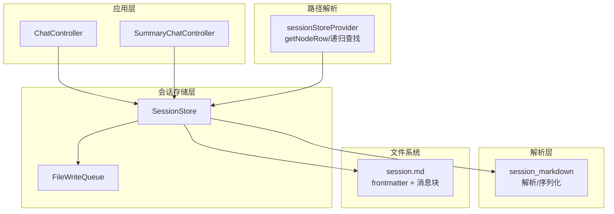
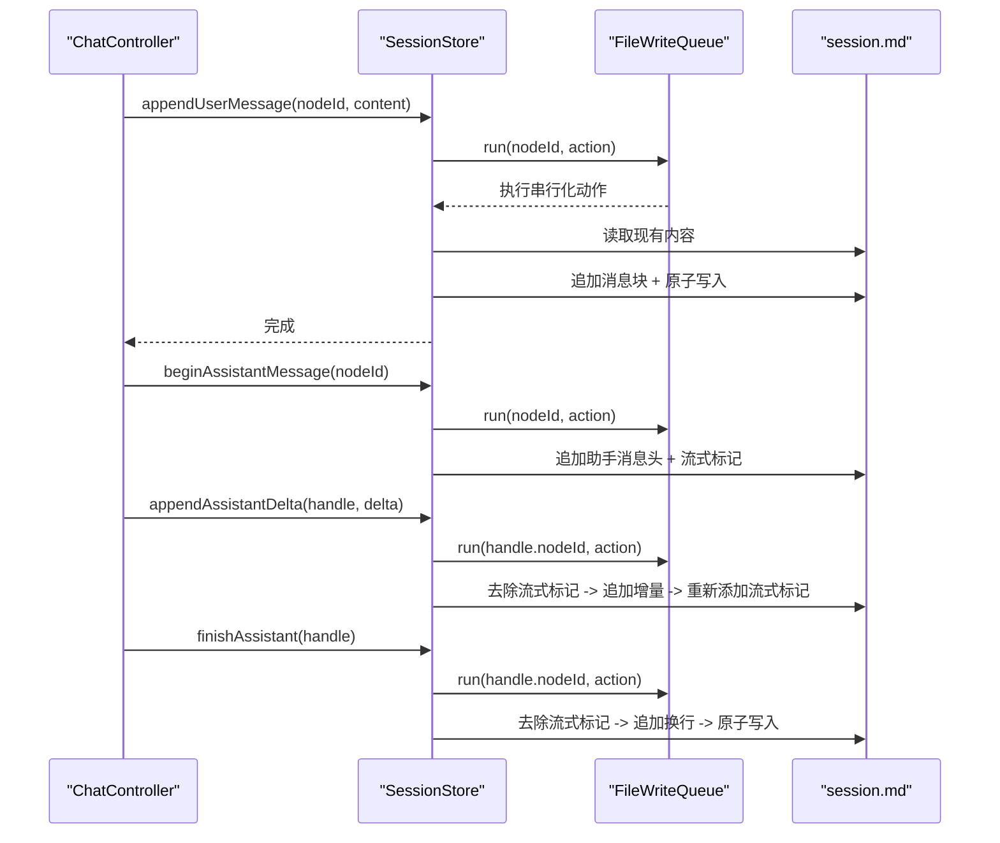
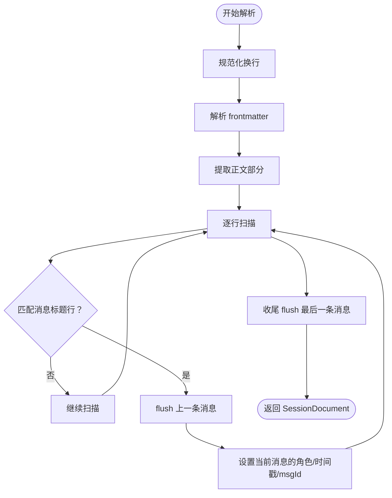
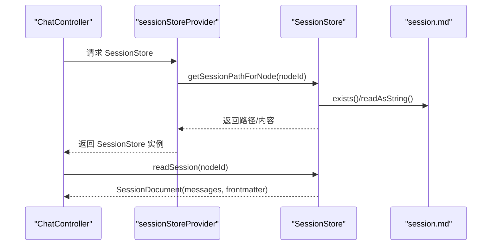
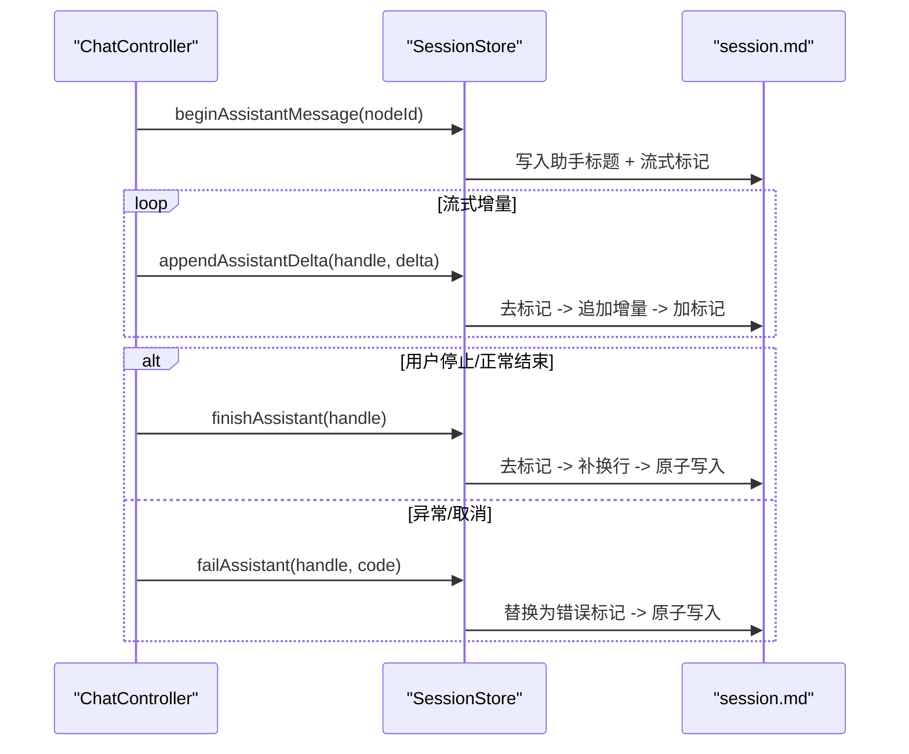
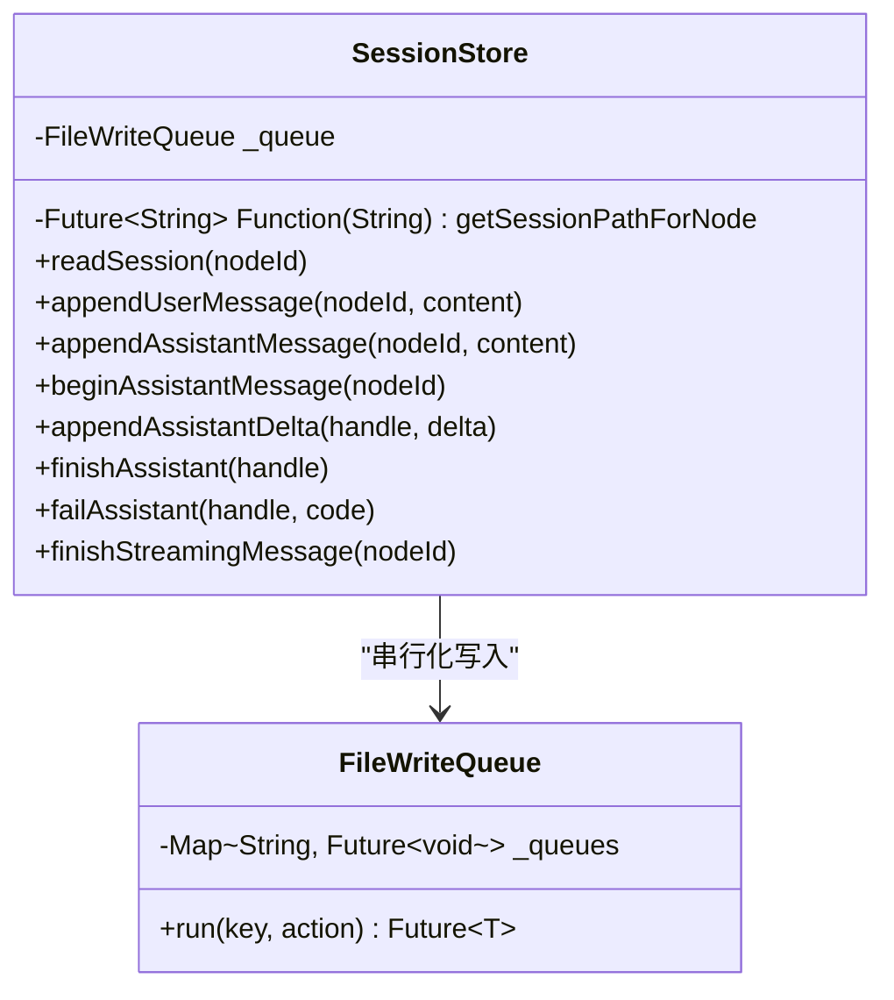
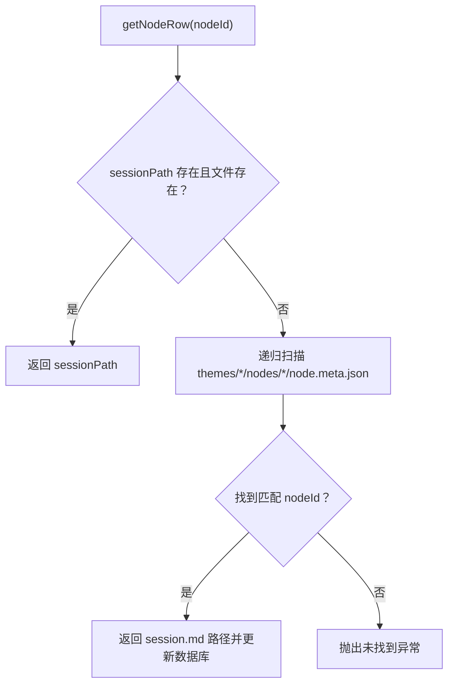
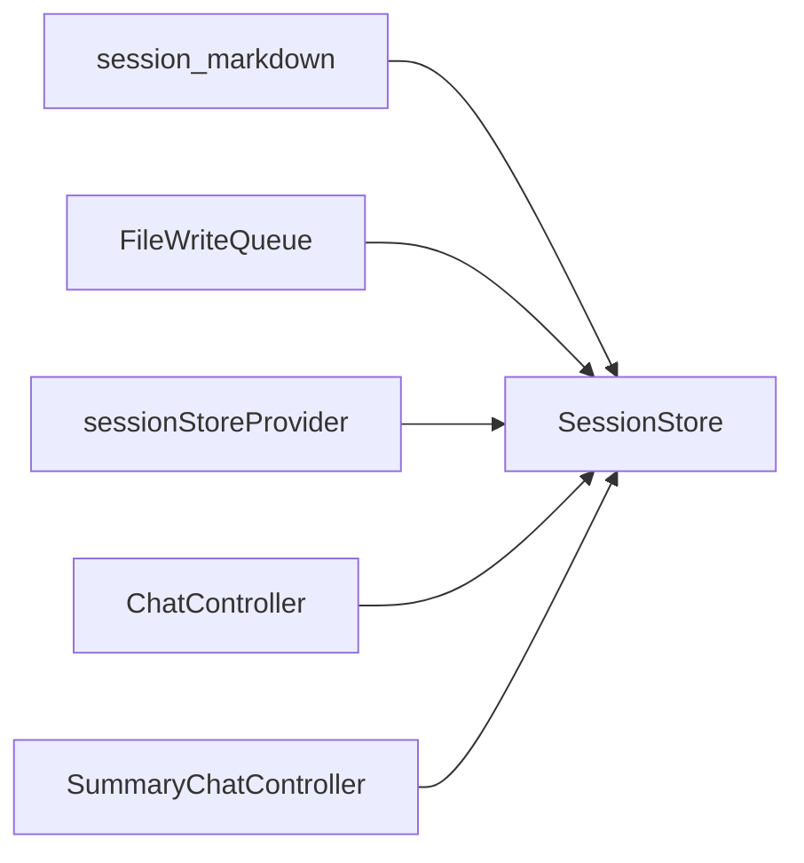

# 会话存储服务

<cite>
**本文引用的文件**
- [lib/data/stores/session_store.dart](file://lib/data/stores/session_store.dart)
- [lib/data/services/session_markdown.dart](file://lib/data/services/session_markdown.dart)
- [lib/data/services/file_write_queue.dart](file://lib/data/services/file_write_queue.dart)
- [lib/ui/features/chat/chat_controller.dart](file://lib/ui/features/chat/chat_controller.dart)
- [lib/ui/features/summary/summary_chat_controller.dart](file://lib/ui/features/summary/summary_chat_controller.dart)
- [lib/ui/core/app_services.dart](file://lib/ui/core/app_services.dart)
- [docs/storage-format.md](file://docs/storage-format.md)
- [test/data/services/session_markdown_test.dart](file://test/data/services/session_markdown_test.dart)
</cite>

## 目录
1. [简介](#简介)
2. [项目结构](#项目结构)
3. [核心组件](#核心组件)
4. [架构总览](#架构总览)
5. [详细组件分析](#详细组件分析)
6. [依赖关系分析](#依赖关系分析)
7. [性能考量](#性能考量)
8. [故障排查指南](#故障排查指南)
9. [结论](#结论)
10. [附录](#附录)

## 简介
本文件系统性阐述 SessionStore 会话存储服务的设计与实现，覆盖会话数据的磁盘文件格式、消息序列化与解析、上下文管理、流式对话与断点续传、并发控制与原子写入、数据完整性保障及性能优化策略。文档面向开发者与产品/运维人员，既提供高层架构说明，也给出代码级的可视化图示与来源标注。

## 项目结构
围绕会话存储的关键模块如下：
- 会话存储实现：SessionStore（负责读写、流式处理、原子写）
- Markdown 解析与模型：session_markdown（负责 frontmatter 与消息块解析、序列化）
- 并发控制：FileWriteQueue（串行化同一节点的写操作）
- 控制器集成：ChatController 与 SummaryChatController（调用 SessionStore 完成读写与流式）
- 路径解析：app_services 中的 sessionStoreProvider（根据节点 ID 解析 session.md 的绝对路径）
- 存储契约：storage-format.md（权威的磁盘与索引契约）

图表来源
- [lib/data/stores/session_store.dart:8-204](file://lib/data/stores/session_store.dart#L8-L204)
- [lib/data/services/session_markdown.dart:1-223](file://lib/data/services/session_markdown.dart#L1-L223)
- [lib/data/services/file_write_queue.dart:1-12](file://lib/data/services/file_write_queue.dart#L1-L12)
- [lib/ui/features/chat/chat_controller.dart:1-243](file://lib/ui/features/chat/chat_controller.dart#L1-L243)
- [lib/ui/features/summary/summary_chat_controller.dart:1-428](file://lib/ui/features/summary/summary_chat_controller.dart#L1-L428)
- [lib/ui/core/app_services.dart:77-169](file://lib/ui/core/app_services.dart#L77-L169)

章节来源
- [lib/data/stores/session_store.dart:1-205](file://lib/data/stores/session_store.dart#L1-L205)
- [lib/data/services/session_markdown.dart:1-223](file://lib/data/services/session_markdown.dart#L1-L223)
- [lib/data/services/file_write_queue.dart:1-12](file://lib/data/services/file_write_queue.dart#L1-L12)
- [lib/ui/features/chat/chat_controller.dart:1-243](file://lib/ui/features/chat/chat_controller.dart#L1-L243)
- [lib/ui/features/summary/summary_chat_controller.dart:1-428](file://lib/ui/features/summary/summary_chat_controller.dart#L1-L428)
- [lib/ui/core/app_services.dart:77-169](file://lib/ui/core/app_services.dart#L77-L169)
- [docs/storage-format.md:1-350](file://docs/storage-format.md#L1-L350)

## 核心组件
- SessionStore：提供会话读取、用户/助手消息追加、流式开始/增量/结束/失败标记处理、以及基于文件的原子写入。
- session_markdown：定义消息与文档模型、解析 frontmatter 与消息块、提取状态（完成/流式/错误）、格式化消息头。
- FileWriteQueue：按节点 ID 串行化写操作，确保同一文件的并发安全。
- ChatController/SummaryChatController：UI 控制器，驱动 SessionStore 完成读写与流式交互。
- sessionStoreProvider：在运行时解析节点对应的 session.md 绝对路径，优先数据库命中，回退到文件系统扫描。

章节来源
- [lib/data/stores/session_store.dart:8-204](file://lib/data/stores/session_store.dart#L8-L204)
- [lib/data/services/session_markdown.dart:4-223](file://lib/data/services/session_markdown.dart#L4-L223)
- [lib/data/services/file_write_queue.dart:1-12](file://lib/data/services/file_write_queue.dart#L1-L12)
- [lib/ui/features/chat/chat_controller.dart:18-243](file://lib/ui/features/chat/chat_controller.dart#L18-L243)
- [lib/ui/features/summary/summary_chat_controller.dart:33-428](file://lib/ui/features/summary/summary_chat_controller.dart#L33-L428)
- [lib/ui/core/app_services.dart:77-169](file://lib/ui/core/app_services.dart#L77-L169)

## 架构总览
SessionStore 以“磁盘文件为真相源”的设计为核心，所有变更通过串行队列写入，并采用“先写临时文件再 rename”的原子替换策略，确保崩溃/断电后的可解析性。流式助手回复通过专用标记维持中间态，结束或失败时进行状态修正。

图表来源
- [lib/data/stores/session_store.dart:42-148](file://lib/data/stores/session_store.dart#L42-L148)
- [lib/data/services/file_write_queue.dart:4-9](file://lib/data/services/file_write_queue.dart#L4-L9)
- [lib/ui/features/chat/chat_controller.dart:111-200](file://lib/ui/features/chat/chat_controller.dart#L111-L200)

章节来源
- [lib/data/stores/session_store.dart:17-148](file://lib/data/stores/session_store.dart#L17-L148)
- [lib/data/services/file_write_queue.dart:1-12](file://lib/data/services/file_write_queue.dart#L1-L12)
- [lib/ui/features/chat/chat_controller.dart:111-200](file://lib/ui/features/chat/chat_controller.dart#L111-L200)

## 详细组件分析

### 会话文件格式与消息序列化
- 文件结构：顶部 YAML frontmatter，随后为若干消息块。消息块由“标题行（role·timestamp·msgId）+ 正文（多行 Markdown）”构成。
- 状态标记：
  - 流式中间态：在正文末尾独占一行插入流式标记，结束时移除该标记。
  - 错误态：将流式标记替换为错误标记（包含错误码），保留该消息块以便追溯。
- 解析逻辑：按行扫描，匹配标题行后提取角色、时间戳、msgId；正文截断至下一标题行前；末行特殊处理以识别状态。
- 序列化：格式化消息头、拼接正文与状态标记，保证换行与结尾一致性。

图表来源
- [lib/data/services/session_markdown.dart:49-157](file://lib/data/services/session_markdown.dart#L49-L157)

章节来源
- [lib/data/services/session_markdown.dart:44-184](file://lib/data/services/session_markdown.dart#L44-L184)
- [docs/storage-format.md:122-222](file://docs/storage-format.md#L122-L222)
- [test/data/services/session_markdown_test.dart:1-129](file://test/data/services/session_markdown_test.dart#L1-L129)

### 会话读取与检索
- 读取流程：根据节点 ID 获取 session.md 绝对路径，若文件不存在则返回空会话；否则读取全文并解析为 SessionDocument。
- 状态统计：UI 层可统计处于流式中的消息数量，指导界面行为。

图表来源
- [lib/ui/core/app_services.dart:77-169](file://lib/ui/core/app_services.dart#L77-L169)
- [lib/data/stores/session_store.dart:17-40](file://lib/data/stores/session_store.dart#L17-L40)
- [lib/ui/features/chat/chat_controller.dart:92-109](file://lib/ui/features/chat/chat_controller.dart#L92-L109)

章节来源
- [lib/data/stores/session_store.dart:17-40](file://lib/data/stores/session_store.dart#L17-L40)
- [lib/ui/core/app_services.dart:77-169](file://lib/ui/core/app_services.dart#L77-L169)
- [lib/ui/features/chat/chat_controller.dart:92-109](file://lib/ui/features/chat/chat_controller.dart#L92-L109)

### 流式对话与断点续传
- 开始流式：为助手消息追加标题行与流式标记，后续增量写入仅在标记两侧追加。
- 增量写入：去除流式标记 -> 追加增量 -> 重新添加流式标记，保证崩溃后仍可识别中间态。
- 结束流式：移除流式标记并补足换行，完成原子写入。
- 失败处理：将流式标记替换为错误标记（带错误码），保留消息块以便重试或修复。
- 断点续传：由于文件为真相源且流式中间态可被识别，崩溃恢复后 UI 可提示“未完成，可重试”。

图表来源
- [lib/data/stores/session_store.dart:84-148](file://lib/data/stores/session_store.dart#L84-L148)
- [lib/ui/features/chat/chat_controller.dart:55-90](file://lib/ui/features/chat/chat_controller.dart#L55-L90)

章节来源
- [lib/data/stores/session_store.dart:66-148](file://lib/data/stores/session_store.dart#L66-L148)
- [lib/ui/features/chat/chat_controller.dart:55-90](file://lib/ui/features/chat/chat_controller.dart#L55-L90)
- [docs/storage-format.md:173-200](file://docs/storage-format.md#L173-L200)

### 并发控制与原子写入
- 并发控制：FileWriteQueue 以节点 ID 为键维护串行队列，确保同一节点的写入严格顺序执行，避免竞态。
- 原子写入：先写同目录临时文件，再以 rename 原子替换，保证崩溃后文件始终可解析（包括流式中间态）。
- 串行化关键路径：所有写操作（用户消息、助手消息、流式增量、结束/失败）均通过队列封装。

图表来源
- [lib/data/services/file_write_queue.dart:1-12](file://lib/data/services/file_write_queue.dart#L1-L12)
- [lib/data/stores/session_store.dart:8-204](file://lib/data/stores/session_store.dart#L8-L204)

章节来源
- [lib/data/services/file_write_queue.dart:1-12](file://lib/data/services/file_write_queue.dart#L1-L12)
- [lib/data/stores/session_store.dart:13-204](file://lib/data/stores/session_store.dart#L13-L204)
- [docs/storage-format.md:66-70](file://docs/storage-format.md#L66-L70)

### 路径解析与会话生命周期
- 路径解析：优先查询数据库中记录的 sessionPath，若文件存在则直接使用；否则递归扫描 themes 目录，匹配 node.meta.json 的 nodeId 后回填数据库。
- 生命周期：
  - 创建：首次访问某节点时，若文件不存在，后续写入会创建初始 frontmatter。
  - 更新：追加消息或修改标题时更新 updatedAt。
  - 删除：UI 层不直接删除会话文件，可通过外部工具或重建索引清理。

图表来源
- [lib/ui/core/app_services.dart:77-169](file://lib/ui/core/app_services.dart#L77-L169)

章节来源
- [lib/ui/core/app_services.dart:77-169](file://lib/ui/core/app_services.dart#L77-L169)
- [docs/storage-format.md:14-37](file://docs/storage-format.md#L14-L37)

### 与 UI 控制器的集成
- ChatController：负责发送用户消息、启动/停止流式、监听 LLM 流式输出、调用 SessionStore 完成写入与刷新。
- SummaryChatController：在临时目录中维护临时会话，支持与主会话类似的流式处理与原子写入。

章节来源
- [lib/ui/features/chat/chat_controller.dart:18-243](file://lib/ui/features/chat/chat_controller.dart#L18-L243)
- [lib/ui/features/summary/summary_chat_controller.dart:33-428](file://lib/ui/features/summary/summary_chat_controller.dart#L33-L428)

## 依赖关系分析
- SessionStore 依赖：
  - session_markdown：消息模型、解析/序列化工具
  - file_write_queue：并发控制
  - getNodePathForNode：路径解析函数（由 sessionStoreProvider 注入）
- 控制器依赖：
  - sessionStoreProvider：提供 SessionStore 实例
  - LLM 客户端：用于流式对话（在控制器中消费）

图表来源
- [lib/data/stores/session_store.dart:1-7](file://lib/data/stores/session_store.dart#L1-L7)
- [lib/ui/core/app_services.dart:77-169](file://lib/ui/core/app_services.dart#L77-L169)
- [lib/ui/features/chat/chat_controller.dart:1-10](file://lib/ui/features/chat/chat_controller.dart#L1-L10)
- [lib/ui/features/summary/summary_chat_controller.dart:1-13](file://lib/ui/features/summary/summary_chat_controller.dart#L1-L13)

章节来源
- [lib/data/stores/session_store.dart:1-7](file://lib/data/stores/session_store.dart#L1-L7)
- [lib/ui/core/app_services.dart:77-169](file://lib/ui/core/app_services.dart#L77-L169)
- [lib/ui/features/chat/chat_controller.dart:1-10](file://lib/ui/features/chat/chat_controller.dart#L1-L10)
- [lib/ui/features/summary/summary_chat_controller.dart:1-13](file://lib/ui/features/summary/summary_chat_controller.dart#L1-L13)

## 性能考量
- I/O 模式
  - 顺序追加写：消息块以块为单位追加，减少随机写。
  - 原子写：每次写入先落盘临时文件再 rename，避免部分写入导致的解析失败。
- 并发与吞吐
  - 按节点串行化写入，避免跨节点竞争；同一节点内写入串行，保证一致性。
  - 对于大量节点同时写入，建议在上层进行节点级批处理或合并写入。
- 解析效率
  - 解析按行扫描，时间复杂度 O(n)，适合中等规模会话。
  - 对超长会话，可考虑分段或增量解析策略（当前实现未采用）。
- 磁盘与索引
  - SQLite 索引仅作检索加速，可随时重建；磁盘文件为真相源，保证可移植性与可恢复性。

[本节为通用性能讨论，不直接分析具体文件，故无章节来源]

## 故障排查指南
- 问题：会话读取为空
  - 排查：确认节点是否存在 session.md；检查 getNodePathForNode 是否正确解析路径。
  - 参考来源：[lib/data/stores/session_store.dart:17-40](file://lib/data/stores/session_store.dart#L17-L40)、[lib/ui/core/app_services.dart:77-169](file://lib/ui/core/app_services.dart#L77-L169)
- 问题：流式消息未完成或中断
  - 排查：检查是否残留流式标记；UI 层应识别 status=streaming 并提示重试。
  - 参考来源：[lib/data/stores/session_store.dart:66-82](file://lib/data/stores/session_store.dart#L66-L82)、[lib/data/services/session_markdown.dart:159-184](file://lib/data/services/session_markdown.dart#L159-L184)
- 问题：写入冲突或文件损坏
  - 排查：确认所有写入通过 FileWriteQueue；检查临时文件是否成功 rename；必要时手动删除临时文件。
  - 参考来源：[lib/data/services/file_write_queue.dart:1-12](file://lib/data/services/file_write_queue.dart#L1-L12)、[lib/data/stores/session_store.dart:199-204](file://lib/data/stores/session_store.dart#L199-L204)
- 问题：路径解析失败
  - 排查：确认 node.meta.json 的 nodeId 与数据库记录一致；检查递归扫描是否可达。
  - 参考来源：[lib/ui/core/app_services.dart:129-167](file://lib/ui/core/app_services.dart#L129-L167)

章节来源
- [lib/data/stores/session_store.dart:17-82](file://lib/data/stores/session_store.dart#L17-L82)
- [lib/data/services/session_markdown.dart:159-184](file://lib/data/services/session_markdown.dart#L159-L184)
- [lib/data/services/file_write_queue.dart:1-12](file://lib/data/services/file_write_queue.dart#L1-L12)
- [lib/ui/core/app_services.dart:129-167](file://lib/ui/core/app_services.dart#L129-L167)

## 结论
SessionStore 以“磁盘文件为真相源”的设计，结合串行队列与原子写入，实现了高可靠性的会话持久化。通过流式标记与错误标记，系统在崩溃/中断场景下仍能保持可解析性与可恢复性。配合 UI 控制器的流式监听与状态管理，形成完整的会话生命周期闭环。未来可在超长会话的增量解析与索引策略上进一步优化。

[本节为总结性内容，不直接分析具体文件，故无章节来源]

## 附录

### 数据模型与契约要点
- 文件契约：session.md 必须包含 frontmatter 与消息块；流式中间态与错误态有明确标记。
- ID 与时间：统一使用 ULID 与 UTC ISO8601。
- 原子写：覆盖写采用 tmp+rename，追加写需保证崩溃可解析。

章节来源
- [docs/storage-format.md:122-222](file://docs/storage-format.md#L122-L222)
- [docs/storage-format.md:40-70](file://docs/storage-format.md#L40-L70)
- [docs/storage-format.md:66-70](file://docs/storage-format.md#L66-L70)