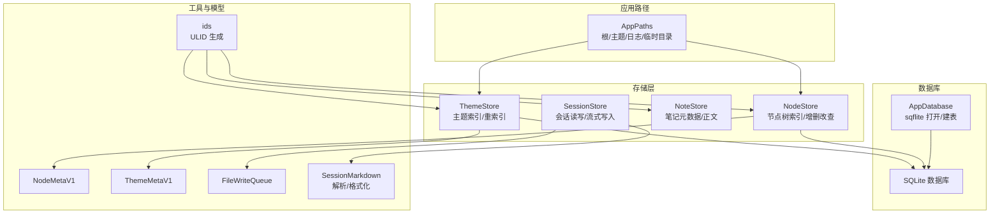
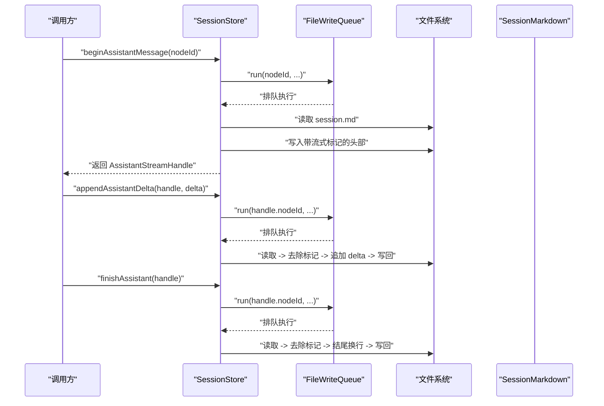
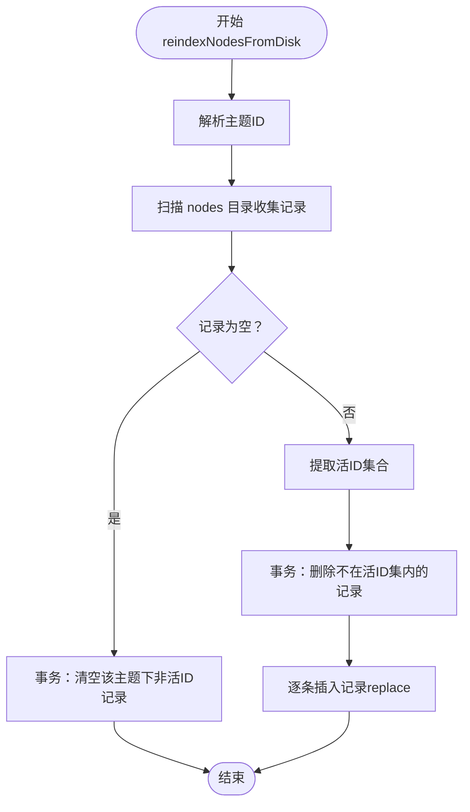
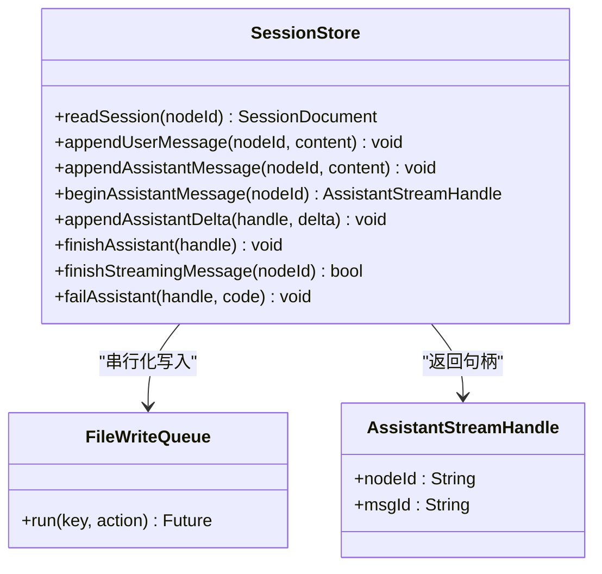
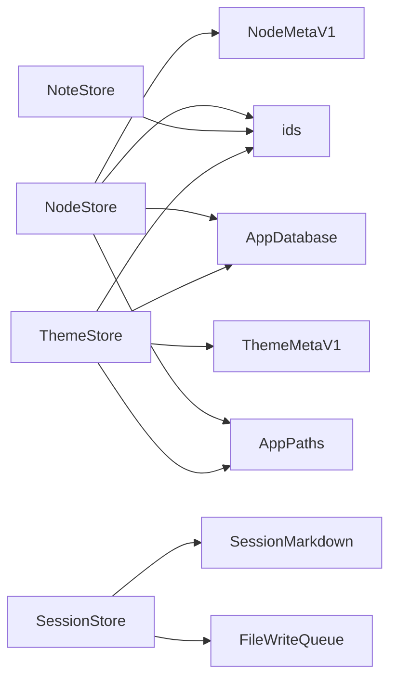
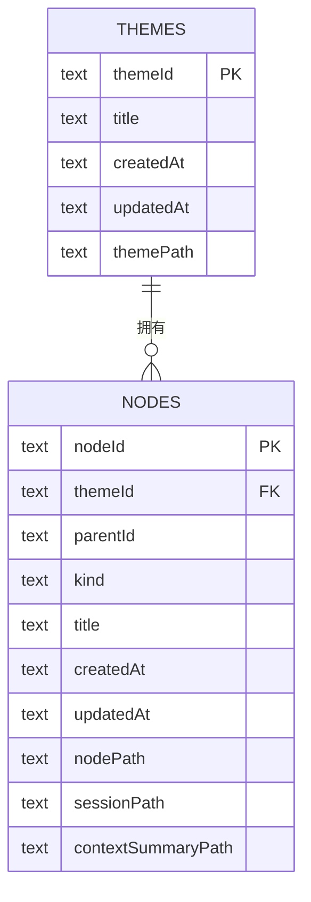

# 数据访问层

<cite>
**本文引用的文件**
- [lib/data/stores/node_store.dart](file://lib/data/stores/node_store.dart)
- [lib/data/stores/session_store.dart](file://lib/data/stores/session_store.dart)
- [lib/data/stores/note_store.dart](file://lib/data/stores/note_store.dart)
- [lib/data/stores/theme_store.dart](file://lib/data/stores/theme_store.dart)
- [lib/data/services/app_database.dart](file://lib/data/services/app_database.dart)
- [lib/data/services/file_write_queue.dart](file://lib/data/services/file_write_queue.dart)
- [lib/data/services/session_markdown.dart](file://lib/data/services/session_markdown.dart)
- [lib/data/models/node_meta.dart](file://lib/data/models/node_meta.dart)
- [lib/data/models/theme_meta.dart](file://lib/data/models/theme_meta.dart)
- [lib/ui/core/app_paths.dart](file://lib/ui/core/app_paths.dart)
- [lib/domain/ids.dart](file://lib/domain/ids.dart)
- [lib/domain/node.dart](file://lib/domain/node.dart)
</cite>

## 目录
1. [简介](#简介)
2. [项目结构](#项目结构)
3. [核心组件](#核心组件)
4. [架构总览](#架构总览)
5. [详细组件分析](#详细组件分析)
6. [依赖关系分析](#依赖关系分析)
7. [性能考量](#性能考量)
8. [故障排查指南](#故障排查指南)
9. [结论](#结论)
10. [附录](#附录)

## 简介
本文件系统性梳理 ThkTree 的数据访问层（Data Access Layer），重点覆盖以下方面：
- 存储服务实现架构：NodeStore、SessionStore、NoteStore、ThemeStore 的设计与职责
- 数据库操作：CRUD、事务、并发控制
- 文件系统交互：文件读写、原子写入、错误处理
- 缓存策略与性能优化
- 异常处理与恢复机制
- 扩展点与自定义存储后端的实现建议

## 项目结构
数据访问层主要由以下模块构成：
- 存储层：NodeStore、SessionStore、NoteStore、ThemeStore
- 数据库服务：AppDatabase（sqflite）
- 路径服务：AppPaths（统一根目录、主题目录、日志目录等）
- 工具与模型：ids（ULID 生成）、node.dart（节点类型）、node_meta.dart、theme_meta.dart（元数据模型）
- 文件写入队列：FileWriteQueue（串行化同一资源的写入）
- 会话 Markdown 解析：session_markdown.dart（解析/格式化会话内容）

图表来源
- [lib/data/stores/node_store.dart:12-375](file://lib/data/stores/node_store.dart#L12-L375)
- [lib/data/stores/session_store.dart:8-169](file://lib/data/stores/session_store.dart#L8-L169)
- [lib/data/stores/note_store.dart:53-151](file://lib/data/stores/note_store.dart#L53-L151)
- [lib/data/stores/theme_store.dart:11-139](file://lib/data/stores/theme_store.dart#L11-L139)
- [lib/data/services/app_database.dart:3-46](file://lib/data/services/app_database.dart#L3-L46)
- [lib/ui/core/app_paths.dart:7-75](file://lib/ui/core/app_paths.dart#L7-L75)
- [lib/data/services/file_write_queue.dart:1-12](file://lib/data/services/file_write_queue.dart#L1-L12)
- [lib/data/services/session_markdown.dart:4-223](file://lib/data/services/session_markdown.dart#L4-L223)
- [lib/data/models/node_meta.dart:5-83](file://lib/data/models/node_meta.dart#L5-L83)
- [lib/data/models/theme_meta.dart:5-61](file://lib/data/models/theme_meta.dart#L5-L61)
- [lib/domain/ids.dart:1-10](file://lib/domain/ids.dart#L1-L10)

章节来源
- [lib/data/stores/node_store.dart:12-375](file://lib/data/stores/node_store.dart#L12-L375)
- [lib/data/stores/session_store.dart:8-169](file://lib/data/stores/session_store.dart#L8-L169)
- [lib/data/stores/note_store.dart:53-151](file://lib/data/stores/note_store.dart#L53-L151)
- [lib/data/stores/theme_store.dart:11-139](file://lib/data/stores/theme_store.dart#L11-L139)
- [lib/data/services/app_database.dart:3-46](file://lib/data/services/app_database.dart#L3-L46)
- [lib/ui/core/app_paths.dart:7-75](file://lib/ui/core/app_paths.dart#L7-L75)
- [lib/data/services/file_write_queue.dart:1-12](file://lib/data/services/file_write_queue.dart#L1-L12)
- [lib/data/services/session_markdown.dart:4-223](file://lib/data/services/session_markdown.dart#L4-L223)
- [lib/data/models/node_meta.dart:5-83](file://lib/data/models/node_meta.dart#L5-L83)
- [lib/data/models/theme_meta.dart:5-61](file://lib/data/models/theme_meta.dart#L5-L61)
- [lib/domain/ids.dart:1-10](file://lib/domain/ids.dart#L1-L10)

## 核心组件
- NodeStore：负责节点树的数据库索引与一致性维护，支持从磁盘重建索引、创建聊天节点、删除子树、更新会话路径等；通过事务保证批量操作一致性。
- SessionStore：负责会话文件的读写与流式写入，使用文件写入队列确保同一节点的写入串行化；支持开始/追加/结束助手消息，以及失败标记。
- NoteStore：负责笔记元数据与正文的读写，采用 YAML 前言（frontmatter）+ 正文的组织方式，提供列表、创建、读取正文、追加正文等能力。
- ThemeStore：负责主题的创建、重命名、主题目录到数据库的重索引，确保数据库与磁盘一致。

章节来源
- [lib/data/stores/node_store.dart:12-375](file://lib/data/stores/node_store.dart#L12-L375)
- [lib/data/stores/session_store.dart:8-169](file://lib/data/stores/session_store.dart#L8-L169)
- [lib/data/stores/note_store.dart:53-151](file://lib/data/stores/note_store.dart#L53-L151)
- [lib/data/stores/theme_store.dart:11-139](file://lib/data/stores/theme_store.dart#L11-L139)

## 架构总览
数据访问层围绕“数据库 + 文件系统”的混合存储模式构建：
- 数据库存储结构化元信息（主题、节点），并建立索引以提升查询性能。
- 文件系统存储富文本内容（会话 Markdown、笔记正文、主题/节点元数据 JSON）。
- AppPaths 统一路径转换，避免绝对/相对路径混淆。
- FileWriteQueue 对同一资源的并发写入进行串行化，保障原子性与一致性。
- SessionMarkdown 提供会话内容的解析与格式化，便于 UI 展示与检索。

图表来源
- [lib/data/stores/session_store.dart:84-131](file://lib/data/stores/session_store.dart#L84-L131)
- [lib/data/services/file_write_queue.dart:4-9](file://lib/data/services/file_write_queue.dart#L4-L9)
- [lib/data/services/session_markdown.dart:49-61](file://lib/data/services/session_markdown.dart#L49-L61)

章节来源
- [lib/data/stores/session_store.dart:8-169](file://lib/data/stores/session_store.dart#L8-L169)
- [lib/data/services/file_write_queue.dart:1-12](file://lib/data/services/file_write_queue.dart#L1-L12)
- [lib/data/services/session_markdown.dart:4-223](file://lib/data/services/session_markdown.dart#L4-L223)

## 详细组件分析

### NodeStore（节点存储）
职责与特性
- 从磁盘重建节点索引：扫描主题下的 nodes 目录，收集合法节点元数据，清理不存在的记录，并批量写入数据库。
- 创建聊天节点：生成唯一 nodeId，创建节点目录，写入 node.meta.json 与初始 session.md，最后入库。
- 删除子树：定位节点目录并递归删除，同时删除数据库中对应子树 ID 列表，随后重新索引。
- 更新会话路径：当会话文件移动时，同步更新数据库中的相对路径字段。
- 目录解析与一致性校验：根据数据库记录或磁盘扫描解析节点目录，确保路径与元数据一致。

并发与事务
- 使用事务包裹批量删除与插入，保证索引重建的一致性。
- 在创建节点时，先写磁盘再写数据库，配合冲突算法与后续 reindex，确保最终一致。

文件系统交互
- 使用原子写入函数写入 JSON 与 Markdown 文件，避免部分写入导致的数据损坏。
- 通过 AppPaths 实现绝对/相对路径转换，避免跨平台路径差异问题。

图表来源
- [lib/data/stores/node_store.dart:18-59](file://lib/data/stores/node_store.dart#L18-L59)

章节来源
- [lib/data/stores/node_store.dart:12-375](file://lib/data/stores/node_store.dart#L12-L375)
- [lib/ui/core/app_paths.dart:62-74](file://lib/ui/core/app_paths.dart#L62-L74)
- [lib/data/models/node_meta.dart:5-83](file://lib/data/models/node_meta.dart#L5-L83)

### SessionStore（会话存储）
职责与特性
- 会话读取：若文件不存在则返回空文档；存在则解析 YAML 前言与消息块。
- 用户/助手消息追加：按固定头部格式写入消息体。
- 流式写入：为助手消息写入“流式”标记，支持增量追加与最终完成/失败标记。
- 并发控制：通过 FileWriteQueue 对同一 nodeId 的写入进行串行化，避免竞态条件。

文件系统交互
- 使用原子写入函数，先写临时文件再重命名为目标文件，确保写入原子性。
- 支持新旧两种流式标记，兼容历史数据。

图表来源
- [lib/data/stores/session_store.dart:8-169](file://lib/data/stores/session_store.dart#L8-L169)
- [lib/data/services/file_write_queue.dart:1-12](file://lib/data/services/file_write_queue.dart#L1-L12)

章节来源
- [lib/data/stores/session_store.dart:8-169](file://lib/data/stores/session_store.dart#L8-L169)
- [lib/data/services/file_write_queue.dart:1-12](file://lib/data/services/file_write_queue.dart#L1-L12)
- [lib/data/services/session_markdown.dart:4-223](file://lib/data/services/session_markdown.dart#L4-L223)

### NoteStore（笔记存储）
职责与特性
- 列出笔记元数据：遍历笔记目录，解析每个 Markdown 的 YAML 前言，按更新时间倒序返回。
- 读取正文：跳过前言，返回正文内容。
- 创建笔记：生成唯一 noteId，写入 YAML 前言与空正文。
- 写入/追加正文：更新前言中的 updatedAt，保持前言与正文的正确分隔。

文件系统交互
- 采用 YAML 前言 + 分隔符的方式组织内容，解析与写入均基于字符串处理。
- 通过统一的文件路径方法保证跨平台兼容。

章节来源
- [lib/data/stores/note_store.dart:53-151](file://lib/data/stores/note_store.dart#L53-L151)

### ThemeStore（主题存储）
职责与特性
- 列出主题：按更新时间倒序返回主题列表。
- 创建主题：生成唯一 themeId，创建主题目录与 theme.meta.json，入库。
- 重命名主题：更新元数据文件与数据库记录。
- 重索引主题：扫描主题目录，读取所有主题元数据，清空并批量写入数据库。

文件系统交互
- 使用原子写入函数写入主题元数据 JSON。
- 通过 AppPaths 将绝对路径转换为数据库中的相对路径，便于迁移与备份。

章节来源
- [lib/data/stores/theme_store.dart:11-139](file://lib/data/stores/theme_store.dart#L11-L139)
- [lib/data/models/theme_meta.dart:5-61](file://lib/data/models/theme_meta.dart#L5-L61)

### 数据库与索引
- AppDatabase：打开 SQLite 数据库，版本号为 2；在首次打开、升级、打开时创建/重建表结构。
- 表结构：
  - themes：主题元信息（主键 themeId）
  - nodes：节点元信息（主键 nodeId，外键 themeId，复合索引 themeId+parentId）
- 事务：在批量索引重建与节点删除子树时使用事务，保证一致性。

章节来源
- [lib/data/services/app_database.dart:3-46](file://lib/data/services/app_database.dart#L3-L46)

### 路径与 ID 生成
- AppPaths：统一管理根目录、主题目录、日志目录、临时目录与数据库文件路径；提供绝对/相对路径互转。
- ids：基于 ULID 生成器，提供主题、节点、笔记、消息、请求等唯一标识。

章节来源
- [lib/ui/core/app_paths.dart:7-75](file://lib/ui/core/app_paths.dart#L7-L75)
- [lib/domain/ids.dart:1-10](file://lib/domain/ids.dart#L1-L10)

## 依赖关系分析
- NodeStore 依赖 AppPaths、AppDatabase、NodeMetaV1、ids；负责节点树的磁盘与数据库一致性。
- SessionStore 依赖 FileWriteQueue、SessionMarkdown；负责会话文件的并发安全与内容格式。
- NoteStore 依赖 ids；负责笔记的元数据与正文管理。
- ThemeStore 依赖 AppPaths、AppDatabase、ThemeMetaV1、ids；负责主题的磁盘与数据库一致性。
- AppDatabase 依赖 sqflite；负责数据库初始化与建表。

图表来源
- [lib/data/stores/node_store.dart:12-375](file://lib/data/stores/node_store.dart#L12-L375)
- [lib/data/stores/session_store.dart:8-169](file://lib/data/stores/session_store.dart#L8-L169)
- [lib/data/stores/note_store.dart:53-151](file://lib/data/stores/note_store.dart#L53-L151)
- [lib/data/stores/theme_store.dart:11-139](file://lib/data/stores/theme_store.dart#L11-L139)
- [lib/data/services/app_database.dart:3-46](file://lib/data/services/app_database.dart#L3-L46)
- [lib/ui/core/app_paths.dart:7-75](file://lib/ui/core/app_paths.dart#L7-L75)
- [lib/data/models/node_meta.dart:5-83](file://lib/data/models/node_meta.dart#L5-L83)
- [lib/data/models/theme_meta.dart:5-61](file://lib/data/models/theme_meta.dart#L5-L61)
- [lib/domain/ids.dart:1-10](file://lib/domain/ids.dart#L1-L10)

章节来源
- [lib/data/stores/node_store.dart:12-375](file://lib/data/stores/node_store.dart#L12-L375)
- [lib/data/stores/session_store.dart:8-169](file://lib/data/stores/session_store.dart#L8-L169)
- [lib/data/stores/note_store.dart:53-151](file://lib/data/stores/note_store.dart#L53-L151)
- [lib/data/stores/theme_store.dart:11-139](file://lib/data/stores/theme_store.dart#L11-L139)
- [lib/data/services/app_database.dart:3-46](file://lib/data/services/app_database.dart#L3-L46)
- [lib/ui/core/app_paths.dart:7-75](file://lib/ui/core/app_paths.dart#L7-L75)
- [lib/data/models/node_meta.dart:5-83](file://lib/data/models/node_meta.dart#L5-L83)
- [lib/data/models/theme_meta.dart:5-61](file://lib/data/models/theme_meta.dart#L5-L61)
- [lib/domain/ids.dart:1-10](file://lib/domain/ids.dart#L1-L10)

## 性能考量
- 数据库索引：nodes 表对 (themeId, parentId) 建有索引，有利于按主题与父子关系的查询。
- 事务批处理：索引重建与删除子树使用事务，减少多次提交带来的开销与锁竞争。
- 并发写入串行化：FileWriteQueue 以 nodeId 为键串行化写入，避免频繁文件争用。
- 原子写入：所有文件写入均采用“写临时文件 + 原子重命名”，降低部分写入风险。
- 路径转换：AppPaths 统一路径转换，减少重复计算与路径拼接错误。

章节来源
- [lib/data/services/app_database.dart:45-46](file://lib/data/services/app_database.dart#L45-L46)
- [lib/data/services/file_write_queue.dart:4-9](file://lib/data/services/file_write_queue.dart#L4-L9)
- [lib/ui/core/app_paths.dart:62-74](file://lib/ui/core/app_paths.dart#L62-L74)
- [lib/data/stores/session_store.dart:199-204](file://lib/data/stores/session_store.dart#L199-L204)
- [lib/data/stores/node_store.dart:408-413](file://lib/data/stores/node_store.dart#L408-L413)
- [lib/data/stores/theme_store.dart:151-156](file://lib/data/stores/theme_store.dart#L151-L156)

## 故障排查指南
常见问题与处理
- 主题/节点未找到：当数据库查询无结果时抛出状态错误。检查 AppPaths 是否正确、数据库是否已初始化、是否存在磁盘元数据文件。
- 节点目录不匹配：当数据库记录与磁盘实际目录不一致时，通过目录扫描与元数据比对修复。必要时触发 reindex。
- 会话文件写入冲突：由于 FileWriteQueue 串行化，通常不会出现竞态；若出现异常，检查临时文件写入权限与磁盘空间。
- 元数据格式错误：解析 node.meta.json 或 theme.meta.json 失败时，检查 JSON 结构与 schema 字段。
- 会话流式标记：若旧版标记未被正确识别，可兼容处理；建议统一使用新版标记。

章节来源
- [lib/data/stores/node_store.dart:259-273](file://lib/data/stores/node_store.dart#L259-L273)
- [lib/data/stores/node_store.dart:290-303](file://lib/data/stores/node_store.dart#L290-L303)
- [lib/data/stores/session_store.dart:183-197](file://lib/data/stores/session_store.dart#L183-L197)
- [lib/data/models/node_meta.dart:39-68](file://lib/data/models/node_meta.dart#L39-L68)
- [lib/data/models/theme_meta.dart:30-49](file://lib/data/models/theme_meta.dart#L30-L49)

## 结论
ThkTree 的数据访问层通过“数据库 + 文件系统”的混合架构实现了高可靠与高性能的数据持久化：
- 数据库用于结构化元信息与快速查询；
- 文件系统用于富文本内容与元数据文件；
- 事务、原子写入与串行化队列共同保障了并发安全与一致性；
- AppPaths 与统一 ID 生成提升了可移植性与可维护性。

## 附录

### 数据库表结构

图表来源
- [lib/data/services/app_database.dart:20-46](file://lib/data/services/app_database.dart#L20-L46)

### 扩展点与自定义存储后端建议
- 自定义存储接口：为 NodeStore、SessionStore、NoteStore、ThemeStore 定义抽象接口，便于替换不同后端（如云存储、分布式 KV）。
- 事务抽象：将事务封装为统一接口，适配不同数据库/存储的事务语义。
- 原子写入抽象：将“写临时文件 + 重命名”封装为通用工具，统一于存储层之上。
- 元数据模型标准化：保持 NodeMetaV1、ThemeMetaV1 的 schema 版本演进策略，向后兼容旧版本。
- 路径服务扩展：AppPaths 可扩展为可配置的路径提供器，支持外部存储挂载。