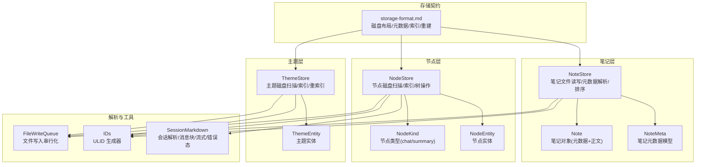
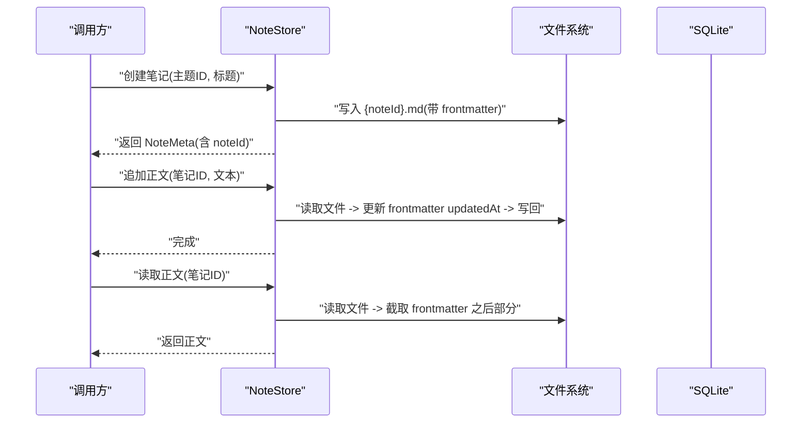
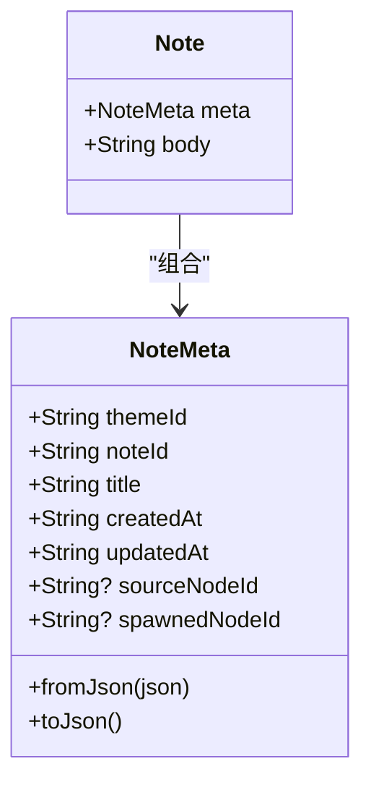
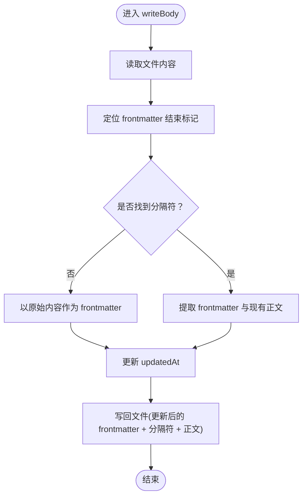
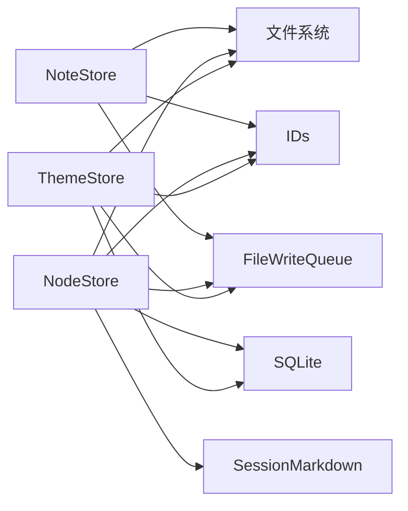

# 笔记存储服务

<cite>
**本文引用的文件**
- [storage-format.md](file://docs/storage-format.md)
- [note_store.dart](file://lib/data/stores/note_store.dart)
- [node_store.dart](file://lib/data/stores/node_store.dart)
- [theme_store.dart](file://lib/data/stores/theme_store.dart)
- [session_markdown.dart](file://lib/data/services/session_markdown.dart)
- [node.dart](file://lib/domain/node.dart)
- [ids.dart](file://lib/domain/ids.dart)
- [file_write_queue.dart](file://lib/data/services/file_write_queue.dart)
- [note_store_test.dart](file://test/data/stores/note_store_test.dart)
</cite>

## 目录
1. [简介](#简介)
2. [项目结构](#项目结构)
3. [核心组件](#核心组件)
4. [架构总览](#架构总览)
5. [组件详解](#组件详解)
6. [依赖关系分析](#依赖关系分析)
7. [性能考量](#性能考量)
8. [故障排查指南](#故障排查指南)
9. [结论](#结论)
10. [附录](#附录)

## 简介
本文件面向 NoteStore 笔记存储服务，系统性阐述笔记数据的存储架构与实现要点，涵盖：
- 笔记文件管理与磁盘契约
- 笔记元数据结构与版本控制
- 笔记与节点的双向关联与一致性
- 创建、编辑、读取、追加、删除与搜索机制
- 索引与全文搜索支持策略
- 性能优化与扩展接口设计

NoteStore 以 Markdown 文件为“真相源”，SQLite 仅作为索引与检索加速层，可随时从磁盘重建。

## 项目结构
围绕笔记存储的关键模块与职责如下：
- 数据契约与格式：通过文档定义磁盘布局、元数据与正文格式、原子写入与中间态等规范
- 笔记存储实现：NoteStore 负责笔记文件的读写、元数据解析与排序
- 节点与主题存储：NodeStore/ThemeStore 负责节点与主题的磁盘扫描、数据库索引与一致性维护
- 会话解析：SessionMarkdown 负责解析会话 Markdown 的 frontmatter 与消息块、流式与错误态
- ID 生成：统一的 ULID 生成器，确保全局唯一 ID
- 并发写入：FileWriteQueue 提供基于键的串行化队列，避免并发写冲突



图表来源
- [storage-format.md](file://docs/storage-format.md)
- [note_store.dart](file://lib/data/stores/note_store.dart)
- [node_store.dart](file://lib/data/stores/node_store.dart)
- [theme_store.dart](file://lib/data/stores/theme_store.dart)
- [session_markdown.dart](file://lib/data/services/session_markdown.dart)
- [ids.dart](file://lib/domain/ids.dart)
- [file_write_queue.dart](file://lib/data/services/file_write_queue.dart)

章节来源
- [storage-format.md](file://docs/storage-format.md)
- [note_store.dart](file://lib/data/stores/note_store.dart)
- [node_store.dart](file://lib/data/stores/node_store.dart)
- [theme_store.dart](file://lib/data/stores/theme_store.dart)
- [session_markdown.dart](file://lib/data/services/session_markdown.dart)
- [ids.dart](file://lib/domain/ids.dart)
- [file_write_queue.dart](file://lib/data/services/file_write_queue.dart)

## 核心组件
- NoteMeta：笔记元数据模型，包含 schema、主题 ID、笔记 ID、标题、创建/更新时间、sourceNodeId、spawnedNodeId 等
- Note：笔记对象，封装元数据与正文
- NoteStore：提供笔记列表、读取正文、创建笔记、写入正文、追加正文等能力，并按 updatedAt 降序返回元数据
- NodeStore/ThemeStore：负责节点与主题的磁盘扫描、数据库索引与一致性维护，支撑笔记与节点的关联
- SessionMarkdown：解析会话 Markdown，识别消息块、流式与错误态，为笔记与节点的关联提供基础
- IDs：统一的 ULID 生成器，确保主题、节点、笔记、消息、请求 ID 的全局唯一性
- FileWriteQueue：文件写入串行化队列，避免并发写导致的竞态与不一致

章节来源
- [note_store.dart](file://lib/data/stores/note_store.dart)
- [node_store.dart](file://lib/data/stores/node_store.dart)
- [theme_store.dart](file://lib/data/stores/theme_store.dart)
- [session_markdown.dart](file://lib/data/services/session_markdown.dart)
- [ids.dart](file://lib/domain/ids.dart)
- [file_write_queue.dart](file://lib/data/services/file_write_queue.dart)

## 架构总览
NoteStore 与 NodeStore/ThemeStore 的协作关系如下：
- NoteStore 以笔记文件为真相源，NoteMeta 中可携带 sourceNodeId 与 spawnedNodeId，从而建立笔记与节点的潜在关联
- NodeStore/ThemeStore 通过磁盘扫描与 SQLite 索引，维护节点树与主题索引，支持节点的创建、删除与重索引
- SessionMarkdown 解析会话文件，为节点提供消息块与状态，便于后续与笔记进行内容溯源与引用



图表来源
- [note_store.dart](file://lib/data/stores/note_store.dart)

章节来源
- [note_store.dart](file://lib/data/stores/note_store.dart)

## 组件详解

### 笔记文件格式与元数据
- 文件位置与命名：`{root}/themes/{themeId}/notes/{noteId}.md`
- 文件结构：顶部 YAML frontmatter，随后为笔记正文（可累积追加）
- frontmatter 字段：schema、themeId、noteId、createdAt、updatedAt、sourceNodeId（可选）、spawnedNodeId（可选）
- 版本控制：schema 固定为 note/v1
- 编码与换行：UTF-8 无 BOM，统一 \n
- 原子写入：覆盖写采用同目录临时文件后 rename 替换，保证崩溃可恢复
- 时间格式：UTC ISO8601

章节来源
- [storage-format.md](file://docs/storage-format.md)

### NoteMeta 与 Note 对象
- NoteMeta：封装笔记元数据，支持从 JSON 构造与序列化
- Note：封装元数据与正文，便于上层统一处理



图表来源
- [note_store.dart](file://lib/data/stores/note_store.dart)

章节来源
- [note_store.dart](file://lib/data/stores/note_store.dart)

### NoteStore 实现要点
- 列表与排序：遍历笔记目录，解析 frontmatter，按 updatedAt 降序返回
- 读取正文：定位 frontmatter 结束标记，截取正文部分
- 创建笔记：生成 noteId，构造 frontmatter，写入空正文
- 写入正文：读取文件，更新 frontmatter 的 updatedAt，整体写回
- 追加正文：读取文件，更新 updatedAt，拼接“空行 + --- + 新正文”，写回
- 原子写入：内部使用字符串拼接与一次性写入，满足最小必要的一致性要求



图表来源
- [note_store.dart](file://lib/data/stores/note_store.dart)

章节来源
- [note_store.dart](file://lib/data/stores/note_store.dart)
- [note_store_test.dart](file://test/data/stores/note_store_test.dart)

### 笔记与节点的双向关联
- 关联字段：NoteMeta 支持 sourceNodeId 与 spawnedNodeId，用于记录笔记来源节点与衍生节点
- 节点侧索引：NodeStore 通过磁盘扫描与 SQLite 索引维护节点树，支持父子关系、类型(kind)、路径等
- 主题侧索引：ThemeStore 通过磁盘扫描与 SQLite 索引维护主题列表与路径
- 一致性保障：NodeStore/ThemeStore 提供重索引能力，确保数据库与磁盘一致；NoteStore 以文件为真相源，配合原子写入与中间态标记，保证崩溃可恢复

```mermaid
erDiagram
THEME {
string themeId PK
string title
string createdAt
string updatedAt
string themePath
}
NODE {
string nodeId PK
string themeId FK
string? parentId
string kind
string title
string createdAt
string updatedAt
string nodePath
string sessionPath
string? contextSummaryPath
}
NOTE {
string noteId PK
string themeId FK
string noteId
string title
string createdAt
string updatedAt
string? sourceNodeId
string? spawnedNodeId
}
THEME ||--o{ NODE : "拥有"
NODE ||--o{ NOTE : "可被引用/衍生"
```

图表来源
- [storage-format.md](file://docs/storage-format.md)
- [node_store.dart](file://lib/data/stores/node_store.dart)
- [theme_store.dart](file://lib/data/stores/theme_store.dart)
- [note_store.dart](file://lib/data/stores/note_store.dart)

章节来源
- [storage-format.md](file://docs/storage-format.md)
- [node_store.dart](file://lib/data/stores/node_store.dart)
- [theme_store.dart](file://lib/data/stores/theme_store.dart)
- [note_store.dart](file://lib/data/stores/note_store.dart)

### 会话解析与流式/错误态
- 会话 Markdown：frontmatter + 多个消息块，标题行格式为“角色 · 时间戳 · 消息ID”
- 流式中间态：assistant 块正文末尾追加“<!-- streaming -->”，崩溃后仍可解析
- 错误态：将流式标记替换为“<!-- error: <code> -->”，保留旧块以便追溯
- NoteStore 与 SessionMarkdown 的关系：NoteStore 负责笔记文件，SessionMarkdown 负责会话文件；两者通过 ID 与时间戳在业务层面建立引用与溯源

章节来源
- [session_markdown.dart](file://lib/data/services/session_markdown.dart)
- [storage-format.md](file://docs/storage-format.md)

### 索引机制与全文搜索
- SQLite 索引：可选，必须可从磁盘重建；不得作为唯一真相源
- 建议表结构：themes、nodes、notes、messages_meta（主键/对齐键不变）
- 对齐键：theme(themeId)、node(nodeId)、note(noteId)、message(msgId) 且保存 nodeId/themeId
- 全局搜索：建议使用 FTS（FTS5）存储可搜索文本，字段包含 entityType/entityId/themeId/nodeId/content
- 降级策略：若 FTS 不可用，可使用 LIKE，但目标仍为“从索引定位，回到磁盘展示”

章节来源
- [storage-format.md](file://docs/storage-format.md)

### 重建索引（Reindex）
- 全量重建步骤：扫描主题/节点/笔记，验证 schema，解析消息块，生成 messages_meta，写入 FTS（可选）
- 一致性要求：同一 msgId 不允许出现在不同 nodeId/themeId；流式/错误块也必须可解析并可索引

章节来源
- [storage-format.md](file://docs/storage-format.md)

### 扩展接口与自定义存储后端
- 接口抽象：NoteStore 当前直接依赖文件系统；若要引入自定义存储后端，可在上层抽象一层接口，将文件系统实现替换为适配器
- 适配器模式：定义统一的笔记读写接口，分别对接文件系统、云存储、加密存储等实现
- 注意事项：保持 frontmatter 结构与原子写入语义，确保崩溃可恢复与中间态可解析

（本节为概念性说明，不直接分析具体文件）

## 依赖关系分析
- NoteStore 依赖文件系统与 ID 生成器，内部实现简单可靠
- NodeStore/ThemeStore 依赖 SQLite 与路径解析，提供磁盘扫描与重索引能力
- SessionMarkdown 与 NodeStore 协作，解析会话文件，支撑节点内容管理
- FileWriteQueue 为文件写入提供串行化，降低并发写风险



图表来源
- [note_store.dart](file://lib/data/stores/note_store.dart)
- [node_store.dart](file://lib/data/stores/node_store.dart)
- [theme_store.dart](file://lib/data/stores/theme_store.dart)
- [session_markdown.dart](file://lib/data/services/session_markdown.dart)
- [ids.dart](file://lib/domain/ids.dart)
- [file_write_queue.dart](file://lib/data/services/file_write_queue.dart)

章节来源
- [note_store.dart](file://lib/data/stores/note_store.dart)
- [node_store.dart](file://lib/data/stores/node_store.dart)
- [theme_store.dart](file://lib/data/stores/theme_store.dart)
- [session_markdown.dart](file://lib/data/services/session_markdown.dart)
- [ids.dart](file://lib/domain/ids.dart)
- [file_write_queue.dart](file://lib/data/services/file_write_queue.dart)

## 性能考量
- I/O 模式：NoteStore 以小文件为主，读写均为顺序 I/O；追加采用“正文前插入分隔符 + 新正文”的方式，避免重复读取
- 排序与列表：按 updatedAt 降序排序，适合“最近更新优先”的浏览体验
- 索引策略：SQLite 索引仅用于检索加速，可随时重建；全文搜索建议使用 FTS5，提升查询效率
- 并发控制：FileWriteQueue 为关键写入路径提供串行化，避免竞态；NoteStore 的写入逻辑简单，天然具备较低的并发复杂度
- 崩溃恢复：原子写入与中间态标记确保异常中断后仍可解析，减少数据损坏风险

（本节提供一般性指导，不直接分析具体文件）

## 故障排查指南
- 笔记无法读取或显示为空
  - 检查 frontmatter 是否存在且格式正确
  - 确认文件编码为 UTF-8 无 BOM，换行为 \n
  - 查看是否存在“<!-- streaming -->”或“<!-- error: ... -->”中间态标记
- 列表排序异常
  - updatedAt 应为 UTC ISO8601，确保比较逻辑有效
- 重建索引
  - 使用 NodeStore/ThemeStore 的重索引能力，确保数据库与磁盘一致
- 并发写入冲突
  - 使用 FileWriteQueue 对同一资源的写入进行串行化

章节来源
- [note_store.dart](file://lib/data/stores/note_store.dart)
- [node_store.dart](file://lib/data/stores/node_store.dart)
- [theme_store.dart](file://lib/data/stores/theme_store.dart)
- [storage-format.md](file://docs/storage-format.md)
- [file_write_queue.dart](file://lib/data/services/file_write_queue.dart)

## 结论
NoteStore 以简洁可靠的文件系统实现为核心，遵循“文件为真相源、SQLite 为索引”的设计原则，结合原子写入与中间态标记，确保在崩溃与断电场景下的数据一致性。通过与 NodeStore/ThemeStore 的协同，以及 SessionMarkdown 的解析能力，NoteStore 为笔记的创建、编辑、读取、追加与搜索提供了坚实基础。未来可通过抽象接口引入自定义存储后端，同时保持 frontmatter 与原子写入的契约不变，以获得更强的扩展性与兼容性。

## 附录
- ID 生成：统一 ULID，确保主题、节点、笔记、消息、请求 ID 的全局唯一性
- 节点类型：chat 与 summary 两类，用于区分普通对话与总结类节点
- 测试参考：NoteStore 的单元测试覆盖了创建、追加与替换正文的基本流程

章节来源
- [ids.dart](file://lib/domain/ids.dart)
- [node.dart](file://lib/domain/node.dart)
- [note_store_test.dart](file://test/data/stores/note_store_test.dart)