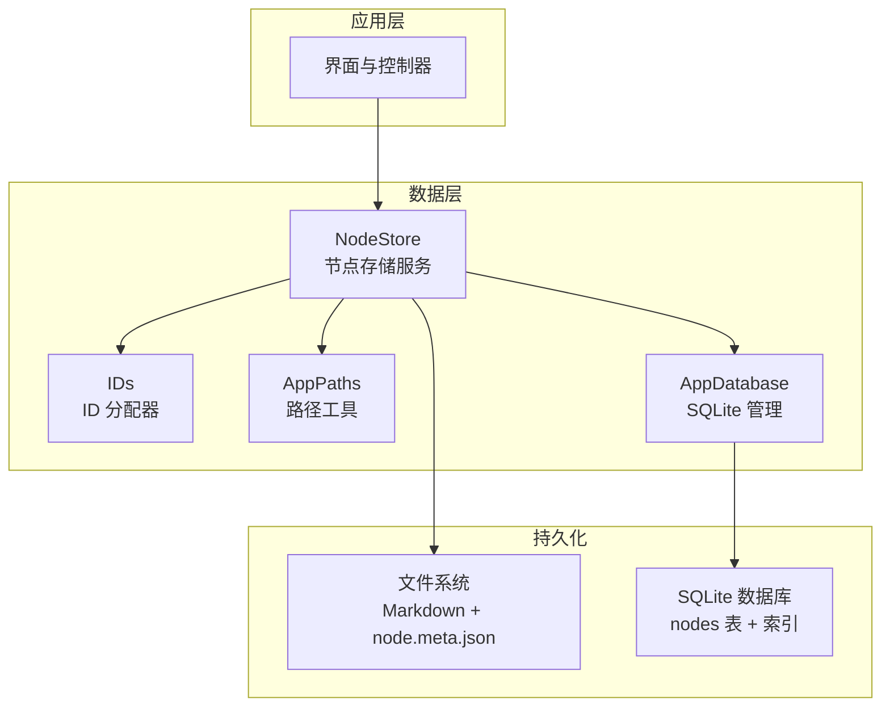
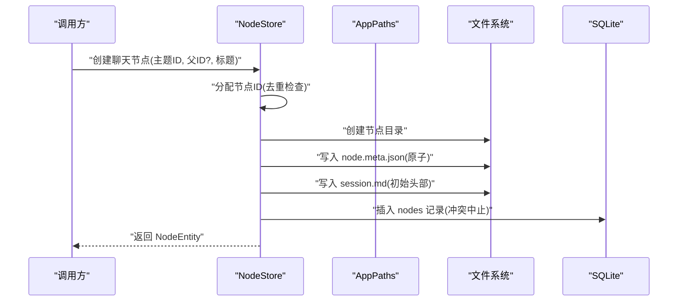
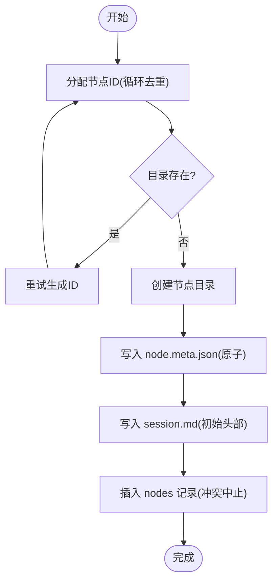
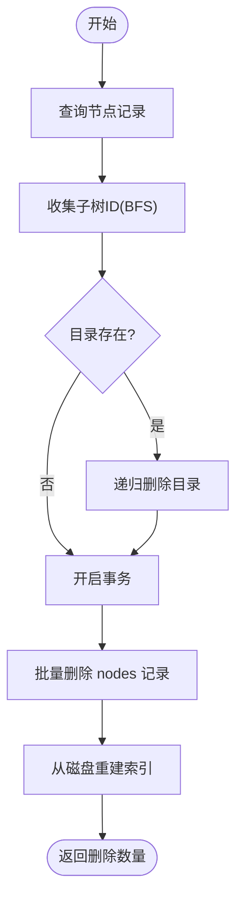
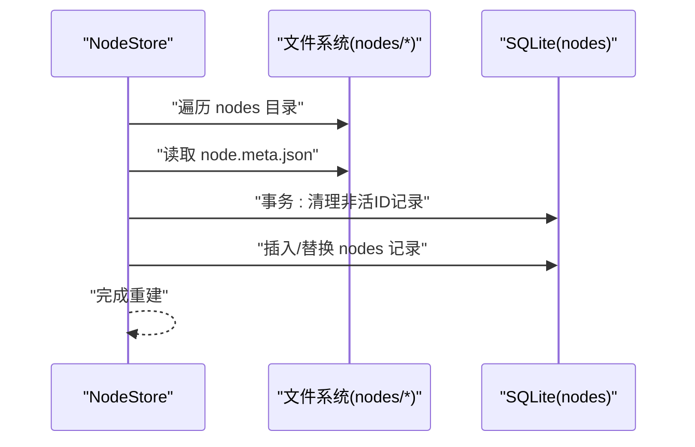
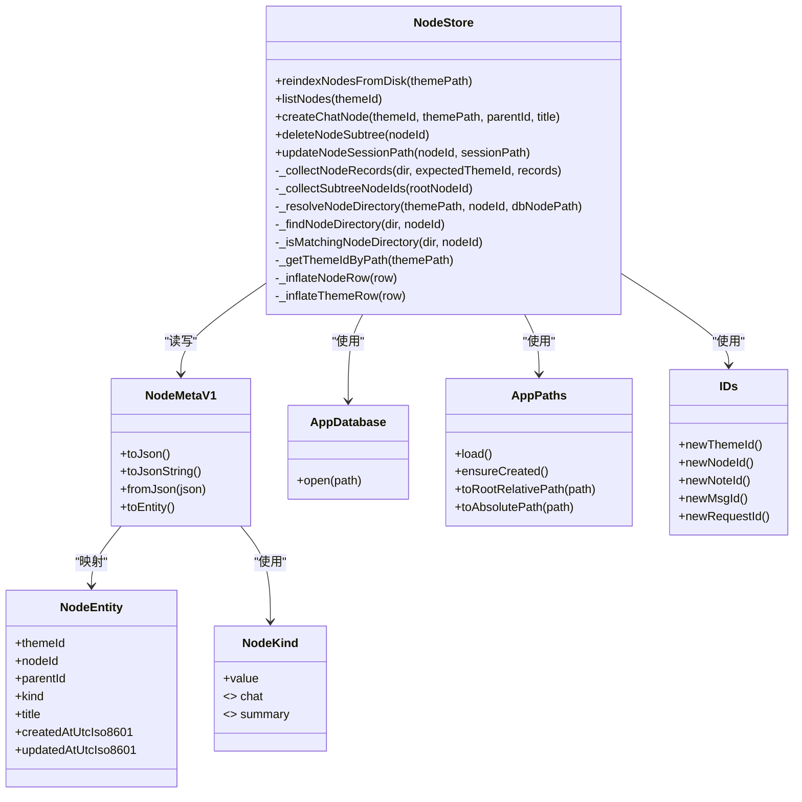

# 节点存储服务

<cite>
**本文引用的文件**
- [lib/data/stores/node_store.dart](file://lib/data/stores/node_store.dart)
- [lib/domain/node.dart](file://lib/domain/node.dart)
- [lib/data/models/node_meta.dart](file://lib/data/models/node_meta.dart)
- [lib/data/services/app_database.dart](file://lib/data/services/app_database.dart)
- [lib/domain/ids.dart](file://lib/domain/ids.dart)
- [lib/ui/core/app_paths.dart](file://lib/ui/core/app_paths.dart)
- [lib/data/services/file_write_queue.dart](file://lib/data/services/file_write_queue.dart)
- [docs/storage-format.md](file://docs/storage-format.md)
- [REQUIREMENTS.md](file://REQUIREMENTS.md)
- [test/data/stores/note_store_test.dart](file://test/data/stores/note_store_test.dart)
</cite>

## 目录
1. [简介](#简介)
2. [项目结构](#项目结构)
3. [核心组件](#核心组件)
4. [架构总览](#架构总览)
5. [详细组件分析](#详细组件分析)
6. [依赖关系分析](#依赖关系分析)
7. [性能考量](#性能考量)
8. [故障排查指南](#故障排查指南)
9. [结论](#结论)
10. [附录](#附录)

## 简介
本文件系统性阐述 NodeStore 节点存储服务的设计与实现，覆盖节点的创建、删除、索引重建、目录结构管理、文件系统原子写入、数据库事务、ID 分配、父子关系维护、树形遍历、磁盘同步与数据库一致性、错误处理与恢复、性能优化以及扩展与定制建议。NodeStore 以 SQLite 作为关系与检索索引，以 Markdown 文件作为正文真相源，确保人类可读、Agent 可解析、UI 可渲染。

## 项目结构
NodeStore 所在模块位于 lib/data/stores，配合领域模型、数据库服务、路径工具与 ID 工具共同构成节点存储子系统。整体采用“文件系统 + 关系数据库”的混合存储策略，文件系统负责正文与元数据文件，数据库负责节点关系、索引与快速查询。

图表来源
- [lib/data/stores/node_store.dart:12-375](file://lib/data/stores/node_store.dart#L12-L375)
- [lib/domain/ids.dart:1-10](file://lib/domain/ids.dart#L1-L10)
- [lib/ui/core/app_paths.dart:1-76](file://lib/ui/core/app_paths.dart#L1-L76)
- [lib/data/services/app_database.dart:1-47](file://lib/data/services/app_database.dart#L1-L47)

章节来源
- [lib/data/stores/node_store.dart:12-375](file://lib/data/stores/node_store.dart#L12-L375)
- [lib/data/services/app_database.dart:20-46](file://lib/data/services/app_database.dart#L20-L46)
- [lib/ui/core/app_paths.dart:29-75](file://lib/ui/core/app_paths.dart#L29-L75)
- [lib/domain/ids.dart:1-10](file://lib/domain/ids.dart#L1-L10)

## 核心组件
- NodeStore：节点存储主服务，负责节点创建、删除、索引重建、目录解析与路径转换、原子写入、事务协调。
- NodeMetaV1：节点元数据模型，定义 schema、主题与节点 ID、父子关系、类型、标题与时间戳。
- NodeEntity：面向 UI 的节点实体对象，用于查询结果映射。
- NodeKind：节点类型枚举（chat/summary）。
- AppDatabase：SQLite 初始化、建表与索引创建。
- AppPaths：应用根目录、主题目录、日志与临时目录管理，提供绝对/相对路径互转。
- IDs：基于 ULID 的 ID 分配器，统一生成主题、节点、笔记、消息、请求 ID。
- FileWriteQueue：文件写入串行队列，保障同一资源的串行写入，避免竞态。

章节来源
- [lib/data/stores/node_store.dart:12-375](file://lib/data/stores/node_store.dart#L12-L375)
- [lib/data/models/node_meta.dart:5-81](file://lib/data/models/node_meta.dart#L5-L81)
- [lib/domain/node.dart:1-30](file://lib/domain/node.dart#L1-L30)
- [lib/data/services/app_database.dart:20-46](file://lib/data/services/app_database.dart#L20-L46)
- [lib/ui/core/app_paths.dart:29-75](file://lib/ui/core/app_paths.dart#L29-L75)
- [lib/domain/ids.dart:1-10](file://lib/domain/ids.dart#L1-L10)
- [lib/data/services/file_write_queue.dart:1-12](file://lib/data/services/file_write_queue.dart#L1-L12)

## 架构总览
NodeStore 通过数据库维护节点关系与索引，通过文件系统维护节点正文与元数据。创建节点时，先分配唯一 ID，再创建目录与元数据文件，随后写入初始会话文件，最后在数据库中插入记录。删除节点时，先收集子树 ID，删除对应目录，再批量删除数据库记录，并触发从磁盘重建索引，确保一致性。

图表来源
- [lib/data/stores/node_store.dart:112-204](file://lib/data/stores/node_store.dart#L112-L204)
- [lib/domain/ids.dart:1-10](file://lib/domain/ids.dart#L1-L10)
- [lib/ui/core/app_paths.dart:62-75](file://lib/ui/core/app_paths.dart#L62-L75)

## 详细组件分析

### 节点创建流程
- ID 分配：循环尝试生成唯一节点 ID，同时检查文件系统与数据库是否存在，避免冲突。
- 目录与文件：创建节点目录，写入 node.meta.json 与初始 session.md。
- 数据库写入：插入 nodes 记录，字段包含主题 ID、父 ID、类型、标题、时间戳及相对路径。
- 原子写入：使用临时文件 + 重命名的方式写入 JSON/Markdown，避免部分写入导致损坏。

图表来源
- [lib/data/stores/node_store.dart:112-204](file://lib/data/stores/node_store.dart#L112-L204)
- [lib/domain/ids.dart:1-10](file://lib/domain/ids.dart#L1-L10)
- [lib/data/stores/node_store.dart:408-413](file://lib/data/stores/node_store.dart#L408-L413)

章节来源
- [lib/data/stores/node_store.dart:112-204](file://lib/data/stores/node_store.dart#L112-L204)
- [lib/domain/ids.dart:1-10](file://lib/domain/ids.dart#L1-L10)
- [lib/data/stores/node_store.dart:408-413](file://lib/data/stores/node_store.dart#L408-L413)

### 节点删除与子树遍历
- 子树收集：广度优先遍历收集待删除节点 ID 列表。
- 目录删除：定位节点目录，递归删除。
- 数据库删除：批量删除 nodes 表中的对应记录。
- 索引重建：触发从磁盘扫描重建 nodes 索引，清理孤儿记录。

图表来源
- [lib/data/stores/node_store.dart:206-235](file://lib/data/stores/node_store.dart#L206-L235)
- [lib/data/stores/node_store.dart:237-257](file://lib/data/stores/node_store.dart#L237-L257)
- [lib/data/stores/node_store.dart:18-59](file://lib/data/stores/node_store.dart#L18-L59)

章节来源
- [lib/data/stores/node_store.dart:206-235](file://lib/data/stores/node_store.dart#L206-L235)
- [lib/data/stores/node_store.dart:237-257](file://lib/data/stores/node_store.dart#L237-L257)
- [lib/data/stores/node_store.dart:18-59](file://lib/data/stores/node_store.dart#L18-L59)

### 索引重建与磁盘一致性
- 从磁盘扫描：遍历 nodes 目录，读取 node.meta.json，校验主题 ID 匹配。
- 事务性重建：在单次事务中清理过期记录、插入/替换现有记录，保持与磁盘一致。
- 相对路径管理：通过 AppPaths 将绝对路径转换为相对路径存入数据库，便于迁移与跨设备复用。

图表来源
- [lib/data/stores/node_store.dart:18-59](file://lib/data/stores/node_store.dart#L18-L59)
- [lib/data/stores/node_store.dart:61-84](file://lib/data/stores/node_store.dart#L61-L84)
- [lib/ui/core/app_paths.dart:62-75](file://lib/ui/core/app_paths.dart#L62-L75)

章节来源
- [lib/data/stores/node_store.dart:18-59](file://lib/data/stores/node_store.dart#L18-L59)
- [lib/data/stores/node_store.dart:61-84](file://lib/data/stores/node_store.dart#L61-L84)
- [lib/ui/core/app_paths.dart:62-75](file://lib/ui/core/app_paths.dart#L62-L75)

### 文件系统原子写入机制
- 临时文件 + 重命名：先写入 .tmp 文件，再 rename 到目标路径，确保写入要么完整要么完全失败。
- 适用于：node.meta.json、session.md 等关键文件，避免并发写入导致的半成品文件。

章节来源
- [lib/data/stores/node_store.dart:408-413](file://lib/data/stores/node_store.dart#L408-L413)

### 数据库事务处理
- 单事务批量操作：重建索引、删除子树均在单个事务中执行，保证 ACID。
- 冲突策略：插入 nodes 使用冲突中止策略，避免重复主键导致的脏状态。
- 索引优化：nodes 表建立 themeId+parentId 复合索引，加速父子查询与主题筛选。

章节来源
- [lib/data/stores/node_store.dart:26-58](file://lib/data/stores/node_store.dart#L26-L58)
- [lib/data/stores/node_store.dart:223-230](file://lib/data/stores/node_store.dart#L223-L230)
- [lib/data/services/app_database.dart:45-46](file://lib/data/services/app_database.dart#L45-L46)

### 节点 ID 分配算法
- ULID 生成：基于 ulid 库生成全局唯一标识，转换为大写字符串。
- 前缀规范：主题 nd_、节点 nd_、笔记 nt_、消息 msg_、请求 req_，便于识别与检索。
- 去重策略：创建前检查文件系统与数据库，避免冲突。

章节来源
- [lib/domain/ids.dart:1-10](file://lib/domain/ids.dart#L1-L10)
- [lib/data/stores/node_store.dart:141-163](file://lib/data/stores/node_store.dart#L141-L163)

### 父子节点关系维护
- 元数据字段：parentId 字段记录父节点 ID；根节点 parentId 为空。
- 类型区分：kind 字段区分 chat 与 summary 节点。
- 查询与遍历：通过 parentId 索引快速定位子节点，BFS 收集子树 ID。

章节来源
- [lib/data/models/node_meta.dart:16-22](file://lib/data/models/node_meta.dart#L16-L22)
- [lib/domain/node.dart:1-30](file://lib/domain/node.dart#L1-L30)
- [lib/data/stores/node_store.dart:237-257](file://lib/data/stores/node_store.dart#L237-L257)

### 树形结构遍历
- BFS 收集：从根节点开始，逐层收集子节点 ID，形成待删除/处理集合。
- 目录定位：优先使用数据库中的 nodePath，否则回退到磁盘扫描定位。

章节来源
- [lib/data/stores/node_store.dart:237-257](file://lib/data/stores/node_store.dart#L237-L257)
- [lib/data/stores/node_store.dart:305-353](file://lib/data/stores/node_store.dart#L305-L353)

### 目录结构管理
- 逻辑布局：主题 -> nodes -> node.meta.json + session.md + 可选 context-summary.md。
- 路径转换：AppPaths 提供绝对/相对路径互转，确保数据库中存储可移植的相对路径。

章节来源
- [REQUIREMENTS.md:85-96](file://REQUIREMENTS.md#L85-L96)
- [lib/ui/core/app_paths.dart:62-75](file://lib/ui/core/app_paths.dart#L62-L75)
- [docs/storage-format.md](file://docs/storage-format.md)

### 错误处理与异常恢复
- 主要异常：
  - 父节点不存在：创建节点时若父目录不可解析，抛出状态错误。
  - 主题未找到：根据路径解析主题 ID 失败时抛错。
  - 节点未找到：查询节点或主题记录为空时抛错。
  - 元数据格式错误：node.meta.json 解析失败或 schema 不匹配时抛错。
- 恢复策略：
  - 重建索引：删除后自动触发 reindexNodesFromDisk，清理孤儿并补全索引。
  - 原子写入：任何写入失败都不会产生半成品文件。
  - 事务回滚：数据库操作在事务中执行，失败自动回滚。

章节来源
- [lib/data/stores/node_store.dart:129-133](file://lib/data/stores/node_store.dart#L129-L133)
- [lib/data/stores/node_store.dart:290-303](file://lib/data/stores/node_store.dart#L290-L303)
- [lib/data/stores/node_store.dart:267-273](file://lib/data/stores/node_store.dart#L267-L273)
- [lib/data/models/node_meta.dart:39-68](file://lib/data/models/node_meta.dart#L39-L68)
- [lib/data/stores/node_store.dart:18-59](file://lib/data/stores/node_store.dart#L18-L59)

### 性能优化策略
- 预览友好：会话正文采用 Markdown，避免每次列表读取都解析全文。
- 索引优化：nodes 表建立复合索引，加速主题筛选与父子查询。
- 串行写入：FileWriteQueue 保障同一资源串行写入，降低锁竞争。
- 原子写入：减少磁盘碎片与 IO 开销，提升可靠性。

章节来源
- [REQUIREMENTS.md:257-258](file://REQUIREMENTS.md#L257-L258)
- [lib/data/services/app_database.dart:45-46](file://lib/data/services/app_database.dart#L45-L46)
- [lib/data/services/file_write_queue.dart:1-12](file://lib/data/services/file_write_queue.dart#L1-L12)

### 扩展与定制建议
- 自定义 ID 策略：可在 IDs 中扩展新的前缀与生成规则，保持与现有前缀不冲突。
- 存储格式演进：通过 schema 字段与版本化元数据，逐步引入新字段而不破坏兼容。
- 并发控制：在高并发场景下，结合 FileWriteQueue 与数据库事务，进一步细化锁粒度。
- 索引策略：根据查询模式增加必要索引，平衡写入与读取性能。

章节来源
- [lib/domain/ids.dart:1-10](file://lib/domain/ids.dart#L1-L10)
- [lib/data/models/node_meta.dart:24-37](file://lib/data/models/node_meta.dart#L24-L37)
- [lib/data/services/file_write_queue.dart:1-12](file://lib/data/services/file_write_queue.dart#L1-L12)

## 依赖关系分析

图表来源
- [lib/data/stores/node_store.dart:12-375](file://lib/data/stores/node_store.dart#L12-L375)
- [lib/data/models/node_meta.dart:5-81](file://lib/data/models/node_meta.dart#L5-L81)
- [lib/domain/node.dart:1-30](file://lib/domain/node.dart#L1-L30)
- [lib/data/services/app_database.dart:1-17](file://lib/data/services/app_database.dart#L1-L17)
- [lib/ui/core/app_paths.dart:1-76](file://lib/ui/core/app_paths.dart#L1-L76)
- [lib/domain/ids.dart:1-10](file://lib/domain/ids.dart#L1-L10)

章节来源
- [lib/data/stores/node_store.dart:12-375](file://lib/data/stores/node_store.dart#L12-L375)
- [lib/data/models/node_meta.dart:5-81](file://lib/data/models/node_meta.dart#L5-L81)
- [lib/domain/node.dart:1-30](file://lib/domain/node.dart#L1-L30)
- [lib/data/services/app_database.dart:1-17](file://lib/data/services/app_database.dart#L1-L17)
- [lib/ui/core/app_paths.dart:1-76](file://lib/ui/core/app_paths.dart#L1-L76)
- [lib/domain/ids.dart:1-10](file://lib/domain/ids.dart#L1-L10)

## 性能考量
- 写入路径：使用原子写入与串行队列，避免频繁 rename 与并发写入带来的抖动。
- 查询路径：利用 nodes 表复合索引，减少全表扫描；列表页仅读取必要字段。
- 存储布局：正文 Markdown 与关系 SQLite 分离，便于缓存与增量更新。
- 并发写：单写者策略与临时文件 + rename，确保流式输出不会破坏文件。

章节来源
- [REQUIREMENTS.md:257-258](file://REQUIREMENTS.md#L257-L258)
- [lib/data/stores/node_store.dart:408-413](file://lib/data/stores/node_store.dart#L408-L413)
- [lib/data/services/file_write_queue.dart:1-12](file://lib/data/services/file_write_queue.dart#L1-L12)

## 故障排查指南
- 现象：创建节点时报“父节点目录未找到”
  - 排查：确认父节点 ID 是否正确，父目录是否存在，数据库中 nodePath 是否有效。
  - 处理：修复父节点路径或重新创建父节点。
- 现象：删除节点后列表仍显示
  - 排查：确认是否调用了 reindexNodesFromDisk，数据库中是否仍有孤儿记录。
  - 处理：手动触发重建索引或检查事务是否成功提交。
- 现象：node.meta.json 无法读取
  - 排查：检查 schema 是否匹配，JSON 是否完整，文件是否被原子写入中断。
  - 处理：删除损坏文件，重新创建节点。
- 现象：磁盘与数据库不一致
  - 排查：对比 nodes 表与磁盘目录，确认相对路径转换是否正确。
  - 处理：执行 reindexNodesFromDisk，确保数据库与磁盘一致。

章节来源
- [lib/data/stores/node_store.dart:129-133](file://lib/data/stores/node_store.dart#L129-L133)
- [lib/data/stores/node_store.dart:206-235](file://lib/data/stores/node_store.dart#L206-L235)
- [lib/data/models/node_meta.dart:39-68](file://lib/data/models/node_meta.dart#L39-L68)
- [lib/data/stores/node_store.dart:18-59](file://lib/data/stores/node_store.dart#L18-L59)
- [lib/ui/core/app_paths.dart:62-75](file://lib/ui/core/app_paths.dart#L62-L75)

## 结论
NodeStore 通过“文件系统 + 关系数据库”的协同设计，实现了可靠的节点生命周期管理与强一致性的索引维护。其原子写入、事务处理与路径抽象确保了在复杂场景下的稳定性与可移植性。结合索引优化与串行写入策略，系统在性能与可靠性之间取得良好平衡。后续可围绕 ID 策略、存储格式演进与并发控制进一步扩展。

## 附录
- 存储格式权威说明：参见 docs/storage-format.md
- 产品需求与存储原则：参见 REQUIREMENTS.md

章节来源
- [docs/storage-format.md](file://docs/storage-format.md)
- [REQUIREMENTS.md:77-83](file://REQUIREMENTS.md#L77-L83)