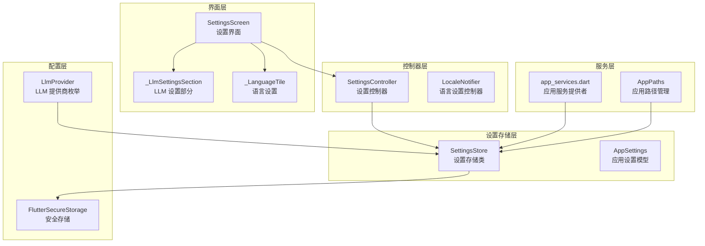
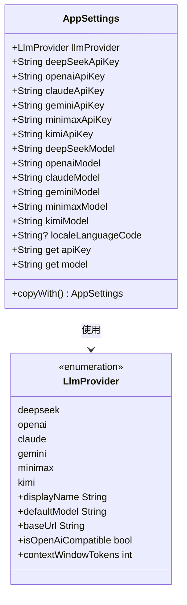
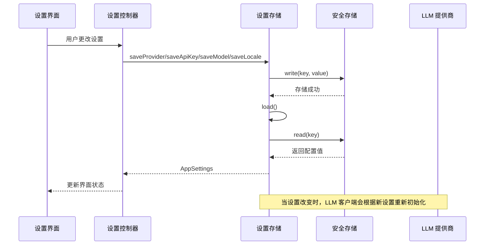
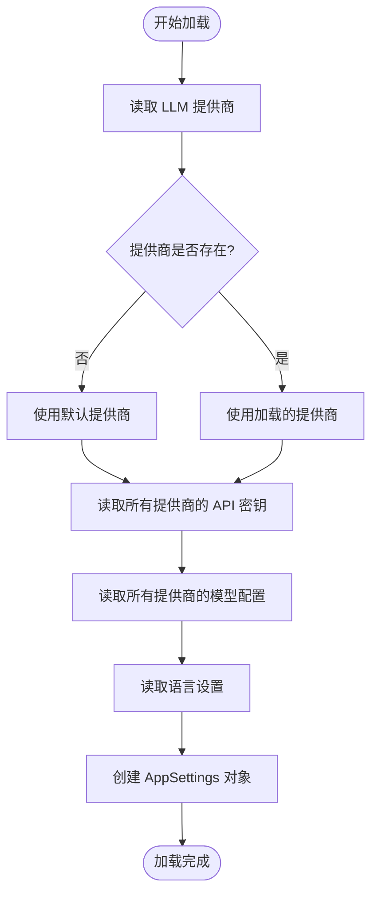
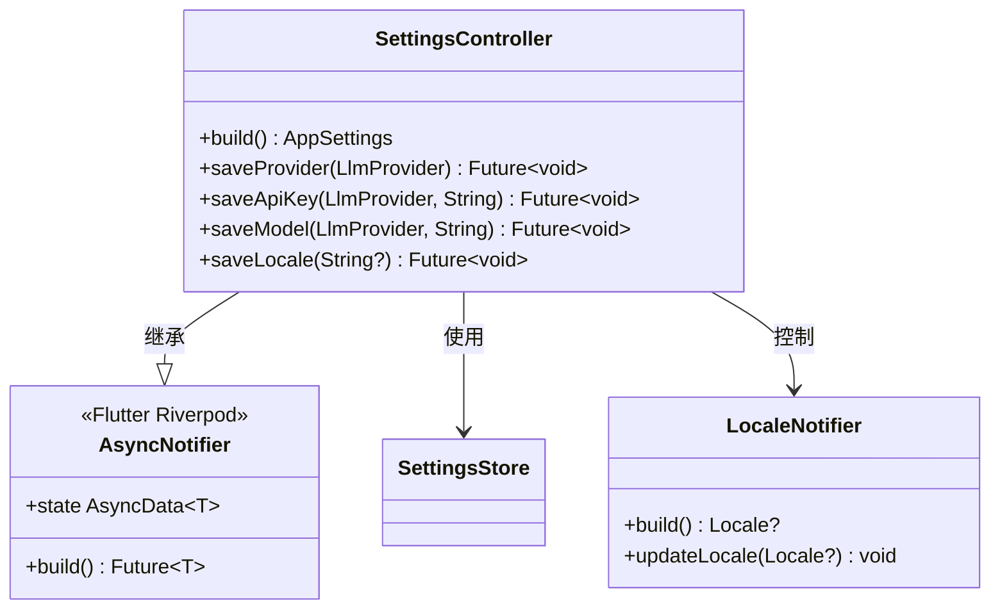
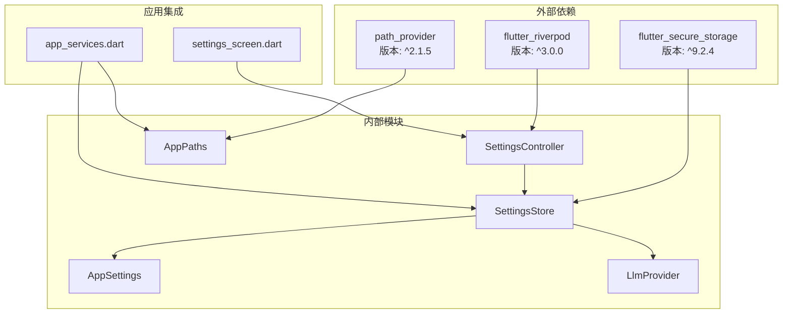

# 设置存储服务

<cite>
**本文档引用的文件**
- [settings_store.dart](file://lib/data/services/settings_store.dart)
- [settings_controller.dart](file://lib/ui/features/settings/settings_controller.dart)
- [settings_screen.dart](file://lib/ui/features/settings/settings_screen.dart)
- [llm_provider.dart](file://lib/data/services/llm_provider.dart)
- [app_services.dart](file://lib/ui/core/app_services.dart)
- [app_paths.dart](file://lib/ui/core/app_paths.dart)
- [storage-format.md](file://docs/storage-format.md)
- [design.md](file://docs/design.md)
- [pubspec.yaml](file://pubspec.yaml)
</cite>

## 目录
1. [简介](#简介)
2. [项目结构](#项目结构)
3. [核心组件](#核心组件)
4. [架构概览](#架构概览)
5. [详细组件分析](#详细组件分析)
6. [依赖关系分析](#依赖关系分析)
7. [性能考虑](#性能考虑)
8. [故障排除指南](#故障排除指南)
9. [结论](#结论)
10. [附录](#附录)

## 简介

设置存储服务是 ThkTree 应用中的核心配置管理系统，负责管理用户的应用设置、LLM 提供商配置、API 密钥存储和本地化设置。该系统基于 Flutter Secure Storage 实现安全的敏感信息存储，并通过 Riverpod 提供响应式的设置管理。

本服务实现了完整的设置生命周期管理，包括设置的加载、保存、验证和默认值处理。系统支持多种 LLM 提供商（DeepSeek、OpenAI、Claude、Gemini、MiniMax、Kimi），每个提供商都有独立的 API 密钥和模型配置。

## 项目结构

设置存储服务在项目中的组织结构如下：

**图表来源**
- [settings_store.dart:106-185](file://lib/data/services/settings_store.dart#L106-L185)
- [settings_controller.dart:7-58](file://lib/ui/features/settings/settings_controller.dart#L7-L58)
- [settings_screen.dart:14-395](file://lib/ui/features/settings/settings_screen.dart#L14-L395)

**章节来源**
- [settings_store.dart:1-185](file://lib/data/services/settings_store.dart#L1-L185)
- [settings_controller.dart:1-58](file://lib/ui/features/settings/settings_controller.dart#L1-L58)
- [settings_screen.dart:1-395](file://lib/ui/features/settings/settings_screen.dart#L1-L395)

## 核心组件

### AppSettings 数据模型

AppSettings 是设置存储的核心数据结构，负责封装所有应用配置信息：

**图表来源**
- [settings_store.dart:4-104](file://lib/data/services/settings_store.dart#L4-L104)
- [llm_provider.dart:1-111](file://lib/data/services/llm_provider.dart#L1-L111)

### SettingsStore 存储引擎

SettingsStore 是设置存储的主要实现类，负责：

- **安全存储**：使用 Flutter Secure Storage 进行敏感信息加密存储
- **配置加载**：从安全存储中读取并解析应用设置
- **配置保存**：将用户更改的设置安全地保存到存储中
- **默认值处理**：为未设置的配置项提供合理的默认值

**章节来源**
- [settings_store.dart:106-185](file://lib/data/services/settings_store.dart#L106-L185)

## 架构概览

设置存储服务采用分层架构设计，确保了良好的模块分离和可维护性：

**图表来源**
- [settings_controller.dart:14-38](file://lib/ui/features/settings/settings_controller.dart#L14-L38)
- [settings_store.dart:158-183](file://lib/data/services/settings_store.dart#L158-L183)

## 详细组件分析

### 设置存储实现

SettingsStore 类提供了完整的设置管理功能：

#### 加载机制

**图表来源**
- [settings_store.dart:117-156](file://lib/data/services/settings_store.dart#L117-L156)

#### 保存机制
SettingsStore 提供了针对不同类型设置的保存方法：

- **提供商保存**：`saveProvider(LlmProvider provider)` - 保存当前选择的 LLM 提供商
- **API 密钥保存**：`saveApiKey(LlmProvider provider, String apiKey)` - 保存指定提供商的 API 密钥，自动去除前后空白
- **模型配置保存**：`saveModel(LlmProvider provider, String model)` - 保存指定提供商的模型名称
- **语言设置保存**：`saveLocale(String? languageCode)` - 保存语言设置，支持 null 值清除设置

**章节来源**
- [settings_store.dart:158-183](file://lib/data/services/settings_store.dart#L158-L183)

### 设置控制器

SettingsController 作为 Riverpod 的 AsyncNotifier，提供了响应式的设置管理：

**图表来源**
- [settings_controller.dart:7-58](file://lib/ui/features/settings/settings_controller.dart#L7-L58)

**章节来源**
- [settings_controller.dart:7-58](file://lib/ui/features/settings/settings_controller.dart#L7-L58)

### 设置界面

设置界面提供了用户友好的配置管理体验：

#### LLM 设置部分
界面支持以下配置：
- **LLM 提供商选择**：支持 DeepSeek、OpenAI、Claude、Gemini、MiniMax、Kimi
- **API 密钥管理**：为每个提供商单独设置 API 密钥
- **模型配置**：为每个提供商设置默认使用的模型

#### 语言设置
- 支持系统默认、英语、中文三种语言选项
- 实时更新应用语言设置

**章节来源**
- [settings_screen.dart:162-247](file://lib/ui/features/settings/settings_screen.dart#L162-L247)
- [settings_screen.dart:304-373](file://lib/ui/features/settings/settings_screen.dart#L304-L373)

## 依赖关系分析

设置存储服务的依赖关系图：

**图表来源**
- [pubspec.yaml:36](file://pubspec.yaml#L36)
- [pubspec.yaml:33](file://pubspec.yaml#L33)
- [pubspec.yaml:38](file://pubspec.yaml#L38)

**章节来源**
- [pubspec.yaml:30-50](file://pubspec.yaml#L30-L50)

## 性能考虑

设置存储服务在设计时充分考虑了性能优化：

### 异步操作
- 所有存储操作都是异步的，避免阻塞主线程
- 使用 FutureProvider 和 AsyncNotifier 确保响应式更新

### 内存优化
- 设置数据在内存中缓存，减少重复读取
- 使用 copyWith 方法进行不可变更新

### 存储优化
- 仅存储必要的配置信息
- 敏感数据使用加密存储

### 界面性能
- 使用 ConsumerWidget 精确订阅所需的数据
- 避免不必要的重建

## 故障排除指南

### 常见问题及解决方案

#### 设置无法保存
**症状**：更改设置后重启应用发现设置恢复默认值
**原因**：安全存储权限问题或应用数据被清除
**解决**：检查应用权限设置，重新输入敏感信息

#### API 密钥无效
**症状**：LLM 请求失败
**原因**：API 密钥格式错误或过期
**解决**：检查密钥格式，确保没有多余空格

#### 语言设置不生效
**症状**：切换语言后界面语言不变
**原因**：Locale 设置未正确更新
**解决**：重启应用或检查系统语言设置

**章节来源**
- [settings_store.dart:162-169](file://lib/data/services/settings_store.dart#L162-L169)
- [settings_controller.dart:32-38](file://lib/ui/features/settings/settings_controller.dart#L32-L38)

## 结论

设置存储服务为 ThkTree 应用提供了完整、安全、易用的配置管理解决方案。通过采用分层架构设计、安全存储机制和响应式编程模式，该系统确保了：

- **安全性**：敏感信息（API 密钥）通过加密存储保护
- **可靠性**：完善的错误处理和默认值机制
- **可扩展性**：清晰的接口设计支持未来功能扩展
- **用户体验**：直观的界面和实时的状态反馈

该系统为应用的配置管理奠定了坚实的基础，支持应用的持续发展和功能扩展。

## 附录

### 设置存储格式

系统使用以下键名格式存储配置：

| 配置类别 | 键名格式 | 默认值 |
|---------|---------|--------|
| LLM 提供商 | `llm_provider` | `deepseek` |
| API 密钥 | `llm_api_key_{provider}` | 空字符串 |
| 模型配置 | `llm_model_{provider}` | 各提供商默认模型 |
| 语言设置 | `locale_language_code` | 系统默认 |

### 扩展接口

要添加新的配置项，需要：

1. **更新 AppSettings 类**：添加新的字段和 copyWith 参数
2. **更新 SettingsStore**：添加 load 和 save 方法
3. **更新界面**：添加相应的设置控件
4. **更新默认值**：在 LlmProvider 中添加相应配置

### 安全配置管理

系统实现了多层次的安全保护：

- **传输安全**：所有网络通信使用 HTTPS
- **存储安全**：敏感信息通过设备安全存储加密
- **访问控制**：仅应用自身可以访问设置数据
- **审计日志**：记录重要的设置变更操作