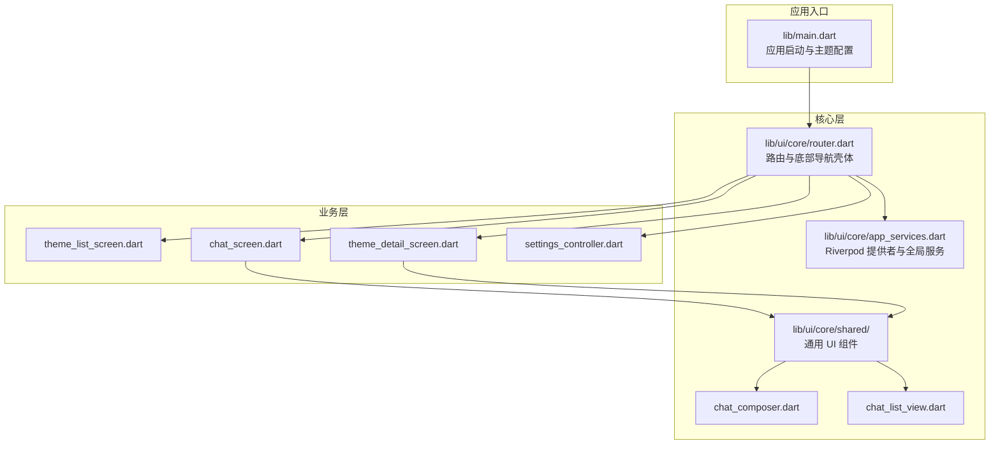
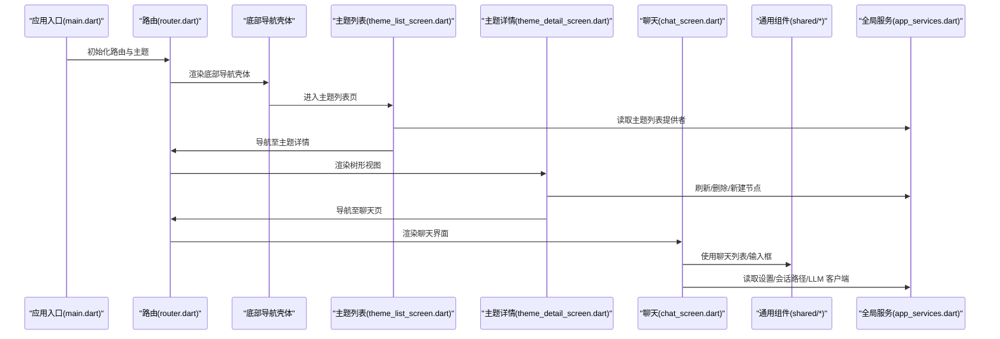
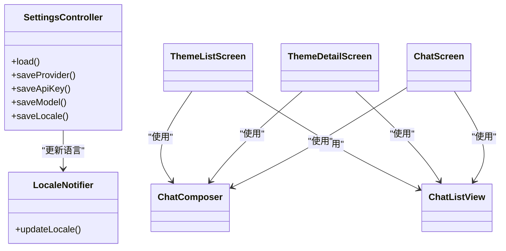
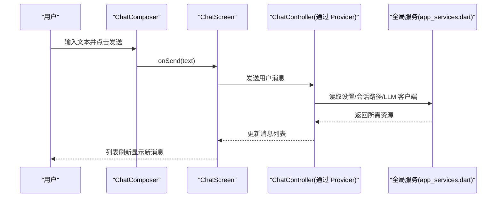
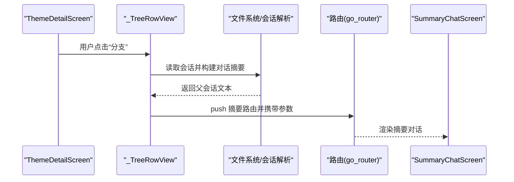
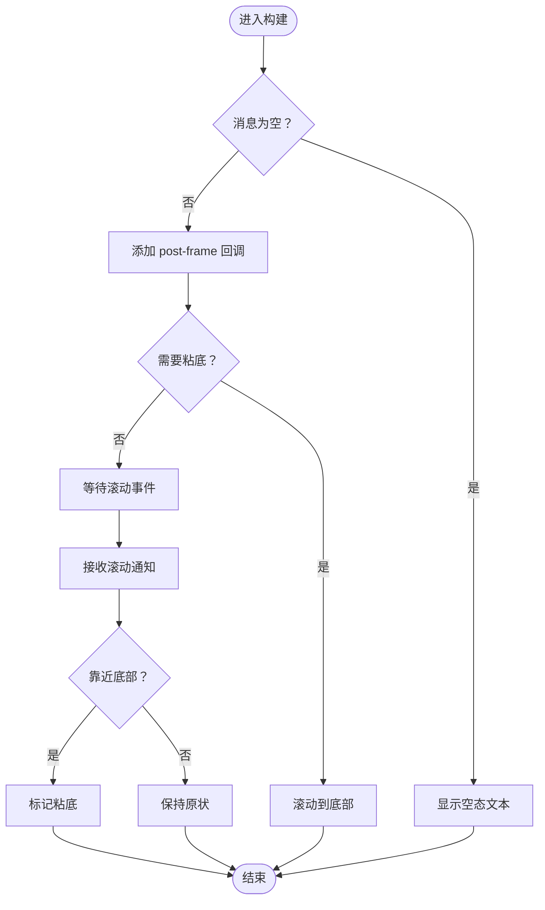
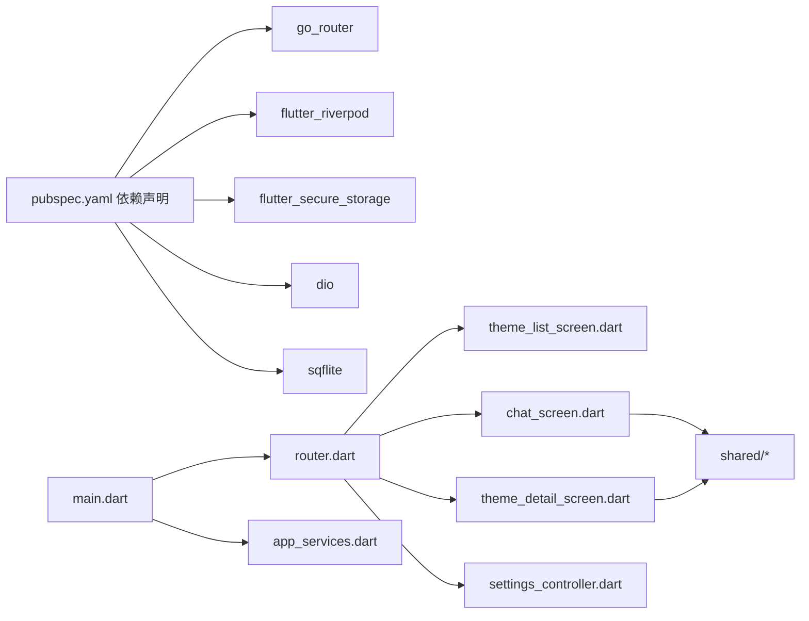

# UI 组件架构

<cite>
**本文引用的文件**
- [lib/main.dart](file://lib/main.dart)
- [pubspec.yaml](file://pubspec.yaml)
- [lib/ui/core/router.dart](file://lib/ui/core/router.dart)
- [lib/ui/core/app_services.dart](file://lib/ui/core/app_services.dart)
- [lib/ui/core/shared/chat_composer.dart](file://lib/ui/core/shared/chat_composer.dart)
- [lib/ui/core/shared/chat_list_view.dart](file://lib/ui/core/shared/chat_list_view.dart)
- [lib/ui/features/settings/settings_controller.dart](file://lib/ui/features/settings/settings_controller.dart)
- [lib/ui/features/themes/theme_list_screen.dart](file://lib/ui/features/themes/theme_list_screen.dart)
- [lib/ui/features/themes/theme_detail_screen.dart](file://lib/ui/features/themes/theme_detail_screen.dart)
- [lib/ui/features/chat/chat_screen.dart](file://lib/ui/features/chat/chat_screen.dart)
- [test/widget_test.dart](file://test/widget_test.dart)
- [test/ui/core/shared/chat_composer_test.dart](file://test/ui/core/shared/chat_composer_test.dart)
</cite>

## 目录
1. [简介](#简介)
2. [项目结构](#项目结构)
3. [核心组件](#核心组件)
4. [架构总览](#架构总览)
5. [组件详解](#组件详解)
6. [依赖关系分析](#依赖关系分析)
7. [性能考量](#性能考量)
8. [故障排查指南](#故障排查指南)
9. [结论](#结论)
10. [附录](#附录)

## 简介
本文件系统化梳理 ThkTree 的 UI 组件架构，明确核心组件、业务组件与通用组件的职责边界；阐述组件间通信（父子、兄弟、全局）机制；总结组件复用策略与组件库设计原则；解释响应式布局与 Material 3 主题的应用方式；并给出测试策略与性能优化建议。目标是帮助开发者快速理解并高效扩展 UI 层。

## 项目结构
ThkTree 采用按“功能域”组织的 UI 结构：顶层为应用入口与路由配置，核心层包含通用共享组件与应用服务（Riverpod 提供者），业务层按特性划分（主题、笔记、聊天、设置、摘要等）。该结构有利于高内聚低耦合，便于组件复用与测试隔离。

图表来源
- [lib/main.dart:61-93](file://lib/main.dart#L61-L93)
- [lib/ui/core/router.dart:18-87](file://lib/ui/core/router.dart#L18-L87)
- [lib/ui/core/app_services.dart:27-75](file://lib/ui/core/app_services.dart#L27-L75)
- [lib/ui/core/shared/chat_composer.dart:5-23](file://lib/ui/core/shared/chat_composer.dart#L5-L23)
- [lib/ui/core/shared/chat_list_view.dart:8-20](file://lib/ui/core/shared/chat_list_view.dart#L8-L20)
- [lib/ui/features/themes/theme_list_screen.dart:8-88](file://lib/ui/features/themes/theme_list_screen.dart#L8-L88)
- [lib/ui/features/themes/theme_detail_screen.dart:14-89](file://lib/ui/features/themes/theme_detail_screen.dart#L14-L89)
- [lib/ui/features/chat/chat_screen.dart:19-175](file://lib/ui/features/chat/chat_screen.dart#L19-L175)
- [lib/ui/features/settings/settings_controller.dart:7-42](file://lib/ui/features/settings/settings_controller.dart#L7-L42)

章节来源
- [lib/main.dart:15-93](file://lib/main.dart#L15-L93)
- [lib/ui/core/router.dart:18-126](file://lib/ui/core/router.dart#L18-L126)
- [lib/ui/core/app_services.dart:18-171](file://lib/ui/core/app_services.dart#L18-L171)

## 核心组件
- 应用根组件与主题
  - 应用入口负责初始化路径、日志、错误处理，并通过 ProviderScope 注入全局依赖。
  - 使用 Material 3 主题，基于种子色生成色彩方案，统一视觉风格。
- 路由与导航壳体
  - 使用 go_router 定义分栏路由（主题/笔记），底部导航切换分支，支持状态化壳体与索引堆栈。
- 全局服务与状态
  - Riverpod 提供者链路贯穿数据访问、数据库、日志、设置、LLM 客户端等，形成稳定的跨组件共享通道。
- 通用共享组件
  - 聊天输入框、聊天列表视图等可复用 UI 基元，封装交互细节与滚动行为。

章节来源
- [lib/main.dart:49-93](file://lib/main.dart#L49-L93)
- [lib/ui/core/router.dart:18-126](file://lib/ui/core/router.dart#L18-L126)
- [lib/ui/core/app_services.dart:27-75](file://lib/ui/core/app_services.dart#L27-L75)
- [lib/ui/core/shared/chat_composer.dart:5-23](file://lib/ui/core/shared/chat_composer.dart#L5-L23)
- [lib/ui/core/shared/chat_list_view.dart:8-20](file://lib/ui/core/shared/chat_list_view.dart#L8-L20)

## 架构总览
下图展示从应用入口到各业务屏幕、再到通用共享组件与全局服务的整体调用关系与数据流向。

图表来源
- [lib/main.dart:49-93](file://lib/main.dart#L49-L93)
- [lib/ui/core/router.dart:18-126](file://lib/ui/core/router.dart#L18-L126)
- [lib/ui/features/themes/theme_list_screen.dart:14-88](file://lib/ui/features/themes/theme_list_screen.dart#L14-L88)
- [lib/ui/features/themes/theme_detail_screen.dart:27-89](file://lib/ui/features/themes/theme_detail_screen.dart#L27-L89)
- [lib/ui/features/chat/chat_screen.dart:42-175](file://lib/ui/features/chat/chat_screen.dart#L42-L175)
- [lib/ui/core/app_services.dart:51-75](file://lib/ui/core/app_services.dart#L51-L75)

## 组件详解

### 组件分类与职责
- 核心组件
  - 应用根组件：负责主题、国际化、路由注册与 ProviderScope 注入。
  - 路由壳体：承载底部导航与分支导航，维护当前索引与版本号提示。
  - 全局服务提供者：数据库、日志、设置、LLM 客户端等。
- 业务组件
  - 主题相关：主题列表、主题详情（树形渲染、增删改）、分支/摘要跳转。
  - 聊天相关：消息列表、输入框、上下文使用条、分支对话。
  - 设置相关：语言、模型、API Key 等配置项。
- 通用组件
  - 聊天输入框：多行文本、快捷键、发送/停止流控制。
  - 聊天列表视图：自动滚动、滚动粘底、历史浏览行为识别。

章节来源
- [lib/main.dart:61-93](file://lib/main.dart#L61-L93)
- [lib/ui/core/router.dart:89-125](file://lib/ui/core/router.dart#L89-L125)
- [lib/ui/core/app_services.dart:18-75](file://lib/ui/core/app_services.dart#L18-L75)
- [lib/ui/features/themes/theme_list_screen.dart:8-88](file://lib/ui/features/themes/theme_list_screen.dart#L8-L88)
- [lib/ui/features/themes/theme_detail_screen.dart:14-89](file://lib/ui/features/themes/theme_detail_screen.dart#L14-L89)
- [lib/ui/features/chat/chat_screen.dart:19-175](file://lib/ui/features/chat/chat_screen.dart#L19-L175)
- [lib/ui/core/shared/chat_composer.dart:5-160](file://lib/ui/core/shared/chat_composer.dart#L5-L160)
- [lib/ui/core/shared/chat_list_view.dart:8-99](file://lib/ui/core/shared/chat_list_view.dart#L8-L99)

### 组件通信机制
- 父子组件通信
  - 父组件通过参数传递数据与回调（如 ChatScreen 向 ChatListView 传入消息列表与构建器）。
  - 子组件通过回调向上触发动作（如 ChatComposer 的 onSend/onStopStreaming）。
- 兄弟组件通信
  - 通过共同父组件协调（如主题详情中的树节点操作与路由跳转）。
  - 通过全局状态共享（如底部导航点击时对笔记分支版本计数器 bump，触发刷新）。
- 全局状态共享
  - Riverpod 提供者链路：appPaths、appDatabase、appLogger、themeStore、nodeStore、settingsStore、appSettings、llmClient 等。
  - 设置控制器：AsyncNotifier 封装异步设置加载与保存，支持语言切换后更新 localeProvider。

图表来源
- [lib/ui/features/settings/settings_controller.dart:7-57](file://lib/ui/features/settings/settings_controller.dart#L7-L57)
- [lib/ui/features/themes/theme_list_screen.dart:8-88](file://lib/ui/features/themes/theme_list_screen.dart#L8-L88)
- [lib/ui/features/themes/theme_detail_screen.dart:14-89](file://lib/ui/features/themes/theme_detail_screen.dart#L14-L89)
- [lib/ui/features/chat/chat_screen.dart:19-175](file://lib/ui/features/chat/chat_screen.dart#L19-L175)
- [lib/ui/core/shared/chat_composer.dart:5-160](file://lib/ui/core/shared/chat_composer.dart#L5-L160)
- [lib/ui/core/shared/chat_list_view.dart:8-99](file://lib/ui/core/shared/chat_list_view.dart#L8-L99)

章节来源
- [lib/ui/core/router.dart:100-109](file://lib/ui/core/router.dart#L100-L109)
- [lib/ui/features/settings/settings_controller.dart:32-38](file://lib/ui/features/settings/settings_controller.dart#L32-L38)

### 组件复用策略与组件库设计原则
- 复用策略
  - 通用共享组件：将交互细节（输入、滚动、键盘事件）下沉到共享组件，业务屏仅负责数据与路由。
  - 参数化渲染：通过函数参数或构造参数注入数据与行为，降低耦合度。
  - Provider 链路：通过 Riverpod 提供者在组件树中透明共享状态与服务。
- 设计原则
  - 单一职责：每个组件聚焦一个 UI 功能点。
  - 可测试性：以无状态/有状态 Widget 与 Notifier/AsyncNotifier 形式暴露清晰接口。
  - 可扩展性：通过路由参数与 Provider 参数化组件行为。

章节来源
- [lib/ui/core/shared/chat_composer.dart:5-160](file://lib/ui/core/shared/chat_composer.dart#L5-L160)
- [lib/ui/core/shared/chat_list_view.dart:8-99](file://lib/ui/core/shared/chat_list_view.dart#L8-L99)
- [lib/ui/core/app_services.dart:51-75](file://lib/ui/core/app_services.dart#L51-L75)

### 响应式设计与 Material 3 主题
- 响应式布局
  - 在主题列表中根据最大宽度约束选择不同的容器与列表布局，保证桌面与移动端一致体验。
  - 聊天列表使用 NotificationListener 与 ScrollController 实现智能滚动粘底与历史浏览体验。
- Material 3 主题
  - 应用根组件启用 Material 3，使用种子色生成色彩方案，确保全局一致性。
  - 通用组件与业务组件均直接使用 Theme.of(context) 获取主题值，保持风格统一。

章节来源
- [lib/ui/features/themes/theme_list_screen.dart:34-72](file://lib/ui/features/themes/theme_list_screen.dart#L34-L72)
- [lib/ui/core/shared/chat_list_view.dart:46-83](file://lib/ui/core/shared/chat_list_view.dart#L46-L83)
- [lib/main.dart:79-82](file://lib/main.dart#L79-L82)

### 关键流程时序

#### 聊天输入与发送

图表来源
- [lib/ui/core/shared/chat_composer.dart:119-135](file://lib/ui/core/shared/chat_composer.dart#L119-L135)
- [lib/ui/features/chat/chat_screen.dart:140-146](file://lib/ui/features/chat/chat_screen.dart#L140-L146)
- [lib/ui/core/app_services.dart:67-75](file://lib/ui/core/app_services.dart#L67-L75)

#### 主题树节点分支

图表来源
- [lib/ui/features/themes/theme_detail_screen.dart:165-201](file://lib/ui/features/themes/theme_detail_screen.dart#L165-L201)
- [lib/ui/core/router.dart:48-61](file://lib/ui/core/router.dart#L48-L61)

### 复杂逻辑流程图

#### 聊天列表滚动粘底算法

图表来源
- [lib/ui/core/shared/chat_list_view.dart:41-98](file://lib/ui/core/shared/chat_list_view.dart#L41-L98)

## 依赖关系分析
- 外部依赖
  - Flutter SDK、go_router、flutter_riverpod、flutter_secure_storage、dio、sqflite、path、path_provider、intl、flutter_markdown 等。
- 内部依赖
  - UI 层通过 go_router 与 ProviderScope 解耦，核心服务通过 app_services.dart 的 FutureProvider/NotifierProvider 统一管理。
  - 业务组件仅依赖核心服务提供的 Provider，避免直接访问数据层。

图表来源
- [pubspec.yaml:30-49](file://pubspec.yaml#L30-L49)
- [lib/main.dart:3-13](file://lib/main.dart#L3-L13)
- [lib/ui/core/router.dart:1-12](file://lib/ui/core/router.dart#L1-L12)
- [lib/ui/core/app_services.dart:1-17](file://lib/ui/core/app_services.dart#L1-L17)

章节来源
- [pubspec.yaml:30-49](file://pubspec.yaml#L30-L49)
- [lib/ui/core/app_services.dart:27-75](file://lib/ui/core/app_services.dart#L27-L75)

## 性能考量
- 渲染性能
  - 聊天列表使用 ListView.builder 与最小化重建策略，避免不必要的重绘。
  - 滚动粘底采用阈值判断与动画微调，减少频繁滚动抖动。
- 状态与数据访问
  - Riverpod 提供者按需懒加载与缓存，避免重复 IO 与昂贵计算。
  - 会话路径查找优先数据库命中，回退到文件系统扫描并缓存结果。
- 资源与内存
  - 控制台输入框与焦点管理，及时释放控制器与焦点节点。
  - 图表绘制使用 CustomPainter，按需重绘，颜色变化时才触发重绘。

章节来源
- [lib/ui/core/shared/chat_list_view.dart:74-98](file://lib/ui/core/shared/chat_list_view.dart#L74-L98)
- [lib/ui/core/app_services.dart:87-169](file://lib/ui/core/app_services.dart#L87-L169)
- [lib/ui/core/shared/chat_composer.dart:26-43](file://lib/ui/core/shared/chat_composer.dart#L26-L43)

## 故障排查指南
- 路由与导航
  - 若底部导航不切换分支，请检查 StatefulShellRoute 的分支键与 goBranch 调用。
  - 错误页面通过 errorBuilder 中心化展示，便于定位异常。
- 聊天输入
  - 发送按钮禁用或未响应：确认 enabled 与 isStreaming 状态；检查 onSend 回调是否抛出异常。
  - 文本框未清空：确认成功路径后恢复焦点与清空文本。
- 会话路径查找
  - 数据库路径失效：系统会回退到文件系统递归扫描并更新缓存；若仍失败，检查主题目录权限与文件存在性。
- 设置与语言
  - 语言切换后未生效：确认 localeProvider 已更新，MaterialApp 的 localeResolutionCallback 正常工作。

章节来源
- [lib/ui/core/router.dart:81-87](file://lib/ui/core/router.dart#L81-L87)
- [lib/ui/core/shared/chat_composer.dart:119-135](file://lib/ui/core/shared/chat_composer.dart#L119-L135)
- [lib/ui/core/app_services.dart:104-169](file://lib/ui/core/app_services.dart#L104-L169)
- [lib/ui/features/settings/settings_controller.dart:32-38](file://lib/ui/features/settings/settings_controller.dart#L32-L38)

## 结论
ThkTree 的 UI 架构以 Riverpod 为核心，结合 go_router 实现清晰的功能域划分与导航结构；通过通用共享组件与 Provider 链路实现高复用与低耦合；Material 3 主题与响应式布局保障一致且适配多端的用户体验。配合完善的测试策略与性能优化实践，为后续迭代提供了坚实基础。

## 附录

### 测试策略
- Widget 层测试
  - 使用 ProviderScope 与 override 注入假控制器，验证屏幕初始状态与交互。
- 组件单元测试
  - 对通用组件（如 ChatComposer）进行交互验证：按钮状态、回调触发、文本清空等。
- 覆盖范围
  - 覆盖关键交互路径与错误分支，确保异常场景下的 UI 行为稳定。

章节来源
- [test/widget_test.dart:16-32](file://test/widget_test.dart#L16-L32)
- [test/ui/core/shared/chat_composer_test.dart:36-134](file://test/ui/core/shared/chat_composer_test.dart#L36-L134)