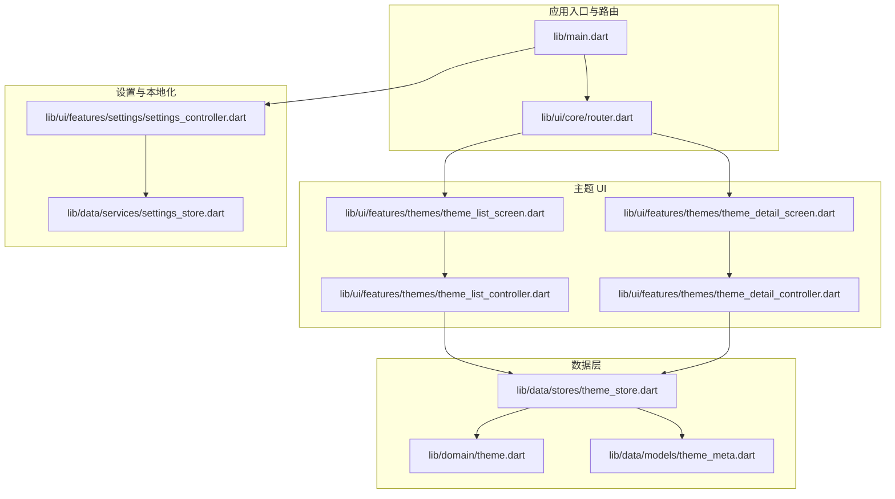
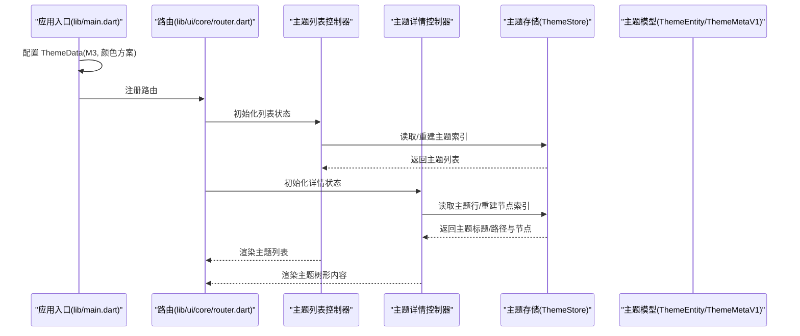
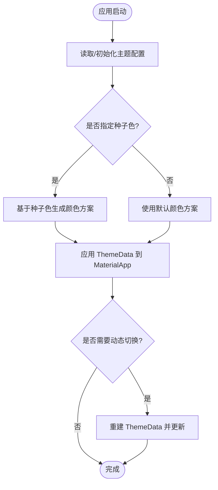
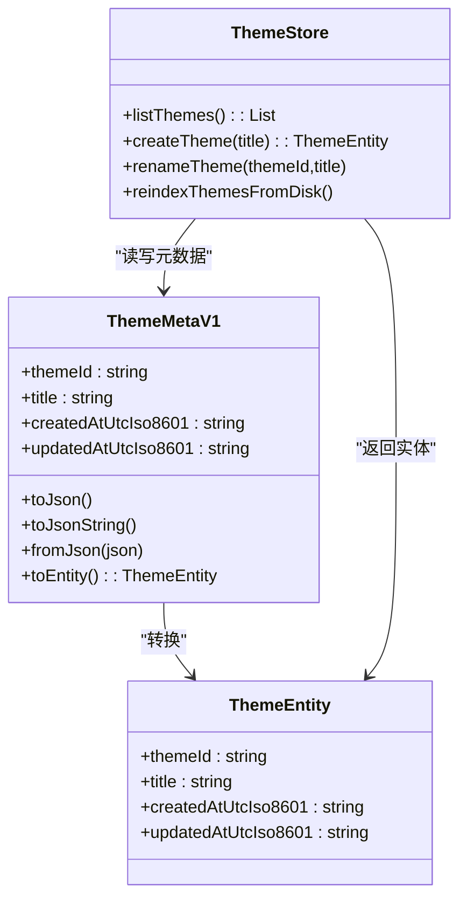
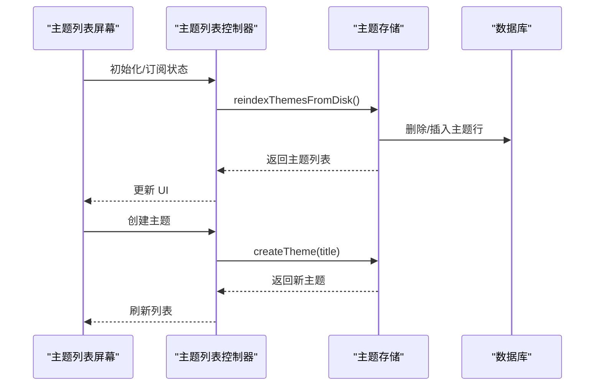
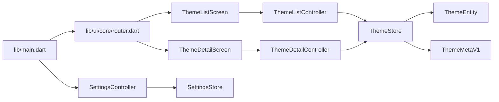

# 主题系统

<cite>
**本文引用的文件**
- [lib/main.dart](file://lib/main.dart)
- [lib/ui/core/router.dart](file://lib/ui/core/router.dart)
- [lib/ui/features/themes/theme_list_screen.dart](file://lib/ui/features/themes/theme_list_screen.dart)
- [lib/ui/features/themes/theme_detail_screen.dart](file://lib/ui/features/themes/theme_detail_screen.dart)
- [lib/ui/features/themes/theme_list_controller.dart](file://lib/ui/features/themes/theme_list_controller.dart)
- [lib/ui/features/themes/theme_detail_controller.dart](file://lib/ui/features/themes/theme_detail_controller.dart)
- [lib/data/stores/theme_store.dart](file://lib/data/stores/theme_store.dart)
- [lib/data/models/theme_meta.dart](file://lib/data/models/theme_meta.dart)
- [lib/domain/theme.dart](file://lib/domain/theme.dart)
- [lib/data/services/settings_store.dart](file://lib/data/services/settings_store.dart)
- [lib/ui/features/settings/settings_controller.dart](file://lib/ui/features/settings/settings_controller.dart)
- [test/ui/features/themes/theme_list_screen_test.dart](file://test/ui/features/themes/theme_list_screen_test.dart)
- [test/data/models/theme_meta_test.dart](file://test/data/models/theme_meta_test.dart)
- [test/data/stores/note_store_test.dart](file://test/data/stores/note_store_test.dart)
</cite>

## 目录
1. [简介](#简介)
2. [项目结构](#项目结构)
3. [核心组件](#核心组件)
4. [架构总览](#架构总览)
5. [组件详解](#组件详解)
6. [依赖关系分析](#依赖关系分析)
7. [性能考量](#性能考量)
8. [故障排查指南](#故障排查指南)
9. [结论](#结论)
10. [附录](#附录)

## 简介
本文件系统性梳理 ThkTree 的“主题系统”，重点围绕 Material 3 主题的设计与实现、颜色方案、字体样式与间距配置、深浅色支持、主题切换与动态更新策略、以及自定义扩展与变量使用规范进行说明。当前仓库中，Material 3 主题通过应用入口统一配置，主题数据模型与存储位于数据层，UI 层通过 Riverpod 控制器与屏幕进行交互；同时，设置模块负责语言等全局偏好，为主题系统提供基础支撑。

## 项目结构
主题系统涉及的主要目录与文件如下：
- 应用入口与路由：lib/main.dart、lib/ui/core/router.dart
- 主题列表与详情：lib/ui/features/themes/theme_list_screen.dart、lib/ui/features/themes/theme_detail_screen.dart
- 主题控制器：lib/ui/features/themes/theme_list_controller.dart、lib/ui/features/themes/theme_detail_controller.dart
- 数据模型与存储：lib/data/models/theme_meta.dart、lib/domain/theme.dart、lib/data/stores/theme_store.dart
- 设置与本地化：lib/data/services/settings_store.dart、lib/ui/features/settings/settings_controller.dart
- 测试：test/ui/features/themes/theme_list_screen_test.dart、test/data/models/theme_meta_test.dart、test/data/stores/note_store_test.dart

图表来源
- [lib/main.dart:61-93](file://lib/main.dart#L61-L93)
- [lib/ui/core/router.dart:18-51](file://lib/ui/core/router.dart#L18-L51)
- [lib/ui/features/themes/theme_list_screen.dart:1-124](file://lib/ui/features/themes/theme_list_screen.dart#L1-L124)
- [lib/ui/features/themes/theme_detail_screen.dart:1-57](file://lib/ui/features/themes/theme_detail_screen.dart#L1-L57)
- [lib/ui/features/themes/theme_list_controller.dart:1-27](file://lib/ui/features/themes/theme_list_controller.dart#L1-L27)
- [lib/ui/features/themes/theme_detail_controller.dart:1-87](file://lib/ui/features/themes/theme_detail_controller.dart#L1-L87)
- [lib/data/stores/theme_store.dart:1-157](file://lib/data/stores/theme_store.dart#L1-L157)
- [lib/data/models/theme_meta.dart:1-61](file://lib/data/models/theme_meta.dart#L1-L61)
- [lib/domain/theme.dart:1-15](file://lib/domain/theme.dart#L1-L15)
- [lib/data/services/settings_store.dart:1-185](file://lib/data/services/settings_store.dart#L1-L185)
- [lib/ui/features/settings/settings_controller.dart:1-58](file://lib/ui/features/settings/settings_controller.dart#L1-L58)

章节来源
- [lib/main.dart:61-93](file://lib/main.dart#L61-L93)
- [lib/ui/core/router.dart:18-51](file://lib/ui/core/router.dart#L18-L51)

## 核心组件
- Material 3 主题配置：在应用入口中通过 ThemeData 启用 Material 3，并基于种子色生成颜色方案。
- 主题数据模型：ThemeEntity 表示主题实体；ThemeMetaV1 负责主题元数据的序列化/反序列化。
- 主题存储：ThemeStore 提供主题列表、创建、重索引等能力，并与数据库交互。
- 主题控制器：ThemeListController 与 ThemeDetailController 使用 Riverpod 管理异步状态与刷新逻辑。
- UI 屏幕：ThemeListScreen 与 ThemeDetailScreen 呈现主题列表与树形内容，支持响应式布局。
- 设置与本地化：SettingsStore 与 SettingsController 管理语言等偏好，影响本地化与界面呈现。

章节来源
- [lib/main.dart:79-82](file://lib/main.dart#L79-L82)
- [lib/domain/theme.dart:1-15](file://lib/domain/theme.dart#L1-L15)
- [lib/data/models/theme_meta.dart:1-61](file://lib/data/models/theme_meta.dart#L1-L61)
- [lib/data/stores/theme_store.dart:1-157](file://lib/data/stores/theme_store.dart#L1-L157)
- [lib/ui/features/themes/theme_list_controller.dart:1-27](file://lib/ui/features/themes/theme_list_controller.dart#L1-L27)
- [lib/ui/features/themes/theme_detail_controller.dart:1-87](file://lib/ui/features/themes/theme_detail_controller.dart#L1-L87)
- [lib/ui/features/themes/theme_list_screen.dart:1-124](file://lib/ui/features/themes/theme_list_screen.dart#L1-L124)
- [lib/ui/features/themes/theme_detail_screen.dart:1-57](file://lib/ui/features/themes/theme_detail_screen.dart#L1-L57)
- [lib/data/services/settings_store.dart:1-185](file://lib/data/services/settings_store.dart#L1-L185)
- [lib/ui/features/settings/settings_controller.dart:1-58](file://lib/ui/features/settings/settings_controller.dart#L1-L58)

## 架构总览
Material 3 主题由应用入口集中配置，主题数据通过存储层持久化并被控制器与屏幕消费。路由负责导航到主题列表与详情页面，控制器负责加载、刷新与重建索引，屏幕负责渲染与响应式布局。

图表来源
- [lib/main.dart:61-93](file://lib/main.dart#L61-L93)
- [lib/ui/core/router.dart:18-51](file://lib/ui/core/router.dart#L18-L51)
- [lib/ui/features/themes/theme_list_controller.dart:1-27](file://lib/ui/features/themes/theme_list_controller.dart#L1-L27)
- [lib/ui/features/themes/theme_detail_controller.dart:1-87](file://lib/ui/features/themes/theme_detail_controller.dart#L1-L87)
- [lib/data/stores/theme_store.dart:1-157](file://lib/data/stores/theme_store.dart#L1-L157)
- [lib/domain/theme.dart:1-15](file://lib/domain/theme.dart#L1-L15)
- [lib/data/models/theme_meta.dart:1-61](file://lib/data/models/theme_meta.dart#L1-L61)

## 组件详解

### Material 3 主题与颜色方案
- 设计理念
  - 使用 Material 3（Material You）以实现一致、可扩展且符合平台语义的主题体验。
  - 通过种子色生成颜色方案，确保主色一致性与视觉和谐。
- 实现方式
  - 在应用入口中启用 M3 并指定 seedColor，系统自动推导出主色、辅色、背景、表面等层级色彩。
  - 当前未显式覆盖明暗模式的颜色映射，因此默认跟随系统或平台行为。
- 字体样式与间距
  - 未在入口处显式配置 Typography 与 Spacing，采用默认 Material 3 字号与间距体系。
- 深浅色支持
  - 未显式声明 Light/Dark ColorScheme，当前表现取决于平台与系统设置。
- 动态主题更新策略
  - 未实现运行时切换明暗模式或动态变更 seedColor 的逻辑；如需支持，可在入口处监听设置变化并重建 ThemeData。

图表来源
- [lib/main.dart:79-82](file://lib/main.dart#L79-L82)

章节来源
- [lib/main.dart:79-82](file://lib/main.dart#L79-L82)

### 主题数据模型与存储
- 数据模型
  - ThemeEntity：主题实体，包含标识、标题、创建与更新时间。
  - ThemeMetaV1：主题元数据，支持 JSON 序列化/反序列化，包含版本标记与时间戳。
- 存储与索引
  - ThemeStore 提供列出、创建、重索引等操作；创建时写入 theme.meta.json 并插入数据库；重索引从磁盘扫描主题目录并重建数据库索引。
- 复杂度与性能
  - 列表查询为 O(n) 遍历数据库行；创建与重索引涉及文件系统 IO 与事务写入，建议在后台线程执行并避免频繁触发。

图表来源
- [lib/domain/theme.dart:1-15](file://lib/domain/theme.dart#L1-L15)
- [lib/data/models/theme_meta.dart:1-61](file://lib/data/models/theme_meta.dart#L1-L61)
- [lib/data/stores/theme_store.dart:1-157](file://lib/data/stores/theme_store.dart#L1-L157)

章节来源
- [lib/domain/theme.dart:1-15](file://lib/domain/theme.dart#L1-L15)
- [lib/data/models/theme_meta.dart:1-61](file://lib/data/models/theme_meta.dart#L1-L61)
- [lib/data/stores/theme_store.dart:17-139](file://lib/data/stores/theme_store.dart#L17-L139)

### 主题控制器与 UI 屏幕
- 主题列表控制器
  - 初始化时重建主题索引并列出主题；支持创建新主题与重新索引。
- 主题详情控制器
  - 初始化时重建主题索引、获取主题行信息、重建节点索引并列出节点；支持刷新。
- UI 屏幕
  - ThemeListScreen：根据屏幕宽度选择布局，支持响应式列表与浮动按钮创建主题。
  - ThemeDetailScreen：展示主题树形内容，支持刷新与返回。

图表来源
- [lib/ui/features/themes/theme_list_screen.dart:11-88](file://lib/ui/features/themes/theme_list_screen.dart#L11-L88)
- [lib/ui/features/themes/theme_list_controller.dart:5-24](file://lib/ui/features/themes/theme_list_controller.dart#L5-L24)
- [lib/data/stores/theme_store.dart:31-80](file://lib/data/stores/theme_store.dart#L31-L80)

章节来源
- [lib/ui/features/themes/theme_list_screen.dart:11-88](file://lib/ui/features/themes/theme_list_screen.dart#L11-L88)
- [lib/ui/features/themes/theme_list_controller.dart:1-27](file://lib/ui/features/themes/theme_list_controller.dart#L1-L27)
- [lib/ui/features/themes/theme_detail_screen.dart:23-86](file://lib/ui/features/themes/theme_detail_screen.dart#L23-L86)
- [lib/ui/features/themes/theme_detail_controller.dart:19-49](file://lib/ui/features/themes/theme_detail_controller.dart#L19-L49)

### 路由与导航
- 路由注册了主题相关的多个分支，包括主题列表、主题树形页、节点详情与摘要页，便于在不同视图间切换。
- 导航参数中携带主题 ID 与节点 ID，用于控制器加载对应数据。

章节来源
- [lib/ui/core/router.dart:18-51](file://lib/ui/core/router.dart#L18-L51)

### 设置与本地化对主题的影响
- 设置模块管理语言等偏好，通过 LocaleNotifier 更新当前语言；这会影响本地化文本与 UI 呈现，但不直接改变主题颜色方案。
- 若需将语言切换与主题联动，可在入口处监听语言变化并重建 ThemeData。

章节来源
- [lib/ui/features/settings/settings_controller.dart:44-58](file://lib/ui/features/settings/settings_controller.dart#L44-L58)
- [lib/data/services/settings_store.dart:177-183](file://lib/data/services/settings_store.dart#L177-L183)

## 依赖关系分析
- 入口依赖：lib/main.dart 依赖路由与本地化资源，间接依赖设置控制器以初始化语言。
- UI 依赖：主题屏幕依赖控制器，控制器依赖存储层。
- 存储依赖：ThemeStore 依赖数据库与文件系统，依赖主题模型与元数据。
- 设置依赖：SettingsStore 依赖安全存储，SettingsController 依赖 SettingsStore 并暴露 LocaleNotifier。

图表来源
- [lib/main.dart:61-93](file://lib/main.dart#L61-L93)
- [lib/ui/core/router.dart:18-51](file://lib/ui/core/router.dart#L18-L51)
- [lib/ui/features/themes/theme_list_screen.dart:1-124](file://lib/ui/features/themes/theme_list_screen.dart#L1-L124)
- [lib/ui/features/themes/theme_detail_screen.dart:1-57](file://lib/ui/features/themes/theme_detail_screen.dart#L1-L57)
- [lib/ui/features/themes/theme_list_controller.dart:1-27](file://lib/ui/features/themes/theme_list_controller.dart#L1-L27)
- [lib/ui/features/themes/theme_detail_controller.dart:1-87](file://lib/ui/features/themes/theme_detail_controller.dart#L1-L87)
- [lib/data/stores/theme_store.dart:1-157](file://lib/data/stores/theme_store.dart#L1-L157)
- [lib/domain/theme.dart:1-15](file://lib/domain/theme.dart#L1-L15)
- [lib/data/models/theme_meta.dart:1-61](file://lib/data/models/theme_meta.dart#L1-L61)
- [lib/ui/features/settings/settings_controller.dart:1-58](file://lib/ui/features/settings/settings_controller.dart#L1-L58)
- [lib/data/services/settings_store.dart:1-185](file://lib/data/services/settings_store.dart#L1-L185)

章节来源
- [lib/main.dart:61-93](file://lib/main.dart#L61-L93)
- [lib/ui/core/router.dart:18-51](file://lib/ui/core/router.dart#L18-L51)
- [lib/data/stores/theme_store.dart:1-157](file://lib/data/stores/theme_store.dart#L1-L157)

## 性能考量
- 主题重索引成本较高，建议在后台任务中执行，并避免频繁触发。
- 列表查询为 O(n)，若主题数量增长，可考虑数据库索引优化或分页加载。
- 文件系统写入采用原子写入策略，降低损坏风险，但会带来额外 IO 开销。
- UI 层使用 Riverpod 异步状态管理，注意在刷新时避免重复请求与不必要的重建。

## 故障排查指南
- 主题元数据格式错误
  - 现象：解析 theme.meta.json 抛出异常。
  - 排查：检查 schema 字段与必需字段是否存在；参考测试用例验证序列化/反序列化。
- 主题创建失败
  - 现象：分配 themeId 失败或目录已存在。
  - 排查：确认主题目录与数据库唯一性约束；检查权限与磁盘空间。
- 重索引后主题丢失
  - 现象：数据库中无主题记录。
  - 排查：确认磁盘上存在 theme.meta.json；检查事务写入是否成功。
- 语言切换无效
  - 现象：界面未按预期语言显示。
  - 排查：确认 LocaleNotifier 已更新；检查本地化资源是否齐全。

章节来源
- [lib/data/models/theme_meta.dart:30-49](file://lib/data/models/theme_meta.dart#L30-L49)
- [lib/data/stores/theme_store.dart:35-56](file://lib/data/stores/theme_store.dart#L35-L56)
- [lib/data/stores/theme_store.dart:122-139](file://lib/data/stores/theme_store.dart#L122-L139)
- [lib/ui/features/settings/settings_controller.dart:32-38](file://lib/ui/features/settings/settings_controller.dart#L32-L38)

## 结论
ThkTree 的主题系统以 Material 3 为核心，通过入口统一配置颜色方案，结合主题模型与存储实现主题的持久化与索引管理；UI 层通过控制器与屏幕完成主题列表与树形内容的展示。当前未实现动态切换明暗模式与字体/间距的显式配置，后续可在此基础上扩展以满足更丰富的主题定制需求。

## 附录

### 自定义主题扩展方法与变量使用规范
- 扩展点建议
  - 在入口处引入明暗模式开关与 seedColor 变量，实现动态重建 ThemeData。
  - 定义 Typography 与 Spacing 常量，统一管理字号与间距。
  - 将颜色方案抽象为可配置的 ColorScheme，支持多套配色模板。
- 变量使用规范
  - 使用常量集中管理关键颜色与尺寸，避免硬编码。
  - 通过 Provider 或配置对象注入主题变量，便于测试与替换。
- 示例路径（不展示具体代码）
  - 主题入口配置：[lib/main.dart:79-82](file://lib/main.dart#L79-L82)
  - 主题存储创建流程：[lib/data/stores/theme_store.dart:31-80](file://lib/data/stores/theme_store.dart#L31-L80)
  - 主题元数据序列化/反序列化：[lib/data/models/theme_meta.dart:18-49](file://lib/data/models/theme_meta.dart#L18-L49)
  - 主题列表响应式布局：[lib/ui/features/themes/theme_list_screen.dart:34-72](file://lib/ui/features/themes/theme_list_screen.dart#L34-L72)

### 响应式设计实现要点
- 使用 LayoutBuilder 根据屏幕宽度选择布局容器与间距。
- 在小屏与大屏下分别采用不同的列表与卡片布局，提升可用性。
- 示例路径
  - 响应式列表与容器约束：[lib/ui/features/themes/theme_list_screen.dart:34-72](file://lib/ui/features/themes/theme_list_screen.dart#L34-L72)