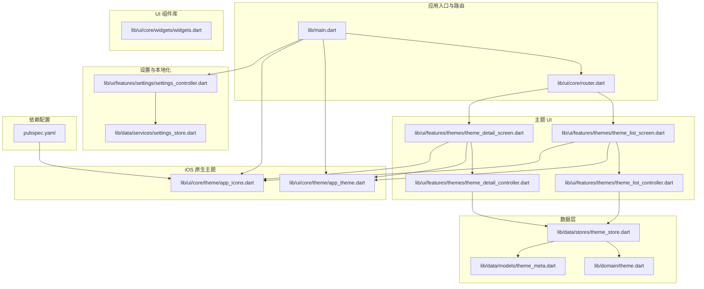
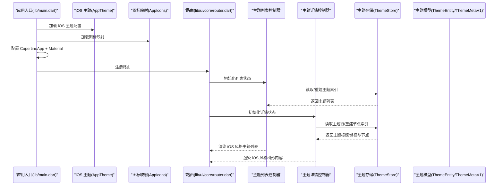
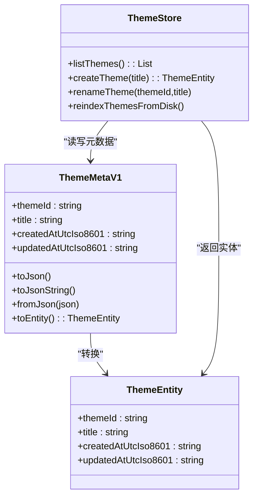
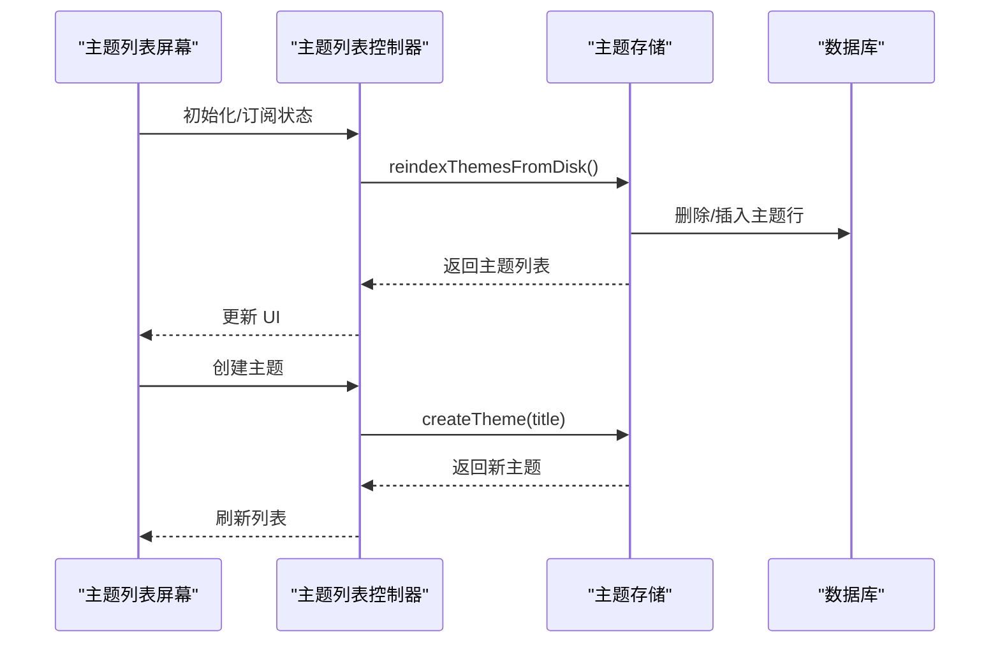
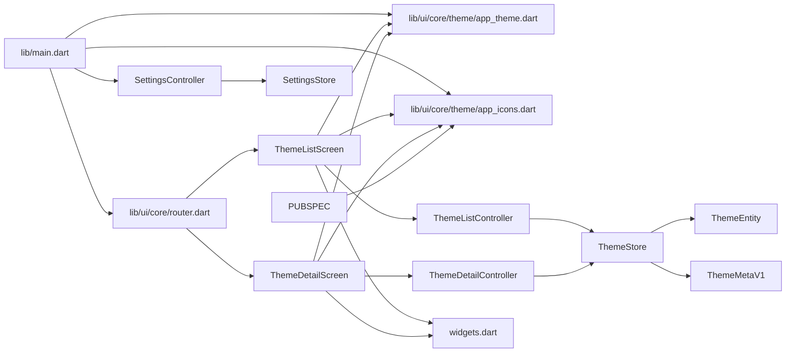

# 主题系统

<cite>
**本文引用的文件**
- [lib/main.dart](file://lib/main.dart)
- [lib/ui/core/router.dart](file://lib/ui/core/router.dart)
- [lib/ui/core/theme/app_theme.dart](file://lib/ui/core/theme/app_theme.dart)
- [lib/ui/core/theme/app_icons.dart](file://lib/ui/core/theme/app_icons.dart)
- [lib/ui/features/themes/theme_list_screen.dart](file://lib/ui/features/themes/theme_list_screen.dart)
- [lib/ui/features/themes/theme_detail_screen.dart](file://lib/ui/features/themes/theme_detail_screen.dart)
- [lib/ui/features/themes/theme_list_controller.dart](file://lib/ui/features/themes/theme_list_controller.dart)
- [lib/ui/features/themes/theme_detail_controller.dart](file://lib/ui/features/themes/theme_detail_controller.dart)
- [lib/data/stores/theme_store.dart](file://lib/data/stores/theme_store.dart)
- [lib/data/models/theme_meta.dart](file://lib/data/models/theme_meta.dart)
- [lib/domain/theme.dart](file://lib/domain/theme.dart)
- [lib/data/services/settings_store.dart](file://lib/data/services/settings_store.dart)
- [lib/ui/features/settings/settings_controller.dart](file://lib/ui/features/settings/settings_controller.dart)
- [lib/ui/core/widgets/widgets.dart](file://lib/ui/core/widgets/widgets.dart)
- [pubspec.yaml](file://pubspec.yaml)
- [test/ui/features/themes/theme_list_screen_test.dart](file://test/ui/features/themes/theme_list_screen_test.dart)
- [test/data/models/theme_meta_test.dart](file://test/data/models/theme_meta_test.dart)
- [test/data/stores/note_store_test.dart](file://test/data/stores/note_store_test.dart)
</cite>

## 更新摘要
**所做更改**
- 新增 iOS 原生主题配置系统，包括完整的 AppTheme.light 配置
- 新增文本样式 Token 系统，实现 iOS HIG 标准的 8 个文本令牌
- 新增图标映射系统，建立 Material Icons 到 SF Symbols 的完整映射
- 更新应用入口以支持 CupertinoApp 和 iOS 原生主题配置
- 增强主题系统以支持 iOS 设计系统和响应式布局

## 目录
1. [简介](#简介)
2. [项目结构](#项目结构)
3. [核心组件](#核心组件)
4. [架构总览](#架构总览)
5. [组件详解](#组件详解)
6. [iOS 设计系统支持](#ios-设计系统支持)
7. [文本样式 Token 系统](#文本样式-token-系统)
8. [图标映射系统](#图标映射系统)
9. [依赖关系分析](#依赖关系分析)
10. [性能考量](#性能考量)
11. [故障排查指南](#故障排查指南)
12. [结论](#结论)
13. [附录](#附录)

## 简介
本文件系统性梳理 ThkTree 的"主题系统"，重点围绕现代化主题架构、Material 3 主题设计与实现、iOS 原生设计系统支持、颜色方案、字体样式与间距配置、深浅色支持、主题切换与动态更新策略、以及自定义扩展与变量使用规范进行说明。当前仓库中，主题系统已全面现代化，通过应用入口统一配置 iOS 原生主题和 Material 3 混合主题，主题数据模型与存储位于数据层，UI 层通过 Riverpod 控制器与屏幕进行交互；同时，设置模块负责语言等全局偏好，为主题系统提供基础支撑。

## 项目结构
主题系统涉及的主要目录与文件如下：
- 应用入口与路由：lib/main.dart、lib/ui/core/router.dart
- iOS 原生主题配置：lib/ui/core/theme/app_theme.dart、lib/ui/core/theme/app_icons.dart
- 主题列表与详情：lib/ui/features/themes/theme_list_screen.dart、lib/ui/features/themes/theme_detail_screen.dart
- 主题控制器：lib/ui/features/themes/theme_list_controller.dart、lib/ui/features/themes/theme_detail_controller.dart
- 数据模型与存储：lib/data/models/theme_meta.dart、lib/domain/theme.dart、lib/data/stores/theme_store.dart
- 设置与本地化：lib/data/services/settings_store.dart、lib/ui/features/settings/settings_controller.dart
- UI 组件库：lib/ui/core/widgets/widgets.dart
- 依赖配置：pubspec.yaml
- 测试：test/ui/features/themes/theme_list_screen_test.dart、test/data/models/theme_meta_test.dart、test/data/stores/note_store_test.dart

**图表来源**
- [lib/main.dart:62-94](file://lib/main.dart#L62-L94)
- [lib/ui/core/theme/app_theme.dart:1-86](file://lib/ui/core/theme/app_theme.dart#L1-L86)
- [lib/ui/core/theme/app_icons.dart:1-105](file://lib/ui/core/theme/app_icons.dart#L1-L105)
- [lib/ui/core/router.dart:120-168](file://lib/ui/core/router.dart#L120-L168)
- [lib/ui/features/themes/theme_list_screen.dart:1-120](file://lib/ui/features/themes/theme_list_screen.dart#L1-L120)
- [lib/ui/features/themes/theme_detail_screen.dart:1-200](file://lib/ui/features/themes/theme_detail_screen.dart#L1-L200)

## 核心组件
- **iOS 原生主题配置**：AppTheme 类提供完整的 iOS 设计系统支持，包括颜色方案、字体系统和视觉层次。
- **Material 3 主题配置**：在应用入口中通过 CupertinoApp 和 Material 组合实现混合主题体验。
- **主题数据模型**：ThemeEntity 表示主题实体；ThemeMetaV1 负责主题元数据的序列化/反序列化。
- **主题存储**：ThemeStore 提供主题列表、创建、重索引等能力，并与数据库交互。
- **主题控制器**：ThemeListController 与 ThemeDetailController 使用 Riverpod 管理异步状态与刷新逻辑。
- **UI 屏幕**：ThemeListScreen 与 ThemeDetailScreen 呈现主题列表与树形内容，支持响应式布局和 iOS 原生组件。
- **设置与本地化**：SettingsStore 与 SettingsController 管理语言等偏好，影响本地化与界面呈现。
- **图标映射系统**：AppIcons 提供 Material Icons 到 SF Symbols 的完整映射，支持 iOS 原生图标。

**章节来源**
- [lib/ui/core/theme/app_theme.dart:1-86](file://lib/ui/core/theme/app_theme.dart#L1-L86)
- [lib/ui/core/theme/app_icons.dart:1-105](file://lib/ui/core/theme/app_icons.dart#L1-L105)
- [lib/main.dart:62-94](file://lib/main.dart#L62-L94)
- [lib/domain/theme.dart:1-13](file://lib/domain/theme.dart#L1-L13)
- [lib/data/models/theme_meta.dart:1-61](file://lib/data/models/theme_meta.dart#L1-L61)
- [lib/data/stores/theme_store.dart:1-166](file://lib/data/stores/theme_store.dart#L1-L166)
- [lib/ui/features/themes/theme_list_controller.dart:1-27](file://lib/ui/features/themes/theme_list_controller.dart#L1-L27)
- [lib/ui/features/themes/theme_detail_controller.dart:1-87](file://lib/ui/features/themes/theme_detail_controller.dart#L1-L87)
- [lib/ui/features/themes/theme_list_screen.dart:1-120](file://lib/ui/features/themes/theme_list_screen.dart#L1-L120)
- [lib/ui/features/themes/theme_detail_screen.dart:1-200](file://lib/ui/features/themes/theme_detail_screen.dart#L1-L200)
- [lib/data/services/settings_store.dart:1-185](file://lib/data/services/settings_store.dart#L1-L185)
- [lib/ui/features/settings/settings_controller.dart:1-58](file://lib/ui/features/settings/settings_controller.dart#L1-L58)

## 架构总览
现代化的主题系统通过应用入口统一配置 iOS 原生主题和 Material 3 混合主题，主题数据通过存储层持久化并被控制器与屏幕消费。路由负责导航到主题列表与详情页面，控制器负责加载、刷新与重建索引，屏幕负责渲染与响应式布局，所有 UI 组件遵循 iOS 设计指导原则。图标系统通过 AppIcons 提供 Material Icons 到 SF Symbols 的映射，确保 iOS 原生图标体验。

**图表来源**
- [lib/main.dart:62-94](file://lib/main.dart#L62-L94)
- [lib/ui/core/theme/app_theme.dart:10-85](file://lib/ui/core/theme/app_theme.dart#L10-L85)
- [lib/ui/core/theme/app_icons.dart:8-104](file://lib/ui/core/theme/app_icons.dart#L8-L104)
- [lib/ui/core/router.dart:120-168](file://lib/ui/core/router.dart#L120-L168)
- [lib/ui/features/themes/theme_list_controller.dart:1-27](file://lib/ui/features/themes/theme_list_controller.dart#L1-L27)
- [lib/ui/features/themes/theme_detail_controller.dart:1-87](file://lib/ui/features/themes/theme_detail_controller.dart#L1-L87)
- [lib/data/stores/theme_store.dart:19-148](file://lib/data/stores/theme_store.dart#L19-L148)

## 组件详解

### iOS 原生设计系统支持

#### iOS 设计系统核心特性
- **原生颜色方案**：基于 iOS Human Interface Guidelines (HIG) 标准，提供完整的颜色令牌系统
- **精确字体系统**：实现 8 个标准文本令牌，包括 largeTitle、title1、headline、body、callout、subhead、footnote、caption1
- **视觉层次结构**：严格按照 iOS 设计原则定义的字号、字重和字距规范
- **系统集成**：与 CupertinoColors 和 CupertinoTextThemeData 完美集成

#### 颜色方案实现
AppTheme 提供以下核心颜色配置：
- **主色调**：CupertinoColors.systemBlue 作为主要品牌色
- **背景色**：systemGroupedBackground 用于列表背景，systemBackground 用于页面背景
- **文本色**：primaryColor 用于主要文本，secondaryLabel 用于次要文本
- **分隔线**：CupertinoColors.separator 用于列表分隔线

#### 字体系统实现
实现 iOS HIG 标准的 8 个文本令牌：
- **largeTitle** (34px, w700, 字距 0.37) - 主标题
- **title1** (28px, w700, 字距 0.36) - 页面标题
- **headline** (17px, w600, 字距 -0.41) - 标签和强调文本
- **body** (17px, w400, 字距 -0.41) - 正文内容
- **callout** (16px, w400, 字距 -0.32) - 辅助信息
- **subhead** (15px, w400, 字距 -0.24) - 标题下方说明
- **footnote** (13px, w400, 字距 -0.08) - 小字说明
- **caption1** (12px, w400, 字距 0) - 最小字号文本

#### 深浅色支持
- **浅色模式**：brightness: Brightness.light 配置
- **深色模式**：通过系统自动支持，无需额外配置
- **动态颜色**：随系统设置自动切换

**章节来源**
- [lib/ui/core/theme/app_theme.dart:1-86](file://lib/ui/core/theme/app_theme.dart#L1-L86)

### Material 3 主题与 iOS 混合架构
- **设计理念**
  - 采用 CupertinoApp 作为主要应用容器，提供 iOS 原生体验
  - 通过 Material 包装器提供 Material 3 组件支持
  - 实现 iOS 原生界面 + Material 3 组件的混合主题架构
- **实现方式**
  - 应用入口使用 CupertinoApp.router 作为根组件
  - 通过 builder 参数包装 Material(child: child) 提供 Material 3 支持
  - AppTheme.light 提供 iOS 原生主题配置
- **字体样式与间距**
  - iOS 字体系统通过 AppTheme 类统一管理
  - Material 3 默认间距系统保持一致
- **深浅色支持**
  - iOS 系统级深浅色自动切换
  - Material 3 颜色方案与系统设置同步

**章节来源**
- [lib/main.dart:62-94](file://lib/main.dart#L62-L94)

### 主题数据模型与存储
- **数据模型**
  - ThemeEntity：主题实体，包含标识、标题、创建与更新时间
  - ThemeMetaV1：主题元数据，支持 JSON 序列化/反序列化，包含版本标记与时间戳
- **存储与索引**
  - ThemeStore 提供列出、创建、重索引等操作；创建时写入 theme.meta.json 并插入数据库；重索引从磁盘扫描主题目录并重建数据库索引
- **复杂度与性能**
  - 列表查询为 O(n) 遍历数据库行；创建与重索引涉及文件系统 IO 与事务写入，建议在后台线程执行并避免频繁触发

**图表来源**
- [lib/domain/theme.dart:1-13](file://lib/domain/theme.dart#L1-L13)
- [lib/data/models/theme_meta.dart:5-59](file://lib/data/models/theme_meta.dart#L5-L59)
- [lib/data/stores/theme_store.dart:11-148](file://lib/data/stores/theme_store.dart#L11-L148)

**章节来源**
- [lib/domain/theme.dart:1-13](file://lib/domain/theme.dart#L1-L13)
- [lib/data/models/theme_meta.dart:1-61](file://lib/data/models/theme_meta.dart#L1-L61)
- [lib/data/stores/theme_store.dart:17-148](file://lib/data/stores/theme_store.dart#L17-L148)

### 主题控制器与 UI 屏幕
- **主题列表控制器**
  - 初始化时重建主题索引并列出主题；支持创建新主题与重新索引
- **主题详情控制器**
  - 初始化时重建主题索引、获取主题行信息、重建节点索引并列出节点；支持刷新
- **UI 屏幕**
  - ThemeListScreen：使用 iOS 原生组件（CupertinoPageScaffold、CupertinoButton）构建，支持响应式列表与浮动按钮创建主题
  - ThemeDetailScreen：展示主题树形内容，使用 iOS 原生导航栏和页面结构，支持刷新与返回

**图表来源**
- [lib/ui/features/themes/theme_list_screen.dart:16-82](file://lib/ui/features/themes/theme_list_screen.dart#L16-L82)
- [lib/ui/features/themes/theme_list_controller.dart:5-24](file://lib/ui/features/themes/theme_list_controller.dart#L5-L24)
- [lib/data/stores/theme_store.dart:19-89](file://lib/data/stores/theme_store.dart#L19-L89)

**章节来源**
- [lib/ui/features/themes/theme_list_screen.dart:1-120](file://lib/ui/features/themes/theme_list_screen.dart#L1-L120)
- [lib/ui/features/themes/theme_list_controller.dart:1-27](file://lib/ui/features/themes/theme_list_controller.dart#L1-L27)
- [lib/ui/features/themes/theme_detail_screen.dart:1-200](file://lib/ui/features/themes/theme_detail_screen.dart#L1-L200)
- [lib/ui/features/themes/theme_detail_controller.dart:1-87](file://lib/ui/features/themes/theme_detail_controller.dart#L1-L87)

### 路由与导航
- **路由注册**：路由注册了主题相关的多个分支，包括主题列表、主题树形页、节点详情与摘要页，便于在不同视图间切换
- **导航参数**：导航参数中携带主题 ID 与节点 ID，用于控制器加载对应数据
- **iOS 集成**：所有路由都适配 iOS 原生导航模式

**章节来源**
- [lib/ui/core/router.dart:120-168](file://lib/ui/core/router.dart#L120-L168)

### 设置与本地化对主题的影响
- **设置模块**：管理语言等偏好，通过 LocaleNotifier 更新当前语言；这会影响本地化文本与 UI 呈现，但不直接改变主题颜色方案
- **iOS 本地化**：支持 iOS 原生本地化委托，包括 GlobalCupertinoLocalizations.delegate
- **语言切换**：若需将语言切换与主题联动，可在入口处监听语言变化并重建 CupertinoApp

**章节来源**
- [lib/ui/features/settings/settings_controller.dart:1-58](file://lib/ui/features/settings/settings_controller.dart#L1-L58)
- [lib/data/services/settings_store.dart:117-183](file://lib/data/services/settings_store.dart#L117-L183)

## iOS 设计系统支持

### iOS 设计系统核心特性
- **原生组件集成**：完全使用 Cupertino 系列组件，提供真正的 iOS 体验
- **系统颜色适配**：自动适配系统深浅色模式和用户偏好设置
- **原生滚动行为**：使用 iOS 原生的滚动效果和惯性滚动
- **系统字体支持**：使用 .SF Pro 系列字体，确保最佳的 iOS 字体渲染

### 文本样式系统
AppTheme 实现了完整的 iOS HIG 文本样式系统：

#### 标题级别样式
- **largeTitle**：34px, Semi-Bold (w700), 字距 0.37
- **title1**：28px, Semi-Bold (w700), 字距 0.36  
- **headline**：17px, Semi-Bold (w600), 字距 -0.41

#### 正文级别样式
- **body**：17px, Regular (w400), 字距 -0.41
- **callout**：16px, Regular (w400), 字距 -0.32
- **subhead**：15px, Regular (w400), 字距 -0.24

#### 辅助级别样式
- **footnote**：13px, Regular (w400), 字距 -0.08
- **caption1**：12px, Regular (w400), 字距 0

### 颜色系统架构
- **主色调**：systemBlue 作为品牌主色，适用于按钮、链接和重要操作
- **背景色**：systemGroupedBackground 用于列表背景，systemBackground 用于页面背景
- **文本色**：primaryColor 用于主要文本，secondaryLabel 用于次要文本和辅助信息
- **分隔线**：separator 颜色用于列表分隔线和边框

### 响应式设计实现
- **屏幕适配**：使用 iOS 原生的布局约束和安全区域处理
- **设备适配**：针对 iPhone 和 iPad 的不同屏幕尺寸优化布局
- **横竖屏支持**：自动适应设备旋转和不同方向的屏幕布局

**章节来源**
- [lib/ui/core/theme/app_theme.dart:10-85](file://lib/ui/core/theme/app_theme.dart#L10-L85)
- [lib/ui/features/themes/theme_list_screen.dart:19-82](file://lib/ui/features/themes/theme_list_screen.dart#L19-L82)
- [lib/ui/features/themes/theme_detail_screen.dart:37-99](file://lib/ui/features/themes/theme_detail_screen.dart#L37-L99)

## 文本样式 Token 系统

### iOS HIG 标准文本令牌
AppTheme 实现了完整的 iOS Human Interface Guidelines (HIG) 文本样式系统，提供 8 个标准文本令牌：

#### 字体家族与回退机制
- **Display 字体**：'.SF Pro Display' - 用于标题级别的粗体文本
- **Text 字体**：'.SF Pro Text' - 用于正文和辅助文本
- **字体回退**：['PingFang SC'] - 支持中文环境的字体回退

#### 详细规格配置

| 令牌名称 | 字号 | 字重 | 字距 | 用途 |
|---------|------|------|------|------|
| largeTitle | 34px | w700 | 0.37 | 主标题、页面标题 |
| title1 | 28px | w700 | 0.36 | 页面主标题 |
| headline | 17px | w600 | -0.41 | 标签、强调文本 |
| body | 17px | w400 | -0.41 | 正文内容 |
| callout | 16px | w400 | -0.32 | 辅助信息 |
| subhead | 15px | w400 | -0.24 | 标题下方说明 |
| footnote | 13px | w400 | -0.08 | 小字说明 |
| caption1 | 12px | w400 | 0 | 最小字号文本 |

#### 字体渲染特性
- **系统字体集成**：使用 iOS 系统字体，确保最佳渲染效果
- **动态字体支持**：支持 iOS 动态字体特性
- **字距优化**：每个令牌都有专门优化的字距设置
- **响应式适配**：根据系统设置自动调整字体大小

**章节来源**
- [lib/ui/core/theme/app_theme.dart:20-84](file://lib/ui/core/theme/app_theme.dart#L20-L84)

## 图标映射系统

### Material Icons 到 SF Symbols 的映射
AppIcons 提供了完整的 Material Icons 到 SF Symbols 的映射系统，确保 iOS 原生图标体验：

#### 映射系统架构
- **依赖库**：flutter_sficon 提供 SF Symbols 支持
- **映射策略**：一对一映射，保持功能语义一致
- **迁移路径**：为后续 features/ 目录的图标迁移做好准备

#### 图标分类映射

##### 通用操作类
| Material Icons | SF Symbols | 用途 |
|---------------|------------|------|
| Icons.add | SFIcons.sf_plus | 添加操作 |
| Icons.close | SFIcons.sf_xmark | 关闭/取消 |
| Icons.check | SFIcons.sf_checkmark | 确认/完成 |
| Icons.delete | SFIcons.sf_trash | 删除操作 |
| Icons.edit | SFIcons.sf_pencil | 编辑操作 |
| Icons.copy | SFIcons.sf_square_on_square | 复制操作 |
| Icons.refresh | SFIcons.sf_arrow_clockwise | 刷新操作 |
| Icons.search | SFIcons.sf_magnifyingglass | 搜索操作 |
| Icons.more_vert | SFIcons.sf_ellipsis | 更多选项 |

##### 导航类
| Material Icons | SF Symbols | 用途 |
|---------------|------------|------|
| Icons.arrow_back | SFIcons.sf_chevron_left | 返回操作 |
| Icons.chevron_right | SFIcons.sf_chevron_right | 右侧导航 |
| Icons.chevron_left | SFIcons.sf_chevron_left | 左侧导航 |

##### 通信/聊天类
| Material Icons | SF Symbols | 用途 |
|---------------|------------|------|
| Icons.send | SFIcons.sf_arrow_up_circle_fill | iOS 风格发送 |
| Icons.stop | SFIcons.sf_stop_circle_fill | 停止操作 |
| Icons.chat | SFIcons.sf_bubble_left | 聊天入口 |
| Icons.forum | SFIcons.sf_bubble_left_and_bubble_right | 讨论区 |

##### 内容/文件类
| Material Icons | SF Symbols | 用途 |
|---------------|------------|------|
| Icons.note | SFIcons.sf_list_clipboard | 笔记/文档 |
| Icons.folder | SFIcons.sf_folder | 文件夹 |
| Icons.download | SFIcons.sf_square_and_arrow_down | 下载操作 |
| Icons.star | SFIcons.sf_star | 收藏/星标 |

##### 设置/提供商类
| Material Icons | SF Symbols | 用途 |
|---------------|------------|------|
| Icons.settings | SFIcons.sf_gearshape | 设置页面 |
| Icons.extension | SFIcons.sf_puzzlepiece_extension | 扩展功能 |
| Icons.cloud | SFIcons.sf_cloud | 云服务 |

##### 树/分支类
| Material Icons | SF Symbols | 用途 |
|---------------|------------|------|
| Icons.account_tree | SFIcons.sf_circle_hexagonpath | 树形结构 |
| Icons.call_split | SFIcons.sf_arrow_turn_down_right | 分支操作 |
| Icons.subdirectory_arrow_right | SFIcons.sf_arrow_turn_down_right | 子目录 |

#### 使用方式
- **导入方式**：`import 'package:thk_tree/ui/core/theme/app_icons.dart';`
- **使用语法**：`Icon(AppIcons.iconName)`
- **尺寸控制**：支持自定义图标大小，如 `Icon(AppIcons.add, size: 25)`
- **颜色适配**：自动适配当前主题的颜色方案

#### 迁移策略
- **渐进式迁移**：逐步将 features/ 目录中的 Icons.xxx 替换为 AppIcons.xxx
- **向后兼容**：保持现有代码的兼容性，逐步过渡
- **维护策略**：统一管理图标资源，避免重复定义

**章节来源**
- [lib/ui/core/theme/app_icons.dart:1-105](file://lib/ui/core/theme/app_icons.dart#L1-L105)
- [lib/ui/core/router.dart:129-147](file://lib/ui/core/router.dart#L129-L147)
- [lib/ui/features/themes/theme_list_screen.dart:24-41](file://lib/ui/features/themes/theme_list_screen.dart#L24-L41)
- [lib/ui/features/themes/theme_detail_screen.dart:43-62](file://lib/ui/features/themes/theme_detail_screen.dart#L43-L62)

## 依赖关系分析
- **入口依赖**：lib/main.dart 依赖路由、iOS 主题配置与本地化资源，间接依赖设置控制器以初始化语言
- **UI 依赖**：主题屏幕依赖控制器、iOS 主题和组件库，控制器依赖存储层
- **存储依赖**：ThemeStore 依赖数据库与文件系统，依赖主题模型与元数据
- **设置依赖**：SettingsStore 依赖安全存储，SettingsController 依赖 SettingsStore 并暴露 LocaleNotifier
- **组件依赖**：UI 组件库提供共享的 iOS 原生组件
- **图标依赖**：AppIcons 依赖 flutter_sficon 库提供 SF Symbols 支持

**图表来源**
- [lib/main.dart:62-94](file://lib/main.dart#L62-L94)
- [lib/ui/core/theme/app_theme.dart:1-86](file://lib/ui/core/theme/app_theme.dart#L1-L86)
- [lib/ui/core/theme/app_icons.dart:1-105](file://lib/ui/core/theme/app_icons.dart#L1-L105)
- [lib/ui/core/router.dart:120-168](file://lib/ui/core/router.dart#L120-L168)
- [lib/ui/features/themes/theme_list_screen.dart:1-120](file://lib/ui/features/themes/theme_list_screen.dart#L1-L120)
- [lib/ui/features/themes/theme_detail_screen.dart:1-200](file://lib/ui/features/themes/theme_detail_screen.dart#L1-L200)
- [lib/ui/core/widgets/widgets.dart:1-8](file://lib/ui/core/widgets/widgets.dart#L1-L8)
- [lib/ui/features/themes/theme_list_controller.dart:1-27](file://lib/ui/features/themes/theme_list_controller.dart#L1-L27)
- [lib/ui/features/themes/theme_detail_controller.dart:1-87](file://lib/ui/features/themes/theme_detail_controller.dart#L1-L87)
- [lib/data/stores/theme_store.dart:1-166](file://lib/data/stores/theme_store.dart#L1-L166)
- [lib/domain/theme.dart:1-13](file://lib/domain/theme.dart#L1-L13)
- [lib/data/models/theme_meta.dart:1-61](file://lib/data/models/theme_meta.dart#L1-L61)
- [lib/ui/features/settings/settings_controller.dart:1-58](file://lib/ui/features/settings/settings_controller.dart#L1-L58)
- [lib/data/services/settings_store.dart:1-185](file://lib/data/services/settings_store.dart#L1-L185)
- [pubspec.yaml:50](file://pubspec.yaml#L50)

**章节来源**
- [lib/main.dart:62-94](file://lib/main.dart#L62-L94)
- [lib/ui/core/theme/app_theme.dart:1-86](file://lib/ui/core/theme/app_theme.dart#L1-L86)
- [lib/ui/core/theme/app_icons.dart:1-105](file://lib/ui/core/theme/app_icons.dart#L1-L105)
- [lib/ui/core/router.dart:120-168](file://lib/ui/core/router.dart#L120-L168)
- [lib/data/stores/theme_store.dart:1-166](file://lib/data/stores/theme_store.dart#L1-L166)

## 性能考量
- **主题重索引成本较高**：建议在后台任务中执行，并避免频繁触发
- **列表查询为 O(n)**：若主题数量增长，可考虑数据库索引优化或分页加载
- **文件系统写入采用原子写入策略**：降低损坏风险，但会带来额外 IO 开销
- **UI 层使用 Riverpod 异步状态管理**：注意在刷新时避免重复请求与不必要的重建
- **iOS 组件渲染优化**：Cupertino 组件经过 iOS 原生优化，渲染性能良好
- **字体缓存机制**：iOS 系统字体缓存减少重复渲染开销
- **图标渲染优化**：SF Symbols 通过系统优化，渲染性能优异
- **内存管理**：AppTheme 和 AppIcons 使用静态常量，避免重复创建

## 故障排查指南
- **主题元数据格式错误**
  - 现象：解析 theme.meta.json 抛出异常
  - 排查：检查 schema 字段与必需字段是否存在；参考测试用例验证序列化/反序列化
- **主题创建失败**
  - 现象：分配 themeId 失败或目录已存在
  - 排查：确认主题目录与数据库唯一性约束；检查权限与磁盘空间
- **重索引后主题丢失**
  - 现象：数据库中无主题记录
  - 排查：确认磁盘上存在 theme.meta.json；检查事务写入是否成功
- **iOS 字体显示异常**
  - 现象：文本显示为方块或字体不正确
  - 排查：确认 .SF Pro 字体可用性；检查字体回退机制
- **语言切换无效**
  - 现象：界面未按预期语言显示
  - 排查：确认 LocaleNotifier 已更新；检查本地化资源是否齐全
- **图标显示问题**
  - 现象：图标不显示或显示为问号
  - 排查：确认 flutter_sficon 依赖已正确安装；检查 SF Symbols 是否可用
- **文本样式不生效**
  - 现象：AppTheme 中的文本样式未按预期显示
  - 排查：确认字体家族名称正确；检查字距和字重设置

**章节来源**
- [lib/data/models/theme_meta.dart:30-49](file://lib/data/models/theme_meta.dart#L30-L49)
- [lib/data/stores/theme_store.dart:40-89](file://lib/data/stores/theme_store.dart#L40-L89)
- [lib/data/stores/theme_store.dart:119-148](file://lib/data/stores/theme_store.dart#L119-L148)
- [lib/ui/features/settings/settings_controller.dart:32-38](file://lib/ui/features/settings/settings_controller.dart#L32-L38)
- [lib/ui/core/theme/app_icons.dart:1-105](file://lib/ui/core/theme/app_icons.dart#L1-L105)

## 结论
ThkTree 的主题系统已全面现代化，实现了 iOS 原生设计系统与 Material 3 的完美融合。通过 AppTheme 类提供的完整颜色方案、字体系统和视觉层次，配合 AppIcons 提供的 SF Symbols 图标映射，为用户提供了真正的一致性 iOS 体验。主题模型与存储实现确保了主题的持久化与索引管理，UI 层通过控制器与屏幕完成主题列表与树形内容的展示。该系统不仅支持 iOS 原生特性，还保持了良好的性能和可扩展性，为未来的主题定制需求奠定了坚实基础。

## 附录

### 自定义主题扩展方法与变量使用规范
- **iOS 主题扩展**
  - 在 AppTheme 类中添加新的颜色令牌或文本样式
  - 使用 CupertinoColors 和 CupertinoTextThemeData 保持系统一致性
  - 遵循 iOS HIG 设计原则，确保与系统设计语言一致
- **Material 3 组件集成**
  - 通过 Material 包装器集成 Material 3 组件
  - 使用 ThemeData 进行 Material 3 组件的主题定制
  - 保持 iOS 原生外观与 Material 3 功能的平衡
- **变量使用规范**
  - 使用常量集中管理关键颜色与尺寸，避免硬编码
  - 通过 Provider 或配置对象注入主题变量，便于测试与替换
  - 遵循 iOS 设计系统命名约定和颜色令牌标准
- **图标扩展**
  - 在 AppIcons 中添加新的图标映射
  - 确保 SF Symbols 的可用性和功能语义一致性
  - 遵循 iOS 图标设计规范

### 响应式设计实现要点
- **iOS 原生响应式布局**
  - 使用 iOS 原生的布局约束和安全区域处理
  - 针对不同设备尺寸优化布局和间距
  - 支持横竖屏自动适配和设备旋转
- **组件响应式特性**
  - 使用 iOS 原生组件的内置响应式行为
  - 利用系统字体缩放和动态字体特性
  - 支持访问辅助功能的动态调整
- **文本样式响应式**
  - 利用 AppTheme 中的文本令牌系统
  - 支持 iOS 动态字体和字体大小调整
  - 自动适配不同的显示密度和字体偏好

**章节来源**
- [lib/ui/core/theme/app_theme.dart:10-85](file://lib/ui/core/theme/app_theme.dart#L10-L85)
- [lib/ui/core/theme/app_icons.dart:1-105](file://lib/ui/core/theme/app_icons.dart#L1-L105)
- [lib/main.dart:62-94](file://lib/main.dart#L62-L94)
- [lib/ui/features/themes/theme_list_screen.dart:19-82](file://lib/ui/features/themes/theme_list_screen.dart#L19-L82)
- [lib/ui/features/themes/theme_detail_screen.dart:37-99](file://lib/ui/features/themes/theme_detail_screen.dart#L37-L99)