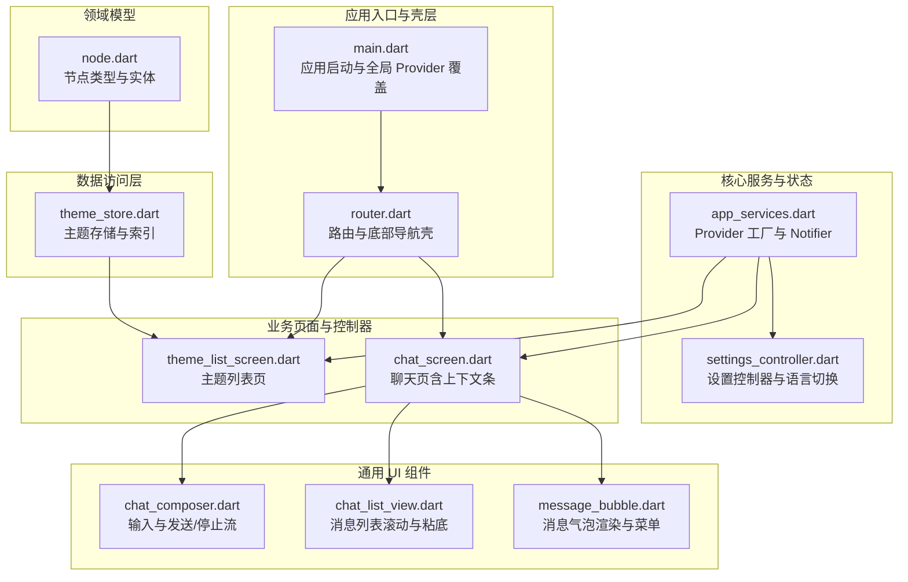
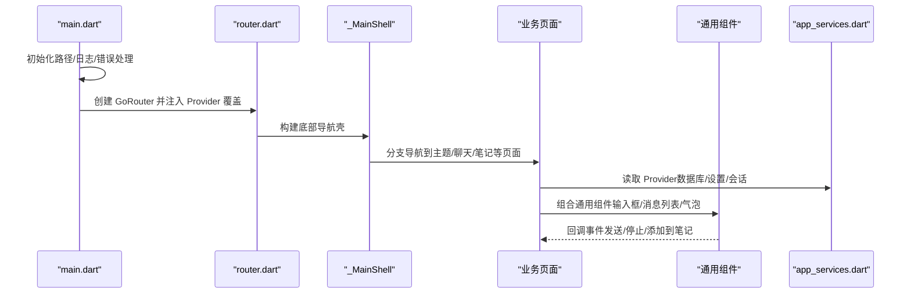
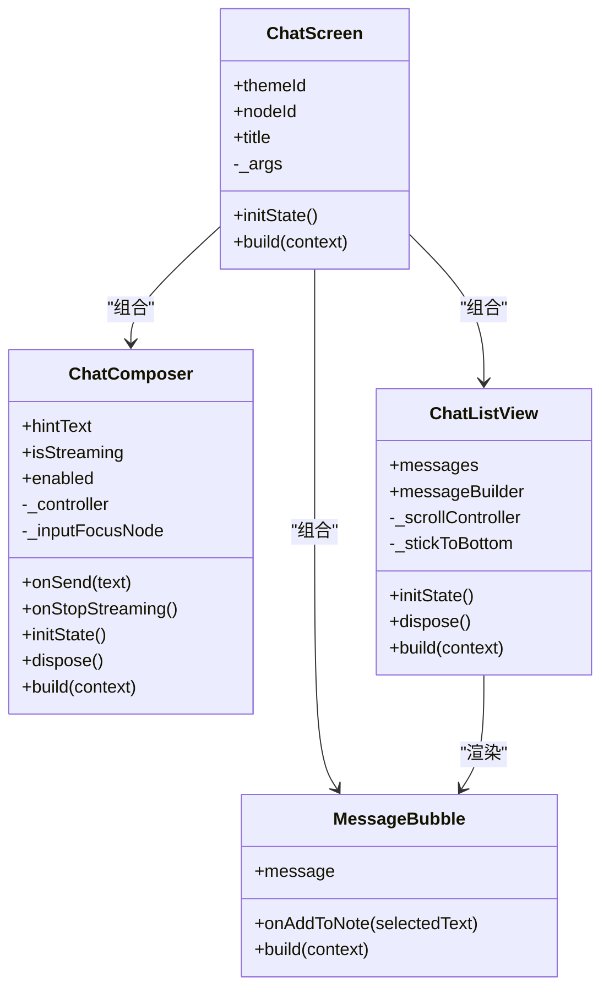
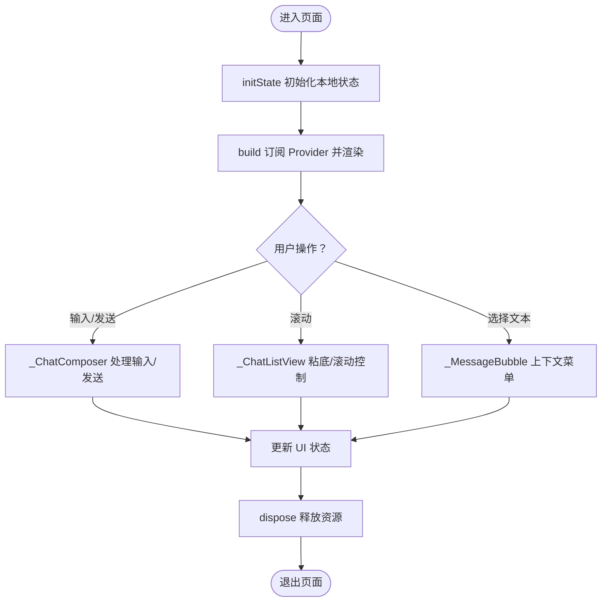
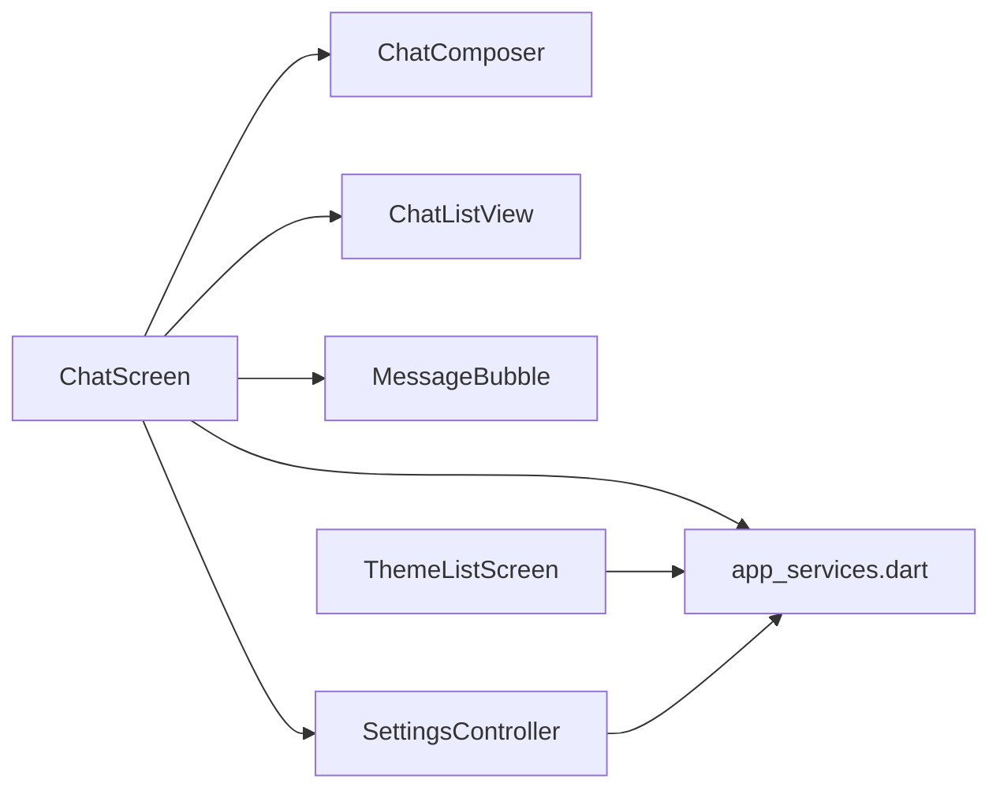

# 组件层次结构

<cite>
**本文引用的文件**
- [lib/main.dart](file://lib/main.dart)
- [lib/ui/core/router.dart](file://lib/ui/core/router.dart)
- [lib/ui/core/app_services.dart](file://lib/ui/core/app_services.dart)
- [lib/ui/core/shared/chat_composer.dart](file://lib/ui/core/shared/chat_composer.dart)
- [lib/ui/core/shared/chat_list_view.dart](file://lib/ui/core/shared/chat_list_view.dart)
- [lib/ui/core/shared/message_bubble.dart](file://lib/ui/core/shared/message_bubble.dart)
- [lib/ui/features/settings/settings_controller.dart](file://lib/ui/features/settings/settings_controller.dart)
- [lib/ui/features/themes/theme_list_screen.dart](file://lib/ui/features/themes/theme_list_screen.dart)
- [lib/ui/features/chat/chat_screen.dart](file://lib/ui/features/chat/chat_screen.dart)
- [lib/data/stores/theme_store.dart](file://lib/data/stores/theme_store.dart)
- [lib/domain/node.dart](file://lib/domain/node.dart)
</cite>

## 目录
1. [引言](#引言)
2. [项目结构](#项目结构)
3. [核心组件](#核心组件)
4. [架构总览](#架构总览)
5. [详细组件分析](#详细组件分析)
6. [依赖分析](#依赖分析)
7. [性能考虑](#性能考虑)
8. [故障排查指南](#故障排查指南)
9. [结论](#结论)
10. [附录：组件实现模式示例路径](#附录组件实现模式示例路径)

## 引言
本文件系统化梳理 ThkTree 的组件层次结构与实现模式，明确“核心组件”“业务组件”“通用组件”的分类标准与职责边界；解释 StatelessWidget 与 StatefulWidget 的使用场景；总结生命周期管理与状态提升策略；给出可复用性设计原则与封装最佳实践，并通过具体文件路径示例展示不同层级组件的实现模式。

## 项目结构
ThkTree 采用按职责分层的目录组织方式：
- 应用入口与壳层：lib/main.dart、lib/ui/core/router.dart
- 核心服务与状态：lib/ui/core/app_services.dart、lib/ui/features/settings/settings_controller.dart
- 通用 UI 组件（共享）：lib/ui/core/shared/*
- 业务页面与控制器：lib/ui/features/*
- 数据访问层：lib/data/stores/*
- 领域模型：lib/domain/*

图表来源
- [lib/main.dart:15-59](file://lib/main.dart#L15-L59)
- [lib/ui/core/router.dart:18-87](file://lib/ui/core/router.dart#L18-L87)
- [lib/ui/core/app_services.dart:27-80](file://lib/ui/core/app_services.dart#L27-L80)
- [lib/ui/core/shared/chat_composer.dart:5-23](file://lib/ui/core/shared/chat_composer.dart#L5-L23)
- [lib/ui/core/shared/chat_list_view.dart:8-20](file://lib/ui/core/shared/chat_list_view.dart#L8-L20)
- [lib/ui/core/shared/message_bubble.dart:41-50](file://lib/ui/core/shared/message_bubble.dart#L41-L50)
- [lib/ui/features/themes/theme_list_screen.dart:8-88](file://lib/ui/features/themes/theme_list_screen.dart#L8-L88)
- [lib/ui/features/chat/chat_screen.dart:19-28](file://lib/ui/features/chat/chat_screen.dart#L19-L28)
- [lib/data/stores/theme_store.dart:11-29](file://lib/data/stores/theme_store.dart#L11-L29)
- [lib/domain/node.dart:10-28](file://lib/domain/node.dart#L10-L28)

章节来源
- [lib/main.dart:15-95](file://lib/main.dart#L15-L95)
- [lib/ui/core/router.dart:18-126](file://lib/ui/core/router.dart#L18-L126)

## 核心组件
核心组件是应用运行的基础构件，负责：
- 应用启动与全局配置：初始化路径、日志、错误处理、Provider 覆盖等
- 全局路由与主壳层：定义多分支 Shell 导航、底部导航与页面栈
- 全局状态与服务工厂：提供数据库、日志、设置、LLM 客户端等服务的 Provider

关键职责与实现要点：
- 启动流程在 main 中完成，使用 ProviderScope 覆盖关键 Provider 值，确保应用启动时的环境就绪
- 路由器使用 GoRouter 的 StatefulShellRoute 构建多分支索引堆栈，支持主题与笔记两个主要分支
- 核心服务通过 FutureProvider/NotifierProvider 提供，避免在构建阶段进行耗时操作

章节来源
- [lib/main.dart:15-95](file://lib/main.dart#L15-L95)
- [lib/ui/core/router.dart:18-126](file://lib/ui/core/router.dart#L18-L126)
- [lib/ui/core/app_services.dart:27-80](file://lib/ui/core/app_services.dart#L27-L80)

## 架构总览
ThkTree 采用“入口壳层 + 路由壳 + 页面 + 通用组件 + 数据服务”的分层架构。页面通过 Riverpod 访问数据服务与全局状态，通用组件以无状态方式复用，页面内部维护必要的局部状态。

图表来源
- [lib/main.dart:15-95](file://lib/main.dart#L15-L95)
- [lib/ui/core/router.dart:89-125](file://lib/ui/core/router.dart#L89-L125)
- [lib/ui/core/app_services.dart:27-80](file://lib/ui/core/app_services.dart#L27-L80)
- [lib/ui/features/chat/chat_screen.dart:19-175](file://lib/ui/features/chat/chat_screen.dart#L19-L175)
- [lib/ui/core/shared/chat_composer.dart:5-23](file://lib/ui/core/shared/chat_composer.dart#L5-L23)
- [lib/ui/core/shared/chat_list_view.dart:8-20](file://lib/ui/core/shared/chat_list_view.dart#L8-L20)
- [lib/ui/core/shared/message_bubble.dart:41-50](file://lib/ui/core/shared/message_bubble.dart#L41-L50)

## 详细组件分析

### 分类标准与职责划分
- 核心组件
  - 角色：应用启动、路由壳、全局 Provider 工厂
  - 示例：ThkTreeApp、_MainShell、appRouter、各 FutureProvider/NotifierProvider
- 业务组件
  - 角色：承载具体业务功能，组合通用组件，协调数据服务
  - 示例：ThemeListScreen、ChatScreen、SettingsController
- 通用组件
  - 角色：无状态复用 UI 片段，不直接依赖业务逻辑
  - 示例：ChatComposer、ChatListView、MessageBubble

章节来源
- [lib/main.dart:61-93](file://lib/main.dart#L61-L93)
- [lib/ui/core/router.dart:89-125](file://lib/ui/core/router.dart#L89-L125)
- [lib/ui/features/themes/theme_list_screen.dart:8-88](file://lib/ui/features/themes/theme_list_screen.dart#L8-L88)
- [lib/ui/features/chat/chat_screen.dart:19-175](file://lib/ui/features/chat/chat_screen.dart#L19-L175)
- [lib/ui/core/shared/chat_composer.dart:5-23](file://lib/ui/core/shared/chat_composer.dart#L5-L23)
- [lib/ui/core/shared/chat_list_view.dart:8-20](file://lib/ui/core/shared/chat_list_view.dart#L8-L20)
- [lib/ui/core/shared/message_bubble.dart:41-50](file://lib/ui/core/shared/message_bubble.dart#L41-L50)

### 继承关系与组合模式
- StatelessWidget
  - 用于纯展示或行为简单、无需本地状态的 UI 片段
  - 示例：MessageBubble、_ContextUsageBar（聊天页内嵌）、_TableExpandedView
- StatefulWidget
  - 用于需要维护本地状态或复杂交互的 UI 片段
  - 示例：ChatComposer（输入框、焦点、键盘事件）、ChatListView（滚动状态、粘底逻辑）

图表来源
- [lib/ui/core/shared/chat_composer.dart:5-23](file://lib/ui/core/shared/chat_composer.dart#L5-L23)
- [lib/ui/core/shared/chat_list_view.dart:8-20](file://lib/ui/core/shared/chat_list_view.dart#L8-L20)
- [lib/ui/core/shared/message_bubble.dart:41-50](file://lib/ui/core/shared/message_bubble.dart#L41-L50)
- [lib/ui/features/chat/chat_screen.dart:19-28](file://lib/ui/features/chat/chat_screen.dart#L19-L28)

章节来源
- [lib/ui/core/shared/chat_composer.dart:25-160](file://lib/ui/core/shared/chat_composer.dart#L25-L160)
- [lib/ui/core/shared/chat_list_view.dart:22-99](file://lib/ui/core/shared/chat_list_view.dart#L22-L99)
- [lib/ui/core/shared/message_bubble.dart:41-265](file://lib/ui/core/shared/message_bubble.dart#L41-L265)
- [lib/ui/features/chat/chat_screen.dart:30-175](file://lib/ui/features/chat/chat_screen.dart#L30-L175)

### 生命周期管理与状态提升策略
- 生命周期
  - StatefulWidget 在 initState 中初始化本地状态（如输入框、焦点、滚动控制），在 dispose 中释放资源
  - ConsumerWidget/ConsumerStatefulWidget 在 build 中订阅 Provider，响应状态变化
- 状态提升
  - 将可复用的交互状态上提到页面级或控制器级（如聊天页的发送/停止流状态）
  - 将跨页面共享的状态上提到全局 Provider（如语言、设置、版本号）

图表来源
- [lib/ui/features/chat/chat_screen.dart:30-175](file://lib/ui/features/chat/chat_screen.dart#L30-L175)
- [lib/ui/core/shared/chat_composer.dart:25-160](file://lib/ui/core/shared/chat_composer.dart#L25-L160)
- [lib/ui/core/shared/chat_list_view.dart:22-99](file://lib/ui/core/shared/chat_list_view.dart#L22-L99)
- [lib/ui/core/shared/message_bubble.dart:143-215](file://lib/ui/core/shared/message_bubble.dart#L143-L215)

章节来源
- [lib/ui/features/chat/chat_screen.dart:30-175](file://lib/ui/features/chat/chat_screen.dart#L30-L175)
- [lib/ui/core/shared/chat_composer.dart:25-160](file://lib/ui/core/shared/chat_composer.dart#L25-L160)
- [lib/ui/core/shared/chat_list_view.dart:22-99](file://lib/ui/core/shared/chat_list_view.dart#L22-L99)

### 可复用性设计原则与封装最佳实践
- 无副作用的无状态组件优先：MessageBubble、_ContextUsageBar 等仅根据传入参数渲染
- 明确的回调接口：ChatComposer 通过 onSend/onStopStreaming 将交互委托给父组件
- 局部状态最小化：滚动粘底状态在 ChatListView 内部维护，避免泄漏到父组件
- 依赖注入与 Provider 解耦：页面通过 Provider 获取服务，便于测试与替换
- 统一的错误与加载态处理：页面使用 when/async 状态统一处理 loading/error/data

章节来源
- [lib/ui/core/shared/message_bubble.dart:41-265](file://lib/ui/core/shared/message_bubble.dart#L41-L265)
- [lib/ui/core/shared/chat_composer.dart:5-23](file://lib/ui/core/shared/chat_composer.dart#L5-L23)
- [lib/ui/core/shared/chat_list_view.dart:8-20](file://lib/ui/core/shared/chat_list_view.dart#L8-L20)
- [lib/ui/features/chat/chat_screen.dart:115-149](file://lib/ui/features/chat/chat_screen.dart#L115-L149)

### 具体实现模式示例路径
- 页面级组件（ConsumerWidget/ConsumerStatefulWidget）
  - [ThemeListScreen:8-88](file://lib/ui/features/themes/theme_list_screen.dart#L8-L88)
  - [ChatScreen:19-175](file://lib/ui/features/chat/chat_screen.dart#L19-L175)
- 通用组件（StatelessWidget）
  - [MessageBubble:41-215](file://lib/ui/core/shared/message_bubble.dart#L41-L215)
  - [_ContextUsageBar（内嵌）:177-219](file://lib/ui/features/chat/chat_screen.dart#L177-L219)
- 通用组件（StatefulWidget）
  - [ChatComposer:5-160](file://lib/ui/core/shared/chat_composer.dart#L5-L160)
  - [ChatListView:8-99](file://lib/ui/core/shared/chat_list_view.dart#L8-L99)
- 控制器与状态（AsyncNotifier/Notifier）
  - [SettingsController:7-42](file://lib/ui/features/settings/settings_controller.dart#L7-L42)
  - [LocaleNotifier:44-57](file://lib/ui/features/settings/settings_controller.dart#L44-L57)
- 全局 Provider 工厂
  - [app_services.dart（FutureProvider/NotifierProvider）:27-80](file://lib/ui/core/app_services.dart#L27-L80)
- 数据访问层
  - [ThemeStore:11-139](file://lib/data/stores/theme_store.dart#L11-L139)
- 领域模型
  - [NodeEntity/NodeKind:10-28](file://lib/domain/node.dart#L10-L28)

章节来源
- [lib/ui/features/themes/theme_list_screen.dart:8-88](file://lib/ui/features/themes/theme_list_screen.dart#L8-L88)
- [lib/ui/features/chat/chat_screen.dart:19-175](file://lib/ui/features/chat/chat_screen.dart#L19-L175)
- [lib/ui/core/shared/message_bubble.dart:41-215](file://lib/ui/core/shared/message_bubble.dart#L41-L215)
- [lib/ui/core/shared/chat_composer.dart:5-160](file://lib/ui/core/shared/chat_composer.dart#L5-L160)
- [lib/ui/core/shared/chat_list_view.dart:8-99](file://lib/ui/core/shared/chat_list_view.dart#L8-L99)
- [lib/ui/features/settings/settings_controller.dart:7-57](file://lib/ui/features/settings/settings_controller.dart#L7-L57)
- [lib/ui/core/app_services.dart:27-80](file://lib/ui/core/app_services.dart#L27-L80)
- [lib/data/stores/theme_store.dart:11-139](file://lib/data/stores/theme_store.dart#L11-L139)
- [lib/domain/node.dart:10-28](file://lib/domain/node.dart#L10-L28)

## 依赖分析
- 页面依赖于通用组件与服务 Provider
- 通用组件保持无状态，降低耦合
- 控制器与 Notifier 将状态与异步逻辑集中管理，便于测试与演进

图表来源
- [lib/ui/features/chat/chat_screen.dart:19-175](file://lib/ui/features/chat/chat_screen.dart#L19-L175)
- [lib/ui/core/shared/chat_composer.dart:5-23](file://lib/ui/core/shared/chat_composer.dart#L5-L23)
- [lib/ui/core/shared/chat_list_view.dart:8-20](file://lib/ui/core/shared/chat_list_view.dart#L8-L20)
- [lib/ui/core/shared/message_bubble.dart:41-50](file://lib/ui/core/shared/message_bubble.dart#L41-L50)
- [lib/ui/features/settings/settings_controller.dart:7-42](file://lib/ui/features/settings/settings_controller.dart#L7-L42)
- [lib/ui/core/app_services.dart:27-80](file://lib/ui/core/app_services.dart#L27-L80)

章节来源
- [lib/ui/features/chat/chat_screen.dart:19-175](file://lib/ui/features/chat/chat_screen.dart#L19-L175)
- [lib/ui/core/app_services.dart:27-80](file://lib/ui/core/app_services.dart#L27-L80)

## 性能考虑
- 滚动粘底优化：ChatListView 在 post-frame 中判断是否粘底，减少不必要的滚动动画
- 输入框焦点管理：ChatComposer 在首帧请求焦点，提升可用性
- 消息渲染：MessageBubble 对表格内容提供横向滚动与展开视图，避免布局抖动
- Provider 缓存：FutureProvider/NotifierProvider 避免重复初始化与 IO

章节来源
- [lib/ui/core/shared/chat_list_view.dart:22-99](file://lib/ui/core/shared/chat_list_view.dart#L22-L99)
- [lib/ui/core/shared/chat_composer.dart:25-160](file://lib/ui/core/shared/chat_composer.dart#L25-L160)
- [lib/ui/core/shared/message_bubble.dart:187-215](file://lib/ui/core/shared/message_bubble.dart#L187-L215)

## 故障排查指南
- 路由错误处理：GoRouter 的 errorBuilder 返回居中错误信息，便于定位
- 日志与错误捕获：main 中设置 FlutterError.onError 与 PlatformDispatcher.onError，记录异常与堆栈
- 设置保存失败：SettingsController 的保存方法在失败时仍刷新状态，保证 UI 一致性
- 会话路径查找：app_services 中的 sessionStoreProvider 提供递归扫描兜底，记录日志便于排错

章节来源
- [lib/ui/core/router.dart:81-87](file://lib/ui/core/router.dart#L81-L87)
- [lib/main.dart:32-40](file://lib/main.dart#L32-L40)
- [lib/ui/features/settings/settings_controller.dart:14-38](file://lib/ui/features/settings/settings_controller.dart#L14-L38)
- [lib/ui/core/app_services.dart:87-169](file://lib/ui/core/app_services.dart#L87-L169)

## 结论
ThkTree 的组件层次清晰：核心组件负责启动与路由壳，业务组件承载功能并与通用组件组合，通用组件以无状态方式复用。通过 Provider 实现状态与服务解耦，结合 StatefulWidget 的局部状态与 StatelessWidget 的高复用性，形成稳定且可扩展的 UI 架构。遵循状态提升、最小化局部状态、明确回调接口与统一错误处理的原则，有助于长期维护与演进。

## 附录：组件实现模式示例路径
- 页面级组件
  - [ThemeListScreen:8-88](file://lib/ui/features/themes/theme_list_screen.dart#L8-L88)
  - [ChatScreen:19-175](file://lib/ui/features/chat/chat_screen.dart#L19-L175)
- 通用组件
  - [ChatComposer:5-160](file://lib/ui/core/shared/chat_composer.dart#L5-L160)
  - [ChatListView:8-99](file://lib/ui/core/shared/chat_list_view.dart#L8-L99)
  - [MessageBubble:41-215](file://lib/ui/core/shared/message_bubble.dart#L41-L215)
- 控制器与状态
  - [SettingsController:7-42](file://lib/ui/features/settings/settings_controller.dart#L7-L42)
  - [LocaleNotifier:44-57](file://lib/ui/features/settings/settings_controller.dart#L44-L57)
- 全局 Provider 工厂
  - [app_services.dart:27-80](file://lib/ui/core/app_services.dart#L27-L80)
- 数据访问层
  - [ThemeStore:11-139](file://lib/data/stores/theme_store.dart#L11-L139)
- 领域模型
  - [NodeEntity/NodeKind:10-28](file://lib/domain/node.dart#L10-L28)