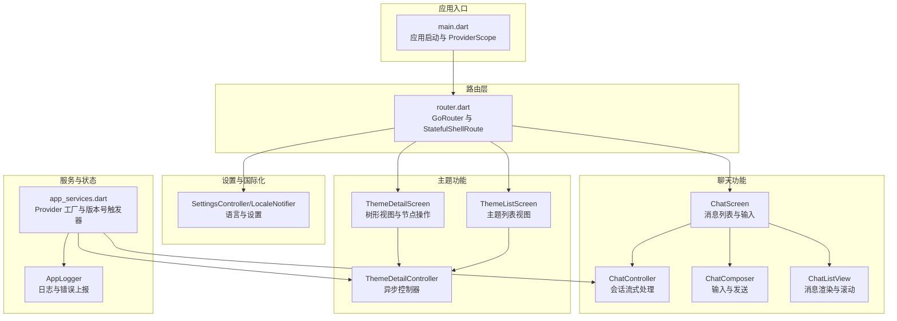
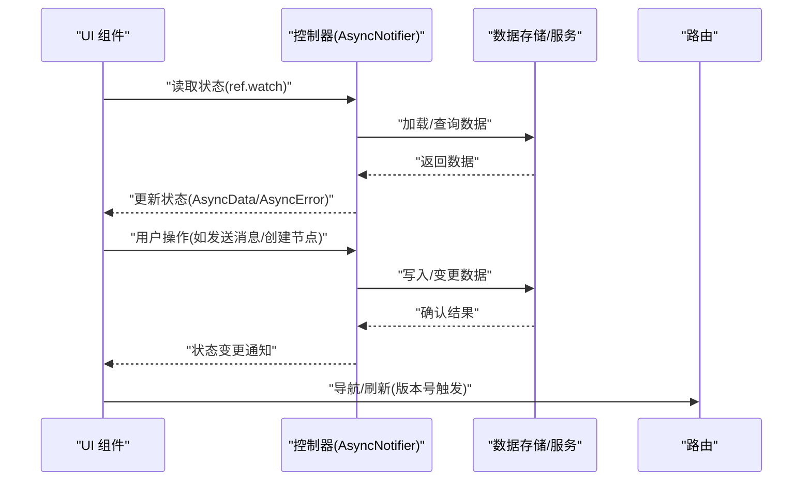
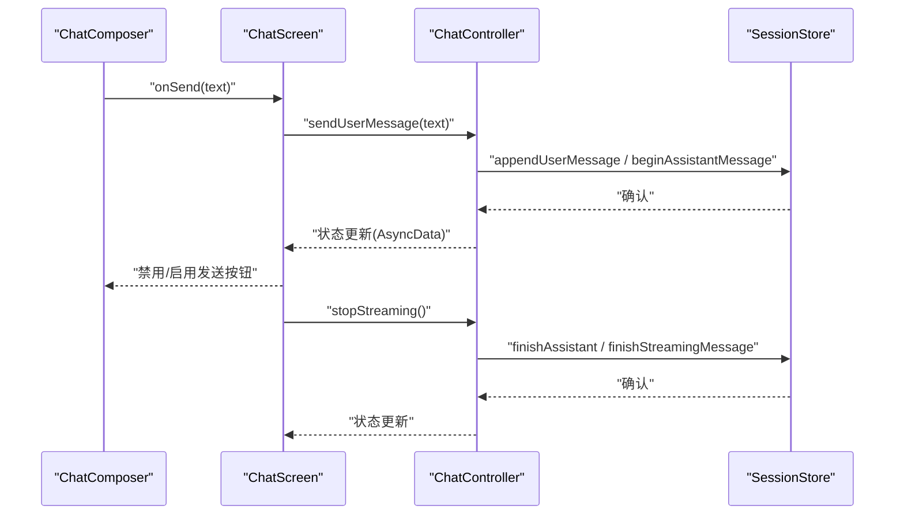
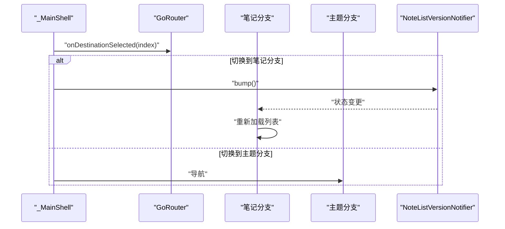
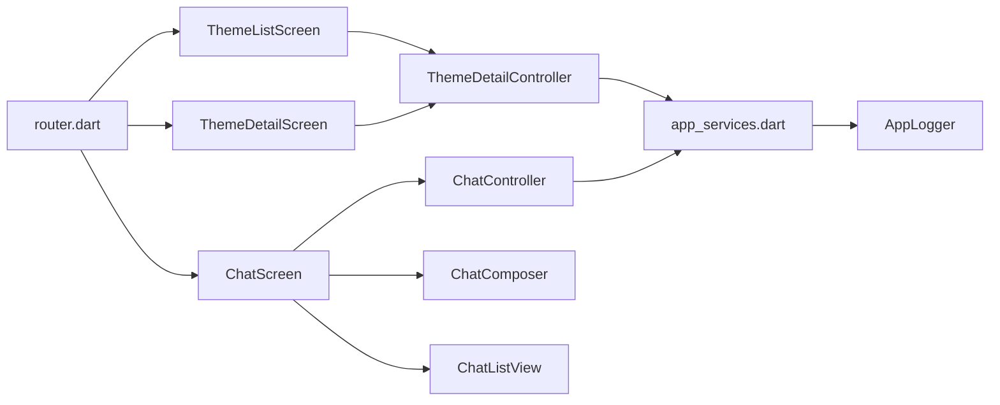

# 组件通信机制

<cite>
**本文引用的文件**
- [lib/main.dart](file://lib/main.dart)
- [lib/ui/core/router.dart](file://lib/ui/core/router.dart)
- [lib/ui/core/app_services.dart](file://lib/ui/core/app_services.dart)
- [lib/ui/features/themes/theme_list_screen.dart](file://lib/ui/features/themes/theme_list_screen.dart)
- [lib/ui/features/themes/theme_detail_screen.dart](file://lib/ui/features/themes/theme_detail_screen.dart)
- [lib/ui/features/themes/theme_detail_controller.dart](file://lib/ui/features/themes/theme_detail_controller.dart)
- [lib/ui/features/chat/chat_screen.dart](file://lib/ui/features/chat/chat_screen.dart)
- [lib/ui/features/chat/chat_controller.dart](file://lib/ui/features/chat/chat_controller.dart)
- [lib/ui/core/shared/chat_composer.dart](file://lib/ui/core/shared/chat_composer.dart)
- [lib/ui/core/shared/chat_list_view.dart](file://lib/ui/core/shared/chat_list_view.dart)
- [lib/ui/features/settings/settings_controller.dart](file://lib/ui/features/settings/settings_controller.dart)
- [lib/ui/core/app_logger.dart](file://lib/ui/core/app_logger.dart)
- [docs/progress-notes-feature.md](file://docs/progress-notes-feature.md)
</cite>

## 目录
1. [引言](#引言)
2. [项目结构](#项目结构)
3. [核心组件](#核心组件)
4. [架构总览](#架构总览)
5. [详细组件分析](#详细组件分析)
6. [依赖关系分析](#依赖关系分析)
7. [性能考量](#性能考量)
8. [故障排查指南](#故障排查指南)
9. [结论](#结论)

## 引言
本文件系统性梳理 ThkTree 的组件通信机制，围绕父子组件通信（回调传递、事件监听、状态提升）、兄弟组件通信（通过共同父组件协调与版本号触发）、数据流向与单向数据流原则进行深入解析，并给出错误处理与性能优化策略及具体实现路径参考。

## 项目结构
ThkTree 采用基于 Riverpod 的状态管理与 GoRouter 路由组织 UI 层，屏幕级组件通过 Provider 读取/更新状态，共享组件以纯 UI 组件形式复用。路由层负责页面导航与参数传递，服务层提供数据库、存储与日志等基础设施。

图表来源
- [lib/main.dart:15-59](file://lib/main.dart#L15-L59)
- [lib/ui/core/router.dart:18-87](file://lib/ui/core/router.dart#L18-L87)
- [lib/ui/features/themes/theme_list_screen.dart:8-88](file://lib/ui/features/themes/theme_list_screen.dart#L8-L88)
- [lib/ui/features/themes/theme_detail_screen.dart:14-90](file://lib/ui/features/themes/theme_detail_screen.dart#L14-L90)
- [lib/ui/features/themes/theme_detail_controller.dart:46-87](file://lib/ui/features/themes/theme_detail_controller.dart#L46-L87)
- [lib/ui/features/chat/chat_screen.dart:19-175](file://lib/ui/features/chat/chat_screen.dart#L19-L175)
- [lib/ui/features/chat/chat_controller.dart:18-221](file://lib/ui/features/chat/chat_controller.dart#L18-L221)
- [lib/ui/core/shared/chat_composer.dart:5-160](file://lib/ui/core/shared/chat_composer.dart#L5-L160)
- [lib/ui/core/shared/chat_list_view.dart:8-99](file://lib/ui/core/shared/chat_list_view.dart#L8-L99)
- [lib/ui/features/settings/settings_controller.dart:41-57](file://lib/ui/features/settings/settings_controller.dart#L41-L57)
- [lib/ui/core/app_services.dart:18-25](file://lib/ui/core/app_services.dart#L18-L25)

章节来源
- [lib/main.dart:15-95](file://lib/main.dart#L15-L95)
- [lib/ui/core/router.dart:18-126](file://lib/ui/core/router.dart#L18-L126)

## 核心组件
- 应用入口与 ProviderScope：在应用启动时初始化路径、日志、本地化与路由，并通过 ProviderScope 注入全局 Provider，确保后续组件可按需读取。
- 路由与页面壳：使用 GoRouter 的 StatefulShellRoute 组织主题与笔记两个分支，底部导航切换分支并通过版本号触发刷新。
- 主题列表与树形视图：主题列表通过控制器加载主题；树形视图通过控制器加载节点并渲染树形结构，支持新增根节点、分叉与删除子树。
- 聊天屏：消息列表由控制器驱动，输入组件通过回调触发发送与停止流式输出，支持将消息片段添加到笔记。
- 共享组件：输入框与消息列表作为纯 UI 组件，通过回调与属性与上层控制器解耦。
- 设置与国际化：设置控制器与语言通知器提供设置与语言切换能力。
- 服务与状态：统一的 Provider 工厂提供数据库、存储、日志与会话路径解析；版本号触发器用于跨页面刷新。

章节来源
- [lib/main.dart:49-93](file://lib/main.dart#L49-L93)
- [lib/ui/core/router.dart:89-126](file://lib/ui/core/router.dart#L89-L126)
- [lib/ui/features/themes/theme_list_screen.dart:8-88](file://lib/ui/features/themes/theme_list_screen.dart#L8-L88)
- [lib/ui/features/themes/theme_detail_screen.dart:14-90](file://lib/ui/features/themes/theme_detail_screen.dart#L14-L90)
- [lib/ui/features/chat/chat_screen.dart:19-175](file://lib/ui/features/chat/chat_screen.dart#L19-L175)
- [lib/ui/core/shared/chat_composer.dart:5-160](file://lib/ui/core/shared/chat_composer.dart#L5-L160)
- [lib/ui/core/shared/chat_list_view.dart:8-99](file://lib/ui/core/shared/chat_list_view.dart#L8-L99)
- [lib/ui/features/settings/settings_controller.dart:41-57](file://lib/ui/features/settings/settings_controller.dart#L41-L57)
- [lib/ui/core/app_services.dart:18-25](file://lib/ui/core/app_services.dart#L18-L25)

## 架构总览
ThkTree 的组件通信遵循“自顶向下单向数据流”与“通过 Provider 解耦”的设计原则：
- 数据源：各控制器（AsyncNotifier）封装业务逻辑与状态，暴露给 UI 组件订阅。
- 状态消费：UI 组件通过 ref.watch 订阅 Provider，自动响应状态变化并重建。
- 事件回调：UI 将用户交互转化为对控制器的方法调用，控制器更新状态并持久化或触发副作用。
- 跨页面刷新：通过版本号触发器与路由切换实现兄弟页面之间的协调刷新。

图表来源
- [lib/ui/features/chat/chat_controller.dart:42-140](file://lib/ui/features/chat/chat_controller.dart#L42-L140)
- [lib/ui/features/themes/theme_detail_controller.dart:46-87](file://lib/ui/features/themes/theme_detail_controller.dart#L46-L87)
- [lib/ui/core/router.dart:101-109](file://lib/ui/core/router.dart#L101-L109)

## 详细组件分析

### 父子组件通信：回调传递与状态提升
- 回调传递
  - 聊天屏将“发送消息”和“停止流式输出”的回调传给输入组件，输入组件在用户提交时调用，实现从子到父的事件传递。
  - 消息气泡将“添加到笔记”的回调传给聊天屏，实现消息选择后触发笔记流程。
- 状态提升
  - 聊天屏根据控制器状态决定是否显示流式指示与上下文条，体现“状态提升至最近公共祖先”的思想。
  - 树形视图中的节点操作（分叉、删除）通过控制器完成，状态变更后由父级视图刷新。

图表来源
- [lib/ui/core/shared/chat_composer.dart:105-144](file://lib/ui/core/shared/chat_composer.dart#L105-L144)
- [lib/ui/features/chat/chat_screen.dart:137-146](file://lib/ui/features/chat/chat_screen.dart#L137-L146)
- [lib/ui/features/chat/chat_controller.dart:111-140](file://lib/ui/features/chat/chat_controller.dart#L111-L140)

章节来源
- [lib/ui/core/shared/chat_composer.dart:5-160](file://lib/ui/core/shared/chat_composer.dart#L5-L160)
- [lib/ui/features/chat/chat_screen.dart:137-175](file://lib/ui/features/chat/chat_screen.dart#L137-L175)
- [lib/ui/features/chat/chat_controller.dart:18-221](file://lib/ui/features/chat/chat_controller.dart#L18-L221)

### 兄弟组件通信：通过共同父组件协调与版本号触发
- 路由层协调：底部导航切换分支时，通过版本号触发器强制刷新笔记列表，确保兄弟页面（主题树与笔记）状态一致。
- 版本号触发：笔记列表版本号通知器在切换到笔记分支时 bump，触发笔记列表控制器重新加载。

图表来源
- [lib/ui/core/router.dart:101-109](file://lib/ui/core/router.dart#L101-L109)
- [lib/ui/core/app_services.dart:18-25](file://lib/ui/core/app_services.dart#L18-L25)

章节来源
- [lib/ui/core/router.dart:89-126](file://lib/ui/core/router.dart#L89-L126)
- [lib/ui/core/app_services.dart:18-25](file://lib/ui/core/app_services.dart#L18-L25)

### 数据流向与单向数据流原则
- 单向数据流：UI 仅通过 Provider 读取状态，用户操作通过控制器发起副作用，最终由状态变更驱动 UI 更新。
- 控制器职责：封装业务逻辑（如会话流式处理、节点增删改查），统一处理错误与日志。
- UI 无状态：共享组件（输入框、消息列表）保持纯 UI，通过回调与属性与上层解耦，便于复用与测试。

章节来源
- [lib/ui/features/chat/chat_controller.dart:42-140](file://lib/ui/features/chat/chat_controller.dart#L42-L140)
- [lib/ui/features/themes/theme_detail_controller.dart:46-87](file://lib/ui/features/themes/theme_detail_controller.dart#L46-L87)
- [lib/ui/core/shared/chat_list_view.dart:22-99](file://lib/ui/core/shared/chat_list_view.dart#L22-L99)

### 错误处理与性能优化策略
- 错误处理
  - 控制器内部捕获异常并记录日志，必要时回退到已有状态，避免 UI 崩溃。
  - 输入组件在发送失败时恢复文本并提示用户。
  - 应用级错误捕获：FlutterError 与 PlatformDispatcher 错误统一写入日志。
- 性能优化
  - 使用 AsyncNotifier 与 FutureProvider 管理异步状态，避免不必要的重建。
  - 聊天屏根据消息状态动态渲染上下文条，减少无效计算。
  - 版本号触发刷新替代频繁的全局订阅，降低重绘成本。

章节来源
- [lib/ui/features/chat/chat_controller.dart:134-139](file://lib/ui/features/chat/chat_controller.dart#L134-L139)
- [lib/ui/core/shared/chat_composer.dart:123-134](file://lib/ui/core/shared/chat_composer.dart#L123-L134)
- [lib/ui/core/app_logger.dart:102-132](file://lib/ui/core/app_logger.dart#L102-L132)
- [docs/progress-notes-feature.md:62-92](file://docs/progress-notes-feature.md#L62-L92)

## 依赖关系分析
- 组件依赖
  - 路由层依赖主题与聊天屏幕；主题屏幕依赖主题控制器；聊天屏幕依赖聊天控制器与共享组件。
  - 控制器依赖服务层（数据库、存储、日志、设置）。
- Provider 依赖
  - app_services 提供统一的 Provider 工厂，形成清晰的依赖注入边界。
  - 版本号触发器独立于业务控制器，仅承担刷新协调职责。

图表来源
- [lib/ui/core/router.dart:18-87](file://lib/ui/core/router.dart#L18-L87)
- [lib/ui/features/themes/theme_list_screen.dart:8-88](file://lib/ui/features/themes/theme_list_screen.dart#L8-L88)
- [lib/ui/features/themes/theme_detail_screen.dart:14-90](file://lib/ui/features/themes/theme_detail_screen.dart#L14-L90)
- [lib/ui/features/chat/chat_screen.dart:19-175](file://lib/ui/features/chat/chat_screen.dart#L19-L175)
- [lib/ui/core/app_services.dart:18-25](file://lib/ui/core/app_services.dart#L18-L25)

章节来源
- [lib/ui/core/router.dart:18-126](file://lib/ui/core/router.dart#L18-L126)
- [lib/ui/core/app_services.dart:27-169](file://lib/ui/core/app_services.dart#L27-L169)

## 性能考量
- 控制器粒度：将复杂业务拆分为多个控制器，避免单一控制器承担过多职责导致状态膨胀。
- 异步状态管理：使用 AsyncData/AsyncError 包裹异步结果，UI 可按需渲染加载/空/错误态，减少重复渲染。
- 滚动与流式：消息列表自动贴底与滚动控制，流式输出按增量更新状态，避免全量重建。
- 刷新策略：版本号触发刷新优先于全局订阅，降低不必要的重建频率。

## 故障排查指南
- 聊天流式中断或异常
  - 检查停止流式与取消令牌逻辑，确保在 dispose 与用户主动停止时正确清理。
  - 关注网络错误处理与日志记录，定位 LLM 接口问题。
- 导航与刷新异常
  - 确认路由切换时版本号触发是否生效，避免兄弟页面状态不一致。
  - 若出现无限刷新，检查 onDestinationSelected 中的触发点与状态依赖。
- 日志与错误
  - 应用级错误捕获已接入日志系统，可通过日志文件定位异常堆栈与上下文。

章节来源
- [lib/ui/features/chat/chat_controller.dart:55-90](file://lib/ui/features/chat/chat_controller.dart#L55-L90)
- [lib/ui/core/router.dart:101-109](file://lib/ui/core/router.dart#L101-L109)
- [lib/ui/core/app_logger.dart:102-132](file://lib/ui/core/app_logger.dart#L102-L132)
- [docs/progress-notes-feature.md:62-92](file://docs/progress-notes-feature.md#L62-L92)

## 结论
ThkTree 的组件通信以 Riverpod 为核心，结合 GoRouter 实现页面级导航与兄弟页面协调。父子组件通过回调与状态提升实现清晰的职责分离；兄弟组件通过版本号触发器与路由切换达成一致性刷新。整体遵循单向数据流与解耦设计，配合完善的错误处理与性能策略，保障了复杂交互场景下的稳定性与可维护性。