# iOS Cupertino UI 迁移

<cite>
**本文档引用的文件**
- [README.md](file://README.md)
- [ios-migration-plan.md](file://docs/ios-migration-plan.md)
- [main.dart](file://lib/main.dart)
- [AppDelegate.swift](file://ios/Runner/AppDelegate.swift)
- [SceneDelegate.swift](file://ios/Runner/SceneDelegate.swift)
- [router.dart](file://lib/ui/core/router.dart)
- [pubspec.yaml](file://pubspec.yaml)
- [app_theme.dart](file://lib/ui/core/theme/app_theme.dart)
- [app_icons.dart](file://lib/ui/core/theme/app_icons.dart)
- [widgets.dart](file://lib/ui/core/widgets/widgets.dart)
- [thk_nav_bar.dart](file://lib/ui/core/widgets/thk_nav_bar.dart)
- [thk_list_section.dart](file://lib/ui/core/widgets/thk_list_section.dart)
</cite>

## 目录
1. [项目概述](#项目概述)
2. [迁移计划总览](#迁移计划总览)
3. [架构设计](#架构设计)
4. [核心组件分析](#核心组件分析)
5. [UI 组件体系](#ui-组件体系)
6. [路由系统](#路由系统)
7. [字体与图标系统](#字体与图标系统)
8. [迁移实施策略](#迁移实施策略)
9. [质量保证](#质量保证)
10. [风险控制](#风险控制)
11. [总结](#总结)

## 项目概述

ThkTree 是一个基于 Flutter 的 iOS 专用应用，目标是在 iPhone 和 iPadOS 上提供原生 iOS 体验。该项目正在进行从 Material Design 到 Cupertino Design 的全面迁移，以符合 iOS 26 的设计语言和用户体验标准。

### 项目特点
- **平台专一性**：专注于 iOS 平台，不支持 Android/Web/桌面
- **设计目标**：完全采用 iOS 原生设计语言，避免"安卓感"
- **技术栈**：Flutter + Riverpod + GoRouter
- **字体策略**：使用系统字体 .SF Pro Text + PingFang SC 回退

## 迁移计划总览

### 迁移目标
- 将所有界面从 Material Design 迁移到 Cupertino Design
- 保持业务逻辑零改动
- 实现 iOS 原生的交互体验
- 采用最小化改造原则

### 迁移范围
项目采用分阶段迁移策略，共分为 5 个主要阶段：

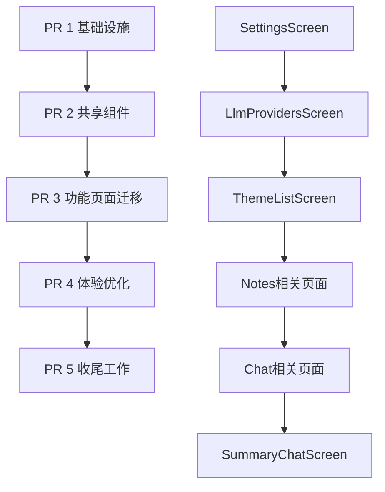

**图表来源**
- [ios-migration-plan.md: 75-86:75-86](file://docs/ios-migration-plan.md#L75-L86)

### 关键设计决策

| 设计维度 | 决策内容 | 实现方式 |
|---------|---------|---------|
| 应用框架 | `CupertinoApp.router` | 替换 `MaterialApp.router` |
| 主题系统 | `CupertinoThemeData` | 亮色主题，系统蓝色为主色 |
| 导航栏 | Large Title + Inline Title | 自动切换效果 |
| 列表样式 | inset grouped | 圆角分组，缩进分隔线 |
| 弹窗组件 | `CupertinoAlertDialog` + `CupertinoActionSheet` | 替代 Material 对话框 |
| 页面切换 | `CupertinoPageRoute` | 原生滑动返回 |

**章节来源**
- [ios-migration-plan.md: 24-41:24-41](file://docs/ios-migration-plan.md#L24-L41)

## 架构设计

### 整体架构图

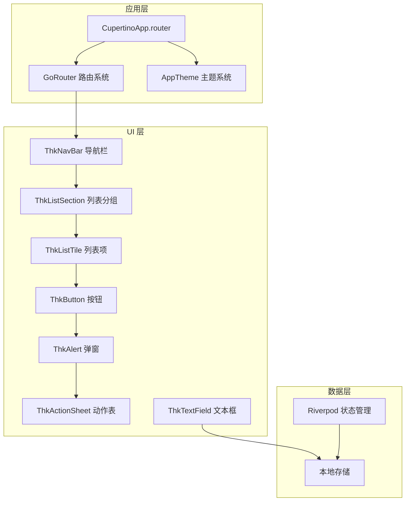

**图表来源**
- [main.dart: 62-94:62-94](file://lib/main.dart#L62-L94)
- [router.dart: 21-112:21-112](file://lib/ui/core/router.dart#L21-L112)

### 核心架构组件

#### 1. 应用入口点
应用入口通过 `ThkTreeApp` 类实现，负责初始化全局状态和服务。

#### 2. 路由系统
采用 GoRouter 实现多分支路由，支持 iOS 原生的 TabBar 导航模式。

#### 3. 主题系统
统一的 Cupertino 主题配置，包含字体、颜色、文本样式等设计令牌。

**章节来源**
- [main.dart: 16-60:16-60](file://lib/main.dart#L16-L60)
- [router.dart: 114-167:114-167](file://lib/ui/core/router.dart#L114-L167)

## 核心组件分析

### 应用主题系统

#### 主题配置架构

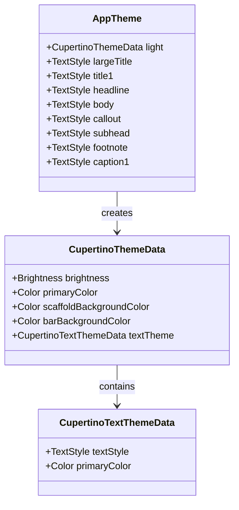

**图表来源**
- [app_theme.dart: 4-18:4-18](file://lib/ui/core/theme/app_theme.dart#L4-L18)

#### 文本样式令牌
系统定义了 8 个 iOS HIG 标准文本样式令牌，涵盖从大标题到脚注的所有层级。

**章节来源**
- [app_theme.dart: 20-85:20-85](file://lib/ui/core/theme/app_theme.dart#L20-L85)

### 图标系统

#### 图标映射架构

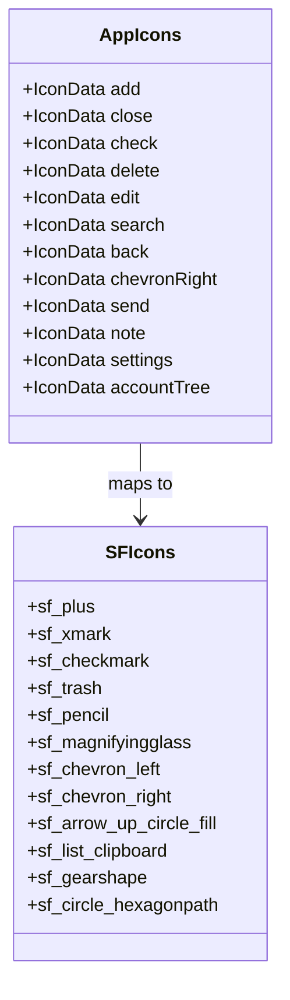

**图表来源**
- [app_icons.dart: 8-104:8-104](file://lib/ui/core/theme/app_icons.dart#L8-L104)

#### 图标分类体系
- **通用操作**：添加、关闭、检查、删除、编辑、刷新、搜索、更多
- **导航相关**：返回、右侧箭头、左侧箭头
- **通信聊天**：发送、停止、聊天、论坛
- **内容文件**：便签、文件夹、下载、星标
- **设置提供商**：设置、扩展、云
- **树形分支**：树形结构、分支箭头

**章节来源**
- [app_icons.dart: 11-104:11-104](file://lib/ui/core/theme/app_icons.dart#L11-L104)

## UI 组件体系

### 导航栏组件

#### 导航栏架构设计

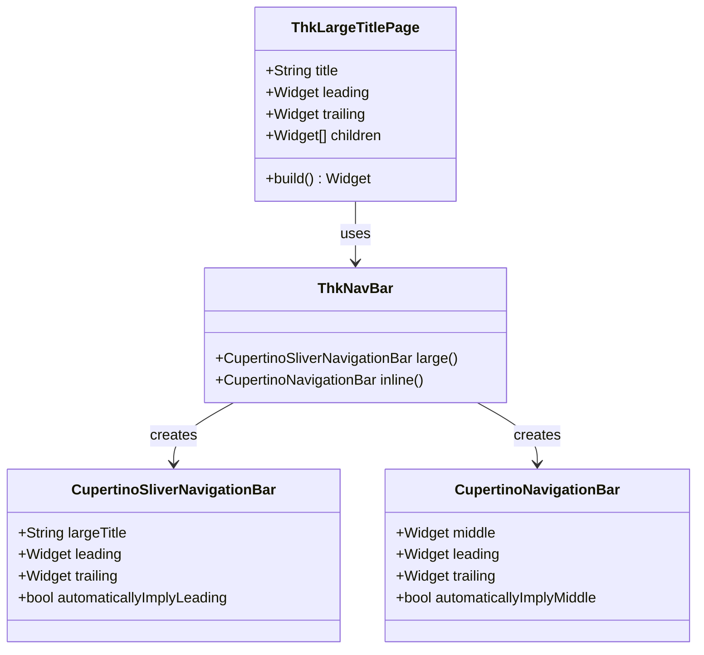

**图表来源**
- [thk_nav_bar.dart: 13-71:13-71](file://lib/ui/core/widgets/thk_nav_bar.dart#L13-L71)

#### 大标题页面模式
支持自动从大标题模式切换到内联标题模式，适用于列表页面的滚动体验。

#### 内联标题模式
适用于详情页面，标题固定显示，适合信息展示类页面。

**章节来源**
- [thk_nav_bar.dart: 16-70:16-70](file://lib/ui/core/widgets/thk_nav_bar.dart#L16-L70)

### 列表组件

#### 列表分组架构

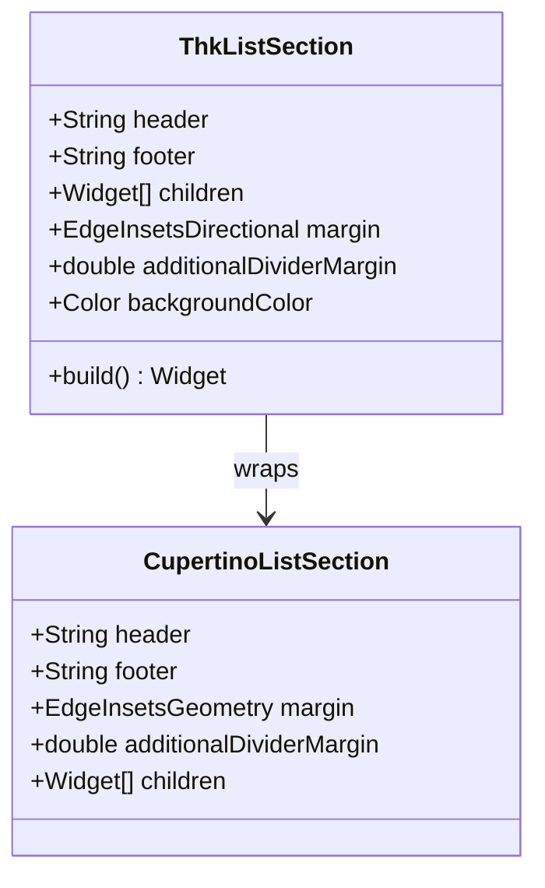

**图表来源**
- [thk_list_section.dart: 17-81:17-81](file://lib/ui/core/widgets/thk_list_section.dart#L17-L81)

#### 设计特性
- **圆角分组**：模拟 iOS 设置应用的圆角分组效果
- **自动分隔线**：子项之间自动添加细分隔线
- **缩进对齐**：分隔线左侧缩进 56pt，对齐标题文本
- **系统背景**：使用 `secondarySystemGroupedBackground` 色彩

**章节来源**
- [thk_list_section.dart: 3-81:3-81](file://lib/ui/core/widgets/thk_list_section.dart#L3-L81)

### 共享组件清单

| 组件名称 | 功能描述 | 实现方式 |
|---------|---------|---------|
| ThkNavBar | 导航栏组件 | Large/Inline 双模式 |
| ThkListSection | 列表分组容器 | inset grouped 样式 |
| ThkListTile | 列表项组件 | 标准 44/52px 高度 |
| ThkButton | 按钮组件 | filled/tinted/plain 三态 |
| ThkAlert | 警告弹窗 | 封装 CupertinoAlertDialog |
| ThkActionSheet | 动作表 | 封装 CupertinoActionSheet |
| ThkTextField | 文本输入框 | 自动隐藏键盘 |

**章节来源**
- [widgets.dart: 1-8:1-8](file://lib/ui/core/widgets/widgets.dart#L1-L8)

## 路由系统

### 路由架构设计

```mermaid
graph LR
subgraph "根路由"
Home[/] --> Themes[主题分支]
Notes[/notes] --> NotesBranch[笔记分支]
Settings[/settings] --> SettingsBranch[设置分支]
LLM[/llm-providers] --> LLMBranch[LLM分支]
end
subgraph "主题分支"
Themes --> ThemeList[/]
ThemeList --> ThemeDetail[/themes/:themeId/tree]
ThemeDetail --> Chat[/themes/:themeId/nodes/:nodeId]
Chat --> Summary[/themes/:themeId/nodes/:parentNodeId/summary]
end
subgraph "TabBar"
Tab1[主题] --> ThemeList
Tab2[笔记] --> Notes
Tab3[设置] --> Settings
end
```

**图表来源**
- [router.dart: 21-112:21-112](file://lib/ui/core/router.dart#L21-L112)

### 路由实现特点

#### 状态化 Shell 路由
- 使用 `StatefulShellRoute.indexedStack` 实现 iOS 原生 TabBar 导航
- 支持分支间的状态保持和导航历史管理

#### 页面构建器
- 所有页面使用 `CupertinoPage` 包装，确保原生 iOS 体验
- 支持页面参数传递和路由状态管理

#### 错误处理
- 统一的错误页面处理，使用 `errorBuilder` 返回错误信息

**章节来源**
- [router.dart: 25-112:25-112](file://lib/ui/core/router.dart#L25-L112)

## 字体与图标系统

### 字体系统架构

#### 字体配置策略

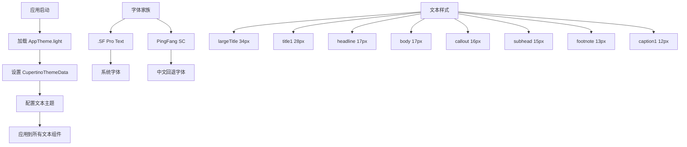

**图表来源**
- [app_theme.dart: 10-18:10-18](file://lib/ui/core/theme/app_theme.dart#L10-L18)

#### 字体特性
- **系统字体**：使用 .SF Pro Text 获取最佳 iOS 体验
- **中文支持**：自动回退到 PingFang SC 确保中文显示
- **层级规范**：严格遵循 iOS HIG 字号和字重规范

### 图标系统实现

#### 图标映射机制

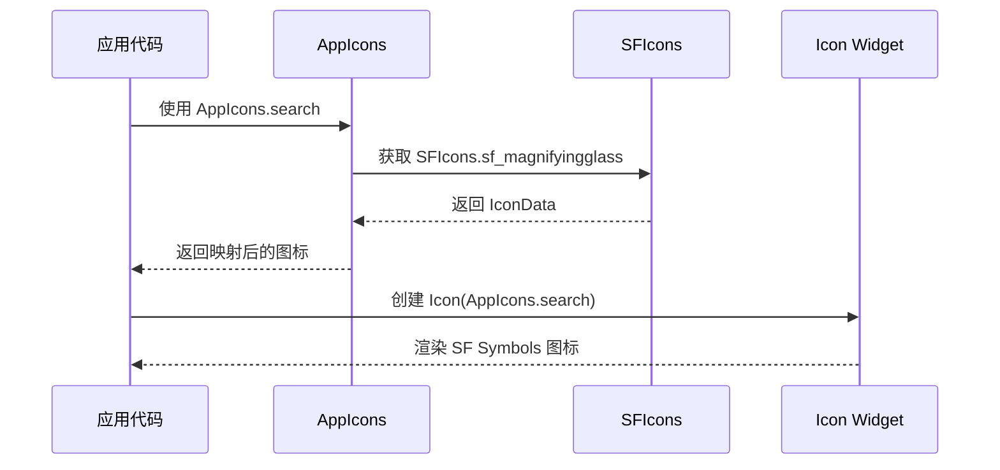

**图表来源**
- [app_icons.dart: 37-38:37-38](file://lib/ui/core/theme/app_icons.dart#L37-L38)

#### 图标使用规范
- **统一入口**：所有图标使用 `AppIcons` 类访问
- **命名规范**：保持与 Material Icons 对应关系
- **粗细控制**：通过 SF Symbols 控制线条粗细

**章节来源**
- [app_theme.dart: 7-8:7-8](file://lib/ui/core/theme/app_theme.dart#L7-L8)
- [app_icons.dart: 1-105:1-105](file://lib/ui/core/theme/app_icons.dart#L1-L105)

## 迁移实施策略

### 第一阶段：基础设施搭建

#### 核心任务清单

| 任务编号 | 任务内容 | 技术要点 | 验收标准 |
|---------|---------|---------|---------|
| 1.1 | 添加 flutter_sficon 依赖 | 在 pubspec.yaml 中添加依赖 | 依赖正确安装 |
| 1.2 | 创建 AppTheme.light | 配置 CupertinoThemeData | 主题正确应用 |
| 1.3 | 创建 AppIcons 映射 | 建立 Material → SF Symbols 映射 | 图标正确显示 |
| 1.4 | 修改 main.dart | 替换 MaterialApp 为 CupertinoApp | 应用正常启动 |
| 1.5 | 临时包装器 | 添加 Material 包装器 | 子组件正常渲染 |

#### 迁移流程图

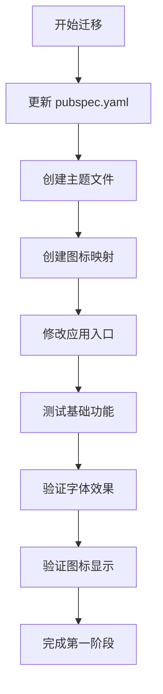

**图表来源**
- [ios-migration-plan.md: 94-122:94-122](file://docs/ios-migration-plan.md#L94-L122)

### 第二阶段：共享组件开发

#### 组件开发优先级

| 组件 | 开发顺序 | 依赖关系 | 复杂度 |
|------|---------|---------|--------|
| ThkButton | 1 | 无 | 低 |
| ThkTextField | 2 | 无 | 低 |
| ThkAlert | 3 | 无 | 中 |
| ThkActionSheet | 4 | 无 | 中 |
| ThkListTile | 5 | Button | 中 |
| ThkListSection | 6 | ListTile | 高 |
| ThkNavBar | 7 | ListSection | 高 |

#### 组件测试策略
- 每个组件创建独立的预览页面
- 使用 `flutter-add-widget-preview` 技能
- 对照 iOS 系统应用进行视觉对比

### 第三阶段：功能页面迁移

#### 迁移顺序策略

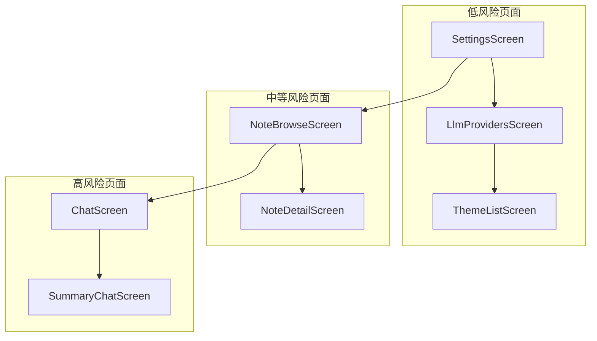

**图表来源**
- [ios-migration-plan.md: 169-203:169-203](file://docs/ios-migration-plan.md#L169-L203)

#### 风险控制措施
- **渐进式迁移**：从简单页面开始，逐步过渡到复杂页面
- **功能隔离**：每个页面迁移完成后进行独立测试
- **回滚准备**：每个 PR 都可以独立回滚

## 质量保证

### 测试策略

#### 单元测试覆盖
- **核心组件测试**：共享组件的单元测试
- **路由测试**：路由跳转和参数传递测试
- **状态管理测试**：Riverpod 状态管理测试

#### UI 测试策略
- **Widget 预览**：每个组件创建独立预览页面
- **跨页面测试**：验证页面间的导航和数据传递
- **性能测试**：确保迁移后的性能表现

### 代码质量标准

#### 代码规范
- **命名规范**：遵循 Flutter/Hive 命名约定
- **注释规范**：重要函数和类添加详细注释
- **错误处理**：完善的异常处理和错误提示

#### 性能优化
- **内存管理**：及时释放不必要的资源
- **渲染优化**：避免不必要的重建
- **网络优化**：合理的缓存策略

## 风险控制

### 已识别风险

| 风险类型 | 风险等级 | 影响程度 | 应对措施 |
|---------|---------|---------|---------|
| CupertinoApp 缺少 Material 祖先 | 高 | 页面崩溃 | 临时包装器兜底 |
| SF Symbols 视觉重量差异 | 中 | 布局破坏 | 集中映射 + 视觉对齐 |
| SliverNavigationBar 兼容性 | 中 | 滚动问题 | 使用 NestedScrollView 桥接 |
| Widget 测试失效 | 低 | 测试中断 | 更新测试断言 |
| 包体积增加 | 低 | 启动时间 | 按需加载子集 |

### 回滚策略

#### PR 独立回滚
- 每个 PR 都是独立的分支和合并单元
- 出现问题可直接 `git revert <merge-commit>`
- 不影响其他 PR 的现有代码

#### 快速修复流程
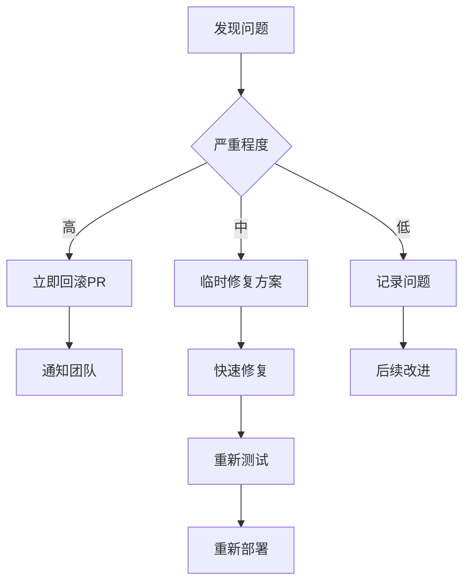

## 总结

### 迁移成果预期

通过本次 iOS Cupertino UI 迁移，项目将实现以下目标：

#### 用户体验提升
- **原生 iOS 感**：完全符合 iOS 26 设计语言
- **一致性体验**：所有页面采用统一的设计规范
- **流畅交互**：原生滑动返回和动画效果

#### 技术架构优化
- **清晰分层**：UI 组件与业务逻辑分离
- **可维护性**：统一的组件库和设计系统
- **扩展性**：模块化的架构便于后续功能扩展

#### 开发效率提升
- **组件复用**：共享组件减少重复开发
- **测试完善**：完整的测试覆盖保证代码质量
- **文档齐全**：详细的迁移文档指导后续维护

### 后续发展建议

#### 阶段二规划
- **暗黑模式**：在现有基础上添加暗色主题支持
- **国际化增强**：完善多语言支持和本地化
- **性能优化**：进一步优化启动速度和内存使用

#### 长期维护
- **设计系统演进**：持续完善组件库和设计规范
- **技术债务清理**：定期重构和优化代码结构
- **团队知识传承**：建立完整的开发和维护文档

这次迁移不仅改变了应用的外观和感觉，更重要的是建立了符合 iOS 平台特性的技术架构，为项目的长期发展奠定了坚实基础。