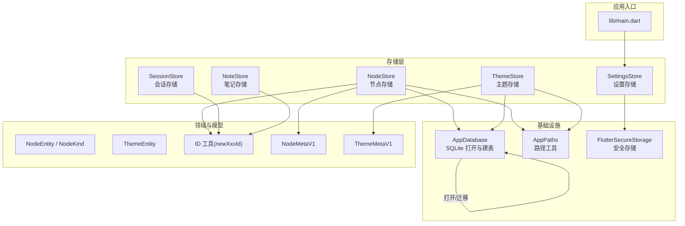
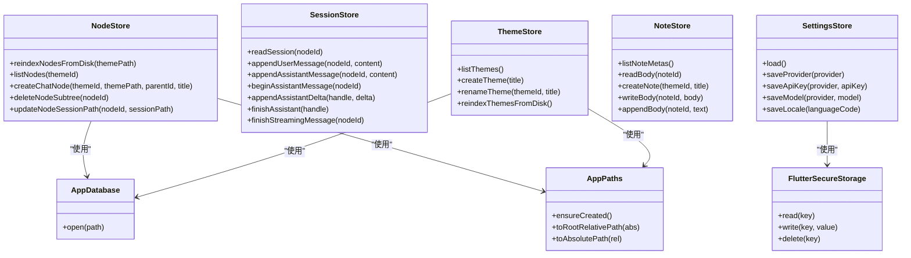
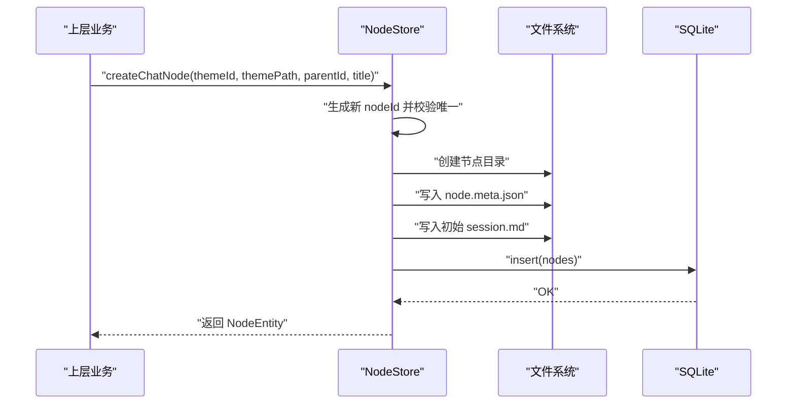
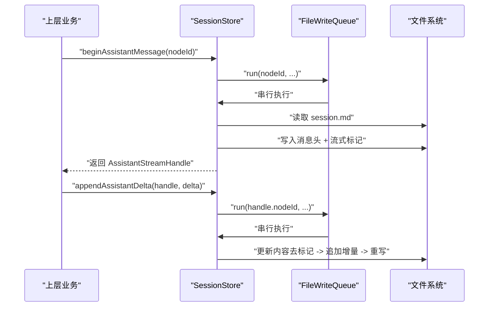
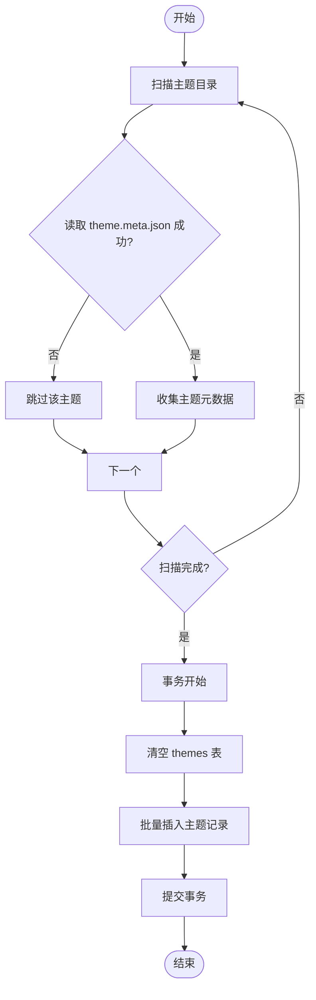
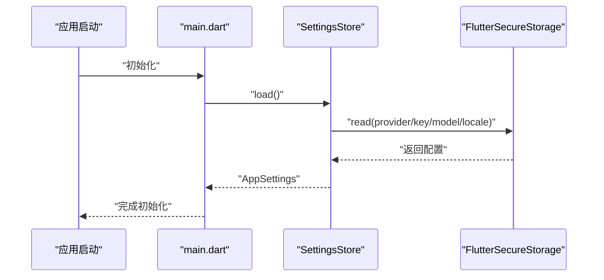
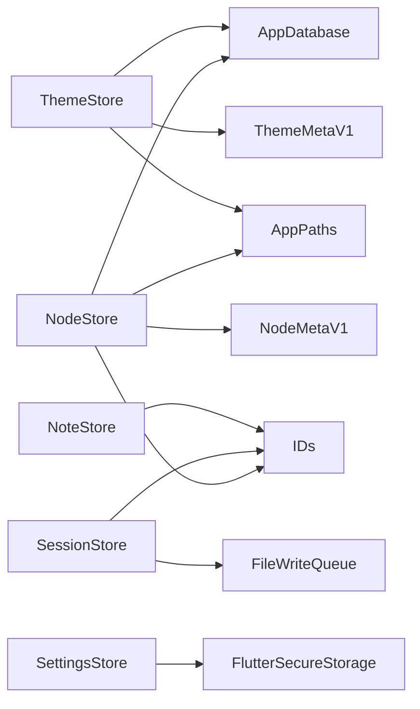

# 存储抽象层

<cite>
**本文引用的文件**
- [lib/main.dart](file://lib/main.dart)
- [lib/data/stores/node_store.dart](file://lib/data/stores/node_store.dart)
- [lib/data/stores/session_store.dart](file://lib/data/stores/session_store.dart)
- [lib/data/stores/theme_store.dart](file://lib/data/stores/theme_store.dart)
- [lib/data/stores/note_store.dart](file://lib/data/stores/note_store.dart)
- [lib/data/services/settings_store.dart](file://lib/data/services/settings_store.dart)
- [lib/data/services/app_database.dart](file://lib/data/services/app_database.dart)
- [lib/data/models/node_meta.dart](file://lib/data/models/node_meta.dart)
- [lib/data/models/theme_meta.dart](file://lib/data/models/theme_meta.dart)
- [lib/domain/ids.dart](file://lib/domain/ids.dart)
- [lib/domain/node.dart](file://lib/domain/node.dart)
- [lib/domain/theme.dart](file://lib/domain/theme.dart)
</cite>

## 目录
1. [引言](#引言)
2. [项目结构](#项目结构)
3. [核心组件](#核心组件)
4. [架构总览](#架构总览)
5. [详细组件分析](#详细组件分析)
6. [依赖关系分析](#依赖关系分析)
7. [性能考量](#性能考量)
8. [故障排查指南](#故障排查指南)
9. [结论](#结论)
10. [附录](#附录)

## 引言
本文件系统化梳理 ThkTree 的存储抽象层，围绕 Repository 模式展开，解释数据访问接口的设计原则与实现类之间的关系；重点阐述 NodeStore、SessionStore、ThemeStore、NoteStore、SettingsStore 的职责分工与接口设计；总结存储层统一抽象（CRUD 标准接口、错误处理机制、事务管理）；说明存储层与上层业务逻辑的解耦方式及一致性保障；并给出扩展与性能优化的最佳实践。

## 项目结构
存储相关代码主要位于 lib/data 目录：
- stores：面向实体的存储服务（NodeStore、SessionStore、ThemeStore、NoteStore）
- services：应用级服务（AppDatabase、SettingsStore、会话 Markdown 解析等）
- models：持久化元数据模型（NodeMetaV1、ThemeMetaV1）
- domain：领域对象（NodeEntity、ThemeEntity、NodeKind、ID 工具）

图表来源
- [lib/main.dart:42-44](file://lib/main.dart#L42-L44)
- [lib/data/stores/node_store.dart:12-16](file://lib/data/stores/node_store.dart#L12-L16)
- [lib/data/stores/theme_store.dart:11-15](file://lib/data/stores/theme_store.dart#L11-L15)
- [lib/data/stores/session_store.dart:8-11](file://lib/data/stores/session_store.dart#L8-L11)
- [lib/data/services/app_database.dart:3-17](file://lib/data/services/app_database.dart#L3-L17)
- [lib/data/models/node_meta.dart:5-22](file://lib/data/models/node_meta.dart#L5-L22)
- [lib/data/models/theme_meta.dart:5-16](file://lib/data/models/theme_meta.dart#L5-L16)
- [lib/domain/ids.dart:3-9](file://lib/domain/ids.dart#L3-L9)
- [lib/domain/node.dart:1-30](file://lib/domain/node.dart#L1-L30)
- [lib/domain/theme.dart:1-15](file://lib/domain/theme.dart#L1-L15)

章节来源
- [lib/main.dart:15-59](file://lib/main.dart#L15-L59)
- [lib/data/services/app_database.dart:20-46](file://lib/data/services/app_database.dart#L20-L46)

## 核心组件
- NodeStore：负责主题内节点树的索引重建、查询、创建聊天节点、删除子树、路径解析与相对路径转换等。内部使用 SQLite 数据库与磁盘目录结构双向同步，并通过事务保证一致性。
- SessionStore：负责单节点会话内容的读写、消息追加、流式输出的开始/增量/结束与失败标记处理，采用队列串行化确保并发安全。
- ThemeStore：负责主题列表、创建、重命名、从磁盘重建索引等操作，同样通过事务维护数据库与磁盘一致。
- NoteStore：负责纯文本笔记的元信息解析、创建、正文读写与追加，基于 YAML Frontmatter 维护元数据。
- SettingsStore：负责应用设置的加载与保存，密钥与模型配置通过安全存储保存，语言设置也持久化到安全存储。

章节来源
- [lib/data/stores/node_store.dart:12-375](file://lib/data/stores/node_store.dart#L12-L375)
- [lib/data/stores/session_store.dart:8-169](file://lib/data/stores/session_store.dart#L8-L169)
- [lib/data/stores/theme_store.dart:11-139](file://lib/data/stores/theme_store.dart#L11-L139)
- [lib/data/stores/note_store.dart:53-151](file://lib/data/stores/note_store.dart#L53-L151)
- [lib/data/services/settings_store.dart:106-184](file://lib/data/services/settings_store.dart#L106-L184)

## 架构总览
存储层采用“Repository 模式 + 抽象接口”的分层设计：
- 上层业务仅依赖抽象接口（如 NodeStore 提供 list/create/delete 等方法），不直接接触数据库或文件系统细节。
- 具体实现封装在各 Store 类中，统一通过 AppDatabase 获取数据库连接，通过 AppPaths 进行路径转换，通过安全存储保存敏感配置。
- 事务管理集中在关键写入流程（如批量重建索引、插入主题/节点），保证原子性与一致性。
- 错误处理策略：对缺失资源抛出明确异常（如“主题未找到”“节点未找到”），对磁盘/文件格式异常进行吞吐跳过或格式化异常抛出。

图表来源
- [lib/data/stores/node_store.dart:12-16](file://lib/data/stores/node_store.dart#L12-L16)
- [lib/data/stores/theme_store.dart:11-15](file://lib/data/stores/theme_store.dart#L11-L15)
- [lib/data/services/app_database.dart:3-17](file://lib/data/services/app_database.dart#L3-L17)
- [lib/data/services/settings_store.dart:106-109](file://lib/data/services/settings_store.dart#L106-L109)

## 详细组件分析

### NodeStore 分析
职责与接口设计
- 节点索引重建：从磁盘扫描节点目录，读取 node.meta.json，与数据库进行比对，删除多余项、保留并替换现有项。
- 查询与过滤：按主题 ID 查询节点列表，按创建时间排序。
- 创建聊天节点：生成唯一节点 ID，创建磁盘目录与元数据文件，写入初始会话 Markdown，最后入库。
- 删除子树：递归收集子树节点 ID，删除对应目录，事务内批量删除数据库记录，随后重新索引。
- 路径解析：支持根据数据库记录或主题路径定位节点目录，必要时回溯磁盘查找匹配目录。
- 相对路径转换：通过 AppPaths 在绝对路径与相对路径之间转换，避免硬编码路径。

事务与一致性
- 使用事务包裹批量删除与插入，保证索引重建与创建节点过程的原子性。
- 写入顺序严格控制：先创建目录与元数据文件，再写入数据库，失败时通过原子写入与异常回滚减少不一致窗口。

错误处理
- 对缺失资源抛出明确异常（如主题/节点不存在）。
- 对磁盘格式异常进行吞吐跳过，避免中断整个索引过程。

图表来源
- [lib/data/stores/node_store.dart:112-204](file://lib/data/stores/node_store.dart#L112-L204)

章节来源
- [lib/data/stores/node_store.dart:18-59](file://lib/data/stores/node_store.dart#L18-L59)
- [lib/data/stores/node_store.dart:86-110](file://lib/data/stores/node_store.dart#L86-L110)
- [lib/data/stores/node_store.dart:112-204](file://lib/data/stores/node_store.dart#L112-L204)
- [lib/data/stores/node_store.dart:206-235](file://lib/data/stores/node_store.dart#L206-L235)
- [lib/data/stores/node_store.dart:259-273](file://lib/data/stores/node_store.dart#L259-L273)
- [lib/data/stores/node_store.dart:290-303](file://lib/data/stores/node_store.dart#L290-L303)
- [lib/data/stores/node_store.dart:305-353](file://lib/data/stores/node_store.dart#L305-L353)
- [lib/data/stores/node_store.dart:377-414](file://lib/data/stores/node_store.dart#L377-L414)

### SessionStore 分析
职责与接口设计
- 会话读取：根据节点 ID 获取会话文件路径，解析 YAML Frontmatter 与消息体，返回会话文档对象。
- 追加消息：支持用户与助手消息的追加，自动添加消息头与时间戳。
- 流式输出：开始助手消息时写入“流式标记”，后续增量追加与结束时移除标记，失败时写入错误标记。
- 原子写入：所有文件写入均采用临时文件 + 原子重命名，避免部分写入导致的数据损坏。
- 队列串行化：通过写入队列确保同一节点的写入串行执行，避免并发竞争。

图表来源
- [lib/data/stores/session_store.dart:84-131](file://lib/data/stores/session_store.dart#L84-L131)
- [lib/data/stores/session_store.dart:150-168](file://lib/data/stores/session_store.dart#L150-L168)
- [lib/data/stores/session_store.dart:199-204](file://lib/data/stores/session_store.dart#L199-L204)

章节来源
- [lib/data/stores/session_store.dart:17-40](file://lib/data/stores/session_store.dart#L17-L40)
- [lib/data/stores/session_store.dart:42-64](file://lib/data/stores/session_store.dart#L42-L64)
- [lib/data/stores/session_store.dart:66-82](file://lib/data/stores/session_store.dart#L66-L82)
- [lib/data/stores/session_store.dart:84-131](file://lib/data/stores/session_store.dart#L84-L131)
- [lib/data/stores/session_store.dart:133-148](file://lib/data/stores/session_store.dart#L133-L148)
- [lib/data/stores/session_store.dart:150-168](file://lib/data/stores/session_store.dart#L150-L168)
- [lib/data/stores/session_store.dart:178-197](file://lib/data/stores/session_store.dart#L178-L197)
- [lib/data/stores/session_store.dart:199-204](file://lib/data/stores/session_store.dart#L199-L204)

### ThemeStore 分析
职责与接口设计
- 主题列表：按更新时间倒序列出主题。
- 创建主题：生成唯一主题 ID，创建主题目录与主题元数据文件，入库并记录相对路径。
- 重命名主题：读取主题元数据，更新标题与时间戳，写回文件并更新数据库。
- 从磁盘重建索引：扫描主题目录，读取 theme.meta.json，清空后批量写入数据库。

事务与一致性
- 重建索引使用事务，保证一次性替换全部主题记录，避免中间态。

图表来源
- [lib/data/stores/theme_store.dart:110-139](file://lib/data/stores/theme_store.dart#L110-L139)

章节来源
- [lib/data/stores/theme_store.dart:17-29](file://lib/data/stores/theme_store.dart#L17-L29)
- [lib/data/stores/theme_store.dart:31-80](file://lib/data/stores/theme_store.dart#L31-L80)
- [lib/data/stores/theme_store.dart:82-108](file://lib/data/stores/theme_store.dart#L82-L108)
- [lib/data/stores/theme_store.dart:110-139](file://lib/data/stores/theme_store.dart#L110-L139)

### NoteStore 分析
职责与接口设计
- 列出笔记元信息：扫描笔记目录，解析每个 Markdown 文件的 YAML Frontmatter，按 updatedAt 倒序返回。
- 读取正文：提取 Frontmatter 后的正文部分。
- 创建笔记：生成唯一笔记 ID，写入包含 Frontmatter 的空正文。
- 写入正文：更新 updatedAt，保持 Frontmatter 结构，写回正文。
- 追加正文：在正文末尾追加新的段落，自动处理分隔符与时间戳更新。

章节来源
- [lib/data/stores/note_store.dart:58-72](file://lib/data/stores/note_store.dart#L58-L72)
- [lib/data/stores/note_store.dart:74-79](file://lib/data/stores/note_store.dart#L74-L79)
- [lib/data/stores/note_store.dart:81-106](file://lib/data/stores/note_store.dart#L81-L106)
- [lib/data/stores/note_store.dart:108-116](file://lib/data/stores/note_store.dart#L108-L116)
- [lib/data/stores/note_store.dart:118-136](file://lib/data/stores/note_store.dart#L118-L136)

### SettingsStore 分析
职责与接口设计
- 加载设置：从安全存储读取当前大模型提供商、各提供商的 API Key、模型、语言设置，构造 AppSettings。
- 保存设置：分别保存提供商、API Key、模型与语言设置，支持删除键值以清除配置。

图表来源
- [lib/main.dart:42-44](file://lib/main.dart#L42-L44)
- [lib/data/services/settings_store.dart:117-156](file://lib/data/services/settings_store.dart#L117-L156)

章节来源
- [lib/data/services/settings_store.dart:106-184](file://lib/data/services/settings_store.dart#L106-L184)

## 依赖关系分析
- NodeStore 依赖 AppDatabase（SQLite）、AppPaths（路径转换）、ID 工具（newNodeId）、NodeMetaV1（磁盘元数据）。
- ThemeStore 依赖 AppDatabase、AppPaths、ThemeMetaV1。
- SessionStore 依赖 ID 工具、文件写入队列与会话 Markdown 解析器。
- NoteStore 依赖 ID 工具与文件系统。
- SettingsStore 依赖 FlutterSecureStorage。
- AppDatabase 负责数据库打开、版本迁移与建表。

图表来源
- [lib/data/stores/node_store.dart:12-16](file://lib/data/stores/node_store.dart#L12-L16)
- [lib/data/stores/theme_store.dart:11-15](file://lib/data/stores/theme_store.dart#L11-L15)
- [lib/data/stores/session_store.dart:8-11](file://lib/data/stores/session_store.dart#L8-L11)
- [lib/data/services/settings_store.dart:106-109](file://lib/data/services/settings_store.dart#L106-L109)
- [lib/data/services/app_database.dart:3-17](file://lib/data/services/app_database.dart#L3-L17)

章节来源
- [lib/data/stores/node_store.dart:12-16](file://lib/data/stores/node_store.dart#L12-L16)
- [lib/data/stores/theme_store.dart:11-15](file://lib/data/stores/theme_store.dart#L11-L15)
- [lib/data/stores/session_store.dart:8-11](file://lib/data/stores/session_store.dart#L8-L11)
- [lib/data/services/settings_store.dart:106-109](file://lib/data/services/settings_store.dart#L106-L109)
- [lib/data/services/app_database.dart:3-17](file://lib/data/services/app_database.dart#L3-L17)

## 性能考量
- 事务批处理：索引重建与批量插入使用事务，显著降低写放大与锁竞争。
- 原子写入：临时文件 + 原子重命名，避免部分写入与并发冲突。
- 路径转换缓存：AppPaths 在多次转换间可复用计算结果，减少字符串处理成本。
- 队列串行化：SessionStore 的写入队列避免同一节点并发写入导致的竞态。
- 磁盘扫描剪枝：NodeStore 在索引重建时优先校验主题 ID，跳过不匹配目录，减少无效 IO。
- 索引优化：nodes 表按 (themeId, parentId) 建立复合索引，提升查询效率。

[本节为通用性能建议，无需特定文件来源]

## 故障排查指南
常见问题与定位要点
- “主题未找到/节点未找到”：通常由 ID 不一致或磁盘元数据缺失引起。检查对应 meta.json 是否存在，确认数据库与磁盘主题/节点目录是否匹配。
- 索引不同步：执行主题/节点的 reindex 方法，确保数据库与磁盘一致。
- 会话写入异常：检查流式标记是否正确移除，确认文件写入队列无阻塞。
- 安全存储读取失败：确认密钥是否为空或被清理，必要时重新保存设置。

章节来源
- [lib/data/stores/node_store.dart:261-263](file://lib/data/stores/node_store.dart#L261-L263)
- [lib/data/stores/node_store.dart:269-271](file://lib/data/stores/node_store.dart#L269-L271)
- [lib/data/stores/theme_store.dart:84-87](file://lib/data/stores/theme_store.dart#L84-L87)
- [lib/data/stores/session_store.dart:66-82](file://lib/data/stores/session_store.dart#L66-L82)
- [lib/data/services/settings_store.dart:117-156](file://lib/data/services/settings_store.dart#L117-L156)

## 结论
ThkTree 的存储抽象层以 Repository 模式为核心，通过统一的接口屏蔽底层差异（SQLite、文件系统、安全存储）。NodeStore、SessionStore、ThemeStore、NoteStore、SettingsStore 各司其职，配合事务、原子写入与路径转换工具，实现了高一致性与可维护性。上层业务通过这些接口与存储层解耦，既保证了数据访问的一致性，也为未来扩展提供了清晰的边界。

## 附录
- 统一抽象模式（CRUD 接口）：各 Store 类均提供标准的查询、创建、更新、删除方法，遵循“先持久化后入库/回写”的顺序，异常时通过事务回滚与原子写入最小化风险。
- 错误处理机制：对缺失资源抛出明确异常；对磁盘格式异常进行吞吐跳过或格式异常抛出；安全存储读取失败时使用默认值或空值。
- 事务管理：在批量重建索引、创建主题/节点、删除子树等关键路径使用事务，确保原子性与一致性。
- 扩展最佳实践：新增实体时，优先定义领域对象与元数据模型，提供对应的 Store 类与必要的索引/约束；保持原子写入与事务边界清晰；通过 AppPaths/AppDatabase 等基础设施统一封装外部依赖。