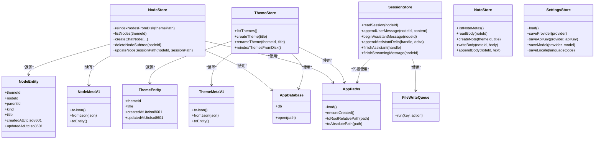
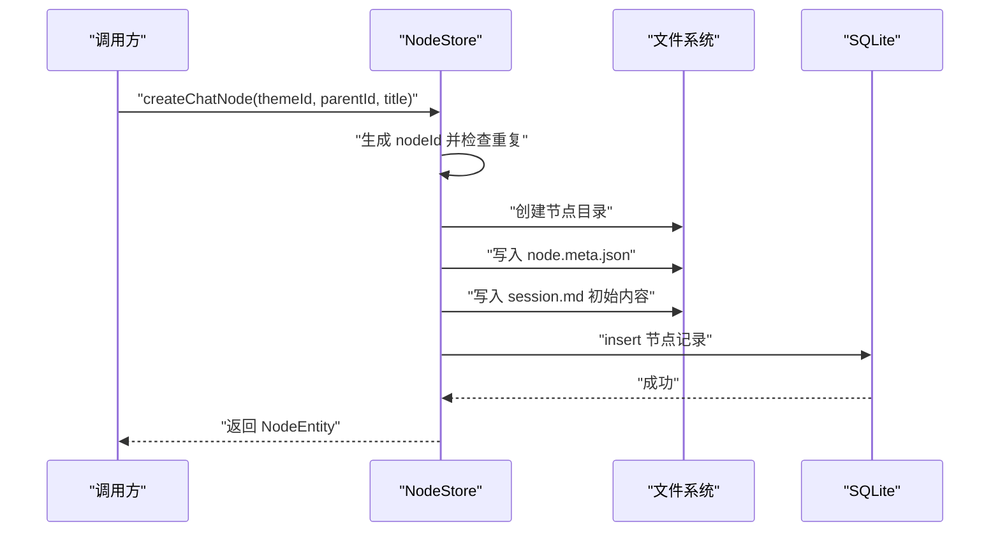
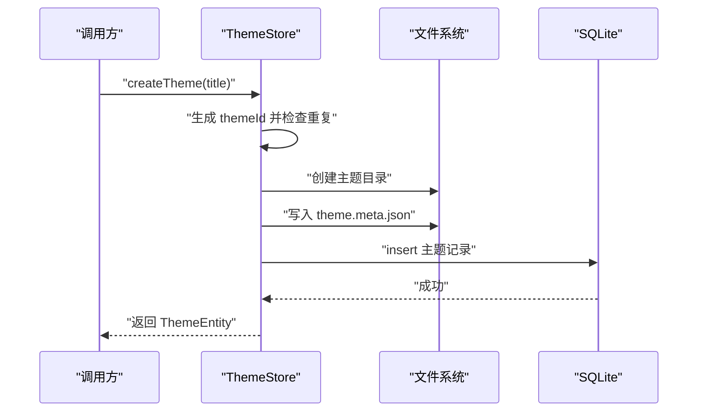
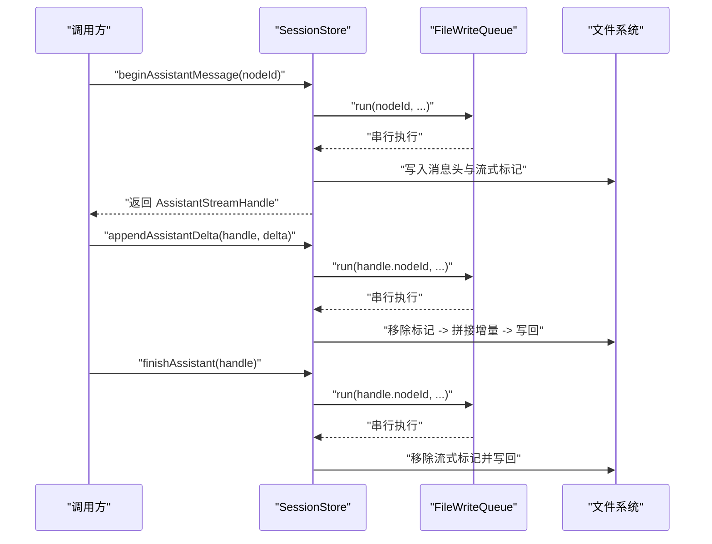
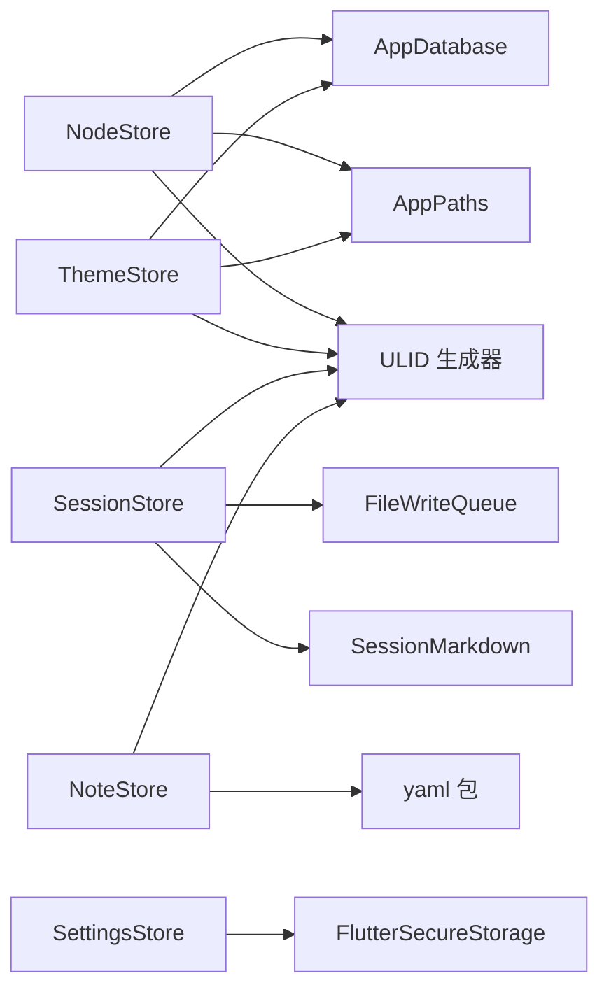

# 数据层架构

<cite>
**本文引用的文件**
- [lib/main.dart](file://lib/main.dart)
- [lib/data/stores/node_store.dart](file://lib/data/stores/node_store.dart)
- [lib/data/stores/session_store.dart](file://lib/data/stores/session_store.dart)
- [lib/data/stores/note_store.dart](file://lib/data/stores/note_store.dart)
- [lib/data/stores/theme_store.dart](file://lib/data/stores/theme_store.dart)
- [lib/data/services/app_database.dart](file://lib/data/services/app_database.dart)
- [lib/data/services/settings_store.dart](file://lib/data/services/settings_store.dart)
- [lib/data/services/file_write_queue.dart](file://lib/data/services/file_write_queue.dart)
- [lib/data/services/session_markdown.dart](file://lib/data/services/session_markdown.dart)
- [lib/data/models/node_meta.dart](file://lib/data/models/node_meta.dart)
- [lib/data/models/theme_meta.dart](file://lib/data/models/theme_meta.dart)
- [lib/domain/ids.dart](file://lib/domain/ids.dart)
- [lib/domain/node.dart](file://lib/domain/node.dart)
- [lib/domain/theme.dart](file://lib/domain/theme.dart)
- [lib/ui/core/app_paths.dart](file://lib/ui/core/app_paths.dart)
</cite>

## 目录
1. [引言](#引言)
2. [项目结构](#项目结构)
3. [核心组件](#核心组件)
4. [架构总览](#架构总览)
5. [详细组件分析](#详细组件分析)
6. [依赖分析](#依赖分析)
7. [性能考虑](#性能考虑)
8. [故障排查指南](#故障排查指南)
9. [结论](#结论)
10. [附录](#附录)

## 引言
本文件系统性梳理 ThkTree 的数据层架构，重点围绕 Repository 模式在应用中的落地与演进，解释数据访问接口的设计、具体实现类之间的关系，以及数据存储抽象层（NodeStore、SessionStore、SettingsStore 等）的职责与交互。同时，文档阐述数据模型的设计原则（实体关系映射与数据验证）、数据缓存策略与一致性保障机制，并给出扩展与性能优化的最佳实践。

## 项目结构
数据层位于 lib/data 目录下，按“服务层（services）+ 存储层（stores）+ 模型（models）”组织，配合领域层（domain）与基础设施（ui/core）协同工作。入口在 lib/main.dart 中初始化路径与设置存储，随后通过 Riverpod 提供者注入到 UI 层。

```mermaid
graph TB
subgraph "应用入口"
M["lib/main.dart<br/>应用启动与依赖注入"]
end
subgraph "数据层"
subgraph "服务层"
SDB["lib/data/services/app_database.dart<br/>SQLite 打开与建表"]
SS["lib/data/services/settings_store.dart<br/>应用设置安全存储"]
FQ["lib/data/services/file_write_queue.dart<br/>文件写入串行队列"]
SM["lib/data/services/session_markdown.dart<br/>会话 Markdown 解析/格式化"]
end
subgraph "存储层"
NS["lib/data/stores/node_store.dart<br/>节点 CRUD/索引/目录解析"]
TS["lib/data/stores/theme_store.dart<br/>主题 CRUD/索引"]
SES["lib/data/stores/session_store.dart<br/>会话读写/流式写入"]
NTS["lib/data/stores/note_store.dart<br/>笔记元数据/正文读写"]
end
subgraph "模型层"
NM["lib/data/models/node_meta.dart<br/>节点元数据 V1"]
TM["lib/data/models/theme_meta.dart<br/>主题元数据 V1"]
end
subgraph "领域层"
IDS["lib/domain/ids.dart<br/>ID 生成器"]
DN["lib/domain/node.dart<br/>NodeKind/NodeEntity"]
DT["lib/domain/theme.dart<br/>ThemeEntity"]
end
subgraph "基础设施"
AP["lib/ui/core/app_paths.dart<br/>应用路径/相对/绝对路径转换"]
end
end
M --> SS
M --> AP
M --> SDB
NS --> SDB
TS --> SDB
SES --> SM
SES --> FQ
NS --> AP
TS --> AP
NS --> NM
TS --> TM
NS --> IDS
TS --> IDS
SES --> IDS
NTS --> IDS
```

图表来源
- [lib/main.dart:15-59](file://lib/main.dart#L15-L59)
- [lib/data/services/app_database.dart:8-46](file://lib/data/services/app_database.dart#L8-L46)
- [lib/data/stores/node_store.dart:12-375](file://lib/data/stores/node_store.dart#L12-L375)
- [lib/data/stores/theme_store.dart:11-140](file://lib/data/stores/theme_store.dart#L11-L140)
- [lib/data/stores/session_store.dart:8-205](file://lib/data/stores/session_store.dart#L8-L205)
- [lib/data/stores/note_store.dart:53-151](file://lib/data/stores/note_store.dart#L53-L151)
- [lib/data/services/session_markdown.dart:49-223](file://lib/data/services/session_markdown.dart#L49-L223)
- [lib/data/services/file_write_queue.dart:1-12](file://lib/data/services/file_write_queue.dart#L1-L12)
- [lib/data/models/node_meta.dart:5-83](file://lib/data/models/node_meta.dart#L5-L83)
- [lib/data/models/theme_meta.dart:5-61](file://lib/data/models/theme_meta.dart#L5-L61)
- [lib/domain/ids.dart:1-10](file://lib/domain/ids.dart#L1-L10)
- [lib/domain/node.dart:1-30](file://lib/domain/node.dart#L1-L30)
- [lib/domain/theme.dart:1-15](file://lib/domain/theme.dart#L1-L15)
- [lib/ui/core/app_paths.dart:29-75](file://lib/ui/core/app_paths.dart#L29-L75)

章节来源
- [lib/main.dart:15-59](file://lib/main.dart#L15-L59)
- [lib/data/services/app_database.dart:8-46](file://lib/data/services/app_database.dart#L8-L46)

## 核心组件
- Repository 模式实现
  - NodeStore：负责节点的创建、查询、删除子树、从磁盘重建索引、目录解析与路径映射等，是节点数据的仓储实现。
  - ThemeStore：负责主题的创建、重命名、列出、从磁盘重建索引等，是主题数据的仓储实现。
  - SessionStore：负责会话文档的读取、追加用户/助手消息、流式写入与结束标记处理，确保并发写入有序。
  - NoteStore：负责笔记元数据与正文的读取、创建、更新，采用 YAML frontmatter 的纯文本文件存储。
  - SettingsStore：负责应用设置（语言、LLM 提供商与模型、API Key 等）的安全存储与加载。
- 抽象与接口
  - 数据库抽象：AppDatabase 封装 SQLite 打开、版本迁移与建表逻辑，为 NodeStore/ThemeStore 提供统一的数据持久化能力。
  - 文件写入抽象：FileWriteQueue 为 SessionStore 提供基于 nodeId 的串行化写入队列，避免并发写冲突。
  - 路径抽象：AppPaths 提供根目录、主题目录、日志目录、临时目录与数据库文件路径管理，并支持相对/绝对路径转换。
- 数据模型
  - NodeMetaV1/ThemeMetaV1：定义磁盘上元数据文件的结构与序列化/反序列化规则，包含 schema 版本与时间戳字段。
  - NodeEntity/ThemeEntity：领域层实体，用于跨层传递与业务逻辑使用。
  - ID 生成：统一使用 ULID 前缀命名空间（主题、节点、笔记、消息、请求），确保全局唯一性与可读性。

章节来源
- [lib/data/stores/node_store.dart:12-375](file://lib/data/stores/node_store.dart#L12-L375)
- [lib/data/stores/theme_store.dart:11-140](file://lib/data/stores/theme_store.dart#L11-L140)
- [lib/data/stores/session_store.dart:8-205](file://lib/data/stores/session_store.dart#L8-L205)
- [lib/data/stores/note_store.dart:53-151](file://lib/data/stores/note_store.dart#L53-L151)
- [lib/data/services/app_database.dart:8-46](file://lib/data/services/app_database.dart#L8-L46)
- [lib/data/services/file_write_queue.dart:1-12](file://lib/data/services/file_write_queue.dart#L1-L12)
- [lib/ui/core/app_paths.dart:29-75](file://lib/ui/core/app_paths.dart#L29-L75)
- [lib/data/models/node_meta.dart:5-83](file://lib/data/models/node_meta.dart#L5-L83)
- [lib/data/models/theme_meta.dart:5-61](file://lib/data/models/theme_meta.dart#L5-L61)
- [lib/domain/ids.dart:1-10](file://lib/domain/ids.dart#L1-L10)
- [lib/domain/node.dart:1-30](file://lib/domain/node.dart#L1-L30)
- [lib/domain/theme.dart:1-15](file://lib/domain/theme.dart#L1-L15)

## 架构总览
数据层采用“服务层 + 存储层 + 模型层”的分层设计，结合领域层与基础设施层，形成清晰的职责边界：

图表来源
- [lib/data/stores/node_store.dart:12-375](file://lib/data/stores/node_store.dart#L12-L375)
- [lib/data/stores/theme_store.dart:11-140](file://lib/data/stores/theme_store.dart#L11-L140)
- [lib/data/stores/session_store.dart:8-205](file://lib/data/stores/session_store.dart#L8-L205)
- [lib/data/stores/note_store.dart:53-151](file://lib/data/stores/note_store.dart#L53-L151)
- [lib/data/services/app_database.dart:8-46](file://lib/data/services/app_database.dart#L8-L46)
- [lib/data/services/file_write_queue.dart:1-12](file://lib/data/services/file_write_queue.dart#L1-L12)
- [lib/ui/core/app_paths.dart:29-75](file://lib/ui/core/app_paths.dart#L29-L75)
- [lib/data/models/node_meta.dart:5-83](file://lib/data/models/node_meta.dart#L5-L83)
- [lib/data/models/theme_meta.dart:5-61](file://lib/data/models/theme_meta.dart#L5-L61)
- [lib/domain/node.dart:10-28](file://lib/domain/node.dart#L10-L28)
- [lib/domain/theme.dart:1-13](file://lib/domain/theme.dart#L1-L13)

## 详细组件分析

### NodeStore：节点数据仓储
- 职责
  - 节点 CRUD：创建聊天节点、列出主题内节点、删除节点子树。
  - 磁盘索引重建：扫描主题 nodes 目录，与数据库进行比对，删除多余记录或补充缺失记录。
  - 目录解析与路径映射：根据数据库记录或磁盘状态解析节点目录，支持相对/绝对路径转换。
  - 元数据与会话文件：原子写入 node.meta.json 与 session.md，维护 nodePath/sessionPath 字段。
- 关键流程
  - 创建节点：生成唯一 nodeId，创建目录，写入元数据与初始会话，插入数据库。
  - 删除子树：收集子树节点 ID，删除对应目录与数据库记录，触发重新索引。
  - 重建索引：遍历 nodes 目录，读取 node.meta.json，与数据库比对后批量更新。
- 一致性与错误处理
  - 使用事务批量更新，保证索引一致性。
  - 对异常节点（缺少元数据或格式错误）进行跳过处理，避免影响整体索引。
  - 未找到主题/节点时抛出明确错误，便于上层捕获与提示。

图表来源
- [lib/data/stores/node_store.dart:112-204](file://lib/data/stores/node_store.dart#L112-L204)

章节来源
- [lib/data/stores/node_store.dart:12-375](file://lib/data/stores/node_store.dart#L12-L375)

### ThemeStore：主题数据仓储
- 职责
  - 主题 CRUD：创建主题（含目录与元数据文件）、重命名、列出。
  - 磁盘索引重建：扫描主题目录，读取 theme.meta.json，重建 themes 表。
- 一致性与错误处理
  - 使用唯一主题 ID 与目录名保持一致，防止冲突。
  - 重命名时更新元数据文件与数据库字段，确保前后端一致。

图表来源
- [lib/data/stores/theme_store.dart:31-80](file://lib/data/stores/theme_store.dart#L31-L80)

章节来源
- [lib/data/stores/theme_store.dart:11-140](file://lib/data/stores/theme_store.dart#L11-L140)

### SessionStore：会话数据仓储
- 职责
  - 读取会话：解析 session.md 的 frontmatter 与消息块，返回 SessionDocument。
  - 写入会话：追加用户/助手消息；支持流式写入（begin/append/delta/finish/fail）。
  - 并发控制：通过 FileWriteQueue 保证同一 nodeId 的写入串行化。
- 流式写入流程
  - 开始助手消息：在文件末尾写入消息头与流式标记。
  - 追加增量：移除流式标记后拼接增量，再写回文件。
  - 结束/失败：移除流式标记，写入结束或错误标记。
- 一致性与错误处理
  - 使用原子写入（tmp + rename）避免部分写入。
  - 未找到文件时返回空会话文档，兼容新会话场景。

图表来源
- [lib/data/stores/session_store.dart:84-131](file://lib/data/stores/session_store.dart#L84-L131)
- [lib/data/services/file_write_queue.dart:4-9](file://lib/data/services/file_write_queue.dart#L4-L9)

章节来源
- [lib/data/stores/session_store.dart:8-205](file://lib/data/stores/session_store.dart#L8-L205)
- [lib/data/services/session_markdown.dart:49-223](file://lib/data/services/session_markdown.dart#L49-L223)
- [lib/data/services/file_write_queue.dart:1-12](file://lib/data/services/file_write_queue.dart#L1-L12)

### NoteStore：笔记数据仓储
- 职责
  - 列出笔记元数据：扫描笔记目录，解析 frontmatter，按更新时间排序。
  - 读取/写入正文：支持读取正文、创建空白笔记、写入正文并更新 updatedAt。
  - 正文拼接：在现有正文基础上追加内容，自动维护 frontmatter。
- 设计要点
  - 采用 YAML frontmatter + 正文的纯文本文件结构，便于版本控制与人类可读。
  - frontmatter 解析与转义处理，保证字段类型与特殊字符安全。

章节来源
- [lib/data/stores/note_store.dart:53-151](file://lib/data/stores/note_store.dart#L53-L151)

### SettingsStore：设置数据仓储
- 职责
  - 加载设置：从安全存储读取语言、LLM 提供商、各提供商 API Key 与模型。
  - 保存设置：提供覆盖保存方法，支持清空（删除）。
- 安全性
  - 使用 FlutterSecureStorage 存储敏感信息（API Key）。
- 配置聚合
  - AppSettings 聚合当前选择的提供商与模型，提供便捷访问器。

章节来源
- [lib/data/services/settings_store.dart:106-184](file://lib/data/services/settings_store.dart#L106-L184)

### 数据模型与验证
- NodeMetaV1/ThemeMetaV1
  - schema 字段用于版本识别与反序列化校验。
  - fromJson 中对未知 schema 与字段缺失进行显式异常抛出，确保数据完整性。
  - toEntity 将磁盘元数据映射为领域实体，便于跨层使用。
- NodeEntity/ThemeEntity
  - 领域层实体，承载业务语义字段，避免直接暴露存储细节。

章节来源
- [lib/data/models/node_meta.dart:5-83](file://lib/data/models/node_meta.dart#L5-L83)
- [lib/data/models/theme_meta.dart:5-61](file://lib/data/models/theme_meta.dart#L5-L61)
- [lib/domain/node.dart:10-28](file://lib/domain/node.dart#L10-L28)
- [lib/domain/theme.dart:1-13](file://lib/domain/theme.dart#L1-L13)

### 数据库与索引
- AppDatabase
  - 打开 SQLite，创建 themes 与 nodes 表，建立复合索引 idx_nodes_theme_parent。
  - 支持版本升级回调，确保 schema 一致性。
- NodeStore/ThemeStore
  - 通过事务批量更新，减少碎片与锁竞争。
  - 重建索引时先清空再批量插入，保证与磁盘状态一致。

章节来源
- [lib/data/services/app_database.dart:20-46](file://lib/data/services/app_database.dart#L20-L46)
- [lib/data/stores/node_store.dart:26-58](file://lib/data/stores/node_store.dart#L26-L58)
- [lib/data/stores/theme_store.dart:122-139](file://lib/data/stores/theme_store.dart#L122-L139)

## 依赖分析
- 组件耦合
  - NodeStore/ThemeStore 依赖 AppDatabase 与 AppPaths，形成稳定的基础设施依赖。
  - SessionStore 依赖 FileWriteQueue 与 SessionMarkdown，确保并发与格式正确性。
  - NoteStore 依赖文件系统与 YAML 解析工具，独立于数据库。
  - SettingsStore 依赖 FlutterSecureStorage，集中管理敏感配置。
- 外部依赖
  - sqflite：本地数据库。
  - path_provider：获取应用文档目录。
  - yaml：解析/生成 frontmatter。
  - ulid：生成全局唯一标识符。

图表来源
- [lib/data/stores/node_store.dart:12-16](file://lib/data/stores/node_store.dart#L12-L16)
- [lib/data/stores/theme_store.dart:11-15](file://lib/data/stores/theme_store.dart#L11-L15)
- [lib/data/stores/session_store.dart:8-13](file://lib/data/stores/session_store.dart#L8-L13)
- [lib/data/stores/note_store.dart:53-56](file://lib/data/stores/note_store.dart#L53-L56)
- [lib/data/services/settings_store.dart:106-109](file://lib/data/services/settings_store.dart#L106-L109)
- [lib/domain/ids.dart:1-10](file://lib/domain/ids.dart#L1-L10)

章节来源
- [lib/data/stores/node_store.dart:12-375](file://lib/data/stores/node_store.dart#L12-L375)
- [lib/data/stores/theme_store.dart:11-140](file://lib/data/stores/theme_store.dart#L11-L140)
- [lib/data/stores/session_store.dart:8-205](file://lib/data/stores/session_store.dart#L8-L205)
- [lib/data/stores/note_store.dart:53-151](file://lib/data/stores/note_store.dart#L53-L151)
- [lib/data/services/settings_store.dart:106-184](file://lib/data/services/settings_store.dart#L106-L184)

## 性能考虑
- 索引与查询
  - nodes 表已建立 (themeId, parentId) 复合索引，适合按主题与父子关系查询。
  - 建议在高频过滤字段上增加必要索引，如按 createdAt/updatedAt 排序时评估是否需要额外索引。
- 事务批处理
  - 重建索引与批量插入使用事务，显著降低写放大与锁竞争。
- 文件写入串行化
  - FileWriteQueue 以 nodeId 为键串行化写入，避免并发写导致的竞态与部分写。
- 原子写入
  - 所有文件写入均采用 tmp + rename 策略，确保一致性与可恢复性。
- I/O 优化
  - NodeStore/ThemeStore 在重建索引时一次性批量写入，减少多次往返。
  - SessionStore 在流式写入中尽量复用文件内容读取与拼接，避免重复解析。

[本节为通用性能建议，不直接分析具体文件]

## 故障排查指南
- “主题/节点未找到”
  - NodeStore/ThemeStore 在查询不到记录时抛出明确错误，检查数据库是否存在对应记录或是否已完成索引重建。
  - 参考：[lib/data/stores/node_store.dart:267-273](file://lib/data/stores/node_store.dart#L267-L273)，[lib/data/stores/theme_store.dart:84-87](file://lib/data/stores/theme_store.dart#L84-L87)
- “磁盘与数据库不一致”
  - 使用 reindexNodesFromDisk/reindexThemesFromDisk 同步磁盘与数据库。
  - 参考：[lib/data/stores/node_store.dart:18-59](file://lib/data/stores/node_store.dart#L18-L59)，[lib/data/stores/theme_store.dart:110-139](file://lib/data/stores/theme_store.dart#L110-L139)
- “会话流式写入未结束”
  - 确认 finishStreamingMessage/finishAssistant 是否被调用，检查文件末尾标记是否被移除。
  - 参考：[lib/data/stores/session_store.dart:66-82](file://lib/data/stores/session_store.dart#L66-L82)，[lib/data/stores/session_store.dart:117-131](file://lib/data/stores/session_store.dart#L117-L131)
- “文件写入失败或部分写入”
  - 检查 tmp + rename 是否成功，确认磁盘权限与空间。
  - 参考：[lib/data/stores/node_store.dart:408-413](file://lib/data/stores/node_store.dart#L408-L413)，[lib/data/stores/theme_store.dart:151-156](file://lib/data/stores/theme_store.dart#L151-L156)
- “设置加载为空”
  - 检查 FlutterSecureStorage 中对应 key 是否存在，必要时初始化默认值。
  - 参考：[lib/data/services/settings_store.dart:117-156](file://lib/data/services/settings_store.dart#L117-L156)

章节来源
- [lib/data/stores/node_store.dart:18-59](file://lib/data/stores/node_store.dart#L18-L59)
- [lib/data/stores/theme_store.dart:110-139](file://lib/data/stores/theme_store.dart#L110-L139)
- [lib/data/stores/session_store.dart:66-82](file://lib/data/stores/session_store.dart#L66-L82)
- [lib/data/stores/session_store.dart:117-131](file://lib/data/stores/session_store.dart#L117-L131)
- [lib/data/stores/node_store.dart:408-413](file://lib/data/stores/node_store.dart#L408-L413)
- [lib/data/stores/theme_store.dart:151-156](file://lib/data/stores/theme_store.dart#L151-L156)
- [lib/data/services/settings_store.dart:117-156](file://lib/data/services/settings_store.dart#L117-L156)

## 结论
ThkTree 的数据层以 Repository 模式为核心，结合 SQLite 与纯文本文件的混合存储策略，实现了主题、节点、会话与笔记的完整生命周期管理。通过 AppDatabase、AppPaths、FileWriteQueue 等基础设施组件，确保了数据一致性、并发安全与可维护性。模型层通过明确的 schema 与验证规则，提升了数据可靠性。未来可在查询热点字段上进一步完善索引策略，并持续优化文件 I/O 与事务粒度以提升吞吐量。

[本节为总结性内容，不直接分析具体文件]

## 附录
- 最佳实践
  - 新增实体时，优先定义对应的元数据模型与 schema，确保磁盘与内存结构一致。
  - 所有写操作使用事务或原子写入策略，避免部分写入。
  - 对外暴露的仓储方法应明确错误语义，便于上层统一处理。
  - 重构索引时先备份数据库，再执行重建，确保可回滚。
- 扩展建议
  - 引入只读快照或二级缓存（如内存 Map）加速热点查询。
  - 会话流式写入可引入背压与超时重试机制。
  - 设置项增多时，将敏感配置拆分为独立存储模块，增强可测试性。

[本节为通用建议，不直接分析具体文件]