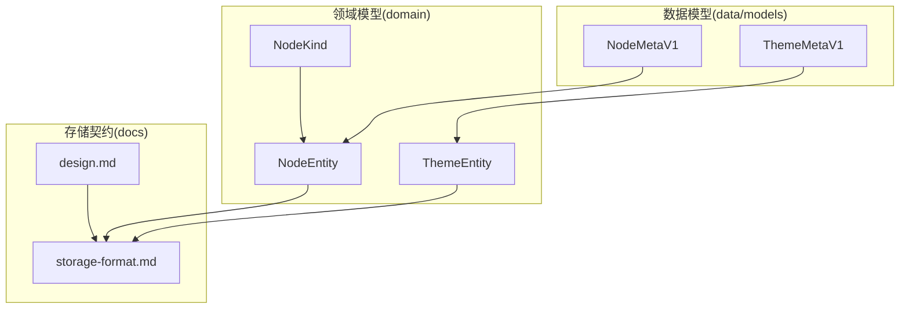
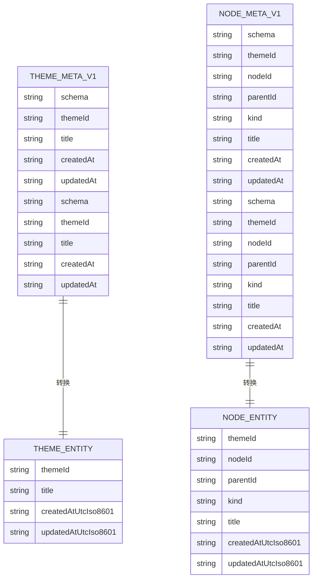
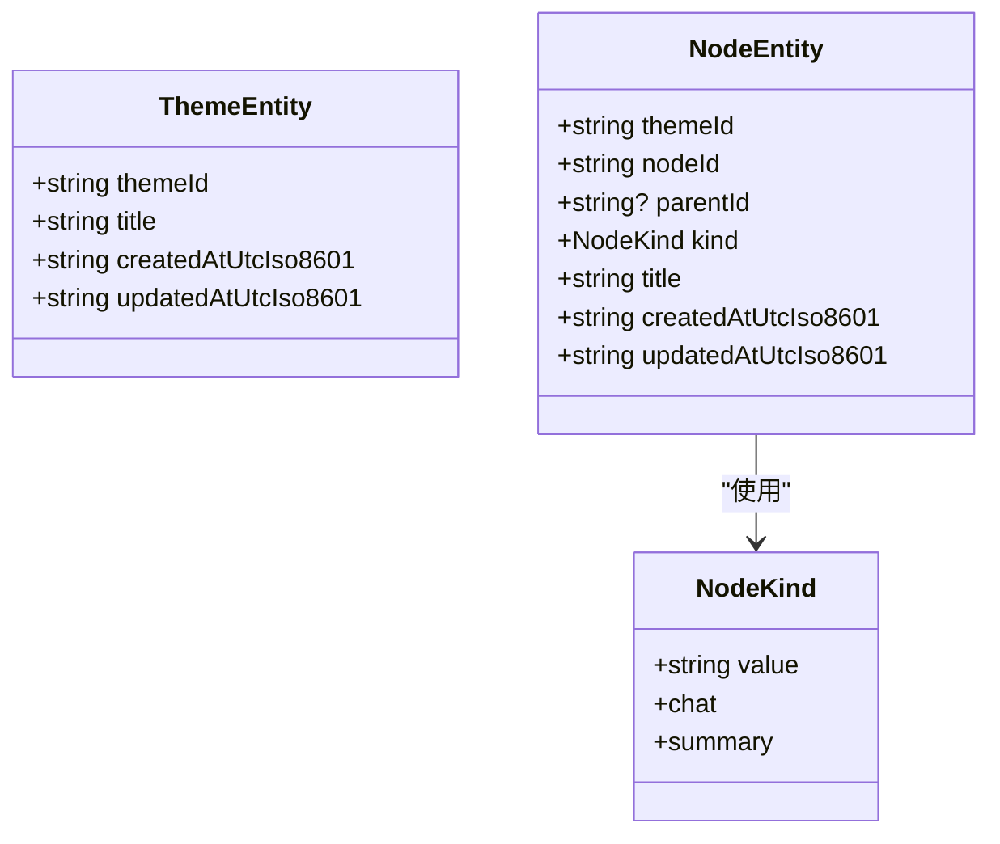
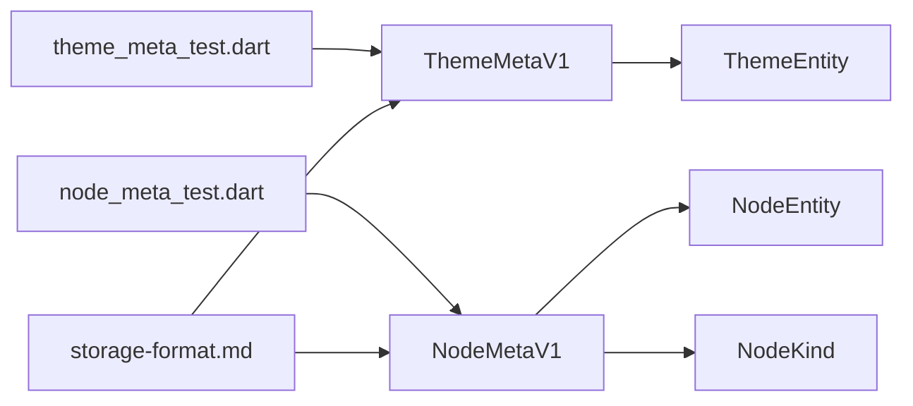

# 数据模型设计

<cite>
**本文引用的文件**
- [storage-format.md](file://docs/storage-format.md)
- [design.md](file://docs/design.md)
- [node_meta.dart](file://lib/data/models/node_meta.dart)
- [theme_meta.dart](file://lib/data/models/theme_meta.dart)
- [node.dart](file://lib/domain/node.dart)
- [theme.dart](file://lib/domain/theme.dart)
- [node_meta_test.dart](file://test/data/models/node_meta_test.dart)
- [theme_meta_test.dart](file://test/data/models/theme_meta_test.dart)
</cite>

## 目录
1. [简介](#简介)
2. [项目结构](#项目结构)
3. [核心组件](#核心组件)
4. [架构总览](#架构总览)
5. [详细组件分析](#详细组件分析)
6. [依赖分析](#依赖分析)
7. [性能考虑](#性能考虑)
8. [故障排查指南](#故障排查指南)
9. [结论](#结论)
10. [附录](#附录)

## 简介
本文件系统化阐述 ThkTree 的数据模型设计，聚焦于核心实体与版本化元数据模型，包括主题（Theme）、节点（Node）、会话（Session）与笔记（Note）等。文档基于权威存储契约与领域模型，说明字段定义、业务含义、实体关系映射、验证与业务规则、ID 生成策略、时间戳管理、数据完整性保障、版本演进与迁移策略，以及模型与存储格式的对应关系与持久化/检索抽象。

## 项目结构
- 数据模型与领域模型分层清晰：domain 层提供纯数据实体，data/models 层提供带版本的 JSON 元数据模型，二者通过显式的转换方法对齐。
- 存储契约由 docs/storage-format.md 定义，涵盖目录结构、文件格式、Schema 版本、ID 与时间格式、原子写入、流式与错误态、SQLite 索引与重建策略等。
- 设计文档 docs/design.md 明确模块边界、单写者契约、状态机、索引策略与迁移策略，确保实现端严格遵循。

图表来源
- [node_meta.dart:1-83](file://lib/data/models/node_meta.dart#L1-L83)
- [theme_meta.dart:1-61](file://lib/data/models/theme_meta.dart#L1-L61)
- [node.dart:1-30](file://lib/domain/node.dart#L1-L30)
- [theme.dart:1-15](file://lib/domain/theme.dart#L1-L15)
- [storage-format.md:1-350](file://docs/storage-format.md#L1-L350)
- [design.md:1-165](file://docs/design.md#L1-L165)

章节来源
- [storage-format.md:1-350](file://docs/storage-format.md#L1-L350)
- [design.md:1-165](file://docs/design.md#L1-L165)

## 核心组件
- 主题实体 ThemeEntity：包含主题标识、标题、创建与更新时间戳。
- 节点实体 NodeEntity：包含主题标识、节点标识、父节点标识（可空）、节点类型（chat/summary）、标题、创建与更新时间戳。
- 节点类型 NodeKind：通过受控枚举限定取值，确保类型安全。
- 节点元数据 NodeMetaV1：JSON 元数据模型，包含 schema 版本、主题/节点 ID、父子关系、类型、标题、时间戳，并提供 JSON 序列化/反序列化与实体转换。
- 主题元数据 ThemeMetaV1：JSON 元数据模型，包含 schema 版本、主题 ID、标题、时间戳，并提供 JSON 序列化/反序列化与实体转换。

章节来源
- [theme.dart:1-15](file://lib/domain/theme.dart#L1-L15)
- [node.dart:1-30](file://lib/domain/node.dart#L1-L30)
- [node_meta.dart:1-83](file://lib/data/models/node_meta.dart#L1-L83)
- [theme_meta.dart:1-61](file://lib/data/models/theme_meta.dart#L1-L61)

## 架构总览
数据模型与存储契约的映射关系如下：

图表来源
- [theme_meta.dart:5-59](file://lib/data/models/theme_meta.dart#L5-L59)
- [node_meta.dart:5-81](file://lib/data/models/node_meta.dart#L5-L81)
- [theme.dart:1-15](file://lib/domain/theme.dart#L1-L15)
- [node.dart:10-28](file://lib/domain/node.dart#L10-L28)

## 详细组件分析

### 主题元数据模型 ThemeMetaV1
- 字段与业务含义
  - schema：固定为主题元数据的版本标识，用于解析与迁移。
  - themeId：主题唯一标识，全局唯一，离线可生成。
  - title：主题标题，可修改。
  - createdAt/updatedAt：UTC ISO8601 时间戳，任何可见字段变化必须更新 updatedAt。
- 序列化/反序列化
  - toJson：输出包含 schema 与全部必要字段的映射。
  - fromJson：严格校验 schema 与字段类型，未知 schema 抛出格式异常；未知字段或类型缺失同样抛出异常。
- 实体转换
  - toEntity：转换为领域实体 ThemeEntity，供上层业务使用。
- 验证与业务规则
  - schema 固定值校验。
  - 字段类型严格校验。
  - 业务规则：createdAt/updatedAt 必须为 UTC ISO8601；任何可见字段变更需更新 updatedAt。

章节来源
- [theme_meta.dart:5-59](file://lib/data/models/theme_meta.dart#L5-L59)
- [theme_meta_test.dart:1-79](file://test/data/models/theme_meta_test.dart#L1-L79)
- [storage-format.md:75-94](file://docs/storage-format.md#L75-L94)

### 节点元数据模型 NodeMetaV1
- 字段与业务含义
  - schema：固定为节点元数据的版本标识。
  - themeId/nodeId：节点归属的主题与节点 ID，均需满足 ID 规则。
  - parentId：父节点 ID，可为空（根节点）。
  - kind：节点类型，限定为 chat 或 summary。
  - title：节点标题，可修改。
  - createdAt/updatedAt：UTC ISO8601 时间戳。
- 序列化/反序列化
  - toJson：输出包含 schema 与全部必要字段的映射，kind 使用内部字符串值。
  - fromJson：严格校验 schema 与字段类型；kind 未知时抛出异常；schema 不匹配或字段缺失抛出异常。
- 实体转换
  - toEntity：转换为领域实体 NodeEntity，其中 kind 为受控枚举。
- 验证与业务规则
  - schema 固定值校验。
  - kind 受控枚举校验。
  - 业务规则：createdAt/updatedAt 必须为 UTC ISO8601；任何可见字段变更需更新 updatedAt。

章节来源
- [node_meta.dart:5-81](file://lib/data/models/node_meta.dart#L5-L81)
- [node_meta_test.dart:1-113](file://test/data/models/node_meta_test.dart#L1-L113)
- [storage-format.md:95-119](file://docs/storage-format.md#L95-L119)

### 领域实体 ThemeEntity 与 NodeEntity
- ThemeEntity
  - 字段：themeId、title、createdAtUtcIso8601、updatedAtUtcIso8601。
  - 用途：作为业务层纯数据载体，避免直接依赖 JSON 模型。
- NodeEntity
  - 字段：themeId、nodeId、parentId（可空）、kind（NodeKind）、title、createdAtUtcIso8601、updatedAtUtcIso8601。
  - 用途：承载节点树结构与元信息，配合 NodeKind 控制节点类型。
- 类关系图

图表来源
- [theme.dart:1-15](file://lib/domain/theme.dart#L1-L15)
- [node.dart:1-30](file://lib/domain/node.dart#L1-L30)

章节来源
- [theme.dart:1-15](file://lib/domain/theme.dart#L1-L15)
- [node.dart:1-30](file://lib/domain/node.dart#L1-L30)

### 实体关系映射与层次约束
- 层次关系
  - 主题（Theme）为根，节点（Node）隶属于主题；节点可有父节点，形成树形结构。
  - 会话（Session）存在于节点之下，作为对话正文真相源；笔记（Note）与上下文总结（Context Summary）与节点/主题关联。
- 约束条件
  - 目录结构与路径约束：主题、节点、笔记、会话文件的路径与命名严格遵循存储契约。
  - ID 约束：themeId、nodeId、noteId、msgId 等全局唯一且可离线生成，采用 ULID 前缀规范。
  - 时间戳约束：统一使用 UTC ISO8601；任何可见字段变化需更新 updatedAt。
  - Schema 版本约束：所有 JSON 文件使用 schema 字段标明版本，解析与写入需严格匹配。

章节来源
- [storage-format.md:14-37](file://docs/storage-format.md#L14-L37)
- [storage-format.md:52-62](file://docs/storage-format.md#L52-L62)
- [storage-format.md:47-51](file://docs/storage-format.md#L47-L51)

### 数据验证规则与业务规则
- JSON 元数据验证
  - schema 固定值校验；字段类型与数量校验；未知字段或类型缺失抛出格式异常。
  - NodeMetaV1 对 kind 进行受控枚举校验；ThemeMetaV1 对字段类型进行严格校验。
- 业务规则
  - 任何可见字段变化必须更新 updatedAt。
  - 会话流式与错误态：流式期间与错误态的消息块需满足特定标记与保留策略，确保崩溃后可解析。
  - 上下文总结 stale 规则：祖先链新增消息将导致相关子节点的总结过期标记。
- 并发与一致性
  - 单写者：同一节点的会话文件同时仅允许一个写入流程；实现可通过队列或锁保证顺序与一致性。
  - 原子写：覆盖写采用同目录临时文件后 rename 的原子替换；追加写需保证崩溃后可解析。

章节来源
- [node_meta_test.dart:62-90](file://test/data/models/node_meta_test.dart#L62-L90)
- [theme_meta_test.dart:35-60](file://test/data/models/theme_meta_test.dart#L35-L60)
- [storage-format.md:66-70](file://docs/storage-format.md#L66-L70)
- [design.md:49-58](file://docs/design.md#L49-L58)

### ID 生成策略与时间戳管理
- ID 生成
  - ULID（26 位 Crockford Base32，大写），前缀区分类型：thm_（主题）、nd_（节点）、nt_（笔记）、msg_（消息）、req_（请求）。
  - 全局唯一且可离线生成，便于排序与检索。
- 时间戳
  - 统一使用 UTC ISO8601；createdAt/updatedAt 必须更新。
  - 会话中消息块包含角色、时间戳与消息 ID，三者共同构成消息层级的唯一性与可追踪性。

章节来源
- [storage-format.md:52-62](file://docs/storage-format.md#L52-L62)
- [storage-format.md:47-51](file://docs/storage-format.md#L47-L51)

### 数据完整性与持久化抽象
- 真相源与索引分离
  - Markdown 文件为正文真相源；SQLite 仅做索引与检索加速，可随时删除并从磁盘重建。
  - 索引与磁盘对齐：对齐键包括 themeId、nodeId、noteId、msgId，并在 SQLite 中保存相应关系与定位信息。
- 写入与索引顺序
  - 建议先文件落盘，再更新索引；若索引失败，不影响正文落盘，允许后续重建修复。
- 模型抽象与持久化
  - NodeMetaV1/ThemeMetaV1 作为 JSON 元数据的稳定接口，负责与存储格式对齐；toEntity 方法将 JSON 元数据转换为领域实体，供业务层使用。
  - 会话与笔记的正文采用 Markdown 结构，结合 frontmatter 与消息块，确保可解析性与可索引性。

章节来源
- [storage-format.md:7-10](file://docs/storage-format.md#L7-L10)
- [storage-format.md:292-321](file://docs/storage-format.md#L292-L321)
- [design.md:93-108](file://docs/design.md#L93-L108)
- [node_meta.dart:70-80](file://lib/data/models/node_meta.dart#L70-L80)
- [theme_meta.dart:51-58](file://lib/data/models/theme_meta.dart#L51-L58)

### 版本演进与迁移策略
- 版本契约
  - 每种文件使用 schema: name/vN 明确版本；新增或变更格式需在存储契约文档中补充新版本定义。
- 迁移实现
  - 提供 vN -> v(N+1) 的迁移算法（磁盘与索引），并在实现中严格遵循。
- 触发策略
  - 启动时检测索引或文件 schema 版本不匹配时自动触发重建；亦可提供手动触发入口。

章节来源
- [storage-format.md:343-350](file://docs/storage-format.md#L343-L350)
- [design.md:156-165](file://docs/design.md#L156-L165)

### 数据模型与存储格式的对应关系
- 主题元数据
  - JSON 字段与 ThemeEntity 字段一一对应；schema 固定为 theme_meta/v1。
- 节点元数据
  - JSON 字段与 NodeEntity 字段一一对应；kind 通过 NodeKind 受控枚举映射；schema 固定为 node_meta/v1。
- 会话与笔记
  - 会话正文采用 Markdown frontmatter + 消息块结构；笔记采用 Markdown frontmatter + 正文；两者均与主题/节点 ID 对齐，支持搜索与索引。

章节来源
- [storage-format.md:75-119](file://docs/storage-format.md#L75-L119)
- [storage-format.md:122-221](file://docs/storage-format.md#L122-L221)
- [storage-format.md:261-281](file://docs/storage-format.md#L261-L281)

## 依赖分析
- 模型依赖
  - NodeMetaV1 依赖 NodeKind 与 NodeEntity；ThemeMetaV1 依赖 ThemeEntity。
  - 测试用例覆盖 JSON 往返、字段校验、异常分支与实体转换。
- 存储契约依赖
  - 所有模型严格遵循存储契约中的 schema、字段、ID、时间格式与目录结构约束。

图表来源
- [theme_meta.dart:5-59](file://lib/data/models/theme_meta.dart#L5-L59)
- [node_meta.dart:5-81](file://lib/data/models/node_meta.dart#L5-L81)
- [node.dart:1-30](file://lib/domain/node.dart#L1-L30)
- [theme.dart:1-15](file://lib/domain/theme.dart#L1-L15)
- [theme_meta_test.dart:1-79](file://test/data/models/theme_meta_test.dart#L1-L79)
- [node_meta_test.dart:1-113](file://test/data/models/node_meta_test.dart#L1-L113)
- [storage-format.md:1-350](file://docs/storage-format.md#L1-L350)

章节来源
- [node_meta_test.dart:1-113](file://test/data/models/node_meta_test.dart#L1-L113)
- [theme_meta_test.dart:1-79](file://test/data/models/theme_meta_test.dart#L1-L79)

## 性能考虑
- 索引策略
  - SQLite 建议使用 FTS5 存在搜索文本，若不可用则降级为 LIKE；索引内容包括节点树关系、消息预览、字符数与笔记来源等。
- 写入与索引顺序
  - 建议“先文件后索引”，若索引失败不阻断正文落盘，允许后续重建修复。
- 单写者与流式
  - 单节点写入队列避免并发冲突；流式期间 UI 禁止重复发送或排队提示，减少写入竞争。

章节来源
- [design.md:93-108](file://docs/design.md#L93-L108)
- [design.md:49-58](file://docs/design.md#L49-L58)

## 故障排查指南
- JSON 解析异常
  - schema 不匹配或字段缺失：检查存储契约版本与字段清单。
  - 字段类型错误：确认字段类型与取值范围（如 kind 的受控枚举）。
- 会话流式与错误态
  - 流式标记未移除或错误标记未替换：检查流式状态机与错误处理逻辑。
  - 重试策略：错误态消息块保留，重试需生成新的 assistant 消息块（新 msgId）。
- 索引重建
  - 删除/损坏 index.sqlite 后，按存储契约扫描磁盘重建索引；记录失败项并继续处理。

章节来源
- [node_meta_test.dart:62-90](file://test/data/models/node_meta_test.dart#L62-L90)
- [theme_meta_test.dart:35-60](file://test/data/models/theme_meta_test.dart#L35-L60)
- [design.md:111-123](file://docs/design.md#L111-L123)
- [storage-format.md:173-200](file://docs/storage-format.md#L173-L200)

## 结论
ThkTree 的数据模型以领域实体为核心，通过带版本的 JSON 元数据模型与权威存储契约对齐，确保了跨层一致性与可演进性。ID 生成、时间戳管理、原子写入与单写者契约共同保障了数据完整性与并发安全。通过明确的验证规则、状态机与重建策略，系统实现了从磁盘到索引的可靠持久化与检索抽象。

## 附录
- 关键流程：会话状态机（发送、开始流式、接收令牌、成功结束、错误结束与恢复）严格与存储契约一致，确保崩溃可恢复、错误可追溯。
- 模块边界：domain、storage、index、llm、state、ui 模块职责清晰，数据模型与存储契约作为跨层契约，确保实现端严格遵循。

章节来源
- [design.md:61-90](file://docs/design.md#L61-L90)
- [design.md:18-46](file://docs/design.md#L18-L46)