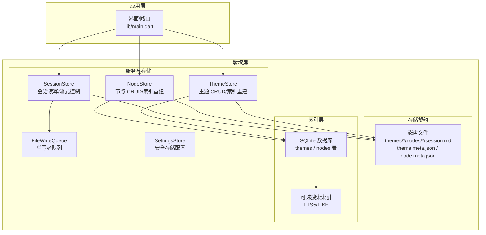
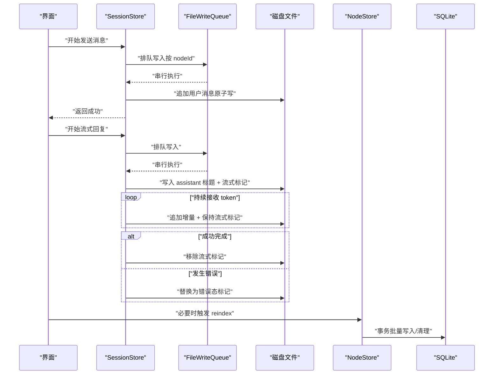
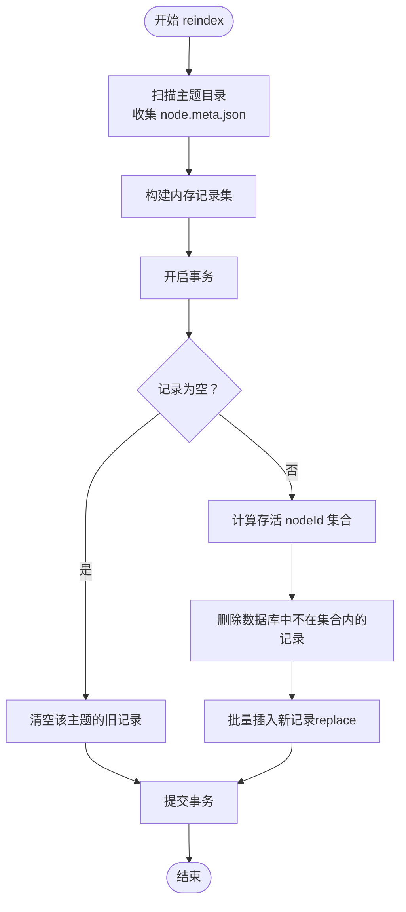
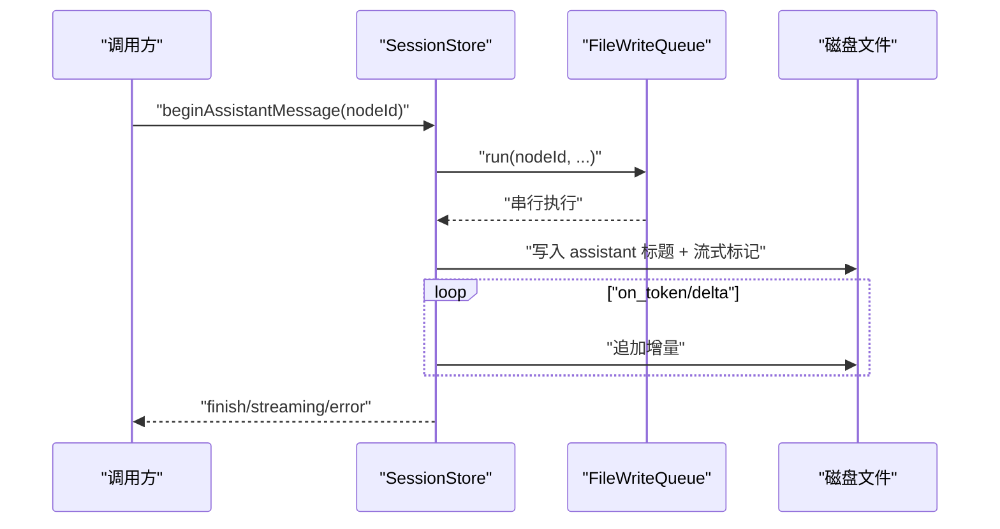
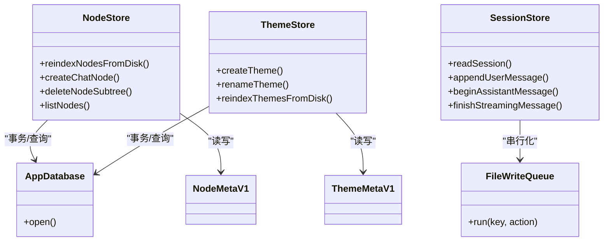

# 缓存策略

<cite>
**本文引用的文件**
- [lib/main.dart](file://lib/main.dart)
- [lib/data/services/app_database.dart](file://lib/data/services/app_database.dart)
- [lib/data/stores/node_store.dart](file://lib/data/stores/node_store.dart)
- [lib/data/stores/theme_store.dart](file://lib/data/stores/theme_store.dart)
- [lib/data/stores/session_store.dart](file://lib/data/stores/session_store.dart)
- [lib/data/services/file_write_queue.dart](file://lib/data/services/file_write_queue.dart)
- [lib/data/services/settings_store.dart](file://lib/data/services/settings_store.dart)
- [lib/data/models/node_meta.dart](file://lib/data/models/node_meta.dart)
- [lib/data/models/theme_meta.dart](file://lib/data/models/theme_meta.dart)
- [lib/domain/ids.dart](file://lib/domain/ids.dart)
- [lib/domain/node.dart](file://lib/domain/node.dart)
- [lib/domain/theme.dart](file://lib/domain/theme.dart)
- [docs/storage-format.md](file://docs/storage-format.md)
- [docs/design.md](file://docs/design.md)
</cite>

## 目录
1. [简介](#简介)
2. [项目结构](#项目结构)
3. [核心组件](#核心组件)
4. [架构总览](#架构总览)
5. [详细组件分析](#详细组件分析)
6. [依赖分析](#依赖分析)
7. [性能考虑](#性能考虑)
8. [故障排查指南](#故障排查指南)
9. [结论](#结论)
10. [附录](#附录)

## 简介
本文件系统化阐述 ThkTree 的缓存策略与数据层一致性设计，重点覆盖：
- 数据层的缓存架构：以磁盘为真相源，SQLite 作为可重建的索引层，不承担强一致性职责
- 缓存失效与一致性：基于“磁盘变更 + 数据库同步 + 主动重建索引”的策略
- 性能优化：懒加载、预加载、批量写入与串行化写入
- 与持久化的协调：原子写入、事务与崩溃恢复
- 监控与调试：日志埋点、路径解析回退、错误统计
- 故障恢复：索引重建、单写者约束、流式中间态与错误态

## 项目结构
ThkTree 的数据层采用“磁盘真相源 + SQLite 索引层”的双层结构，配合严格的写入契约与重建索引能力，确保在崩溃/断电等异常情况下仍可解析与恢复。

图示来源
- [lib/main.dart:15-59](file://lib/main.dart#L15-L59)
- [lib/data/stores/node_store.dart:12-59](file://lib/data/stores/node_store.dart#L12-L59)
- [lib/data/stores/theme_store.dart:11-139](file://lib/data/stores/theme_store.dart#L11-L139)
- [lib/data/stores/session_store.dart:8-169](file://lib/data/stores/session_store.dart#L8-L169)
- [lib/data/services/file_write_queue.dart:1-12](file://lib/data/services/file_write_queue.dart#L1-L12)
- [lib/data/services/app_database.dart:3-17](file://lib/data/services/app_database.dart#L3-L17)

章节来源
- [lib/main.dart:15-59](file://lib/main.dart#L15-L59)
- [docs/storage-format.md:1-350](file://docs/storage-format.md#L1-L350)
- [docs/design.md:1-165](file://docs/design.md#L1-L165)

## 核心组件
- NodeStore：负责节点的创建、删除、列表查询、磁盘到数据库的索引重建，以及路径解析与一致性维护
- ThemeStore：负责主题的创建、重命名、主题级索引重建
- SessionStore：负责会话文件的读取、追加、流式写入与错误态处理，并通过队列保证单写者
- FileWriteQueue：为每个 nodeId 提供串行化写入队列，确保同一文件的并发安全
- AppDatabase：SQLite 打开与初始化，提供事务与索引重建的数据库支撑
- SettingsStore：敏感配置的安全存储与读取
- 元数据模型：NodeMetaV1、ThemeMetaV1，用于磁盘元数据的读写与转换

章节来源
- [lib/data/stores/node_store.dart:12-414](file://lib/data/stores/node_store.dart#L12-L414)
- [lib/data/stores/theme_store.dart:11-157](file://lib/data/stores/theme_store.dart#L11-L157)
- [lib/data/stores/session_store.dart:8-205](file://lib/data/stores/session_store.dart#L8-L205)
- [lib/data/services/file_write_queue.dart:1-12](file://lib/data/services/file_write_queue.dart#L1-L12)
- [lib/data/services/app_database.dart:3-47](file://lib/data/services/app_database.dart#L3-L47)
- [lib/data/services/settings_store.dart:106-184](file://lib/data/services/settings_store.dart#L106-L184)
- [lib/data/models/node_meta.dart:5-83](file://lib/data/models/node_meta.dart#L5-L83)
- [lib/data/models/theme_meta.dart:5-61](file://lib/data/models/theme_meta.dart#L5-L61)

## 架构总览
ThkTree 的缓存策略遵循“磁盘真相源 + SQLite 索引层 + 单写者约束”的设计：
- 真相源：磁盘上的 Markdown 文件（session.md、theme.meta.json、node.meta.json）与笔记文件
- 索引层：SQLite 表 nodes/themes 作为可随时重建的索引，不承担强一致性职责
- 单写者：同一 nodeId 的写入通过队列串行化，避免竞态与中间态不一致
- 一致性：通过“数据库事务 + 磁盘原子写 + 索引重建”保障最终一致

图示来源
- [lib/data/stores/session_store.dart:17-169](file://lib/data/stores/session_store.dart#L17-L169)
- [lib/data/services/file_write_queue.dart:4-9](file://lib/data/services/file_write_queue.dart#L4-L9)
- [lib/data/stores/node_store.dart:18-59](file://lib/data/stores/node_store.dart#L18-L59)

## 详细组件分析

### NodeStore：节点索引与一致性
- 索引重建：从磁盘扫描 nodes/*/node.meta.json，构建 nodes 表，支持删除不存在的记录、批量插入
- 路径解析：根据数据库中的相对路径与 AppPaths 计算绝对路径，同时提供磁盘回退与校验
- 事务写入：批量更新/删除在事务中执行，保证原子性
- 一致性策略：磁盘为真相源，数据库仅作索引；当数据库路径与磁盘不一致时，回退到磁盘解析

图示来源
- [lib/data/stores/node_store.dart:18-59](file://lib/data/stores/node_store.dart#L18-L59)

章节来源
- [lib/data/stores/node_store.dart:18-110](file://lib/data/stores/node_store.dart#L18-L110)
- [lib/data/stores/node_store.dart:290-374](file://lib/data/stores/node_store.dart#L290-L374)
- [lib/data/models/node_meta.dart:39-81](file://lib/data/models/node_meta.dart#L39-L81)

### ThemeStore：主题索引与重命名
- 主题创建：生成主题目录与 theme.meta.json，写入数据库
- 重命名：更新磁盘元数据与数据库记录，保持 updatedAt 最新
- 主题级索引重建：扫描 themes/*/theme.meta.json，重建 themes 表

章节来源
- [lib/data/stores/theme_store.dart:31-108](file://lib/data/stores/theme_store.dart#L31-L108)
- [lib/data/stores/theme_store.dart:110-139](file://lib/data/stores/theme_store.dart#L110-L139)
- [lib/data/models/theme_meta.dart:30-59](file://lib/data/models/theme_meta.dart#L30-L59)

### SessionStore：流式写入与单写者
- 读取：根据 nodeId 获取 session.md 路径，解析为会话文档
- 写入：用户消息与助手消息追加写入，支持流式中间态与错误态
- 单写者：通过 FileWriteQueue 为每个 nodeId 维护串行队列，保证同一文件的并发安全
- 原子写：临时文件 + rename 实现原子替换，避免部分写入

图示来源
- [lib/data/stores/session_store.dart:84-131](file://lib/data/stores/session_store.dart#L84-L131)
- [lib/data/services/file_write_queue.dart:4-9](file://lib/data/services/file_write_queue.dart#L4-L9)

章节来源
- [lib/data/stores/session_store.dart:17-169](file://lib/data/stores/session_store.dart#L17-L169)
- [lib/data/services/file_write_queue.dart:1-12](file://lib/data/services/file_write_queue.dart#L1-L12)

### AppDatabase：索引层基础设施
- 打开数据库：指定版本号与回调，确保 schema 创建与索引表存在
- 事务封装：为 NodeStore/ThemeStore 的批量写入提供事务支持

章节来源
- [lib/data/services/app_database.dart:8-17](file://lib/data/services/app_database.dart#L8-L17)
- [lib/data/stores/node_store.dart:26-58](file://lib/data/stores/node_store.dart#L26-L58)
- [lib/data/stores/theme_store.dart:122-138](file://lib/data/stores/theme_store.dart#L122-L138)

### SettingsStore：安全配置与缓存
- 读取：从安全存储读取语言、LLM 提供商与模型等设置
- 写入：对空值进行删除，避免冗余键

章节来源
- [lib/data/services/settings_store.dart:117-183](file://lib/data/services/settings_store.dart#L117-L183)

## 依赖分析
- NodeStore/ThemeStore 依赖 AppDatabase 进行事务与索引写入
- SessionStore 依赖 FileWriteQueue 保证单写者，依赖磁盘文件进行真相源读写
- 元数据模型（NodeMetaV1/ThemeMetaV1）在磁盘与数据库之间转换
- ID 生成器（ULID）贯穿主题、节点、消息、请求 ID 的全局唯一性

图示来源
- [lib/data/stores/node_store.dart:12-414](file://lib/data/stores/node_store.dart#L12-L414)
- [lib/data/stores/theme_store.dart:11-157](file://lib/data/stores/theme_store.dart#L11-L157)
- [lib/data/stores/session_store.dart:8-205](file://lib/data/stores/session_store.dart#L8-L205)
- [lib/data/services/file_write_queue.dart:1-12](file://lib/data/services/file_write_queue.dart#L1-L12)
- [lib/data/services/app_database.dart:3-17](file://lib/data/services/app_database.dart#L3-L17)
- [lib/data/models/node_meta.dart:5-83](file://lib/data/models/node_meta.dart#L5-L83)
- [lib/data/models/theme_meta.dart:5-61](file://lib/data/models/theme_meta.dart#L5-L61)

## 性能考虑
- 懒加载与延迟解析
  - 会话读取时才解析 Markdown，避免不必要的 IO 与解析开销
  - 路径解析采用“数据库命中优先 + 磁盘回退”的策略，减少无效 IO
- 预加载与批量写入
  - 索引重建使用事务包裹批量插入/删除，降低写放大
  - 主题/节点列表查询按时间排序，利用数据库索引提升查询效率
- 单写者与串行化
  - FileWriteQueue 为每个 nodeId 维持串行队列，避免并发写入带来的锁竞争与中间态不一致
- 原子写与崩溃恢复
  - 临时文件 + rename 的原子写，确保崩溃后仍可解析（流式/错误态标记）
- I/O 优化
  - 仅在必要时触发 reindex（如路径不一致、首次启动检测缺失索引）

章节来源
- [lib/data/stores/session_store.dart:17-40](file://lib/data/stores/session_store.dart#L17-L40)
- [lib/data/stores/node_store.dart:86-110](file://lib/data/stores/node_store.dart#L86-L110)
- [lib/data/stores/node_store.dart:26-58](file://lib/data/stores/node_store.dart#L26-L58)
- [lib/data/stores/theme_store.dart:122-138](file://lib/data/stores/theme_store.dart#L122-L138)
- [docs/storage-format.md:66-70](file://docs/storage-format.md#L66-L70)

## 故障排查指南
- 路径不一致（Stale DB Path）
  - 现象：数据库记录的 sessionPath 不存在
  - 处理：回退到磁盘扫描与路径校验，必要时触发 reindex
  - 日志：包含 DB 命中/缺失、stale 标记等埋点
- 流式中间态与错误态
  - 现象：assistant 消息块末尾存在流式标记或错误标记
  - 处理：启动/进入节点时识别未完成块，提供重试入口
- 索引重建
  - 触发：启动检测到索引缺失或版本不匹配；或用户手动触发
  - 处理：扫描磁盘元数据，重建 nodes/themes 表，必要时重建搜索索引
- 单写者冲突
  - 现象：并发写入导致文件被占用
  - 处理：通过队列串行化，避免竞态；若出现异常，检查队列状态与文件锁

章节来源
- [lib/ui/core/app_services.dart:98-120](file://lib/ui/core/app_services.dart#L98-L120)
- [lib/data/stores/session_store.dart:66-82](file://lib/data/stores/session_store.dart#L66-L82)
- [lib/data/stores/node_store.dart:18-59](file://lib/data/stores/node_store.dart#L18-L59)
- [lib/data/stores/theme_store.dart:110-139](file://lib/data/stores/theme_store.dart#L110-L139)
- [docs/design.md:49-58](file://docs/design.md#L49-L58)

## 结论
ThkTree 的缓存策略以“磁盘真相源 + SQLite 索引层 + 单写者约束”为核心，强调：
- 真相源不可替代：磁盘文件为最终依据，索引层可随时重建
- 一致性通过流程与契约保障：事务、原子写、流式中间态与错误态、路径回退
- 性能通过懒加载、批量写入、串行化与预加载优化
- 故障通过索引重建、日志埋点与单写者约束快速恢复

## 附录
- 存储契约与状态机：参见存储格式与设计文档
- ID 生成：ULID，确保全局唯一与可排序
- 数据模型：NodeMetaV1/ThemeMetaV1，用于磁盘与数据库之间的转换

章节来源
- [docs/storage-format.md:1-350](file://docs/storage-format.md#L1-L350)
- [docs/design.md:1-165](file://docs/design.md#L1-L165)
- [lib/domain/ids.dart:3-10](file://lib/domain/ids.dart#L3-L10)
- [lib/domain/node.dart:1-30](file://lib/domain/node.dart#L1-L30)
- [lib/domain/theme.dart:1-15](file://lib/domain/theme.dart#L1-L15)