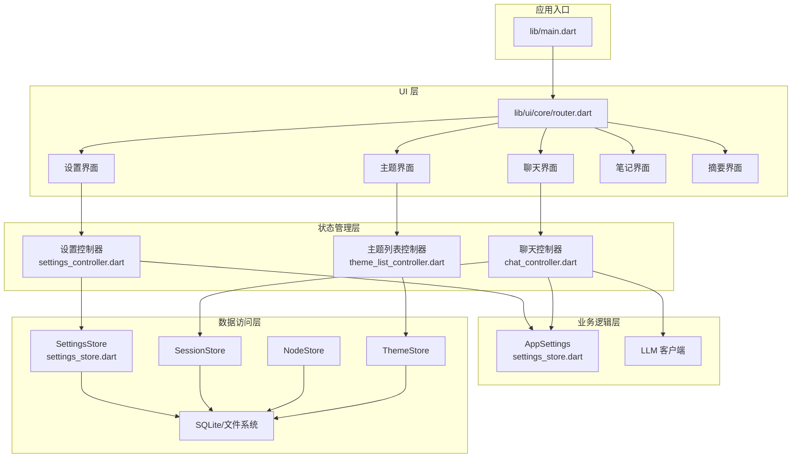
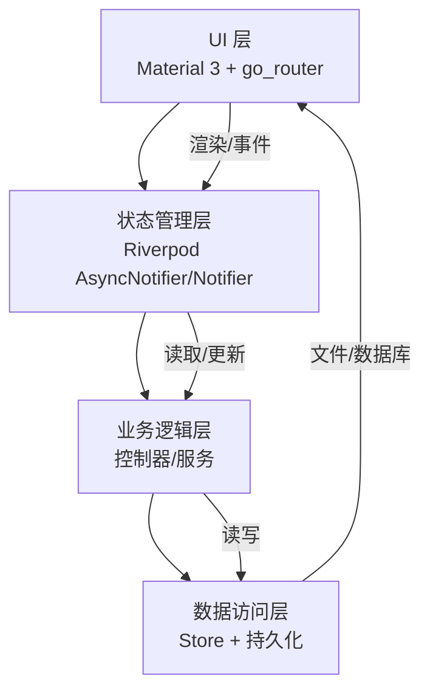
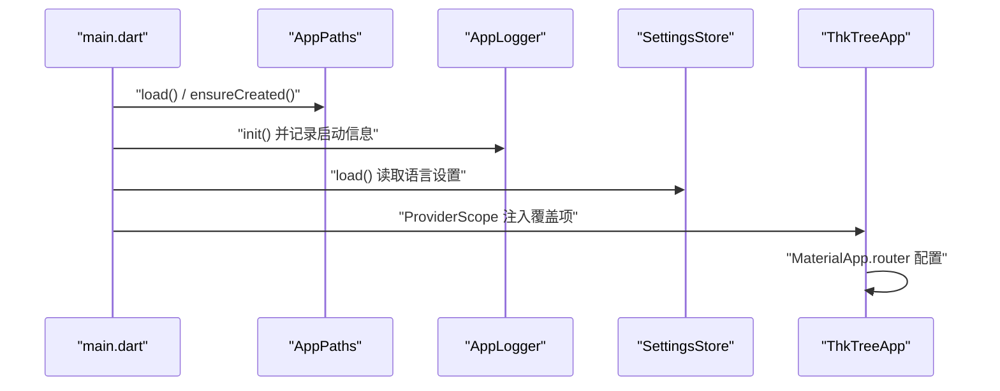
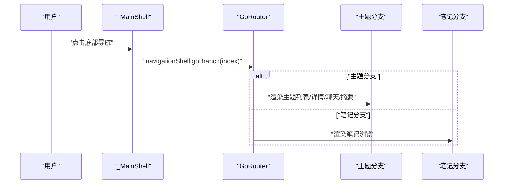
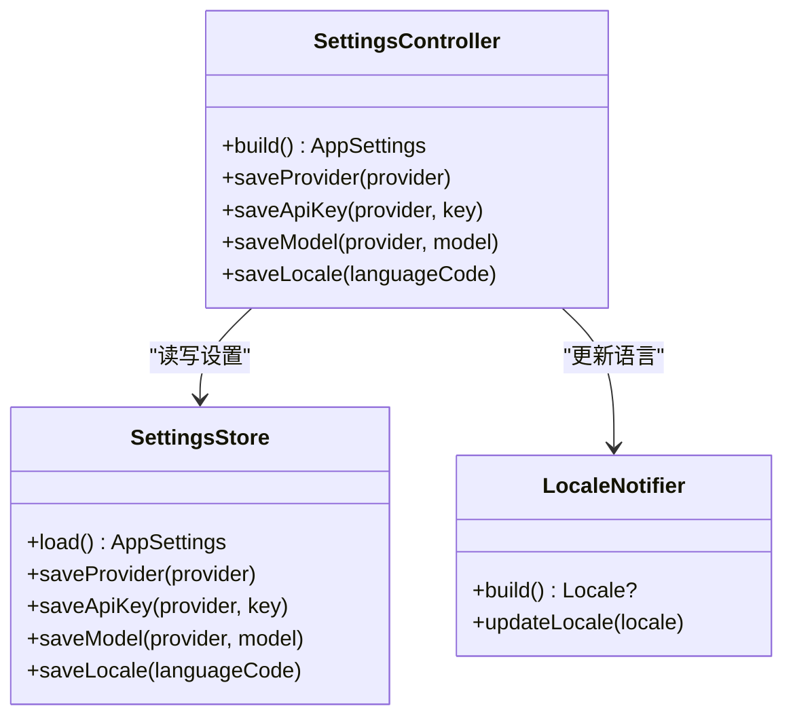
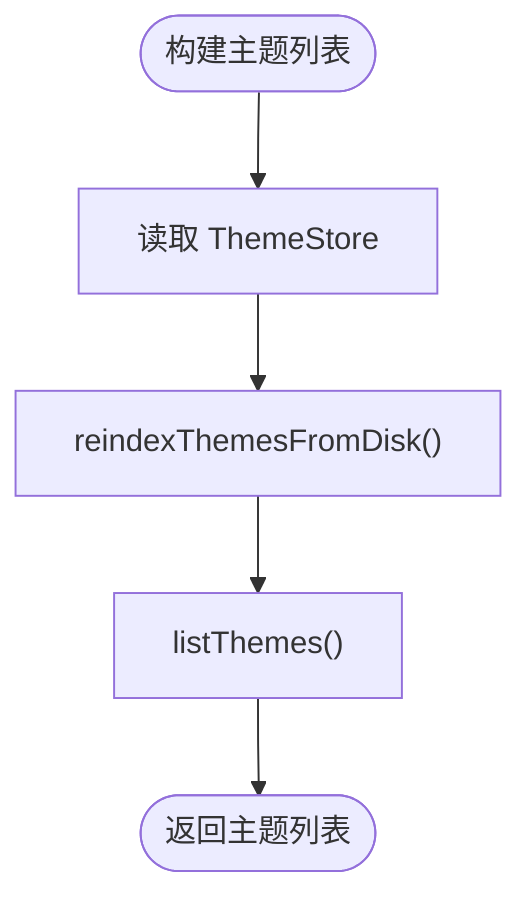
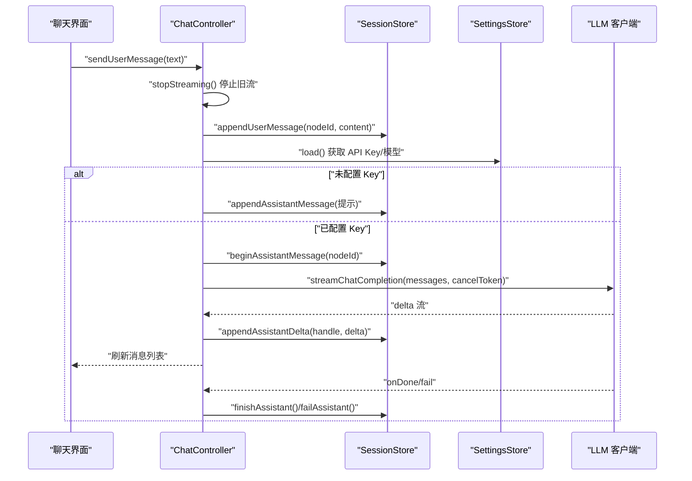
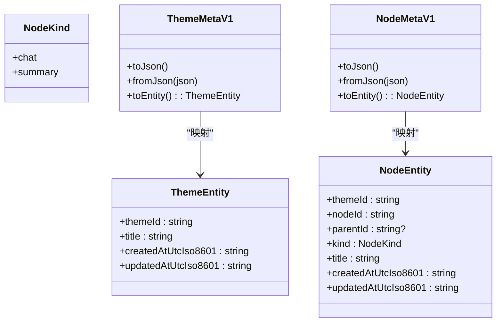
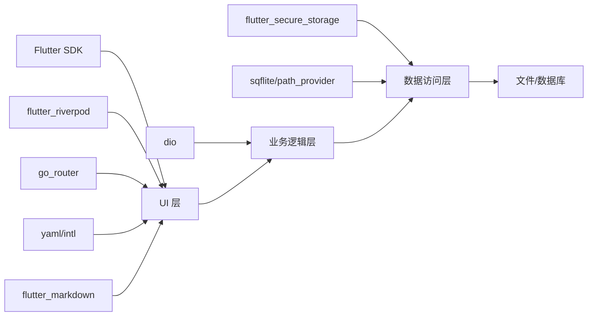

# 整体架构概览

<cite>
**本文档引用的文件**
- [README.md](file://README.md)
- [pubspec.yaml](file://pubspec.yaml)
- [lib/main.dart](file://lib/main.dart)
- [lib/ui/core/router.dart](file://lib/ui/core/router.dart)
- [lib/ui/features/settings/settings_controller.dart](file://lib/ui/features/settings/settings_controller.dart)
- [lib/ui/features/themes/theme_list_controller.dart](file://lib/ui/features/themes/theme_list_controller.dart)
- [lib/ui/features/chat/chat_controller.dart](file://lib/ui/features/chat/chat_controller.dart)
- [lib/data/services/settings_store.dart](file://lib/data/services/settings_store.dart)
- [lib/domain/node.dart](file://lib/domain/node.dart)
- [lib/domain/theme.dart](file://lib/domain/theme.dart)
- [lib/data/models/node_meta.dart](file://lib/data/models/node_meta.dart)
- [lib/data/models/theme_meta.dart](file://lib/data/models/theme_meta.dart)
</cite>

## 目录
1. [引言](#引言)
2. [项目结构](#项目结构)
3. [核心组件](#核心组件)
4. [架构总览](#架构总览)
5. [详细组件分析](#详细组件分析)
6. [依赖分析](#依赖分析)
7. [性能考虑](#性能考虑)
8. [故障排查指南](#故障排查指南)
9. [结论](#结论)
10. [附录](#附录)

## 引言
本文件为 ThkTree 应用的整体架构概览文档，聚焦于 MVVM 分层与模块化组织，阐述 UI 层、状态管理层、业务逻辑层与数据访问层的职责划分与交互关系，并解释技术栈选择（Flutter + Riverpod + go_router）的架构决策依据。同时提供系统边界、核心组件关系图与数据流向示意，记录架构演进线索与未来扩展方向。

## 项目结构
ThkTree 采用按“领域/功能”分层的模块化组织方式：
- lib/main.dart：应用入口，负责初始化路径、日志、错误处理、全局依赖注入与主题配置。
- lib/ui：用户界面层，包含路由、共享组件与各功能页面（聊天、笔记、主题、设置、摘要）。
- lib/domain：领域模型层，定义主题与节点等核心实体。
- lib/data：数据访问层，包含模型序列化/反序列化、服务（设置存储、数据库、会话存储等）、以及各 Store。

图表来源
- [lib/main.dart:15-59](file://lib/main.dart#L15-L59)
- [lib/ui/core/router.dart:18-87](file://lib/ui/core/router.dart#L18-L87)
- [lib/ui/features/settings/settings_controller.dart:7-39](file://lib/ui/features/settings/settings_controller.dart#L7-L39)
- [lib/ui/features/themes/theme_list_controller.dart:5-24](file://lib/ui/features/themes/theme_list_controller.dart#L5-L24)
- [lib/ui/features/chat/chat_controller.dart:18-216](file://lib/ui/features/chat/chat_controller.dart#L18-L216)
- [lib/data/services/settings_store.dart:106-184](file://lib/data/services/settings_store.dart#L106-L184)

章节来源
- [lib/main.dart:15-95](file://lib/main.dart#L15-L95)
- [pubspec.yaml:30-49](file://pubspec.yaml#L30-L49)

## 核心组件
- 应用入口与全局配置
  - 初始化路径、远程日志、错误捕获与全局 Provider 注入，统一对外暴露 Material 3 主题与本地化。
- 路由与导航
  - 使用 go_router 的 StatefulShellRoute 实现底部导航的多分支路由，主题与笔记两个主分支并行管理。
- 状态管理
  - Riverpod 提供 AsyncNotifier/Notifier，分别承载异步状态与简单状态，支持自动释放与跨组件共享。
- 领域模型
  - ThemeEntity、NodeEntity 及 NodeKind，抽象主题与节点概念，支撑 UI 与数据层一致性。
- 数据模型与持久化
  - NodeMetaV1/ThemeMetaV1 提供 JSON 兼容的元数据结构；SettingsStore 基于 flutter_secure_storage 存储敏感配置；底层依赖 SQLite/文件系统进行持久化。

章节来源
- [lib/main.dart:15-95](file://lib/main.dart#L15-L95)
- [lib/ui/core/router.dart:18-87](file://lib/ui/core/router.dart#L18-L87)
- [lib/ui/features/settings/settings_controller.dart:7-58](file://lib/ui/features/settings/settings_controller.dart#L7-L58)
- [lib/ui/features/themes/theme_list_controller.dart:5-28](file://lib/ui/features/themes/theme_list_controller.dart#L5-L28)
- [lib/ui/features/chat/chat_controller.dart:18-243](file://lib/ui/features/chat/chat_controller.dart#L18-L243)
- [lib/data/services/settings_store.dart:106-185](file://lib/data/services/settings_store.dart#L106-L185)
- [lib/domain/node.dart:1-30](file://lib/domain/node.dart#L1-L30)
- [lib/domain/theme.dart:1-15](file://lib/domain/theme.dart#L1-L15)
- [lib/data/models/node_meta.dart:5-83](file://lib/data/models/node_meta.dart#L5-L83)
- [lib/data/models/theme_meta.dart:5-61](file://lib/data/models/theme_meta.dart#L5-L61)

## 架构总览
ThkTree 采用 MVVM 分层与模块化设计：
- UI 层：基于 Flutter Material 3，通过 go_router 进行声明式路由与 Shell 导航，页面组件仅负责渲染与事件转发。
- 状态管理层：Riverpod AsyncNotifier/Notifier 承载业务状态与简单状态，解耦 UI 与数据流。
- 业务逻辑层：控制器封装业务流程（如聊天对话的发送、停止、流式输出），协调 Store 与外部服务。
- 数据访问层：Store 封装对 SettingsStore、SessionStore、NodeStore、ThemeStore 的读写，SettingsStore 使用安全存储，其他 Store 依赖文件系统/数据库。

技术选型理由
- Flutter：跨平台原生体验，热重载提升迭代效率，生态完善。
- Riverpod：类型安全、可测试性强、零样板代码的状态管理，适合复杂状态与依赖注入。
- go_router：声明式路由、Shell 导航、参数解析与错误处理一体化，契合底部导航与多分支场景。

图表来源
- [lib/main.dart:61-93](file://lib/main.dart#L61-L93)
- [lib/ui/core/router.dart:18-87](file://lib/ui/core/router.dart#L18-L87)
- [lib/ui/features/chat/chat_controller.dart:18-216](file://lib/ui/features/chat/chat_controller.dart#L18-L216)
- [lib/data/services/settings_store.dart:106-184](file://lib/data/services/settings_store.dart#L106-L184)

## 详细组件分析

### 组件一：应用启动与全局配置
- 职责
  - 初始化 AppPaths、AppLogger，注册 FlutterError 与 PlatformDispatcher 错误回调。
  - 读取 SettingsStore 中的保存语言，注入 ProviderScope，提供全局依赖（路径、日志、语言）。
  - 渲染 ThkTreeApp，配置本地化、主题与路由。
- 关键交互
  - ProviderScope 覆盖 appPathsProvider、appLoggerProvider、localeProvider，确保后续组件可直接消费。
  - MaterialApp.router 使用 appRouter，完成页面切换与导航栏联动。

图表来源
- [lib/main.dart:15-59](file://lib/main.dart#L15-L59)
- [lib/main.dart:61-93](file://lib/main.dart#L61-L93)

章节来源
- [lib/main.dart:15-95](file://lib/main.dart#L15-L95)

### 组件二：路由与导航（go_router）
- 职责
  - 定义 StatefulShellRoute 多分支：主题分支与笔记分支，底部导航切换分支。
  - 在分支内定义主题列表、主题详情、节点聊天、摘要对话等路由，支持路径参数与额外参数传递。
  - 提供错误页构建器，统一异常展示。
- 关键交互
  - MainShell 根据 navigationShell currentIndex 控制分支跳转。
  - 切换到笔记分支时触发版本计数器 bump，驱动列表刷新。

图表来源
- [lib/ui/core/router.dart:89-125](file://lib/ui/core/router.dart#L89-L125)
- [lib/ui/core/router.dart:18-87](file://lib/ui/core/router.dart#L18-L87)

章节来源
- [lib/ui/core/router.dart:18-126](file://lib/ui/core/router.dart#L18-L126)

### 组件三：设置控制器（SettingsController）
- 职责
  - AsyncNotifier 加载 AppSettings；提供保存 LLM 提供商、API Key、模型与语言的方法。
  - 更新语言时通过 NotifierProvider 的 LocaleNotifier 同步 UI 语言。
- 交互关系
  - 依赖 settingsStoreProvider 读写设置；保存后重新加载最新设置以更新状态。

图表来源
- [lib/ui/features/settings/settings_controller.dart:7-58](file://lib/ui/features/settings/settings_controller.dart#L7-L58)
- [lib/data/services/settings_store.dart:106-185](file://lib/data/services/settings_store.dart#L106-L185)

章节来源
- [lib/ui/features/settings/settings_controller.dart:7-58](file://lib/ui/features/settings/settings_controller.dart#L7-L58)
- [lib/data/services/settings_store.dart:106-185](file://lib/data/services/settings_store.dart#L106-L185)

### 组件四：主题列表控制器（ThemeListController）
- 职责
  - AsyncNotifier 加载主题列表；支持创建主题与从磁盘重建索引。
- 交互关系
  - 依赖 themeStoreProvider 进行主题列表读取与索引重建；更新状态后 UI 自动刷新。

图表来源
- [lib/ui/features/themes/theme_list_controller.dart:5-24](file://lib/ui/features/themes/theme_list_controller.dart#L5-L24)

章节来源
- [lib/ui/features/themes/theme_list_controller.dart:5-28](file://lib/ui/features/themes/theme_list_controller.dart#L5-L28)

### 组件五：聊天控制器（ChatController）
- 职责
  - AsyncNotifier 管理会话消息列表；支持发送用户消息、停止流式输出、监听 LLM 流并增量写入。
  - 生命周期内订阅/取消订阅流，处理取消与错误，最终完成或失败标记。
- 关键流程
  - 发送消息前停止当前流；若未配置 API Key 则提示；否则调用 LLM 客户端发起流式请求。
  - 监听增量内容写入会话存储，实时更新 UI；异常时记录日志并标记失败。

图表来源
- [lib/ui/features/chat/chat_controller.dart:111-216](file://lib/ui/features/chat/chat_controller.dart#L111-L216)
- [lib/data/services/settings_store.dart:117-156](file://lib/data/services/settings_store.dart#L117-L156)

章节来源
- [lib/ui/features/chat/chat_controller.dart:18-243](file://lib/ui/features/chat/chat_controller.dart#L18-L243)
- [lib/data/services/settings_store.dart:106-185](file://lib/data/services/settings_store.dart#L106-L185)

### 组件六：领域模型与数据模型
- 领域模型
  - ThemeEntity：主题标识、标题与时间戳。
  - NodeEntity：节点标识、父节点、类型（聊天/摘要）与标题、时间戳。
  - NodeKind：节点类型枚举。
- 数据模型
  - ThemeMetaV1/NodeMetaV1：JSON 兼容的元数据结构，支持 fromJson/toJson 与 toEntity 映射，便于持久化与迁移。

图表来源
- [lib/domain/theme.dart:1-15](file://lib/domain/theme.dart#L1-L15)
- [lib/domain/node.dart:1-30](file://lib/domain/node.dart#L1-L30)
- [lib/data/models/theme_meta.dart:5-61](file://lib/data/models/theme_meta.dart#L5-L61)
- [lib/data/models/node_meta.dart:5-83](file://lib/data/models/node_meta.dart#L5-L83)

章节来源
- [lib/domain/theme.dart:1-15](file://lib/domain/theme.dart#L1-L15)
- [lib/domain/node.dart:1-30](file://lib/domain/node.dart#L1-L30)
- [lib/data/models/theme_meta.dart:5-61](file://lib/data/models/theme_meta.dart#L5-L61)
- [lib/data/models/node_meta.dart:5-83](file://lib/data/models/node_meta.dart#L5-L83)

## 依赖分析
- 技术栈依赖
  - Flutter SDK、Material 3、go_router、flutter_riverpod、dio、flutter_secure_storage、sqflite、path_provider、yaml、intl、flutter_markdown 等。
- 内部模块依赖
  - UI 层依赖状态管理与路由；状态层依赖数据访问层；数据层依赖持久化与外部服务。
- 外部集成点
  - LLM 客户端通过 SettingsStore 中的 AppSettings 动态选择提供商与模型；日志通过 AppLogger 记录运行时信息与错误。

图表来源
- [pubspec.yaml:30-49](file://pubspec.yaml#L30-L49)

章节来源
- [pubspec.yaml:30-102](file://pubspec.yaml#L30-L102)

## 性能考虑
- 状态粒度与缓存
  - 使用 Riverpod AsyncNotifier 缓存异步结果，避免重复 IO；在 UI 层仅订阅必要 Provider，减少重建范围。
- 流式处理
  - ChatController 对 LLM 流式响应采用增量写入与状态刷新，降低一次性渲染压力；在 dispose 或切换时及时取消流。
- 路由与导航
  - go_router 的 StatefulShellRoute 保持分支状态，减少频繁重建；底部导航切换时仅切换分支根页面。
- 持久化策略
  - SettingsStore 使用安全存储保存敏感配置；其他 Store 通过文件系统/数据库进行批量写入与索引重建，避免阻塞主线程。

## 故障排查指南
- 日志与错误
  - 应用入口注册 FlutterError 与 PlatformDispatcher 错误回调，统一记录异常与堆栈；聊天控制器在关键步骤记录 info/error，便于定位问题。
- 常见问题
  - 未配置 API Key：聊天控制器在发送消息前检查 SettingsStore，若为空则插入提示消息；检查 SettingsStore 是否正确保存提供商与 Key。
  - 流中断或取消：监听 onError 分支处理网络取消与错误，标记失败并清理资源；确认 CancelToken 与订阅生命周期管理。
  - 语言切换无效：确认 SettingsController 已更新 LocaleNotifier，并触发 UI 重新构建。

章节来源
- [lib/main.dart:32-40](file://lib/main.dart#L32-L40)
- [lib/ui/features/chat/chat_controller.dart:134-139](file://lib/ui/features/chat/chat_controller.dart#L134-L139)
- [lib/ui/features/chat/chat_controller.dart:186-214](file://lib/ui/features/chat/chat_controller.dart#L186-L214)
- [lib/ui/features/settings/settings_controller.dart:32-38](file://lib/ui/features/settings/settings_controller.dart#L32-L38)

## 结论
ThkTree 通过 Flutter + Riverpod + go_router 的组合，实现了清晰的 MVVM 分层与模块化组织。UI 层专注渲染与交互，状态管理层承担数据与业务状态，业务逻辑层协调 Store 与外部服务，数据访问层屏蔽持久化细节。该架构具备良好的可维护性、可测试性与扩展性，适合持续演进与功能扩展。

## 附录
- 架构演进线索
  - 当前结构以功能模块（主题、聊天、笔记、设置、摘要）划分，路由采用 Shell 导航；未来可进一步细化领域服务与引入 Repository 模式以增强数据层抽象。
- 未来扩展方向
  - 引入统一的 Repository 接口，隔离具体 Store 实现；增加离线优先策略与冲突合并机制；完善单元测试与集成测试覆盖；引入国际化与主题系统扩展。