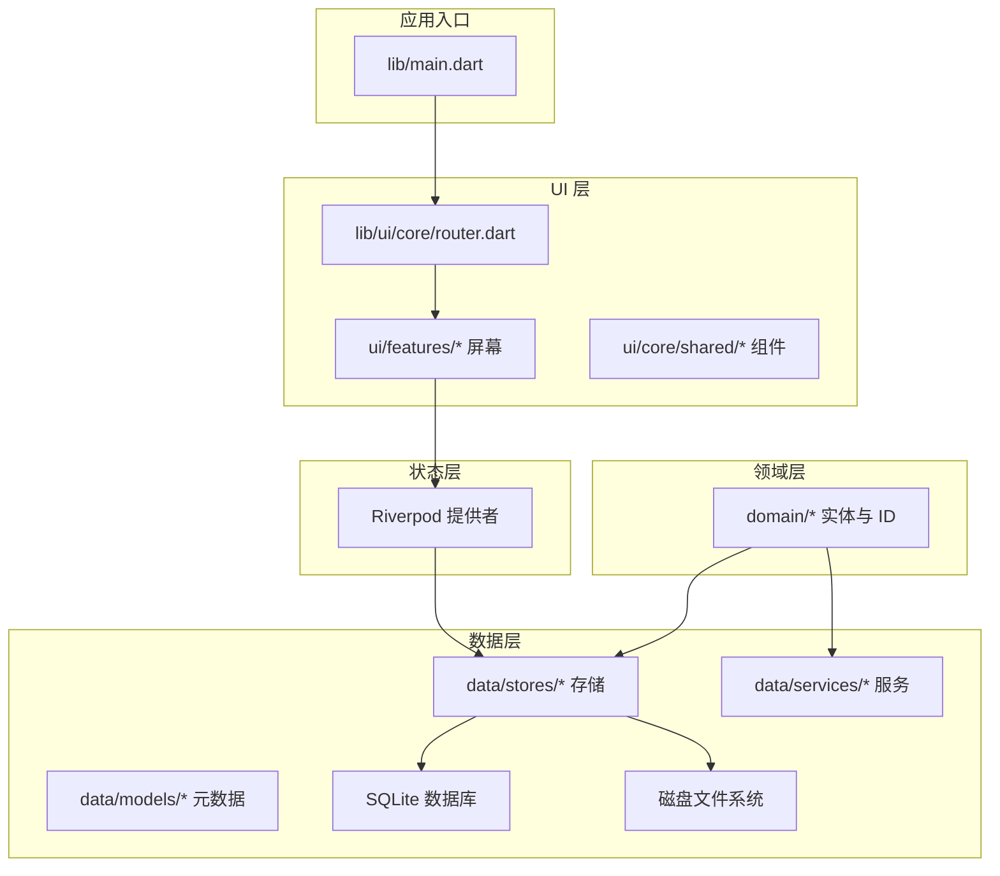
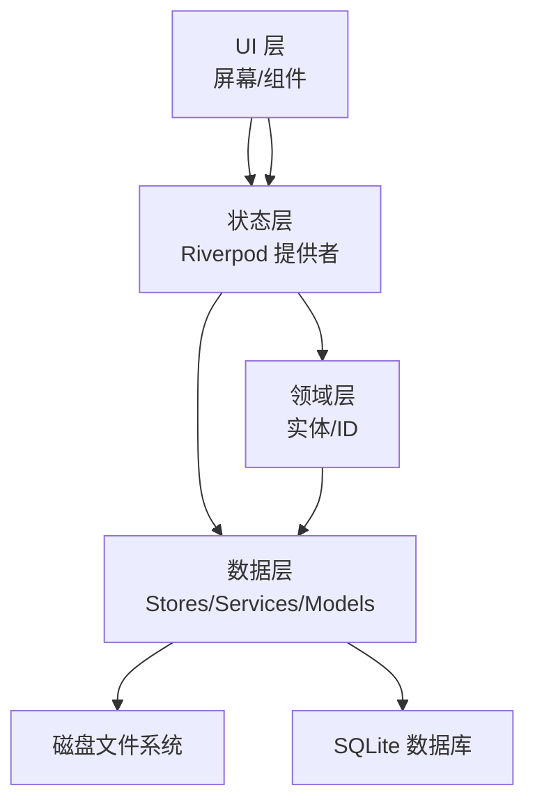
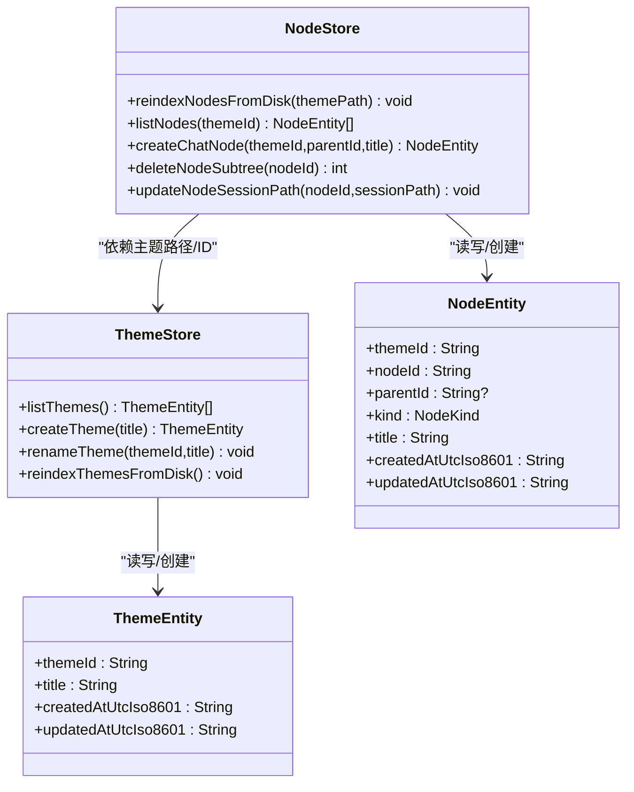
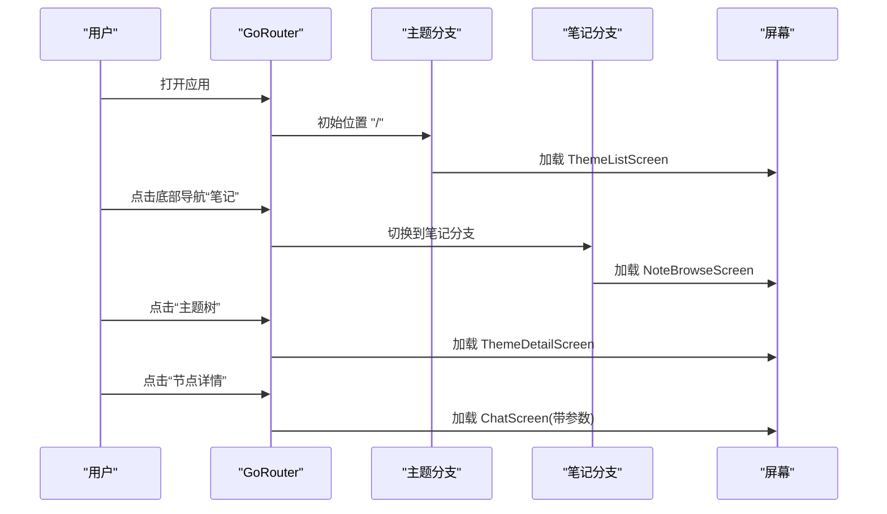
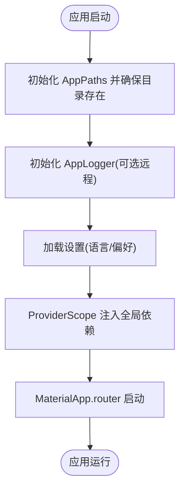
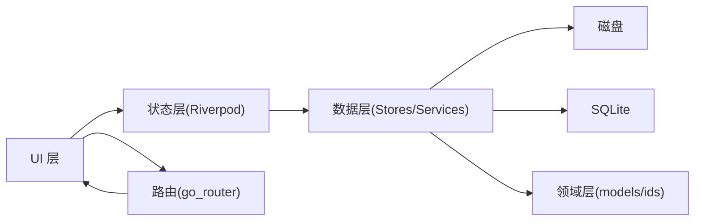

# 架构设计

<cite>
**本文引用的文件**
- [README.md](file://README.md)
- [pubspec.yaml](file://pubspec.yaml)
- [lib/main.dart](file://lib/main.dart)
- [docs/design.md](file://docs/design.md)
- [docs/storage-format.md](file://docs/storage-format.md)
- [lib/domain/theme.dart](file://lib/domain/theme.dart)
- [lib/domain/node.dart](file://lib/domain/node.dart)
- [lib/data/stores/theme_store.dart](file://lib/data/stores/theme_store.dart)
- [lib/data/stores/node_store.dart](file://lib/data/stores/node_store.dart)
- [lib/ui/core/router.dart](file://lib/ui/core/router.dart)
</cite>

## 目录
1. [简介](#简介)
2. [项目结构](#项目结构)
3. [核心组件](#核心组件)
4. [架构总览](#架构总览)
5. [详细组件分析](#详细组件分析)
6. [依赖关系分析](#依赖关系分析)
7. [性能考量](#性能考量)
8. [故障排查指南](#故障排查指南)
9. [结论](#结论)
10. [附录](#附录)

## 简介
本文件为 ThkTree 的架构设计文档，聚焦于整体架构模式（MVVM、Repository、Provider 等）在项目中的落地方式，系统化阐述分层架构（UI 层、状态层、领域层、数据层）的职责划分与交互关系，梳理核心组件间的依赖与数据流向，并结合设计文档与存储契约说明技术决策与权衡，涵盖系统边界、组件交互图与数据流图、跨平台兼容性与性能优化策略。

## 项目结构
ThkTree 采用基于职责的分层目录组织：
- domain：领域模型与标识符定义（实体、ID 生成与校验、错误类型）
- data：数据访问层（stores、services、models），负责与磁盘与数据库交互
- ui：界面层（screens、shared 组件、路由与服务）
- docs：设计与存储契约文档
- lib/main.dart：应用入口，初始化路径、日志、安全存储与 Riverpod 提供者

图表来源
- [lib/main.dart:15-59](file://lib/main.dart#L15-L59)
- [lib/ui/core/router.dart:18-87](file://lib/ui/core/router.dart#L18-L87)
- [lib/data/stores/theme_store.dart:11-157](file://lib/data/stores/theme_store.dart#L11-L157)
- [lib/data/stores/node_store.dart:12-414](file://lib/data/stores/node_store.dart#L12-L414)

章节来源
- [README.md:1-18](file://README.md#L1-L18)
- [pubspec.yaml:30-49](file://pubspec.yaml#L30-L49)
- [lib/main.dart:15-95](file://lib/main.dart#L15-L95)
- [lib/ui/core/router.dart:18-126](file://lib/ui/core/router.dart#L18-L126)

## 核心组件
- 应用入口与生命周期
  - 初始化路径、远程日志、错误处理钩子、安全存储与设置加载
  - 使用 ProviderScope 注入全局依赖（路径、日志、语言环境）
- 路由与导航
  - 基于 go_router 的 Shell 分支导航，主题与笔记两个主分支
  - 支持参数化路由（主题、节点、父节点、摘要参数）
- 状态管理
  - Riverpod 提供者体系承载 UI 状态与业务用例组合
- 领域模型
  - ThemeEntity、NodeEntity、NodeKind 等纯数据结构
- 数据访问层
  - ThemeStore、NodeStore 等负责 SQLite 与磁盘的读写与重建索引
  - 严格遵循存储契约（原子写、流式中间态、错误态、reindex）

章节来源
- [lib/main.dart:15-95](file://lib/main.dart#L15-L95)
- [lib/ui/core/router.dart:18-126](file://lib/ui/core/router.dart#L18-L126)
- [lib/domain/theme.dart:1-15](file://lib/domain/theme.dart#L1-L15)
- [lib/domain/node.dart:1-30](file://lib/domain/node.dart#L1-L30)
- [lib/data/stores/theme_store.dart:11-157](file://lib/data/stores/theme_store.dart#L11-L157)
- [lib/data/stores/node_store.dart:12-414](file://lib/data/stores/node_store.dart#L12-L414)

## 架构总览
ThkTree 采用清晰的分层架构与职责分离：
- UI 层：屏幕与共享组件，负责渲染与用户交互
- 状态层：Riverpod 提供者，协调 UI 与数据层
- 领域层：纯数据结构与业务不变量（ID、实体）
- 数据层：存储与服务，负责磁盘与数据库的读写、索引与重建

图表来源
- [docs/design.md:20-46](file://docs/design.md#L20-L46)
- [lib/ui/core/router.dart:18-126](file://lib/ui/core/router.dart#L18-L126)
- [lib/data/stores/theme_store.dart:11-157](file://lib/data/stores/theme_store.dart#L11-L157)
- [lib/data/stores/node_store.dart:12-414](file://lib/data/stores/node_store.dart#L12-L414)

## 详细组件分析

### 主题与节点存储（ThemeStore 与 NodeStore）
- 职责
  - ThemeStore：主题列表、创建、重命名、从磁盘重建索引
  - NodeStore：节点树重建、创建聊天节点、删除子树、路径解析与会话文件关联
- 关键特性
  - 原子写：通过临时文件 + 重命名确保崩溃安全
  - 严格 ID 分配与冲突检测
  - 与磁盘目录结构对齐，路径在数据库中以相对路径存储，运行时膨胀为绝对路径
  - 重建索引：扫描磁盘元数据写入 SQLite，事务保证一致性

图表来源
- [lib/data/stores/theme_store.dart:11-157](file://lib/data/stores/theme_store.dart#L11-L157)
- [lib/data/stores/node_store.dart:12-414](file://lib/data/stores/node_store.dart#L12-L414)
- [lib/domain/theme.dart:1-15](file://lib/domain/theme.dart#L1-L15)
- [lib/domain/node.dart:10-30](file://lib/domain/node.dart#L10-L30)

章节来源
- [lib/data/stores/theme_store.dart:11-157](file://lib/data/stores/theme_store.dart#L11-L157)
- [lib/data/stores/node_store.dart:12-414](file://lib/data/stores/node_store.dart#L12-L414)
- [lib/domain/theme.dart:1-15](file://lib/domain/theme.dart#L1-L15)
- [lib/domain/node.dart:1-30](file://lib/domain/node.dart#L1-L30)

### 路由与导航（GoRouter）
- 职责
  - 定义主题与笔记两大 Shell 分支，支持参数化路由
  - 底部导航切换分支，分支内页面栈独立
- 交互
  - 通过路由参数传递主题、节点、父节点与摘要参数
  - 错误路由统一处理

图表来源
- [lib/ui/core/router.dart:18-126](file://lib/ui/core/router.dart#L18-L126)

章节来源
- [lib/ui/core/router.dart:18-126](file://lib/ui/core/router.dart#L18-L126)

### 应用入口与全局依赖注入
- 职责
  - 初始化 AppPaths、AppLogger、FlutterSecureStorage
  - 加载设置（语言环境），注入 ProviderScope
  - 全局错误捕获与日志上报
- 交互
  - 通过 ProviderScope 覆盖 appPathsProvider、appLoggerProvider、localeProvider
  - MaterialApp.router 使用 appRouter

图表来源
- [lib/main.dart:15-59](file://lib/main.dart#L15-L59)

章节来源
- [lib/main.dart:15-95](file://lib/main.dart#L15-L95)

### 设计模式与架构模式
- MVVM
  - View：UI 层屏幕与组件
  - ViewModel：Riverpod 提供者承担状态与用例组合
  - Model：domain 层实体与 data 层 models
- Repository
  - ThemeStore、NodeStore 作为 Repository，封装对 SQLite 与磁盘的访问
- Provider（Riverpod）
  - 作为状态与依赖注入容器，替代传统 BLoC/Redux
  - 通过 ProviderScope 在入口集中注入，减少样板代码与耦合

章节来源
- [docs/design.md:20-46](file://docs/design.md#L20-L46)
- [lib/main.dart:49-58](file://lib/main.dart#L49-L58)

## 依赖关系分析
- 外部依赖
  - flutter_riverpod：状态管理
  - go_router：声明式路由
  - dio：网络请求（LLM 客户端）
  - flutter_secure_storage：安全存储
  - path_provider、sqflite：路径与本地数据库
  - yaml：配置解析
- 内部依赖
  - UI 层依赖状态层（Riverpod）
  - 状态层依赖数据层（stores/services）
  - 数据层依赖领域层（models/ids）
  - 路由层独立于状态层，通过屏幕参数与提供者交互

图表来源
- [pubspec.yaml:30-49](file://pubspec.yaml#L30-L49)
- [lib/ui/core/router.dart:18-126](file://lib/ui/core/router.dart#L18-L126)
- [lib/data/stores/theme_store.dart:11-157](file://lib/data/stores/theme_store.dart#L11-L157)
- [lib/data/stores/node_store.dart:12-414](file://lib/data/stores/node_store.dart#L12-L414)

章节来源
- [pubspec.yaml:30-49](file://pubspec.yaml#L30-L49)

## 性能考量
- 存储与索引
  - SQLite 仅作索引与检索加速，可随时重建；磁盘文件为真相源，保证崩溃可恢复
  - 建议优先使用 FTS5 进行全文检索，不可用时降级 LIKE
- 写入与并发
  - 单写者契约：同一节点的 session.md 同时仅一个写入流程；文件锁或队列确保互斥
  - 流式写入采用原子写与中间态标记，避免部分写入
- 状态与 UI
  - Riverpod 提供细粒度状态订阅，避免不必要的重建
  - 路由分支独立页面栈，降低导航成本
- 跨平台
  - 依赖 Flutter 生态与平台无关的存储接口（path_provider、sqflite），保证 Android/iOS 一致性

章节来源
- [docs/storage-format.md:292-321](file://docs/storage-format.md#L292-L321)
- [docs/design.md:49-58](file://docs/design.md#L49-L58)
- [docs/design.md:141-153](file://docs/design.md#L141-L153)

## 故障排查指南
- 日志与错误
  - 全局 FlutterError.onError 与 PlatformDispatcher.onError 捕获异常并记录
  - 远程日志可通过环境变量开启
- 索引与重建
  - 启动检测或手动触发重建索引，扫描磁盘写入 SQLite
  - 单个文件解析失败不影响整体重建，记录错误项
- 存储一致性
  - 原子写失败时检查 .tmp 文件与重命名过程
  - 流式中间态与错误态文件可被解析与定位

章节来源
- [lib/main.dart:32-40](file://lib/main.dart#L32-L40)
- [docs/design.md:111-123](file://docs/design.md#L111-L123)
- [docs/storage-format.md:66-70](file://docs/storage-format.md#L66-L70)
- [docs/storage-format.md:173-200](file://docs/storage-format.md#L173-L200)

## 结论
ThkTree 通过清晰的分层架构与职责分离，结合 Riverpod 状态管理与严格的存储契约，实现了可维护、可扩展且跨平台一致的系统。数据层以磁盘为真相源、SQLite 为索引加速，配合单写者与原子写策略，保障了复杂对话与笔记场景下的可靠性与性能。未来可在 LLM 集成、全文检索与 UI 体验方面持续演进。

## 附录
- 系统边界
  - 内部：domain、data、ui、docs
  - 外部：Flutter SDK、Android/iOS 平台、SQLite、文件系统
- 技术决策与权衡
  - 选择 Riverpod 而非 BLoC：更易组合与测试，提供细粒度状态订阅
  - 本地存储优先：避免云端同步复杂度，专注核心业务流程
  - 严格存储契约：确保崩溃可恢复与跨版本迁移

章节来源
- [docs/design.md:1-165](file://docs/design.md#L1-L165)
- [docs/storage-format.md:1-350](file://docs/storage-format.md#L1-L350)
- [pubspec.yaml:30-49](file://pubspec.yaml#L30-L49)