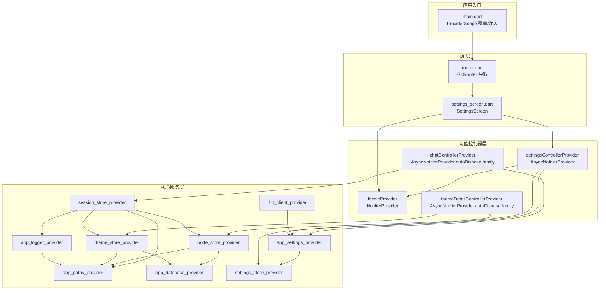
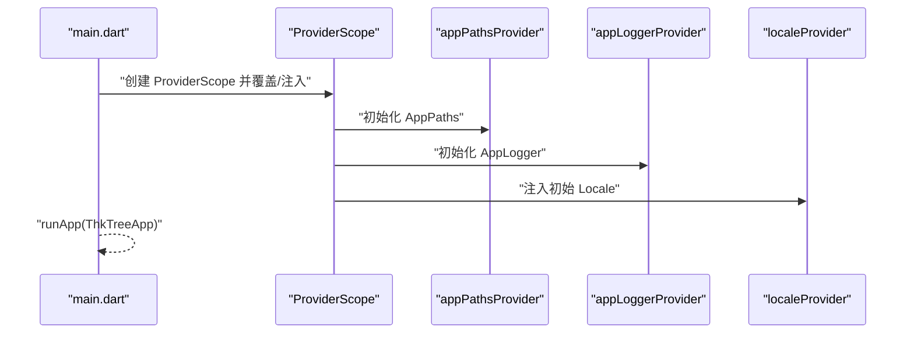
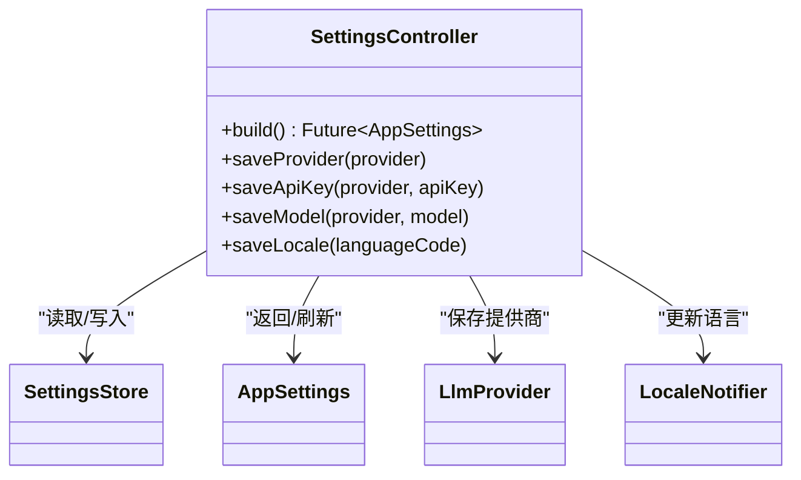
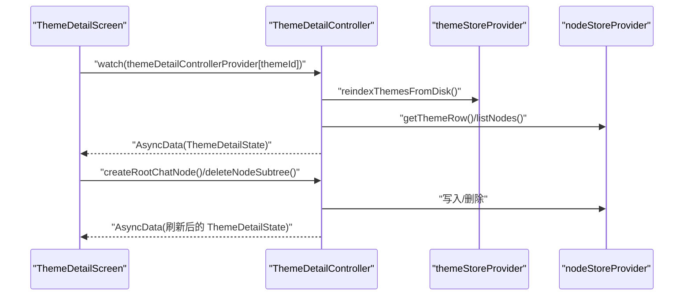
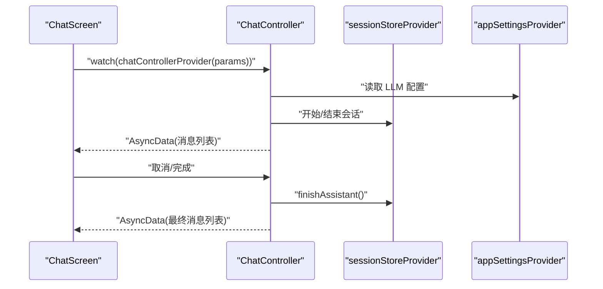
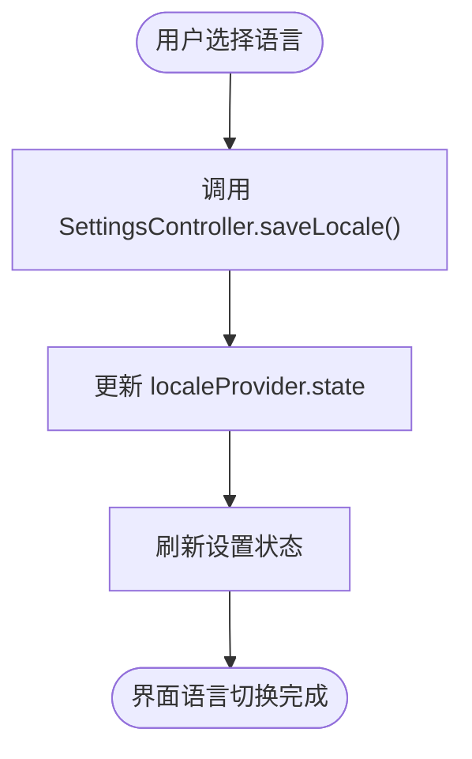
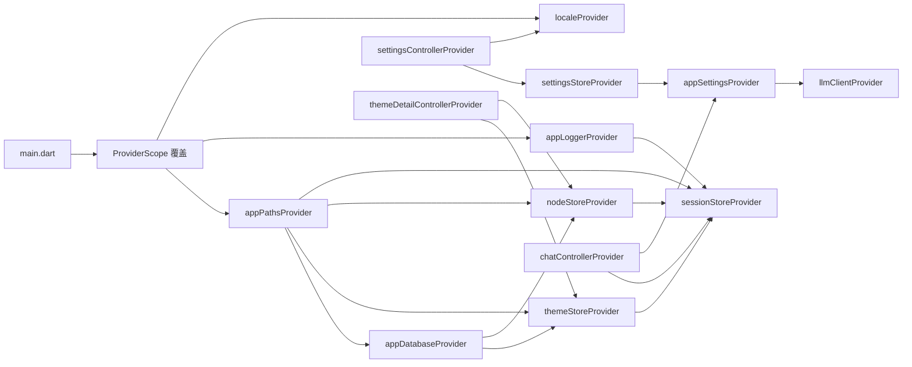

# Provider 设计模式

<cite>
**本文引用的文件**
- [lib/main.dart](file://lib/main.dart)
- [lib/ui/core/app_services.dart](file://lib/ui/core/app_services.dart)
- [lib/ui/features/settings/settings_controller.dart](file://lib/ui/features/settings/settings_controller.dart)
- [lib/ui/features/settings/settings_screen.dart](file://lib/ui/features/settings/settings_screen.dart)
- [lib/ui/features/themes/theme_detail_controller.dart](file://lib/ui/features/themes/theme_detail_controller.dart)
- [lib/ui/features/chat/chat_controller.dart](file://lib/ui/features/chat/chat_controller.dart)
- [lib/ui/core/router.dart](file://lib/ui/core/router.dart)
</cite>

## 目录
1. [简介](#简介)
2. [项目结构](#项目结构)
3. [核心组件](#核心组件)
4. [架构总览](#架构总览)
5. [组件详解](#组件详解)
6. [依赖关系分析](#依赖关系分析)
7. [性能考量](#性能考量)
8. [故障排查指南](#故障排查指南)
9. [结论](#结论)
10. [附录：命名约定与组织最佳实践](#附录命名约定与组织最佳实践)

## 简介
本文件系统性梳理 ThkTree 中基于 Riverpod 的 Provider 设计模式，覆盖以下主题：
- 不同类型 Provider 的选择标准与使用场景（StateProvider、FutureProvider、AsyncNotifierProvider、AutoDisposeProvider）
- Provider 的作用域管理、依赖注入机制与生命周期控制
- 命名约定与组织结构最佳实践
- 具体代码示例路径（以文件+行号定位）
- Provider 之间的依赖关系与数据流向

## 项目结构
ThkTree 将状态与服务分层组织在以下模块中：
- 应用入口与全局作用域：应用启动时通过 ProviderScope 注入全局依赖，设置初始语言等
- 核心服务层：定义数据库、日志、路径、设置存储等基础 Provider
- 功能控制器层：围绕功能域构建的 AsyncNotifier/Notifier 控制器，负责业务状态与副作用
- UI 层：ConsumerWidget 通过 watch/read 消费 Provider，实现响应式更新

图表来源
- [lib/main.dart:49-58](file://lib/main.dart#L49-L58)
- [lib/ui/core/app_services.dart:27-75](file://lib/ui/core/app_services.dart#L27-L75)
- [lib/ui/features/settings/settings_controller.dart:7-42](file://lib/ui/features/settings/settings_controller.dart#L7-L42)
- [lib/ui/features/themes/theme_detail_controller.dart:19-87](file://lib/ui/features/themes/theme_detail_controller.dart#L19-L87)
- [lib/ui/features/chat/chat_controller.dart:218-221](file://lib/ui/features/chat/chat_controller.dart#L218-L221)
- [lib/ui/core/router.dart:18-87](file://lib/ui/core/router.dart#L18-L87)

章节来源
- [lib/main.dart:15-59](file://lib/main.dart#L15-L59)
- [lib/ui/core/app_services.dart:27-171](file://lib/ui/core/app_services.dart#L27-L171)

## 核心组件
本节聚焦于不同类型的 Provider 及其典型用法。

- StateProvider（本地可变状态）
  - 使用场景：轻量 UI 状态或临时状态（如列表版本号）
  - 示例路径：[noteListVersionProvider 定义:18-25](file://lib/ui/core/app_services.dart#L18-L25)
  - 适用性：无需异步加载，仅需局部可变状态时优先考虑

- FutureProvider（一次性异步初始化）
  - 使用场景：需要从磁盘/网络加载一次并缓存结果的服务实例
  - 示例路径：
    - [appPathsProvider:27-31](file://lib/ui/core/app_services.dart#L27-L31)
    - [appDatabaseProvider:38-41](file://lib/ui/core/app_services.dart#L38-L41)
    - [appLoggerProvider:43-49](file://lib/ui/core/app_services.dart#L43-L49)
    - [themeStoreProvider:51-55](file://lib/ui/core/app_services.dart#L51-L55)
    - [nodeStoreProvider:57-61](file://lib/ui/core/app_services.dart#L57-L61)
    - [appSettingsProvider:72-75](file://lib/ui/core/app_services.dart#L72-L75)
    - [llmClientProvider:67-70](file://lib/ui/core/app_services.dart#L67-L70)

- AsyncNotifierProvider（可变异步状态与副作用）
  - 使用场景：需要维护异步状态（加载/错误/完成）且执行副作用（写入存储、刷新数据）
  - 示例路径：
    - [settingsControllerProvider:7-42](file://lib/ui/features/settings/settings_controller.dart#L7-L42)
    - [themeDetailControllerProvider:19-87](file://lib/ui/features/themes/theme_detail_controller.dart#L19-L87)
    - [chatControllerProvider:218-221](file://lib/ui/features/chat/chat_controller.dart#L218-L221)

- NotifierProvider（纯可变状态）
  - 使用场景：简单可变值（如当前语言），无异步副作用
  - 示例路径：
    - [localeProvider:44-57](file://lib/ui/features/settings/settings_controller.dart#L44-L57)

- AutoDisposeProvider（自动释放的 Provider）
  - 使用场景：按需创建、与路由/页面绑定的控制器，离开页面后自动释放
  - 示例路径：
    - [themeDetailControllerProvider.autoDispose.family:84-87](file://lib/ui/features/themes/theme_detail_controller.dart#L84-L87)
    - [chatControllerProvider.autoDispose.family:218-221](file://lib/ui/features/chat/chat_controller.dart#L218-L221)

章节来源
- [lib/ui/core/app_services.dart:18-75](file://lib/ui/core/app_services.dart#L18-L75)
- [lib/ui/features/settings/settings_controller.dart:7-57](file://lib/ui/features/settings/settings_controller.dart#L7-L57)
- [lib/ui/features/themes/theme_detail_controller.dart:19-87](file://lib/ui/features/themes/theme_detail_controller.dart#L19-L87)
- [lib/ui/features/chat/chat_controller.dart:218-221](file://lib/ui/features/chat/chat_controller.dart#L218-L221)

## 架构总览
下图展示应用启动、全局 Provider 初始化与 UI 订阅的关键流程：

图表来源
- [lib/main.dart:49-58](file://lib/main.dart#L49-L58)
- [lib/ui/core/app_services.dart:27-49](file://lib/ui/core/app_services.dart#L27-L49)

章节来源
- [lib/main.dart:15-59](file://lib/main.dart#L15-L59)

## 组件详解

### 设置控制器（AsyncNotifierProvider）
职责与行为：
- 异步加载应用设置
- 提供保存 LLM 提供商、API Key、模型、语言等操作
- 写入设置后刷新状态，并同步更新语言状态

图表来源
- [lib/ui/features/settings/settings_controller.dart:7-42](file://lib/ui/features/settings/settings_controller.dart#L7-L42)

章节来源
- [lib/ui/features/settings/settings_controller.dart:7-42](file://lib/ui/features/settings/settings_controller.dart#L7-L42)

### 主题详情控制器（AsyncNotifierProvider.autoDispose.family）
职责与行为：
- 加载主题树节点并维护异步状态
- 支持创建根节点/子节点、删除子树、刷新
- 使用 autoDispose.family，按 themeId 实例化，离开页面自动释放

图表来源
- [lib/ui/features/themes/theme_detail_controller.dart:19-87](file://lib/ui/features/themes/theme_detail_controller.dart#L19-L87)

章节来源
- [lib/ui/features/themes/theme_detail_controller.dart:19-87](file://lib/ui/features/themes/theme_detail_controller.dart#L19-L87)

### 聊天控制器（AsyncNotifierProvider.autoDispose.family）
职责与行为：
- 维护会话消息流的异步状态
- 与 sessionStore 协作处理消息发送/结束
- 自动释放，避免内存泄漏

图表来源
- [lib/ui/features/chat/chat_controller.dart:218-221](file://lib/ui/features/chat/chat_controller.dart#L218-L221)

章节来源
- [lib/ui/features/chat/chat_controller.dart:218-221](file://lib/ui/features/chat/chat_controller.dart#L218-L221)

### 语言设置（NotifierProvider）
职责与行为：
- 维护当前语言 Locale
- 通过 Notifier 更新状态，简单可靠

图表来源
- [lib/ui/features/settings/settings_controller.dart:32-38](file://lib/ui/features/settings/settings_controller.dart#L32-L38)
- [lib/ui/features/settings/settings_screen.dart:304-373](file://lib/ui/features/settings/settings_screen.dart#L304-L373)

章节来源
- [lib/ui/features/settings/settings_controller.dart:44-57](file://lib/ui/features/settings/settings_controller.dart#L44-L57)
- [lib/ui/features/settings/settings_screen.dart:304-373](file://lib/ui/features/settings/settings_screen.dart#L304-L373)

## 依赖关系分析
- 启动阶段
  - main.dart 通过 ProviderScope 覆盖 appPathsProvider、appLoggerProvider、localeProvider
  - localeProvider 作为 NotifierProvider，被 MaterialApp.router 直接消费
- 服务层
  - appPathsProvider、appDatabaseProvider、appLoggerProvider 为上层 Store/Service 提供基础能力
  - settingsStoreProvider 与 appSettingsProvider 形成“存储-设置”的读取链路
  - themeStoreProvider、nodeStoreProvider 依赖 appPathsProvider 与 appDatabaseProvider
  - sessionStoreProvider 串联 appLoggerProvider、appPathsProvider、themeStoreProvider、nodeStoreProvider
  - llmClientProvider 依赖 appSettingsProvider
- 控制器层
  - settingsControllerProvider 依赖 settingsStoreProvider、localeProvider
  - themeDetailControllerProvider 依赖 themeStoreProvider、nodeStoreProvider
  - chatControllerProvider 依赖 sessionStoreProvider、appSettingsProvider

图表来源
- [lib/main.dart:49-58](file://lib/main.dart#L49-L58)
- [lib/ui/core/app_services.dart:27-75](file://lib/ui/core/app_services.dart#L27-L75)
- [lib/ui/features/settings/settings_controller.dart:7-42](file://lib/ui/features/settings/settings_controller.dart#L7-L42)
- [lib/ui/features/themes/theme_detail_controller.dart:19-87](file://lib/ui/features/themes/theme_detail_controller.dart#L19-L87)
- [lib/ui/features/chat/chat_controller.dart:218-221](file://lib/ui/features/chat/chat_controller.dart#L218-L221)

章节来源
- [lib/main.dart:49-58](file://lib/main.dart#L49-L58)
- [lib/ui/core/app_services.dart:27-75](file://lib/ui/core/app_services.dart#L27-L75)

## 性能考量
- 使用 FutureProvider 缓存昂贵资源（数据库、日志、路径），避免重复初始化
- 对与页面强绑定的状态使用 AutoDisposeProvider.family，减少内存占用
- 在 AsyncNotifier 中合理使用 AsyncLoading/AsyncData 包装，避免不必要的重建
- 通过 ProviderScope.overrides 在启动阶段注入已初始化实例，缩短首帧时间

## 故障排查指南
- 语言切换无效
  - 检查是否通过 settingsControllerProvider.notifier.saveLocale() 更新 localeProvider
  - 确认 MaterialApp.router 的 locale 是否来自 localeProvider
  - 参考路径：[语言设置保存与更新:32-38](file://lib/ui/features/settings/settings_controller.dart#L32-L38)，[语言选择 UI:304-373](file://lib/ui/features/settings/settings_screen.dart#L304-L373)
- 设置未生效
  - 确认 settingsControllerProvider 已刷新状态（AsyncData）
  - 检查 settingsStoreProvider 的保存逻辑与 appSettingsProvider 的读取链路
  - 参考路径：[设置控制器保存方法:14-38](file://lib/ui/features/settings/settings_controller.dart#L14-L38)，[设置读取 Provider:72-75](file://lib/ui/core/app_services.dart#L72-L75)
- 主题树未显示或为空
  - 确认 themeDetailControllerProvider 已触发 reindexThemesFromDisk/reindexNodesFromDisk
  - 检查 nodeStoreProvider.listNodes() 返回数据
  - 参考路径：[主题详情控制器加载流程:25-44](file://lib/ui/features/themes/theme_detail_controller.dart#L25-L44)
- 聊天无输出或无法结束
  - 检查 sessionStoreProvider 的会话句柄与 finishAssistant 调用
  - 确认 appSettingsProvider 提供正确的 LLM 配置
  - 参考路径：[聊天控制器自动释放与状态更新:218-221](file://lib/ui/features/chat/chat_controller.dart#L218-L221)

章节来源
- [lib/ui/features/settings/settings_controller.dart:32-38](file://lib/ui/features/settings/settings_controller.dart#L32-L38)
- [lib/ui/features/settings/settings_screen.dart:304-373](file://lib/ui/features/settings/settings_screen.dart#L304-L373)
- [lib/ui/features/themes/theme_detail_controller.dart:25-44](file://lib/ui/features/themes/theme_detail_controller.dart#L25-L44)
- [lib/ui/features/chat/chat_controller.dart:218-221](file://lib/ui/features/chat/chat_controller.dart#L218-L221)

## 结论
ThkTree 的 Provider 架构遵循“服务层 Provider + 功能控制器 + UI 订阅”的清晰分层：
- 用 FutureProvider 承担一次性初始化与缓存
- 用 AsyncNotifierProvider 管理可变异步状态与副作用
- 用 NotifierProvider 管理简单可变值
- 用 AutoDisposeProvider.family 管理与页面绑定的控制器
- 通过 ProviderScope 在启动阶段集中注入全局依赖，确保语言、路径、日志等基础能力可用

## 附录：命名约定与组织最佳实践
- Provider 命名
  - 服务类：使用名词短语，如 appPathsProvider、appLoggerProvider
  - 控制器类：使用名词短语 + Controller/Notifier，如 settingsControllerProvider、localeProvider
  - 家族型：在末尾标注 family，如 themeDetailControllerProvider.family
- 文件组织
  - 将基础服务 Provider 放置在 app_services.dart
  - 将功能控制器放置在对应功能目录下的 *_controller.dart
  - UI 层通过 ConsumerWidget 或 ref.watch/ref.read 消费 Provider
- 生命周期与作用域
  - 启动阶段通过 ProviderScope.overrides 注入全局实例
  - 页面级控制器使用 AutoDisposeProvider.family，随页面销毁释放
- 数据流向
  - UI -> Controller -> Store/Service -> Provider -> UI
  - 保持单向数据流，避免跨层直接修改状态