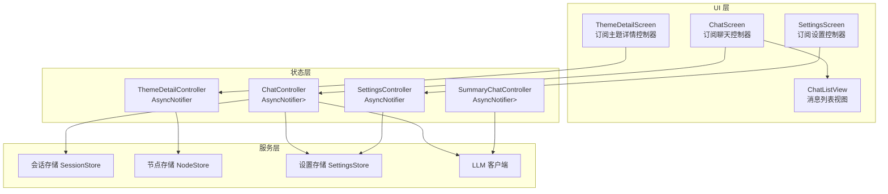
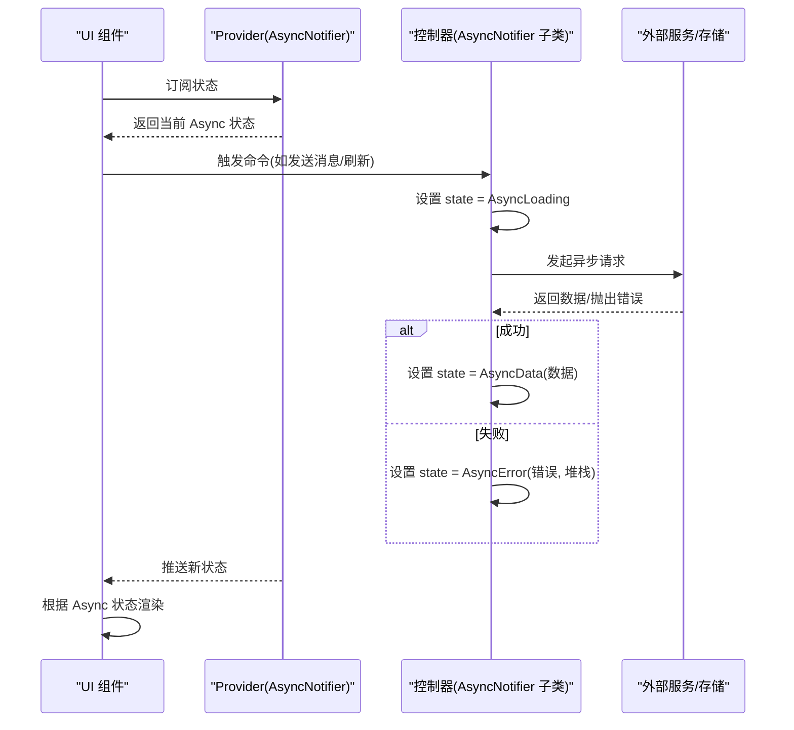
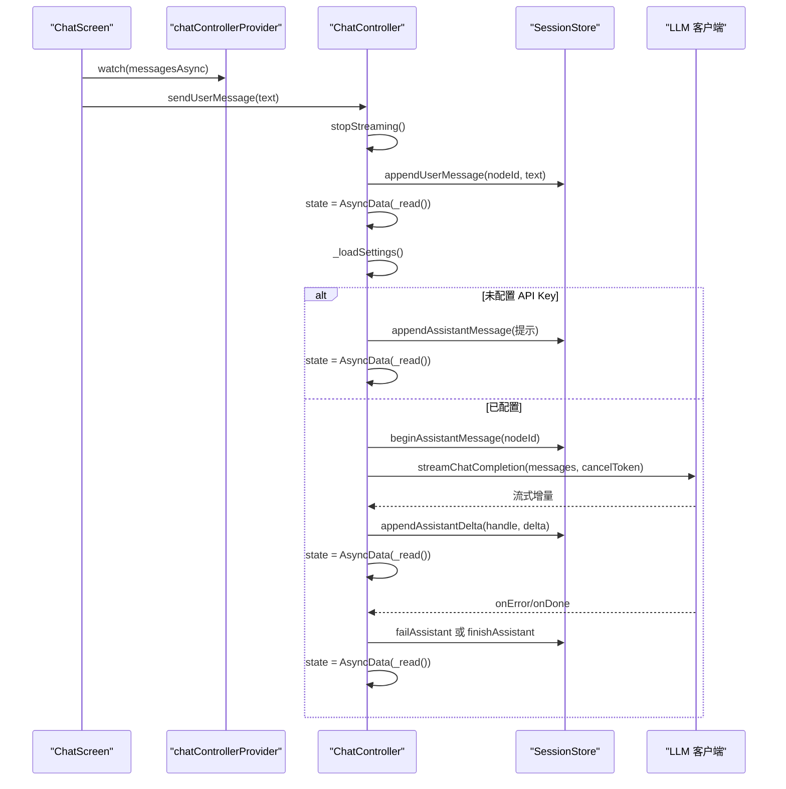
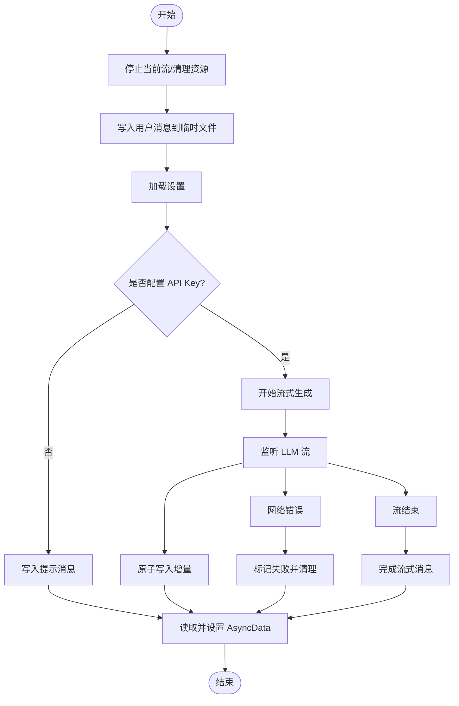
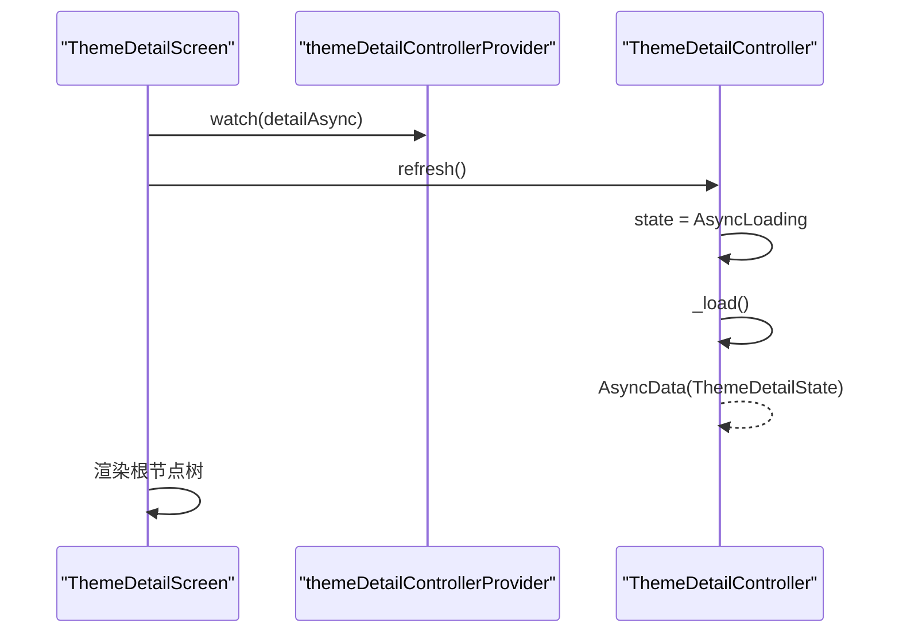
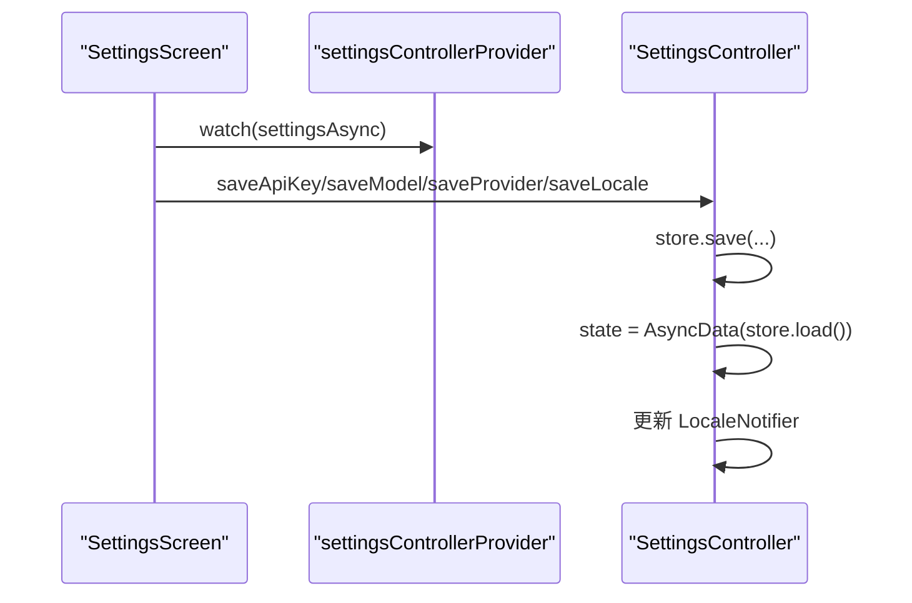
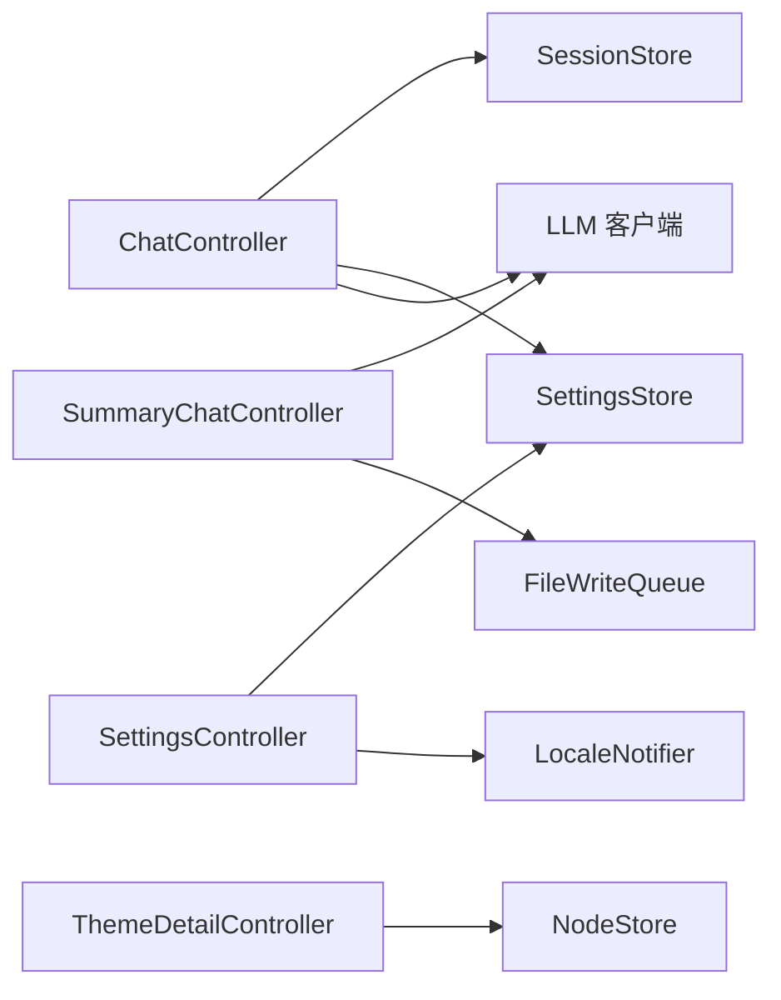

# 异步状态管理

<cite>
**本文引用的文件**
- [lib/ui/features/chat/chat_controller.dart](file://lib/ui/features/chat/chat_controller.dart)
- [lib/ui/features/summary/summary_chat_controller.dart](file://lib/ui/features/summary/summary_chat_controller.dart)
- [lib/ui/features/themes/theme_detail_controller.dart](file://lib/ui/features/themes/theme_detail_controller.dart)
- [lib/ui/features/settings/settings_controller.dart](file://lib/ui/features/settings/settings_controller.dart)
- [lib/ui/features/chat/chat_screen.dart](file://lib/ui/features/chat/chat_screen.dart)
- [lib/ui/features/themes/theme_detail_screen.dart](file://lib/ui/features/themes/theme_detail_screen.dart)
- [lib/ui/features/settings/settings_screen.dart](file://lib/ui/features/settings/settings_screen.dart)
- [lib/ui/core/shared/chat_list_view.dart](file://lib/ui/core/shared/chat_list_view.dart)
</cite>

## 目录
1. [简介](#简介)
2. [项目结构](#项目结构)
3. [核心组件](#核心组件)
4. [架构总览](#架构总览)
5. [详细组件分析](#详细组件分析)
6. [依赖关系分析](#依赖关系分析)
7. [性能考量](#性能考量)
8. [故障排查指南](#故障排查指南)
9. [结论](#结论)
10. [附录](#附录)

## 简介
本文件系统性阐述 ThkTree 项目中基于 Riverpod AsyncNotifier 的异步状态管理机制，重点覆盖以下方面：
- AsyncNotifier 的实现与使用：AsyncLoading、AsyncData、AsyncError 三态的流转与渲染策略
- 异步操作的状态更新策略与错误处理机制
- 状态刷新与缓存策略：手动刷新与自动刷新的实现方式
- 最佳实践：状态合并、并发控制、内存优化
- UI 组件中的订阅与响应机制

## 项目结构
ThkTree 将状态管理集中在 UI 层的控制器中，采用 AsyncNotifier 承载异步数据，并通过 Provider 在 UI 中进行订阅与渲染。控制器通常负责：
- 初始化与生命周期清理
- 数据加载与刷新
- 错误捕获与回退
- 流式数据的增量更新与完成收尾

图表来源
- [lib/ui/features/chat/chat_screen.dart:42-146](file://lib/ui/features/chat/chat_screen.dart#L42-L146)
- [lib/ui/features/themes/theme_detail_screen.dart:27-88](file://lib/ui/features/themes/theme_detail_screen.dart#L27-L88)
- [lib/ui/features/settings/settings_screen.dart:20-51](file://lib/ui/features/settings/settings_screen.dart#L20-L51)
- [lib/ui/features/chat/chat_controller.dart:18-221](file://lib/ui/features/chat/chat_controller.dart#L18-L221)
- [lib/ui/features/summary/summary_chat_controller.dart:33-377](file://lib/ui/features/summary/summary_chat_controller.dart#L33-L377)
- [lib/ui/features/themes/theme_detail_controller.dart:19-87](file://lib/ui/features/themes/theme_detail_controller.dart#L19-L87)
- [lib/ui/features/settings/settings_controller.dart:7-42](file://lib/ui/features/settings/settings_controller.dart#L7-L42)

章节来源
- [lib/ui/features/chat/chat_screen.dart:19-175](file://lib/ui/features/chat/chat_screen.dart#L19-L175)
- [lib/ui/features/themes/theme_detail_screen.dart:14-90](file://lib/ui/features/themes/theme_detail_screen.dart#L14-L90)
- [lib/ui/features/settings/settings_screen.dart:14-52](file://lib/ui/features/settings/settings_screen.dart#L14-L52)

## 核心组件
- ChatController：管理单个会话的消息流，支持发送用户消息、开始/停止流式生成、增量更新与错误处理。
- SummaryChatController：管理“分支总结”临时会话，使用本地文件队列原子写入，支持流式增量与完成收尾。
- ThemeDetailController：管理主题详情的数据加载与刷新，提供手动刷新能力。
- SettingsController：管理应用设置的加载与保存，支持语言等变更后的状态同步。

章节来源
- [lib/ui/features/chat/chat_controller.dart:18-221](file://lib/ui/features/chat/chat_controller.dart#L18-L221)
- [lib/ui/features/summary/summary_chat_controller.dart:33-377](file://lib/ui/features/summary/summary_chat_controller.dart#L33-L377)
- [lib/ui/features/themes/theme_detail_controller.dart:19-87](file://lib/ui/features/themes/theme_detail_controller.dart#L19-L87)
- [lib/ui/features/settings/settings_controller.dart:7-42](file://lib/ui/features/settings/settings_controller.dart#L7-L42)

## 架构总览
AsyncNotifier 将状态抽象为三态：
- AsyncLoading：表示初始或刷新中的加载态
- AsyncData<T>：包含已加载的数据值
- AsyncError：包含错误对象与堆栈

控制器通过在关键路径上设置 state = AsyncLoading/AsyncData/AsyncError 来驱动 UI 渲染；UI 使用 when/maybeWhen 进行分支渲染，确保加载、错误、数据三种场景的正确呈现。

图表来源
- [lib/ui/features/chat/chat_controller.dart:42-140](file://lib/ui/features/chat/chat_controller.dart#L42-L140)
- [lib/ui/features/summary/summary_chat_controller.dart:69-211](file://lib/ui/features/summary/summary_chat_controller.dart#L69-L211)
- [lib/ui/features/themes/theme_detail_controller.dart:24-49](file://lib/ui/features/themes/theme_detail_controller.dart#L24-L49)
- [lib/ui/features/settings/settings_controller.dart:8-12](file://lib/ui/features/settings/settings_controller.dart#L8-L12)

## 详细组件分析

### ChatController 分析
职责与流程
- 初始化：在 build 中注册 onDispose，清理流与取消令牌
- 发送消息：停止当前流、写入用户消息、读取最新会话、加载设置并启动流式生成
- 流式更新：监听 LLM 流，增量写入会话，每次增量后读取并设置 AsyncData
- 错误处理：网络错误时标记失败、清理句柄与令牌、回退到 AsyncData
- 停止流：取消令牌、结束会话或流式消息、回退到 AsyncData

图表来源
- [lib/ui/features/chat/chat_controller.dart:111-215](file://lib/ui/features/chat/chat_controller.dart#L111-L215)
- [lib/ui/features/chat/chat_screen.dart:137-146](file://lib/ui/features/chat/chat_screen.dart#L137-L146)

章节来源
- [lib/ui/features/chat/chat_controller.dart:18-221](file://lib/ui/features/chat/chat_controller.dart#L18-L221)
- [lib/ui/features/chat/chat_screen.dart:19-175](file://lib/ui/features/chat/chat_screen.dart#L19-L175)

### SummaryChatController 分析
职责与流程
- 初始化：构建临时目录与会话文件，写入初始会话内容，读取初始状态
- 发送消息：停止当前流、写入用户消息、读取最新会话、加载设置并启动流式生成
- 流式更新：通过 FileWriteQueue 原子写入增量，避免竞态；每次增量后读取并设置 AsyncData
- 错误处理：网络错误时标记失败、清理句柄与令牌、回退到 AsyncData
- 停止流：完成或终止流式消息，回退到 AsyncData

图表来源
- [lib/ui/features/summary/summary_chat_controller.dart:172-296](file://lib/ui/features/summary/summary_chat_controller.dart#L172-L296)
- [lib/ui/features/summary/summary_chat_controller.dart:298-372](file://lib/ui/features/summary/summary_chat_controller.dart#L298-L372)

章节来源
- [lib/ui/features/summary/summary_chat_controller.dart:33-377](file://lib/ui/features/summary/summary_chat_controller.dart#L33-L377)

### ThemeDetailController 分析
职责与流程
- 初始化：加载主题元数据与节点列表
- 刷新：设置 AsyncLoading 后重新加载，返回 AsyncData
- 创建/删除节点：在写入后立即重新加载并设置 AsyncData

图表来源
- [lib/ui/features/themes/theme_detail_controller.dart:24-49](file://lib/ui/features/themes/theme_detail_controller.dart#L24-L49)
- [lib/ui/features/themes/theme_detail_screen.dart:47-50](file://lib/ui/features/themes/theme_detail_screen.dart#L47-L50)

章节来源
- [lib/ui/features/themes/theme_detail_controller.dart:19-87](file://lib/ui/features/themes/theme_detail_controller.dart#L19-L87)
- [lib/ui/features/themes/theme_detail_screen.dart:14-90](file://lib/ui/features/themes/theme_detail_screen.dart#L14-L90)

### SettingsController 分析
职责与流程
- 初始化：从设置存储加载 AppSettings
- 保存设置：写入设置存储后重新加载并设置 AsyncData
- 语言变更：同时更新 LocaleNotifier 的状态

图表来源
- [lib/ui/features/settings/settings_controller.dart:8-38](file://lib/ui/features/settings/settings_controller.dart#L8-L38)
- [lib/ui/features/settings/settings_screen.dart:31-35](file://lib/ui/features/settings/settings_screen.dart#L31-L35)

章节来源
- [lib/ui/features/settings/settings_controller.dart:7-42](file://lib/ui/features/settings/settings_controller.dart#L7-L42)
- [lib/ui/features/settings/settings_screen.dart:14-52](file://lib/ui/features/settings/settings_screen.dart#L14-L52)

## 依赖关系分析
- 控制器对存储与服务的依赖通过 ref.read/ref.watch 注入，确保解耦与可测试性
- ChatController 与 SummaryChatController 对 SessionStore、LLM 客户端存在直接依赖
- ThemeDetailController 对 NodeStore 存在依赖
- SettingsController 对 SettingsStore 与 LocaleNotifier 存在依赖

图表来源
- [lib/ui/features/chat/chat_controller.dart:147-168](file://lib/ui/features/chat/chat_controller.dart#L147-L168)
- [lib/ui/features/summary/summary_chat_controller.dart:218-249](file://lib/ui/features/summary/summary_chat_controller.dart#L218-L249)
- [lib/ui/features/themes/theme_detail_controller.dart:30-37](file://lib/ui/features/themes/theme_detail_controller.dart#L30-L37)
- [lib/ui/features/settings/settings_controller.dart:14-37](file://lib/ui/features/settings/settings_controller.dart#L14-L37)

章节来源
- [lib/ui/features/chat/chat_controller.dart:1-243](file://lib/ui/features/chat/chat_controller.dart#L1-L243)
- [lib/ui/features/summary/summary_chat_controller.dart:1-428](file://lib/ui/features/summary/summary_chat_controller.dart#L1-L428)
- [lib/ui/features/themes/theme_detail_controller.dart:1-88](file://lib/ui/features/themes/theme_detail_controller.dart#L1-L88)
- [lib/ui/features/settings/settings_controller.dart:1-58](file://lib/ui/features/settings/settings_controller.dart#L1-L58)

## 性能考量
- 并发控制
  - 使用 _streamGeneration 与 _stopRequested 保证同一时刻仅有一个活跃流，避免旧流与新流竞争
  - 在启动新流前取消旧流与令牌，防止资源泄漏与重复计算
- 写入与缓存
  - SummaryChatController 使用 FileWriteQueue 与原子写入，避免并发写导致的数据损坏
  - ChatController 与 ThemeDetailController 通过读取最新状态并在增量后统一设置 AsyncData，减少中间态渲染
- 内存优化
  - AutoDispose 提供者在无订阅时自动释放，降低内存占用
  - 流式更新中仅在增量后读取并设置状态，避免累积大量中间状态
- UI 响应
  - ChatListView 自动滚动到底部，提升交互体验
  - UI 使用 when/maybeWhen 渲染 Loading/Error/Data，避免不必要的重建

## 故障排查指南
常见问题与定位建议
- 流式生成中断或重复
  - 检查 _stopRequested 与 _streamGeneration 是否正确递增与判断
  - 确认取消令牌在停止与新流启动时被正确设置与清理
- 错误未正确渲染
  - 确保在异常路径设置 state = AsyncError，并保留堆栈信息
  - 检查 UI 是否使用 when/error 分支渲染错误
- 数据未刷新
  - 确认在写入后调用 _read 并设置 AsyncData
  - 主题详情刷新需显式调用 refresh 并设置 AsyncLoading
- 文件写入冲突
  - 确认 SummaryChatController 的原子写入逻辑与 FileWriteQueue 的串行化

章节来源
- [lib/ui/features/chat/chat_controller.dart:55-90](file://lib/ui/features/chat/chat_controller.dart#L55-L90)
- [lib/ui/features/chat/chat_controller.dart:134-140](file://lib/ui/features/chat/chat_controller.dart#L134-L140)
- [lib/ui/features/summary/summary_chat_controller.dart:122-153](file://lib/ui/features/summary/summary_chat_controller.dart#L122-L153)
- [lib/ui/features/summary/summary_chat_controller.dart:205-211](file://lib/ui/features/summary/summary_chat_controller.dart#L205-L211)
- [lib/ui/features/themes/theme_detail_controller.dart:46-49](file://lib/ui/features/themes/theme_detail_controller.dart#L46-L49)

## 结论
ThkTree 的异步状态管理以 AsyncNotifier 为核心，结合 Riverpod 的 Provider 体系，实现了清晰的三态模型与稳定的 UI 渲染。通过严格的并发控制、原子写入与自动释放策略，系统在复杂流式交互与多源数据场景下仍保持良好的一致性与性能。建议在后续扩展中继续遵循“状态即渲染”的原则，强化错误边界与可观测性，进一步完善日志与诊断工具。

## 附录
- UI 订阅与响应要点
  - ChatScreen：watch 聊天控制器与设置控制器，使用 maybeWhen 判断是否处于流式状态
  - ThemeDetailScreen：watch 主题详情控制器，提供刷新按钮触发 refresh
  - SettingsScreen：watch 设置控制器，保存设置后统一刷新状态

章节来源
- [lib/ui/features/chat/chat_screen.dart:42-146](file://lib/ui/features/chat/chat_screen.dart#L42-L146)
- [lib/ui/features/themes/theme_detail_screen.dart:27-88](file://lib/ui/features/themes/theme_detail_screen.dart#L27-L88)
- [lib/ui/features/settings/settings_screen.dart:20-51](file://lib/ui/features/settings/settings_screen.dart#L20-L51)
- [lib/ui/core/shared/chat_list_view.dart:34-98](file://lib/ui/core/shared/chat_list_view.dart#L34-L98)