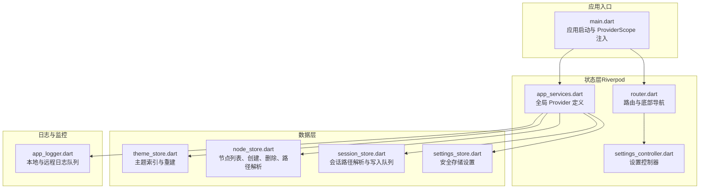
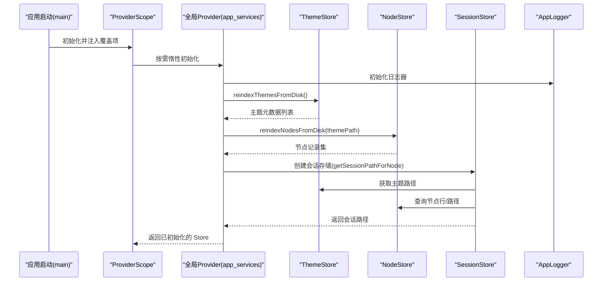
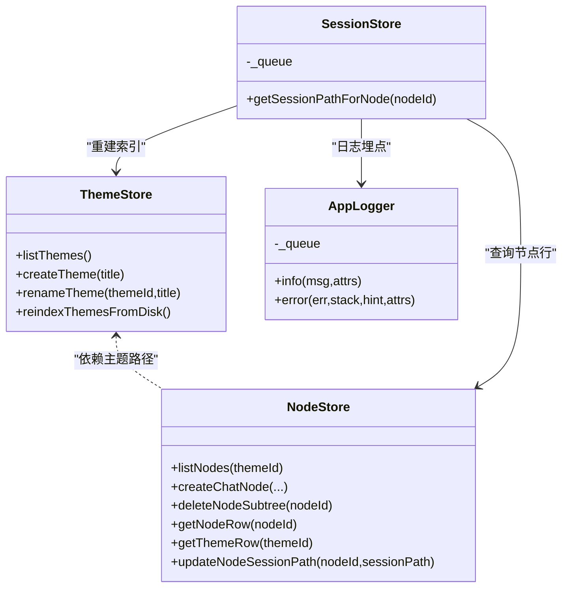
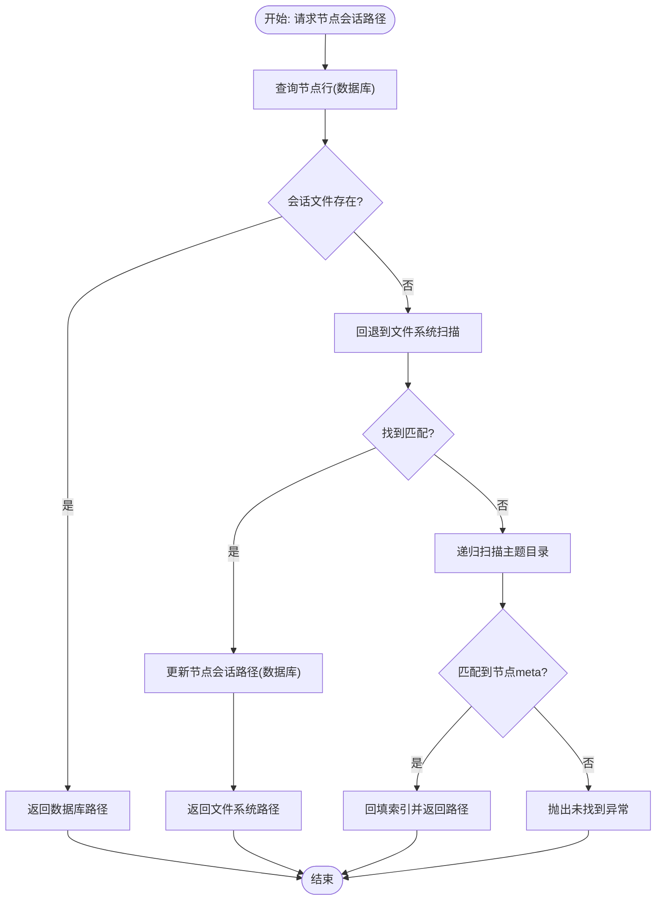
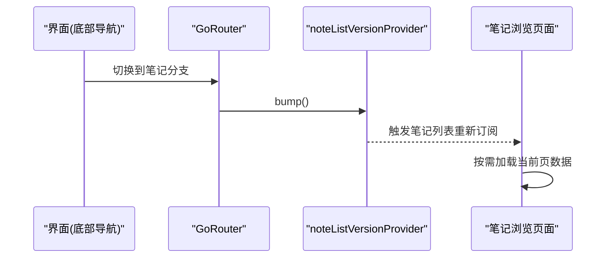
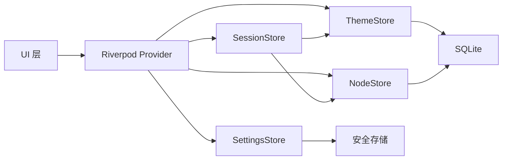

# 性能优化策略

<cite>
**本文引用的文件**
- [lib/main.dart](file://lib/main.dart)
- [lib/ui/core/app_services.dart](file://lib/ui/core/app_services.dart)
- [lib/ui/core/router.dart](file://lib/ui/core/router.dart)
- [lib/ui/features/settings/settings_controller.dart](file://lib/ui/features/settings/settings_controller.dart)
- [lib/data/stores/node_store.dart](file://lib/data/stores/node_store.dart)
- [lib/data/stores/theme_store.dart](file://lib/data/stores/theme_store.dart)
- [lib/data/stores/session_store.dart](file://lib/data/stores/session_store.dart)
- [lib/ui/core/app_logger.dart](file://lib/ui/core/app_logger.dart)
- [lib/data/services/settings_store.dart](file://lib/data/services/settings_store.dart)
- [pubspec.yaml](file://pubspec.yaml)
- [docs/design.md](file://docs/design.md)
</cite>

## 目录
1. [简介](#简介)
2. [项目结构](#项目结构)
3. [核心组件](#核心组件)
4. [架构总览](#架构总览)
5. [详细组件分析](#详细组件分析)
6. [依赖关系分析](#依赖关系分析)
7. [性能考量](#性能考量)
8. [故障排查指南](#故障排查指南)
9. [结论](#结论)
10. [附录](#附录)

## 简介
本文件面向 ThkTree 的状态管理性能优化，系统阐述以下主题：
- 状态更新最小化原则与选择性更新策略
- Provider 缓存机制与计算结果复用方法
- 大规模数据状态管理优化（分页加载与懒加载）
- 性能监控指标与基准测试方法
- 内存泄漏预防与常见陷阱规避
- 调试工具与性能分析技术

## 项目结构
ThkTree 采用 Riverpod 作为状态管理核心，结合 SQLite 数据库与本地文件系统，围绕主题（Theme）与节点（Node）构建会话（Session）与笔记（Note）等状态。应用启动时通过 ProviderScope 注入全局 Provider，并在路由层与屏幕层按需订阅。

图表来源
- [lib/main.dart:15-59](file://lib/main.dart#L15-L59)
- [lib/ui/core/app_services.dart:27-75](file://lib/ui/core/app_services.dart#L27-L75)
- [lib/ui/core/router.dart:18-87](file://lib/ui/core/router.dart#L18-L87)
- [lib/ui/features/settings/settings_controller.dart:7-39](file://lib/ui/features/settings/settings_controller.dart#L7-L39)
- [lib/data/stores/theme_store.dart:11-29](file://lib/data/stores/theme_store.dart#L11-L29)
- [lib/data/stores/node_store.dart:12-59](file://lib/data/stores/node_store.dart#L12-L59)
- [lib/data/stores/session_store.dart:8-15](file://lib/data/stores/session_store.dart#L8-L15)
- [lib/ui/core/app_logger.dart:63-100](file://lib/ui/core/app_logger.dart#L63-L100)

章节来源
- [lib/main.dart:15-59](file://lib/main.dart#L15-L59)
- [lib/ui/core/app_services.dart:27-75](file://lib/ui/core/app_services.dart#L27-L75)
- [lib/ui/core/router.dart:18-87](file://lib/ui/core/router.dart#L18-L87)

## 核心组件
- Provider 缓存与惰性初始化：通过 FutureProvider/Provider 实现一次性初始化与缓存，避免重复 IO 与昂贵操作。
- 主题与节点索引：ThemeStore/NodeStore 提供磁盘到数据库的索引与一致性保障，支持增量重建与路径解析。
- 会话路径解析：SessionStore 基于 NodeStore 与 ThemeStore 的索引，提供“数据库命中 → 文件系统回退 → 递归扫描”的多级查找策略。
- 设置与语言环境：SettingsStore 与 LocaleNotifier 支持安全存储与运行时切换。
- 日志与可观测性：AppLogger 提供本地文件队列与远程上报能力，便于性能与错误追踪。

章节来源
- [lib/ui/core/app_services.dart:27-75](file://lib/ui/core/app_services.dart#L27-L75)
- [lib/data/stores/theme_store.dart:11-29](file://lib/data/stores/theme_store.dart#L11-L29)
- [lib/data/stores/node_store.dart:12-59](file://lib/data/stores/node_store.dart#L12-L59)
- [lib/data/stores/session_store.dart:8-15](file://lib/data/stores/session_store.dart#L8-L15)
- [lib/ui/features/settings/settings_controller.dart:7-39](file://lib/ui/features/settings/settings_controller.dart#L7-L39)
- [lib/ui/core/app_logger.dart:63-100](file://lib/ui/core/app_logger.dart#L63-L100)

## 架构总览
下图展示从应用启动到状态消费的关键路径，强调 Provider 的缓存与复用、数据库事务与磁盘扫描的边界，以及日志埋点位置。

图表来源
- [lib/main.dart:49-58](file://lib/main.dart#L49-L58)
- [lib/ui/core/app_services.dart:77-169](file://lib/ui/core/app_services.dart#L77-L169)
- [lib/data/stores/theme_store.dart:110-139](file://lib/data/stores/theme_store.dart#L110-L139)
- [lib/data/stores/node_store.dart:18-59](file://lib/data/stores/node_store.dart#L18-L59)
- [lib/ui/core/app_logger.dart:74-100](file://lib/ui/core/app_logger.dart#L74-L100)

## 详细组件分析

### Provider 缓存与计算结果复用
- FutureProvider：用于异步初始化且仅执行一次，如数据库、日志器、会话存储等。其内部通过缓存避免重复初始化。
- Provider：用于轻量、无副作用的对象，如安全存储设置。
- Notifier/AsyncNotifier：用于可变状态与异步状态的细粒度更新，配合 bump 版本号触发局部刷新。

图表来源
- [lib/data/stores/theme_store.dart:11-29](file://lib/data/stores/theme_store.dart#L11-L29)
- [lib/data/stores/node_store.dart:86-110](file://lib/data/stores/node_store.dart#L86-L110)
- [lib/data/stores/session_store.dart:8-15](file://lib/data/stores/session_store.dart#L8-L15)
- [lib/ui/core/app_logger.dart:63-100](file://lib/ui/core/app_logger.dart#L63-L100)

章节来源
- [lib/ui/core/app_services.dart:27-75](file://lib/ui/core/app_services.dart#L27-L75)
- [lib/ui/core/router.dart:103](file://lib/ui/core/router.dart#L103)

### 会话路径解析与选择性更新策略
- 多级查找：优先使用数据库索引；若路径失效则回退到文件系统扫描；最后进行递归扫描并回填索引。
- 事务与批量更新：重建索引使用事务，减少多次写入开销。
- 选择性更新：仅在必要时触发 reindex，避免全量扫描。

图表来源
- [lib/ui/core/app_services.dart:77-169](file://lib/ui/core/app_services.dart#L77-L169)
- [lib/data/stores/node_store.dart:267-288](file://lib/data/stores/node_store.dart#L267-L288)

章节来源
- [lib/ui/core/app_services.dart:77-169](file://lib/ui/core/app_services.dart#L77-L169)
- [lib/data/stores/node_store.dart:18-59](file://lib/data/stores/node_store.dart#L18-L59)

### 大规模数据状态管理：分页与懒加载
- 分页加载：基于数据库查询的分页（如按时间排序的节点列表），可在 UI 层按需加载下一页。
- 懒加载：仅在进入主题详情或节点详情时才初始化对应 Store 与路径解析，避免一次性加载全部数据。
- 路由与版本号：底部导航切换时通过 bump 版本号触发笔记列表刷新，避免不必要的重建。

图表来源
- [lib/ui/core/router.dart:103](file://lib/ui/core/router.dart#L103)
- [lib/ui/core/app_services.dart:18-25](file://lib/ui/core/app_services.dart#L18-L25)

章节来源
- [lib/ui/core/router.dart:103](file://lib/ui/core/router.dart#L103)
- [lib/ui/core/app_services.dart:18-25](file://lib/ui/core/app_services.dart#L18-L25)

### 设置与语言环境的性能优化
- 设置项保存后立即刷新状态，避免重复读取。
- 语言环境变更通过 Notifier 直接更新，减少不必要的重建。

章节来源
- [lib/ui/features/settings/settings_controller.dart:7-39](file://lib/ui/features/settings/settings_controller.dart#L7-L39)

## 依赖关系分析
- 核心依赖：flutter_riverpod、sqflite、path、path_provider、flutter_secure_storage、ulid、yaml、go_router、dio、flutter_localizations/intl、flutter_markdown。
- 数据访问链路：UI 层通过 Provider 订阅 → Store 层（ThemeStore/NodeStore）→ 数据库（SQLite）与文件系统。

图表来源
- [pubspec.yaml:30-49](file://pubspec.yaml#L30-L49)
- [lib/ui/core/app_services.dart:51-65](file://lib/ui/core/app_services.dart#L51-L65)

章节来源
- [pubspec.yaml:30-49](file://pubspec.yaml#L30-L49)

## 性能考量
- 状态更新最小化
  - 使用 Notifier/AsyncNotifier 精准更新状态，避免全局广播。
  - 通过版本号（如 noteListVersionProvider）驱动局部刷新，减少重建成本。
- Provider 缓存与复用
  - FutureProvider 仅初始化一次，后续订阅直接复用缓存。
  - 将昂贵操作（如数据库重建、文件扫描）限制在必要时机。
- 大数据优化
  - 分页查询与懒加载：UI 按需加载，避免一次性渲染大量节点。
  - 事务批量写入：索引重建使用事务，降低写放大。
- I/O 与序列化
  - 使用原子写入（临时文件 + 原子重命名）保证一致性。
  - 对大文件解析考虑后台隔离（compute）处理，避免阻塞主线程。
- 并发与锁
  - 设计单写者模型（针对同一节点的会话写入），避免竞态与冲突。
- 监控与诊断
  - 在关键路径埋点日志（info/error），结合远程上报与本地尾部读取，快速定位问题。

章节来源
- [lib/ui/core/app_services.dart:18-25](file://lib/ui/core/app_services.dart#L18-L25)
- [lib/data/stores/node_store.dart:408-413](file://lib/data/stores/node_store.dart#L408-L413)
- [lib/ui/core/app_logger.dart:102-132](file://lib/ui/core/app_logger.dart#L102-L132)
- [docs/design.md:49-92](file://docs/design.md#L49-L92)

## 故障排查指南
- 会话路径未找到
  - 检查数据库索引是否陈旧，触发 reindex 并回填路径。
  - 查看日志中“DB miss/stale/recursive hit/not found”等标记，定位问题阶段。
- 数据库一致性
  - 使用事务批量更新，避免部分更新导致的不一致。
  - 如需修复，参考工具脚本思路进行备份与重建。
- 错误与异常
  - 使用 AppLogger.error 记录堆栈信息，结合远程上报与本地 tail 读取快速定位。
- 内存泄漏与常见陷阱
  - 避免在 Provider 中持有长生命周期对象而不释放。
  - UI 订阅时注意作用域与取消订阅，防止无用重建。
  - 使用 Notifier/AsyncNotifier 时确保状态更新稳定，避免无限循环。

章节来源
- [lib/ui/core/app_services.dart:77-169](file://lib/ui/core/app_services.dart#L77-L169)
- [lib/ui/core/app_logger.dart:112-132](file://lib/ui/core/app_logger.dart#L112-L132)
- [lib/data/stores/node_store.dart:267-288](file://lib/data/stores/node_store.dart#L267-L288)

## 结论
ThkTree 的状态管理以 Riverpod 为核心，结合数据库与文件系统的多级索引与缓存策略，在保证一致性的同时实现了良好的性能与可维护性。通过最小化状态更新、选择性加载、事务批处理与可观测性埋点，可进一步提升大规模数据场景下的用户体验与稳定性。

## 附录
- 性能监控指标建议
  - 关键路径耗时：会话路径解析、主题/节点索引重建、数据库查询。
  - I/O 指标：文件读写次数、事务提交次数、磁盘扫描深度。
  - 内存指标：对象存活数量、重建过程峰值内存。
- 基准测试方法
  - 使用微基准测试框架对热点函数（如 listNodes、reindexNodesFromDisk）进行压力测试。
  - 模拟真实场景（大量主题、节点、会话文件）进行端到端回归测试。
- 调试与分析工具
  - 日志：本地文件队列 + 远程上报，结合 tail 快速查看最近日志。
  - 断点与 LLDB：iOS 工程集成断点辅助内存与线程问题排查。