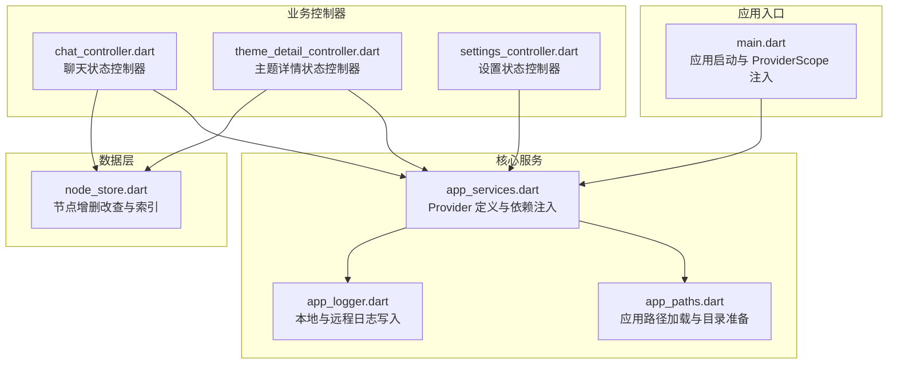
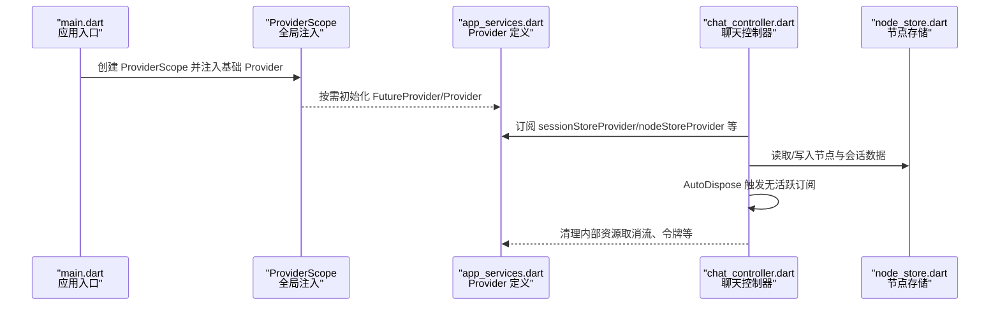
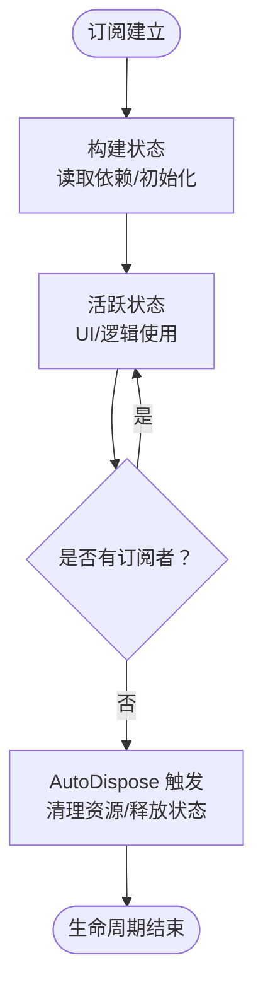
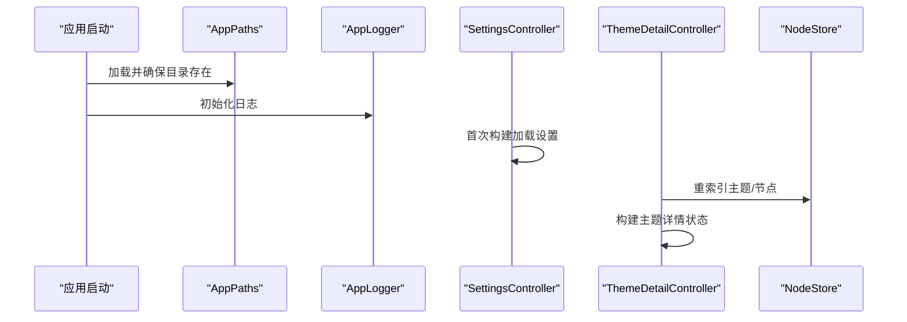
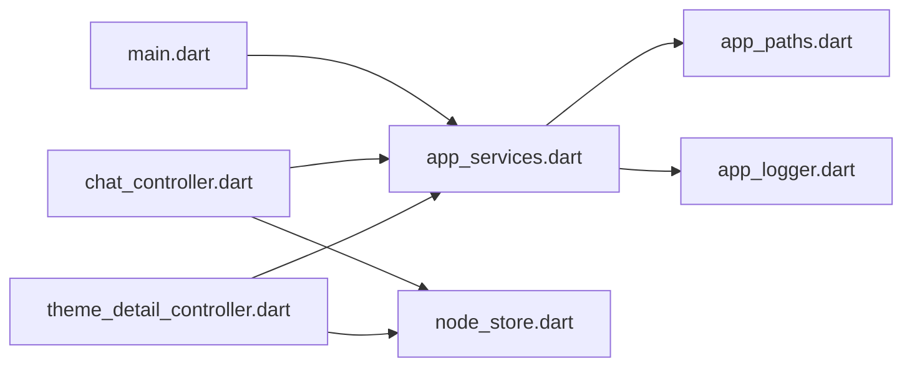

# 状态生命周期

<cite>
**本文引用的文件**
- [lib/main.dart](file://lib/main.dart)
- [lib/ui/core/app_services.dart](file://lib/ui/core/app_services.dart)
- [lib/ui/core/app_paths.dart](file://lib/ui/core/app_paths.dart)
- [lib/ui/core/app_logger.dart](file://lib/ui/core/app_logger.dart)
- [lib/ui/features/chat/chat_controller.dart](file://lib/ui/features/chat/chat_controller.dart)
- [lib/ui/features/themes/theme_detail_controller.dart](file://lib/ui/features/themes/theme_detail_controller.dart)
- [lib/ui/features/settings/settings_controller.dart](file://lib/ui/features/settings/settings_controller.dart)
- [lib/data/stores/node_store.dart](file://lib/data/stores/node_store.dart)
</cite>

## 目录
1. [简介](#简介)
2. [项目结构](#项目结构)
3. [核心组件](#核心组件)
4. [架构总览](#架构总览)
5. [详细组件分析](#详细组件分析)
6. [依赖关系分析](#依赖关系分析)
7. [性能考量](#性能考量)
8. [故障排查指南](#故障排查指南)
9. [结论](#结论)
10. [附录](#附录)

## 简介
本文件系统性梳理 ThkTree 的状态生命周期管理，围绕 Provider 的创建、初始化、更新与销毁展开；重点解释 AutoDispose Provider 的自动清理机制与内存管理策略；记录状态的持久化与恢复（含应用重启后重建）；说明状态依赖解析顺序与循环依赖规避方法；并提供状态生命周期的监控与调试技巧（日志记录与性能分析）。

## 项目结构
ThkTree 使用 Flutter Riverpod 进行状态管理，采用分层组织：入口在 main.dart 中通过 ProviderScope 注入全局依赖；核心服务定义于 app_services.dart；路径与日志等基础设施位于 app_paths.dart 与 app_logger.dart；业务控制器（聊天、主题详情、设置）分别封装在各自控制器文件中；数据层的节点存储位于 node_store.dart。

图表来源
- [lib/main.dart:15-59](file://lib/main.dart#L15-L59)
- [lib/ui/core/app_services.dart:27-169](file://lib/ui/core/app_services.dart#L27-L169)
- [lib/ui/core/app_paths.dart:29-45](file://lib/ui/core/app_paths.dart#L29-L45)
- [lib/ui/core/app_logger.dart:74-100](file://lib/ui/core/app_logger.dart#L74-L100)
- [lib/ui/features/chat/chat_controller.dart:18-221](file://lib/ui/features/chat/chat_controller.dart#L18-L221)
- [lib/ui/features/themes/theme_detail_controller.dart:19-87](file://lib/ui/features/themes/theme_detail_controller.dart#L19-L87)
- [lib/ui/features/settings/settings_controller.dart:7-57](file://lib/ui/features/settings/settings_controller.dart#L7-L57)
- [lib/data/stores/node_store.dart:185-232](file://lib/data/stores/node_store.dart#L185-L232)

章节来源
- [lib/main.dart:15-59](file://lib/main.dart#L15-L59)
- [lib/ui/core/app_services.dart:27-169](file://lib/ui/core/app_services.dart#L27-L169)

## 核心组件
- 应用入口与 ProviderScope 注入
  - 在应用启动时，通过 ProviderScope 注入 AppPaths、AppLogger、Locale 等基础 Provider，并将 ThkTreeApp 作为子树渲染。
  - 参考路径：[lib/main.dart:15-59](file://lib/main.dart#L15-L59)

- 核心服务 Provider
  - AppPaths、TempDir、AppDatabase、AppLogger、ThemeStore、NodeStore、SettingsStore、LLMClient、AppSettings、SessionStore 等均以 FutureProvider 或 Provider 形式提供，支持异步初始化与依赖注入。
  - 参考路径：[lib/ui/core/app_services.dart:27-169](file://lib/ui/core/app_services.dart#L27-L169)

- 日志与路径基础设施
  - AppPaths 负责应用根目录、主题目录、日志目录、临时目录与数据库路径的加载与确保存在。
  - AppLogger 提供本地 JSON 行日志写入、远程回填与发送、错误记录与脱敏处理。
  - 参考路径：
    - [lib/ui/core/app_paths.dart:29-45](file://lib/ui/core/app_paths.dart#L29-L45)
    - [lib/ui/core/app_logger.dart:74-100](file://lib/ui/core/app_logger.dart#L74-L100)

- 业务控制器
  - ChatController：负责单个会话的消息读取、发送、流式生成、停止与完成收尾，使用 AutoDispose 保证无活跃订阅时自动释放。
  - ThemeDetailController：负责主题详情加载、刷新、节点创建与删除，使用 AutoDispose。
  - SettingsController：负责应用设置的读取与保存，使用 AsyncNotifier。
  - LocaleNotifier：负责语言环境状态，使用 Notifier。
  - 参考路径：
    - [lib/ui/features/chat/chat_controller.dart:18-221](file://lib/ui/features/chat/chat_controller.dart#L18-L221)
    - [lib/ui/features/themes/theme_detail_controller.dart:19-87](file://lib/ui/features/themes/theme_detail_controller.dart#L19-L87)
    - [lib/ui/features/settings/settings_controller.dart:7-57](file://lib/ui/features/settings/settings_controller.dart#L7-L57)

章节来源
- [lib/main.dart:15-59](file://lib/main.dart#L15-L59)
- [lib/ui/core/app_services.dart:27-169](file://lib/ui/core/app_services.dart#L27-L169)
- [lib/ui/core/app_paths.dart:29-45](file://lib/ui/core/app_paths.dart#L29-L45)
- [lib/ui/core/app_logger.dart:74-100](file://lib/ui/core/app_logger.dart#L74-L100)
- [lib/ui/features/chat/chat_controller.dart:18-221](file://lib/ui/features/chat/chat_controller.dart#L18-L221)
- [lib/ui/features/themes/theme_detail_controller.dart:19-87](file://lib/ui/features/themes/theme_detail_controller.dart#L19-L87)
- [lib/ui/features/settings/settings_controller.dart:7-57](file://lib/ui/features/settings/settings_controller.dart#L7-L57)

## 架构总览
下图展示应用启动到状态控制器消费 Provider 的关键流程，以及 AutoDispose 的触发点。

图表来源
- [lib/main.dart:15-59](file://lib/main.dart#L15-L59)
- [lib/ui/core/app_services.dart:27-169](file://lib/ui/core/app_services.dart#L27-L169)
- [lib/ui/features/chat/chat_controller.dart:42-90](file://lib/ui/features/chat/chat_controller.dart#L42-L90)
- [lib/data/stores/node_store.dart:185-232](file://lib/data/stores/node_store.dart#L185-L232)

## 详细组件分析

### Provider 生命周期：创建、初始化、更新与销毁
- 创建与初始化
  - 基础 Provider（如 AppPaths、AppLogger、AppDatabase）在首次被消费时按需初始化，返回可复用实例。
  - 复杂 Provider（如 SessionStore）在构建函数中执行重索引、路径查找与落盘校验，确保状态一致性。
  - 参考路径：
    - [lib/ui/core/app_services.dart:27-61](file://lib/ui/core/app_services.dart#L27-L61)
    - [lib/ui/core/app_services.dart:77-169](file://lib/ui/core/app_services.dart#L77-L169)

- 更新
  - AsyncNotifier/Notifier 控制器通过 state 替换实现状态更新；例如 SettingsController 读取/保存设置后刷新 state。
  - 参考路径：
    - [lib/ui/features/settings/settings_controller.dart:9-38](file://lib/ui/features/settings/settings_controller.dart#L9-L38)

- 销毁与自动清理（AutoDispose）
  - ChatController 与 ThemeDetailController 使用 AsyncNotifierProvider.autoDispose.family，当没有任何订阅者时，Riverpod 自动释放其状态与内部资源。
  - 典型清理动作包括：取消流订阅、取消网络请求令牌、释放句柄等。
  - 参考路径：
    - [lib/ui/features/chat/chat_controller.dart:42-90](file://lib/ui/features/chat/chat_controller.dart#L42-L90)
    - [lib/ui/features/themes/theme_detail_controller.dart:84-87](file://lib/ui/features/themes/theme_detail_controller.dart#L84-L87)

图表来源
- [lib/ui/features/chat/chat_controller.dart:42-90](file://lib/ui/features/chat/chat_controller.dart#L42-L90)
- [lib/ui/features/themes/theme_detail_controller.dart:84-87](file://lib/ui/features/themes/theme_detail_controller.dart#L84-L87)

章节来源
- [lib/ui/core/app_services.dart:27-169](file://lib/ui/core/app_services.dart#L27-L169)
- [lib/ui/features/chat/chat_controller.dart:42-90](file://lib/ui/features/chat/chat_controller.dart#L42-L90)
- [lib/ui/features/themes/theme_detail_controller.dart:84-87](file://lib/ui/features/themes/theme_detail_controller.dart#L84-L87)

### AutoDispose Provider 的自动清理机制与内存管理策略
- 自动清理触发条件
  - 当 AsyncNotifierProvider.autoDispose.family 的实例不再被任何 Consumer/Selector 订阅时，Riverpod 会自动调用其 onDispose 回调并释放状态。
- 实践要点
  - 在 onDispose 中显式取消流订阅、取消网络请求令牌、关闭句柄，避免资源泄漏。
  - 对于流式生成场景，应维护 generation 计数与 CancelToken，确保旧流被正确取消。
- 参考路径：
  - [lib/ui/features/chat/chat_controller.dart:42-90](file://lib/ui/features/chat/chat_controller.dart#L42-L90)

章节来源
- [lib/ui/features/chat/chat_controller.dart:42-90](file://lib/ui/features/chat/chat_controller.dart#L42-L90)

### 状态的持久化与恢复机制（含应用重启后的状态重建）
- 数据持久化
  - NodeStore 支持节点创建、删除与索引重建，写入 SQLite 并同步磁盘目录结构。
  - SessionStore 通过 getSessionPathForNode 解析会话文件路径，必要时进行磁盘重索引与回退扫描。
- 状态恢复
  - 应用启动时，通过 ProviderScope 注入 AppPaths 与 AppLogger，随后各控制器在首次访问时按需加载或重建状态。
  - SettingsController 首次构建时从 SettingsStore 加载应用设置，作为后续 UI 与功能的基础。
- 参考路径：
  - [lib/data/stores/node_store.dart:185-232](file://lib/data/stores/node_store.dart#L185-L232)
  - [lib/ui/core/app_services.dart:77-169](file://lib/ui/core/app_services.dart#L77-L169)
  - [lib/ui/features/settings/settings_controller.dart:9-12](file://lib/ui/features/settings/settings_controller.dart#L9-L12)

图表来源
- [lib/main.dart:15-59](file://lib/main.dart#L15-L59)
- [lib/ui/core/app_paths.dart:29-45](file://lib/ui/core/app_paths.dart#L29-L45)
- [lib/ui/core/app_logger.dart:74-100](file://lib/ui/core/app_logger.dart#L74-L100)
- [lib/ui/features/settings/settings_controller.dart:9-12](file://lib/ui/features/settings/settings_controller.dart#L9-L12)
- [lib/ui/features/themes/theme_detail_controller.dart:29-44](file://lib/ui/features/themes/theme_detail_controller.dart#L29-L44)
- [lib/data/stores/node_store.dart:185-232](file://lib/data/stores/node_store.dart#L185-L232)

章节来源
- [lib/ui/core/app_services.dart:77-169](file://lib/ui/core/app_services.dart#L77-L169)
- [lib/ui/features/settings/settings_controller.dart:9-12](file://lib/ui/features/settings/settings_controller.dart#L9-L12)
- [lib/ui/features/themes/theme_detail_controller.dart:29-44](file://lib/ui/features/themes/theme_detail_controller.dart#L29-L44)
- [lib/data/stores/node_store.dart:185-232](file://lib/data/stores/node_store.dart#L185-L232)

### 状态依赖的解析顺序与循环依赖的避免方法
- 解析顺序
  - Provider 的依赖链自顶向下：AppPaths → AppLogger → AppDatabase → ThemeStore/NodeStore → SessionStore → 业务控制器。
  - 业务控制器在 build 中按需读取所需 Provider，避免一次性加载全部依赖。
- 循环依赖规避
  - 明确划分职责边界：基础设施（路径/日志/数据库）→ 存储层（ThemeStore/NodeStore/SessionStore）→ 控制器层。
  - 使用 ref.read/ref.watch 的组合：在构建阶段仅 watch 必要依赖，在执行操作时再 read 获取最新实例，减少耦合。
- 参考路径：
  - [lib/ui/core/app_services.dart:27-61](file://lib/ui/core/app_services.dart#L27-L61)
  - [lib/ui/features/chat/chat_controller.dart:92-109](file://lib/ui/features/chat/chat_controller.dart#L92-L109)

章节来源
- [lib/ui/core/app_services.dart:27-61](file://lib/ui/core/app_services.dart#L27-L61)
- [lib/ui/features/chat/chat_controller.dart:92-109](file://lib/ui/features/chat/chat_controller.dart#L92-L109)

### 状态生命周期的监控与调试技巧
- 日志记录
  - AppLogger 提供 info/error 接口，支持本地 JSON 行日志与远程回填/发送。
  - 业务控制器在关键节点（构建、读取、停止流、错误）写入日志，便于追踪状态变化。
- 性能分析
  - 使用 dev.log 输出关键事件与耗时信息，结合日志定位慢点。
  - 对流式生成场景，维护 generation 计数与 CancelToken，避免并发冲突与资源浪费。
- 参考路径：
  - [lib/ui/core/app_logger.dart:102-128](file://lib/ui/core/app_logger.dart#L102-L128)
  - [lib/ui/features/chat/chat_controller.dart:31-40](file://lib/ui/features/chat/chat_controller.dart#L31-L40)
  - [lib/ui/features/chat/chat_controller.dart:171-214](file://lib/ui/features/chat/chat_controller.dart#L171-L214)

章节来源
- [lib/ui/core/app_logger.dart:102-128](file://lib/ui/core/app_logger.dart#L102-L128)
- [lib/ui/features/chat/chat_controller.dart:31-40](file://lib/ui/features/chat/chat_controller.dart#L31-L40)
- [lib/ui/features/chat/chat_controller.dart:171-214](file://lib/ui/features/chat/chat_controller.dart#L171-L214)

## 依赖关系分析
- 组件耦合与内聚
  - 业务控制器对存储层的依赖通过 Provider 抽象，降低直接耦合。
  - 基础设施 Provider（路径/日志）被广泛复用，提升内聚性。
- 外部依赖与集成点
  - 文件系统与 SQLite 数据库；远程日志发送；安全存储（用于设置）。
- 可能的循环依赖风险
  - 通过清晰的分层与只在需要时读取依赖，避免直接互相引用。
  

图表来源
- [lib/main.dart:15-59](file://lib/main.dart#L15-L59)
- [lib/ui/core/app_services.dart:27-169](file://lib/ui/core/app_services.dart#L27-L169)
- [lib/ui/core/app_paths.dart:29-45](file://lib/ui/core/app_paths.dart#L29-L45)
- [lib/ui/core/app_logger.dart:74-100](file://lib/ui/core/app_logger.dart#L74-L100)
- [lib/ui/features/chat/chat_controller.dart:18-221](file://lib/ui/features/chat/chat_controller.dart#L18-L221)
- [lib/ui/features/themes/theme_detail_controller.dart:19-87](file://lib/ui/features/themes/theme_detail_controller.dart#L19-L87)
- [lib/data/stores/node_store.dart:185-232](file://lib/data/stores/node_store.dart#L185-L232)

章节来源
- [lib/ui/core/app_services.dart:27-169](file://lib/ui/core/app_services.dart#L27-L169)
- [lib/ui/features/chat/chat_controller.dart:18-221](file://lib/ui/features/chat/chat_controller.dart#L18-L221)
- [lib/ui/features/themes/theme_detail_controller.dart:19-87](file://lib/ui/features/themes/theme_detail_controller.dart#L19-L87)
- [lib/data/stores/node_store.dart:185-232](file://lib/data/stores/node_store.dart#L185-L232)

## 性能考量
- 异步初始化与懒加载
  - 基础 Provider 采用 FutureProvider，按需初始化，避免启动阻塞。
- 流式处理与取消
  - ChatController 使用 CancelToken 与 generation 计数，确保旧流及时取消，减少无效计算。
- I/O 与索引
  - SessionStore 在获取会话路径前先进行磁盘重索引，保证 DB 与磁盘一致，降低后续查找成本。
- 日志与远程发送
  - AppLogger 采用队列写入与远程回填，避免频繁 I/O 与网络阻塞。

## 故障排查指南
- 启动阶段
  - 若日志未生成，检查 AppLogger.init 是否成功与路径是否存在。
  - 参考路径：[lib/ui/core/app_logger.dart:74-83](file://lib/ui/core/app_logger.dart#L74-L83)
- 会话路径问题
  - 若提示“未找到会话路径”，检查主题目录是否存在、是否已完成磁盘重索引。
  - 参考路径：[lib/ui/core/app_services.dart:122-167](file://lib/ui/core/app_services.dart#L122-L167)
- 流式生成异常
  - 关注 onError 分支与 finishAssistant 调用，确认 CancelToken 与 handle 状态。
  - 参考路径：[lib/ui/features/chat/chat_controller.dart:186-214](file://lib/ui/features/chat/chat_controller.dart#L186-L214)
- AutoDispose 未触发
  - 确认无其他订阅者；检查 onDispose 中资源清理逻辑是否完整。
  - 参考路径：[lib/ui/features/chat/chat_controller.dart:42-90](file://lib/ui/features/chat/chat_controller.dart#L42-L90)

章节来源
- [lib/ui/core/app_logger.dart:74-83](file://lib/ui/core/app_logger.dart#L74-L83)
- [lib/ui/core/app_services.dart:122-167](file://lib/ui/core/app_services.dart#L122-L167)
- [lib/ui/features/chat/chat_controller.dart:186-214](file://lib/ui/features/chat/chat_controller.dart#L186-L214)
- [lib/ui/features/chat/chat_controller.dart:42-90](file://lib/ui/features/chat/chat_controller.dart#L42-L90)

## 结论
ThkTree 的状态生命周期管理以 Riverpod 为核心，通过 ProviderScope 注入基础设施，以 FutureProvider/Notifier/AsyncNotifierProvider 等模式实现状态的创建、初始化、更新与销毁。AutoDispose 保障了无活跃订阅时的自动清理，配合日志与远程回填形成可观测的调试体系。持久化与恢复通过 NodeStore/SessionStore 的索引与路径解析实现，具备良好的容错与回退能力。遵循分层与懒加载原则，可有效避免循环依赖并提升性能。

## 附录
- 关键 Provider 列表与职责概览
  - AppPaths：应用根目录与数据库路径
  - AppLogger：本地与远程日志
  - AppDatabase：SQLite 数据库
  - ThemeStore/NodeStore/SessionStore：主题/节点/会话数据存取
  - SettingsController/LocaleNotifier：应用设置与语言环境
  - ChatController/ThemeDetailController：业务状态控制器（AutoDispose）