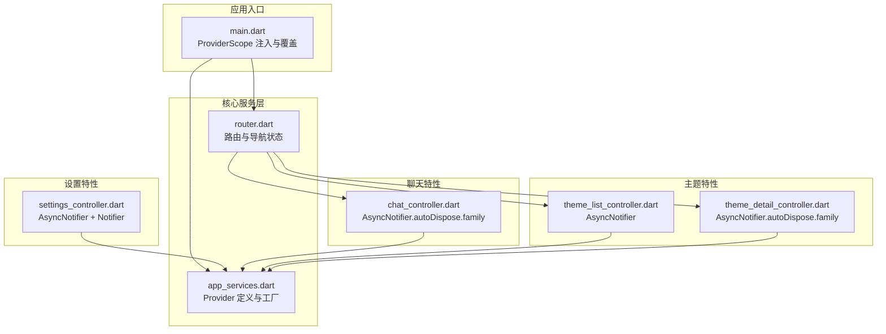
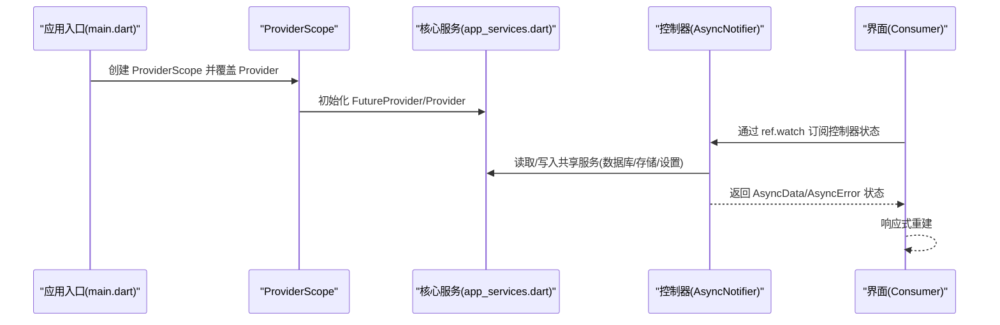
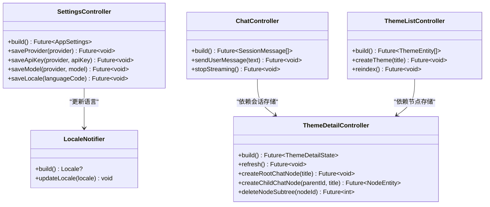
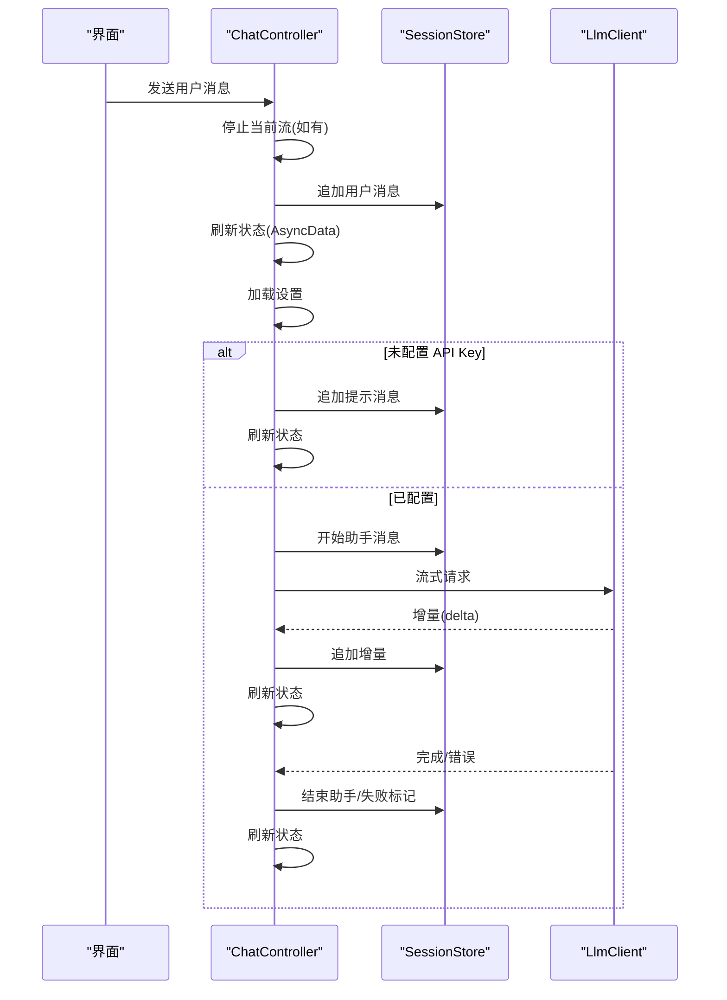
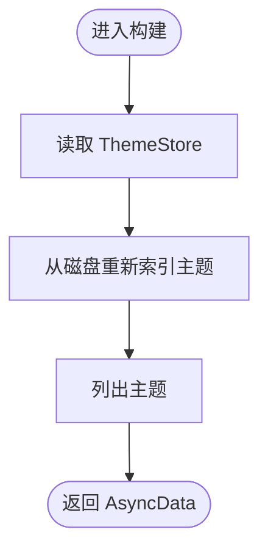
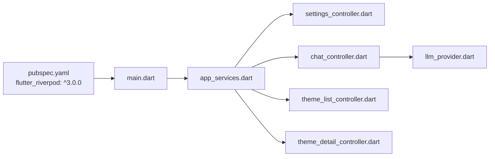

# 状态管理架构

<cite>
**本文引用的文件**
- [lib/main.dart](file://lib/main.dart)
- [pubspec.yaml](file://pubspec.yaml)
- [lib/ui/core/app_services.dart](file://lib/ui/core/app_services.dart)
- [lib/ui/features/settings/settings_controller.dart](file://lib/ui/features/settings/settings_controller.dart)
- [lib/ui/features/chat/chat_controller.dart](file://lib/ui/features/chat/chat_controller.dart)
- [lib/ui/features/themes/theme_list_controller.dart](file://lib/ui/features/themes/theme_list_controller.dart)
- [lib/ui/features/themes/theme_detail_controller.dart](file://lib/ui/features/themes/theme_detail_controller.dart)
- [lib/ui/core/router.dart](file://lib/ui/core/router.dart)
- [lib/data/services/llm_provider.dart](file://lib/data/services/llm_provider.dart)
</cite>

## 目录
1. [简介](#简介)
2. [项目结构](#项目结构)
3. [核心组件](#核心组件)
4. [架构总览](#架构总览)
5. [详细组件分析](#详细组件分析)
6. [依赖关系分析](#依赖关系分析)
7. [性能考量](#性能考量)
8. [故障排除指南](#故障排除指南)
9. [结论](#结论)
10. [附录](#附录)

## 简介
本文件系统性梳理 ThkTree 的状态管理架构，重点围绕 Riverpod 的应用展开，涵盖 Provider 设计模式、AsyncNotifier 使用与状态订阅机制，并对 StateProvider、FutureProvider、AsyncNotifierProvider 等类型进行职责划分与最佳实践总结。同时，结合项目实际，给出状态持久化策略、状态同步机制、调试技巧与故障排除方法。

## 项目结构
ThkTree 将状态管理集中在 UI 核心层（ui/core）与各功能特性层（features），通过 ProviderScope 在应用入口集中注入与覆盖 Provider，形成清晰的分层与解耦。

图表来源
- [lib/main.dart:15-59](file://lib/main.dart#L15-L59)
- [lib/ui/core/app_services.dart:27-169](file://lib/ui/core/app_services.dart#L27-L169)
- [lib/ui/core/router.dart:18-126](file://lib/ui/core/router.dart#L18-L126)
- [lib/ui/features/settings/settings_controller.dart:7-57](file://lib/ui/features/settings/settings_controller.dart#L7-L57)
- [lib/ui/features/chat/chat_controller.dart:18-221](file://lib/ui/features/chat/chat_controller.dart#L18-L221)
- [lib/ui/features/themes/theme_list_controller.dart:5-27](file://lib/ui/features/themes/theme_list_controller.dart#L5-L27)
- [lib/ui/features/themes/theme_detail_controller.dart:19-87](file://lib/ui/features/themes/theme_detail_controller.dart#L19-L87)

章节来源
- [lib/main.dart:15-59](file://lib/main.dart#L15-L59)
- [pubspec.yaml:33-33](file://pubspec.yaml#L33-L33)

## 核心组件
- 应用入口与 ProviderScope
  - 在应用启动时，通过 ProviderScope 注入并覆盖关键 Provider，包括路径、日志器、语言环境等，确保全局可用且可测试。
  - 覆盖逻辑示例：将 AppPaths 和 AppLogger 包装为 AsyncData；将 localeProvider 覆盖为 LocaleNotifier。
- 核心服务 Provider
  - 提供 FutureProvider 类型的异步初始化资源（如数据库、日志器、存储等），并通过 watch/future 访问链路串联。
  - 示例：appPathsProvider、appDatabaseProvider、appLoggerProvider、settingsStoreProvider、themeStoreProvider、nodeStoreProvider、sessionStoreProvider、llmClientProvider、appSettingsProvider。
- 控制器层（AsyncNotifier）
  - 以 AsyncNotifier 及其变体封装业务状态与副作用，统一处理加载、数据与错误状态，支持自动释放（autoDispose.family）。
  - 示例：SettingsController、ChatController、ThemeListController、ThemeDetailController。
- 本地化与语言环境
  - LocaleNotifier 作为 Notifier，负责语言切换；在设置保存后通过 notifier 更新当前语言，触发 UI 重绘。

章节来源
- [lib/main.dart:49-58](file://lib/main.dart#L49-L58)
- [lib/ui/core/app_services.dart:27-169](file://lib/ui/core/app_services.dart#L27-L169)
- [lib/ui/features/settings/settings_controller.dart:7-57](file://lib/ui/features/settings/settings_controller.dart#L7-L57)

## 架构总览
Riverpod 在 ThkTree 中采用“Provider 工厂 + 控制器封装”的分层架构：
- 入口层：ProviderScope 注入与覆盖，统一初始化与环境配置。
- 服务层：FutureProvider/Provider 负责资源初始化与共享，避免重复实例化。
- 控制器层：AsyncNotifier/Notifier 封装业务状态与副作用，按需自动释放，降低内存压力。
- UI 层：ConsumerWidget/Consumer 通过 ref.watch/ref.read 订阅状态，实现响应式更新。

图表来源
- [lib/main.dart:49-58](file://lib/main.dart#L49-L58)
- [lib/ui/core/app_services.dart:27-169](file://lib/ui/core/app_services.dart#L27-L169)
- [lib/ui/features/chat/chat_controller.dart:42-53](file://lib/ui/features/chat/chat_controller.dart#L42-L53)

## 详细组件分析

### Provider 类型与职责划分
- StateProvider
  - 用于简单可变状态（如局部 UI 状态）。在本项目中未直接出现，但可作为 UI 层局部状态补充。
- FutureProvider
  - 用于一次性异步初始化的资源或配置，如 AppPaths、AppDatabase、AppLogger、SettingsStore、ThemeStore、NodeStore、SessionStore、LlmClient、AppSettings。
  - 特点：惰性初始化、单例共享、异常透传。
- AsyncNotifierProvider
  - 用于封装复杂业务状态与副作用，统一处理加载、数据与错误状态，支持自动释放。
  - 示例：SettingsController、ThemeListController、ThemeDetailController、ChatController。
- NotifierProvider
  - 用于轻量级可变状态，如 LocaleNotifier。
- AsyncNotifierProvider.autoDispose.family
  - 针对按参数实例化的控制器（如 ChatControllerParams、themeId），自动释放不再使用的实例，降低内存占用。

章节来源
- [lib/ui/core/app_services.dart:27-169](file://lib/ui/core/app_services.dart#L27-L169)
- [lib/ui/features/settings/settings_controller.dart:7-57](file://lib/ui/features/settings/settings_controller.dart#L7-L57)
- [lib/ui/features/chat/chat_controller.dart:18-221](file://lib/ui/features/chat/chat_controller.dart#L18-L221)
- [lib/ui/features/themes/theme_list_controller.dart:5-27](file://lib/ui/features/themes/theme_list_controller.dart#L5-L27)
- [lib/ui/features/themes/theme_detail_controller.dart:19-87](file://lib/ui/features/themes/theme_detail_controller.dart#L19-L87)

### AsyncNotifier 的使用与状态订阅机制
- 加载与数据状态
  - AsyncNotifier.build 中执行初始化逻辑，返回 AsyncData 表示成功数据，AsyncError 表示错误状态。
  - UI 通过 ref.watch 订阅控制器，自动响应状态变化并重建。
- 错误处理
  - 在控制器内部捕获异常并转换为 AsyncError，保持 UI 线程稳定。
- 自动释放
  - autoDispose.family 控制器在无订阅者时自动释放，避免内存泄漏。
- 订阅与读取
  - ref.watch 订阅异步状态；ref.read 读取同步状态或触发副作用（如更新 LocaleNotifier）。

章节来源
- [lib/ui/features/chat/chat_controller.dart:42-53](file://lib/ui/features/chat/chat_controller.dart#L42-L53)
- [lib/ui/features/settings/settings_controller.dart:7-39](file://lib/ui/features/settings/settings_controller.dart#L7-L39)
- [lib/ui/features/themes/theme_list_controller.dart:5-11](file://lib/ui/features/themes/theme_list_controller.dart#L5-L11)
- [lib/ui/features/themes/theme_detail_controller.dart:19-44](file://lib/ui/features/themes/theme_detail_controller.dart#L19-L44)

### 控制器类图（代码级）

图表来源
- [lib/ui/features/settings/settings_controller.dart:7-57](file://lib/ui/features/settings/settings_controller.dart#L7-L57)
- [lib/ui/features/chat/chat_controller.dart:18-221](file://lib/ui/features/chat/chat_controller.dart#L18-L221)
- [lib/ui/features/themes/theme_list_controller.dart:5-27](file://lib/ui/features/themes/theme_list_controller.dart#L5-L27)
- [lib/ui/features/themes/theme_detail_controller.dart:19-87](file://lib/ui/features/themes/theme_detail_controller.dart#L19-L87)

### 聊天控制器序列图（关键流程）

图表来源
- [lib/ui/features/chat/chat_controller.dart:111-215](file://lib/ui/features/chat/chat_controller.dart#L111-L215)

### 主题列表控制器流程图（异步加载与刷新）

图表来源
- [lib/ui/features/themes/theme_list_controller.dart:7-11](file://lib/ui/features/themes/theme_list_controller.dart#L7-L11)

### 路由与状态联动
- 底部导航切换时，通过 ref.read(noteListVersionProvider.notifier).bump() 触发笔记列表版本号递增，从而驱动相关 UI 刷新。
- 路由参数（如 themeId、nodeId）通过 family 控制器（autoDispose.family）按需实例化与释放。

章节来源
- [lib/ui/core/router.dart:103-104](file://lib/ui/core/router.dart#L103-L104)
- [lib/ui/features/themes/theme_detail_controller.dart:84-87](file://lib/ui/features/themes/theme_detail_controller.dart#L84-L87)
- [lib/ui/features/chat/chat_controller.dart:219-221](file://lib/ui/features/chat/chat_controller.dart#L219-L221)

## 依赖关系分析
- 外部依赖
  - Riverpod 版本：^3.0.0（在 pubspec.yaml 中声明）
- 内部依赖
  - 控制器依赖核心服务 Provider（数据库、存储、设置、会话等）
  - 控制器之间通过共享服务进行协作（如 ChatController 依赖 SessionStore，ThemeDetailController 依赖 NodeStore/ThemeStore）

图表来源
- [pubspec.yaml:33-33](file://pubspec.yaml#L33-L33)
- [lib/main.dart:15-59](file://lib/main.dart#L15-L59)
- [lib/ui/core/app_services.dart:27-169](file://lib/ui/core/app_services.dart#L27-L169)
- [lib/ui/features/settings/settings_controller.dart:1-58](file://lib/ui/features/settings/settings_controller.dart#L1-L58)
- [lib/ui/features/chat/chat_controller.dart:1-243](file://lib/ui/features/chat/chat_controller.dart#L1-L243)
- [lib/ui/features/themes/theme_list_controller.dart:1-28](file://lib/ui/features/themes/theme_list_controller.dart#L1-L28)
- [lib/ui/features/themes/theme_detail_controller.dart:1-88](file://lib/ui/features/themes/theme_detail_controller.dart#L1-L88)
- [lib/data/services/llm_provider.dart:1-111](file://lib/data/services/llm_provider.dart#L1-L111)

章节来源
- [pubspec.yaml:33-33](file://pubspec.yaml#L33-L33)
- [lib/ui/core/app_services.dart:27-169](file://lib/ui/core/app_services.dart#L27-L169)

## 性能考量
- 状态隔离
  - 使用 family 控制器（autoDispose.family）按参数实例化，避免跨实例污染；仅在活跃订阅时保留实例。
- 性能优化
  - 将一次性初始化放入 FutureProvider，避免重复 IO；在控制器中合并多次状态更新（如批量刷新 UI）。
  - 对长耗时操作（如网络流式对话）使用取消令牌与订阅管理，及时释放资源。
- 内存管理
  - 合理使用 autoDispose.family；在 AsyncNotifier.build 中注册 onDispose 回收资源（如取消订阅、关闭流）。
  - 避免在控制器中持有过大的中间态对象，必要时拆分为多个小状态或使用惰性加载。
- 状态同步
  - 通过 ref.read 与 ref.watch 的组合，确保 UI 与后台任务（如流式生成）之间的状态一致性。
  - 对于外部变更（如磁盘文件变更），在控制器中显式触发刷新（如重新索引后再读取）。

## 故障排除指南
- 控制器状态异常
  - 检查 AsyncNotifier.build 是否正确返回 AsyncData/AsyncError；确认异常是否被捕获并转换为 AsyncError。
  - 若 UI 不更新，检查 ref.watch 的订阅范围与键值是否一致。
- 资源泄漏
  - 确认控制器在 onDispose 中取消订阅、关闭流、释放句柄；对于流式任务使用取消令牌。
- 异步初始化失败
  - 检查 FutureProvider 的初始化顺序与依赖链（如 appPathsProvider -> appDatabaseProvider -> 其他依赖）。
- 语言切换无效
  - 确认通过 ref.read(localeProvider.notifier).updateLocale(...) 更新语言，并确保 Material 顶层使用 localeProvider。
- 调试技巧
  - 在控制器中记录关键事件（开始/结束/错误）到日志器，便于定位问题。
  - 使用 AsyncLoading 作为中间态，帮助区分“首次加载”与“刷新”。

章节来源
- [lib/ui/features/chat/chat_controller.dart:45-49](file://lib/ui/features/chat/chat_controller.dart#L45-L49)
- [lib/ui/features/settings/settings_controller.dart:35-37](file://lib/ui/features/settings/settings_controller.dart#L35-L37)
- [lib/ui/core/app_services.dart:77-169](file://lib/ui/core/app_services.dart#L77-L169)

## 结论
ThkTree 的状态管理以 Riverpod 为核心，通过 Provider 工厂与 AsyncNotifier 控制器实现清晰的职责分离与良好的可维护性。FutureProvider 负责一次性初始化，AsyncNotifier 统一处理业务状态与副作用，autoDispose.family 支持按需实例化与自动释放。配合路由与服务层的协作，形成高内聚、低耦合的状态管理架构。建议在后续迭代中持续遵循状态隔离、性能优化与内存管理的最佳实践，并完善调试与可观测性方案。

## 附录
- 关键 Provider 一览
  - appPathsProvider、appDatabaseProvider、appLoggerProvider、settingsStoreProvider、themeStoreProvider、nodeStoreProvider、sessionStoreProvider、llmClientProvider、appSettingsProvider
  - settingsControllerProvider、localeProvider、noteListVersionProvider
  - chatControllerProvider、themeListControllerProvider、themeDetailControllerProvider
- 相关枚举与工具
  - LlmProvider（提供提供商信息、默认模型、基础 URL、上下文窗口等）

章节来源
- [lib/ui/core/app_services.dart:27-169](file://lib/ui/core/app_services.dart#L27-L169)
- [lib/ui/features/settings/settings_controller.dart:41-57](file://lib/ui/features/settings/settings_controller.dart#L41-L57)
- [lib/ui/features/chat/chat_controller.dart:219-221](file://lib/ui/features/chat/chat_controller.dart#L219-L221)
- [lib/ui/features/themes/theme_list_controller.dart:26-27](file://lib/ui/features/themes/theme_list_controller.dart#L26-L27)
- [lib/ui/features/themes/theme_detail_controller.dart:84-87](file://lib/ui/features/themes/theme_detail_controller.dart#L84-L87)
- [lib/data/services/llm_provider.dart:1-111](file://lib/data/services/llm_provider.dart#L1-L111)