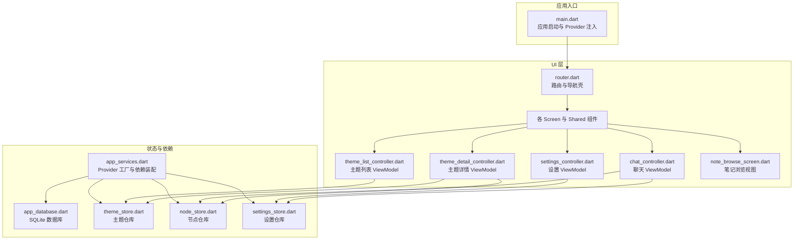
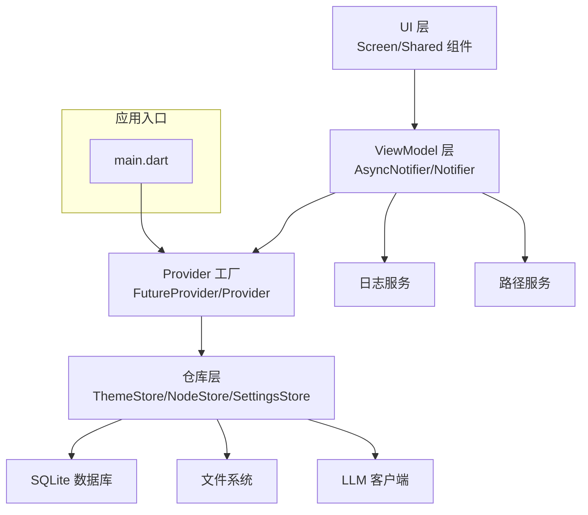
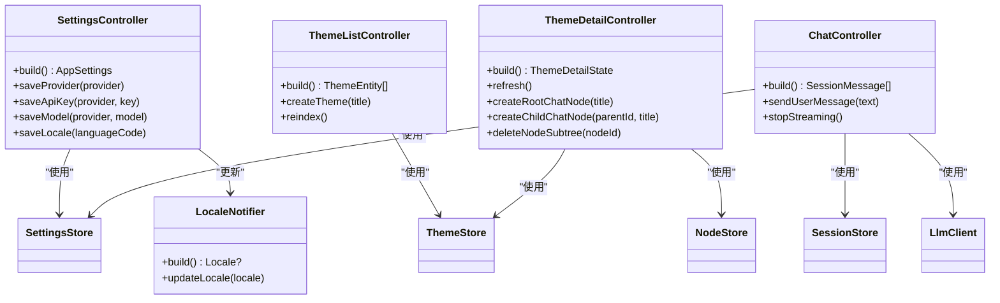
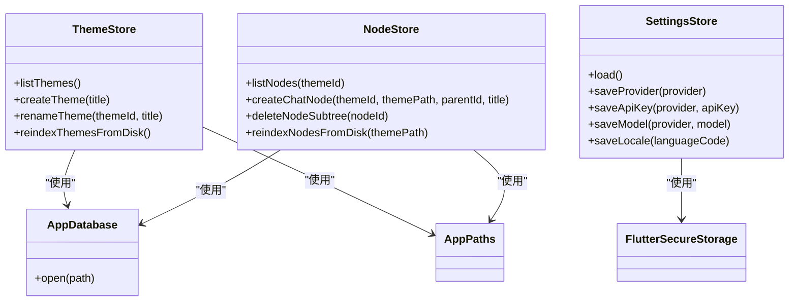
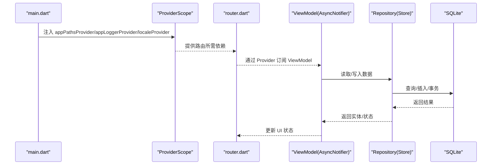
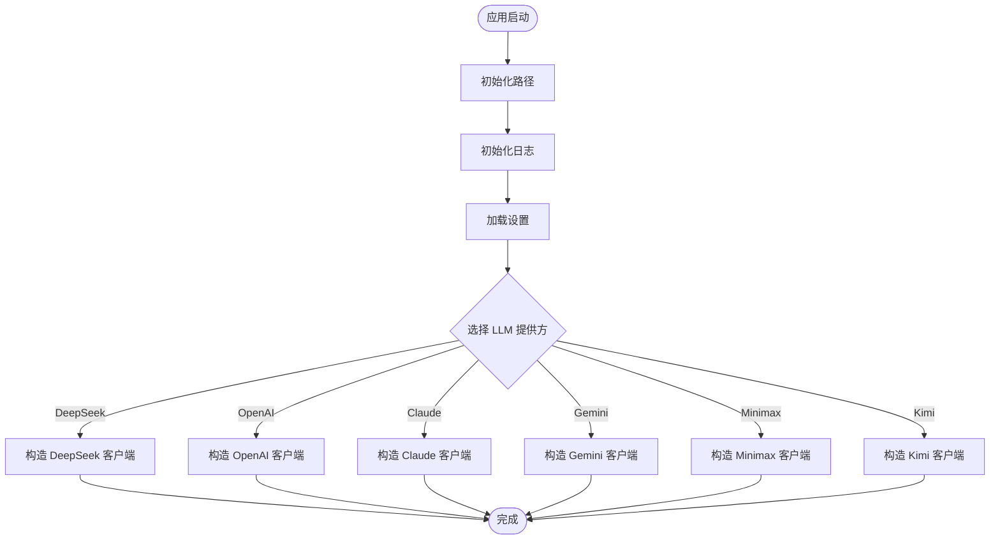
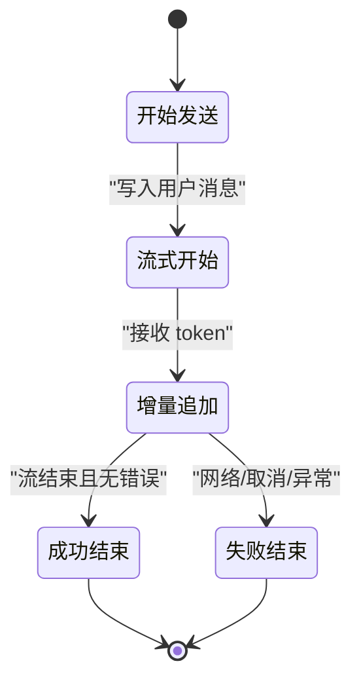
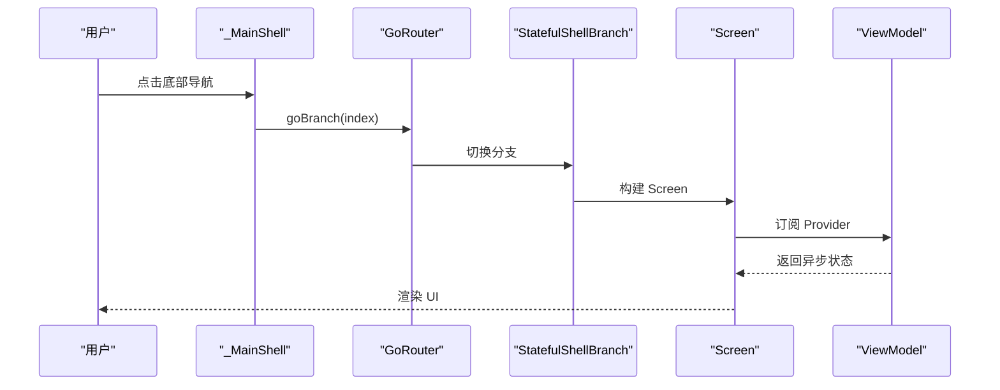
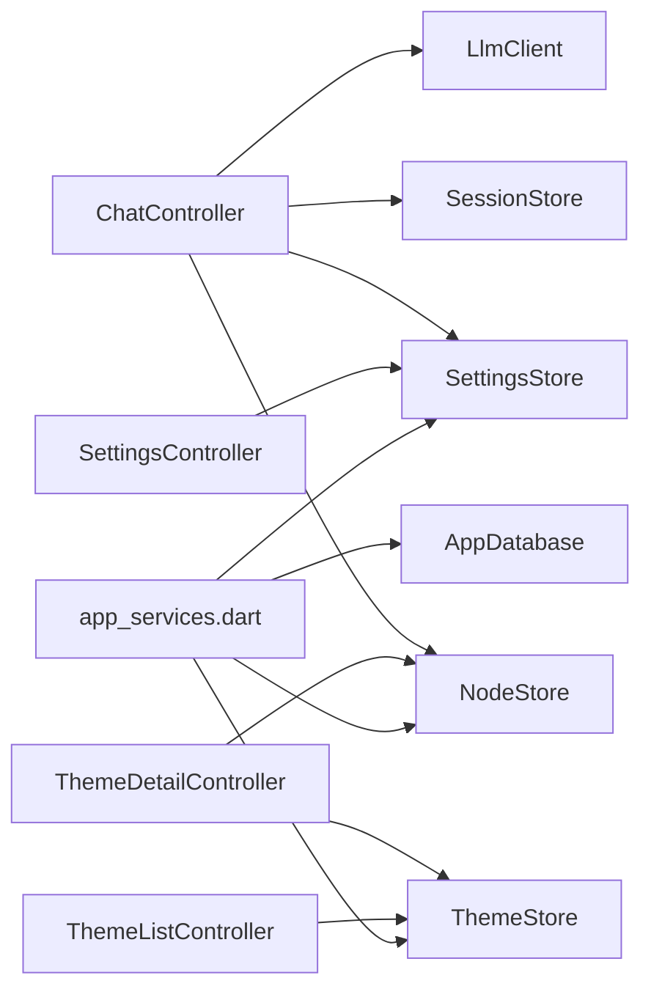

# 设计模式应用

<cite>
**本文引用的文件**
- [lib/main.dart](file://lib/main.dart)
- [lib/ui/core/router.dart](file://lib/ui/core/router.dart)
- [lib/ui/core/app_services.dart](file://lib/ui/core/app_services.dart)
- [lib/ui/features/settings/settings_controller.dart](file://lib/ui/features/settings/settings_controller.dart)
- [lib/ui/features/themes/theme_list_controller.dart](file://lib/ui/features/themes/theme_list_controller.dart)
- [lib/ui/features/themes/theme_detail_controller.dart](file://lib/ui/features/themes/theme_detail_controller.dart)
- [lib/ui/features/chat/chat_controller.dart](file://lib/ui/features/chat/chat_controller.dart)
- [lib/ui/features/notes/note_browse_screen.dart](file://lib/ui/features/notes/note_browse_screen.dart)
- [lib/data/services/app_database.dart](file://lib/data/services/app_database.dart)
- [lib/data/services/settings_store.dart](file://lib/data/services/settings_store.dart)
- [lib/data/stores/theme_store.dart](file://lib/data/stores/theme_store.dart)
- [lib/data/stores/node_store.dart](file://lib/data/stores/node_store.dart)
- [lib/domain/node.dart](file://lib/domain/node.dart)
- [docs/design.md](file://docs/design.md)
</cite>

## 目录
1. [简介](#简介)
2. [项目结构](#项目结构)
3. [核心组件](#核心组件)
4. [架构总览](#架构总览)
5. [详细组件分析](#详细组件分析)
6. [依赖分析](#依赖分析)
7. [性能考量](#性能考量)
8. [故障排查指南](#故障排查指南)
9. [结论](#结论)
10. [附录](#附录)

## 简介
本文件系统性梳理 ThkTree 在 Flutter 环境中采用的设计模式与架构实践，重点覆盖以下方面：
- MVVM（Model-View-ViewModel）：通过 Riverpod Provider 体系实现 ViewModel 层，分离 UI 与状态逻辑。
- Repository：以 Store/Service 作为数据仓库抽象，统一访问主题、节点、会话与设置等数据源。
- Provider：Riverpod Provider/FutureProvider/AsyncNotifierProvider 等，负责依赖注入与状态提供。
- Factory：在应用启动阶段根据环境变量与持久化配置，动态构造日志、数据库、LLM 客户端等实例。

这些模式协同工作，确保了模块边界清晰、状态可预测、可测试性强，并满足流式写入、错误重试、重建索引、stale 管理等工程化需求。

## 项目结构
ThkTree 采用按职责分层的目录组织方式：
- domain：领域实体与 ID 工具，保持与平台无关的纯数据结构。
- data：数据访问层，包含 models、stores、services，承担存储、索引与外部服务集成。
- ui：界面层，按功能划分 features，包含 screens、controllers（ViewModel）、shared 组件与路由。
- main.dart：应用入口，初始化路径、日志、设置与 Provider 树。

图表来源
- [lib/main.dart:15-59](file://lib/main.dart#L15-L59)
- [lib/ui/core/router.dart:18-87](file://lib/ui/core/router.dart#L18-L87)
- [lib/ui/core/app_services.dart:27-169](file://lib/ui/core/app_services.dart#L27-L169)
- [lib/data/services/app_database.dart:3-18](file://lib/data/services/app_database.dart#L3-L18)
- [lib/data/stores/theme_store.dart:11-139](file://lib/data/stores/theme_store.dart#L11-L139)
- [lib/data/stores/node_store.dart:12-375](file://lib/data/stores/node_store.dart#L12-L375)
- [lib/data/services/settings_store.dart:106-184](file://lib/data/services/settings_store.dart#L106-L184)

章节来源
- [lib/main.dart:15-95](file://lib/main.dart#L15-L95)
- [lib/ui/core/router.dart:18-126](file://lib/ui/core/router.dart#L18-L126)
- [lib/ui/core/app_services.dart:27-171](file://lib/ui/core/app_services.dart#L27-L171)
- [docs/design.md:20-46](file://docs/design.md#L20-L46)

## 核心组件
- 应用入口与 Provider 树
  - 在应用启动时初始化路径、日志、安全存储与设置，并通过 ProviderScope 注入全局 Provider。
  - 使用 overrides 动态注入异步 Provider 的初始值，保证 UI 初始化时具备可用状态。
- 路由与导航壳
  - 使用 go_router 的 StatefulShellRoute 实现多分支导航，底部导航切换不同功能域。
- 状态提供者工厂
  - 通过 FutureProvider/Provider/AsyncNotifierProvider 等组合，构建数据库、路径、日志、设置、主题/节点/会话仓库等依赖。
- 控制器（ViewModel）
  - SettingsController、ThemeListController、ThemeDetailController、ChatController 等，封装 UI 状态与业务逻辑，暴露异步状态与操作方法。
- 仓库（Repository）
  - ThemeStore、NodeStore、SettingsStore 等，抽象数据访问，屏蔽文件系统与 SQLite 细节。
- 领域模型
  - NodeKind、NodeEntity 等，保持与平台无关的纯数据结构。

章节来源
- [lib/main.dart:15-59](file://lib/main.dart#L15-L59)
- [lib/ui/core/router.dart:18-87](file://lib/ui/core/router.dart#L18-L87)
- [lib/ui/core/app_services.dart:27-169](file://lib/ui/core/app_services.dart#L27-L169)
- [lib/ui/features/settings/settings_controller.dart:7-58](file://lib/ui/features/settings/settings_controller.dart#L7-L58)
- [lib/ui/features/themes/theme_list_controller.dart:5-28](file://lib/ui/features/themes/theme_list_controller.dart#L5-L28)
- [lib/ui/features/themes/theme_detail_controller.dart:19-88](file://lib/ui/features/themes/theme_detail_controller.dart#L19-L88)
- [lib/ui/features/chat/chat_controller.dart:18-243](file://lib/ui/features/chat/chat_controller.dart#L18-L243)
- [lib/data/stores/theme_store.dart:11-139](file://lib/data/stores/theme_store.dart#L11-L139)
- [lib/data/stores/node_store.dart:12-375](file://lib/data/stores/node_store.dart#L12-L375)
- [lib/data/services/settings_store.dart:106-184](file://lib/data/services/settings_store.dart#L106-L184)
- [lib/domain/node.dart:10-30](file://lib/domain/node.dart#L10-L30)

## 架构总览
ThkTree 的整体架构遵循“UI 层（Screen/ViewModel）—状态提供者（Riverpod）—仓库（Repository）—数据源（SQLite/文件系统/外部服务）”的分层设计。MVVM 通过 Riverpod 的 Provider 体系实现，Repository 通过 Store 类实现，Provider 负责依赖注入与生命周期管理，Factory 则体现在应用启动与 Provider 工厂函数中。

图表来源
- [lib/ui/core/app_services.dart:27-169](file://lib/ui/core/app_services.dart#L27-L169)
- [lib/data/stores/theme_store.dart:11-139](file://lib/data/stores/theme_store.dart#L11-L139)
- [lib/data/stores/node_store.dart:12-375](file://lib/data/stores/node_store.dart#L12-L375)
- [lib/data/services/settings_store.dart:106-184](file://lib/data/services/settings_store.dart#L106-L184)
- [lib/main.dart:15-59](file://lib/main.dart#L15-L59)

## 详细组件分析

### MVVM 模式：ViewModel 与状态管理
- ViewModel 层
  - SettingsController：继承 AsyncNotifier<AppSettings>，封装设置加载、保存与语言切换。
  - ThemeListController：继承 AsyncNotifier<List<ThemeEntity>>，负责主题列表的加载、创建与重建索引。
  - ThemeDetailController：继承 AsyncNotifier<ThemeDetailState>，负责主题详情、节点树加载与节点创建/删除。
  - ChatController：继承 AsyncNotifier<List<SessionMessage>>，负责会话消息的读取、发送、流式接收与停止。
- View 层
  - 各 Screen 通过 Consumer/ConsumerStatefulWidget 读取 Provider，订阅 ViewModel 的异步状态，驱动 UI 更新。
- 优势
  - 状态集中管理，UI 无状态，便于测试与状态恢复。
  - ViewModel 与 UI 解耦，便于复用与演进。

图表来源
- [lib/ui/features/settings/settings_controller.dart:7-58](file://lib/ui/features/settings/settings_controller.dart#L7-L58)
- [lib/ui/features/themes/theme_list_controller.dart:5-28](file://lib/ui/features/themes/theme_list_controller.dart#L5-L28)
- [lib/ui/features/themes/theme_detail_controller.dart:19-88](file://lib/ui/features/themes/theme_detail_controller.dart#L19-L88)
- [lib/ui/features/chat/chat_controller.dart:18-243](file://lib/ui/features/chat/chat_controller.dart#L18-L243)

章节来源
- [lib/ui/features/settings/settings_controller.dart:7-58](file://lib/ui/features/settings/settings_controller.dart#L7-L58)
- [lib/ui/features/themes/theme_list_controller.dart:5-28](file://lib/ui/features/themes/theme_list_controller.dart#L5-L28)
- [lib/ui/features/themes/theme_detail_controller.dart:19-88](file://lib/ui/features/themes/theme_detail_controller.dart#L19-L88)
- [lib/ui/features/chat/chat_controller.dart:18-243](file://lib/ui/features/chat/chat_controller.dart#L18-L243)

### Repository 模式：主题、节点与设置仓库
- 主题仓库（ThemeStore）
  - 提供主题列表、创建、重命名与从磁盘重建索引的能力，内部维护 SQLite 表 themes。
- 节点仓库（NodeStore）
  - 提供节点列表、创建聊天节点、删除子树与从磁盘重建索引的能力，内部维护 SQLite 表 nodes。
- 设置仓库（SettingsStore）
  - 提供设置加载、保存（提供方、API Key、模型、语言）与安全存储交互。
- 优势
  - 抽象数据访问细节，统一 CRUD 与重建索引流程。
  - 支持磁盘与数据库双写一致性策略与回退机制。

图表来源
- [lib/data/stores/theme_store.dart:11-139](file://lib/data/stores/theme_store.dart#L11-L139)
- [lib/data/stores/node_store.dart:12-375](file://lib/data/stores/node_store.dart#L12-L375)
- [lib/data/services/settings_store.dart:106-184](file://lib/data/services/settings_store.dart#L106-L184)
- [lib/data/services/app_database.dart:3-18](file://lib/data/services/app_database.dart#L3-L18)

章节来源
- [lib/data/stores/theme_store.dart:11-139](file://lib/data/stores/theme_store.dart#L11-L139)
- [lib/data/stores/node_store.dart:12-375](file://lib/data/stores/node_store.dart#L12-L375)
- [lib/data/services/settings_store.dart:106-184](file://lib/data/services/settings_store.dart#L106-L184)
- [lib/data/services/app_database.dart:3-18](file://lib/data/services/app_database.dart#L3-L18)

### Provider 模式：依赖注入与状态提供
- FutureProvider：用于初始化数据库、路径、日志、LLM 客户端等一次性依赖。
- Provider：用于注入可复用的轻量对象，如 SettingsStore。
- AsyncNotifierProvider：用于将 ViewModel 包装为可观察的状态提供者，自动处理加载/错误/完成状态。
- 优势
  - 明确依赖关系，支持热重载与测试替换。
  - 异步状态自动管理，减少样板代码。

图表来源
- [lib/main.dart:49-58](file://lib/main.dart#L49-L58)
- [lib/ui/core/app_services.dart:27-169](file://lib/ui/core/app_services.dart#L27-L169)
- [lib/ui/features/chat/chat_controller.dart:42-53](file://lib/ui/features/chat/chat_controller.dart#L42-L53)

章节来源
- [lib/ui/core/app_services.dart:27-169](file://lib/ui/core/app_services.dart#L27-L169)
- [lib/ui/features/chat/chat_controller.dart:42-53](file://lib/ui/features/chat/chat_controller.dart#L42-L53)

### Factory 模式：应用启动与客户端工厂
- 应用启动阶段
  - 通过 main.dart 初始化路径、日志、安全存储与设置，随后注入 Provider。
- LLM 客户端工厂
  - 通过 app_services.dart 的 FutureProvider 根据当前设置的 LlmProvider 动态选择并构造 LlmClient。
- 优势
  - 配置即插拔，便于扩展新提供方与切换模型。

图表来源
- [lib/main.dart:15-59](file://lib/main.dart#L15-L59)
- [lib/ui/core/app_services.dart:67-70](file://lib/ui/core/app_services.dart#L67-L70)

章节来源
- [lib/main.dart:15-59](file://lib/main.dart#L15-L59)
- [lib/ui/core/app_services.dart:67-70](file://lib/ui/core/app_services.dart#L67-L70)

### 流式写入与状态机（结合 MVVM 与 Repository）
- 状态机定义
  - 发送开始、流式开始、增量追加、成功结束、失败结束（带错误标记）。
  - 恢复规则：若最后一条助手消息仍标记为流式，提供“重试/继续生成”入口。
- MVVM 协作
  - ChatController 负责状态机推进与 UI 事件（发送、停止），NodeStore/SessionStore 负责磁盘与数据库写入。
- 优势
  - UI 与 IO 解耦，状态机可预测，错误可恢复。

图表来源
- [docs/design.md:61-91](file://docs/design.md#L61-L91)
- [lib/ui/features/chat/chat_controller.dart:111-215](file://lib/ui/features/chat/chat_controller.dart#L111-L215)

章节来源
- [docs/design.md:61-91](file://docs/design.md#L61-L91)
- [lib/ui/features/chat/chat_controller.dart:111-215](file://lib/ui/features/chat/chat_controller.dart#L111-L215)

### 路由与导航壳（MVVM + Provider 协作）
- 使用 go_router 的 StatefulShellRoute 实现多分支导航，底部导航切换“主题/笔记”两个功能域。
- ViewModel 通过 Provider 订阅异步状态，Screen 在构建时读取并渲染。

图表来源
- [lib/ui/core/router.dart:89-125](file://lib/ui/core/router.dart#L89-L125)

章节来源
- [lib/ui/core/router.dart:18-126](file://lib/ui/core/router.dart#L18-L126)

## 依赖分析
- 组件耦合
  - ViewModel 仅依赖 Provider，不直接依赖具体实现，降低耦合度。
  - Store 依赖 AppPaths/AppDatabase，对外暴露统一接口。
- 直接与间接依赖
  - ChatController 间接依赖 LlmClient、SessionStore、SettingsStore、NodeStore、AppLogger。
  - ThemeDetailController 间接依赖 ThemeStore、NodeStore。
- 循环依赖
  - 未发现循环依赖，Provider 注入方向自上而下。
- 外部依赖
  - Flutter Riverpod、go_router、sqflite、flutter_secure_storage 等。

图表来源
- [lib/ui/features/chat/chat_controller.dart:18-243](file://lib/ui/features/chat/chat_controller.dart#L18-L243)
- [lib/ui/features/themes/theme_detail_controller.dart:19-88](file://lib/ui/features/themes/theme_detail_controller.dart#L19-L88)
- [lib/ui/features/themes/theme_list_controller.dart:5-28](file://lib/ui/features/themes/theme_list_controller.dart#L5-L28)
- [lib/ui/features/settings/settings_controller.dart:7-58](file://lib/ui/features/settings/settings_controller.dart#L7-L58)
- [lib/ui/core/app_services.dart:51-169](file://lib/ui/core/app_services.dart#L51-L169)

章节来源
- [lib/ui/core/app_services.dart:51-169](file://lib/ui/core/app_services.dart#L51-L169)
- [lib/ui/features/chat/chat_controller.dart:18-243](file://lib/ui/features/chat/chat_controller.dart#L18-L243)
- [lib/ui/features/themes/theme_detail_controller.dart:19-88](file://lib/ui/features/themes/theme_detail_controller.dart#L19-L88)
- [lib/ui/features/themes/theme_list_controller.dart:5-28](file://lib/ui/features/themes/theme_list_controller.dart#L5-L28)
- [lib/ui/features/settings/settings_controller.dart:7-58](file://lib/ui/features/settings/settings_controller.dart#L7-L58)

## 性能考量
- 单写者与队列
  - 文档建议同一节点的 session.md 同时只有一个写入流程，避免并发冲突。
- 先文件后索引
  - 写盘成功后再更新 SQLite，失败不影响正文落盘，支持后续重建索引。
- 磁盘扫描回退
  - 当数据库路径失效时，通过递归扫描磁盘定位 session.md 并更新 DB。
- 流式节流与错误恢复
  - 增量更新可按字符数或时间节流；失败保留错误块，支持重试生成新助手消息块。

章节来源
- [docs/design.md:49-58](file://docs/design.md#L49-L58)
- [docs/design.md:105-107](file://docs/design.md#L105-L107)
- [lib/ui/core/app_services.dart:129-167](file://lib/ui/core/app_services.dart#L129-L167)
- [docs/design.md:75-86](file://docs/design.md#L75-L86)

## 故障排查指南
- 日志与错误捕获
  - main.dart 中设置 FlutterError.onError 与 PlatformDispatcher.onError，统一记录异常。
  - ChatController 在关键步骤记录日志并回退到安全状态。
- 设置缺失
  - 发送消息前检查 API Key，若为空则写入提示消息并返回。
- 路径丢失
  - SessionStore 提供递归扫描回退，定位不到路径时报错并记录日志。
- 重建索引
  - 通过 ThemeStore/NodeStore 的 reindex 方法重建数据库索引，解决磁盘与 DB 不一致问题。

章节来源
- [lib/main.dart:32-40](file://lib/main.dart#L32-L40)
- [lib/ui/features/chat/chat_controller.dart:123-131](file://lib/ui/features/chat/chat_controller.dart#L123-L131)
- [lib/ui/core/app_services.dart:129-167](file://lib/ui/core/app_services.dart#L129-L167)
- [lib/data/stores/theme_store.dart:110-139](file://lib/data/stores/theme_store.dart#L110-L139)
- [lib/data/stores/node_store.dart:18-59](file://lib/data/stores/node_store.dart#L18-L59)

## 结论
ThkTree 通过 MVVM（Riverpod ViewModel）、Repository（Store）、Provider（依赖注入）与 Factory（客户端工厂）的组合，实现了清晰的分层与高内聚低耦合的架构。配合文档中定义的流式写入状态机、单写者契约与重建索引策略，项目在 Flutter 环境下具备良好的可维护性、可测试性与工程化能力。建议在后续迭代中持续完善 Provider 的作用域与缓存策略，优化流式写入的节流与 UI 响应，进一步提升用户体验。

## 附录
- 设计文档要点
  - 模块边界与职责：domain/storage/index/llm/state/ui。
  - 关键状态机：流式写入、错误/重试、重建索引、stale。
  - 存储格式与迁移：schema 命名与版本管理。
- 代码示例路径
  - 应用入口与 Provider 注入：[lib/main.dart:15-59](file://lib/main.dart#L15-L59)
  - 路由与导航壳：[lib/ui/core/router.dart:18-126](file://lib/ui/core/router.dart#L18-L126)
  - Provider 工厂与依赖装配：[lib/ui/core/app_services.dart:27-169](file://lib/ui/core/app_services.dart#L27-L169)
  - 设置 ViewModel：[lib/ui/features/settings/settings_controller.dart:7-58](file://lib/ui/features/settings/settings_controller.dart#L7-L58)
  - 主题列表 ViewModel：[lib/ui/features/themes/theme_list_controller.dart:5-28](file://lib/ui/features/themes/theme_list_controller.dart#L5-L28)
  - 主题详情 ViewModel：[lib/ui/features/themes/theme_detail_controller.dart:19-88](file://lib/ui/features/themes/theme_detail_controller.dart#L19-L88)
  - 聊天 ViewModel：[lib/ui/features/chat/chat_controller.dart:18-243](file://lib/ui/features/chat/chat_controller.dart#L18-L243)
  - 主题仓库：[lib/data/stores/theme_store.dart:11-139](file://lib/data/stores/theme_store.dart#L11-L139)
  - 节点仓库：[lib/data/stores/node_store.dart:12-375](file://lib/data/stores/node_store.dart#L12-L375)
  - 设置仓库：[lib/data/services/settings_store.dart:106-184](file://lib/data/services/settings_store.dart#L106-L184)
  - SQLite 数据库：[lib/data/services/app_database.dart:3-18](file://lib/data/services/app_database.dart#L3-L18)
  - 领域模型：[lib/domain/node.dart:10-30](file://lib/domain/node.dart#L10-L30)
  - 设计文档：[docs/design.md:1-165](file://docs/design.md#L1-L165)