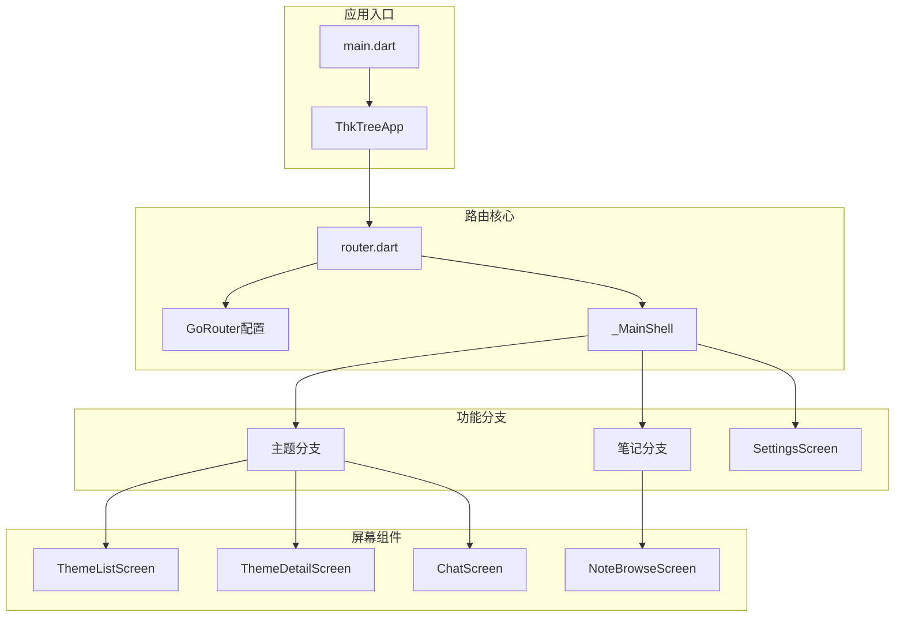
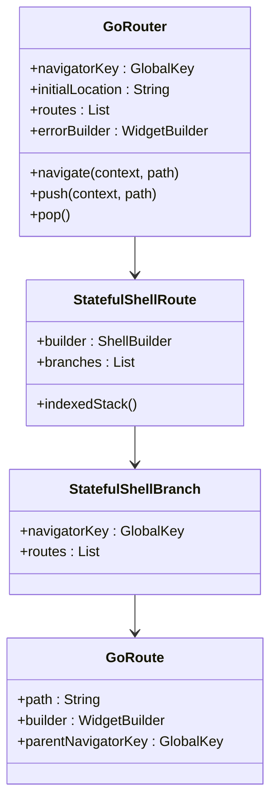
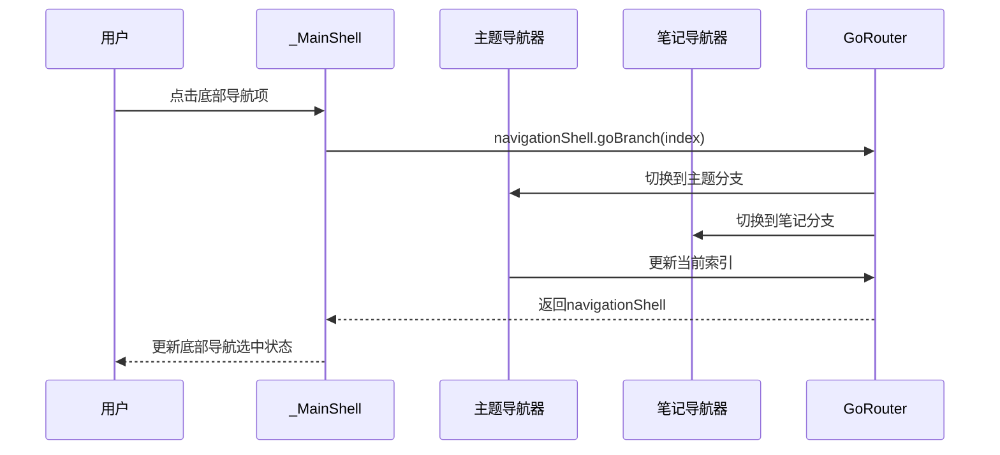
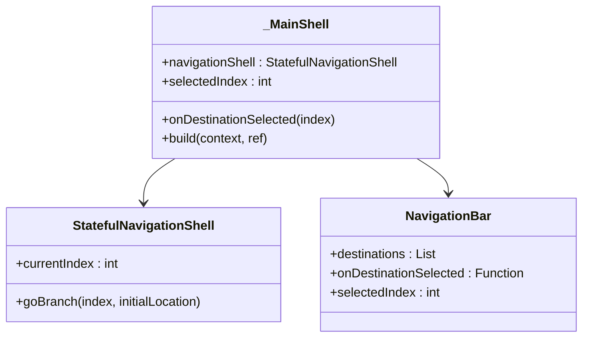
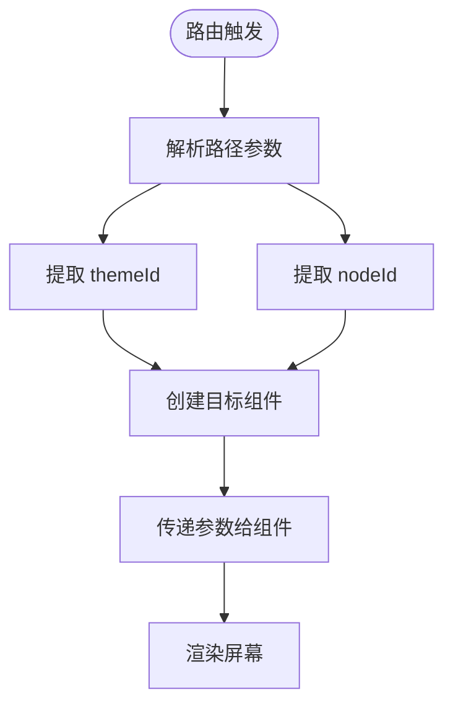
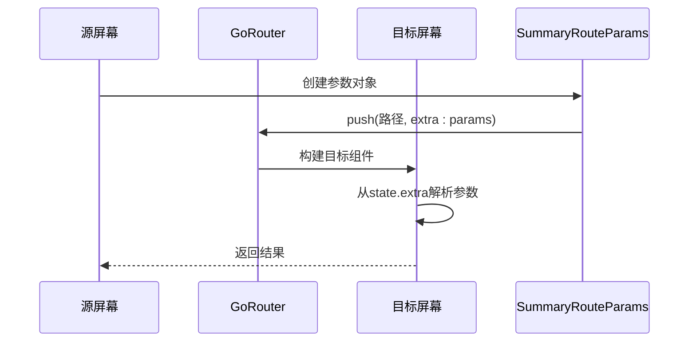
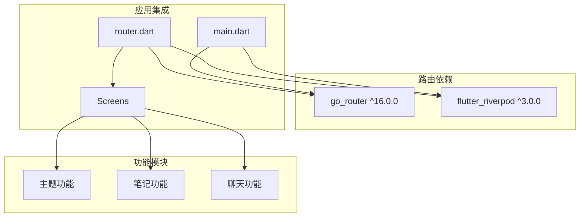
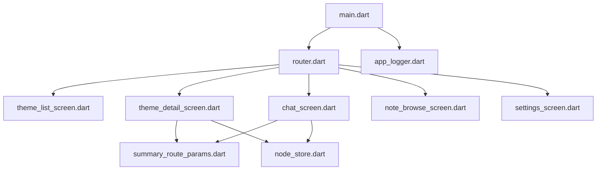
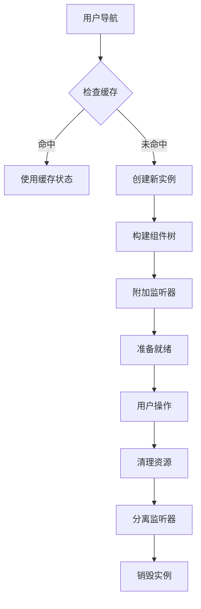
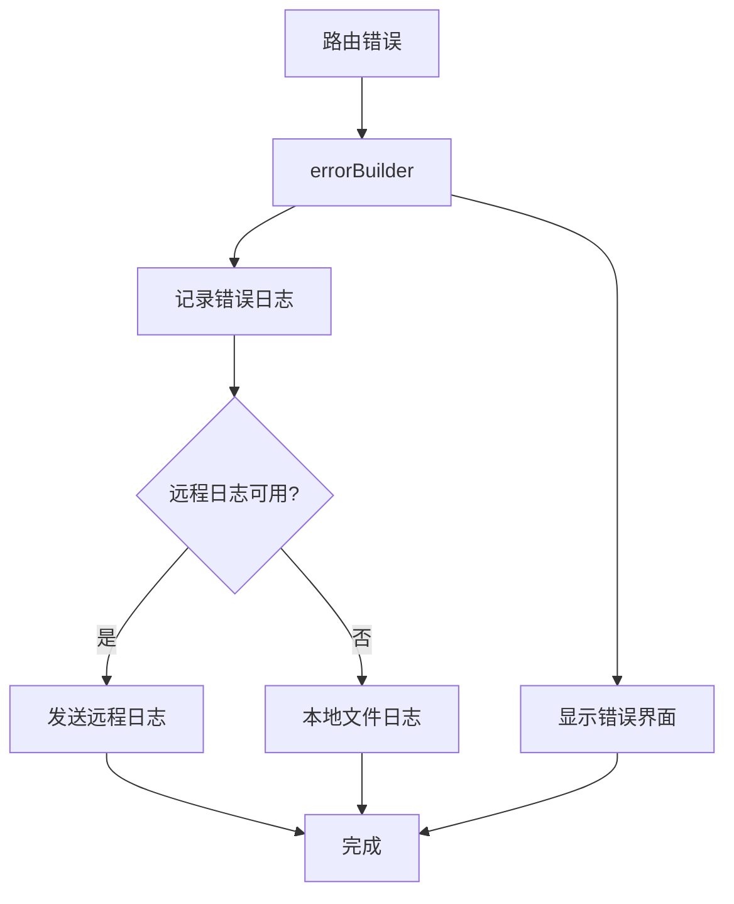

# 路由系统设计

<cite>
**本文档引用的文件**
- [main.dart](file://lib/main.dart)
- [router.dart](file://lib/ui/core/router.dart)
- [chat_screen.dart](file://lib/ui/features/chat/chat_screen.dart)
- [theme_detail_screen.dart](file://lib/ui/features/themes/theme_detail_screen.dart)
- [theme_list_screen.dart](file://lib/ui/features/themes/theme_list_screen.dart)
- [note_browse_screen.dart](file://lib/ui/features/notes/note_browse_screen.dart)
- [summary_route_params.dart](file://lib/ui/features/summary/summary_route_params.dart)
- [pubspec.yaml](file://pubspec.yaml)
- [app_logger.dart](file://lib/ui/core/app_logger.dart)
</cite>

## 目录
1. [简介](#简介)
2. [项目结构](#项目结构)
3. [核心组件](#核心组件)
4. [架构概览](#架构概览)
5. [详细组件分析](#详细组件分析)
6. [依赖关系分析](#依赖关系分析)
7. [性能考虑](#性能考虑)
8. [故障排除指南](#故障排除指南)
9. [结论](#结论)

## 简介

ThkTree 项目采用 go_router 实现声明式路由系统，支持复杂的嵌套导航模式和参数传递机制。该路由系统基于 StatefulShellRoute 的 indexedStack 模式，实现了主题浏览和笔记浏览的双分支导航结构。

## 项目结构

路由系统主要分布在以下文件中：



**图表来源**
- [main.dart:61-93](file://lib/main.dart#L61-L93)
- [router.dart:18-87](file://lib/ui/core/router.dart#L18-L87)

**章节来源**
- [main.dart:15-59](file://lib/main.dart#L15-L59)
- [router.dart:1-126](file://lib/ui/core/router.dart#L1-126)

## 核心组件

### GoRouter 配置

路由系统的核心是 GoRouter 实例，它定义了整个应用的导航结构：



**图表来源**
- [router.dart:18-87](file://lib/ui/core/router.dart#L18-L87)

### 导航键系统

项目使用多个导航键来管理不同分支的状态：

| 导航键 | 作用域 | 使用场景 |
|--------|--------|----------|
| _rootNavigatorKey | 根级导航器 | 设置页面等全局路由 |
| _themesNavigatorKey | 主题分支导航器 | 主题列表、详情、聊天界面 |
| _notesNavigatorKey | 笔记分支导航器 | 笔记浏览界面 |

**章节来源**
- [router.dart:14-16](file://lib/ui/core/router.dart#L14-L16)
- [router.dart:18-87](file://lib/ui/core/router.dart#L18-L87)

## 架构概览

### 嵌套导航模式

系统采用 StatefulShellRoute.indexedStack 模式实现底部导航栏的嵌套导航：



**图表来源**
- [router.dart:99-122](file://lib/ui/core/router.dart#L99-L122)

### 分支路由实现

系统包含两个主要的导航分支：

```mermaid
graph LR
subgraph "主题分支 (/)"
A[根路径 /] --> B[主题列表 /]
B --> C[主题详情 /themes/:themeId/tree]
C --> D[节点聊天 /themes/:themeId/nodes/:nodeId]
D --> E[摘要对话 /themes/:themeId/nodes/:parentNodeId/summary]
end
subgraph "笔记分支 (/notes)"
F[笔记浏览 /notes] --> G[笔记详情 (内部导航)]
end
subgraph "全局路由"
H[设置 /settings]
end
```

**图表来源**
- [router.dart:22-80](file://lib/ui/core/router.dart#L22-L80)

**章节来源**
- [router.dart:22-80](file://lib/ui/core/router.dart#L22-L80)

## 详细组件分析

### 主壳组件 (_MainShell)

_MainShell 是底部导航栏的实现，负责管理两个导航分支：



**图表来源**
- [router.dart:89-125](file://lib/ui/core/router.dart#L89-L125)

### 参数传递机制

系统通过多种方式实现路由参数传递：

#### 路径参数解析


**图表来源**
- [router.dart:33-46](file://lib/ui/core/router.dart#L33-L46)

#### 额外参数传递
对于复杂对象，使用 `extra` 参数进行传递：



**图表来源**
- [chat_screen.dart:90-100](file://lib/ui/features/chat/chat_screen.dart#L90-L100)
- [router.dart:48-60](file://lib/ui/core/router.dart#L48-L60)

**章节来源**
- [router.dart:33-60](file://lib/ui/core/router.dart#L33-L60)
- [chat_screen.dart:90-100](file://lib/ui/features/chat/chat_screen.dart#L90-L100)

### 导航控制

#### 程序化导航
系统提供了多种导航方式：

| 导航方式 | 方法 | 用途 |
|----------|------|------|
| 替换导航 | context.go() | 跳转到新位置，替换当前栈 |
| 推入导航 | context.push() | 推入新路由到现有栈 |
| 返回导航 | context.pop() | 返回上一页面 |
| 命名导航 | context.goNamed() | 使用命名路由 |

#### 状态保持
StatefulShellRoute 自动维护每个分支的状态，确保切换底部导航项时不会重新构建整个界面树。

**章节来源**
- [theme_detail_screen.dart:240-243](file://lib/ui/features/themes/theme_detail_screen.dart#L240-L243)
- [chat_screen.dart:53-59](file://lib/ui/features/chat/chat_screen.dart#L53-L59)

## 依赖关系分析

### 外部依赖

路由系统主要依赖以下包：



**图表来源**
- [pubspec.yaml:34](file://pubspec.yaml#L34)
- [pubspec.yaml:33](file://pubspec.yaml#L33)

### 内部依赖关系



**图表来源**
- [router.dart:1-13](file://lib/ui/core/router.dart#L1-L13)
- [pubspec.yaml:34](file://pubspec.yaml#L34)

**章节来源**
- [pubspec.yaml:30-50](file://pubspec.yaml#L30-L50)
- [router.dart:1-13](file://lib/ui/core/router.dart#L1-L13)

## 性能考虑

### 懒加载策略

系统通过以下方式实现性能优化：

1. **按需构建屏幕组件**：只有在用户访问特定路由时才构建对应组件
2. **状态保持**：StatefulShellRoute 自动维护分支状态，避免重复初始化
3. **Riverpod 提供者**：使用 FutureProvider 和 Lazy Provider 减少不必要的计算

### 内存管理



### 导航缓存

系统通过以下机制实现导航缓存：

- **IndexedStack 缓存**：StatefulShellRoute 的 indexedStack 模式自动缓存所有分支的界面状态
- **Riverpod 状态管理**：使用 Provider 模式管理应用状态，避免重复数据加载
- **异步提供者**：使用 FutureProvider 处理异步数据加载，支持缓存和重用

## 故障排除指南

### 常见问题及解决方案

#### 路由参数解析失败
**问题**：路径参数无法正确解析
**解决方案**：
1. 检查路由定义中的路径模式是否正确
2. 验证参数名称与代码中的访问名称一致
3. 确保参数类型转换正确

#### 导航键冲突
**问题**：多个导航器之间出现导航冲突
**解决方案**：
1. 确保每个分支都有独立的 navigatorKey
2. 检查 parentNavigatorKey 的设置是否正确
3. 验证导航器的作用域范围

#### 状态丢失问题
**问题**：切换底部导航项后状态丢失
**解决方案**：
1. 确认使用 StatefulShellRoute 而非普通的 ShellRoute
2. 检查分支的 navigatorKey 设置
3. 验证组件是否正确继承相应的生命周期

### 错误处理机制

系统实现了完善的错误处理：



**图表来源**
- [router.dart:81-86](file://lib/ui/core/router.dart#L81-L86)
- [app_logger.dart:102-128](file://lib/ui/core/app_logger.dart#L102-L128)

**章节来源**
- [router.dart:81-86](file://lib/ui/core/router.dart#L81-L86)
- [app_logger.dart:102-128](file://lib/ui/core/app_logger.dart#L102-L128)

## 结论

ThkTree 的路由系统通过 go_router 的 StatefulShellRoute 实现了高效的嵌套导航模式，结合 Riverpod 的状态管理，提供了良好的用户体验和性能表现。系统的关键优势包括：

1. **清晰的架构**：基于分支的导航结构使应用逻辑更加清晰
2. **状态保持**：自动维护界面状态，提升用户体验
3. **灵活的参数传递**：支持路径参数和额外参数的混合使用
4. **完善的错误处理**：提供统一的错误处理和日志记录机制
5. **性能优化**：通过懒加载和缓存机制优化应用性能

该路由系统为 ThkTree 的主题管理和笔记功能提供了坚实的基础，支持未来功能的扩展和维护。