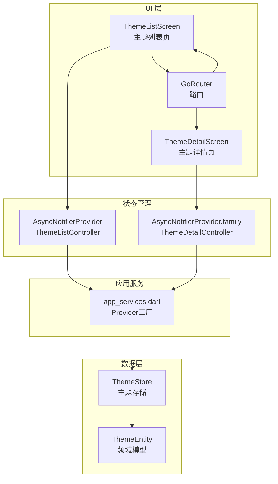
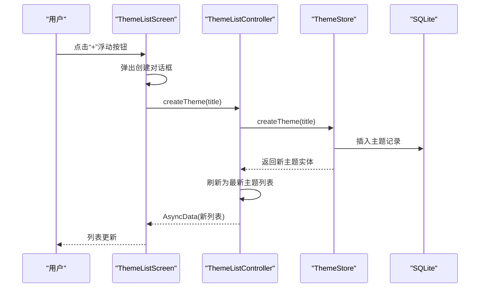
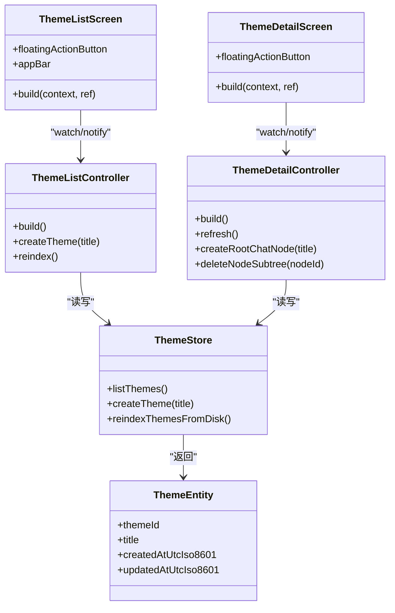

# 主题列表页面

<cite>
**本文引用的文件**
- [theme_list_screen.dart](file://lib/ui/features/themes/theme_list_screen.dart)
- [theme_list_controller.dart](file://lib/ui/features/themes/theme_list_controller.dart)
- [theme_detail_screen.dart](file://lib/ui/features/themes/theme_detail_screen.dart)
- [theme_detail_controller.dart](file://lib/ui/features/themes/theme_detail_controller.dart)
- [router.dart](file://lib/ui/core/router.dart)
- [app_services.dart](file://lib/ui/core/app_services.dart)
- [theme_store.dart](file://lib/data/stores/theme_store.dart)
- [theme.dart](file://lib/domain/theme.dart)
- [theme_list_screen_test.dart](file://test/ui/features/themes/theme_list_screen_test.dart)
</cite>

## 目录
1. [简介](#简介)
2. [项目结构](#项目结构)
3. [核心组件](#核心组件)
4. [架构总览](#架构总览)
5. [详细组件分析](#详细组件分析)
6. [依赖关系分析](#依赖关系分析)
7. [性能考量](#性能考量)
8. [故障排查指南](#故障排查指南)
9. [结论](#结论)
10. [附录：自定义与扩展建议](#附录自定义与扩展建议)

## 简介
本文件面向“主题列表页面”的完整技术文档，涵盖UI设计与交互、响应式布局、主题创建对话框（含输入验证与异步创建）、Riverpod状态管理与数据绑定、主题项点击导航与参数传递等。同时提供面向初学者的Flutter Widget构建模式讲解与面向高级开发者的性能优化建议。

## 项目结构
主题列表页面位于UI层的主题特性模块中，采用声明式路由与Riverpod状态管理，配合数据层的存储服务完成主题的增删改查与索引重建。

图表来源
- [theme_list_screen.dart:1-124](file://lib/ui/features/themes/theme_list_screen.dart#L1-L124)
- [theme_list_controller.dart:1-28](file://lib/ui/features/themes/theme_list_controller.dart#L1-L28)
- [theme_detail_screen.dart:14-90](file://lib/ui/features/themes/theme_detail_screen.dart#L14-L90)
- [theme_detail_controller.dart:19-88](file://lib/ui/features/themes/theme_detail_controller.dart#L19-L88)
- [router.dart:18-87](file://lib/ui/core/router.dart#L18-L87)
- [app_services.dart:51-55](file://lib/ui/core/app_services.dart#L51-L55)
- [theme_store.dart:11-80](file://lib/data/stores/theme_store.dart#L11-L80)
- [theme.dart:1-15](file://lib/domain/theme.dart#L1-L15)

章节来源
- [theme_list_screen.dart:1-124](file://lib/ui/features/themes/theme_list_screen.dart#L1-L124)
- [router.dart:18-87](file://lib/ui/core/router.dart#L18-L87)

## 核心组件
- 主题列表屏幕：负责渲染AppBar、浮动操作按钮、主题列表以及响应式布局；通过Riverpod读取主题列表状态并触发创建与索引重建。
- 主题列表控制器：封装异步状态加载、主题创建与索引重建，使用AsyncNotifierProvider暴露给UI。
- 路由系统：基于GoRouter，支持主题列表、主题树详情、节点会话、摘要对话等多级路由与参数传递。
- 应用服务：提供ThemeStore、NodeStore等Provider工厂，统一注入到各控制器与屏幕。
- 数据层主题存储：负责主题的创建、列表查询、磁盘索引重建与原子写入元数据。

章节来源
- [theme_list_screen.dart:8-88](file://lib/ui/features/themes/theme_list_screen.dart#L8-L88)
- [theme_list_controller.dart:5-27](file://lib/ui/features/themes/theme_list_controller.dart#L5-L27)
- [router.dart:18-87](file://lib/ui/core/router.dart#L18-L87)
- [app_services.dart:51-55](file://lib/ui/core/app_services.dart#L51-L55)
- [theme_store.dart:17-80](file://lib/data/stores/theme_store.dart#L17-L80)

## 架构总览
主题列表页面采用“UI-状态-数据”三层解耦：
- UI层：ThemeListScreen消费异步状态，触发用户交互（创建、索引、设置跳转）。
- 状态层：ThemeListController继承AsyncNotifier，负责首次加载、创建主题、重建索引。
- 数据层：ThemeStore负责磁盘扫描、主题元数据写入、数据库同步与查询。

图表来源
- [theme_list_screen.dart:77-85](file://lib/ui/features/themes/theme_list_screen.dart#L77-L85)
- [theme_list_controller.dart:13-17](file://lib/ui/features/themes/theme_list_controller.dart#L13-L17)
- [theme_store.dart:31-80](file://lib/data/stores/theme_store.dart#L31-L80)

## 详细组件分析

### 主题列表屏幕（UI）
- AppBar配置：包含标题、同步索引动作与设置入口，便于快速刷新与进入设置。
- 列表展示：使用when(data/error/loading)处理异步状态；空列表时显示提示文本；列表项为ListTile，带标题、副标题（调试模式可见ID）、右侧指示图标。
- 响应式布局：通过LayoutBuilder读取约束，当最大宽度超过阈值时，使用ConstrainedBox限制内容最大宽度并居中，提升大屏阅读体验。
- 导航逻辑：点击主题项跳转至“/themes/:themeId/tree”，携带主题ID参数。
- 浮动操作按钮：弹出创建对话框，输入标题后调用控制器创建主题并自动刷新列表。

章节来源
- [theme_list_screen.dart:15-88](file://lib/ui/features/themes/theme_list_screen.dart#L15-L88)

#### 创建对话框与输入验证
- 对话框：使用AlertDialog与TextField，支持回车提交与按钮确认两种方式。
- 输入处理：onSubmitted在IME组合状态有效且未折叠时阻止提交；提交时对输入进行trim并判空，空则返回null，非空则返回trim后的字符串。
- 用户交互：取消按钮直接关闭；创建按钮同样进行trim与判空处理。

章节来源
- [theme_list_screen.dart:90-124](file://lib/ui/features/themes/theme_list_screen.dart#L90-L124)

#### 列表项点击导航与参数传递
- 点击主题项：使用context.push跳转至“/themes/:themeId/tree”，GoRouter解析路径参数themeId并传入ThemeDetailScreen。
- 参数传递：路由定义中从state.pathParameters提取themeId，确保详情页可按主题ID加载数据。

章节来源
- [theme_list_screen.dart:50](file://lib/ui/features/themes/theme_list_screen.dart#L50)
- [router.dart:32-37](file://lib/ui/core/router.dart#L32-L37)

### 主题列表控制器（状态管理）
- 首次加载：构建阶段读取ThemeStore，执行reindexThemesFromDisk后返回listThemes结果。
- 创建主题：调用store.createTheme，随后刷新state为最新列表。
- 索引重建：调用store.reindexThemesFromDisk后刷新state，保证磁盘与数据库一致。

章节来源
- [theme_list_controller.dart:7-23](file://lib/ui/features/themes/theme_list_controller.dart#L7-L23)

### 主题详情屏幕（导航与交互）
- 路由参数：接收themeId，通过themeDetailControllerProvider加载主题标题、路径与节点集合。
- 导航栏：返回按钮支持可回退与兜底到根；右侧刷新按钮触发控制器refresh。
- 列表渲染：根节点按创建时间排序，使用自定义_treeRowView绘制树形连接线与子节点递归。
- 新增节点：详情页FloatingActionButton弹出对话框，调用控制器createRootChatNode创建根会话节点。
- 删除节点：支持删除整棵子树，删除前收集同名节点以提示用户，删除后显示计数反馈。

章节来源
- [theme_detail_screen.dart:23-89](file://lib/ui/features/themes/theme_detail_screen.dart#L23-L89)
- [theme_detail_controller.dart:29-61](file://lib/ui/features/themes/theme_detail_controller.dart#L29-L61)

### 路由与参数传递
- 主题列表路由："/"对应ThemeListScreen。
- 主题树详情路由："themes/:themeId/tree"，从路径参数提取themeId传入ThemeDetailScreen。
- 节点会话路由："themes/:themeId/nodes/:nodeId"，支持通过state.extra传递节点标题。
- 摘要对话路由："themes/:themeId/nodes/:parentNodeId/summary"，通过state.extra传递SummaryRouteParams对象。

章节来源
- [router.dart:28-61](file://lib/ui/core/router.dart#L28-L61)

### 数据绑定与异步加载（Riverpod）
- Provider工厂：app_services.dart中定义themeStoreProvider与nodeStoreProvider，供控制器与屏幕使用。
- 列表状态：ThemeListController继承AsyncNotifier<List<ThemeEntity>>，首次构建时reindex并listThemes。
- 详情状态：ThemeDetailController继承AsyncNotifier<ThemeDetailState>，按themeId加载主题信息与节点集合。
- 自动释放：themeDetailControllerProvider使用family并标注autoDispose，避免内存泄漏。

章节来源
- [app_services.dart:51-61](file://lib/ui/core/app_services.dart#L51-L61)
- [theme_list_controller.dart:26-27](file://lib/ui/features/themes/theme_list_controller.dart#L26-L27)
- [theme_detail_controller.dart:84-87](file://lib/ui/features/themes/theme_detail_controller.dart#L84-L87)

### 数据模型与存储
- 领域模型：ThemeEntity包含主题ID、标题、创建与更新时间。
- 存储实现：ThemeStore.listThemes从数据库查询并映射；createTheme生成唯一ID、创建目录、写入theme.meta.json、插入数据库；reindexThemesFromDisk扫描磁盘并重建数据库索引。

章节来源
- [theme.dart:1-15](file://lib/domain/theme.dart#L1-L15)
- [theme_store.dart:17-80](file://lib/data/stores/theme_store.dart#L17-L80)

## 依赖关系分析

图表来源
- [theme_list_screen.dart:8-88](file://lib/ui/features/themes/theme_list_screen.dart#L8-L88)
- [theme_list_controller.dart:5-27](file://lib/ui/features/themes/theme_list_controller.dart#L5-L27)
- [theme_detail_screen.dart:14-90](file://lib/ui/features/themes/theme_detail_screen.dart#L14-L90)
- [theme_detail_controller.dart:19-88](file://lib/ui/features/themes/theme_detail_controller.dart#L19-L88)
- [theme_store.dart:11-80](file://lib/data/stores/theme_store.dart#L11-L80)
- [theme.dart:1-15](file://lib/domain/theme.dart#L1-15)

## 性能考量
- 列表渲染：使用ListView.separated进行分隔符渲染，避免不必要的重绘；在大屏上通过ConstrainedBox限制最大宽度，减少过度横向拉伸。
- 异步状态：使用when(data/error/loading)避免重复渲染与闪烁；控制器在创建主题后仅刷新一次列表，减少数据库查询次数。
- 磁盘索引：reindexThemesFromDisk在首次加载与手动触发时执行，确保数据库与磁盘一致；建议在后台任务或空闲时段触发，避免阻塞主线程。
- 资源释放：主题详情控制器使用family与autoDispose，避免长时间驻留导致内存占用。

章节来源
- [theme_list_screen.dart:34-72](file://lib/ui/features/themes/theme_list_screen.dart#L34-L72)
- [theme_list_controller.dart:7-23](file://lib/ui/features/themes/theme_list_controller.dart#L7-L23)
- [theme_detail_controller.dart:84-87](file://lib/ui/features/themes/theme_detail_controller.dart#L84-L87)

## 故障排查指南
- 列表为空：检查ThemeStore.reindexThemesFromDisk是否成功执行；确认磁盘存在theme.meta.json且可读。
- 创建失败：核对ThemeStore.createTheme的唯一ID生成与目录创建逻辑；检查数据库冲突处理与原子写入。
- 导航异常：确认GoRouter路由定义与路径参数提取；检查push时extra类型与接收端解析。
- 响应式布局溢出：使用LayoutBuilder与ConstrainedBox限制宽度；避免在Column/Row中直接放置无约束的ListView。

章节来源
- [theme_store.dart:110-139](file://lib/data/stores/theme_store.dart#L110-L139)
- [router.dart:32-61](file://lib/ui/core/router.dart#L32-L61)
- [theme_list_screen.dart:34-72](file://lib/ui/features/themes/theme_list_screen.dart#L34-L72)

## 结论
主题列表页面通过清晰的UI-状态-数据分层，结合Riverpod的异步状态管理与GoRouter的参数化路由，实现了简洁高效的用户体验。响应式布局与对话框交互提升了可用性，而磁盘索引与原子写入保障了数据一致性。建议在后续迭代中进一步优化大屏布局、增强错误提示与离线能力。

## 附录：自定义与扩展建议

### 自定义主题列表样式
- 修改列表项外观：替换ListTile为自定义卡片或网格项，结合Theme.of(context)调整字体与颜色。
- 添加分组/筛选：在UI层增加筛选器或分组头部，结合when.loading显示骨架屏。
- 大屏优化：在LayoutBuilder中根据maxWidth切换为两列或多列布局，使用GridView.builder提升性能。

章节来源
- [theme_list_screen.dart:40-70](file://lib/ui/features/themes/theme_list_screen.dart#L40-L70)

### 添加新的交互功能
- 批量操作：在AppBar添加菜单，支持批量删除或重命名主题。
- 拖拽排序：引入DragTarget/Draggable实现主题排序，完成后更新数据库排序字段。
- 搜索过滤：在AppBar添加搜索框，实时过滤主题列表并更新状态。

章节来源
- [theme_list_screen.dart:16-28](file://lib/ui/features/themes/theme_list_screen.dart#L16-L28)

### 面向初学者的Flutter Widget构建模式
- 声明式UI：优先使用Widget树描述界面，通过ConsumerWidget/ConsumerStatefulWidget消费Provider状态。
- 状态提升：将共享状态放在Provider中，避免跨组件传递回调地狱。
- 异步处理：使用AsyncNotifier与when(data/error/loading)统一处理异步加载状态。
- 响应式布局：使用LayoutBuilder读取约束，按maxWidth切换布局策略。

章节来源
- [theme_list_controller.dart:5-27](file://lib/ui/features/themes/theme_list_controller.dart#L5-L27)
- [theme_list_screen.dart:29-76](file://lib/ui/features/themes/theme_list_screen.dart#L29-L76)

### 面向高级开发者的性能优化建议
- 列表虚拟化：使用ListView.separated或GridView.builder，避免一次性渲染大量节点。
- 数据库批处理：reindexThemesFromDisk使用事务批量插入，减少I/O开销。
- 缓存与去抖：对频繁触发的reindex操作加入去抖或节流，避免重复索引。
- 内存管理：对长列表使用IndexedStack或autoDispose，及时释放不再使用的控制器实例。

章节来源
- [theme_store.dart:122-138](file://lib/data/stores/theme_store.dart#L122-L138)
- [theme_detail_controller.dart:84-87](file://lib/ui/features/themes/theme_detail_controller.dart#L84-L87)