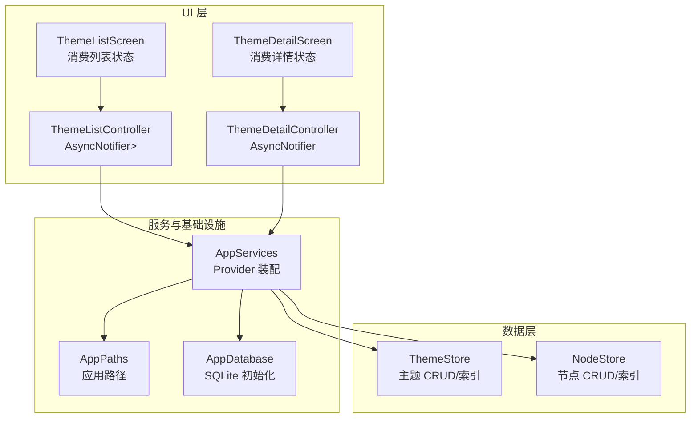
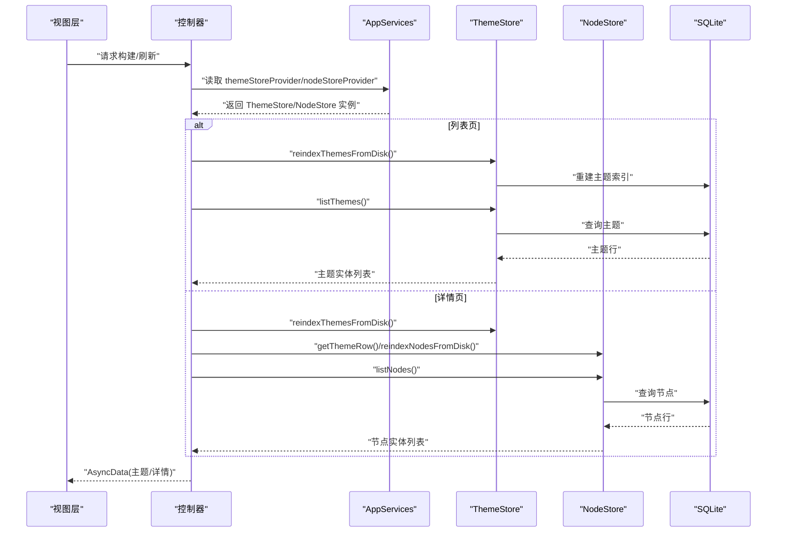
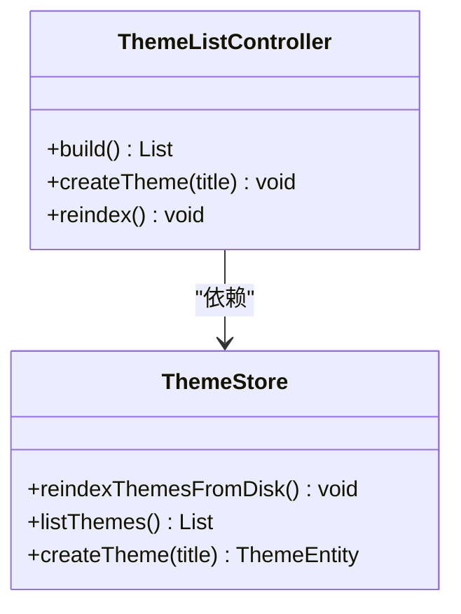
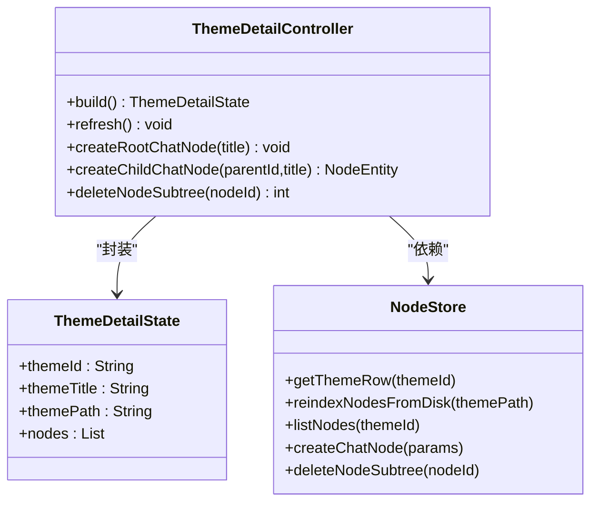
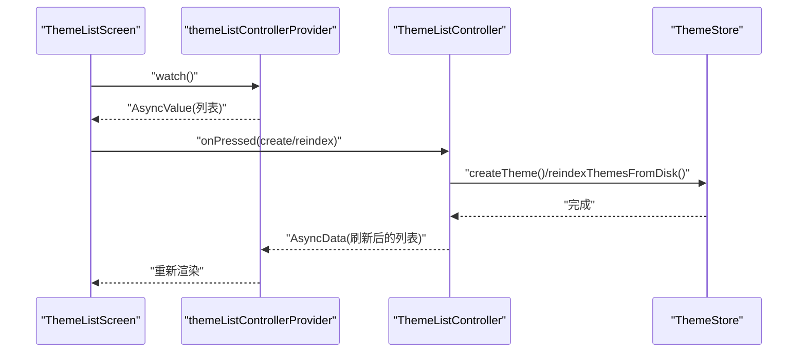
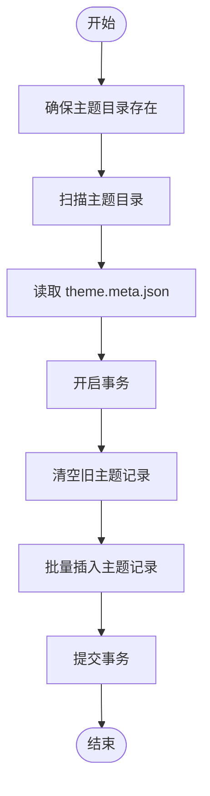
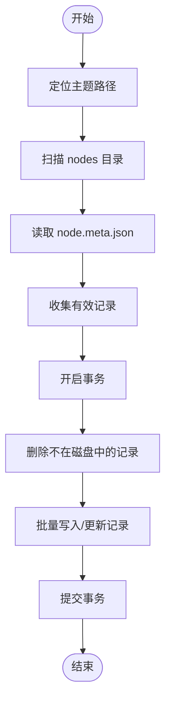
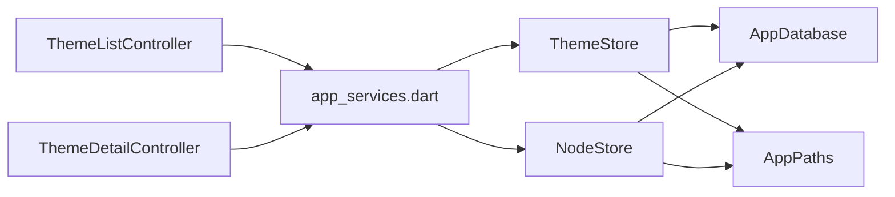

# 主题控制器

<cite>
**本文引用的文件**
- [lib/ui/features/themes/theme_list_controller.dart](file://lib/ui/features/themes/theme_list_controller.dart)
- [lib/ui/features/themes/theme_detail_controller.dart](file://lib/ui/features/themes/theme_detail_controller.dart)
- [lib/ui/features/themes/theme_list_screen.dart](file://lib/ui/features/themes/theme_list_screen.dart)
- [lib/ui/features/themes/theme_detail_screen.dart](file://lib/ui/features/themes/theme_detail_screen.dart)
- [lib/ui/core/app_services.dart](file://lib/ui/core/app_services.dart)
- [lib/data/stores/theme_store.dart](file://lib/data/stores/theme_store.dart)
- [lib/data/stores/node_store.dart](file://lib/data/stores/node_store.dart)
- [lib/domain/theme.dart](file://lib/domain/theme.dart)
- [lib/domain/node.dart](file://lib/domain/node.dart)
- [lib/data/models/theme_meta.dart](file://lib/data/models/theme_meta.dart)
- [lib/ui/core/app_paths.dart](file://lib/ui/core/app_paths.dart)
- [lib/data/services/app_database.dart](file://lib/data/services/app_database.dart)
- [test/ui/features/themes/theme_list_screen_test.dart](file://test/ui/features/themes/theme_list_screen_test.dart)
- [test/widget_test.dart](file://test/widget_test.dart)
</cite>

## 目录
1. [引言](#引言)
2. [项目结构](#项目结构)
3. [核心组件](#核心组件)
4. [架构总览](#架构总览)
5. [详细组件分析](#详细组件分析)
6. [依赖关系分析](#依赖关系分析)
7. [性能考虑](#性能考虑)
8. [故障排查指南](#故障排查指南)
9. [结论](#结论)
10. [附录](#附录)

## 引言
本文件围绕“主题控制器”展开，系统性阐述其设计模式、状态管理策略（基于 Riverpod AsyncNotifier）、异步状态处理、主题数据的获取/缓存/更新机制、数据同步与冲突解决、以及与数据层的交互模式（依赖注入与错误处理）。同时提供扩展控制器功能、添加业务规则与自定义状态管理的实践建议，并兼顾初学者与高级开发者的不同需求。

## 项目结构
主题控制器位于 UI 层的特性模块中，通过 Riverpod 提供的状态容器与数据层 Store 解耦，形成清晰的关注点分离：
- 控制器：负责异步加载、刷新、业务操作触发与状态更新
- 视图：消费控制器提供的 AsyncValue 状态并渲染
- 数据层：ThemeStore/NodeStore 负责磁盘与数据库的读写、索引重建与一致性维护
- 服务与路径：AppServices 统一装配 Provider；AppPaths/AppDatabase 提供路径与数据库初始化

图表来源
- [lib/ui/features/themes/theme_list_screen.dart:12-88](file://lib/ui/features/themes/theme_list_screen.dart#L12-L88)
- [lib/ui/features/themes/theme_detail_screen.dart:23-89](file://lib/ui/features/themes/theme_detail_screen.dart#L23-L89)
- [lib/ui/features/themes/theme_list_controller.dart:5-27](file://lib/ui/features/themes/theme_list_controller.dart#L5-L27)
- [lib/ui/features/themes/theme_detail_controller.dart:19-87](file://lib/ui/features/themes/theme_detail_controller.dart#L19-L87)
- [lib/ui/core/app_services.dart:51-61](file://lib/ui/core/app_services.dart#L51-L61)
- [lib/data/stores/theme_store.dart:11-139](file://lib/data/stores/theme_store.dart#L11-L139)
- [lib/data/stores/node_store.dart:12-59](file://lib/data/stores/node_store.dart#L12-L59)

章节来源
- [lib/ui/features/themes/theme_list_screen.dart:8-125](file://lib/ui/features/themes/theme_list_screen.dart#L8-L125)
- [lib/ui/features/themes/theme_detail_screen.dart:14-428](file://lib/ui/features/themes/theme_detail_screen.dart#L14-L428)
- [lib/ui/features/themes/theme_list_controller.dart:1-28](file://lib/ui/features/themes/theme_list_controller.dart#L1-L28)
- [lib/ui/features/themes/theme_detail_controller.dart:1-88](file://lib/ui/features/themes/theme_detail_controller.dart#L1-L88)
- [lib/ui/core/app_services.dart:1-171](file://lib/ui/core/app_services.dart#L1-L171)

## 核心组件
- 主题列表控制器（ThemeListController）
  - 基于 AsyncNotifier<List<ThemeEntity>>
  - 首次构建时从 ThemeStore 重建索引并列出主题
  - 支持创建主题与手动重建索引，均在成功后刷新状态
- 主题详情控制器（ThemeDetailController）
  - 基于 AsyncNotifier<ThemeDetailState>
  - 构建时先重建主题索引，再定位主题元信息与节点索引，最后列出节点
  - 支持刷新、创建根会话节点、创建子节点、删除子树等操作，每次操作后刷新状态
- 视图层
  - ThemeListScreen 消费列表控制器，支持新建主题与同步索引
  - ThemeDetailScreen 消费详情控制器，支持刷新、新建根节点、分支摘要、删除节点等

章节来源
- [lib/ui/features/themes/theme_list_controller.dart:5-27](file://lib/ui/features/themes/theme_list_controller.dart#L5-L27)
- [lib/ui/features/themes/theme_detail_controller.dart:19-87](file://lib/ui/features/themes/theme_detail_controller.dart#L19-L87)
- [lib/ui/features/themes/theme_list_screen.dart:8-125](file://lib/ui/features/themes/theme_list_screen.dart#L8-L125)
- [lib/ui/features/themes/theme_detail_screen.dart:14-428](file://lib/ui/features/themes/theme_detail_screen.dart#L14-L428)

## 架构总览
主题控制器采用“视图-控制器-服务-数据层”的分层架构，Riverpod 提供统一的状态与依赖注入入口。控制器通过 FutureProvider 注入的 ThemeStore/NodeStore 访问磁盘与数据库，保证 UI 的无副作用与可测试性。

图表来源
- [lib/ui/features/themes/theme_list_controller.dart:7-11](file://lib/ui/features/themes/theme_list_controller.dart#L7-L11)
- [lib/ui/features/themes/theme_detail_controller.dart:25-44](file://lib/ui/features/themes/theme_detail_controller.dart#L25-L44)
- [lib/ui/core/app_services.dart:51-61](file://lib/ui/core/app_services.dart#L51-L61)
- [lib/data/stores/theme_store.dart:110-139](file://lib/data/stores/theme_store.dart#L110-L139)
- [lib/data/stores/node_store.dart:18-59](file://lib/data/stores/node_store.dart#L18-L59)

## 详细组件分析

### 主题列表控制器（ThemeListController）
- 设计模式
  - 使用 AsyncNotifier<List<ThemeEntity>> 管理异步状态
  - 通过 FutureProvider 注入 ThemeStore，实现依赖注入与解耦
- 状态管理
  - 构建阶段：重建主题索引 -> 查询主题列表
  - 更新策略：创建/重建索引后，将最新结果封装为 AsyncData 写回状态
- 异步处理
  - 所有操作均为 Future<void>，确保 UI 在等待期间显示 Loading
- 业务操作
  - 创建主题：调用 ThemeStore.createTheme 后刷新列表
  - 重建索引：调用 ThemeStore.reindexThemesFromDisk 后刷新列表

图表来源
- [lib/ui/features/themes/theme_list_controller.dart:5-27](file://lib/ui/features/themes/theme_list_controller.dart#L5-L27)
- [lib/data/stores/theme_store.dart:11-139](file://lib/data/stores/theme_store.dart#L11-L139)

章节来源
- [lib/ui/features/themes/theme_list_controller.dart:5-27](file://lib/ui/features/themes/theme_list_controller.dart#L5-L27)
- [lib/ui/core/app_services.dart:51-55](file://lib/ui/core/app_services.dart#L51-L55)

### 主题详情控制器（ThemeDetailController）
- 设计模式
  - 使用 AsyncNotifier<ThemeDetailState>，状态对象包含主题标识、标题、路径与节点列表
  - 通过 family Provider 接受 themeId 参数，实现按主题隔离的状态
- 状态管理
  - 构建阶段：重建主题索引 -> 获取主题元信息 -> 重建节点索引 -> 列出节点
  - 刷新：设置为 AsyncLoading 后重新加载
- 业务操作
  - 刷新：refresh()
  - 创建根会话节点：createRootChatNode()
  - 创建子节点：createChildChatNode()
  - 删除子树：deleteNodeSubtree()

图表来源
- [lib/ui/features/themes/theme_detail_controller.dart:5-87](file://lib/ui/features/themes/theme_detail_controller.dart#L5-L87)
- [lib/data/stores/node_store.dart:18-235](file://lib/data/stores/node_store.dart#L18-L235)

章节来源
- [lib/ui/features/themes/theme_detail_controller.dart:19-87](file://lib/ui/features/themes/theme_detail_controller.dart#L19-L87)
- [lib/ui/core/app_services.dart:57-61](file://lib/ui/core/app_services.dart#L57-L61)

### 视图层与控制器交互
- ThemeListScreen
  - 监听列表控制器状态，分别渲染空态、列表与加载态
  - 提供新建主题与同步索引的操作入口
- ThemeDetailScreen
  - 监听详情控制器状态，渲染树形节点
  - 提供刷新、新建根节点、分支摘要、删除节点等操作入口

图表来源
- [lib/ui/features/themes/theme_list_screen.dart:12-88](file://lib/ui/features/themes/theme_list_screen.dart#L12-L88)
- [lib/ui/features/themes/theme_list_controller.dart:13-23](file://lib/ui/features/themes/theme_list_controller.dart#L13-L23)

章节来源
- [lib/ui/features/themes/theme_list_screen.dart:8-125](file://lib/ui/features/themes/theme_list_screen.dart#L8-L125)
- [lib/ui/features/themes/theme_detail_screen.dart:23-89](file://lib/ui/features/themes/theme_detail_screen.dart#L23-L89)

### 数据层交互与同步机制

#### 主题数据获取、缓存与更新
- 主题索引重建
  - 通过 ThemeStore.reindexThemesFromDisk 从磁盘扫描主题目录，读取 theme.meta.json 并写入 SQLite
  - 使用事务批量插入，避免部分写入导致的不一致
- 主题列表查询
  - 通过 ThemeStore.listThemes 从 SQLite 查询并映射为 ThemeEntity
- 主题创建
  - 分配唯一主题 ID，创建主题目录与 meta 文件，写入 SQLite
  - 使用冲突算法避免重复与竞态

图表来源
- [lib/data/stores/theme_store.dart:110-139](file://lib/data/stores/theme_store.dart#L110-L139)
- [lib/data/models/theme_meta.dart:30-58](file://lib/data/models/theme_meta.dart#L30-L58)

章节来源
- [lib/data/stores/theme_store.dart:11-139](file://lib/data/stores/theme_store.dart#L11-L139)
- [lib/data/models/theme_meta.dart:1-61](file://lib/data/models/theme_meta.dart#L1-L61)

#### 节点数据获取、缓存与更新
- 节点索引重建
  - 通过 NodeStore.reindexNodesFromDisk 递归扫描 nodes 目录，读取 node.meta.json 并写入 SQLite
  - 对比磁盘与数据库，删除已不存在的节点记录，保持一致性
- 节点列表查询
  - 通过 NodeStore.listNodes 按主题过滤并排序
- 节点创建
  - 分配唯一节点 ID，创建节点目录与 meta、session 文件，写入 SQLite
- 节点删除
  - 递归收集子树 ID，删除对应目录与数据库记录，随后重建索引

图表来源
- [lib/data/stores/node_store.dart:18-59](file://lib/data/stores/node_store.dart#L18-L59)

章节来源
- [lib/data/stores/node_store.dart:12-235](file://lib/data/stores/node_store.dart#L12-L235)

### 错误处理与冲突解决
- 主题/节点未找到
  - 当数据库或磁盘中找不到目标主题/节点时，抛出 StateError，由上层捕获并提示用户
- 索引一致性
  - 通过事务与“先删后插”的策略，确保索引重建过程中的原子性
- 路径解析
  - AppPaths 提供相对/绝对路径转换，避免跨平台路径差异导致的查找失败
- 会话路径回退
  - AppServices 中的 sessionStoreProvider 在 DB 记录失效时回退到文件系统递归扫描，修复“陈旧 DB 记录”的问题

章节来源
- [lib/data/stores/theme_store.dart:82-108](file://lib/data/stores/theme_store.dart#L82-L108)
- [lib/data/stores/node_store.dart:206-235](file://lib/data/stores/node_store.dart#L206-L235)
- [lib/ui/core/app_services.dart:92-167](file://lib/ui/core/app_services.dart#L92-L167)
- [lib/ui/core/app_paths.dart:62-74](file://lib/ui/core/app_paths.dart#L62-L74)

### 依赖注入与 Provider 架构
- AppServices 统一装配
  - appPathsProvider、appDatabaseProvider、themeStoreProvider、nodeStoreProvider
  - 控制器通过 FutureProvider 注入 Store，避免直接构造依赖
- 控制器 Provider
  - themeListControllerProvider：AsyncNotifierProvider
  - themeDetailControllerProvider：AsyncNotifierProvider.autoDispose.family

章节来源
- [lib/ui/core/app_services.dart:27-61](file://lib/ui/core/app_services.dart#L27-L61)
- [lib/ui/features/themes/theme_list_controller.dart:26-27](file://lib/ui/features/themes/theme_list_controller.dart#L26-L27)
- [lib/ui/features/themes/theme_detail_controller.dart:84-87](file://lib/ui/features/themes/theme_detail_controller.dart#L84-L87)

### 测试与可测试性
- 单元测试
  - 使用 FakeThemeListController 覆盖空态与多主题场景
  - 使用 ProviderScope.overrideWith 注入假控制器，验证 UI 行为
- Widget 测试
  - 通过覆盖 themeListControllerProvider 验证启动页行为

章节来源
- [test/ui/features/themes/theme_list_screen_test.dart:8-97](file://test/ui/features/themes/theme_list_screen_test.dart#L8-L97)
- [test/widget_test.dart:16-43](file://test/widget_test.dart#L16-L43)

## 依赖关系分析

图表来源
- [lib/ui/features/themes/theme_list_controller.dart:1-3](file://lib/ui/features/themes/theme_list_controller.dart#L1-L3)
- [lib/ui/features/themes/theme_detail_controller.dart:1-3](file://lib/ui/features/themes/theme_detail_controller.dart#L1-L3)
- [lib/ui/core/app_services.dart:51-61](file://lib/ui/core/app_services.dart#L51-L61)
- [lib/data/stores/theme_store.dart:11-15](file://lib/data/stores/theme_store.dart#L11-L15)
- [lib/data/stores/node_store.dart:12-16](file://lib/data/stores/node_store.dart#L12-L16)
- [lib/data/services/app_database.dart:3-17](file://lib/data/services/app_database.dart#L3-L17)
- [lib/ui/core/app_paths.dart:7-15](file://lib/ui/core/app_paths.dart#L7-L15)

章节来源
- [lib/ui/core/app_services.dart:1-171](file://lib/ui/core/app_services.dart#L1-L171)
- [lib/data/stores/theme_store.dart:1-157](file://lib/data/stores/theme_store.dart#L1-L157)
- [lib/data/stores/node_store.dart:1-414](file://lib/data/stores/node_store.dart#L1-L414)

## 性能考虑
- 索引重建
  - 使用事务批量写入，减少多次 I/O 与锁竞争
  - 仅在必要时重建索引（首次构建、手动同步），避免频繁全量扫描
- 查询优化
  - SQLite 为 nodes 表建立复合索引，加速按主题与父节点的查询
- 状态刷新
  - 控制器在成功写入后才刷新状态，避免不必要的重渲染
- 路径转换
  - AppPaths 提供统一的相对/绝对路径转换，减少字符串拼接与异常

章节来源
- [lib/data/stores/theme_store.dart:122-138](file://lib/data/stores/theme_store.dart#L122-L138)
- [lib/data/stores/node_store.dart:26-58](file://lib/data/stores/node_store.dart#L26-L58)
- [lib/data/services/app_database.dart:45-46](file://lib/data/services/app_database.dart#L45-L46)
- [lib/ui/core/app_paths.dart:62-74](file://lib/ui/core/app_paths.dart#L62-L74)

## 故障排查指南
- 主题列表为空
  - 检查是否执行了 reindexThemesFromDisk
  - 确认 theme.meta.json 是否存在且格式正确
- 节点无法加载
  - 检查 node.meta.json 是否存在且可解析
  - 确认 SQLite 中是否存在对应记录
- 会话路径异常
  - 查看 AppServices 中的回退逻辑是否被触发
  - 确认 DB 记录与文件系统是否一致
- 创建失败
  - 检查主题/节点 ID 分配是否成功（尝试次数限制）
  - 确认磁盘写入权限与路径有效性

章节来源
- [lib/ui/core/app_services.dart:92-167](file://lib/ui/core/app_services.dart#L92-L167)
- [lib/data/stores/theme_store.dart:35-52](file://lib/data/stores/theme_store.dart#L35-L52)
- [lib/data/stores/node_store.dart:141-163](file://lib/data/stores/node_store.dart#L141-L163)

## 结论
主题控制器以 Riverpod AsyncNotifier 为核心，结合 ThemeStore/NodeStore 实现主题与节点的数据获取、缓存与更新。通过事务与索引重建保障一致性，通过 Provider 实现依赖注入与可测试性。该架构既满足初学者理解状态管理与异步编程，也为高级开发者提供了扩展点与性能优化空间。

## 附录

### 扩展控制器功能的实践建议
- 新增业务规则
  - 在控制器中增加前置校验（如标题长度、唯一性）与后置刷新
  - 将复杂流程拆分为私有方法，提升可读性与可测性
- 自定义状态管理
  - 使用 Notifier 或 ValueListenable 替代 AsyncNotifier，适用于无需异步加载的场景
  - 通过 ProviderScope.overrideWith 注入假实现，便于单元测试
- 性能监控与内存优化
  - 在关键路径埋点日志，结合 AppLogger 追踪耗时
  - 对高频操作（如列表滚动）使用 AutoDispose Provider 减少内存占用
  - 对大列表使用延迟加载与分页策略

### 初学者学习要点
- AsyncNotifier 与 AsyncValue 的生命周期与状态流转
- FutureProvider 的懒加载与依赖注入
- 事务与索引重建的原子性与一致性
- 路径抽象与跨平台兼容

### 高级开发者技术要点
- 事务批处理与冲突算法选择
- SQLite 索引设计与查询优化
- Provider 的作用域与自动清理策略
- 日志与可观测性在异步流程中的应用