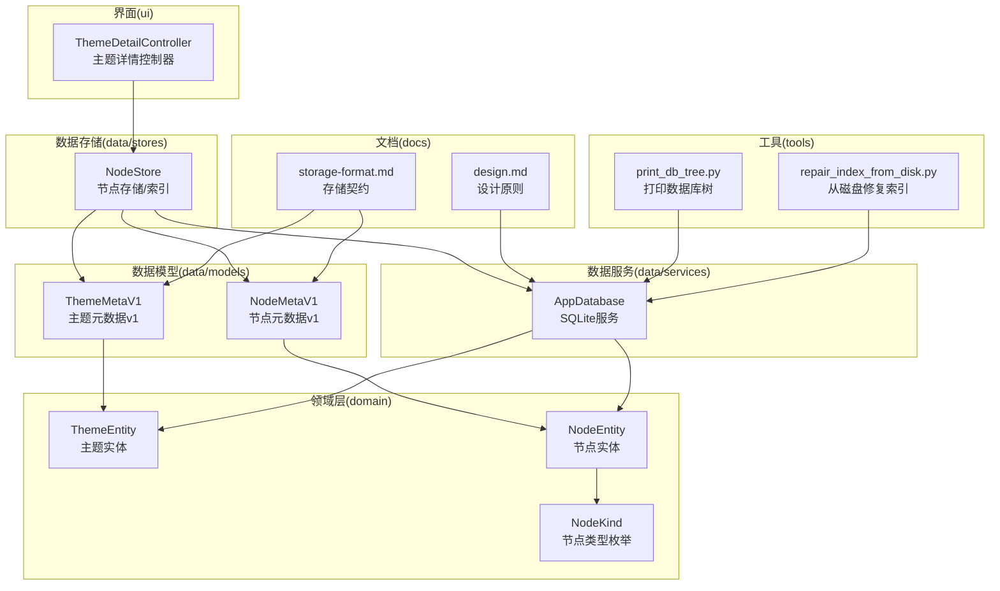
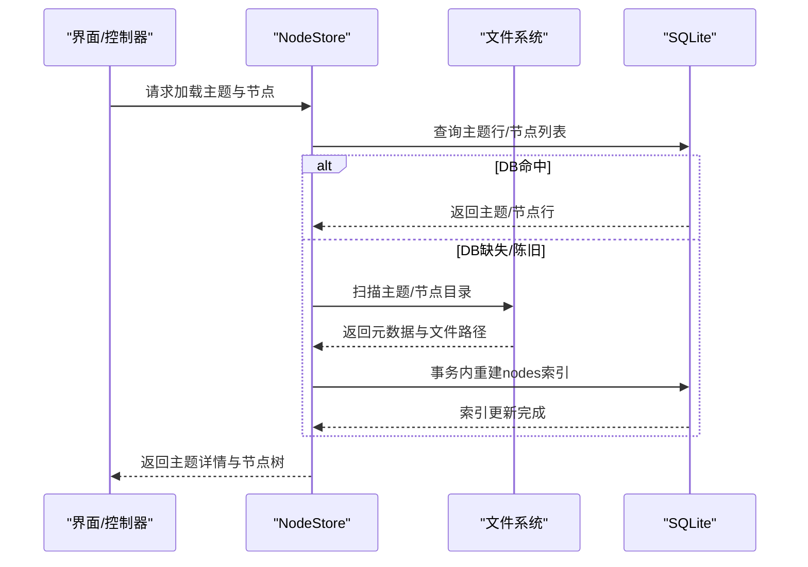
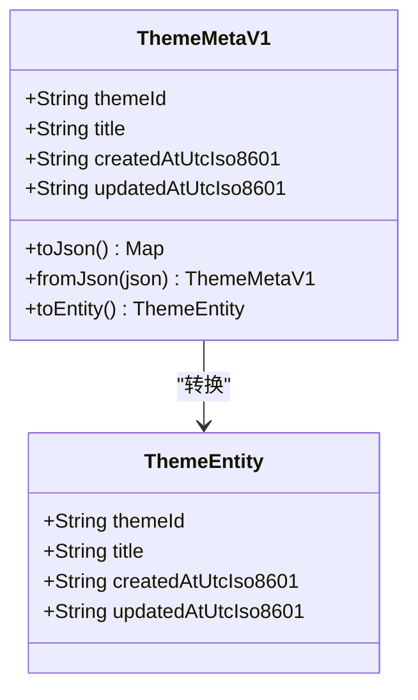
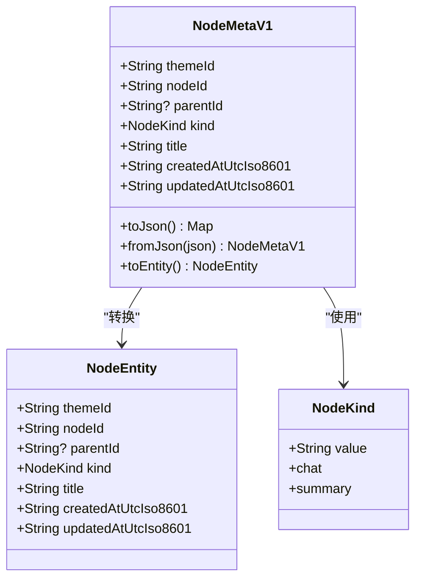
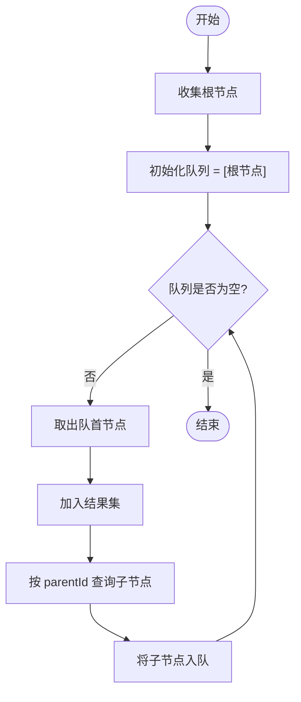
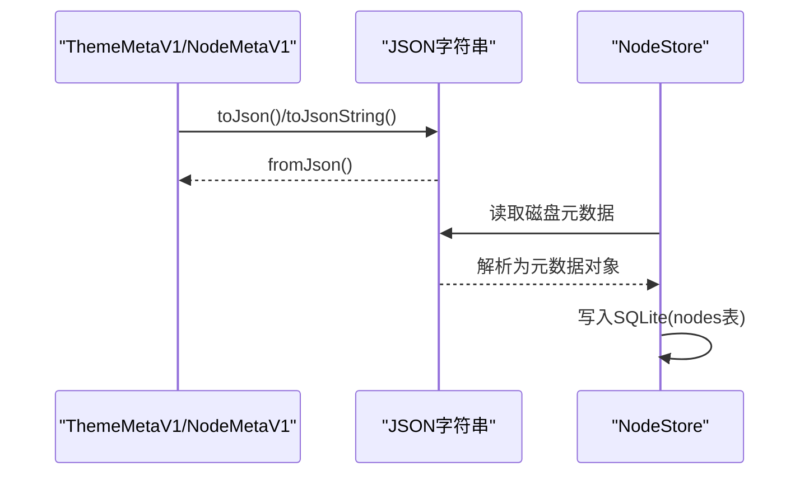
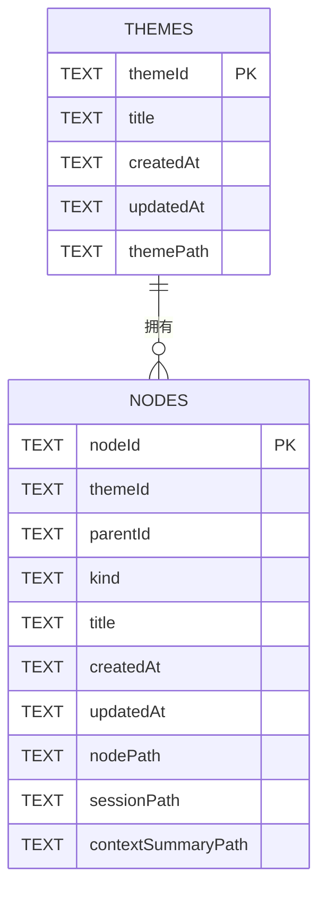
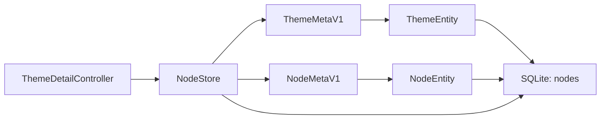

# 主题数据模型

<cite>
**本文引用的文件**
- [lib/domain/theme.dart](file://lib/domain/theme.dart)
- [lib/data/models/theme_meta.dart](file://lib/data/models/theme_meta.dart)
- [lib/domain/node.dart](file://lib/domain/node.dart)
- [lib/data/models/node_meta.dart](file://lib/data/models/node_meta.dart)
- [lib/data/services/app_database.dart](file://lib/data/services/app_database.dart)
- [lib/data/stores/node_store.dart](file://lib/data/stores/node_store.dart)
- [test/data/models/theme_meta_test.dart](file://test/data/models/theme_meta_test.dart)
- [test/data/models/node_meta_test.dart](file://test/data/models/node_meta_test.dart)
- [docs/storage-format.md](file://docs/storage-format.md)
- [docs/design.md](file://docs/design.md)
- [tools/print_db_tree.py](file://tools/print_db_tree.py)
- [tools/repair_index_from_disk.py](file://tools/repair_index_from_disk.py)
- [lib/ui/features/themes/theme_detail_controller.dart](file://lib/ui/features/themes/theme_detail_controller.dart)
</cite>

## 目录
1. [简介](#简介)
2. [项目结构](#项目结构)
3. [核心组件](#核心组件)
4. [架构总览](#架构总览)
5. [详细组件分析](#详细组件分析)
6. [依赖关系分析](#依赖关系分析)
7. [性能考量](#性能考量)
8. [故障排查指南](#故障排查指南)
9. [结论](#结论)
10. [附录](#附录)

## 简介
本文件系统性地文档化“主题数据模型”，涵盖主题实体的数据结构与字段定义、主题与节点的关系映射（一对多与层级结构）、序列化与反序列化机制（JSON 与存储格式转换）、索引与查询优化策略，并提供扩展模型、新增字段与自定义验证规则的实践指引。同时面向初学者解释数据模型设计原则与 ORM 概念，为高级开发者提供数据迁移与版本兼容方案。

## 项目结构
主题数据模型相关代码主要分布在以下层次：
- domain 层：纯数据实体（ThemeEntity、NodeEntity、NodeKind）
- data/models 层：版本化的元数据模型（ThemeMetaV1、NodeMetaV1），负责 JSON 序列化/反序列化
- data/services 层：SQLite 数据库服务（AppDatabase），定义主题与节点表结构及索引
- data/stores 层：NodeStore，负责磁盘扫描、重建索引、节点 CRUD、树遍历与路径解析
- docs：存储契约与设计原则（storage-format.md、design.md）
- tools：数据库树打印与索引修复工具
- ui：主题详情控制器，驱动主题与节点加载流程

图表来源
- [lib/domain/theme.dart:1-15](file://lib/domain/theme.dart#L1-L15)
- [lib/data/models/theme_meta.dart:1-61](file://lib/data/models/theme_meta.dart#L1-L61)
- [lib/domain/node.dart:1-30](file://lib/domain/node.dart#L1-L30)
- [lib/data/models/node_meta.dart:1-83](file://lib/data/models/node_meta.dart#L1-L83)
- [lib/data/services/app_database.dart:1-47](file://lib/data/services/app_database.dart#L1-L47)
- [lib/data/stores/node_store.dart:1-414](file://lib/data/stores/node_store.dart#L1-L414)
- [docs/storage-format.md:1-350](file://docs/storage-format.md#L1-L350)
- [docs/design.md:1-165](file://docs/design.md#L1-L165)
- [tools/print_db_tree.py:1-149](file://tools/print_db_tree.py#L1-L149)
- [tools/repair_index_from_disk.py:78-125](file://tools/repair_index_from_disk.py#L78-L125)
- [lib/ui/features/themes/theme_detail_controller.dart:1-49](file://lib/ui/features/themes/theme_detail_controller.dart#L1-L49)

章节来源
- [lib/domain/theme.dart:1-15](file://lib/domain/theme.dart#L1-L15)
- [lib/data/models/theme_meta.dart:1-61](file://lib/data/models/theme_meta.dart#L1-L61)
- [lib/domain/node.dart:1-30](file://lib/domain/node.dart#L1-L30)
- [lib/data/models/node_meta.dart:1-83](file://lib/data/models/node_meta.dart#L1-L83)
- [lib/data/services/app_database.dart:1-47](file://lib/data/services/app_database.dart#L1-L47)
- [lib/data/stores/node_store.dart:1-414](file://lib/data/stores/node_store.dart#L1-L414)
- [docs/storage-format.md:1-350](file://docs/storage-format.md#L1-L350)
- [docs/design.md:1-165](file://docs/design.md#L1-L165)
- [tools/print_db_tree.py:1-149](file://tools/print_db_tree.py#L1-L149)
- [tools/repair_index_from_disk.py:78-125](file://tools/repair_index_from_disk.py#L78-L125)
- [lib/ui/features/themes/theme_detail_controller.dart:1-49](file://lib/ui/features/themes/theme_detail_controller.dart#L1-L49)

## 核心组件
- 主题实体 ThemeEntity：包含主题标识、标题、创建时间与更新时间等核心属性，作为领域层纯数据结构。
- 主题元数据 ThemeMetaV1：承载磁盘上的 theme.meta.json 结构，提供 JSON 序列化/反序列化与实体转换。
- 节点实体 NodeEntity 与节点类型 NodeKind：描述节点归属主题、父子关系、类型（聊天/摘要）、标题与时间戳。
- 节点元数据 NodeMetaV1：承载磁盘上的 node.meta.json 结构，提供 JSON 序列化/反序列化与实体转换。
- SQLite 表结构与索引：themes 与 nodes 表，以及 nodes 上的主题+父节点复合索引。
- NodeStore：负责从磁盘扫描节点、重建 nodes 索引、查询主题/节点行、树遍历与路径解析。
- 文档契约：storage-format.md 与 design.md 明确了磁盘布局、JSON schema、索引策略与重建机制。

章节来源
- [lib/domain/theme.dart:1-15](file://lib/domain/theme.dart#L1-L15)
- [lib/data/models/theme_meta.dart:1-61](file://lib/data/models/theme_meta.dart#L1-L61)
- [lib/domain/node.dart:1-30](file://lib/domain/node.dart#L1-L30)
- [lib/data/models/node_meta.dart:1-83](file://lib/data/models/node_meta.dart#L1-L83)
- [lib/data/services/app_database.dart:1-47](file://lib/data/services/app_database.dart#L1-L47)
- [lib/data/stores/node_store.dart:1-414](file://lib/data/stores/node_store.dart#L1-L414)
- [docs/storage-format.md:1-350](file://docs/storage-format.md#L1-L350)
- [docs/design.md:1-165](file://docs/design.md#L1-L165)

## 架构总览
主题与节点遵循“磁盘真相源 + SQLite 索引”的架构：磁盘上的 theme.meta.json 与 node.meta.json 是事实来源，SQLite 仅用于索引与查询加速，可随时删除并从磁盘重建。写入采用单写者策略，确保并发安全；重建索引流程支持全量扫描与修复。

图表来源
- [lib/ui/features/themes/theme_detail_controller.dart:25-44](file://lib/ui/features/themes/theme_detail_controller.dart#L25-L44)
- [lib/data/stores/node_store.dart:18-59](file://lib/data/stores/node_store.dart#L18-L59)
- [lib/data/stores/node_store.dart:86-110](file://lib/data/stores/node_store.dart#L86-L110)
- [docs/design.md:111-123](file://docs/design.md#L111-L123)

## 详细组件分析

### 主题实体与元数据模型
- ThemeEntity：主题标识、标题、UTC ISO8601 创建/更新时间。
- ThemeMetaV1：JSON schema 为 theme_meta/v1，包含主题元数据字段，提供 toJson()/fromJson() 与 toEntity() 转换。
- 验证与错误处理：fromJson 使用模式匹配与显式类型检查，对未知 schema 与字段缺失抛出异常；单元测试覆盖 roundtrip、schema 字段、类型校验与实体转换。

图表来源
- [lib/domain/theme.dart:1-15](file://lib/domain/theme.dart#L1-L15)
- [lib/data/models/theme_meta.dart:5-59](file://lib/data/models/theme_meta.dart#L5-L59)

章节来源
- [lib/domain/theme.dart:1-15](file://lib/domain/theme.dart#L1-L15)
- [lib/data/models/theme_meta.dart:1-61](file://lib/data/models/theme_meta.dart#L1-L61)
- [test/data/models/theme_meta_test.dart:1-79](file://test/data/models/theme_meta_test.dart#L1-L79)
- [docs/storage-format.md:73-94](file://docs/storage-format.md#L73-L94)

### 节点实体与元数据模型
- NodeEntity：包含 themeId、nodeId、parentId（可空，根节点为 null）、NodeKind、标题与时间戳。
- NodeKind：枚举类型，支持 chat 与 summary。
- NodeMetaV1：JSON schema 为 node_meta/v1，包含节点元数据字段，提供 toJson()/fromJson() 与 toEntity() 转换。
- 验证与错误处理：fromJson 对 kind 进行枚举校验，未知值抛出异常；单元测试覆盖 roundtrip、schema 字段、kind 校验与实体转换。

图表来源
- [lib/domain/node.dart:1-30](file://lib/domain/node.dart#L1-L30)
- [lib/data/models/node_meta.dart:5-81](file://lib/data/models/node_meta.dart#L5-L81)

章节来源
- [lib/domain/node.dart:1-30](file://lib/domain/node.dart#L1-L30)
- [lib/data/models/node_meta.dart:1-83](file://lib/data/models/node_meta.dart#L1-L83)
- [test/data/models/node_meta_test.dart:1-113](file://test/data/models/node_meta_test.dart#L1-L113)
- [docs/storage-format.md:95-119](file://docs/storage-format.md#L95-L119)

### 主题与节点的关系映射
- 一对多关系：一个主题可包含多个节点；节点通过 parentId 建立父子层级关系，根节点 parentId 为 null。
- 层级结构：NodeStore 提供子树节点收集方法，基于 parentId 查询子节点，使用广度优先遍历构建子树列表。
- 实体转换：NodeMetaV1.toEntity()/ThemeMetaV1.toEntity() 将元数据模型转换为领域实体，便于上层使用。

图表来源
- [lib/data/stores/node_store.dart:237-257](file://lib/data/stores/node_store.dart#L237-L257)

章节来源
- [lib/data/stores/node_store.dart:237-257](file://lib/data/stores/node_store.dart#L237-L257)
- [lib/domain/node.dart:10-28](file://lib/domain/node.dart#L10-L28)

### 序列化与反序列化机制
- JSON 格式：ThemeMetaV1/NodeMetaV1 的 toJson() 输出包含 schema 字段与核心属性；toJsonString() 提供缩进格式化输出。
- 反序列化：fromJson() 使用模式匹配与类型断言，严格校验 schema 与字段类型；未知 schema 或字段缺失抛出异常。
- 存储格式转换：NodeStore 在创建节点时，先写入磁盘的 node.meta.json 与 session.md，再写入 SQLite 的 nodes 表；读取时可从 DB 或磁盘重建索引。
- 单元测试：覆盖 roundtrip、schema 字段、类型校验与实体转换，确保序列化/反序列化正确性。

图表来源
- [lib/data/models/theme_meta.dart:18-49](file://lib/data/models/theme_meta.dart#L18-L49)
- [lib/data/models/node_meta.dart:24-68](file://lib/data/models/node_meta.dart#L24-L68)
- [lib/data/stores/node_store.dart:112-204](file://lib/data/stores/node_store.dart#L112-L204)

章节来源
- [lib/data/models/theme_meta.dart:18-49](file://lib/data/models/theme_meta.dart#L18-L49)
- [lib/data/models/node_meta.dart:24-68](file://lib/data/models/node_meta.dart#L24-L68)
- [lib/data/stores/node_store.dart:112-204](file://lib/data/stores/node_store.dart#L112-L204)
- [test/data/models/theme_meta_test.dart:1-79](file://test/data/models/theme_meta_test.dart#L1-L79)
- [test/data/models/node_meta_test.dart:1-113](file://test/data/models/node_meta_test.dart#L1-L113)

### 索引与查询优化策略
- SQLite 表结构：themes 表包含主题主键与路径；nodes 表包含节点主键、主题关联、父子关系、类型、标题与时间戳，以及 nodePath/sessionPath/contextSummaryPath 等路径字段。
- 复合索引：nodes(themeId, parentId) 支持按主题与父节点快速查询子节点，提升树遍历效率。
- 查询路径：NodeStore.listNodes(themeId) 按主题查询节点并按创建时间排序；getNodeRow/getThemeRow 提供按 nodeId/themeId 的精确查询。
- 重建索引：reindexNodesFromDisk 扫描主题下的 nodes 目录，批量写入/更新 nodes 表；repair_index_from_disk.py 提供从磁盘全量重建索引的能力。
- 设计原则：SQLite 可随时重建，写入顺序建议“先文件后索引”，失败不影响正文落盘，允许后续 reindex 修复。

图表来源
- [lib/data/services/app_database.dart:20-46](file://lib/data/services/app_database.dart#L20-L46)
- [lib/data/stores/node_store.dart:18-59](file://lib/data/stores/node_store.dart#L18-L59)
- [docs/design.md:93-108](file://docs/design.md#L93-L108)

章节来源
- [lib/data/services/app_database.dart:20-46](file://lib/data/services/app_database.dart#L20-L46)
- [lib/data/stores/node_store.dart:86-110](file://lib/data/stores/node_store.dart#L86-L110)
- [lib/data/stores/node_store.dart:237-257](file://lib/data/stores/node_store.dart#L237-L257)
- [docs/design.md:93-108](file://docs/design.md#L93-L108)

### 数据模型扩展与自定义验证
- 扩展主题模型：在 ThemeEntity 基础上增加新字段（如颜色、图标等），并在 ThemeMetaV1 中同步新增 JSON 字段与序列化逻辑；保持 schema 版本号递增并在 storage-format.md 中补充定义。
- 扩展节点模型：在 NodeEntity 基础上增加新字段（如标签、优先级等），并在 NodeMetaV1 中同步新增 JSON 字段与序列化逻辑；确保 fromJson() 对新字段进行类型校验与默认值处理。
- 自定义验证规则：在 fromJson() 中增加字段合法性检查（如长度、格式、枚举值），对非法输入抛出异常；在 NodeStore 写入前进行业务规则校验（如父子关系一致性、路径有效性）。
- 版本迁移：参考 storage-format.md 的版本升级流程，先完善 v(N+1) 定义，再实现磁盘与索引的迁移算法，最后更新写入逻辑。

章节来源
- [lib/domain/theme.dart:1-15](file://lib/domain/theme.dart#L1-L15)
- [lib/data/models/theme_meta.dart:18-49](file://lib/data/models/theme_meta.dart#L18-L49)
- [lib/domain/node.dart:1-30](file://lib/domain/node.dart#L1-L30)
- [lib/data/models/node_meta.dart:24-68](file://lib/data/models/node_meta.dart#L24-L68)
- [docs/storage-format.md:343-350](file://docs/storage-format.md#L343-L350)

### 初学者指南：数据模型设计原则与 ORM 概念
- 数据模型设计原则：单一职责、不可变性（final 字段）、强类型与显式校验、版本化（schema）与向后兼容。
- ORM 概念：将对象映射到关系型数据库表，通过模型类操作数据；在本项目中，ThemeEntity/NodeEntity 为领域模型，ThemeMetaV1/NodeMetaV1 为持久化模型，AppDatabase/NodeStore 负责映射与访问。
- 最佳实践：使用工厂构造函数 fromJson() 与 toJson() 方法；在存储层进行事务控制与批量写入；在 UI 层通过 Riverpod 等状态管理组合存储与服务。

章节来源
- [lib/domain/theme.dart:1-15](file://lib/domain/theme.dart#L1-L15)
- [lib/data/models/theme_meta.dart:18-49](file://lib/data/models/theme_meta.dart#L18-L49)
- [lib/domain/node.dart:1-30](file://lib/domain/node.dart#L1-L30)
- [lib/data/models/node_meta.dart:24-68](file://lib/data/models/node_meta.dart#L24-L68)
- [docs/design.md:19-46](file://docs/design.md#L19-L46)

## 依赖关系分析
- 主题与节点：themes 与 nodes 通过 themeId 关联；nodes 通过 parentId 建立父子层级。
- 模型与存储：ThemeMetaV1/NodeMetaV1 与 SQLite 表结构一一对应；NodeStore 负责磁盘扫描与索引重建。
- UI 与存储：ThemeDetailController 通过 NodeStore 获取主题与节点数据，驱动界面渲染。

图表来源
- [lib/data/models/theme_meta.dart:51-58](file://lib/data/models/theme_meta.dart#L51-L58)
- [lib/data/models/node_meta.dart:70-80](file://lib/data/models/node_meta.dart#L70-L80)
- [lib/data/services/app_database.dart:20-46](file://lib/data/services/app_database.dart#L20-L46)
- [lib/data/stores/node_store.dart:12-17](file://lib/data/stores/node_store.dart#L12-L17)
- [lib/ui/features/themes/theme_detail_controller.dart:29-44](file://lib/ui/features/themes/theme_detail_controller.dart#L29-L44)

章节来源
- [lib/data/models/theme_meta.dart:51-58](file://lib/data/models/theme_meta.dart#L51-L58)
- [lib/data/models/node_meta.dart:70-80](file://lib/data/models/node_meta.dart#L70-L80)
- [lib/data/services/app_database.dart:20-46](file://lib/data/services/app_database.dart#L20-L46)
- [lib/data/stores/node_store.dart:12-17](file://lib/data/stores/node_store.dart#L12-L17)
- [lib/ui/features/themes/theme_detail_controller.dart:29-44](file://lib/ui/features/themes/theme_detail_controller.dart#L29-L44)

## 性能考量
- 索引设计：nodes(themeId, parentId) 复合索引显著提升树遍历与按主题查询的性能。
- 批量写入：reindexNodesFromDisk 使用事务批量插入/更新，减少多次提交开销。
- 读写顺序：建议“先文件后索引”，避免索引失败影响正文落盘；失败时记录错误并允许后续 reindex 修复。
- 查询优化：按主题过滤、按创建时间排序、必要时使用 LIMIT 控制结果集大小。

章节来源
- [lib/data/services/app_database.dart:45](file://lib/data/services/app_database.dart#L45)
- [lib/data/stores/node_store.dart:18-59](file://lib/data/stores/node_store.dart#L18-L59)
- [docs/design.md:105-108](file://docs/design.md#L105-L108)

## 故障排查指南
- DB 缺失/陈旧：ThemeDetailController 在加载主题时会触发 reindex；若 DB 不存在或版本不匹配，将从磁盘重建索引。
- DB 命中但路径失效：getSessionPathForNode 逻辑在 DB 命中后检查文件是否存在，若不存在则回退到文件系统扫描并记录日志。
- 单文件解析失败：NodeStore 在扫描节点时跳过异常节点，避免全量失败；repair_index_from_disk.py 提供全量重建能力并自动备份数据库。
- 工具辅助：print_db_tree.py 可打印数据库中的主题与节点树，便于核对索引与磁盘一致性。

章节来源
- [lib/ui/core/app_services.dart:98-120](file://lib/ui/core/app_services.dart#L98-L120)
- [lib/data/stores/node_store.dart:18-59](file://lib/data/stores/node_store.dart#L18-L59)
- [tools/print_db_tree.py:123-141](file://tools/print_db_tree.py#L123-L141)
- [tools/repair_index_from_disk.py:119-125](file://tools/repair_index_from_disk.py#L119-L125)

## 结论
主题数据模型以磁盘真相源为核心，结合 SQLite 索引实现高效查询与可恢复性。通过版本化的 JSON 元数据模型与严格的序列化/反序列化流程，确保数据一致性与可演进性。复合索引与批量事务写入保障了性能，而重建索引与工具链提供了强大的容错与运维能力。扩展模型时应遵循 schema 版本化、向后兼容与严格验证的原则，确保长期可维护性。

## 附录
- 存储契约与设计原则：参见 storage-format.md 与 design.md。
- 代码示例路径（不展示具体代码内容）：
  - 主题元数据序列化/反序列化：[lib/data/models/theme_meta.dart:18-49](file://lib/data/models/theme_meta.dart#L18-L49)
  - 节点元数据序列化/反序列化：[lib/data/models/node_meta.dart:24-68](file://lib/data/models/node_meta.dart#L24-L68)
  - SQLite 表结构与索引：[lib/data/services/app_database.dart:20-46](file://lib/data/services/app_database.dart#L20-L46)
  - 重建索引与树遍历：[lib/data/stores/node_store.dart:18-59](file://lib/data/stores/node_store.dart#L18-L59), [lib/data/stores/node_store.dart:237-257](file://lib/data/stores/node_store.dart#L237-L257)
  - 从磁盘修复索引：[tools/repair_index_from_disk.py:119-125](file://tools/repair_index_from_disk.py#L119-L125)
  - 主题详情加载流程：[lib/ui/features/themes/theme_detail_controller.dart:29-44](file://lib/ui/features/themes/theme_detail_controller.dart#L29-L44)